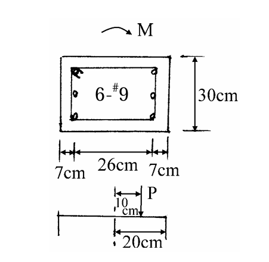

# 考題編號：RC-2002-2

**主分類：** `RC-U1-2` RC 柱強度分析與設計
**副分類：** 無
**設計法：** USD 強度設計法
**標籤：** `偏心受壓` `P-M互制` `6-#9` `e=10cm` `Pn Mn` `應變相容` `壓力控制斷面` `f'c=280` `中排鋼筋力矩臂為零`

---

## 1. 原始題目重述 (Problem Restatement)

**題目（20 分）：**

一柱斷面如圖所示，若作用於此斷面上軸壓力之偏心距 e = 10 cm，試求此時斷面所能承受之軸力 Pn 及彎矩 Mn。

**已知條件：**
- f'c = 280 kgf/cm²，fy = 4200 kgf/cm²
- #9 截面積 = 6.47 cm²，配置 6-#9
- Es = 2,040,000 kgf/cm²（由 εy = fy/Es 推算）

**斷面幾何（由附圖讀取）：**
- h = 40 cm（彎矩方向；圖中水平方向標示 7+26+7=40 cm）
- b = 30 cm（垂直方向）
- d' = 7 cm（壓力側鋼筋至壓力面距離）
- d = h − d' = 40 − 7 = **33 cm**（拉力側有效深度）
- h/2 = **20 cm**（幾何形心，與圖中下方 20 cm 示意一致）
- e = 10 cm（軸力自形心的偏心距）

**鋼筋配置：**

| 位置 | 根數 | 至壓力面距離 | 面積 |
|------|------|------------|------|
| 壓力側 (As') | 2-#9 | d' = 7 cm | As' = 12.94 cm² |
| 中間側 (As_m) | 2-#9 | h/2 = 20 cm | As_m = 12.94 cm² |
| 拉力側 (As) | 2-#9 | d = 33 cm | As = 12.94 cm² |

*圖說：矩形柱 h=40 cm（彎矩方向）× b=30 cm；6-#9 對稱排列，壓力側 2 根（d'=7 cm）、中間 2 根（20 cm）、拉力側 2 根（d=33 cm）；偏心距 e=10 cm。下方示意圖中 20 cm 為形心至受力面之距離（h/2）。*

---

## 2. 考題核心精神與出題者意圖 (Core Concepts & Examiner's Intent)

**核心觀念：**
給定斷面的偏心距 e，利用應變相容法求解 P-M 互制點。題目考查：

1. 判斷大偏心 vs 小偏心（壓力控制 vs 拉力控制）
2. 假設中性軸位置 c，計算各排鋼筋應力
3. 中間鋼筋（位於幾何形心）在力矩方程中力臂 = 0，但在力平衡方程中仍需納入
4. 壓力側鋼筋在 Whitney 應力塊範圍內，需扣除 0.85f'c（避免重複計算混凝土）

**出題者意圖：**
- 測驗是否能正確判定壓力控制（e < e_b）
- 測驗三排配筋的完整力/力矩平衡建立
- 考查中間鋼筋的正確處理（力矩貢獻為零，但力平衡不可忽略）

---

## 3. 解題戰略地圖與陷阱分析 (Strategic Roadmap & Trap Analysis)

**作戰計畫：**
1. 計算 β₁（f'c = 280 kgf/cm²）
2. 計算平衡條件 c_b 與 e_b，判斷大/小偏心
3. 假設 c，建立力平衡與力矩方程，迭代求 c
4. 代入求 Pn、Mn

**關鍵陷阱：**

| # | 陷阱 | 應對 |
|---|------|------|
| ① | 中間鋼筋（h/2 = 20 cm）力矩臂 = h/2 − h/2 = 0，但力平衡不可省略 | 兩方程分開處理 |
| ② | 壓力側鋼筋若在應力塊內（d' < a），計算鋼筋力需扣 0.85f'c | Cs = A's(f's − 0.85f'c) |
| ③ | 中間鋼筋若在 a 與 c 之間（非應力塊但屬壓縮區），不扣 0.85f'c | 應力塊僅至 a |
| ④ | h 方向判斷：下方示意圖 20 cm = h/2 → h = 40 cm（非 30 cm）在彎矩方向 | 確認斷面方向 |

---

## 3.5 變數層次分析 (Variable Hierarchy Analysis)

> 複習提示：第一次解題後，在每個卡住的知識點旁標記 `⚠`；第二次複習時只看有 `⚠` 的項目。

### 最終目標
已知偏心距 e = 10 cm，求柱標稱軸力 Pn 與標稱彎矩 Mn。

### 本題關鍵公式（依計算順序）

$$\text{Step 1：} \quad \varepsilon_y = \frac{f_y}{E_s} = \frac{4200}{2{,}040{,}000}$$

$$\text{Step 2：} \quad c_b = \frac{6120}{6120 + f_y} \cdot d \quad \Rightarrow \quad e_b = \frac{M_{nb}}{P_{nb}}$$

$$\text{Step 3（各排鋼筋應變，假設 } c \text{）：} \quad \varepsilon'_s = 0.003 \cdot \frac{c - d'}{c}, \quad \varepsilon_s = 0.003 \cdot \frac{d - c}{c}, \quad \varepsilon_{sm} = 0.003 \cdot \frac{c - h/2}{c}$$

$$\text{Step 4（力平衡）：} \quad P_n = C_c + C_s + F_{sm} - T$$

$$\text{Step 5（對形心力矩，中間鋼筋臂=0）：} \quad M_n = C_c\!\left(\frac{h}{2} - \frac{a}{2}\right) + C_s\!\left(\frac{h}{2} - d'\right) - T\!\left(d - \frac{h}{2}\right)$$

$$\text{Step 6（驗證）：} \quad e_{check} = \frac{M_n}{P_n} \overset{?}{=} 10 \text{ cm}$$

$$\text{Step 7：} \quad M_n = P_n \times e$$

### L1：題目直接給定

| 符號 | 數值 | 說明 |
|------|------|------|
| h | 40 cm | 彎矩方向深度（7+26+7） |
| b | 30 cm | 垂直方向寬度 |
| d' | 7 cm | 壓力側鋼筋至壓力面 |
| d | 33 cm | 拉力側有效深度（h−d'） |
| e | 10 cm | 軸力偏心距（自形心） |
| f'c | 280 kgf/cm² | 混凝土強度 |
| fy | 4200 kgf/cm² | 鋼筋降伏強度 |
| A#9 | 6.47 cm² | 單根 #9 面積 |
| As' = As = As_m | 12.94 cm² | 各排 2 根 × 6.47 |

### L2：需知識點推導

**基本參數**

| 符號 | 公式／來源 | 卡關? |
|------|-----------|-------|
| β₁ | f'c = 280 ≤ 280 kgf/cm² → β₁ = 0.85 | |
| εy | 4200 / 2,040,000 = 0.002059 | |
| h/2 | 40/2 = 20 cm（形心位置） | |

**平衡點（判斷大/小偏心）**

| 符號 | 公式／來源 | 卡關? |
|------|-----------|-------|
| c_b | 6120/(6120+4200) × 33 = 19.57 cm | |
| ε'_s,b | 0.003×(19.57−7)/19.57 = 0.001927 < εy → 壓力筋未降伏 | |
| f'_s,b | 2,040,000 × 0.001927 = 3,931 kgf/cm² | |
| e_b | 以平衡點力矩/軸力計算 → 11.79 cm | |
| 判斷 | e=10 < e_b=11.79 → **壓力控制，c > c_b** | |

**迭代求解（c = 22.7 cm）**

| 符號 | 公式／來源 | 卡關? |
|------|-----------|-------|
| a | β₁×c = 0.85×22.7 = 19.30 cm | |
| ε'_s | 0.003×(22.7−7)/22.7 = 0.002075 > εy → **壓力筋降伏** | |
| f'_s | fy = 4,200 kgf/cm² | |
| εs | 0.003×(33−22.7)/22.7 = 0.001361 < εy → 拉力筋未降伏 | |
| fs | 2,040,000×0.001361 = 2,777 kgf/cm² | |
| εsm | 0.003×(22.7−20)/22.7 = 0.000357（壓縮，在 a~c 之間） | |
| fsm | 2,040,000×0.000357 = 728 kgf/cm²（壓縮，不扣0.85f'c） | |

### L3：深層知識（不懂就卡住）

| 知識點 | 說明 | 卡關? |
|--------|------|-------|
| Whitney 應力塊範圍 | 應力塊僅至 a = β₁c，非至 c；a~c 之間混凝土已在應力塊外 | |
| 中間鋼筋是否扣 0.85f'c | 中間鋼筋在 a~c（不在應力塊內）→ 不扣；若在 a 內才扣 | |
| e < e_b → 壓力控制 | 偏心小 → 壓力控制 → c > c_b；不可假設拉力筋降伏 | |
| 形心力矩方程的利用 | 對形心取矩可讓中間鋼筋項消失，簡化計算 | |

---

## 4. 步驟化詳細計算過程 (Step-by-Step Detailed Calculation)

### Step 1：基本材料參數

$$\beta_1 = 0.85 \quad (f'_c = 280 \leq 280 \text{ kgf/cm}^2)$$

$$\varepsilon_y = \frac{f_y}{E_s} = \frac{4200}{2{,}040{,}000} = 0.002059$$

### Step 2：平衡點計算，判斷大/小偏心

$$c_b = \frac{6120}{6120 + 4200} \times d = \frac{6120}{10320} \times 33 = 0.5930 \times 33 = \mathbf{19.57 \text{ cm}}$$

$$a_b = 0.85 \times 19.57 = 16.63 \text{ cm}$$

**壓力側鋼筋應變（平衡點）：**
$$\varepsilon'_{s,b} = 0.003 \times \frac{19.57 - 7}{19.57} = 0.001927 < \varepsilon_y \quad \Rightarrow \quad f'_{s,b} = 3{,}931 \text{ kgf/cm}^2$$

**中間鋼筋（平衡點，h/2 = 20 > c_b = 19.57 → 拉力側）：**
$$\varepsilon_{sm,b} = 0.003 \times \frac{20 - 19.57}{19.57} = 0.0000659 \quad \Rightarrow \quad f_{sm,b} = 134.4 \text{ kgf/cm}^2 \text{（拉力）}$$

**平衡點各力：**
$$C_{c,b} = 0.85 \times 280 \times 16.63 \times 30 = 118{,}802 \text{ kgf}$$
$$C_{s,b} = 12.94 \times (3{,}931 - 238) = 12.94 \times 3{,}693 = 47{,}797 \text{ kgf}$$
$$T_b = 12.94 \times 4{,}200 = 54{,}348 \text{ kgf}$$
$$T_{sm,b} = 12.94 \times 134.4 = 1{,}739 \text{ kgf（拉力）}$$

$$P_{nb} = 118{,}802 + 47{,}797 - 54{,}348 - 1{,}739 = 110{,}512 \text{ kgf}$$

**對形心取矩（中間鋼筋力臂 = 20−20 = 0）：**
$$M_{nb} = 118{,}802 \times \left(20 - \frac{16.63}{2}\right) + 47{,}797 \times (20 - 7) - 54{,}348 \times (33 - 20)$$
$$= 118{,}802 \times 11.685 + 47{,}797 \times 13 - 54{,}348 \times 13$$
$$= 1{,}388{,}228 + 621{,}361 - 706{,}524 = 1{,}303{,}065 \text{ kgf·cm}$$

$$\boxed{e_b = \frac{M_{nb}}{P_{nb}} = \frac{1{,}303{,}065}{110{,}512} = 11.79 \text{ cm}}$$

**判斷：** $e = 10 \text{ cm} < e_b = 11.79 \text{ cm}$ → **壓力控制（小偏心），c > c_b = 19.57 cm**

### Step 3：迭代求中性軸 c（假設 c = 22.7 cm）

$$a = 0.85 \times 22.7 = 19.30 \text{ cm}$$

**壓力側鋼筋（d' = 7 < a = 19.30 → 在應力塊內）：**
$$\varepsilon'_s = 0.003 \times \frac{22.7 - 7}{22.7} = 0.003 \times \frac{15.7}{22.7} = 0.002075 > \varepsilon_y$$
$$\Rightarrow f'_s = f_y = 4{,}200 \text{ kgf/cm}^2$$
$$C_s = A'_s \times (f'_s - 0.85 f'_c) = 12.94 \times (4{,}200 - 238) = 12.94 \times 3{,}962 = 51{,}268 \text{ kgf}$$

**拉力側鋼筋（d = 33 > c = 22.7 → 在拉力區）：**
$$\varepsilon_s = 0.003 \times \frac{33 - 22.7}{22.7} = 0.003 \times \frac{10.3}{22.7} = 0.001361 < \varepsilon_y$$
$$\Rightarrow f_s = 2{,}040{,}000 \times 0.001361 = 2{,}777 \text{ kgf/cm}^2$$
$$T = 12.94 \times 2{,}777 = 35{,}934 \text{ kgf}$$

**中間鋼筋（h/2 = 20 cm；a = 19.30 < 20 < c = 22.7 → 在 a~c 之間，壓縮區但非應力塊，不扣 0.85f'c）：**
$$\varepsilon_{sm} = 0.003 \times \frac{22.7 - 20}{22.7} = 0.003 \times \frac{2.7}{22.7} = 0.000357 \text{（壓縮）}$$
$$f_{sm} = 2{,}040{,}000 \times 0.000357 = 728 \text{ kgf/cm}^2 \text{（壓縮）}$$
$$F_{sm} = 12.94 \times 728 = 9{,}420 \text{ kgf（壓縮）}$$

**混凝土壓力：**
$$C_c = 0.85 \times 280 \times 19.30 \times 30 = 238 \times 19.30 \times 30 = 137{,}862 \text{ kgf}$$

### Step 4：力平衡求 Pn

$$P_n = C_c + C_s + F_{sm} - T$$
$$= 137{,}862 + 51{,}268 + 9{,}420 - 35{,}934$$
$$= \boxed{162{,}616 \text{ kgf} \approx 162.6 \text{ tf}}$$

### Step 5：對形心取矩求 Mn（驗證 e）

> 中間鋼筋力臂 = $h/2 - h/2 = 0$，對形心力矩貢獻為零。

$$M_n = C_c \times \left(\frac{h}{2} - \frac{a}{2}\right) + C_s \times \left(\frac{h}{2} - d'\right) - T \times \left(d - \frac{h}{2}\right)$$

$$= 137{,}862 \times \left(20 - \frac{19.30}{2}\right) + 51{,}268 \times (20 - 7) - 35{,}934 \times (33 - 20)$$

$$= 137{,}862 \times 10.35 + 51{,}268 \times 13 - 35{,}934 \times 13$$

$$= 1{,}426{,}872 + 666{,}484 - 467{,}142 = 1{,}626{,}214 \text{ kgf·cm}$$

**驗證偏心距：**
$$e_{check} = \frac{M_n}{P_n} = \frac{1{,}626{,}214}{162{,}616} = 10.00 \text{ cm} \checkmark$$

### 最終答案

$$\boxed{P_n \approx 162{,}600 \text{ kgf} = 162.6 \text{ tf}}$$

$$\boxed{M_n = P_n \times e = 162{,}600 \times 10 = 1{,}626{,}000 \text{ kgf·cm} = 16.26 \text{ tf·m}}$$

---

## 5. 關鍵爭議點與進階探討 (Critical Issues & Advanced Discussion)

**1. 中間鋼筋的處理（本題最重要陷阱）：**
- 對形心取矩：力臂 = 20 − 20 = 0 → 貢獻為零，可簡化力矩方程
- 但力平衡不可省略：F_sm = 9,420 kgf 壓力貢獻不小
- 若誤以為中間鋼筋可完全忽略，Pn 會低估約 9.4 tf（約 6% 誤差）

**2. 中間鋼筋是否扣 0.85f'c？**
- 中間鋼筋位於 a~c 之間（非 Whitney 應力塊範圍內的具體混凝土）
- 應力塊僅至 a = 19.30 cm，中間鋼筋在 20 cm > a
- → 不扣 0.85f'c，使用全部鋼筋壓力

**3. 壓力側鋼筋：本題剛好達到降伏**
- c = 22.7 cm，ε'_s = 0.002075，εy = 0.002059
- 壓力側鋼筋恰好在降伏邊界（差距僅 0.8%），可視為降伏
- 若 c 稍小，壓力筋未降伏，需用 f'_s = E_s × ε'_s

**4. 題目使用舊版 ACI（kgf/cm² 制）：**
- β₁ = 0.85（f'c = 280 kgf/cm² = 27.5 MPa ≤ 280 kgf/cm²）
- ρ_b 公式：6120/(6120+fy)（舊版 ACI 318-99 及早期 CNS 1480 形式）
- 本題答案不需計算 φ（題目問的是 Pn, Mn，非設計強度 φPn, φMn）
