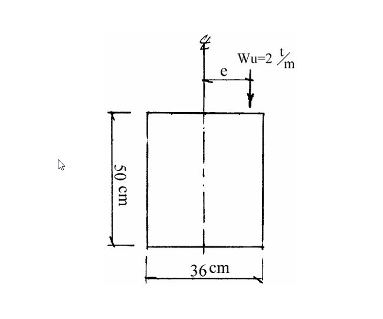

# 考題編號：RC-2002-3

**主分類：** `RC-U2-2` RC 扭力強度設計
**副分類：** 無
**設計法：** USD 強度設計法
**標籤：** `扭力忽略門檻` `偏心均佈載重` `最大偏心量e` `單端拘束` `tu×L扭矩圖` `矩形梁` `f'c=210` `ACI 318-89`

---

## 1. 原始題目重述 (Problem Restatement)

**題目（20 分）：**

有鋼筋混凝土矩形梁：
- 對垂直載重：跨度 λ = 8 m，兩端簡支
- 對扭轉：一端支座完全受拘束（fixed），另一端完全不受拘束（free）
- 梁承受偏心均佈設計載重 Wu = 2.0 t/m（偏心量為 e）
- 已知：f'c = 210 kgf/cm²，d = 45 cm
- 求：在不需考慮扭力影響下，最大偏心量 e 值

**斷面幾何（由附圖讀取）：**
- b = 36 cm（寬度）
- h = 50 cm（深度；d = 45 cm → 保護層至鋼筋心距 = 5 cm）



*圖說：矩形斷面 b=36 cm × h=50 cm；Wu = 2.0 t/m 作用在距截面剪力中心（形心）e 處，產生均佈扭矩 tu = Wu × e；扭轉邊界：左端完全固定（反力 T = tu×L），右端自由（T = 0）。*

---

## 2. 考題核心精神與出題者意圖 (Core Concepts & Examiner's Intent)

**核心觀念：**
本題考查兩個層面：
1. **扭矩圖的建立**：偏心均佈載重在「一端固定、一端自由」扭轉邊界條件下，最大扭矩在何處？數值為何？
2. **扭力忽略門檻**（ACI 318 閾值扭矩）：Tu ≤ φTc 時可忽略扭力效應。

**出題者意圖：**
- 測驗是否能正確建立非對稱扭轉邊界條件下的扭矩圖（最大值在固定端）
- 測驗是否記得 ACI 318 閾值扭矩公式（x²y 型舊版公式）
- 兩者聯立即可解出 e

---

## 3. 解題戰略地圖與陷阱分析 (Strategic Roadmap & Trap Analysis)

**作戰計畫：**
1. 建立扭矩分布（一端固定、一端自由，均佈扭矩 tu = Wu × e）
2. 求最大扭矩 Tu_max（在固定端）
3. 代入 ACI 閾值扭矩公式求 φTc
4. 令 Tu_max ≤ φTc，解出 e_max

**關鍵陷阱：**

| # | 陷阱 | 應對 |
|---|------|------|
| ① | 誤用兩端對稱邊界（Tu = tu×L/2），忽略一端自由的條件 | 一端固定、一端自由 → Tu_max = tu × L（全部扭矩由固定端承受） |
| ② | 閾值扭矩公式忘記 φ（0.85）| φTc = 0.5 × φ × √f'c × x²y/3，不可忽略 φ |
| ③ | x²y 中 x 取短邊（36 cm），y 取長邊（50 cm） | 不可把 b 和 h 互調 |
| ④ | Wu 單位換算：2 t/m = 20 kgf/cm | 混用 tf/m 和 kgf/cm 導致結果差 1000 倍 |

---

## 3.5 變數層次分析 (Variable Hierarchy Analysis)

> 複習提示：第一次解題後，在每個卡住的知識點旁標記 `⚠`；第二次複習時只看有 `⚠` 的項目。

### 最終目標
求偏心均佈載重 Wu = 2 t/m 在一端固定、一端自由梁中，可忽略扭力效應的最大偏心距 e_max。

### 本題關鍵公式（依計算順序）

$$\text{Step 1（均佈扭矩）：} \quad t_u = W_u \times e$$

$$\text{Step 2（最大扭矩，一端固定一端自由）：} \quad T_{u,\max} = t_u \times L = W_u \times e \times L$$

$$\text{Step 3（ACI 閾值扭矩）：} \quad \phi T_c = 0.5\,\phi\,\sqrt{f'_c} \cdot \frac{x^2 y}{3}$$

$$\text{Step 4（令 } T_{u,\max} = \phi T_c \text{，解 e）：} \quad e_{\max} = \frac{\phi T_c}{W_u \times L}$$

### L1：題目直接給定

| 符號 | 數值 | 說明 |
|------|------|------|
| L | 8 m = 800 cm | 跨度 |
| Wu | 2.0 t/m = 20 kgf/cm | 偏心均佈設計載重 |
| f'c | 210 kgf/cm² | 混凝土強度 |
| b | 36 cm | 梁寬（圖） |
| h | 50 cm | 梁深（圖） |
| d | 45 cm | 有效深度（題目給定） |
| 扭轉邊界 | 一端固定，一端自由 | 題目指定 |

### L2：需知識點推導

**均佈扭矩**

| 符號 | 公式／來源 | 卡關? |
|------|-----------|-------|
| tu | Wu × e = 20e kgf（kgf·cm/cm） | |
| Tu_max | tu × L（一端固定一端自由，固定端） = 20e × 800 = 16,000e kgf·cm | |

**ACI 閾值扭矩（ACI 318-89/95）**

| 符號 | 公式／來源 | 卡關? |
|------|-----------|-------|
| x | min(b, h) = 36 cm（短邊） | |
| y | max(b, h) = 50 cm（長邊） | |
| x²y | 36² × 50 = 64,800 cm³ | |
| φ | 0.85（扭力，舊版 ACI） | |
| φTc | 0.5 × 0.85 × √210 × 64,800/3 | |

### L3：深層知識（不懂就卡住）

| 知識點 | 說明 | 卡關? |
|--------|------|-------|
| 一端固定一端自由的扭矩圖 | 均佈扭矩下，固定端承受全部反力 T = tu×L；自由端 T = 0；中間線性變化 | |
| ACI 閾值扭矩公式版本差異 | ACI 318-89/95 用 0.5φ√f'c×Σx²y/3（舊）；ACI 318-99 用 φ√f'c/12×Acp²/pcp（新）；台灣2002年考試用舊版 | |
| x²y 的定義 | x 為截面各矩形部分短邊，y 為長邊；Σx²y 取各矩形之和；純矩形梁只有一項 | |
| 扭矩忽略門檻的物理意義 | Tu < 0.5φTcr（裂縫扭矩的一半），代表扭矩很小，可視為次要效應忽略 | |

---

## 4. 步驟化詳細計算過程 (Step-by-Step Detailed Calculation)

### Step 1：建立均佈扭矩 tu

偏心均佈設計載重 Wu 作用在距截面剪力中心偏心距 e 處，產生均佈扭矩：

$$t_u = W_u \times e = 20\,\frac{\text{kgf}}{\text{cm}} \times e\,\text{cm} = 20e\,\left[\frac{\text{kgf·cm}}{\text{cm}}\right]$$

### Step 2：建立扭矩圖，求 Tu_max

**邊界條件：** 一端完全拘束（扭轉固定端，提供扭矩反力），一端完全不拘束（扭轉自由端，無扭矩反力）

對整梁作扭轉平衡（均佈扭矩 tu，一端固定，一端自由）：

```
固定端 A ←─────────────── L=800 cm ───────────────→ 自由端 B
  T_A = tu×L                                              T_B = 0

扭矩圖（自 A 至 B）：
T(x) = tu × (L − x)
T(0) = tu × L ← 最大值（固定端）
T(L) = 0       （自由端）
```

$$T_{u,\max} = t_u \times L = 20e\,\text{kgf} \times 800\,\text{cm} = \boxed{16{,}000\,e\;\text{kgf·cm}}$$

（其中 e 單位為 cm）

### Step 3：計算 ACI 閾值扭矩 φTc

依 ACI 318-89/CNS 1480（舊版），純矩形截面，扭力可忽略之條件：

$$T_u \leq 0.5\,\phi\,\sqrt{f'_c} \cdot \frac{\Sigma x^2 y}{3}$$

**截面參數：**
- x = b = 36 cm（短邊）
- y = h = 50 cm（長邊）
- Σx²y = 36² × 50 = 1296 × 50 = 64,800 cm³
- φ = 0.85（舊版 ACI 扭力強度折減係數）
- √f'c = √210 = 14.49 kgf^0.5/cm

$$\phi T_c = 0.5 \times 0.85 \times 14.49 \times \frac{64{,}800}{3}$$

$$= 0.5 \times 0.85 \times 14.49 \times 21{,}600$$

$$= 0.425 \times 14.49 \times 21{,}600$$

$$= 0.425 \times 312{,}984$$

$$= \boxed{132{,}978\;\text{kgf·cm}}$$

### Step 4：令 Tu_max = φTc，解出 e_max

$$T_{u,\max} \leq \phi T_c$$

$$16{,}000\,e \leq 132{,}978$$

$$e \leq \frac{132{,}978}{16{,}000} = 8.31\;\text{cm}$$

$$\boxed{e_{\max} \approx 8.31\;\text{cm}}$$

**結論：** 當偏心量 e ≤ 8.31 cm 時，最大扭矩 Tu 不超過門檻扭矩 φTc，設計時可忽略扭力效應。

---

## 5. 關鍵爭議點與進階探討 (Critical Issues & Advanced Discussion)

**1. 為何固定端承受全部扭矩（Tu = tu × L），而非 tu × L/2？**

若兩端均為扭轉固定，各端各承受 tu×L/2（對稱）。但本題一端自由（無扭轉反力），全部均佈扭矩只能由固定端提供反力。因此固定端反力 T = tu × L，為最大扭矩。

**2. ACI 318 新舊版差異（本題重要背景）：**

| 版本 | 閾值公式（solid rectangle） | φTc（本題） |
|------|--------------------------|------------|
| ACI 318-89/95（舊） | 0.5φ√f'c × x²y/3 | 132,978 kgf·cm → e = 8.31 cm |
| ACI 318-99/02（新） | φ√f'c/12 × Acp²/pcp | 52,484 kgf·cm → e = 3.28 cm |

2002 年考試適用舊版（CNS 1480），採 e ≈ 8.31 cm。若用新版公式，閾值更嚴格（e ≈ 3.28 cm），差異顯著。

**3. d = 45 cm 在本題的用途：**
題目給定 d = 45 cm，但閾值扭矩公式使用 x²y（毛斷面尺寸），d 不直接出現。d 可能作為後續剪力設計的輸入，但本題只問扭力忽略條件，d 未直接使用。

**4. 若偏心量 e > 8.31 cm 需如何處理？**
需進行完整扭力設計：
- 計算 φTn = φ(Tc + Ts)
- 配置閉合箍筋（for torsion）與縱向扭力筋
- 同時驗算斷面適當性（剪力+扭力組合）
