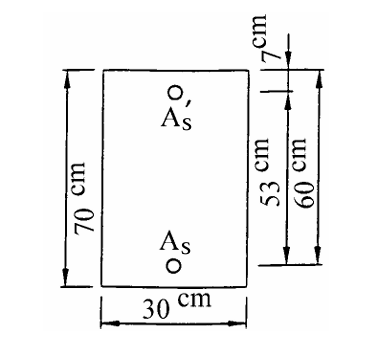

# 考題編號：RC-2002-4

**主分類：** `RC-U1-1` RC 梁彎矩強度分析與設計
**副分類：** 無
**設計法：** USD 強度設計法
**標籤：** `雙筋梁` `壓力鋼筋降伏驗證` `應變相容` `Whitney應力塊` `Mn計算` `f'c=350` `β₁=0.80` `高強度混凝土`

---

## 1. 原始題目重述 (Problem Restatement)

**題目（20 分）：**

一矩形 RC 梁斷面，試求此斷面之彎矩設計強度 Mn。

**已知條件（由題目與附圖）：**
- b = 30 cm，d = 60 cm，h = 70 cm，d' = 7 cm
- f'c = 350 kgf/cm²，fy = 4200 kgf/cm²，Es = 2,040,000 kgf/cm²
- As = 50.70 cm²（拉力側鋼筋）
- As' = 10.14 cm²（壓力側鋼筋）

**題目附帶參考公式（確認採用舊版 ACI 318 kgf/cm² 制）：**
$$\rho_b = 0.85\beta_1 \frac{f'_c}{f_y} \cdot \frac{6120}{6120+f_y}$$

$$A_{s,\min} = \frac{14}{f_y}b_w d \quad \text{或} \quad A_{s,\min} = \frac{0.8\sqrt{f'_c}}{f_y}b_w d$$

*圖說：矩形斷面 b=30 cm × h=70 cm；壓力側 As' 在距頂面 d'=7 cm 處；拉力側 As 在 d=60 cm（兩排鋼筋中心距 = 53 cm）；f'c=350 kgf/cm²，fy=4200 kgf/cm²，Es=2,040,000 kgf/cm²。*

---

## 2. 考題核心精神與出題者意圖 (Core Concepts & Examiner's Intent)

**核心觀念：**
本題為「高強度混凝土（f'c=350）雙筋梁 Mn 計算」。重點在於：

1. **β₁ 的正確取值**：f'c = 350 kgf/cm² > 280 kgf/cm²，β₁ 需依公式遞減（不可直接用 0.85）
2. **先假設壓力筋降伏，再驗証**：假設 f's = fy → 求 a → 求 c → 驗算 ε'_s ≥ εy
3. 若壓力筋未降伏，需聯立方程式重解（本題恰好略微超過降伏）

**出題者意圖：**
- 測驗 β₁ 隨 f'c 遞減的規則（高強混凝土考點）
- 測驗雙筋梁的完整計算流程（假設驗算）
- 鋼筋量比例大（As 很大）：測驗是否符合 ρ ≤ 0.75ρb 延性要求

---

## 3. 解題戰略地圖與陷阱分析 (Strategic Roadmap & Trap Analysis)

**作戰計畫：**
1. 計算 β₁（f'c = 350 > 280，需修正）
2. 假設 f's = fy，力平衡求 a
3. 由 a 求 c = a/β₁，驗算 ε'_s ≥ εy
4. 若驗算通過，計算 Mn（對拉力筋取矩或對中性軸取矩均可）
5. 延性驗核：ρ - ρ' ≤ 0.75ρb

**關鍵陷阱：**

| # | 陷阱 | 應對 |
|---|------|------|
| ① | f'c = 350 kgf/cm²，直接取 β₁ = 0.85 | 需修正：β₁ = 0.85 − 0.05×(350−280)/70 = 0.80 |
| ② | 壓力筋力計算忘記扣 0.85f'c（應力塊已計入該區混凝土） | Cs = As'×(f's − 0.85f'c)，不是 As'×f's |
| ③ | 驗算 ε'_s 用 d' 對應位置，而非 d | ε'_s = 0.003×(c−d')/c，d' = 7 cm |
| ④ | 延性驗核忘記做：ρ − ρ'(f's/fy) ≤ 0.75ρb | 本題剛好滿足延性要求 |

---

## 3.5 變數層次分析 (Variable Hierarchy Analysis)

> 複習提示：第一次解題後，在每個卡住的知識點旁標記 `⚠`；第二次複習時只看有 `⚠` 的項目。

### 最終目標
求矩形雙筋梁的標稱彎矩強度 Mn。

### 本題關鍵公式（依計算順序）

$$\text{Step 1：}\quad \beta_1 = 0.85 - 0.05 \cdot \frac{f'_c - 280}{70} \quad (f'_c > 280 \text{ kgf/cm}^2)$$

$$\text{Step 2（假設 } f'_s = f_y \text{，力平衡）：}\quad a = \frac{A_s f_y - A'_s(f_y - 0.85f'_c)}{0.85 f'_c \cdot b}$$

$$\text{Step 3（求 c，驗算壓力筋）：}\quad c = \frac{a}{\boxed{\beta_1}},\quad \varepsilon'_s = 0.003 \cdot \frac{c - d'}{c} \geq \varepsilon_y \;?$$

$$\text{Step 4（標稱彎矩）：}\quad M_n = C_c\!\left(d - \frac{a}{2}\right) + C_s\!\left(d - d'\right)$$

$$\text{Step 5（延性驗核）：}\quad \rho_b = 0.85\beta_1 \frac{f'_c}{f_y} \cdot \frac{6120}{6120+f_y}, \quad \rho - \rho' \leq 0.75\rho_b$$

### L1：題目直接給定

| 符號 | 數值 | 說明 |
|------|------|------|
| b | 30 cm | 梁寬 |
| d | 60 cm | 有效深度（拉力筋中心至頂面） |
| d' | 7 cm | 壓力筋至頂面 |
| f'c | 350 kgf/cm² | 混凝土強度 |
| fy | 4200 kgf/cm² | 鋼筋降伏強度 |
| Es | 2,040,000 kgf/cm² | 鋼筋彈性模數 |
| As | 50.70 cm² | 拉力側鋼筋面積 |
| As' | 10.14 cm² | 壓力側鋼筋面積 |

### L2：需知識點推導

**材料參數**

| 符號 | 公式／來源 | 卡關? |
|------|-----------|-------|
| β₁ | 0.85 − 0.05×(350−280)/70 = **0.80** | |
| εy | 4200 / 2,040,000 = 0.002059 | |

**假設壓力筋降伏，力平衡求 a**

| 符號 | 公式／來源 | 卡關? |
|------|-----------|-------|
| Cc | 0.85 × 350 × a × 30 = 8925a（kgf） | |
| Cs | As' × (fy − 0.85f'c) = 10.14 × 3902.5 = 39,571 kgf | |
| T | As × fy = 50.70 × 4200 = 212,940 kgf | |
| a | (T − Cs) / (0.85f'c × b) = (212,940 − 39,571)/8925 = **19.43 cm** | |

**驗算壓力筋應變**

| 符號 | 公式／來源 | 卡關? |
|------|-----------|-------|
| c | a/β₁ = 19.43/0.80 = **24.29 cm** | |
| ε'_s | 0.003×(24.29−7)/24.29 = 0.002135 > εy = 0.002059 ✓ | |
| εs | 0.003×(60−24.29)/24.29 = 0.00441 > εy ✓ | |

**Mn 計算**

| 符號 | 公式／來源 | 卡關? |
|------|-----------|-------|
| Cc | 0.85 × 350 × 19.43 × 30 = 173,390 kgf | |
| Mn | Cc×(d−a/2) + Cs×(d−d') | |

### L3：深層知識（不懂就卡住）

| 知識點 | 說明 | 卡關? |
|--------|------|-------|
| β₁ 遞減規則（高強混凝土） | f'c > 280 kgf/cm² 時，每增加 70 kgf/cm²（≈1000 psi），β₁ 遞減 0.05；最小值 0.65 | |
| 壓力筋的「淨力」= f's − 0.85f'c | 壓力筋佔用的混凝土面積已在 Cc 中被計算，故鋼筋力需扣除 0.85f'c 避免重複 | |
| 雙筋梁延性驗核 | ρ − ρ'(f's/fy) ≤ 0.75ρb；等效為「有效的拉力筋」不得超過延性上限 | |

---

## 4. 步驟化詳細計算過程 (Step-by-Step Detailed Calculation)

### Step 1：計算 β₁

f'c = 350 kgf/cm² > 280 kgf/cm²，需依公式修正：

$$\beta_1 = 0.85 - 0.05 \times \frac{f'_c - 280}{70} = 0.85 - 0.05 \times \frac{350 - 280}{70} = 0.85 - 0.05 \times 1.0 = \boxed{0.80}$$

### Step 2：假設壓力筋降伏（f's = fy），力平衡求 a

各力表達式：
- $C_c = 0.85 \times 350 \times a \times 30 = 8{,}925a \text{ kgf}$
- $C_s = A'_s \times (f_y - 0.85f'_c) = 10.14 \times (4{,}200 - 297.5) = 10.14 \times 3{,}902.5 = 39{,}571\text{ kgf}$
- $T = A_s \times f_y = 50.70 \times 4{,}200 = 212{,}940\text{ kgf}$

力平衡 $C_c + C_s = T$：
$$8{,}925a + 39{,}571 = 212{,}940$$
$$8{,}925a = 173{,}369$$
$$\boxed{a = 19.43\text{ cm}}$$

### Step 3：求 c，驗算壓力筋應變

$$c = \frac{a}{\beta_1} = \frac{19.43}{0.80} = \boxed{24.29\text{ cm}}$$

**壓力筋應變：**
$$\varepsilon'_s = 0.003 \times \frac{c - d'}{c} = 0.003 \times \frac{24.29 - 7}{24.29} = 0.003 \times \frac{17.29}{24.29} = 0.002135$$

$$\varepsilon_y = \frac{f_y}{E_s} = \frac{4{,}200}{2{,}040{,}000} = 0.002059$$

$$\varepsilon'_s = 0.002135 > \varepsilon_y = 0.002059 \quad \Rightarrow \quad \text{壓力筋已降伏} \checkmark \quad (f'_s = f_y = 4{,}200\text{ kgf/cm}^2)$$

> 本題 ε'_s 僅略大於 εy（差距 3.7%），需確實驗算，不可直接假設。

**拉力筋應變（驗算已降伏）：**
$$\varepsilon_s = 0.003 \times \frac{d - c}{c} = 0.003 \times \frac{60 - 24.29}{24.29} = 0.003 \times 1.471 = 0.004413 > \varepsilon_y \checkmark$$

### Step 4：計算 Mn

$$C_c = 0.85 \times 350 \times 19.43 \times 30 = 297.5 \times 19.43 \times 30 = 173{,}390\text{ kgf}$$

$$C_s = 39{,}571\text{ kgf（同上）}$$

**取矩於拉力筋中心：**
$$M_n = C_c \times \left(d - \frac{a}{2}\right) + C_s \times (d - d')$$

$$= 173{,}390 \times \left(60 - \frac{19.43}{2}\right) + 39{,}571 \times (60 - 7)$$

$$= 173{,}390 \times (60 - 9.715) + 39{,}571 \times 53$$

$$= 173{,}390 \times 50.285 + 39{,}571 \times 53$$

$$= 8{,}719{,}087 + 2{,}097{,}263$$

$$= \boxed{10{,}816{,}350\text{ kgf·cm} \approx 108.2\text{ tf·m}}$$

### Step 5：延性驗核（ρ ≤ 0.75ρb）

$$\rho_b = 0.85 \times \beta_1 \times \frac{f'_c}{f_y} \times \frac{6120}{6120 + f_y} = 0.85 \times 0.80 \times \frac{350}{4200} \times \frac{6120}{10320}$$

$$= 0.85 \times 0.80 \times 0.08333 \times 0.5930 = 0.03361$$

$$0.75\rho_b = 0.75 \times 0.03361 = 0.02521$$

有效拉力筋比（壓力筋降伏，f's = fy）：
$$\rho - \rho' = \frac{A_s - A'_s}{b \cdot d} = \frac{50.70 - 10.14}{30 \times 60} = \frac{40.56}{1800} = 0.02253$$

$$\rho - \rho' = 0.02253 \leq 0.75\rho_b = 0.02521 \checkmark \quad \text{（延性要求滿足）}$$

最小鋼筋量驗核：
$$A_{s,\min} = \frac{0.8\sqrt{350}}{4200} \times 30 \times 60 = \frac{0.8 \times 18.71}{4200} \times 1800 = \frac{14.97}{4200} \times 1800 = 6.41\text{ cm}^2$$

As = 50.70 cm² >> As,min = 6.41 cm² ✓

### 最終答案

$$\boxed{M_n \approx 10{,}816{,}000\text{ kgf·cm} = 10{,}816\text{ kgf·m} \approx 108.2\text{ tf·m}}$$

---

## 5. 關鍵爭議點與進階探討 (Critical Issues & Advanced Discussion)

**1. β₁ = 0.80 是本題的核心考點**

f'c = 350 kgf/cm² = 34.3 MPa，超過門檻值 280 kgf/cm²（≈4000 psi）。若誤用 β₁ = 0.85，則：
- a 偏小，c 偏小
- 可能誤判壓力筋「未降伏」
- Mn 計算結果偏高（因 a 偏小，力臂 d−a/2 偏大）

**2. 壓力筋恰好在降伏邊界（本題特色）**

ε'_s = 0.002135，εy = 0.002059，差距僅 0.076 × 10⁻³（3.7%）。出題者刻意設計在邊界附近，考驗是否確實驗算。若考生未驗算就假設「壓力筋未降伏」，需建立二次方程，結果也會接近 0.002135，但計算繁瑣。

**3. 本題 Mn vs φMn**

題目要求"Mn"（標稱彎矩強度），使用舊版 ACI 旁的 φ = 0.9（滿足延性條件）：
$$\phi M_n = 0.9 \times 10{,}816{,}000 = 9{,}734{,}400\text{ kgf·cm} \approx 97.3\text{ tf·m}$$

考場上若題目明確要 Mn，不需乘 φ；若要 φMn 則乘 0.9。

**4. 為何 Cs 要扣 0.85f'c？**

Whitney 應力塊假設壓縮區（0 至 a）混凝土均勻應力 0.85f'c，壓力鋼筋也在此範圍內。若只寫 Cs = As'×f's，則該位置混凝土已在 Cc 中被計算，造成重複。因此淨鋼筋力 = As'×(f's − 0.85f'c)。
