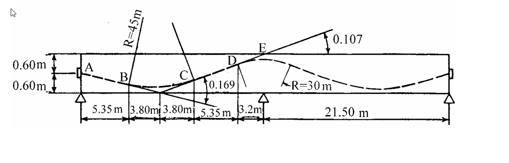

# 考題編號：RC-2002-5

**主分類：** `RC-U4-3` 預力損失
**副分類：** 無
**設計法：** WSD 工作應力法
**標籤：** `後拉法` `摩擦損失` `連續梁` `兩端張拉` `μ=0.4` `k=0.0026` `A-E各點` `角變量累積`

---

## 1. 原始題目重述 (Problem Restatement)

**題目（30 分）：**

有一後拉法預力混凝土連續梁，彎曲鋼腱由兩端拉線：
- μ = 0.4（鋼索與套管間摩擦係數）
- k = 0.0026/m（長度方向皺摺摩擦係數）
- 假設 A 點應力為 F₁

求：
1. A、E 兩點間由摩擦所致的預力損失百分率
2. B、C、D、E 各點之應力

**斷面幾何（由附圖讀取）：**

| 段 | 水平距離 | 曲率半徑 | 角變量 |
|----|---------|---------|-------|
| A → B | 5.35 m | R = 45 m | α₁ = 5.35/45 = **0.119 rad** |
| B → C | 3.80 m | R = 45 m | α₂ = 3.80/45 = **0.084 rad** |
| C → D' | 3.80 m | R = 45 m | α₃ = 3.80/45 = **0.084 rad**（α₂+α₃ = 0.169 rad，圖中標示） |
| D' → D | 5.35 m | 直線 | α = **0**（無曲率） |
| D → E | 3.20 m | R = 30 m | α₄ = 3.20/30 = **0.107 rad**（圖中標示） |

> D' 為 B-C-D' 曲線區段終點（x = 12.95 m），**未另設標籤**；D 在中間支承（x = 18.30 m），D'→D 為直線段。

**各點座標：**

| 點 | x（m） | 累積角變量 Σα（rad） |
|----|--------|------------------|
| A | 0 | 0 |
| B | 5.35 | 0.119 |
| C | 9.15 | 0.203 |
| D | 18.30 | 0.288（D'→D 直線段不增加角變） |
| E | 21.50 | 0.395 |

*圖說：兩跨連續梁，A 為左端張拉錨固點（距形心 0.60 m）；B 為左跨低點（x=5.35 m）；C 為 B-D' 曲線中點（x=9.15 m）；D 為中間支承高點（x=18.30 m）；E 在第二跨起點後 3.2 m 處（x=21.50 m）；右端另設張拉端（距 E 為 21.50 m）。*

---

## 2. 考題核心精神與出題者意圖 (Core Concepts & Examiner's Intent)

**核心觀念：**
後拉法摩擦損失公式：鋼腱自張拉端向遠端傳遞時，因鋼索與套管間的**曲率摩擦**（μα 項）及**皺摺摩擦**（kx 項）而逐漸衰減：

$$F_x = F_0 \cdot e^{-(\mu \Sigma\alpha + kx)}$$

**出題者意圖：**
- 測驗是否能從圖面幾何正確計算各段**角變量** α = L/R（圓弧近似）
- 測驗是否能累積 Σα 逐點計算（注意直線段不增加角變量）
- 測驗是否知道兩端張拉時，從 A 端看到 E 端的損失計算方式

---

## 3. 解題戰略地圖與陷阱分析 (Strategic Roadmap & Trap Analysis)

**作戰計畫：**
1. 從圖面讀取各段水平距離與 R，計算各段 α = L/R
2. 建立各點累積 Σα 表格
3. 代入公式逐點計算 F_x = F₁ × e^{-(μΣα + kx)}
4. 計算 A→E 損失百分率

**關鍵陷阱：**

| # | 陷阱 | 應對 |
|---|------|------|
| ① | 直線段（D'→D，5.35 m）也有 kx 損失，但 Σα 不增加 | 兩種損失機制分開處理 |
| ② | B-D' 的 0.169 rad 是 B→C 和 C→D' 兩半段的**總和**，C 在中間 | α_BC = α_CD' = 0.169/2 = 0.0844 rad |
| ③ | 圖中標示 0.107 = 3.2/30，是 D→E 段的角變量，不是累積值 | 需加上之前的 Σα |
| ④ | 直線段 D'→D 有 k×5.35 的皺摺損失，不可跳過 | 計入 kx 中（x 是從 A 起算的總距離） |

---

## 3.5 變數層次分析 (Variable Hierarchy Analysis)

> 複習提示：第一次解題後，在每個卡住的知識點旁標記 `⚠`；第二次複習時只看有 `⚠` 的項目。

### 最終目標
求 A→E 摩擦損失百分率，以及 B、C、D、E 各點之預力值（以 F₁ 表示）。

### 本題關鍵公式（依計算順序）

$$\text{Step 1（各段角變量）：}\quad \alpha_i = \frac{L_i}{R_i}$$

$$\text{Step 2（累積角變量）：}\quad \Sigma\alpha_x = \sum_{A}^{x} \alpha_i \quad \text{（直線段 } \alpha = 0\text{）}$$

$$\text{Step 3（各點應力）：}\quad F_x = F_1 \cdot e^{-\left(\mu \cdot \boxed{\Sigma\alpha_x} + k \cdot x\right)}$$

$$\text{Step 4（損失百分率）：}\quad \text{Loss}_{AE} = \left(1 - \frac{F_E}{F_1}\right) \times 100\%$$

### L1：題目直接給定

| 符號 | 數值 | 說明 |
|------|------|------|
| μ | 0.4 | 曲率摩擦係數 |
| k | 0.0026/m | 皺摺摩擦係數 |
| F_A | F₁ | A 點張拉應力（已知） |
| R₁ | 45 m | A→D' 段曲率半徑 |
| R₂ | 30 m | D→E 段曲率半徑 |
| L_{AB} | 5.35 m | A 到 B 水平距離 |
| L_{BC}, L_{CD'} | 3.80 m 各 | B→C、C→D' 水平距離 |
| L_{D'D} | 5.35 m | D'→D 直線距離 |
| L_{DE} | 3.20 m | D→E 水平距離 |

### L2：需知識點推導

**各段角變量（圖中確認）**

| 段 | α = L/R | 備註 |
|----|--------|------|
| A→B | 5.35/45 = 0.119 | 圖中 R=45m |
| B→C | 3.80/45 = 0.084 | 前半段（0.169/2） |
| C→D' | 3.80/45 = 0.084 | 後半段（圖中標示 B→D'=0.169） |
| D'→D | 0（直線） | 圖中 5.35m 無曲率 |
| D→E | 3.20/30 = 0.107 | 圖中標示 0.107，R=30m |

**累積 Σα 與 x**

| 點 | x (m) | Σα (rad) | μΣα | kx | 指數合計 |
|----|--------|---------|------|-----|--------|
| B | 5.35 | 0.119 | 0.04756 | 0.01391 | 0.06147 |
| C | 9.15 | 0.203 | 0.08133 | 0.02379 | 0.10512 |
| D | 18.30 | 0.288 | 0.11511 | 0.04758 | 0.16269 |
| E | 21.50 | 0.395 | 0.15778 | 0.05590 | 0.21368 |

### L3：深層知識（不懂就卡住）

| 知識點 | 說明 | 卡關? |
|--------|------|-------|
| 圓弧近似角變量 α ≈ L/R | 小角近似：圓弧長 ≈ 水平投影長；精確值為 L = Rα，α = L/R | |
| 直線段不增加 μ 損失但增加 k 損失 | μΣα 項：直線 α=0，不增加；kx 項：所有段皆累積（x 是從 A 起算的距離） | |
| 兩端張拉的意義 | 從 A 端看：損失只算 A→E 的摩擦；右端張拉貢獻在右端 E→右端，本題不涉及 | |
| 指數函數的近似計算 | e^{-x} ≈ 1−x 只適用於 x<<1；本題指數 ≈ 0.06~0.21，需用精確值或計算器 | |

---

## 4. 步驟化詳細計算過程 (Step-by-Step Detailed Calculation)

### Step 1：各段角變量（驗算圖中標示值）

$$\alpha_{AB} = \frac{5.35}{45} = 0.1189 \text{ rad}$$

$$\alpha_{BC} = \frac{3.80}{45} = 0.0844 \text{ rad}, \quad \alpha_{CD'} = \frac{3.80}{45} = 0.0844 \text{ rad}$$

$$\alpha_{BC} + \alpha_{CD'} = 0.1689 \approx \mathbf{0.169 \text{ rad}} \checkmark \text{（與圖中標示一致）}$$

$$\alpha_{D'D} = 0 \text{ rad（直線段）}$$

$$\alpha_{DE} = \frac{3.20}{30} = 0.1067 \approx \mathbf{0.107 \text{ rad}} \checkmark \text{（與圖中標示一致）}$$

### Step 2：各點累積角變量 Σα 與距離 x

| 點 | x (m) | Σα (rad) |
|----|--------|---------|
| A | 0 | 0 |
| B | 5.35 | 0.1189 |
| C | 9.15 | 0.1189 + 0.0844 = 0.2033 |
| D' | 12.95 | 0.2033 + 0.0844 = 0.2878 |
| D | 18.30 | 0.2878 + 0 = **0.2878**（直線段，Σα 不變） |
| E | 21.50 | 0.2878 + 0.1067 = **0.3944** |

### Step 3：各點應力（$F_x = F_1 \cdot e^{-(\mu\Sigma\alpha + kx)}$）

**在 B（x = 5.35 m，Σα = 0.1189 rad）：**

$$\mu\Sigma\alpha + kx = 0.4 \times 0.1189 + 0.0026 \times 5.35 = 0.04756 + 0.01391 = 0.06147$$

$$\boxed{F_B = F_1 \cdot e^{-0.0615} \approx 0.9404\,F_1}$$

**在 C（x = 9.15 m，Σα = 0.2033 rad）：**

$$\mu\Sigma\alpha + kx = 0.4 \times 0.2033 + 0.0026 \times 9.15 = 0.08133 + 0.02379 = 0.10512$$

$$\boxed{F_C = F_1 \cdot e^{-0.1051} \approx 0.9002\,F_1}$$

**在 D（x = 18.30 m，Σα = 0.2878 rad）：**

$$\mu\Sigma\alpha + kx = 0.4 \times 0.2878 + 0.0026 \times 18.30 = 0.11511 + 0.04758 = 0.16269$$

$$\boxed{F_D = F_1 \cdot e^{-0.1627} \approx 0.8499\,F_1}$$

**在 E（x = 21.50 m，Σα = 0.3944 rad）：**

$$\mu\Sigma\alpha + kx = 0.4 \times 0.3944 + 0.0026 \times 21.50 = 0.15778 + 0.05590 = 0.21368$$

$$\boxed{F_E = F_1 \cdot e^{-0.2137} \approx 0.8076\,F_1}$$

### Step 4：A→E 損失百分率

$$\text{Loss}_{AE} = \left(1 - \frac{F_E}{F_1}\right) \times 100\% = (1 - 0.8076) \times 100\%$$

$$\boxed{\text{Loss}_{AE} \approx 19.2\%}$$

### 結果彙整表

| 點 | x (m) | Σα (rad) | 指數 (μΣα+kx) | $F_x / F_1$ | 損失 |
|----|--------|---------|-------------|------------|------|
| A | 0 | 0 | 0 | **1.000** | 0% |
| B | 5.35 | 0.119 | 0.0615 | **0.940** | 6.0% |
| C | 9.15 | 0.203 | 0.1051 | **0.900** | 10.0% |
| D | 18.30 | 0.288 | 0.1627 | **0.850** | 15.0% |
| E | 21.50 | 0.394 | 0.2137 | **0.808** | **19.2%** |

---

## 5. 關鍵爭議點與進階探討 (Critical Issues & Advanced Discussion)

**1. 角變量 α = L/R 的精確度**

本題使用圓弧近似 α ≈ L/R（小角近似，sin α ≈ α）。精確值應為 α = arcsin(L/R)，但對 R=45m 和 L=7.6m 的情形，誤差極小（約 0.05%），可忽略。

**2. 直線段（D'→D，5.35 m）的處理**

- **μΣα**：不增加（α = 0）
- **kx**：從 A 起算的 x 繼續增加，k × Δx = 0.0026 × 5.35 = 0.01391
- 結果：F_D 比 F_{D'} 減少了 e^{-0.01391} = 0.9862，即額外損失約 1.4%

**3. 兩端張拉的完整應力分析**

本題只分析 A→E 端的貢獻（F₁ 由 A 端給定）。實際工程中：
- 右端（設為 G）亦以應力 F_G 張拉
- E 點的實際應力 = F₁ × e^{-0.2137}（來自 A）+ F_G × e^{-右端到E的損失}（來自 G）
- 兩端張拉可大幅減少跨中最低應力點的損失量

**4. 摩擦損失百分率的工程意義**

A→E 共 19.2% 的損失意味著：
- 若設計有效預力 = 0.85 F₁（扣除摩擦+其他損失），A 端張拉力需至少 F₁/0.808 才能在 E 點達到 F₁ 水準
- k = 0.0026/m 造成的損失在 21.5m 長度內 = 0.0026 × 21.5 = 5.6%（皺摺項），μΣα 項 = 0.4 × 0.394 = 15.8%（曲率項），兩者比例約 1：2.7

**5. 本題與 RC-2019-4 的差異**

RC-2019-4 亦為後拉法摩擦損失（兩腱雙端張拉），但幾何更複雜（拋物線腱+矢高計算）。本題直接給出 R 和圖示角變量，計算路徑更直接，適合練習基本框架。
