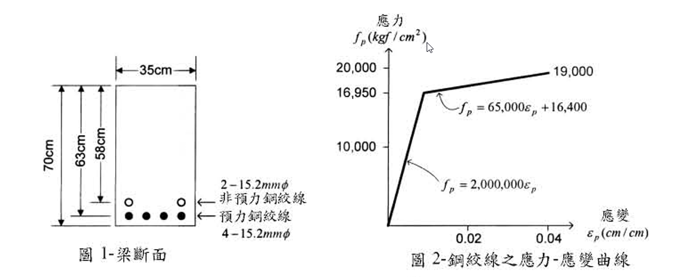

# 考題編號：RC-2003-1

**主分類：** `RC-U4-1` 預力梁斷面應力分析  
**副分類：** 無  
**設計法：** 混合（應變相容法求標稱彎矩強度）  
**標籤：** `部分預力梁` `應變相容法` `非預力鋼絞線` `雙線性應力應變` `標稱彎矩強度` `fps精確法` `β₁折減`

---

## 1. 原始題目重述

有一配置預力（prestressed）暨非預力（nonprestressed）鋼絞線之梁斷面如圖1所示，試回答下列問題。（20分）

*圖說：矩形梁斷面 b=35cm、h=70cm。底部配置 4 根 15.2mmφ 預力鋼絞線（dp=63cm）；上方 5cm 處配置 2 根 15.2mmφ 非預力鋼絞線（dns=58cm）。圖2為鋼絞線雙線性應力–應變曲線：線性段 $f_p = 2{,}000{,}000\varepsilon_p$（至 $f_p = 16{,}950\ \text{kgf/cm}^2$），應變硬化段 $f_p = 65{,}000\varepsilon_p + 16{,}400$（至 $f_{pu} = 19{,}000\ \text{kgf/cm}^2$）。*

**已知條件：**

| 項目 | 數值 |
|------|------|
| $f'_c$ | 350 kgf/cm² |
| 鋼絞線標稱直徑 | 15.2 mm |
| 每根鋼絞線截面積 | 138.7 mm² = 1.387 cm² |
| $f_{pu}$ | 19,000 kgf/cm² |
| $E_{ps}$ | 2,000,000 kgf/cm² |
| 千斤頂施加預力 | 14,000 kgf/cm² |
| 估計預力損失 | 2,000 kgf/cm² |
| 有效預力 $f_{pe}$ | 12,000 kgf/cm² |

**應力–應變曲線（圖2）：**

$$f_p = \begin{cases} 2{,}000{,}000\,\varepsilon_p & \varepsilon_p \le 0.008475 \\ 65{,}000\,\varepsilon_p + 16{,}400 & 0.008475 < \varepsilon_p \le \varepsilon_{pu} \end{cases}$$

比例限應力（proportional limit）：$f_{py} = 16{,}950\ \text{kgf/cm}^2$，對應 $\varepsilon_{py} = 0.008475$

**求：** 限用應變一致性（應變相容）較精確之方式，計算圖1梁斷面之標稱彎矩強度 $M_n$。

---

## 2. 考題核心精神與出題者意圖

**核心觀念：** 部分預力梁的 fps 不能用簡化近似公式，必須以應變相容（strain compatibility）法，配合實際的非線性應力–應變曲線，迭代求解中性軸位置，才能得到各層鋼絞線的真實應力。

**出題者測驗：**
1. 理解部分預力梁的配筋組成（預力 + 非預力鋼絞線）
2. 正確計算有效預應變 $\varepsilon_{pe}$，並以此為初始應變基礎
3. 能在雙線性應力–應變曲線上正確定位（線性段 vs. 應變硬化段）
4. 平衡方程的建立與迭代收斂

**陷阱：** 非預力鋼絞線的初始應變為零（不同於預力鋼絞線），兩者共用相同的材料應力–應變曲線但初始條件不同。

---

## 3. 解題戰略地圖與陷阱分析

**計算步驟：**
1. 整理斷面幾何與面積
2. 計算 $\beta_1$（f'c=350，超過280需折減）
3. 計算有效預應變 $\varepsilon_{pe}$
4. 假設中性軸深度 $c$，計算各層應變
5. 查雙線性曲線，得到各層應力
6. 驗證壓力=拉力，迭代至收斂
7. 計算 $M_n$

**關鍵陷阱：**

| # | 陷阱 | 說明 |
|---|------|------|
| ①| $\beta_1$ 需折減 | f'c=350 > 280，$\beta_1 = 0.85 - 0.05 \times \frac{350-280}{70} = 0.80$ |
| ②| 非預力鋼絞線初始應變 = 0 | 不加預拉力，僅靠撓曲變形產生應變 |
| ③| 預力鋼絞線總應變 = 預應變 + 撓曲增量 | 需將 $\varepsilon_{pe}$ 疊加 |
| ④| 雙線性曲線的段落判斷 | 需先判斷應變落在哪一段，再代入正確公式 |

---

## 3.5 變數層次分析（Variable Hierarchy Analysis）

> 複習提示：第一次解題後，在每個卡住的知識點旁標記 `⚠`；第二次複習時只看有 `⚠` 的項目。

### 最終目標

求部分預力矩形梁之**標稱彎矩強度 $M_n$**（應變相容精確法）

### 本題關鍵公式（依計算順序）

$$\text{Step 1: } \varepsilon_{pe} = \frac{f_{pe}}{E_{ps}}$$

$$\text{Step 2: } \varepsilon_{ps} = \boxed{\varepsilon_{pe}} + \frac{d_p - c}{c}\cdot\varepsilon_{cu}$$

$$\text{Step 3: } \varepsilon_{ns} = \frac{d_{ns} - c}{c}\cdot\varepsilon_{cu}$$

$$\text{Step 4（雙線性曲線）: } f_p = \begin{cases}E_{ps}\cdot\varepsilon_p & \varepsilon_p \le \varepsilon_{py} \\ 65{,}000\varepsilon_p + 16{,}400 & \varepsilon_p > \varepsilon_{py}\end{cases}$$

$$\text{Step 5（平衡）: } 0.85f'_c\cdot\boxed{\beta_1}\cdot c\cdot b = \boxed{f_{ps}}\cdot A_p + \boxed{f_{ns}}\cdot A_{ns}$$

$$\text{Step 6: } a = \boxed{\beta_1}\cdot\boxed{c}$$

$$\text{Step 7: } M_n = \boxed{f_{ps}}\cdot A_p\cdot\!\left(d_p - \frac{\boxed{a}}{2}\right) + \boxed{f_{ns}}\cdot A_{ns}\cdot\!\left(d_{ns} - \frac{\boxed{a}}{2}\right)$$

### L1：題目直接給定

| 符號 | 數值 | 說明 |
|------|------|------|
| $b$ | 35 cm | 梁寬 |
| $h$ | 70 cm | 梁總高 |
| $d_p$ | 63 cm | 預力鋼絞線有效深度 |
| $d_{ns}$ | 58 cm | 非預力鋼絞線有效深度 |
| $A_p$ | 5.548 cm² | 4×1.387 cm² |
| $A_{ns}$ | 2.774 cm² | 2×1.387 cm² |
| $f'_c$ | 350 kgf/cm² | |
| $f_{pu}$ | 19,000 kgf/cm² | |
| $E_{ps}$ | 2,000,000 kgf/cm² | |
| $f_{pe}$ | 12,000 kgf/cm² | 14,000−2,000 |
| $\varepsilon_{cu}$ | 0.003 | ACI 混凝土極限壓應變 |

### L2：需知識點推導

**材料常數**

| 符號 | 公式／來源 | 卡關? |
|------|-----------|-------|
| $\beta_1$ | $0.85 - 0.05\times\frac{350-280}{70} = 0.80$ | |
| $\varepsilon_{py}$ | $16{,}950/2{,}000{,}000 = 0.008475$ | |
| $\varepsilon_{pe}$ | $12{,}000/2{,}000{,}000 = 0.006$ | |

**應變相容迭代（取 c=16.5 cm）**

| 符號 | 公式／來源 | 卡關? |
|------|-----------|-------|
| $\varepsilon_{ps}$ | $0.006 + (63-16.5)/16.5\times0.003 = 0.01446$ | |
| $f_{ps}$ | $65{,}000\times0.01446 + 16{,}400 = 17{,}340\ \text{kgf/cm}^2$ | |
| $\varepsilon_{ns}$ | $(58-16.5)/16.5\times0.003 = 0.007545$ | |
| $f_{ns}$ | $2{,}000{,}000\times0.007545 = 15{,}091\ \text{kgf/cm}^2$ | |
| $a$ | $0.80\times16.5 = 13.2$ cm | |
| $M_n$ | 見 Step 7 | |

### L3：深層知識（不懂就卡住）

| 知識點 | 說明 | 卡關? |
|--------|------|-------|
| 部分預力梁兩類鋼絞線的初始條件差異 | 預力鋼絞線有 $\varepsilon_{pe}$；非預力鋼絞線初始應變為零 | |
| $\beta_1$ 需隨 f'c 折減 | ACI/台灣規範：f'c > 280 時每增加 70 kgf/cm² 減 0.05 | |
| 雙線性應力應變曲線的使用 | 計算出應變後先判斷段落，再代對應公式 | |
| 平衡方程需迭代 | 因 fps、fns 均為 c 的非線性函數，需試算 c 至收斂 | |

---

## 4. 步驟化詳細計算過程

### Step 1　斷面幾何與材料

$$A_p = 4 \times 1.387 = 5.548\ \text{cm}^2 \quad (d_p = 63\ \text{cm})$$
$$A_{ns} = 2 \times 1.387 = 2.774\ \text{cm}^2 \quad (d_{ns} = 58\ \text{cm})$$
$$f'_c = 350\ \text{kgf/cm}^2 \Rightarrow \beta_1 = 0.85 - 0.05 \times \frac{350-280}{70} = \boxed{0.80}$$

### Step 2　有效預應變

$$\varepsilon_{pe} = \frac{f_{pe}}{E_{ps}} = \frac{12{,}000}{2{,}000{,}000} = \boxed{0.006}$$

> 此值小於比例限應變 0.008475，預力鋼絞線在服務載重下仍在線性段。

### Step 3　應變相容迭代

**比例限（proportional limit）：**
$$\varepsilon_{py} = \frac{f_{py}}{E_{ps}} = \frac{16{,}950}{2{,}000{,}000} = 0.008475$$

**混凝土壓力：**
$$C_c = 0.85 f'_c \cdot \beta_1 c \cdot b = 0.85 \times 350 \times 0.80 \times c \times 35 = 8{,}330\,c\ (\text{kgf})$$

**預力鋼絞線應變（含初始預應變）：**
$$\varepsilon_{ps} = \varepsilon_{pe} + \frac{d_p - c}{c}\varepsilon_{cu} = 0.006 + \frac{63-c}{c}\times 0.003$$

**非預力鋼絞線應變（初始應變為零）：**
$$\varepsilon_{ns} = \frac{d_{ns} - c}{c}\varepsilon_{cu} = \frac{58-c}{c}\times 0.003$$

**試算 c = 16.5 cm：**

$$\varepsilon_{ps} = 0.006 + \frac{63-16.5}{16.5}\times 0.003 = 0.006 + 2.818\times 0.003 = 0.006 + 0.008455 = 0.01446$$

由於 $\varepsilon_{ps} = 0.01446 > \varepsilon_{py} = 0.008475$，代入應變硬化段：
$$f_{ps} = 65{,}000\times 0.01446 + 16{,}400 = 939.9 + 16{,}400 = \boxed{17{,}340\ \text{kgf/cm}^2}$$

檢核：$f_{ps} = 17{,}340 < f_{pu} = 19{,}000$ ✓

$$\varepsilon_{ns} = \frac{58-16.5}{16.5}\times 0.003 = 2.515\times 0.003 = 0.007545$$

由於 $\varepsilon_{ns} = 0.007545 < \varepsilon_{py} = 0.008475$，代入線性段：
$$f_{ns} = 2{,}000{,}000\times 0.007545 = \boxed{15{,}091\ \text{kgf/cm}^2}$$

**驗證平衡：**

$$C_c = 8{,}330 \times 16.5 = 137{,}445\ \text{kgf}$$
$$T = f_{ps}\cdot A_p + f_{ns}\cdot A_{ns} = 17{,}340\times 5.548 + 15{,}091\times 2.774$$
$$= 96{,}181 + 41{,}862 = 138{,}043\ \text{kgf}$$

誤差 = $(138{,}043 - 137{,}445)/137{,}445 \approx 0.4\%$ ✓ 收斂

> 策略註解：此誤差小於1%，工程上可接受，取 $c = 16.5\ \text{cm}$ 為解。

### Step 4　等值矩形應力塊深度

$$a = \beta_1 \cdot c = 0.80 \times 16.5 = \boxed{13.2\ \text{cm}}$$

### Step 5　標稱彎矩強度

$$M_n = f_{ps}\cdot A_p\!\left(d_p - \frac{a}{2}\right) + f_{ns}\cdot A_{ns}\!\left(d_{ns} - \frac{a}{2}\right)$$

$$= 17{,}340\times 5.548\times\!\left(63 - 6.6\right) + 15{,}091\times 2.774\times\!\left(58 - 6.6\right)$$

$$= 96{,}181\times 56.4 + 41{,}862\times 51.4$$

$$= 5{,}424{,}596 + 2{,}151{,}707$$

$$= \boxed{7{,}576{,}303\ \text{kgf}\cdot\text{cm} \approx 75.8\ \text{tf}\cdot\text{m}}$$

---

## 5. 關鍵爭議點與進階探討

**1. 應變相容法 vs. ACI 近似公式的差異**

ACI 近似公式（$f_{ps} = f_{pu}[1 - \gamma_p/\beta_1 \cdot \rho_p f_{pu}/f'_c]$）適用於有黏結有預力的情況，且假設鋼絞線降伏。本題同時包含非預力鋼絞線，且使用雙線性曲線，題目明確要求精確法，若誤用近似公式將失分。

**2. 非預力鋼絞線的定位**

兩種鋼絞線同為 15.2mm 相同材料，但「非預力」表示未施加預拉力，在計算極限強度時其初始應變為零，需特別注意。在部分預力設計中，非預力鋼絞線可提升延性，是此類題型的核心概念。

**3. 延性檢核（補充）**

$$\varepsilon_t = \varepsilon_{ps} - \varepsilon_{pe} = 0.01446 - 0.006 = 0.00846 > 0.005$$

> 淨拉應變 $\varepsilon_t$ 超過 0.005，屬拉力控制斷面，$\phi = 0.9$，斷面具有足夠延性。
