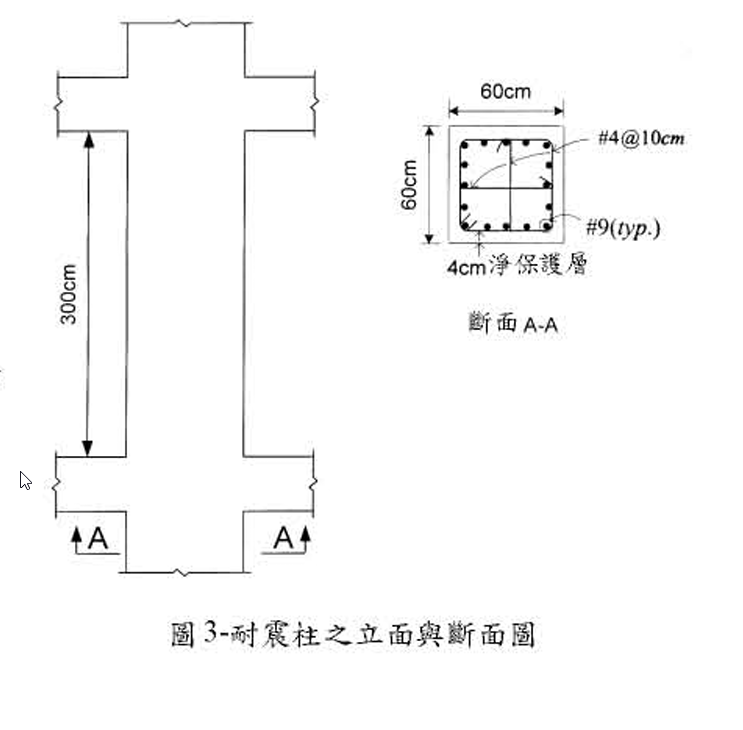

# 考題編號：RC-2003-2

**主分類：** `RC-U2-3` 鋼筋錨定長度與斷點計算  
**副分類：** `RC-U3-3` 韌性要求與耐震設計  
**設計法：** USD  
**標籤：** `耐震柱` `搭接長度` `詳細計算法` `c值計算` `Ktr橫向鋼筋指標` `Class B搭接` `中段1/2限制` `方形柱16-#9`

---

## 1. 原始題目重述

有一耐震鋼筋混凝土柱之立面及斷面情況如圖3所示，若欲執行柱主筋之搭接設計，試按民國92年1月1日生效，由營建署頒訂發行之「結構混凝土設計規範」設計之。（20分）



*圖說：耐震方形柱，60cm×60cm，淨高300cm，兩端為梁柱接頭。斷面A-A：16根#9主筋（db=2.87cm，Ab=6.47cm²）均勻排列於周界，#4@10cm方形箍筋（db=1.27cm，Ab=1.27cm²），4cm淨保護層。*

**已知條件：**

| 項目 | 數值 |
|------|------|
| $f'_c$ | 280 kgf/cm²，常重混凝土 |
| $f_y = f_{yt}$ | 4,200 kgf/cm²，未塗覆鋼筋 |
| 主筋 #9 | $d_b = 2.87$ cm，$A_b = 6.47$ cm² |
| 箍筋 #4 | $d_b = 1.27$ cm，$A_b = 1.27$ cm² |
| 箍筋間距 | $s = 10$ cm |
| 淨保護層 | 4 cm |
| 柱斷面 | 60 × 60 cm |
| 柱淨高 | 300 cm |

**限用詳細計算法公式：**

$$l_d = \frac{0.28\,d_b\,f_y}{\sqrt{f'_c}} \cdot \frac{\alpha\beta\lambda}{\dfrac{c + K_{tr}}{d_b}}$$

$$K_{tr} = \frac{A_{tr} \cdot f_{yt}}{10 \cdot s \cdot n}$$

限制：$\dfrac{c + K_{tr}}{d_b} \le 2.5$，且 $l_d \ge 30$ cm

**求：** 柱主筋搭接長度，並示於立面圖，繪製搭接處斷面圖。

---

## 2. 考題核心精神與出題者意圖

**核心觀念：** 考生必須正確計算保護層/間距兩種 $c$ 值取小，以及橫向鋼筋指標 $K_{tr}$，再判斷是否觸及 2.5 上限，才能得到「詳細計算法」（而非保守簡化法）的 $l_d$。耐震柱的搭接位置限制（柱淨高中間半段）是另一個考點。

**出題者測驗：**
1. 正確計算 $c$（保護層 vs. 半中心距，取小）
2. 正確計算 $K_{tr}$（橫向鋼筋面積、間距、根數 $n$）
3. 判斷是否觸及 $(c+K_{tr})/d_b = 2.5$ 上限
4. 耐震柱搭接：Class B 係數 1.3，位置在中間半段

---

## 3. 解題戰略地圖與陷阱分析

**計算步驟：**
1. 確認柱內鋼筋排列（每面幾根？）→ 計算中心距
2. 計算 $c$（取保護層到中心 vs. 半中心距之小值）
3. 計算 $K_{tr}$（確認 $n$ 的意義）
4. 判斷 $(c + K_{tr})/d_b \le 2.5$
5. 代入公式得 $l_d$
6. 耐震柱 Class B 搭接：$l_s = 1.3\,l_d$
7. 定搭接位置（中間半段）

**關鍵陷阱：**

| # | 陷阱 | 說明 |
|---|------|------|
| ① | 每面幾根鋼筋 | 16根在60cm柱：每面5根（含兩端角筋），中心距 = 46.59/4 = 11.65cm |
| ② | $c$ 要取兩種情況的較小值 | 不能只算保護層到中心；還需算半中心距 |
| ③ | $K_{tr}$ 的 $n$ | 為沿潛在劈裂面方向被搭接的鋼筋根數（每面5根） |
| ④ | 耐震柱搭接必須用拉力 Class B | 地震造成柱反彎，主筋可能受拉 → $l_s = 1.3\,l_d$ |

---

## 3.5 變數層次分析（Variable Hierarchy Analysis）

> 複習提示：第一次解題後，在每個卡住的知識點旁標記 `⚠`；第二次複習時只看有 `⚠` 的項目。

### 最終目標

求耐震柱 16-#9 主筋之**拉力搭接長度 $l_s$**，並指定搭接位置。

### 本題關鍵公式（依計算順序）

$$\text{Step 1: } c = \min\!\left(c_{cover},\ \frac{s_{cc}}{2}\right)$$

$$\text{Step 2: } K_{tr} = \frac{A_{tr}\cdot f_{yt}}{10\cdot s\cdot n}$$

$$\text{Step 3: 判斷} \quad \frac{c + \boxed{K_{tr}}}{d_b} \le 2.5$$

$$\text{Step 4: } l_d = \frac{0.28\,d_b\,f_y}{\sqrt{f'_c}}\cdot\frac{\alpha\beta\lambda}{\boxed{\dfrac{c+K_{tr}}{d_b}}}$$

$$\text{Step 5: } l_s = 1.3\,\boxed{l_d} \quad (\text{Class B 拉力搭接})$$

### L1：題目直接給定

| 符號 | 數值 | 說明 |
|------|------|------|
| $b = h$ | 60 cm | 方形柱邊長 |
| $d_b$ | 2.87 cm | #9 主筋 |
| $d_{b,tie}$ | 1.27 cm | #4 箍筋 |
| $A_{b,tie}$ | 1.27 cm² | #4 箍筋面積 |
| $s$ | 10 cm | 箍筋間距 |
| 淨保護層 | 4 cm | |
| $f'_c$ | 280 kgf/cm² | |
| $f_y = f_{yt}$ | 4,200 kgf/cm² | |
| 柱淨高 | 300 cm | |

### L2：需知識點推導

**幾何計算**

| 符號 | 公式／來源 | 卡關? |
|------|-----------|-------|
| 每面鋼筋根數 | 16根，4角 + 每面3中間筋 → 每面5根 | |
| 保護層至主筋中心 $c_{cover}$ | $4 + 1.27 + 2.87/2 = 6.705$ cm | |
| 主筋中心距 $s_{cc}$ | $(60 - 2\times6.705)/(5-1) = 11.65$ cm | |
| $c_{spacing}$ | $11.65/2 = 5.825$ cm | |
| $c$ | $\min(6.705,\ 5.825) = 5.825$ cm | |

**$K_{tr}$ 計算**

| 符號 | 公式／來源 | 卡關? |
|------|-----------|-------|
| $A_{tr}$ | $2\times1.27 = 2.54$ cm²（一面箍筋兩肢） | |
| $n$ | 5（每面被搭接主筋根數） | |
| $K_{tr}$ | $2.54\times4200/(10\times10\times5) = 21.3$ | |
| $(c+K_{tr})/d_b$ | $(5.825+21.3)/2.87 = 9.45 > 2.5 \Rightarrow$ 取 2.5 | |

**錨定與搭接長度**

| 符號 | 公式／來源 | 卡關? |
|------|-----------|-------|
| $\alpha\beta\lambda$ | $1.0\times1.0\times1.0 = 1.0$ | |
| $l_d$ | $0.28\times2.87\times4200/\sqrt{280}/2.5 = 80.7$ cm | |
| $l_s$ (Class B) | $1.3\times80.7 = 104.9 \approx 105$ cm | |

### L3：深層知識（不懂就卡住）

| 知識點 | 說明 | 卡關? |
|--------|------|-------|
| $c$ 取兩種情況的較小值 | c = min（保護層至中心，半中心距），二者意義不同 | |
| $K_{tr}$ 中的 $n$ | 沿潛在劈裂平面方向同時被搭接的鋼筋根數（不是全斷面的n） | |
| $(c+K_{tr})/d_b \le 2.5$ 的意義 | 2.5 是最優配筋狀態上限，不得超過 | |
| 耐震柱搭接為 Class B 拉力搭接 | 地震逆作用下柱反彎，主筋受拉；100%鋼筋同處搭接 > 50% → Class B | |
| 搭接位置限於柱淨高中段 1/2 | 避開塑性鉸區；台灣92年規範（ACI 318-99 §21.4.3） | |

---

## 4. 步驟化詳細計算過程

### Step 1　斷面幾何：每面鋼筋根數與中心距

16根#9鋼筋配置於60×60cm柱，均勻分佈於四周邊：
- 4個角筋 + 每面3根中間筋 = 4 + 3×4 = 16根 ✓
- **每面共5根**（含兩側角筋）

箍筋表面至主筋中心（保護層到中心）：

$$c_{cover} = 4 + 1.27 + \frac{2.87}{2} = 4 + 1.27 + 1.435 = 6.705\ \text{cm}$$

每面5根主筋，4個間距均分 46.59 cm：

$$s_{cc} = \frac{60 - 2\times6.705}{5-1} = \frac{46.59}{4} = 11.65\ \text{cm（主筋中心距）}$$

$$c_{spacing} = \frac{s_{cc}}{2} = \frac{11.65}{2} = 5.825\ \text{cm}$$

$$\boxed{c = \min(c_{cover},\ c_{spacing}) = \min(6.705,\ 5.825) = 5.825\ \text{cm}}$$

> 策略注解：中心距的一半（5.825cm）小於保護層到中心（6.705cm），因此 $c$ 由**間距控制**，而非保護層控制。

### Step 2　橫向鋼筋指標 $K_{tr}$

沿潛在劈裂平面（每面）的箍筋肢數：

$$A_{tr} = 2 \times A_{b,tie} = 2 \times 1.27 = 2.54\ \text{cm}^2$$

$n$ = 沿潛在劈裂面被搭接的主筋根數 = **5根**（每面5根同時搭接）

$$K_{tr} = \frac{A_{tr}\cdot f_{yt}}{10\cdot s\cdot n} = \frac{2.54\times 4{,}200}{10\times10\times5} = \frac{10{,}668}{500} = 21.3$$

### Step 3　判斷 $(c+K_{tr})/d_b$

$$\frac{c+K_{tr}}{d_b} = \frac{5.825+21.3}{2.87} = \frac{27.125}{2.87} = 9.45 > 2.5$$

$$\therefore \text{取上限}\quad \boxed{\frac{c+K_{tr}}{d_b} = 2.5}$$

> 策略注解：箍筋圍束非常充足，$K_{tr}$ 遠超需求，(c+Ktr)/db 直接到達 2.5 上限。此為最優圍束狀態，可得最短 $l_d$。

### Step 4　修正係數

| 係數 | 意義 | 本題取值 |
|------|------|---------|
| $\alpha$ | 位置係數（頂部水平筋/其他） | **1.0**（垂直柱筋） |
| $\beta$ | 塗覆係數 | **1.0**（未塗覆） |
| $\lambda$ | 輕質混凝土係數 | **1.0**（常重混凝土） |

$$\alpha\beta\lambda = 1.0\times1.0\times1.0 = 1.0$$

### Step 5　錨定長度 $l_d$

$$l_d = \frac{0.28\times d_b\times f_y}{\sqrt{f'_c}}\cdot\frac{\alpha\beta\lambda}{(c+K_{tr})/d_b}$$

$$= \frac{0.28\times2.87\times4{,}200}{\sqrt{280}}\times\frac{1.0}{2.5}$$

$$= \frac{0.28\times2.87\times4{,}200}{16.73}\times\frac{1}{2.5}$$

$$= \frac{3{,}375.1}{16.73\times2.5} = \frac{3{,}375.1}{41.83} = \boxed{80.7\ \text{cm}}$$

檢核最小值：$l_d = 80.7\ \text{cm} > 30\ \text{cm}$ ✓

### Step 6　搭接長度（Class B 拉力搭接）

耐震柱（Special RC Column）之主筋搭接規定：
- 地震逆作用下柱反彎，主筋可能受**拉力**
- 16根全部在同一截面搭接 → 100% > 50% → **Class B**
- $l_s = 1.3\,l_d$

$$\boxed{l_s = 1.3\times80.7 = 104.9\ \text{cm} \to \text{取}\ 105\ \text{cm}}$$

### Step 7　搭接位置（耐震規定）

依台灣92年規範（源自 ACI 318-99 §21.4.3）：
- 搭接**必須在柱淨高之中間半段**
- 中間半段：$300/4 = 75\ \text{cm}$ 至 $3\times300/4 = 225\ \text{cm}$（距下端）

**建議搭接位置：**

| 位置 | 距下端 |
|------|--------|
| 搭接起始點 | 75 cm（中間半段起點） |
| 搭接結束點 | 75 + 105 = 180 cm |
| 中間半段上限 | 225 cm |
| 180 cm < 225 cm | ✓ 符合規定 |

**立面圖示意（文字版）：**

```
  ─────── 上梁 ───────
  ┆                 ┆  300cm淨高
  ┆  ← 180cm       ┆
  ┆  ╔═══════════╗ ┆  ← 搭接結束（180cm）
  ┆  ║  ls=105cm ║ ┆
  ┆  ╚═══════════╝ ┆  ← 搭接起始（75cm）
  ┆                 ┆
  ─────── 下梁 ───────
```

### Step 8　搭接處斷面描述

於搭接區（75cm~180cm），斷面A-A配置如下：
- 每面5根主筋中，每根鋼筋各與一根搭接鋼筋並排
- 搭接筋間距：淨距 ≥ max($d_b$, 25mm) = max(28.7mm, 25mm) = 28.7mm 檢核
- 箍筋 #4@10cm 貫穿全搭接區（提供橫向圍束）
- 搭接區有效淨保護層：4cm（不變）

---

## 5. 關鍵爭議點與進階探討

**1. 為何 $(c+K_{tr})/d_b$ 觸及上限 2.5？**

因本題箍筋 #4@10cm 為相對密集的配置（尤其耐震柱的密箍區），$K_{tr}$ 遠大於 $c$，使圍束指標遠超 2.5。實際上，只要橫向鋼筋足夠，使用上限 2.5 即可，無需嚴格迭代。

**2. 搭接為何不用壓力搭接（較短）？**

壓力搭接長度：
$$l_{s,comp} = 0.075\frac{f_y}{\sqrt{f'_c}}d_b = 0.075\times\frac{4200}{\sqrt{280}}\times2.87 = 54\ \text{cm}$$

雖然 54cm < 105cm，但耐震柱在地震時主筋可能受拉，**規範要求使用拉力搭接（Class B）**，不得縮減為壓力搭接長度。

**3. 搭接鋼筋的額外橫向圍束**

於搭接區內，規範要求橫向鋼筋面積不得少於計算值。本題 #4@10cm 已提供充足圍束，通常不需額外加密箍筋（但設計者應驗核）。
