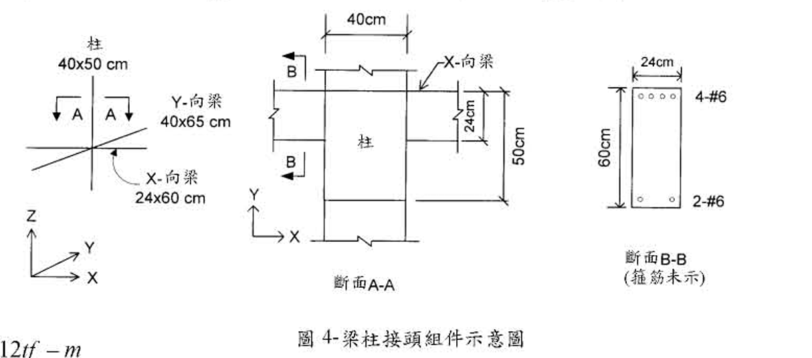

# 考題編號：RC-2003-3

**主分類：** `RC-U3-3` 韌性要求與耐震設計  
**副分類：** `RC-U2-1` RC 剪力強度分析與設計  
**設計法：** USD  
**標籤：** `梁柱接頭` `內部接頭` `水平剪力Vjh` `有效接頭寬度bj` `接頭剪力強度` `γ係數` `T_top+T_bot-Vcol` `中間層內跨`

---

## 1. 原始題目重述

有一附裏鋼筋混凝土中間層內跨之梁柱接頭組件如圖4所示，試按民國92年1月1日生效，由營建署頒訂發行之「結構混凝土設計規範」設計之。（20分）

*圖說：中間層內跨接頭。柱40×50cm（X向50cm，Y向40cm）；縱向(X-向)梁24×60cm，頂層4根#6鋼筋，底層2根#6鋼筋，M-x⁻≈24tf·m，M+x≈12tf·m；橫向(Y-向)梁40×65cm；樓層中心至中心高度350cm。斷面B-B顯示X向梁鋼筋配置（#6頂×4，#6底×2）。*

**已知條件：**

| 項目 | 數值 |
|------|------|
| $f'_c$ | 280 kgf/cm²，常重混凝土 |
| $f_y$ | 4,200 kgf/cm² |
| 樓層高度（中心至中心） | 350 cm |
| X-向梁（縱向） | 24×60 cm |
| X-向梁頂筋 | 4根#6，$d_b=1.91$ cm，$A_b=2.87$ cm² |
| X-向梁底筋 | 2根#6，$d_b=1.91$ cm，$A_b=2.87$ cm² |
| 梁彎矩標稱值 | $M^-_x \approx 24$ tf·m（負彎矩，頂筋受拉）；$M^+_x \approx 12$ tf·m（正彎矩，底筋受拉） |
| Y-向梁（橫向） | 40×65 cm |
| 柱斷面 | 40×50 cm（Y向40cm，X向50cm） |
| 柱縱筋 | $d_b=1.91$ cm，$A_b=2.87$ cm²（#6） |

**求：**
1. 接頭在X-向之水平作用剪力 $V_{jh}$
2. 接頭在X-向之有效寬度 $b_j$
3. 驗核接頭剪力強度是否充足

---

## 2. 考題核心精神與出題者意圖

**核心觀念：** 梁柱接頭水平剪力 $V_{jh}$ 來自梁端拉壓力的衝突——頂筋拉力加底筋拉力減去柱剪力，形成穿越接頭的剪力流。接頭剪力強度由混凝土提供，與接頭有效面積（$b_j \times h_c$）和 $\gamma$ 係數有關。

**出題者測驗：**
1. 正確計算 $V_{jh} = T_{top} + T_{bot} - V_{col}$（力的平衡）
2. 正確判斷 $b_j$（不得超過柱寬）
3. 內部接頭 $\gamma$ 係數的選用

---

## 3. 解題戰略地圖與陷阱分析

**計算步驟：**
1. 計算梁頂筋拉力 $T_{top}$（對應 $M^-_x$）
2. 計算梁底筋拉力 $T_{bot}$（對應 $M^+_x$）
3. 計算柱剪力 $V_{col} \approx (M^-_x + M^+_x)/h$
4. $V_{jh} = T_{top} + T_{bot} - V_{col}$
5. 計算有效接頭寬度 $b_j$
6. $\phi V_n = \phi \gamma \sqrt{f'_c}\, b_j h_c$ → 與 $V_{jh}$ 比較

**關鍵陷阱：**

| # | 陷阱 | 說明 |
|---|------|------|
| ① | $b_j$ 不得超過柱寬 | $b_j = \min(b_{col,Y},\ b_{beam} + h_{col,X})$，本題柱Y向40cm為上限 |
| ② | $V_{col}$ 不可忽略 | $V_{col}$ 方向與 $T$ 相反，須扣除 |
| ③ | 內部接頭 $\gamma = 5.3$（kgf/cm²制） | 對應ACI 318-99 γ=20（psi制），4面有梁圍束 |
| ④ | $h_c$ 為接頭剪力方向的柱深 | X向剪力 → $h_c$ = 柱X向尺寸 = 50cm |

---

## 3.5 變數層次分析（Variable Hierarchy Analysis）

> 複習提示：第一次解題後，在每個卡住的知識點旁標記 `⚠`；第二次複習時只看有 `⚠` 的項目。

### 最終目標

求X方向**水平接頭剪力 $V_{jh}$**，計算**有效接頭寬度 $b_j$**，驗核 $\phi V_n \ge V_{jh}$。

### 本題關鍵公式（依計算順序）

$$\text{Step 1: } T_{top} = A_{s,top}\cdot f_y$$

$$\text{Step 2: } T_{bot} = A_{s,bot}\cdot f_y$$

$$\text{Step 3: } V_{col} = \frac{M^-_x + M^+_x}{h_{story}}$$

$$\text{Step 4: } V_{jh} = \boxed{T_{top}} + \boxed{T_{bot}} - \boxed{V_{col}}$$

$$\text{Step 5: } b_j = \min\!\left(b_{col,Y},\ b_{beam,X} + h_{col,X}\right)$$

$$\text{Step 6: } \phi V_n = \phi\cdot\gamma\cdot\sqrt{f'_c}\cdot\boxed{b_j}\cdot h_{col,X}$$

### L1：題目直接給定

| 符號 | 數值 | 說明 |
|------|------|------|
| $A_{s,top}$ | $4\times2.87=11.48$ cm² | X梁頂層4-#6 |
| $A_{s,bot}$ | $2\times2.87=5.74$ cm² | X梁底層2-#6 |
| $M^-_x$ | 24 tf·m | X梁負彎矩標稱值 |
| $M^+_x$ | 12 tf·m | X梁正彎矩標稱值 |
| $h_{story}$ | 350 cm | 樓層高（中心至中心） |
| $h_{col,X}$ | 50 cm | 柱X向尺寸（接頭深度） |
| $b_{col,Y}$ | 40 cm | 柱Y向尺寸 |
| $b_{beam,X}$ | 24 cm | X向梁寬 |
| $f'_c$ | 280 kgf/cm² | |
| $f_y$ | 4,200 kgf/cm² | |

### L2：需知識點推導

| 符號 | 公式／來源 | 卡關? |
|------|-----------|-------|
| $T_{top}$ | $11.48\times4200=48{,}216$ kgf = 48.22 tf | |
| $T_{bot}$ | $5.74\times4200=24{,}108$ kgf = 24.11 tf | |
| $V_{col}$ | $(24+12)/3.5=10.29$ tf | |
| $V_{jh}$ | $48.22+24.11-10.29=62.0$ tf | |
| $b_j$ | $\min(40,\ 24+50)=\min(40,74)=40$ cm | |
| $A_j$ | $40\times50=2{,}000$ cm² | |
| $\gamma$（kgf制） | 5.3（內部接頭，4面圍束） | |
| $\phi V_n$ | $0.85\times5.3\times\sqrt{280}\times2000=150.7$ tf | |

### L3：深層知識（不懂就卡住）

| 知識點 | 說明 | 卡關? |
|--------|------|-------|
| $V_{jh}$ 公式的力學來源 | 自由體圖：梁頂拉力 + 梁底拉力（對向）= 接頭剪力 + 柱剪力 | |
| $b_j$ 的上限為柱寬 | 接頭面積不得超出柱斷面，故 $b_j \le b_{col}$ | |
| $\gamma = 5.3$ 的由來 | ACI 318-99 γ=20（psi）換算至 kgf/cm² 制 → 5.3；內部接頭（4面梁圍束）取最大值 | |
| $h_c$ 為剪力方向的柱尺寸 | X向剪力：$h_c = h_{col,X} = 50$ cm（不是40cm） | |

---

## 4. 步驟化詳細計算過程

### Step 1　梁端鋼筋拉力

**頂層鋼筋（$M^-_x$ 邊，頂筋受拉）：**

$$T_{top} = A_{s,top}\cdot f_y = (4\times2.87)\times4{,}200 = 11.48\times4{,}200 = \boxed{48{,}216\ \text{kgf} = 48.22\ \text{tf}}$$

**底層鋼筋（$M^+_x$ 邊，底筋受拉）：**

$$T_{bot} = A_{s,bot}\cdot f_y = (2\times2.87)\times4{,}200 = 5.74\times4{,}200 = \boxed{24{,}108\ \text{kgf} = 24.11\ \text{tf}}$$

> **驗核一致性：**
> $T_{top}\cdot jd \approx M^-_x$：$48.22\ \text{tf}\times0.498\ \text{m} = 24.0\ \text{tf·m}$ ✓  
> $T_{bot}\cdot jd \approx M^+_x$：$24.11\ \text{tf}\times0.498\ \text{m} = 12.0\ \text{tf·m}$ ✓

### Step 2　柱剪力估算

柱承受上下梁的合力矩，以樓層高度換算為剪力：

$$V_{col} \approx \frac{M^-_x + M^+_x}{h_{story}} = \frac{(24+12)\ \text{tf·m}}{3.5\ \text{m}} = \frac{36}{3.5} = \boxed{10.3\ \text{tf}}$$

### Step 3　水平接頭剪力 $V_{jh}$

由接頭自由體圖（水平方向力平衡）：

$$V_{jh} = T_{top} + T_{bot} - V_{col}$$

$$= 48.22 + 24.11 - 10.29 = \boxed{62.0\ \text{tf}}$$

> 策略注解：$T_{top}$ 與 $T_{bot}$ 分別來自接頭左側梁（負彎矩，頂筋受拉）和右側梁（正彎矩，底筋受拉），兩者同方向穿越接頭；柱剪力 $V_{col}$ 方向相反，故要扣除。

### Step 4　有效接頭寬度 $b_j$

X向梁寬 $b_{beam,X} = 24$ cm；柱X向深度 $h_{col,X} = 50$ cm；柱Y向寬度 $b_{col,Y} = 40$ cm。

依規範：

$$b_j = \min\!\left(b_{col,Y},\ b_{beam,X} + h_{col,X}\right) = \min(40,\ 24+50) = \min(40,\ 74) = \boxed{40\ \text{cm}}$$

> 以兩側延伸驗核：每側延伸 $x = \min\!\left(\frac{b_{col,Y}-b_{beam,X}}{2},\ \frac{h_{col,X}}{4}\right) = \min\!\left(\frac{16}{2},\ \frac{50}{4}\right) = \min(8,\ 12.5) = 8$ cm  
> $b_j = 24 + 2\times8 = 40$ cm ✓

### Step 5　有效接頭面積

$$A_j = b_j \times h_{col,X} = 40 \times 50 = \boxed{2{,}000\ \text{cm}^2}$$

### Step 6　接頭剪力強度驗核

依規範（源自ACI 318-99，內部接頭4面有梁圍束），$\gamma = 5.3$（kgf/cm²制，對應ACI psi制之 $\gamma = 20$）：

$$\phi V_n = \phi\cdot\gamma\cdot\sqrt{f'_c}\cdot A_j = 0.85\times5.3\times\sqrt{280}\times2{,}000$$

$$= 0.85\times5.3\times16.73\times2{,}000 = 0.85\times177{,}338 = \boxed{150{,}737\ \text{kgf} = 150.7\ \text{tf}}$$

**驗核：**

$$\phi V_n = 150.7\ \text{tf} > V_{jh} = 62.0\ \text{tf} \quad \checkmark\ \text{接頭剪力強度充足}$$

安全餘裕：$\phi V_n / V_{jh} = 150.7/62.0 = 2.43$（充裕）

---

## 5. 關鍵爭議點與進階探討

**1. $\gamma$ 係數的選用依據**

ACI 318-99 §21.5.3（台灣92年規範等同條文）對接頭類型的 $\gamma$ 值：

| 接頭類型 | 圍束條件 | $\gamma$（psi制） | $\gamma$（kgf/cm²制） |
|---------|---------|---------|---------|
| 內部接頭 | 4面均有梁 | 20 | 5.3 |
| 外部接頭 | 3面或對側2面 | 15 | 4.0 |
| 角部接頭 | 僅1面 | 12 | 3.2 |

本題為「中間層內跨（四面均有梁連入）」→ 取 $\gamma = 5.3$ ✓

**2. 安全餘裕大（2.43倍）的意義**

此接頭安全餘裕高，主要因為：
- 梁斷面相對柱斷面小（X梁僅24cm寬）
- Y向梁（40cm）提供側面圍束，使 $\gamma$ 取最大值
- 接頭面積足夠大（2,000 cm²）

在實際工程中，若欲減小柱斷面，應重新驗核接頭剪力強度。

**3. 梁頂筋貫穿接頭的直徑限制**

依規範，頂層#6鋼筋（$d_b = 1.91$ cm）貫穿接頭，需驗核接頭深度與 $d_b$ 之比：
$$h_{col,X} / d_b = 50 / 1.91 = 26.2 \ge 20 \quad \checkmark$$

梁筋可以連續貫穿接頭，不需彎鉤錨定。
