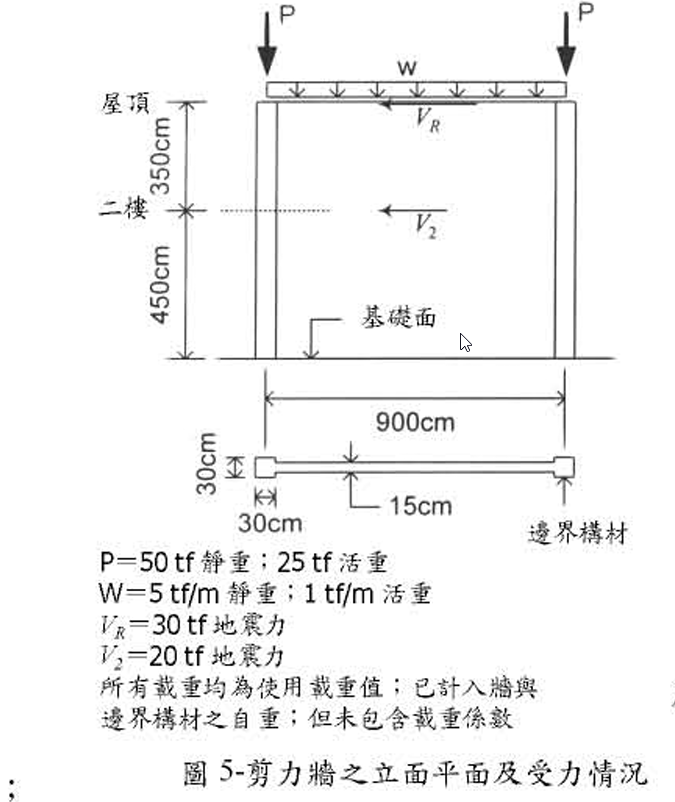

# 考題編號：RC-2003-4

**主分類：** `RC-U3-3` 韌性要求與耐震設計  
**副分類：** `RC-U2-1` RC 剪力強度分析與設計  
**設計法：** USD  
**標籤：** `剪力牆` `邊界構材` `水平剪力筋` `垂直剪力筋` `覆沒力矩` `αc係數` `φ=0.6` `單層配筋` `彎鉤錨定` `兩層樓高`

---

## 1. 原始題目重述

有一兩層樓高作廚房用之鋼筋混凝土剪力牆如圖5所示，試按民國92年1月1日生效，由營建署頒訂發行之「結構混凝土設計規範」設計計剪力牆之鋼筋配置。（40分）



*圖說：二層樓（2×450cm=900cm）RC剪力牆。牆長lw=900cm，厚tw=30cm，邊界構材30×30cm於兩端。軸壓P=50tf（25tf/邊界構材），地震力fo₁=30tf作用於屋頂（h=900cm），fo₂=20tf作用於二樓（h=450cm）。基底剪力V=50tf，基底覆沒彎矩M=360tf·m。*

**已知條件：**

| 項目 | 數值 |
|------|------|
| $f'_c$ | 280 kgf/cm²，常重混凝土 |
| $f_y$ | 4,200 kgf/cm² |
| 設計載重組合 | $U = 0.9D+1.43E$ 及 $U = 0.75(1.4D+1.7L\pm1.87E)$ |
| 邊界構材縱筋 | 限用#8，$d_b=2.54$ cm，$A_b=5.07$ cm² |
| 邊界構材橫筋 | 限用#4，$d_b=1.27$ cm，$A_b=1.27$ cm² |
| 水平剪力筋 | 限用#4 |
| 單層條件 | $V_u \le 0.53\sqrt{f'_c}\cdot A_{cv}$ |
| 剪力折減係數 | $\phi = 0.6$ |
| 彎鉤錨定長度 | $A_{dh} = 0.06f_y d_b/\sqrt{f'_c}$ |
| 軸壓 $P$ | 50 tf（25 tf/邊界構材，含上下柱重） |
| 地震力 | $f_{o1} = 30$ tf（屋頂，$h=900$ cm）；$f_{o2} = 20$ tf（二樓，$h=450$ cm） |

**求：**
1. 邊界構材縱向主筋及箍筋配置
2. 剪力牆版水平剪力筋配置 + 邊界構材錨定驗核
3. 剪力牆版垂直剪力筋配置 + 牆版應力驗核
4. 剪力牆斷面圖（文字描述）

---

## 2. 考題核心精神與出題者意圖

**核心觀念：** 剪力牆設計三步驟——①計算覆沒彎矩在邊界構材的拉壓力，②設計水平剪力筋（最小配筋量控制），③設計垂直分布筋。40分題考所有環節：荷載組合、邊界構材拉壓設計、水平筋配置、彎鉤錨定、垂直筋配置。

**出題者測驗：**
1. 兩種載重組合控制不同設計（拉力用Combo 1，壓力用Combo 2）
2. αc 係數隨 hw/lw 改變
3. 單層配筋的判斷與最小配筋率
4. 彎鉤錨定長度計算

---

## 3. 解題戰略地圖與陷阱分析

**計算步驟：**
1. 確認牆體幾何（Acv、hw/lw、αc）
2. 計算基底設計力（兩種組合）
3. 邊界構材拉壓力（覆沒力矩 ÷ lw_ce）
4. 選邊界構材主筋（#8）→ 驗核拉壓
5. 邊界構材箍筋設計（Ash 要求）
6. 單層水平剪力筋條件 → 最小ρh → 間距
7. 彎鉤錨定驗核
8. 垂直剪力筋（ρv ≥ ρh）

**關鍵陷阱：**

| # | 陷阱 | 說明 |
|---|------|------|
| ① | 拉壓力分別控制不同載重組合 | Combo 1（0.9D+1.43E）給最大拉力；Combo 2（0.75×1.4D+1.87E）給最大壓力 |
| ② | lw_ce ≠ lw | 覆沒力矩除以邊界構材形心距（lw - 2×15cm = 870cm），不是牆全長 |
| ③ | αc 在 kgf/cm² 制下 ≈ 0.80 | 此值對應 ACI 318-99 αc=0.25（MPa制），轉換後約0.80 |
| ④ | 最小配筋率通常控制水平剪力筋設計 | 本題Vu很小，αc×√f'c×Acv遠大於Vu，最小ρh=0.0025控制 |

---

## 3.5 變數層次分析（Variable Hierarchy Analysis）

### 最終目標

設計RC剪力牆之**邊界構材主筋與箍筋**、**水平剪力筋**、**垂直分布筋**，並驗核錨定。

### 本題關鍵公式（依計算順序）

$$\text{Step 1: } A_{cv} = t_w \times l_w$$

$$\text{Step 2（基底剪力）: } V_u = \phi_E \times (f_{o1}+f_{o2}),\quad M_u = \phi_E\times(f_{o1}\cdot h_1 + f_{o2}\cdot h_2)$$

$$\text{Step 3（邊界構材力）: } F_{OT} = \frac{\boxed{M_u}}{l_{w,ce}},\quad P_{BE} = \phi_g\times P_{per BE} \pm \boxed{F_{OT}}$$

$$\text{Step 4（水平剪力強度）: } \phi V_n = \phi\cdot A_{cv}\cdot(\alpha_c\sqrt{f'_c} + \rho_h f_y)$$

$$\text{Step 5（彎鉤錨定）: } A_{dh} = \frac{0.06\,f_y\,d_b}{\sqrt{f'_c}}$$

$$\text{Step 6（垂直分布筋）: } \rho_v \ge \max\!\left(0.0025,\ 0.0025+0.5(2.5-\frac{h_w}{l_w})(\rho_h-0.0025)\right)$$

### L1：題目直接給定

| 符號 | 數值 | 說明 |
|------|------|------|
| $l_w$ | 900 cm | 牆長 |
| $t_w$ | 30 cm | 牆厚 |
| $h_s$ | 450 cm | 每層高 |
| $H = h_w$ | 900 cm | 牆總高（兩層） |
| $P$ | 50 tf | 總軸壓（25tf/邊界構材） |
| $f_{o1}$ | 30 tf | 屋頂地震力（h₁=900cm） |
| $f_{o2}$ | 20 tf | 二樓地震力（h₂=450cm） |
| $f'_c$ | 280 kgf/cm² | |
| $f_y$ | 4,200 kgf/cm² | |

### L2：需知識點推導

**幾何與 αc**

| 符號 | 公式／來源 | 卡關? |
|------|-----------|-------|
| $A_{cv}$ | $30\times900=27{,}000$ cm² | |
| $h_w/l_w$ | $900/900=1.0 \le 1.5$ | |
| $\alpha_c$ | 0.80（kgf/cm²，$h_w/l_w\le1.5$） | |
| $l_{w,ce}$ | $900-2\times15=870$ cm | |

**設計力**

| 符號 | 公式 | 卡關? |
|------|------|-------|
| $V_u$（Combo 1） | $1.43\times50=71.5$ tf | |
| $M_u$（Combo 1） | $1.43\times36{,}000=51{,}480$ tf·cm | |
| $F_{OT}$（Combo 1） | $51{,}480/870=59.2$ tf | |
| 拉力BE（Combo 1） | $-22.5+59.2=+36.7$ tf（拉力） | |
| 壓力BE（Combo 2） | $26.25+58.2=84.5$ tf（壓力） | |

**鋼筋**

| 符號 | 公式 | 卡關? |
|------|------|-------|
| $\rho_{h,min}$ | 0.0025 → #4@15cm | |
| $s_h$ | $1.27/(0.0025\times30)=16.9$ cm → 15cm | |
| $A_{dh}$ | $0.06\times4200\times1.27/16.73=19.1$ cm | |
| $\rho_{v,min}$ | 0.00274 → #4@15cm | |

### L3：深層知識（不懂就卡住）

| 知識點 | 說明 | 卡關? |
|--------|------|-------|
| αc 的轉換（MPa→kgf/cm²） | ACI 318M: αc=0.25（MPa），轉 kgf/cm²：0.25÷√0.0981≈0.80 | |
| lw_ce 的計算 | 邊界構材形心距 = 牆長 - 兩個BE各半個寬度 | |
| 拉壓力公式 | F_tension = -Pu/2 + Mu/lw_ce（負號=拉力），F_comp = +Pu/2 + Mu/lw_ce | |
| 最小配筋率控制 | αc×√f'c×Acv >> Vu，因此水平筋用最小量 | |
| ρv 與 hw/lw 的關係 | hw/lw < 2 時，ρv 隨 ρh 調整（短牆需更多垂直筋） | |

---

## 4. 步驟化詳細計算過程

### Step 1　牆體幾何

$$A_{cv} = t_w \times l_w = 30\times900 = \boxed{27{,}000\ \text{cm}^2}$$

$$\frac{h_w}{l_w} = \frac{900}{900} = 1.0 \le 1.5 \Rightarrow \alpha_c = 0.80\ \text{（kgf/cm}^2\text{ 制）}$$

基底地震作用：
$$V = f_{o1}+f_{o2} = 30+20 = 50\ \text{tf（基底剪力）}$$

$$M_{base} = 30\times900 + 20\times450 = 27{,}000+9{,}000 = \boxed{36{,}000\ \text{tf·cm} = 360\ \text{tf·m}}$$

> 邊界構材形心距（BE為30cm寬，形心在端部15cm處）：  
> $l_{w,ce} = 900 - 2\times15 = \boxed{870\ \text{cm}}$

---

### Step 2　設計載重組合

**Combo 1：$U = 0.9D + 1.43E$**（最大地震 + 最小重力，控制拉力）

$$P_u = 0.9\times50 = 45\ \text{tf}\ (\text{每BE}: 22.5\ \text{tf})$$
$$V_u = 1.43\times50 = \boxed{71.5\ \text{tf}}$$
$$M_u = 1.43\times36{,}000 = \boxed{51{,}480\ \text{tf·cm}}$$

**Combo 2：$U = 0.75(1.4D+1.87E)$**（取 $L=0$，控制壓力）

$$P_u = 0.75\times1.4\times50 = 52.5\ \text{tf}\ (\text{每BE}: 26.25\ \text{tf})$$
$$V_u = 0.75\times1.87\times50 = 70.1\ \text{tf}$$
$$M_u = 0.75\times1.87\times36{,}000 = 50{,}625\ \text{tf·cm}$$

**各項最大值：**

| 控制量 | 值 | 來源 |
|--------|-----|------|
| $V_u$（max） | 71.5 tf | Combo 1 |
| $M_u$（max） | 51,480 tf·cm | Combo 1 |
| BE 最大壓力 | 84.5 tf | Combo 2 |
| BE 最大拉力 | 36.7 tf | Combo 1 |

---

### Step 3　邊界構材設計

**邊界構材受力（覆沒力矩效應）：**

$$F_{OT} = \frac{M_u}{l_{w,ce}}$$

Combo 1: $F_{OT} = 51{,}480/870 = 59.2\ \text{tf}$

$$P_{BE,\text{壓}} = \frac{P_u}{2} + F_{OT} = 22.5 + 59.2 = 81.7\ \text{tf}\quad\text{（Combo 1）}$$
$$P_{BE,\text{拉}} = -\frac{P_u}{2} + F_{OT} = -22.5 + 59.2 = +36.7\ \text{tf（拉力）}\quad\text{（Combo 1）}$$

Combo 2: $F_{OT} = 50{,}625/870 = 58.2\ \text{tf}$
$$P_{BE,\text{壓,max}} = 26.25 + 58.2 = \boxed{84.5\ \text{tf}}\quad\text{（Combo 2，最大壓力）}$$

**邊界構材斷面：30cm × 30cm，$A_g = 900\ \text{cm}^2$**

**選配主筋：4-#8（角筋各一）**
$$A_{st} = 4\times5.07 = 20.28\ \text{cm}^2,\quad \rho_g = 20.28/900 = 2.25\%\quad(1\%\sim8\%\ \checkmark)$$

**壓力驗核（Combo 2）：**

$$\phi P_n = 0.65\times[0.85\times280\times(900-20.28)+4{,}200\times20.28]$$
$$= 0.65\times[0.85\times280\times879.72+85{,}176]$$
$$= 0.65\times[209{,}359+85{,}176] = 0.65\times294{,}535 = \boxed{191{,}448\ \text{kgf} = 191.4\ \text{tf}}$$

$$\phi P_n = 191.4\ \text{tf} > P_{BE,max} = 84.5\ \text{tf}\quad\checkmark$$

**拉力驗核（Combo 1）：**

$$\phi T_n = \phi \times f_y \times A_{st} = 0.9\times4{,}200\times20.28 = 76{,}659\ \text{kgf} = \boxed{76.7\ \text{tf}}$$

$$\phi T_n = 76.7\ \text{tf} > P_{BE,\text{拉}} = 36.7\ \text{tf}\quad\checkmark$$

**邊界構材箍筋設計（耐震圍束）：**

間距限制：$s \le \min(b/4,\ 6d_{b,\text{main}},\ 10\ \text{cm})$

$$= \min(30/4,\ 6\times2.54,\ 10) = \min(7.5,\ 15.24,\ 10) = \boxed{7.5\ \text{cm}}$$

核心尺寸（中心至中心）：$h_c = 30-2\times4-2\times(1.27/2) = 30-8-1.27 = 20.73\ \text{cm}$

$A_{ch} = 20.73^2 = 429.7\ \text{cm}^2$

Ash 需求（s=7.5cm）：

$$0.09\times7.5\times20.73\times\frac{280}{4{,}200} = 0.09\times7.5\times20.73\times0.0667 = 0.93\ \text{cm}^2$$

$$0.3\times\!\left(\frac{900}{429.7}-1\right)\times7.5\times20.73\times0.0667 = 0.3\times1.094\times7.5\times1.382 = \boxed{3.40\ \text{cm}^2\ \text{（控制）}}$$

箍筋選配：
- **1個 #4 閉合方形箍**：2肢/方向 → $A_{sh} = 2\times1.27 = 2.54\ \text{cm}^2 < 3.40$（不足）
- **加入1根 #4 繫筋（每方向）**：$A_{sh} = 2.54+1.27 = \boxed{3.81\ \text{cm}^2 > 3.40\ \checkmark}$

$$\therefore \text{邊界構材箍筋：\#4 閉合箍 + \#4 繫筋（各向）@}7.5\ \text{cm}$$

---

### Step 4　水平剪力筋設計

**單層配筋條件驗核：**

$$0.53\sqrt{f'_c}\cdot A_{cv} = 0.53\times\sqrt{280}\times27{,}000 = 0.53\times16.73\times27{,}000 = 239{,}565\ \text{kgf} = 239.6\ \text{tf}$$

$$V_u = 71.5\ \text{tf} \ll 239.6\ \text{tf}\quad\checkmark\ \text{（採單層配置）}$$

**所需最小水平配筋率：**

$$\phi V_n = \phi\cdot A_{cv}\cdot(\alpha_c\sqrt{f'_c}+\rho_h f_y) \ge V_u$$

$$0.6\times27{,}000\times(0.80\times16.73+\rho_h\times4{,}200) \ge 71{,}500\ \text{kgf}$$

即使 $\rho_h = 0$：$\phi V_c = 0.6\times27{,}000\times13.38 = 216{,}756\ \text{kgf} = 216.8\ \text{tf} > 71.5\ \text{tf}$

> 混凝土強度已超過需求 → **最小配筋率** $\rho_{h,\min} = 0.0025$ **控制**

$$s_h = \frac{A_{b,h}}{\rho_{h,\min}\times t_w} = \frac{1.27}{0.0025\times30} = 16.9\ \text{cm} \to \text{採}\ \boxed{15\ \text{cm}}$$

最大間距：$\min(l_w/5,\ 3t_w,\ 45\ \text{cm}) = \min(180,\ 90,\ 45) = 45\ \text{cm} > 15\ \text{cm}\quad\checkmark$

$$\rho_h = \frac{1.27}{30\times15} = 0.00282 > 0.0025\quad\checkmark$$

$$\therefore \text{水平剪力筋：\#4 單層 @ 15 cm}$$

**彎鉤錨定驗核：**

$$A_{dh} = \frac{0.06\times f_y\times d_b}{\sqrt{f'_c}} = \frac{0.06\times4{,}200\times1.27}{\sqrt{280}} = \frac{320.0}{16.73} = \boxed{19.1\ \text{cm}}$$

邊界構材可用深度（從牆面算起）：$30 - 4(\text{淨保護層}) = 26\ \text{cm}$

$$A_{dh} = 19.1\ \text{cm} < 26\ \text{cm}\quad\checkmark\ \text{（彎鉤錨定充足）}$$

---

### Step 5　垂直剪力筋設計

依規範（hw/lw = 1.0 < 2.0，垂直筋比不得少於水平筋之某比例）：

$$\rho_{v,\min} = \max\!\left(0.0025,\ 0.0025+0.5\!\left(2.5-\frac{h_w}{l_w}\right)\!(\rho_h-0.0025)\right)$$

$$= \max\!\left(0.0025,\ 0.0025+0.5\times(2.5-1.0)\times(0.00282-0.0025)\right)$$

$$= \max(0.0025,\ 0.0025+0.5\times1.5\times0.00032)$$

$$= \max(0.0025,\ 0.0025+0.00024) = \max(0.0025,\ 0.00274) = \boxed{0.00274}$$

$$s_v = \frac{A_{b,v}}{\rho_{v,\min}\times t_w} = \frac{1.27}{0.00274\times30} = \frac{1.27}{0.0822} = 15.45\ \text{cm} \to \text{採}\ \boxed{15\ \text{cm}}$$

$$\rho_v = \frac{1.27}{30\times15} = 0.00282 > 0.00274\quad\checkmark$$

$$\therefore \text{垂直剪力筋：\#4 單層 @ 15 cm}$$

**牆版最大剪力應力驗核：**

$$\frac{V_u}{\phi\cdot A_{cv}} = \frac{71{,}500}{0.6\times27{,}000} = \frac{71{,}500}{16{,}200} = 4.41\ \text{kgf/cm}^2$$

最大允許牆版剪力：

$$V_{n,\max}/A_{cv} = 2.65\sqrt{f'_c} = 2.65\times16.73 = 44.3\ \text{kgf/cm}^2$$

$$4.41\ \text{kgf/cm}^2 \ll 44.3\ \text{kgf/cm}^2\quad\checkmark\ \text{（牆版不會壓碎）}$$

---

### Step 6　設計結果彙整

| 構件 | 設計結果 |
|------|---------|
| 邊界構材主筋 | 4-#8（一排，角筋各一），$\rho_g=2.25\%$ |
| 邊界構材箍筋 | #4 閉合箍 + #4 繫筋（X、Y各1）@7.5cm（耐震區）|
| 水平剪力筋 | #4 @ 15cm，單層，$\rho_h=0.00282$ |
| 垂直分布筋 | #4 @ 15cm，單層，$\rho_v=0.00282$ |
| 彎鉤錨定 | $A_{dh}=19.1$ cm < 26cm 可用深度 ✓ |

**剪力牆斷面示意（文字版）：**

```
┌──────────────────────────────────┐
│ BE(30×30)  牆版(840×30)  BE(30×30)│  → 900cm total
│ 4-#8      #4@15cm H+V   4-#8   │
│ #4@7.5    (single layer) #4@7.5 │
└──────────────────────────────────┘
        ↑ tw=30cm, lw=900cm
```

---

## 5. 關鍵爭議點與進階探討

**1. αc 係數的換算**

ACI 318-99（psi制）：
- hw/lw ≤ 1.5 → αc = 3.0 → 換算 kgf/cm² ≈ 0.795
- hw/lw ≥ 2.0 → αc = 2.0 → 換算 kgf/cm² ≈ 0.530

ACI 318M-99（MPa制）：
- hw/lw ≤ 1.5 → αc = 0.25（MPa^0.5）→ 換算 kgf/cm² ≈ 0.80

兩版本換算結果接近，本題取 αc = 0.80（kgf/cm²制）。

**2. 為何 Vc 遠超 Vu？**

本題 hw/lw = 1.0（方形牆），屬短矮牆，混凝土抗剪能力很強（αc = 0.80 最大值）。若 hw/lw = 2.0，αc 降至 0.53，Vc 僅約一半，可能需要計算用的剪力筋。

**3. 單層配置 vs 雙層配置的工程意義**

單層（ρ ≤ 0.53√f'c/fy 時允許）：節省材料，施工簡便。雙層配置除了強度較高，還有益於防止牆面劈裂，是高剪力需求時的標準做法。本題 Vu/φAcv = 4.41 kgf/cm² 遠低於限值，單層完全合理。

**4. 邊界構材是否需要特殊圍束？**

本題極端纖維壓應力：
$$f_c = P_u/A_g + M_u\times(l_w/2)/I_g = 45{,}000/27{,}000 + 51{,}480{,}000\times450/1{,}822{,}500{,}000$$
$$= 1.67 + 12.72 = 14.4\ \text{kgf/cm}^2 < 0.2f'_c = 56\ \text{kgf/cm}^2$$

雖依應力法不需特殊邊界構材，但本題已預設邊界構材於圖5，故仍需設計其圍束箍筋。
