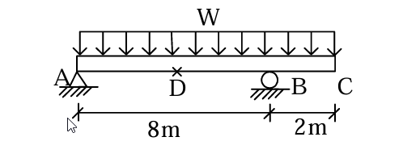

# 考題編號：RC-2004-2

**主分類：** `RC-U1-1` RC 梁彎矩強度分析與設計
**副分類：** 無
**設計法：** USD 強度設計法
**標籤：** `外伸梁` `懸臂梁` `D點跨中彎矩` `單筋梁` `Whitney應力塊` `D32鋼筋` `雙排配筋` `過渡區φ值` `ACI載重組合`

---

## 1. 原始題目重述 (Problem Restatement)

梁結構如圖所示，A-D-B 為 8 m 簡支段（D 為跨中），B-C 為 2 m 懸臂段：

*圖說：梁寬 b = 40 cm，梁高 h = 70 cm，有效深度 d = 60 cm，d' = 6.5 cm。A、B 為鉸支承，C 為自由端。均布載重作用於全長 10 m（A 至 C）。D 為 A-B 跨中（距 A 為 4 m）。*

| 參數 | 數值 |
|------|------|
| 簡支跨距 $L$ | $8\ \text{m}$（A-B）|
| 懸臂長 | $2\ \text{m}$（B-C）|
| $b \times h$ | $40 \times 70\ \text{cm}$ |
| $d$ | $60\ \text{cm}$ |
| $d'$ | $6.5\ \text{cm}$ |
| $w_D$（不含自重）| $5\ \text{t/m}$ |
| $w_L$ | $2\ \text{t/m}$ |
| $f'_c$ | $280\ \text{kgf/cm}^2$ |
| $f_y$ | $4200\ \text{kgf/cm}^2$（D32 主筋）|
| 箍筋 | D13 |

---

## 2. 考題核心精神與出題者意圖

**核心觀念：** 外伸梁的力學分析（反力計算 → D 點彎矩）+ USD 單筋梁設計 + D32 鋼筋排列。

**測驗重點：**
1. 正確求出懸臂端對簡支段的反力影響（懸臂使 B 支承力增大，A 支承力減小）
2. 判斷是否需要雙筋（本題 $M_u < \phi M_{n,\max}$ → 單筋即可）
3. D32 鋼筋排列：單排最多 5 根，超過需排兩排
4. 雙排配筋導致實際 $\varepsilon_t$ 落入過渡區，需調整 $\phi$

---

## 3. 解題戰略地圖與陷阱分析

**作戰計畫：**
1. 計算梁自重 $w_{SW}$，求總因數化載重 $W_u$
2. 由靜力求 $R_A$、$R_B$（ΣMa = 0）
3. 求 D 點（$x = 4\ \text{m}$）因數化彎矩 $M_u$
4. 計算 $\phi M_{n,\max}$（單筋上限）確認不需雙筋
5. 設計 $A_s$，選用 D32 鋼筋根數
6. 驗核 $\phi M_n \ge M_u$（注意 $\varepsilon_t$ 是否進入過渡區）

**關鍵陷阱（3 個）：**
- ⚠ **懸臂改變反力**：$R_A = 3.75W_u$（≠ $W_u L/2 = 4W_u$），懸臂使 A 端反力減小
- ⚠ **D32 排列限制**：單排最多 5 根（$b = 40\ \text{cm}$ 限制），6 根需排兩排，導致 $\varepsilon_t$ 偏低進入過渡區，$\phi < 0.9$
- ⚠ **加入 $w_{SW}$ 後再因數化**：梁自重屬死載重，須先加入再乘 1.4

---

## 3.5 變數層次分析 (Variable Hierarchy Analysis)

### 最終目標
求 D 點所需縱向鋼筋量，並完成鋼筋配置。

### 本題關鍵公式（依計算順序）

$$\text{Step 1: } W_u = 1.4(w_D + w_{SW}) + 1.7\,w_L$$

$$\text{Step 2: } R_B = \frac{W_u \times 10 \times 5}{8},\quad R_A = 10W_u - R_B$$

$$\text{Step 3: } M_u^D = R_A \times 4 - W_u \times \frac{4^2}{2}$$

$$\text{Step 4: } R_n = \frac{M_u}{\phi \cdot b \cdot d^2},\quad \rho = \frac{0.85f'_c}{f_y}\left[1-\sqrt{1-\frac{2R_n}{0.85f'_c}}\right]$$

$$\text{Step 5: } A_s = \rho \cdot b \cdot d \quad\Rightarrow\quad \text{選用 D32 根數}$$

$$\text{Step 6: } a = \frac{A_s f_y}{0.85f'_c b},\quad \varepsilon_t = 0.003\frac{d-c}{c},\quad \phi M_n \ge M_u\ ?$$

### L1：題目直接給定

| 符號 | 數值 | 說明 |
|------|------|------|
| $b,h,d$ | $40,70,60\ \text{cm}$ | 梁斷面 |
| $w_D$（不含自重）| $5\ \text{t/m}$ | 均布呆載重 |
| $w_L$ | $2\ \text{t/m}$ | 均布活載重 |
| $L_{AB}$ | $8\ \text{m}$ | 簡支段 |
| $L_{BC}$ | $2\ \text{m}$ | 懸臂段 |

### L2：需知識點推導

| 符號 | 公式／來源 | 卡關? |
|------|------|------|
| $w_{SW}$ | $0.40 \times 0.70 \times 2.4\ \text{t/m}^3 = 0.672\ \text{t/m}$ | |
| $W_u$ | $1.4(5.672) + 1.7(2) = 11.34\ \text{t/m}$ | |
| $R_A, R_B$ | 靜力計算 | |
| $M_u^D$ | $7W_u = 79.4\ \text{t·m}$ | |
| $\phi M_{n,\max}$ | 以 $\varepsilon_t = 0.005$ 計算上限 | |
| $A_s$ | 需求量 vs 6-D32 提供量 | |
| $\varepsilon_t$ | 依 $c$ 計算（過渡區判斷）| |

---

## 4. 步驟化詳細計算過程

### ① 梁自重與因數化載重

$$w_{SW} = b \times h \times \gamma = 0.40 \times 0.70 \times 2400 = 672\ \text{kg/m} = 0.672\ \text{t/m}$$

$$W_u = 1.4(w_D + w_{SW}) + 1.7\,w_L = 1.4(5 + 0.672) + 1.7 \times 2 = 7.941 + 3.400 = 11.34\ \text{t/m}$$

---

### ② 支承反力（均布載重 $W_u$ 作用於全長 10 m）

$$\sum M_A = 0:\quad R_B \times 8 = W_u \times 10 \times 5 \Rightarrow R_B = \frac{50 \times 11.34}{8} = 70.9\ \text{t}$$

$$R_A = 11.34 \times 10 - 70.9 = 42.5\ \text{t}$$

---

### ③ D 點因數化彎矩（$x = 4\ \text{m}$ 自 A）

$$M_u^D = R_A \times 4 - W_u \times \frac{4^2}{2} = 42.5 \times 4 - 11.34 \times 8 = 170.0 - 90.7 = \boxed{79.4\ \text{t·m}}$$

---

### ④ 檢核是否需要雙筋（以 $\varepsilon_t = 0.005$ 計算 $\phi M_{n,\max}$）

$\varepsilon_t = 0.005$ 時的中性軸深度：
$$c_{0.005} = \frac{0.003}{0.003+0.005} \times d = \frac{0.003}{0.008} \times 60 = 22.5\ \text{cm}$$
$$a_{0.005} = \beta_1 c = 0.85 \times 22.5 = 19.13\ \text{cm}$$
$$A_{s,0.005} = \frac{0.85 f'_c \cdot b \cdot a}{f_y} = \frac{9520 \times 19.13}{4200} = 43.4\ \text{cm}^2$$

$$\phi M_{n,\max} = 0.9 \times 43.4 \times 4200 \times \left(60 - \frac{19.13}{2}\right) = 0.9 \times 182{,}280 \times 50.44 = 82.7\ \text{t·m}$$

**結論：** $M_u = 79.4\ \text{t·m} < \phi M_{n,\max} = 82.7\ \text{t·m}$ → **單筋梁即可，$\phi = 0.9$**

---

### ⑤ 設計 $A_s$（$\phi = 0.9$）

$$R_n = \frac{M_u}{\phi \cdot b \cdot d^2} = \frac{79.4 \times 10^5}{0.9 \times 40 \times 60^2} = \frac{7{,}940{,}000}{129{,}600} = 61.3\ \text{kgf/cm}^2$$

$$\rho = \frac{0.85 f'_c}{f_y}\left[1 - \sqrt{1 - \frac{2R_n}{0.85f'_c}}\right] = \frac{0.85 \times 280}{4200}\left[1 - \sqrt{1 - \frac{2 \times 61.3}{238}}\right]$$

$$= 0.05667 \times \left[1 - \sqrt{1 - 0.5151}\right] = 0.05667 \times \left[1 - \sqrt{0.4849}\right] = 0.05667 \times 0.3036 = 0.01720$$

$$A_{s,\text{req}} = \rho \cdot b \cdot d = 0.01720 \times 40 \times 60 = 41.3\ \text{cm}^2$$

**最小鋼筋量驗核：**
$$A_{s,\min} = \frac{14}{f_y} \times b \times d = \frac{14}{4200} \times 40 \times 60 = 8.0\ \text{cm}^2 \ll 41.3\ \text{cm}^2\ \checkmark$$

---

### ⑥ 選用鋼筋（D32，$a_b = 8.19\ \text{cm}^2$）

$$n_{\min} = \frac{41.3}{8.19} = 5.04 \Rightarrow \text{需 6 根 D32}$$

> 5 根驗核：$A_s = 40.95\ \text{cm}^2$，$a = 18.1\ \text{cm}$，$\phi M_n = 0.9 \times 171{,}990 \times 51.0 = 78.9\ \text{t·m} < 79.4\ \text{t·m}$（不足）

**使用 6-D32：** $A_s = 6 \times 8.19 = 49.14\ \text{cm}^2$

---

### ⑦ 驗核 $\phi M_n$（6 根 D32）

$$a = \frac{49.14 \times 4200}{0.85 \times 280 \times 40} = \frac{206{,}388}{9{,}520} = 21.67\ \text{cm}$$

$$c = \frac{a}{\beta_1} = \frac{21.67}{0.85} = 25.49\ \text{cm}$$

$$\varepsilon_t = 0.003 \times \frac{d-c}{c} = 0.003 \times \frac{60-25.49}{25.49} = 0.003 \times 1.354 = 0.00406$$

由於 $\varepsilon_y < \varepsilon_t = 0.00406 < 0.005$（**過渡區**），需調整 $\phi$：

$$\phi = 0.65 + (\varepsilon_t - 0.002) \times \frac{0.25}{0.003} = 0.65 + \frac{0.00406-0.002}{0.003} \times 0.25 = 0.65 + 0.172 = 0.822$$

$$\phi M_n = 0.822 \times 49.14 \times 4200 \times \left(60 - \frac{21.67}{2}\right) = 0.822 \times 206{,}388 \times 49.165$$

$$= 0.822 \times 10{,}146{,}779 = 8{,}340{,}652\ \text{kgf·cm} = \boxed{83.4\ \text{t·m}}$$

$$\phi M_n = 83.4\ \text{t·m} \ge M_u = 79.4\ \text{t·m} \quad \checkmark$$

---

### ⑧ 鋼筋配置

**排列驗核（$b = 40\ \text{cm}$，D32 + D13 箍筋，覆蓋層 4 cm）：**

單排最大根數：
$$b = 2(4 + 1.27) + n \times 3.23 + (n-1) \times 3.23 \le 40\ \text{cm}$$
$$\Rightarrow (2n-1) \times 3.23 \le 29.46 \Rightarrow n \le 5.06 \Rightarrow \text{單排最多 5 根}$$

→ **6 根 D32 需分兩排（3+3 排列）**

各排距底部距離：
- 第 1 排（底部）：$4 + 1.27 + 1.615 = 6.885\ \text{cm}$
- 第 2 排：$6.885 + 3.23 + 2.5 = 12.615\ \text{cm}$（排間淨距 25 mm）

合力中心：$\bar{y} = \dfrac{3 \times 6.885 + 3 \times 12.615}{6} = 9.75\ \text{cm}$ 自底部

實際有效深度：$d_\text{actual} = 70 - 9.75 = \mathbf{60.25\ \text{cm}} \approx 60\ \text{cm}$ ✓

**最終配置：底部拉力筋 6-D32（兩排，各 3 根）**

---

## 5. 關鍵爭議點與進階探討

**① D 點正確為 A-B 跨中（非 A-C 之中）**

題目圖示 A-D-B-C 排列，D 在 A 與 B 之間，確認 $x_D = 4\ \text{m}$ 自 A。若誤將 D 取在 A-C 全長中點（$x = 5\ \text{m}$），所求彎矩將不同。

**② 懸臂使 A 端反力「縮水」**

若無懸臂，$R_A = 4.5W_u$；加入 2 m 懸臂後，$R_A = 3.75W_u$，減少 16.7%。這導致 D 點正彎矩由 $wL^2/8 = 8W_u$ 降至 $7W_u$，考生容易忽略懸臂的影響。

**③ 鋼筋過渡區的設計取向**

6 根 D32 使 $\varepsilon_t = 0.00406$（過渡區），$\phi = 0.822$ 而非 0.9。這說明在設計初期假設 $\phi = 0.9$ 求出 $A_s = 41.3\ \text{cm}^2$，再配置 6 D32（49.14 cm²）後，$\phi$ 下降但 $\phi M_n$ 仍足夠——是典型的「設計迭代」情形。考場上可直接選 6 根，再驗核 $\phi M_n$，不需重算 $A_s$。
