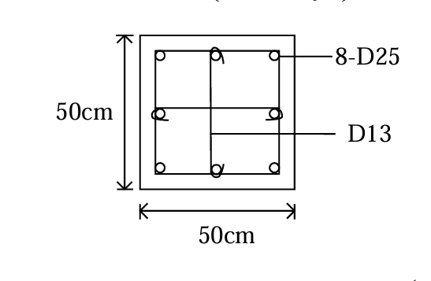

# 考題編號：RC-2004-3

**主分類：** `RC-U3-3` 韌性要求與耐震設計
**副分類：** `RC-U1-2` RC 柱強度分析與設計
**設計法：** USD 強度設計法
**標籤：** `耐震柱` `Ash公式` `圍束箍筋` `繫筋` `密箍區間距` `特殊矩形框架柱` `D13箍筋` `8-D25`

---

## 1. 原始題目重述 (Problem Restatement)

柱之橫向鋼筋若為矩形閉合箍筋，需滿足耐震特別規定：

$$A_{sh} = 0.3\!\left(s \cdot h_c \cdot \frac{f'_c}{f_{yh}}\right)\!\left(\frac{A_g}{A_{ch}} - 1\right)$$

$$A_{sh} = 0.09\!\left(s \cdot h_c \cdot \frac{f'_c}{f_{yh}}\right)$$

試問如圖所示之柱斷面橫向鋼筋之**間距**該如何才能滿足規範要求。（15 分）

*圖說：柱斷面 50 cm × 50 cm，主筋 8-D25（$f_y = 4200\ \text{kgf/cm}^2$）配置於 4 角及各面中點。箍筋及繫筋均為 D13（$f_{yh} = 2800\ \text{kgf/cm}^2$）。外側矩形閉合箍筋 1 組 + 繫筋 2 支（每方向各 1 支）。$f'_c = 280\ \text{kgf/cm}^2$。*

| 參數 | 數值 |
|------|------|
| 柱斷面 | $50 \times 50\ \text{cm}$ |
| 主筋 | 8-D25（$a_b = 5.10\ \text{cm}^2$，$d_b = 2.54\ \text{cm}$）|
| 箍筋 / 繫筋 | D13（$a_b = 1.29\ \text{cm}^2$，$d_{tie} = 1.27\ \text{cm}$，$f_{yh} = 2800\ \text{kgf/cm}^2$）|
| $f'_c$ | $280\ \text{kgf/cm}^2$ |

---

## 2. 考題核心精神與出題者意圖

**核心觀念：** ACI 耐震柱圍束箍筋（Ash）公式控制間距——從「提供的 $A_{sh}$」反推「最大允許間距 $s$」。

**測驗重點：**
1. 正確識別 $A_{sh,\text{provided}}$：外閉合箍筋 + 繫筋共同構成 Ash（需清楚繫筋貢獻方向）
2. 正確計算 $A_g$、$A_{ch}$、$h_c$（注意覆蓋層推算）
3. 兩公式均需滿足，取較嚴者；再與規範最大間距比較

---

## 3. 解題戰略地圖與陷阱分析

**作戰計畫：**
1. 計算斷面幾何：$A_g$、$h_c$、$A_{ch}$
2. 確定 $A_{sh,\text{provided}}$（每方向的 D13 條數）
3. 由 Ash 公式推算最大 $s$（兩式均算，取小值）
4. 與規範間距上限比較，取最終控制值

**關鍵陷阱（3 個）：**
- ⚠ **$h_c$ 的定義**：$h_c$ = 中心到中心箍筋距離 ≈ 柱寬 − 2 × 覆蓋層 = 50 − 8 = 42 cm（以覆蓋層 4 cm 計）
- ⚠ **$A_{sh}$ 只計算「對該方向有貢獻」的腱**：檢核 X 方向時，只算 Y 方向的腱腿（外箍 2 腿 + Y 方向繫筋 1 條）= 3 根 D13
- ⚠ **公式一（含 $A_g/A_{ch}$）通常比公式二更嚴**：本題亦然，控制間距

---

## 3.5 變數層次分析 (Variable Hierarchy Analysis)

### 最終目標
求滿足兩個 $A_{sh}$ 公式及規範間距要求的最大箍筋間距 $s$（cm）。

### 本題關鍵公式（依計算順序）

$$\text{Step 1: } h_c = b - 2 \times \text{cover} = 50 - 8 = 42\ \text{cm}$$

$$\text{Step 2: } A_{ch} = h_c^2 = 42^2 = 1764\ \text{cm}^2$$

$$\text{Step 3: } A_{sh,\text{provided}} = n_{legs} \times a_b = 3 \times 1.29 = 3.87\ \text{cm}^2$$

$$\text{Step 4 (公式一): } s \le \frac{A_{sh}}{0.3 \cdot h_c \cdot \dfrac{f'_c}{f_{yh}} \cdot \left(\dfrac{A_g}{A_{ch}}-1\right)}$$

$$\text{Step 5 (公式二): } s \le \frac{A_{sh}}{0.09 \cdot h_c \cdot \dfrac{f'_c}{f_{yh}}}$$

$$\text{Step 6 (規範上限): } s \le \min\!\left(\frac{b}{4},\ 6d_b,\ 150\ \text{mm}\right)$$

### L1：題目直接給定

| 符號 | 數值 | 說明 |
|------|------|------|
| $b = h$ | $50\ \text{cm}$ | 正方形柱邊長 |
| D13（箍筋 + 繫筋）| $a_b = 1.29\ \text{cm}^2$，$d_{tie} = 1.27\ \text{cm}$ | |
| D25（主筋）| $d_b = 2.54\ \text{cm}$ | |
| $f'_c$ | $280\ \text{kgf/cm}^2$ | |
| $f_{yh}$ | $2800\ \text{kgf/cm}^2$ | 箍筋 / 繫筋 |

### L2：需知識點推導

| 符號 | 公式／來源 | 卡關? |
|------|------|------|
| $h_c$ | $50 - 2 \times 4 = 42\ \text{cm}$ | |
| $A_g$ | $50^2 = 2500\ \text{cm}^2$ | |
| $A_{ch}$ | $42^2 = 1764\ \text{cm}^2$ | |
| $A_{sh,\text{prov}}$ | $3 \times 1.29 = 3.87\ \text{cm}^2$（外箍 2 腿 + 繫筋 1 條）| |
| $s_{\max,F1}$ | 公式一反推 = 7.4 cm | |
| $s_{\max,F2}$ | 公式二反推 = 10.2 cm | |
| $s_{\max,\text{code}}$ | $\min(12.5, 15.2, 15)= 12.5\ \text{cm}$ | |

### L3：深層知識（不懂就卡住）

| 知識點 | 說明 | 卡關? |
|--------|------|------|
| $A_{sh}$ 僅計「垂直於 $h_c$ 方向」的腱腿 | 檢核 X 方向（$h_c = 42\ \text{cm}$）時，只算 Y 方向的腱腿；外箍有 2 條 Y 腿，再加 Y 向繫筋 1 條 = 3 條 | |
| 公式一通常比公式二嚴（本題） | $0.3 \times (A_g/A_{ch}-1) = 0.3 \times 0.417 = 0.125 > 0.09$，故公式一較嚴 | |
| 規範最大間距三條件 | $s \le \min(b/4,\ 6d_b,\ 150\ \text{mm})$；本題以 $b/4 = 12.5\ \text{cm}$ 控制 | |

---

## 4. 步驟化詳細計算過程

### ① 斷面幾何參數

$$A_g = 50 \times 50 = 2500\ \text{cm}^2$$

覆蓋層至 D13 箍筋外緣 = 4 cm（標準覆蓋），故：

$$h_c = 50 - 2 \times 4 = 42\ \text{cm}$$

$$A_{ch} = 42 \times 42 = 1764\ \text{cm}^2$$

$$\frac{A_g}{A_{ch}} - 1 = \frac{2500}{1764} - 1 = 1.417 - 1 = 0.417$$

---

### ② 每方向提供之 $A_{sh}$

本柱配置：外矩形閉合箍筋（D13）+ 繫筋（D13）各 1 支／方向

**檢核 X 方向（$h_c = 42\ \text{cm}$）：**
計算「Y 方向」之腱腿截面積（對 X 方向圍束有效）：

| 組件 | Y 方向腿數 | 貢獻 $A_{sh}$（cm²）|
|------|:---:|:---:|
| 外矩形閉合箍筋 | 2（左腿 + 右腿）| $2 \times 1.29 = 2.58$ |
| Y 方向繫筋（1 支）| 1 | $1 \times 1.29 = 1.29$ |
| **合計** | **3** | **$3.87\ \text{cm}^2$** |

由對稱性，Y 方向同理：$A_{sh,\text{prov}} = 3.87\ \text{cm}^2$

---

### ③ 公式一求最大間距

$$A_{sh} = 0.3\,s \cdot h_c \cdot \frac{f'_c}{f_{yh}} \cdot \left(\frac{A_g}{A_{ch}} - 1\right) \le A_{sh,\text{prov}}$$

$$3.87 \ge 0.3 \times s \times 42 \times \frac{280}{2800} \times 0.417 = s \times 0.526$$

$$s \le \frac{3.87}{0.526} = \boxed{7.36\ \text{cm}}$$

---

### ④ 公式二求最大間距

$$A_{sh} = 0.09\,s \cdot h_c \cdot \frac{f'_c}{f_{yh}} \le A_{sh,\text{prov}}$$

$$3.87 \ge 0.09 \times s \times 42 \times \frac{280}{2800} = 0.378s$$

$$s \le \frac{3.87}{0.378} = \boxed{10.24\ \text{cm}}$$

---

### ⑤ 規範最大間距（ACI 318-99 Section 21.4.4）

$$s_{\max} = \min\!\left(\frac{b_{\min}}{4},\ 6d_b,\ 150\ \text{mm}\right)$$

$$= \min\!\left(\frac{50}{4},\ 6 \times 2.54,\ 15\right) = \min(12.5,\ 15.2,\ 15) = 12.5\ \text{cm}$$

---

### ⑥ 控制間距

| 條件 | 最大間距 |
|------|:---:|
| 公式一（$A_g/A_{ch}$ 比值項）| **7.4 cm**（控制）|
| 公式二 | 10.2 cm |
| 規範最大間距 | 12.5 cm |

$$\boxed{s \le 7.4\ \text{cm}}$$

實際使用：**$s = 7\ \text{cm}$**（或 $s = 7.5\ \text{cm}$，可酌情選取 $\le 7.4\ \text{cm}$）

---

## 5. 關鍵爭議點與進階探討

**① 公式一 vs 公式二的控制條件**

公式一含 $(A_g/A_{ch} - 1)$ 項，物理意義是：柱核心面積越小（覆蓋層越厚），需要越多圍束箍筋。本題 $A_g/A_{ch} = 1.417$，比值項 $= 0.417$；
比較：$0.3 \times 0.417 = 0.125 > 0.09$，故公式一永遠較公式二嚴，控制設計。

**② 繫筋貢獻方向的正確計算**

一根 Y 方向繫筋只對**檢核 X 方向**的 $A_{sh}$ 有貢獻（相反亦然）。若誤將所有 D13 截面積加總（共 4 根 × 1.29 = 5.16 cm²）用於同一方向計算，將高估 $A_{sh}$，低估所需間距，是考場常見錯誤。

**③ 若無繫筋（僅外箍）**

若只有外閉合箍筋（$A_{sh} = 2 \times 1.29 = 2.58\ \text{cm}^2$）：
$$s \le \frac{2.58}{0.526} = 4.9\ \text{cm}$$
外箍加繫筋後提升到 7.4 cm，說明繫筋對改善施工可行性（間距放寬）有實質幫助。

**④ 密箍區長度（附加知識）**

除間距外，耐震規範要求密箍區長度 $l_o$：
$$l_o \ge \max\!\left(\frac{l_n}{6},\ \text{柱最大邊長},\ 450\ \text{mm}\right) = \max\!\left(\frac{l_n}{6},\ 50\ \text{cm},\ 45\ \text{cm}\right) = \max\!\left(\frac{l_n}{6},\ 50\right)\ \text{cm}$$
本題未提供柱淨高，故不計算，但考場應能說明此要求。
