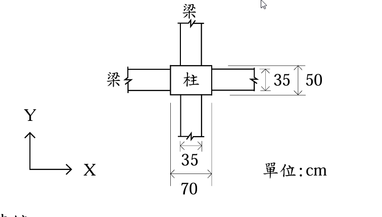

# 考題編號：RC-2004-4

**主分類：** `RC-U1-2` RC 柱強度分析與設計
**副分類：** `RC-U1-3` 細長柱
**設計法：** USD 強度設計法
**標籤：** `雙軸彎矩` `細長柱` `彎矩放大法` `δns放大係數` `無側移構架` `ACI載重組合` `雙曲度` `M1M2比值` `迴轉半徑`

---

## 1. 原始題目重述 (Problem Restatement)

建築物壹樓高度 600 cm，壹樓中一根柱尺寸為 50 cm × 70 cm，所連接貳樓梁均為 35 cm × 70 cm。

**呆載重（D）：**
$P_D = 200\ \text{t}$，$M_{DX,\text{頂}} = +8\ \text{t·m}$，$M_{DY,\text{頂}} = +10\ \text{t·m}$，$M_{DX,\text{底}} = -12\ \text{t·m}$，$M_{DY,\text{底}} = -10\ \text{t·m}$

**活載重（L）：**
$P_L = 100\ \text{t}$，$M_{LX,\text{頂}} = +9\ \text{t·m}$，$M_{LY,\text{頂}} = +12\ \text{t·m}$，$M_{LX,\text{底}} = -8\ \text{t·m}$，$M_{LY,\text{底}} = -6\ \text{t·m}$

（正號 = 順時鐘，負號 = 逆時鐘）

*圖說：柱 50 cm（X 方向）× 70 cm（Y 方向），貳樓梁 35 cm 寬 × 70 cm 深。X 軸水平、Y 軸垂直。*

---

## 2. 考題核心精神與出題者意圖

**核心觀念：** USD 載重組合 + 細長柱細長比驗核（無側移構架），判斷是否需要 $\delta_{ns}$ 彎矩放大。

**測驗重點：**
1. 正確做 $1.4D + 1.7L$ 組合（頂、底、軸力各方向）
2. 計算各方向迴轉半徑 $r$，求 $kl_u/r$
3. 判斷彎矩方向（雙曲度 vs 單曲度）→ 確定 $M_1/M_2$ 的正負號
4. 與 $34-12(M_1/M_2)$ 比較，決定是否需要放大

**典型陷阱（3 個）：**
- ⚠ **$M_1/M_2$ 正負號**：ACI 318-99 規定，雙曲度（S 形，兩端反號）時 $M_1/M_2$ 取**負值**，使限制值 $> 34$；單曲度時取正值（≤ 40）
- ⚠ **$r$ 的方向**：$r_x = h_y/\sqrt{12} = 70/\sqrt{12}$（X 軸彎矩用 Y 方向尺寸），$r_y = b_x/\sqrt{12} = 50/\sqrt{12}$（Y 軸彎矩用 X 方向尺寸）
- ⚠ **頂部 vs 底部 M2**：Y 方向最大彎矩在頂部（34.4 t·m），X 方向最大彎矩在底部（30.4 t·m）

---

## 3. 解題戰略地圖與陷阱分析

**作戰計畫：**
1. $U = 1.4D + 1.7L$：求頂、底各方向因數化彎矩 + $P_u$
2. 確認各方向彎矩的雙/單曲度 → 決定 $M_1/M_2$
3. 計算 $r_x$、$r_y$（各方向迴轉半徑）
4. 取 $k = 1.0$，$l_u = 600\ \text{cm}$，計算 $kl_u/r$
5. 與 $34 - 12(M_1/M_2)$ 比較，決定是否放大
6. 若放大：計算 $\beta_d$、$EI$、$P_c$、$C_m$、$\delta_{ns}$

---

## 3.5 變數層次分析 (Variable Hierarchy Analysis)

### 最終目標
求柱頂部的設計值 $P_u$（t）、$M_{ux}$（t·m）、$M_{uy}$（t·m），包含細長柱效應。

### 本題關鍵公式

$$P_u = 1.4P_D + 1.7P_L$$
$$M_{u,\text{頂/底}} = 1.4M_{D,\text{頂/底}} + 1.7M_{L,\text{頂/底}}$$

$$r_x = \frac{h_Y}{\sqrt{12}} = \frac{70}{3.464},\quad r_y = \frac{b_X}{\sqrt{12}} = \frac{50}{3.464}$$

$$\text{限制：} \frac{kl_u}{r} \le 34 - 12\left(\frac{M_1}{M_2}\right) \Rightarrow \text{可忽略細長柱效應}$$

### L1：題目直接給定

| 符號 | 數值 |
|------|------|
| $h$ | 600 cm（樓層高）|
| 柱 | 50 × 70 cm |
| 梁 | 35 × 70 cm（貳樓）|
| $P_D,P_L$ | 200 t, 100 t |
| 各端彎矩 | 見表 |

### L2：需知識點推導

| 符號 | 公式／來源 | 卡關? |
|------|------|------|
| $P_u$ | $1.4(200)+1.7(100) = 450\ \text{t}$ | |
| $M_{uX,\text{頂}}$ | $1.4(8)+1.7(9) = 26.5\ \text{t·m}$ | |
| $M_{uY,\text{頂}}$ | $1.4(10)+1.7(12) = 34.4\ \text{t·m}$ | |
| $M_{uX,\text{底}}$ | $1.4(-12)+1.7(-8) = -30.4\ \text{t·m}$ | |
| $M_{uY,\text{底}}$ | $1.4(-10)+1.7(-6) = -24.2\ \text{t·m}$ | |
| $r_x$ | $70/\sqrt{12} = 20.21\ \text{cm}$ | |
| $r_y$ | $50/\sqrt{12} = 14.43\ \text{cm}$ | |
| $kl_u/r_x$ | $600/20.21 = 29.7$ | |
| $kl_u/r_y$ | $600/14.43 = 41.6$ | |

### L3：深層知識（不懂就卡住）

| 知識點 | 說明 | 卡關? |
|--------|------|------|
| 雙曲度 vs 單曲度 | 兩端彎矩反號 = 雙曲度（S 形），$M_1/M_2$ 取負；同號 = 單曲度，取正 | |
| ACI 318-99 限制值 | 雙曲度負值代入後限制 $> 34$（最大 40），對雙曲度柱較為寬鬆 | |
| $r$ 方向對應 | X 軸彎矩用 Y 方向邊長（70 cm）算 $r_x$；Y 軸彎矩用 X 方向邊長（50 cm）算 $r_y$ | |

---

## 4. 步驟化詳細計算過程

### ① 因數化設計載重（$U = 1.4D + 1.7L$）

$$P_u = 1.4 \times 200 + 1.7 \times 100 = 280 + 170 = \boxed{450\ \text{t}}$$

**各端彎矩：**

| 位置 | X 方向（順=正）| Y 方向（順=正）|
|------|:---:|:---:|
| 頂部（Top）| $1.4(8)+1.7(9) = \mathbf{26.5\ \text{t·m}}$ | $1.4(10)+1.7(12) = \mathbf{34.4\ \text{t·m}}$ |
| 底部（Bot）| $1.4(-12)+1.7(-8) = \mathbf{-30.4\ \text{t·m}}$ | $1.4(-10)+1.7(-6) = \mathbf{-24.2\ \text{t·m}}$ |

> 頂部正（順時鐘），底部負（逆時鐘）→ 兩端反號 → **雙曲度（S 形）**（兩方向均是）

---

### ② 判斷最大端彎矩 $M_2$ 與 $M_1/M_2$（ACI 規定）

**ACI 318-99 規定：**
- $M_2$ = 兩端彎矩中絕對值**較大**者
- $M_1/M_2$ 為**負值**（雙曲度，兩端反號）；**正值**（單曲度，兩端同號）

| 方向 | $M_2$ | $M_1$ | $M_1/M_2$ | 說明 |
|------|:---:|:---:|:---:|------|
| X | $30.4\ \text{t·m}$（底部）| $26.5\ \text{t·m}$（頂部）| $-26.5/30.4 = -0.872$ | 雙曲度，負值 |
| Y | $34.4\ \text{t·m}$（**頂部**）| $24.2\ \text{t·m}$（底部）| $-24.2/34.4 = -0.703$ | 雙曲度，負值 |

---

### ③ 迴轉半徑（各方向）

**X 軸彎矩**（$M_{uX}$，利用 Y 方向柱尺寸 70 cm）：
$$r_x = \frac{h_Y}{\sqrt{12}} = \frac{70}{\sqrt{12}} = \frac{70}{3.464} = 20.21\ \text{cm}$$

**Y 軸彎矩**（$M_{uY}$，利用 X 方向柱尺寸 50 cm）：
$$r_y = \frac{b_X}{\sqrt{12}} = \frac{50}{\sqrt{12}} = \frac{50}{3.464} = 14.43\ \text{cm}$$

---

### ④ 細長比驗核（$k = 1.0$，$l_u = 600\ \text{cm}$）

**X 方向：**
$$\frac{kl_u}{r_x} = \frac{1.0 \times 600}{20.21} = 29.7$$

$$34 - 12\!\left(\frac{M_1}{M_2}\right) = 34 - 12(-0.872) = 34 + 10.46 = 44.46$$

$$29.7 \le 44.46 \quad \checkmark \quad \text{→ X 方向細長柱效應可忽略}$$

**Y 方向：**
$$\frac{kl_u}{r_y} = \frac{1.0 \times 600}{14.43} = 41.6$$

$$34 - 12\!\left(\frac{M_1}{M_2}\right) = 34 - 12(-0.703) = 34 + 8.44 = 42.44$$

$$41.6 \le 42.44 \quad \checkmark \quad \text{→ Y 方向細長柱效應可忽略（安全餘裕僅 0.84）}$$

---

### ⑤ 結論：設計值

兩方向細長比均在限制以內，**無需彎矩放大**。

頂部因數化設計值（$M_2$ 方向為 Y 頂，X 底）：

$$\boxed{P_u = 450\ \text{t}}$$

$$\boxed{M_{ux,\text{頂}} = 26.5\ \text{t·m}}$$

$$\boxed{M_{uy,\text{頂}} = 34.4\ \text{t·m}}$$

（若需要整體斷面強度驗核，使用 $M_{ux} = 30.4\ \text{t·m}$（底部，X 控制）與 $M_{uy} = 34.4\ \text{t·m}$（頂部，Y 控制）進行 P-M-M 互制圖校核。）

---

### ⑥ 補充：Y 方向邊際驗算（若 klu/ry 超限的情況）

若假設 $l_u > 600\ \text{cm}$ 或 $k > 1.0$ 使 $kl_u/r_y > 42.44$，則需進行 Y 方向彎矩放大：

$$\beta_d = \frac{1.4\,M_{DY,\text{頂}}}{M_{uY,\text{頂}}} = \frac{1.4 \times 10}{34.4} = 0.407$$

$$EI_Y = \frac{0.4\,E_c\,I_{gY}}{1+\beta_d} = \frac{0.4 \times 251{,}000 \times (70 \times 50^3/12)}{1.407}$$

$$I_{gY} = \frac{70 \times 50^3}{12} = 729{,}167\ \text{cm}^4,\quad EI_Y = \frac{0.4 \times 251{,}000 \times 729{,}167}{1.407} = 5.204 \times 10^{10}\ \text{kgf·cm}^2$$

$$P_{c,Y} = \frac{\pi^2\,EI_Y}{(kl_u)^2} = \frac{9.870 \times 5.204 \times 10^{10}}{(600)^2} = \frac{5.136 \times 10^{11}}{360{,}000} = 1{,}426{,}667\ \text{kgf} \approx 1{,}427\ \text{t}$$

$$C_{m,Y} = 0.6 + 0.4 \times (-0.703) = 0.319 \Rightarrow \text{取 } C_m = 0.4$$

$$\delta_{ns,Y} = \frac{0.4}{1 - 450/(0.75 \times 1{,}427)} = \frac{0.4}{1 - 0.420} = \frac{0.4}{0.580} = 0.690 < 1.0 \Rightarrow \delta_{ns} = 1.0$$

（此計算顯示即便超限也只需 $\delta_{ns} = 1.0$，放大效果可忽略。）

---

## 5. 關鍵爭議點與進階探討

**① 雙曲度使限制寬鬆的物理意義**

雙曲度（S 形）柱的屈曲傾向遠小於單曲度柱，因為 S 形的彎矩在柱中段接近零，柱實際受的放大效果很小。ACI 以 $34-12(M_1/M_2)$ 量化此效益：雙曲度越強（$M_1/M_2 \to -1$），限制可高至 $34+12 = 46$。

**② Y 方向僅剩 0.84 的餘裕**

$kl_u/r_y = 41.6$ vs 限制 $42.44$，差距不到 1。在實際工程中，若 $k$ 稍大（如 1.05）或 $l_u$ 取清淨高 530 cm → $kl_u/r_y = 44.0 > 42.44$，則 Y 方向需放大。工程師應對此邊際案例保守處理。

**③ 為何設計值取頂部**

本題問「柱頂部設計值」：
- Y 方向 $M_2 = 34.4\ \text{t·m}$ 本在頂部，故 Y 方向頂部即控制截面
- X 方向 $M_2 = 30.4\ \text{t·m}$ 在底部，頂部 $M_{ux} = 26.5\ \text{t·m}$ 較小
- 實際 P-M 互制圖驗核應同時檢核頂、底截面，以安全控制（$M_{ux} = 30.4$ 可能更嚴）
