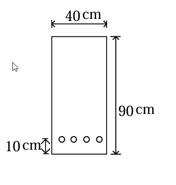

# 考題編號：RC-2004-5

**主分類：** `RC-U4-1` 預力梁斷面應力分析
**副分類：** `RC-U4-3` 預力損失
**設計法：** 混合（WSD 應力分析 + USD 強度設計）
**標籤：** `先拉法` `有黏結腱` `開裂彎矩Mcr` `fps公式` `Whitney應力塊` `β₁折減` `矩形斷面` `有效預力` `ωp延性驗核`

---

## 1. 原始題目重述 (Problem Restatement)

先拉預力梁，矩形斷面與鋼腱配置如圖所示：

*圖說：矩形斷面寬 b = 40 cm，高 h = 90 cm。預力鋼腱位於距底部 10 cm 處，有效深度 $d_p = 90 - 10 = 80\ \text{cm}$。*

| 參數 | 數值 |
|------|------|
| $b \times h$ | $40 \times 90\ \text{cm}$ |
| $d_p$ | $90 - 10 = 80\ \text{cm}$ |
| $A_{ps}$ | $6.16\ \text{cm}^2$ |
| $f_{pu}$ | $16{,}500\ \text{kgf/cm}^2$ |
| $f_{py}$ | $0.85\,f_{pu} = 14{,}025\ \text{kgf/cm}^2$ |
| $f_e$（有效預力）| $0.6\,f_{pu} = 9{,}900\ \text{kgf/cm}^2$ |
| $f'_c$ | $350\ \text{kgf/cm}^2$ |
| $\gamma_p$ | $0.4$（給定）|
| $f_r$（裂縫模數）| $2.0\sqrt{f'_c}$（給定）|

**求：（1）開裂彎矩 $M_{cr}$；（2）彎矩設計強度 $\phi M_n$**

---

## 2. 考題核心精神與出題者意圖

**核心觀念：** 先拉預力梁的**兩個強度指標**：

| 指標 | 分析方法 | 物理意義 |
|------|----------|---------|
| $M_{cr}$（開裂彎矩）| WSD 彈性法 + 斷裂模數 | 有效預力 + $f_r$ 的組合抵抗力 |
| $\phi M_n$（設計強度）| USD 強度設計 + ACI $f_{ps}$ 公式 | 鋼腱拉力 × 力臂 |

**測驗重點：**
1. $\beta_1$ 需依 $f'_c = 350\ \text{kgf/cm}^2$ 折減（$\ne 0.85$）
2. 偏心距 $e = d_p - h/2 = 35\ \text{cm}$（鋼腱距中性軸距離）
3. $f_{ps}$ 公式正確帶入並確認結果合理（$f_{pe} < f_{ps} < f_{pu}$）
4. $M_{cr}$ 用底纖維壓應力 + $f_r$ 判斷開裂時刻

---

## 3. 解題戰略地圖與陷阱分析

**作戰計畫：**
1. 計算 $\beta_1$、斷面幾何（$A$、$I$、$S_b$、$e$）
2. 計算有效預力力 $P_e$，求底纖維壓應力 $f_{ce}$
3. $M_{cr} = S_b \times (f_{ce} + f_r)$
4. 計算 $\rho_p$，代入 $f_{ps}$ 公式
5. 驗核延性（$\omega_p \le 0.36\beta_1$），求 $a$，計算 $M_n$、$\phi M_n$

**關鍵陷阱（3 個）：**
- ⚠ **$\beta_1 \ne 0.85$**：$f'_c = 350 > 280\ \text{kgf/cm}^2$，需折減：$\beta_1 = 0.85 - 0.05 \times (350-280)/70 = 0.80$
- ⚠ **偏心距 $e$ 的計算**：$e = d_p - h/2 = 80 - 45 = 35\ \text{cm}$（鋼腱中心至斷面形心的距離，非 $d_p$）
- ⚠ **底纖維壓應力包含軸壓與偏心兩項**：$f_{ce} = P_e/A + P_e \cdot e / S_b$（兩項均為壓縮，同向）

---

## 3.5 變數層次分析 (Variable Hierarchy Analysis)

### 最終目標
求 $M_{cr}$（開裂彎矩，tf·m）與 $\phi M_n$（設計彎矩強度，tf·m）。

### 本題關鍵公式（依計算順序）

$$\text{Step 1: } \beta_1 = 0.85 - 0.05 \times \frac{f'_c - 280}{70}$$

$$\text{Step 2: } f_{ce} = \frac{P_e}{A} + \frac{P_e \cdot e}{S_b},\quad M_{cr} = S_b \times \left(\boxed{f_{ce}} + f_r\right)$$

$$\text{Step 3: } \rho_p = \frac{A_{ps}}{b \cdot d_p},\quad f_{ps} = f_{pu}\!\left(1 - \frac{\gamma_p}{\boxed{\beta_1}} \cdot \rho_p \cdot \frac{f_{pu}}{f'_c}\right)$$

$$\text{Step 4: } a = \frac{A_{ps}\,\boxed{f_{ps}}}{0.85\,f'_c\,b},\quad M_n = A_{ps}\,\boxed{f_{ps}}\!\left(d_p - \frac{\boxed{a}}{2}\right)$$

$$\text{Step 5: } \omega_p = \frac{A_{ps}\,\boxed{f_{ps}}}{b\,d_p\,f'_c} \le 0.36\beta_1 \text{（延性驗核）}$$

### L1：題目直接給定

| 符號 | 數值 | 說明 |
|------|------|------|
| $b, h, d_p$ | $40, 90, 80\ \text{cm}$ | |
| $A_{ps}$ | $6.16\ \text{cm}^2$ | |
| $f_{pu}$ | $16{,}500\ \text{kgf/cm}^2$ | |
| $f_e$ | $9{,}900\ \text{kgf/cm}^2$（$= 0.6f_{pu}$）| 有效預力 |
| $\gamma_p$ | $0.4$ | |
| $f'_c$ | $350\ \text{kgf/cm}^2$ | |

### L2：需知識點推導

| 符號 | 公式／來源 | 卡關? |
|------|------|------|
| $\beta_1$ | $0.85 - 0.05(350-280)/70 = 0.80$ | |
| $A, I, S_b, e$ | 幾何計算 | |
| $P_e, f_{ce}$ | 有效預力 × 面積/模數 | |
| $f_r$ | $2\sqrt{350} = 37.4\ \text{kgf/cm}^2$ | |
| $M_{cr}$ | $S_b(f_{ce}+f_r)$ | |
| $\rho_p$ | $6.16/(40\times80)$ | |
| $f_{ps}$ | ACI 公式代入 | |
| $\phi M_n$ | $0.9 \times M_n$ | |

---

## 4. 步驟化詳細計算過程

### ① 材料與幾何參數

$$\beta_1 = 0.85 - 0.05 \times \frac{350 - 280}{70} = 0.85 - 0.05 \times 1.0 = 0.80$$

$$f_r = 2.0\sqrt{f'_c} = 2.0\sqrt{350} = 2.0 \times 18.71 = 37.4\ \text{kgf/cm}^2$$

**斷面幾何：**
$$A = 40 \times 90 = 3{,}600\ \text{cm}^2$$
$$I = \frac{40 \times 90^3}{12} = \frac{40 \times 729{,}000}{12} = 2{,}430{,}000\ \text{cm}^4$$
$$y_t = \frac{h}{2} = 45\ \text{cm},\quad S_b = \frac{I}{y_t} = \frac{2{,}430{,}000}{45} = 54{,}000\ \text{cm}^3$$

**偏心距（鋼腱中心至形心）：**
$$e = d_p - \frac{h}{2} = 80 - 45 = 35\ \text{cm}$$

---

### ② 開裂彎矩 $M_{cr}$

**有效預力作用力：**
$$P_e = A_{ps} \times f_e = 6.16 \times 9{,}900 = 61{,}024\ \text{kgf}$$

**底纖維預壓應力（軸壓 + 偏心壓縮）：**
$$f_{ce} = \frac{P_e}{A} + \frac{P_e \cdot e}{S_b} = \frac{61{,}024}{3{,}600} + \frac{61{,}024 \times 35}{54{,}000}$$

$$= 16.95 + \frac{2{,}135{,}840}{54{,}000} = 16.95 + 39.55 = 56.50\ \text{kgf/cm}^2 \text{（壓縮）}$$

**開裂彎矩（底纖維合應力 = 0 時為去壓，再加 $f_r$ 才開裂）：**
$$M_{cr} = S_b \times (f_{ce} + f_r) = 54{,}000 \times (56.50 + 37.4) = 54{,}000 \times 93.9$$

$$= 5{,}070{,}600\ \text{kgf·cm} = \boxed{M_{cr} = 50.7\ \text{tf·m}}$$

---

### ③ 極限鋼腱應力 $f_{ps}$（ACI 公式）

$$\rho_p = \frac{A_{ps}}{b \cdot d_p} = \frac{6.16}{40 \times 80} = \frac{6.16}{3{,}200} = 0.001925$$

$$f_{ps} = f_{pu}\!\left(1 - \frac{\gamma_p}{\beta_1} \cdot \rho_p \cdot \frac{f_{pu}}{f'_c}\right)$$

$$= 16{,}500 \times \left(1 - \frac{0.4}{0.80} \times 0.001925 \times \frac{16{,}500}{350}\right)$$

$$= 16{,}500 \times \left(1 - 0.5 \times 0.001925 \times 47.14\right)$$

$$= 16{,}500 \times (1 - 0.04538) = 16{,}500 \times 0.9546$$

$$\boxed{f_{ps} = 15{,}751\ \text{kgf/cm}^2}$$

**驗核：** $f_e = 9{,}900 \le f_{ps} = 15{,}751 \le f_{pu} = 16{,}500$ ✓（在有效預力至極限強度之間）

---

### ④ 延性驗核（$\omega_p$ 指標）

$$\omega_p = \frac{A_{ps} \cdot f_{ps}}{b \cdot d_p \cdot f'_c} = \frac{6.16 \times 15{,}751}{40 \times 80 \times 350} = \frac{97{,}026}{1{,}120{,}000} = 0.0867$$

$$0.36\beta_1 = 0.36 \times 0.80 = 0.288$$

$$\omega_p = 0.0867 \le 0.288 \quad \checkmark \quad \text{（足夠延性，可用 } \phi = 0.9\text{）}$$

---

### ⑤ 彎矩設計強度 $\phi M_n$

**Whitney 等值應力塊深度：**
$$a = \frac{A_{ps} \cdot f_{ps}}{0.85 \cdot f'_c \cdot b} = \frac{6.16 \times 15{,}751}{0.85 \times 350 \times 40} = \frac{97{,}026}{11{,}900} = 8.15\ \text{cm}$$

**標稱彎矩：**
$$M_n = A_{ps} \cdot f_{ps} \cdot \left(d_p - \frac{a}{2}\right) = 97{,}026 \times \left(80 - \frac{8.15}{2}\right)$$

$$= 97{,}026 \times 75.93 = 7{,}367{,}224\ \text{kgf·cm} = 73.7\ \text{tf·m}$$

$$\phi M_n = 0.9 \times 73.7 = \boxed{66.3\ \text{tf·m}}$$

---

### ⑥ 最小彎矩強度驗核（ACI 18.8.2）

$$1.2\,M_{cr} = 1.2 \times 50.7 = 60.8\ \text{tf·m}$$

$$\phi M_n = 66.3 \ge 60.8 \quad \checkmark$$

---

**最終答案：**

| 項目 | 結果 |
|------|:---:|
| 開裂彎矩 $M_{cr}$ | $\boxed{50.7\ \text{tf·m}}$ |
| 彎矩設計強度 $\phi M_n$ | $\boxed{66.3\ \text{tf·m}}$ |

---

## 5. 關鍵爭議點與進階探討

**① 為何 $f_{ps}$ 可超過 $f_{py}$？**

ACI $f_{ps}$ 公式給出 $f_{ps} = 15{,}751 > f_{py} = 14{,}025$。這在物理上合理：先拉有黏結腱在極限狀態下，混凝土極限應變使鋼腱應變遠超過降伏應變，進入**應變硬化**區，應力可從 $f_{py}$ 繼續升高至 $f_{pu}$（16,500 kgf/cm²）。ACI 公式用近似法得出極限狀態下的鋼腱應力，結果在 $f_{py}$ 與 $f_{pu}$ 之間是合理的。

**② $\beta_1$ 的折減效應**

若誤用 $\beta_1 = 0.85$（不折減）：
$$f_{ps} = 16{,}500 \times (1 - \frac{0.4}{0.85} \times 0.001925 \times 47.14)$$
$$= 16{,}500 \times (1 - 0.04278) = 16{,}793\ \text{kgf/cm}^2$$

偏大約 0.3%，影響不大。但 $a = A_{ps}f_{ps}/(0.85 f'_c b)$ 的分子會稍大，導致 $M_n$ 略有差異。正確使用 $\beta_1 = 0.80$。

**③ 開裂彎矩的工程意義**

$M_{cr} = 50.7\ \text{tf·m}$ 是梁從全截面受壓（無裂縫）轉為開裂的臨界值。在 $M_{cr}$ 以下，截面保持不開裂（Uncracked），預力梁具有良好防腐蝕和耐久性。$\phi M_n/M_{cr} = 66.3/50.7 = 1.31 > 1.2$，滿足 ACI 最小強度要求，確保有一定的強度儲備。
