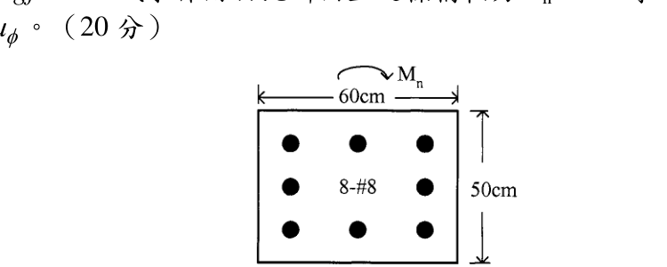

# 考題編號：RC-2005-1

**主分類：** `RC-U1-2` RC 柱強度分析與設計
**副分類：** 無
**設計法：** USD 強度設計法
**標籤：** `矩形柱` `P-M互制` `曲率延展比` `壓縮區鋼筋未降伏` `彎矩曲率` `8-#8對稱配筋` `偏心受壓` `三排配筋`

---

## 1. 原始題目重述 (Problem Restatement)

一鋼筋混凝土柱斷面如圖所示，採用混凝土 $f'_c = 280\ \text{kgf/cm}^2$，鋼筋降伏強度 $f_y = 4200\ \text{kgf/cm}^2$，試求作用於此斷面上之標稱軸力 $P_n = 90\ \text{t}$ 時之標稱極限彎矩 $M_n$ 與延展比 $\mu_\phi$。（20 分）

*圖說：柱斷面寬 b = 60 cm，高 h = 50 cm。8 根 #8 鋼筋以三排配置：頂排 3 根、中排左右各 1 根（共 2 根）、底排 3 根。水平方向鋼筋間距標示 23 cm + 23 cm，由此推得鋼筋至邊緣距離為 (60−46)/2 = 7 cm。彎矩 $M_n$ 作用方向使上緣受壓、下緣受拉。*

**斷面幾何整理：**

| 排別 | 位置（壓力面起算）| 鋼筋量 |
|------|------|------|
| 頂排（壓縮側）| $d'_1 = 7\ \text{cm}$ | $A_{s1} = 3 \times 5.07 = 15.21\ \text{cm}^2$ |
| 中排 | $d_2 = 25\ \text{cm}$（形心）| $A_{s2} = 2 \times 5.07 = 10.14\ \text{cm}^2$ |
| 底排（拉力側）| $d_3 = 43\ \text{cm}$ | $A_{s3} = 3 \times 5.07 = 15.21\ \text{cm}^2$ |

**材料參數：**
- $\beta_1 = 0.85$（$f'_c = 280\ \text{kgf/cm}^2$）
- $E_s = 2{,}040{,}000\ \text{kgf/cm}^2$
- $\varepsilon_y = f_y/E_s = 4200/2{,}040{,}000 = 0.00206$
- $E_c = 15000\sqrt{280} = 251{,}000\ \text{kgf/cm}^2$，$n = E_s/E_c \approx 8$

---

## 2. 考題核心精神與出題者意圖 (Core Concepts & Examiner's Intent)

**核心觀念：** P-M 互制與曲率延展比的組合計算。出題者要求考生在指定軸力下，利用應變相容 + Whitney 應力塊求出 $M_n$，再用彈性開裂斷面理論求 $\phi_y$，最後對比得到 $\mu_\phi$。

**測驗能力：**
1. 在給定 $P_n$ 下用試算法找出中性軸深度 $c$（非純彎、非純壓，需迭代）
2. 判斷各排鋼筋在極限狀態是否降伏（壓縮鋼筋通常未達 $f_y$）
3. 用彈性開裂斷面（Elastic Cracked Section）計算降伏曲率 $\phi_y$
4. 中排鋼筋位於形心，對 $M_n$ 貢獻為零（是典型陷阱）

---

## 3. 解題戰略地圖與陷阱分析 (Strategic Roadmap & Trap Analysis)

**作戰計畫：**
1. 假設 $c$，計算各排鋼筋應變與應力（注意壓縮鋼筋是否降伏）
2. 驗核 $P_n$ 平衡，調整 $c$ 直到 $P_n = 90\ \text{t}$
3. 取矩（對斷面形心）→ 求 $M_n$
4. 切換至彈性模型求 $\phi_y$（底排鋼筋剛好達 $\varepsilon_y$，上方各排鋼筋仍彈性）
5. $\mu_\phi = \phi_u / \phi_y$

**關鍵陷阱：**
- ⚠ **壓縮鋼筋是否降伏**：頂排 $d'_1 = 7\ \text{cm}$ 在 $c = 13\ \text{cm}$ 時，$\varepsilon_{s1} = 0.00139 < \varepsilon_y$ → 未降伏，須用 $f_{s1} = E_s \varepsilon_{s1}$，同時需減去 $0.85f'_c$（已含在 $C_c$ 中）
- ⚠ **中排鋼筋力矩臂為零**：中排在形心（$d_2 = 25 = h/2$），對 $M_n$ 取矩臂 = 0，但對軸力有貢獻
- ⚠ **彈性 vs 極限模型**：$\phi_u$ 用 Whitney 應力塊（$c = 13\ \text{cm}$），$\phi_y$ 用彈性開裂斷面（$c_y = 16\ \text{cm}$）；兩個 $c$ 值不同
- ⚠ **中性軸在極限狀態比降伏狀態淺**（$c_u = 13 < c_y = 16$）：隨著載重增大，中性軸向上移動（正確）

---

## 3.5 變數層次分析 (Variable Hierarchy Analysis)

> 複習提示：第一次解題後，在每個卡住的知識點旁標記 `⚠`；第二次複習時只看有 `⚠` 的項目。

### 最終目標
求 $P_n = 90\ \text{t}$ 時之標稱極限彎矩 $M_n$（tf·m）及曲率延展比 $\mu_\phi = \phi_u / \phi_y$。

### 本題關鍵公式（依計算順序）

$$\text{Step 1: } C_c = 0.85 f'_c \cdot b \cdot a, \quad a = \beta_1 c$$

$$\text{Step 2: } \varepsilon_{si} = 0.003 \cdot \frac{c - d_i}{c}, \quad f_{si} = \min(E_s |\varepsilon_{si}|,\, f_y)$$

$$\text{Step 3: } P_n = C_c + C_{s1} - T_{s2} - T_{s3} = 90{,}000\ \text{kgf} \quad \Rightarrow \text{解出 } \boxed{c}$$

$$\text{Step 4: } M_n = C_c\left(\frac{h}{2} - \frac{a}{2}\right) + C_{s1}\left(\frac{h}{2} - d'_1\right) + T_{s3}\left(d_3 - \frac{h}{2}\right)$$

$$\text{Step 5 (降伏態): 彈性開裂斷面，令 } \varepsilon_{s3} = \varepsilon_y \Rightarrow \phi_y = \frac{\varepsilon_y}{d_3 - \boxed{c_y}}$$

$$\text{Step 6: } \phi_u = \frac{\varepsilon_{cu}}{\boxed{c}} = \frac{0.003}{\boxed{c}}$$

$$\text{Step 7: } \mu_\phi = \frac{\phi_u}{\phi_y}$$

### L1：題目直接給定

| 符號 | 數值 | 說明 |
|------|------|------|
| $f'_c$ | $280\ \text{kgf/cm}^2$ | 混凝土抗壓強度 |
| $f_y$ | $4200\ \text{kgf/cm}^2$ | 鋼筋降伏強度 |
| $b$ | $60\ \text{cm}$ | 斷面寬（壓力面） |
| $h$ | $50\ \text{cm}$ | 斷面高 |
| 配筋 | $8\text{-\#8}$ | 共 8 根，$A_s = 5.07\ \text{cm}^2$/根 |
| $P_n$ | $90\ \text{t} = 90{,}000\ \text{kgf}$ | 標稱軸力 |
| $d'_1$ | $7\ \text{cm}$ | 壓縮側鋼筋至壓力面距離（由圖推算） |
| $d_3$ | $43\ \text{cm}$ | 拉力側鋼筋至壓力面距離 |

### L2：需知識點推導

**基本材料參數**

| 符號 | 公式／來源 | 卡關? |
|------|------|------|
| $\beta_1$ | $0.85$（$f'_c \le 280\ \text{kgf/cm}^2$） | |
| $\varepsilon_y$ | $f_y/E_s = 4200/2{,}040{,}000 = 0.00206$ | |
| $n$ | $E_s/E_c = 2{,}040{,}000/251{,}000 \approx 8$ | |

**極限狀態（Whitney 應力塊，求 $c$）**

| 符號 | 公式／來源 | 卡關? |
|------|------|------|
| $\varepsilon_{s1}$ | $0.003(c-7)/c$；若 $< \varepsilon_y$ 則 $f_{s1} = E_s\varepsilon_{s1}$ | |
| $\varepsilon_{s2}, \varepsilon_{s3}$ | $0.003(c-d_i)/c$；負值表示受拉 | |
| $C_{s1}$ | $A_{s1}(f_{s1} - 0.85f'_c)$（壓縮鋼筋在 Whitney 塊內需扣除） | |
| $T_{s2}, T_{s3}$ | $A_{si} \cdot f_{si}$（拉力區直接用應力） | |
| $c$ | 由 $P_n = C_c + C_{s1} - T_{s2} - T_{s3} = 90{,}000$ 試算求解 | |
| $M_n$ | 各力對形心取矩之和（中排矩臂 = 0） | |

**降伏曲率（彈性開裂斷面）**

| 符號 | 公式／來源 | 卡關? |
|------|------|------|
| $c_y$ | 由彈性平衡方程二次式求解（令 $\varepsilon_{s3} = \varepsilon_y$，各力正比於 $\phi_y$）| |
| $\phi_y$ | $\varepsilon_y / (d_3 - c_y)$ | |
| $\phi_u$ | $\varepsilon_{cu}/c = 0.003/c$ | |
| $\mu_\phi$ | $\phi_u / \phi_y$ | |

### L3：深層知識（不懂就卡住）

| 知識點 | 說明 | 卡關? |
|--------|------|------|
| 壓縮鋼筋 $C_s$ 的 $0.85f'_c$ 修正 | 壓縮鋼筋位於 Whitney 塊內時，混凝土已算入 $C_c$，故鋼筋淨貢獻 = $A_s(f_s - 0.85f'_c)$ | |
| 彈性開裂斷面假設 | 計算 $\phi_y$ 時，混凝土為線彈性三角形應力塊，$\phi_y = \varepsilon_y/(d_3-c_y)$ | |
| 中排鋼筋在形心的特殊性 | $d_2 = h/2 = 25\ \text{cm}$ → 取矩臂為 0 → 對 $M_n$ 貢獻為零（但對軸力有貢獻）| |
| 兩種中性軸的差異 | $c_u$（極限，Whitney）vs. $c_y$（降伏，彈性）：同一 $P_n$ 下兩者不同 | |

---

## 4. 步驟化詳細計算過程 (Step-by-Step Detailed Calculation)

### 斷面參數確認

$$b = 60\ \text{cm},\quad h = 50\ \text{cm},\quad h/2 = 25\ \text{cm}$$

$$A_{s1} = 3 \times 5.07 = 15.21\ \text{cm}^2\ (d'_1=7\ \text{cm})$$
$$A_{s2} = 2 \times 5.07 = 10.14\ \text{cm}^2\ (d_2=25\ \text{cm})$$
$$A_{s3} = 3 \times 5.07 = 15.21\ \text{cm}^2\ (d_3=43\ \text{cm})$$

$$0.85f'_c \cdot b = 0.85 \times 280 \times 60 = 14{,}280\ \text{kgf/cm}$$

---

### ① 極限狀態：求中性軸深度 $c$（試算法）

**假設 $c = 13\ \text{cm}$，$a = \beta_1 c = 0.85 \times 13 = 11.05\ \text{cm}$**

**各排應變（壓力面 $\varepsilon_{cu} = 0.003$）：**

$$\varepsilon_{s1} = 0.003 \times \frac{13-7}{13} = 0.003 \times \frac{6}{13} = 0.00138 < \varepsilon_y \Rightarrow f_{s1} = 2{,}040{,}000 \times 0.00138 = 2{,}824\ \text{kgf/cm}^2\ \text{（壓，未降伏）}$$

$$\varepsilon_{s2} = 0.003 \times \frac{13-25}{13} = -0.00277 \Rightarrow f_{s2} = \min(0.00277 \times 2{,}040{,}000,\ 4200) = 4{,}200\ \text{kgf/cm}^2\ \text{（拉，已降伏）}$$

$$\varepsilon_{s3} = 0.003 \times \frac{13-43}{13} = -0.00692 \Rightarrow f_{s3} = 4{,}200\ \text{kgf/cm}^2\ \text{（拉，已降伏）}$$

**各力計算：**

$$C_c = 14{,}280 \times 11.05 = 157{,}794\ \text{kgf}$$

$$C_{s1} = A_{s1}(f_{s1} - 0.85f'_c) = 15.21 \times (2{,}824 - 238) = 15.21 \times 2{,}586 = 39{,}333\ \text{kgf}$$

> *$d'_1 = 7\ \text{cm} < a = 11.05\ \text{cm}$，頂排鋼筋在 Whitney 塊內 → 扣除 $0.85f'_c = 238\ \text{kgf/cm}^2$*

$$T_{s2} = 10.14 \times 4{,}200 = 42{,}588\ \text{kgf}$$
$$T_{s3} = 15.21 \times 4{,}200 = 63{,}882\ \text{kgf}$$

**軸力平衡驗核：**

$$P_n = C_c + C_{s1} - T_{s2} - T_{s3} = 157{,}794 + 39{,}333 - 42{,}588 - 63{,}882 = 90{,}657\ \text{kgf} \approx 90\ \text{t}\ \checkmark$$

---

### ② 標稱彎矩 $M_n$（對斷面形心 $h/2 = 25\ \text{cm}$ 取矩）

| 力 | 大小 (kgf) | 力臂 (cm) | 矩 (kgf·cm) |
|---|---|---|---|
| $C_c$ | $157{,}794$ | $25 - a/2 = 25 - 5.525 = 19.475$ | $3{,}073{,}038$ |
| $C_{s1}$ | $39{,}333$ | $25 - 7 = 18$ | $707{,}994$ |
| $T_{s2}$ | $42{,}588$ | $\|25 - 25\| = 0$ | $0$ |
| $T_{s3}$ | $63{,}882$ | $43 - 25 = 18$ | $1{,}149{,}876$ |

$$M_n = 3{,}073{,}038 + 707{,}994 + 0 + 1{,}149{,}876 = 4{,}930{,}908\ \text{kgf·cm}$$

$$\boxed{M_n \approx 49.3\ \text{tf·m}}$$

偏心距：$e = M_n/P_n = 49.3/90 = 0.548\ \text{m} = 54.8\ \text{cm}$

---

### ③ 極限曲率 $\phi_u$

$$\phi_u = \frac{\varepsilon_{cu}}{c} = \frac{0.003}{13} = 2.308 \times 10^{-4}\ \text{rad/cm}$$

---

### ④ 降伏曲率 $\phi_y$（彈性開裂斷面）

**條件：** 令底排鋼筋恰好達到 $\varepsilon_y$，即 $\varepsilon_{s3} = \varepsilon_y$，各力正比於 $\phi_y$。

設中性軸深度為 $c_y$，則 $\phi_y = \varepsilon_y/(d_3 - c_y) = \varepsilon_y/(43 - c_y)$。

各力以 $c_y$ 表示（彈性三角形混凝土 + 彈性鋼筋）：

$$C_c^y = \frac{1}{2} b c_y \cdot E_c \phi_y c_y = \frac{1}{2} \times 60 \times c_y \times \frac{E_c \varepsilon_y c_y}{43-c_y}$$

$$C_{s1}^y = A_{s1} E_s \phi_y (c_y - 7) = A_{s1} \cdot n \cdot E_c \cdot \frac{\varepsilon_y(c_y-7)}{43-c_y}$$

$$T_{s2}^y = A_{s2} \cdot n \cdot E_c \cdot \frac{\varepsilon_y(25-c_y)}{43-c_y}$$

$$T_{s3}^y = A_{s3} \cdot f_y = 63{,}882\ \text{kgf（定值）}$$

代入 $P_n = C_c^y + C_{s1}^y - T_{s2}^y - T_{s3}^y = 90{,}000$，乘以 $(43-c_y)$ 後整理（$n=8$，$f_y/(n) = 525\ \text{kgf/cm}^2$）：

$$15{,}750\, c_y^2 + 260{,}352\, c_y - 8{,}128{,}800 = 0$$

$$c_y^2 + 16.53\, c_y - 516.1 = 0$$

$$c_y = \frac{-16.53 + \sqrt{16.53^2 + 4 \times 516.1}}{2} = \frac{-16.53 + \sqrt{2{,}337.6}}{2} = \frac{-16.53 + 48.35}{2} = 15.91\ \text{cm}$$

取 $c_y \approx 16\ \text{cm}$

**驗核（$c_y = 16\ \text{cm}$）：**

$$\phi_y = \frac{0.00206}{43-16} = \frac{0.00206}{27} = 7.63 \times 10^{-5}\ \text{rad/cm}$$

各排應變：
- $\varepsilon_{s1} = 7.63 \times 10^{-5} \times 9 = 6.87 \times 10^{-4} < \varepsilon_y$（壓，彈性 ✓）
- $\varepsilon_{s2} = 7.63 \times 10^{-5} \times (-9) = -6.87 \times 10^{-4} < \varepsilon_y$（拉，彈性 ✓）

各力：
- $C_c^y = \tfrac{1}{2} \times 60 \times 16 \times (251{,}000 \times 7.63 \times 10^{-5} \times 16) = 480 \times 305.7 = 146{,}736\ \text{kgf}$
- $C_{s1}^y = 15.21 \times (2{,}040{,}000 \times 6.87\times10^{-4}) = 15.21 \times 1{,}401 = 21{,}309\ \text{kgf}$
- $T_{s2}^y = 10.14 \times 1{,}401 = 14{,}206\ \text{kgf}$
- $T_{s3}^y = 63{,}882\ \text{kgf}$

$$P_n^y = 146{,}736 + 21{,}309 - 14{,}206 - 63{,}882 = 89{,}957 \approx 90{,}000\ \text{kgf}\ \checkmark$$

---

### ⑤ 曲率延展比 $\mu_\phi$

$$\mu_\phi = \frac{\phi_u}{\phi_y} = \frac{2.308 \times 10^{-4}}{7.63 \times 10^{-5}} = \frac{0.003/13}{0.00206/27} = \frac{0.003 \times 27}{0.00206 \times 13}$$

$$= \frac{0.081}{0.02678} = \boxed{\mu_\phi \approx 3.0}$$

---

## 5. 關鍵爭議點與進階探討 (Critical Issues & Advanced Discussion)

**① 壓縮鋼筋是否降伏的判斷（高頻陷阱）**

本題頂排鋼筋在極限狀態：$\varepsilon_{s1} = 0.00138 < \varepsilon_y = 0.00206$，**未降伏**。若錯誤使用 $f_y$，$C_{s1}$ 會高估，導致 $c$ 值偏小，$M_n$ 和 $\mu_\phi$ 均偏離正確值。考場安全做法：**先假設，後驗核**。

**② 中排鋼筋的角色**

中排鋼筋位於斷面形心（$d_2 = h/2 = 25\ \text{cm}$），取矩時臂長為零，**對 $M_n$ 完全無貢獻**。但在軸力平衡（$P_n$ 驗核）及 $c_y$ 求解的二次方程中，**中排鋼筋必須計入**。

**③ 彈性模型的適用性**

在彈性模型下，計算 $c_y = 16\ \text{cm}$ 時，混凝土上緣應力 $f_c = E_c \phi_y c_y \approx 306\ \text{kgf/cm}^2 > f'_c$。這是線彈性近似的限制。實際上混凝土應力—應變曲線非線性，但 $\varepsilon_{c,top} = 0.00122 < \varepsilon_{cu} = 0.003$，尚未壓碎。考場上採用此線彈性近似為標準作法。

**④ 延展比的工程意義**

$\mu_\phi \approx 3.0$ 代表本柱在 $P_n = 90\ \text{t}$ 的偏壓下，極限曲率為降伏曲率的 3 倍，具有一定的塑性轉動能力。與純彎梁（典型 $\mu_\phi \approx 10+$）相比較低，原因是軸壓力使中性軸較深，壓縮區較大，縮短了力臂也限制了延性。
