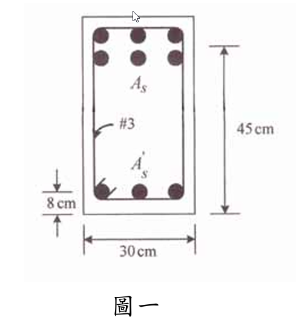

### 考題編號：RC-2006-1

**主分類：** `RC-U2-1` RC 剪力強度分析與設計
**副分類：** `RC-U1-1` RC 梁彎矩強度分析與設計
**設計法：** USD強度設計法
**標籤：** `懸臂梁` `雙筋梁` `壓力鋼筋未降伏` `剪力設計` `最大箍筋間距` `撓曲強度控制設計剪力` `#3箍筋`

---

## 1. 原始題目重述 (Problem Restatement)

懸臂梁（跨度 4.5 m，均布靜活載重），由**撓曲強度控制設計載重**，求 #3 箍筋最大間距。

**已知條件：**

| 項目 | 數值 |
|------|------|
| 斷面 | $b=30$ cm，$h=45$ cm |
| 壓力面 | **下方**（懸臂梁底部受壓）|
| $d$（壓力緣至張力筋）| $45-8=37$ cm |
| $d'$（壓力緣至壓力筋）| 8 cm |
| $A_s$（頂部張力筋）| 40 cm² |
| $A_s'$（底部壓力筋）| 24 cm² |
| $f'_c$ | 280 kgf/cm² |
| $f_y$ | 4200 kgf/cm² |
| $E_s$ | $2.04 \times 10^6$ kgf/cm² |
| 箍筋 | #3，$A_v = 2 \times 0.71 = 1.42$ cm²（雙肢）|
| 跨度 $L$ | 4.5 m = 450 cm |
| $\phi_{flex}$ | 0.9；$\phi_{shear}$ | 0.75 |

**題目附圖：**

*圖說：b=30 cm，h=45 cm，下方為壓力面，頂部張力筋 As=40 cm²，底部壓力筋 As'=24 cm²，d'=8 cm（壓力緣至壓力筋），d=37 cm（壓力緣至張力筋）。#3 箍筋（Av=1.42 cm²雙肢），f'c=280，fy=4200 kgf/cm²。*

---

## 2. 考題核心精神與出題者意圖 (Core Concepts & Examiner's Intent)

**解題邏輯鏈：** $\phi M_n$ → 均布設計載重 $w_u$ → 固定端 $V_u$ → 最大箍筋間距

**核心陷阱：** 壓力鋼筋應變 $\varepsilon'_s < \varepsilon_y$（**未降伏**），需二次方程求 $c$。

---

## 3. 解題戰略地圖與陷阱分析 (Strategic Roadmap & Trap Analysis)

| 步驟 | 工作 |
|------|------|
| 1 | 先假設壓力鋼筋降伏，驗算 $\varepsilon'_s$ |
| 2 | 確認未降伏後，用二次方程解 $c$ |
| 3 | 計算 $\phi M_n$ |
| 4 | 由 $\phi M_n = w_u L^2/2$ 求 $w_u$，再求 $V_u$ |
| 5 | 由 $V_u$ 求所需 $V_s$，轉換為最大間距 $s$ |
| 6 | 比對 ACI 最大間距限制 |

**三大陷阱：**

| 陷阱 | 說明 |
|------|------|
| ⚠ 壓力鋼筋是否降伏 | 先假設降伏→算出 $c$→驗算 $\varepsilon'_s$，本題未降伏 |
| ⚠ 懸臂梁 $V_u$ 取在固定端面 | ACI 允許取 $d$ 偏移僅限支承附近有反力的情況，懸臂梁 $V_u$ 取在固定端面（非 $d$ 偏移）|
| ⚠ 最大間距閾值判斷 | $V_s$ 是否超過 $2.12\sqrt{f'_c}\cdot b_w \cdot d$（Taiwan 等效），決定間距是否減半 |

---

## 3.5 變數層次分析 (Variable Hierarchy Analysis)

### 最終目標
`由撓曲強度推算設計剪力，再計算最大箍筋間距`

### 本題關鍵公式鏈

$$\text{Step 1 (假設降伏)}: a_0 = \frac{(A_s-A_s')f_y}{0.85f'_c b} \Rightarrow c_0 = a_0/\beta_1 \Rightarrow \varepsilon'_s = 0.003\frac{c_0-d'}{c_0}$$

$$\text{Step 2 (未降伏，二次方程)}: 6{,}069c - \frac{1{,}175{,}040}{c} = 26{,}832 \Rightarrow c$$

$$\text{Step 3 (Mn)}: M_n = C_c\!\left(d-\frac{a}{2}\right) + C_s(d-d')$$

$$\text{Step 4}: w_u = \frac{2\phi M_n}{L^2},\quad V_u = w_u \times L$$

$$\text{Step 5}: V_s = \frac{V_u/\phi - V_c}{1},\quad s_{max} = \frac{A_v f_y d}{V_s}$$

### L1：題目直接給定（略）

### L2：L3：詳見 Step 4 計算

---

## 4. 步驟化詳細計算過程 (Step-by-Step Detailed Calculation)

### Step 1：試驗壓力鋼筋是否降伏

假設 $f'_s = f_y$：
$$a_0 = \frac{(A_s - A_s')f_y}{0.85 f'_c b} = \frac{(40-24)\times4200}{0.85\times280\times30} = \frac{67{,}200}{7{,}140} = 9.41 \text{ cm}$$
$$c_0 = a_0/\beta_1 = 9.41/0.85 = 11.07 \text{ cm}$$

$$\varepsilon'_s = 0.003 \times \frac{c_0 - d'}{c_0} = 0.003 \times \frac{11.07-8}{11.07} = 0.000832 < \varepsilon_y = 0.00206 \quad \Rightarrow \text{壓力鋼筋\textbf{未降伏}}$$

### Step 2：未降伏，二次方程求 $c$

壓力鋼筋應力：
$$f'_s = E_s \cdot \varepsilon'_s = 2{,}040{,}000 \times 0.003 \times \frac{c-8}{c} = \frac{6{,}120(c-8)}{c}$$

力平衡（$T = C_c + C_s$，壓力筋在壓力區內，扣除混凝土）：
$$A_s f_y = 0.85 f'_c \cdot \beta_1 c \cdot b + A_s'(f'_s - 0.85 f'_c)$$

$$168{,}000 = 7{,}140 \times 0.85c + 24\!\left(\frac{6{,}120(c-8)}{c} - 238\right)$$

$$168{,}000 = 6{,}069c + \frac{146{,}880(c-8)}{c} - 5{,}712$$

$$173{,}712 = 6{,}069c + 146{,}880 - \frac{1{,}175{,}040}{c}$$

$$6{,}069c - \frac{1{,}175{,}040}{c} = 26{,}832$$

整理成二次方程：
$$6{,}069c^2 - 26{,}832c - 1{,}175{,}040 = 0 \quad \Rightarrow \quad c^2 - 4.42c - 193.65 = 0$$

$$c = \frac{4.42 + \sqrt{4.42^2 + 4\times193.65}}{2} = \frac{4.42 + \sqrt{794.14}}{2} = \frac{4.42 + 28.18}{2} = \boxed{16.30 \text{ cm}}$$

$$a = 0.85 \times 16.30 = 13.86 \text{ cm}$$

**驗算：**
$$f'_s = \frac{6{,}120\times(16.30-8)}{16.30} = \frac{50{,}796}{16.30} = 3{,}116 \text{ kgf/cm}^2 < f_y = 4{,}200 \text{ kgf/cm}^2 \quad \checkmark$$

確認 $d' = 8 < a = 13.86$ cm → 壓力筋在壓力區內 ✓

### Step 3：計算 $\phi M_n$

$$C_c = 0.85 \times 280 \times 13.86 \times 30 = 98{,}936 \text{ kgf}$$
$$C_s = 24 \times (3{,}116 - 238) = 24 \times 2{,}878 = 69{,}072 \text{ kgf}$$

（驗算：$C_c + C_s = 168{,}008 \approx T = 168{,}000$ ✓）

$$M_n = C_c\!\left(d - \frac{a}{2}\right) + C_s(d-d') = 98{,}936\times(37-6.93) + 69{,}072\times(37-8)$$

$$= 98{,}936 \times 30.07 + 69{,}072 \times 29 = 2{,}975{,}217 + 2{,}003{,}088 = 4{,}978{,}305 \text{ kgf·cm}$$

$$\phi M_n = 0.9 \times 4{,}978{,}305 = \boxed{4{,}480{,}475 \text{ kgf·cm} = 44.8 \text{ tf·m}}$$

### Step 4：設計載重與設計剪力

懸臂梁 $M_{max}$ 在固定端：$M_{max} = w_u L^2/2$

$$\phi M_n = w_u L^2 / 2 \quad \Rightarrow \quad w_u = \frac{2\phi M_n}{L^2} = \frac{2 \times 4{,}480{,}475}{450^2} = \frac{8{,}960{,}950}{202{,}500} = 44.25 \text{ kgf/cm}$$

懸臂梁固定端設計剪力（**臨界斷面在固定端面，不做 $d$ 偏移**）：
$$V_u = w_u \times L = 44.25 \times 450 = \boxed{19{,}913 \text{ kgf}}$$

### Step 5：混凝土剪力強度

$$V_c = 0.53\sqrt{f'_c} \cdot b_w \cdot d = 0.53 \times 16.73 \times 30 \times 37 = \boxed{9{,}847 \text{ kgf}}$$

$$\phi V_c = 0.75 \times 9{,}847 = 7{,}385 \text{ kgf} < V_u = 19{,}913 \text{ kgf} \quad \Rightarrow \text{需配箍筋}$$

### Step 6：所需 $V_s$ 與最大間距

$$V_s = \frac{V_u}{\phi} - V_c = \frac{19{,}913}{0.75} - 9{,}847 = 26{,}551 - 9{,}847 = 16{,}704 \text{ kgf}$$

**ACI 最大間距閾值**（$V_s > 2.12\sqrt{f'_c}\cdot b_w \cdot d$？）：

$$2.12\sqrt{f'_c} \cdot b_w \cdot d = 2.12 \times 16.73 \times 30 \times 37 = 39{,}405 \text{ kgf}$$

$V_s = 16{,}704 < 39{,}405$ → 不減半，**$s_{max,code} = d/2 = 18.5$ cm**

**由剪力強度需求求最大間距：**
$$s = \frac{A_v f_y d}{V_s} = \frac{1.42 \times 4200 \times 37}{16{,}704} = \frac{220{,}668}{16{,}704} = \boxed{13.2 \text{ cm}}$$

**最終最大間距：**
$$s_{max} = \min(13.2,\ 18.5) = \boxed{13.2 \text{ cm}}$$

---

## 5. 關鍵爭議點與進階探討

### 懸臂梁臨界剪力斷面

ACI 允許取距支承面 $d$ 處為臨界斷面，條件是該段混凝土受壓（斜壓桿存在）。懸臂梁均布載重的剪力由自由端向固定端遞增，固定端最大，且無斜壓桿效應，故臨界斷面應取在**固定端面**，$V_u = w_u \times L$。

### 撓曲 φ 值確認

$$\varepsilon_t = 0.003 \times \frac{d-c}{c} = 0.003 \times \frac{37-16.30}{16.30} = 0.00381$$

$\varepsilon_t = 0.00381 < 0.005$（過渡區），但題目已指定 $\phi = 0.9$，故直接採用。

若嚴格按規定：$\phi = 0.483 + 83.3\varepsilon_t = 0.483 + 83.3 \times 0.00381 = 0.800$（較保守）。
