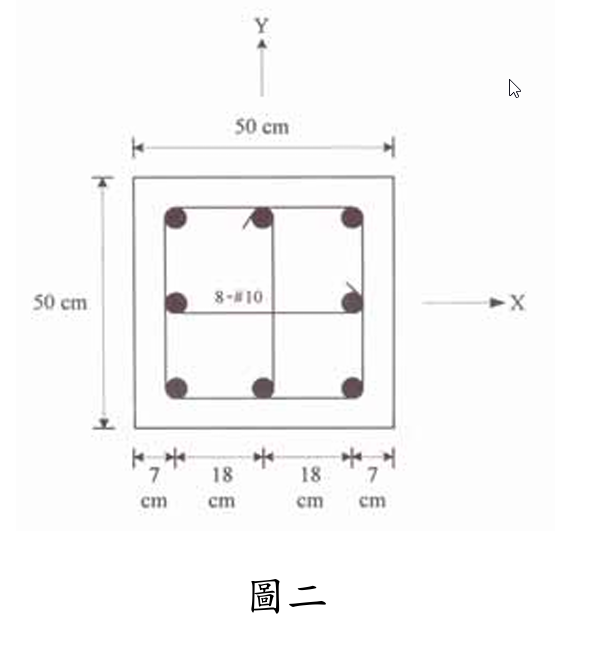

### 考題編號：RC-2006-2

**主分類：** `RC-U1-3` 細長柱
**副分類：** `RC-U1-2` RC 柱強度分析與設計
**設計法：** USD強度設計法
**標籤：** `無側移柱` `彎矩放大法` `細長柱` `Cm係數` `單曲率` `δns放大係數` `臨界挫屈載重Pc`

---

## 1. 原始題目重述 (Problem Restatement)

無側移方形柱（50×50 cm），8-#10 鋼筋，單曲率彎矩，以**彎矩放大法**求設計放大彎矩 $M_c$。

**已知條件：**

| 項目 | 數值 |
|------|------|
| 斷面 | $50 \times 50$ cm |
| 配筋 | 8-#10，$A_b = 8.14$ cm²，$A_{st} = 65.12$ cm² |
| 淨高 $l_u$ | 6 m = 600 cm |
| 有效長度係數 $k$ | 0.9 |
| $f'_c$ | 280 kgf/cm² |
| $f_y$ | 4200 kgf/cm² |
| 設計軸力 $P_u$ | 400 tf = 400,000 kgf |
| 持續載重比 $\beta_d$ | 0.3 |
| 柱頭彎矩 $M_1$ | 15 tf·m（小端）|
| 柱腳彎矩 $M_2$ | 27 tf·m（大端）|
| 彎曲型式 | 單曲率（Same side curvature）|

**題目附圖：**

*圖說：$50 \times 50$ cm 方形柱，8-#10 鋼筋（3×3 格扣中心 = 8 根），水平方向：鋼筋心位置為 7, 25, 43 cm（距左面），各排到形心距離 18 cm 或 0 cm。$f'_c=280$，$f_y=4200$ kgf/cm²，彎矩對 Y 軸。*

---

## 2. 考題核心精神與出題者意圖 (Core Concepts & Examiner's Intent)

**三步驟：** 計算 $EI$ → 求 $P_c$ → 求 $\delta_{ns}$ → $M_c = \delta_{ns} \times M_2$

**關鍵陷阱：**
- $C_m$ 的符號：**單曲率** → $M_1/M_2$ 為**正值** → $C_m = 0.6 + 0.4(M_1/M_2) \approx 0.82$
- 雙曲率才能讓 $C_m < 0.6$

---

## 3. 解題戰略地圖與陷阱分析 (Strategic Roadmap & Trap Analysis)

| 步驟 | 工作 |
|------|------|
| 1 | 細長比 $kl_u/r$，確認需要放大 |
| 2 | 計算 $EI = 0.4E_cI_g/(1+\beta_d)$（簡化式）|
| 3 | 計算 $P_c = \pi^2 EI/(kl_u)^2$ |
| 4 | $C_m = 0.6 + 0.4(M_1/M_2)$（單曲率正號）|
| 5 | $\delta_{ns} = C_m/(1-P_u/0.75P_c) \geq 1.0$ |
| 6 | $M_c = \delta_{ns} \times M_2$ |

**二大陷阱：**

| 陷阱 | 說明 |
|------|------|
| ⚠ $C_m$ 符號 | 單曲率：M1/M2 取**正值**；雙曲率：取**負值** → 本題 Cm = 0.822 |
| ⚠ $r$ 的計算 | $r = 0.3h$（矩形柱），$h$ 為彎矩方向的截面尺寸 |

---

## 3.5 變數層次分析 (Variable Hierarchy Analysis)

### 最終目標
`計算放大彎矩 Mc = δns × M2`

### 本題關鍵公式鏈

$$\text{Step 1: } \frac{kl_u}{r} = \frac{0.9 \times 600}{0.3 \times 50} = 36 \quad > 34-12\!\left(\frac{M_1}{M_2}\right) = 27.3 \Rightarrow \text{需放大}$$

$$\text{Step 2: } EI = \frac{0.4 E_c I_g}{1+\beta_d}$$

$$\text{Step 3: } P_c = \frac{\pi^2 \boxed{EI}}{(kl_u)^2}$$

$$\text{Step 4: } C_m = 0.6 + 0.4\!\left(\frac{M_1}{M_2}\right) \quad \text{（單曲率取正號）}$$

$$\text{Step 5: } \delta_{ns} = \frac{\boxed{C_m}}{1 - \dfrac{P_u}{0.75 \boxed{P_c}}} \geq 1.0$$

$$\text{Step 6: } M_c = \boxed{\delta_{ns}} \times M_2$$

### L1：題目直接給定

| 符號 | 數值 |
|------|------|
| $b = h$ | 50 cm |
| $l_u$ | 600 cm |
| $k$ | 0.9 |
| $P_u$ | 400,000 kgf |
| $\beta_d$ | 0.3 |
| $M_1, M_2$ | 15, 27 tf·m（單曲率）|

### L2：需知識點推導

| 符號 | 公式/來源 | 卡關? |
|------|----------|:-----:|
| $r$ | $0.3h = 0.3\times50 = 15$ cm | |
| $kl_u/r$ | $0.9\times600/15 = 36$ | |
| 需放大條件 | $36 > 34-12\times(15/27)=27.3$ ✓ | |
| $E_c$ | $15{,}000\sqrt{280}=250{,}995$ kgf/cm² | |
| $I_g$ | $50^4/12=520{,}833$ cm⁴ | |
| $EI$ | $0.4\times250{,}995\times520{,}833/1.3=4.022\times10^{10}$ kgf·cm² | |
| $P_c$ | $\pi^2\times4.022\times10^{10}/(540)^2=1{,}362$ tf | |
| $C_m$ | $0.6+0.4\times(15/27)=0.822$ | |
| $0.75P_c$ | $0.75\times1{,}362=1{,}021$ tf | |
| $\delta_{ns}$ | $0.822/(1-400/1{,}021)=1.351$ | |
| $M_c$ | $1.351\times27=36.5$ tf·m | |

### L3：深層知識（不懂就卡住）

| 知識點 | 說明 | 卡關? |
|--------|------|:-----:|
| 單曲率 $C_m$ 正值 | 同向彎矩→等效均布彎矩接近 $M_2$→$C_m \to 1$；$M_1/M_2$ 用正號 | |
| $0.4EcIg$ 為何（非 $EI$ 實際值）| ACI 用折減 $EI$ 反映裂縫與潛變；$1+\beta_d$ 再折減長期效果 | |
| 為何 $0.75P_c$ | $0.75$ 是穩定折減係數，類似保險因數 | |

---

## 4. 步驟化詳細計算過程 (Step-by-Step Detailed Calculation)

### Step 1：細長比與是否需要放大

$$r = 0.3h = 0.3 \times 50 = 15 \text{ cm}$$

$$\frac{kl_u}{r} = \frac{0.9 \times 600}{15} = 36$$

判斷是否需要放大（單曲率）：
$$34 - 12\frac{M_1}{M_2} = 34 - 12 \times \frac{15}{27} = 34 - 6.67 = 27.33$$

$$36 > 27.33 \quad \Rightarrow \text{需考慮細長效應，應用彎矩放大法}$$

### Step 2：計算 $EI$

$$E_c = 15{,}000\sqrt{f'_c} = 15{,}000\sqrt{280} = 15{,}000 \times 16.73 = 250{,}995 \text{ kgf/cm}^2$$

$$I_g = \frac{b h^3}{12} = \frac{50 \times 50^3}{12} = \frac{6{,}250{,}000}{12} = 520{,}833 \text{ cm}^4$$

$$EI = \frac{0.4 E_c I_g}{1+\beta_d} = \frac{0.4 \times 250{,}995 \times 520{,}833}{1.3}$$

$$= \frac{0.4 \times 130{,}727 \times 10^6}{1.3} = \frac{52{,}291 \times 10^6}{1.3} = \boxed{4.022 \times 10^{10} \text{ kgf·cm}^2}$$

### Step 3：臨界挫屈載重 $P_c$

$$kl_u = 0.9 \times 600 = 540 \text{ cm}$$

$$P_c = \frac{\pi^2 EI}{(kl_u)^2} = \frac{9.870 \times 4.022 \times 10^{10}}{(540)^2} = \frac{3.970 \times 10^{11}}{291{,}600} = \boxed{1{,}362{,}000 \text{ kgf} = 1{,}362 \text{ tf}}$$

### Step 4：等效均布彎矩係數 $C_m$

**單曲率**（同向彎矩，$M_1/M_2$ 取正值）：

$$C_m = 0.6 + 0.4\frac{M_1}{M_2} = 0.6 + 0.4 \times \frac{15}{27} = 0.6 + 0.222 = \boxed{0.822}$$

（$C_m = 0.822 \geq 0.4$ ✓）

### Step 5：彎矩放大係數 $\delta_{ns}$

$$\frac{P_u}{0.75 P_c} = \frac{400}{0.75 \times 1{,}362} = \frac{400}{1{,}021.5} = 0.3916$$

$$\delta_{ns} = \frac{C_m}{1 - P_u/(0.75 P_c)} = \frac{0.822}{1 - 0.3916} = \frac{0.822}{0.6084} = \boxed{1.351} \geq 1.0 \quad \checkmark$$

### Step 6：放大彎矩 $M_c$

$$M_c = \delta_{ns} \times M_2 = 1.351 \times 27 = \boxed{36.5 \text{ tf·m}}$$

---

## 5. 關鍵爭議點與進階探討

### 單曲率 vs 雙曲率的 $C_m$

| 型式 | $M_1/M_2$ 符號 | $C_m$ 計算（$|M_1/M_2|=0.556$）|
|------|---------------|-------------------------------|
| 單曲率（本題）| 正值 | $0.6 + 0.4\times0.556 = 0.822$ |
| 雙曲率 | 負值 | $0.6 - 0.4\times0.556 = 0.378 \rightarrow$ 取 0.4 |

→ 單曲率 $C_m$ 較大（約 0.82），放大效應更顯著，是較危險的情況。

### 精確 $EI$ 公式驗算

$$EI_{better} = \frac{0.2E_cI_g + E_sI_{se}}{1+\beta_d}$$

$$I_{se} = 6\times8.14\times18^2 + 2\times8.14\times0^2 = 6\times8.14\times324 = 15{,}824 \text{ cm}^4$$

$$EI_{better} = \frac{0.2\times250{,}995\times520{,}833 + 2{,}040{,}000\times15{,}824}{1.3} = \frac{2.615\times10^{10}+3.228\times10^{10}}{1.3} = 4.495\times10^{10} \text{ kgf·cm}^2$$

$$P_{c,better} = 9.870\times4.495\times10^{10}/291{,}600 = 1{,}521 \text{ tf}$$

$$\delta_{ns,better} = 0.822/(1-400/0.75/1{,}521) = 0.822/0.650 = 1.265$$

$$M_{c,better} = 1.265\times27 = 34.2 \text{ tf·m}$$

簡化式（較保守）：36.5 tf·m；精確式：34.2 tf·m。考試使用簡化式即可。
