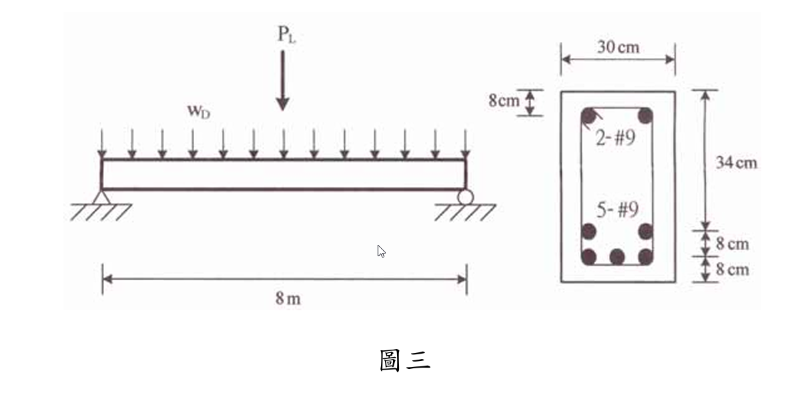

### 考題編號：RC-2006-3

**主分類：** `RC-U3-1` 梁工作性要求（含撓度、裂縫）
**副分類：** 無
**設計法：** USD強度設計法
**標籤：** `簡支梁` `即時撓度增量` `有效慣性矩Ie` `開裂彎矩Mcr` `轉換斷面法` `集中活載重` `忽略壓力筋`

---

## 1. 原始題目重述 (Problem Restatement)

先施加均布靜載重 $w_D$，再於梁中央施加集中活載重 $P_L$，求**施加 $P_L$ 後梁中央增加之即時撓度**。

**已知條件：**

| 項目 | 數值 |
|------|------|
| 斷面 | $b=30$ cm，$h=34$ cm |
| 有效深度 $d$ | $34-8=26$ cm（張力筋心距底面 8 cm）|
| 張力筋 | 5-#9，$A_s = 5\times6.47=32.35$ cm² |
| 壓力筋 | 2-#9（**可不考慮**）|
| 跨度 $L$ | 8 m = 800 cm（簡支）|
| $f'_c$ | 280 kgf/cm² |
| $n$ | 8 |
| $w_D$（含自重）| 0.8 tf/m = 8 kgf/cm |
| $P_L$（跨中）| 5 tf = 5,000 kgf |

**題目附圖：**

*圖說：b=30 cm，h=34 cm，張力筋 5-#9（A_s=32.35 cm²）重心距底面 8 cm（d=26 cm），壓力筋 2-#9 忽略。L=8 m，wD=0.8 tf/m，PL=5 tf at midspan，n=8，f'c=280 kgf/cm²。*

---

## 2. 考題核心精神與出題者意圖 (Core Concepts & Examiner's Intent)

**核心：** 兩個不同荷載水準（DL 與 DL+PL）對應不同的 $I_e$，增量撓度 = 全部載重下的撓度 − 僅 DL 下的撓度。

**關鍵：** DL 和 DL+PL 均已使斷面深裂（$M_a \gg M_{cr}$），因此 $I_e \approx I_{cr}$，且增量撓度主要來自集中載重本身。

---

## 3. 解題戰略地圖與陷阱分析 (Strategic Roadmap & Trap Analysis)

| 步驟 | 工作 |
|------|------|
| 1 | 計算 $M_D$（均布 DL）和 $M_{D+L}$（DL + PL 之最大跨中彎矩）|
| 2 | 計算 $I_g$、$M_{cr}$ |
| 3 | 計算 $I_{cr}$（轉換裂縫斷面，忽略壓力鋼筋）|
| 4 | 計算 $I_e^D$（在 $M_D$ 水準）和 $I_e^{DL}$（在 $M_{D+L}$ 水準）|
| 5 | 計算 $\Delta_D$（僅 DL）和 $\Delta_{D+L}$（DL + PL 合計）|
| 6 | 增量 $= \Delta_{D+L} - \Delta_D$ |

**兩大陷阱：**

| 陷阱 | 說明 |
|------|------|
| ⚠ 兩個 $I_e$ 不同 | $\Delta_D$ 用 $I_e^D$，$\Delta_{D+L}$ 用 $I_e^{DL}$（各自對應最大彎矩水準）|
| ⚠ 均布+集中混合撓度公式 | $\Delta_{D+L} = 5w_D L^4/(384EI) + P_L L^3/(48EI)$（同一 $I_e^{DL}$）|

---

## 3.5 變數層次分析 (Variable Hierarchy Analysis)

### 最終目標
`計算加入 PL 後跨中即時撓度增量 Δ_PL`

### 本題關鍵公式鏈

$$I_{cr}: \quad \frac{b(kd)^2}{2} = nA_s(d-kd) \Rightarrow kd$$

$$I_e = \left(\frac{M_{cr}}{M_a}\right)^3 I_g + \left[1-\left(\frac{M_{cr}}{M_a}\right)^3\right]\boxed{I_{cr}}$$

$$\Delta_D = \frac{5w_D L^4}{384 E_c \boxed{I_e^D}}, \quad \Delta_{D+L} = \frac{5w_D L^4}{384 E_c \boxed{I_e^{DL}}} + \frac{P_L L^3}{48 E_c \boxed{I_e^{DL}}}$$

$$\Delta_{P_L} = \Delta_{D+L} - \Delta_D$$

### L2：需知識點推導（關鍵數字）

| 符號 | 值 | 說明 |
|------|---|------|
| $E_c$ | $E_s/n = 255{,}000$ kgf/cm² | $n=8$ given |
| $I_g$ | $98{,}260$ cm⁴ | $30\times34^3/12$ |
| $M_{cr}$ | $193{,}500$ kgf·cm | $2\sqrt{280}\times98{,}260/17$ |
| $M_D$ | $640{,}000$ kgf·cm | $8\times800^2/8$ |
| $M_{D+L}$ | $1{,}640{,}000$ kgf·cm | $640{,}000+5{,}000\times800/4$ |
| $kd$ | 14.24 cm | 二次方程 |
| $I_{cr}$ | $64{,}668$ cm⁴ | |
| $I_e^D$ | $65{,}609$ cm⁴ | $(M_{cr}/M_D)^3=0.0276$ |
| $I_e^{DL}$ | $64{,}713$ cm⁴ | $(M_{cr}/M_{D+L})^3=0.00164$ |
| $\Delta_D$ | 2.551 cm | |
| $\Delta_{D+L}$ | 5.819 cm | |
| $\Delta_{P_L}$ | **3.27 cm** | |

---

## 4. 步驟化詳細計算過程 (Step-by-Step Detailed Calculation)

### Step 1：彎矩計算

$$M_D = \frac{w_D L^2}{8} = \frac{8 \times 800^2}{8} = 640{,}000 \text{ kgf·cm} = 6.4 \text{ tf·m}$$

$$M_L^{conc} = \frac{P_L \cdot L}{4} = \frac{5{,}000 \times 800}{4} = 1{,}000{,}000 \text{ kgf·cm} = 10.0 \text{ tf·m}$$

$$M_{D+L} = 640{,}000 + 1{,}000{,}000 = 1{,}640{,}000 \text{ kgf·cm}$$

### Step 2：截面性質

$$E_c = \frac{E_s}{n} = \frac{2{,}040{,}000}{8} = 255{,}000 \text{ kgf/cm}^2$$

$$I_g = \frac{30 \times 34^3}{12} = \frac{30 \times 39{,}304}{12} = 98{,}260 \text{ cm}^4$$

$$f_r = 2\sqrt{280} = 33.47 \text{ kgf/cm}^2, \quad y_t = 17 \text{ cm}$$

$$M_{cr} = \frac{f_r I_g}{y_t} = \frac{33.47 \times 98{,}260}{17} = 193{,}500 \text{ kgf·cm} = 1.94 \text{ tf·m}$$

$$M_D = 6.4 \text{ tf·m} > M_{cr} = 1.94 \text{ tf·m} \quad \Rightarrow \text{DL 水準已開裂}$$

### Step 3：開裂轉換斷面中性軸 $kd$（忽略壓力鋼筋）

$$n A_s = 8 \times 32.35 = 258.8 \text{ cm}^2$$

$$\frac{b(kd)^2}{2} = n A_s (d - kd)$$
$$15(kd)^2 + 258.8(kd) - 258.8 \times 26 = 0$$
$$15(kd)^2 + 258.8(kd) - 6{,}728.8 = 0$$
$$(kd)^2 + 17.25(kd) - 448.6 = 0$$

$$kd = \frac{-17.25 + \sqrt{17.25^2 + 4 \times 448.6}}{2} = \frac{-17.25 + \sqrt{2{,}092}}{2} = \frac{-17.25 + 45.74}{2} = \boxed{14.24 \text{ cm}}$$

$$I_{cr} = \frac{30 \times 14.24^3}{3} + 258.8 \times (26 - 14.24)^2$$

$$= \frac{30 \times 2{,}887.6}{3} + 258.8 \times 11.76^2 = 28{,}876 + 258.8 \times 138.3 = 28{,}876 + 35{,}792 = \boxed{64{,}668 \text{ cm}^4}$$

### Step 4：有效慣性矩 $I_e$

**DL 水準** ($M_a = M_D = 640{,}000$ kgf·cm)：
$$\left(\frac{M_{cr}}{M_D}\right)^3 = \left(\frac{193{,}500}{640{,}000}\right)^3 = (0.3023)^3 = 0.02762$$

$$I_e^D = 0.02762 \times 98{,}260 + 0.97238 \times 64{,}668 = 2{,}716 + 62{,}892 = \boxed{65{,}608 \text{ cm}^4}$$

**DL+PL 水準** ($M_a = M_{D+L} = 1{,}640{,}000$ kgf·cm)：
$$\left(\frac{M_{cr}}{M_{D+L}}\right)^3 = \left(\frac{193{,}500}{1{,}640{,}000}\right)^3 = (0.1180)^3 = 0.001643$$

$$I_e^{DL} = 0.001643 \times 98{,}260 + 0.998357 \times 64{,}668 = 161 + 64{,}561 = \boxed{64{,}722 \text{ cm}^4}$$

### Step 5：各階段撓度

$$E_c I_e^D = 255{,}000 \times 65{,}608 = 1.673 \times 10^{10} \text{ kgf·cm}^2$$
$$E_c I_e^{DL} = 255{,}000 \times 64{,}722 = 1.650 \times 10^{10} \text{ kgf·cm}^2$$

**僅 DL 下之撓度：**
$$\Delta_D = \frac{5 w_D L^4}{384 E_c I_e^D} = \frac{5 \times 8 \times (800)^4}{384 \times 1.673 \times 10^{10}}$$

$$= \frac{1.6384 \times 10^{13}}{6.424 \times 10^{12}} = \boxed{2.551 \text{ cm}}$$

**DL + PL 合計撓度**（均採 $I_e^{DL}$）：

均布 DL 部分：
$$\Delta_{D,new} = \frac{5 \times 8 \times (800)^4}{384 \times 1.650 \times 10^{10}} = \frac{1.6384 \times 10^{13}}{6.336 \times 10^{12}} = 2.587 \text{ cm}$$

集中 PL 部分：
$$\Delta_{P_L} = \frac{P_L L^3}{48 E_c I_e^{DL}} = \frac{5{,}000 \times (800)^3}{48 \times 1.650 \times 10^{10}} = \frac{2.56 \times 10^{12}}{7.92 \times 10^{11}} = 3.232 \text{ cm}$$

$$\Delta_{D+L} = 2.587 + 3.232 = 5.819 \text{ cm}$$

### Step 6：集中活載重引起之即時撓度增量

$$\Delta_{P_L}^{incr} = \Delta_{D+L} - \Delta_D = 5.819 - 2.551 = \boxed{3.27 \text{ cm}}$$

---

## 5. 關鍵爭議點與進階探討

### 為何 $I_e^D \approx I_e^{DL} \approx I_{cr}$？

$$M_D = 640{,}000 \gg M_{cr} = 193{,}500 \quad \Rightarrow \quad \left(\frac{M_{cr}}{M_D}\right)^3 = 0.028 \ll 1$$

DL 已使斷面深裂，$I_e$ 幾乎等於 $I_{cr}$ = 64,668 cm⁴。加上 PL 後仍深裂，$I_e$ 幾乎不變。因此：

$$\Delta_{P_L}^{incr} \approx \frac{P_L L^3}{48 E_c I_{cr}} = \frac{5{,}000 \times 512 \times 10^6}{48 \times 255{,}000 \times 64{,}668} = 3.23 \text{ cm}$$

增量幾乎就是 $P_L$ 直接作用在裂縫斷面上的撓度，均布 DL 的「Ie 變化修正」（2.587-2.551=0.036 cm）很小。

### 若不忽略壓力鋼筋（As'=12.94 cm²）

加入 As' 後 kd 縮小，Icr 增大，撓度減小。本題指定忽略，故不計。

### L/d 比與斷面設計評論

L/d = 800/26 = 30.8，這是相當深的梁（通常簡支梁 L/d ≤ 16 以控制撓度）。該梁撓度偏大（$\Delta_{D+L}/L = 5.819/800 = 1/137$），遠超 ACI 建議的 L/360 = 2.22 cm。
