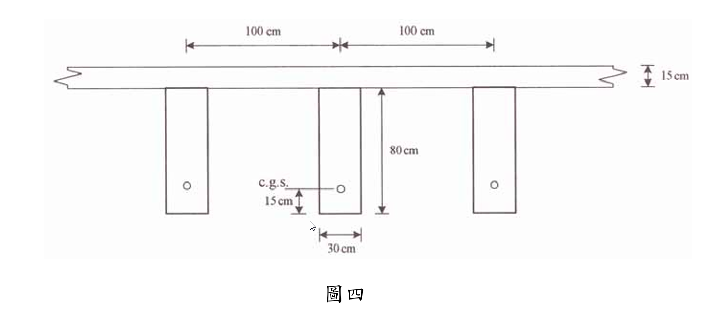

### 考題編號：RC-2006-4

**主分類：** `RC-U4-1` 預力梁斷面應力分析
**副分類：** `RC-U4-2` 預力量與偏心量設計
**設計法：** WSD工作應力法
**標籤：** `後拉法` `組合T型斷面` `兩階段應力疊加` `非組合梁承受DL` `組合梁承受LL` `上緣壓力` `下緣拉力` `不同f'c轉換`

---

## 1. 原始題目重述 (Problem Restatement)

簡支預力梁，先架設（承受梁自重及版 DL），版硬化後形成組合斷面，施加均布活載重 $w_{LL} = 1.0$ tf/m²，求**跨中斷面預力梁上緣（頂）及下緣（底）之混凝土應力**。

**已知條件：**

| 項目 | 數值 |
|------|------|
| 梁跨度 $L$ | 20 m = 2000 cm |
| 梁斷面 | $b=30$ cm，$h=80$ cm |
| 梁 $f'_{c1}$ | 350 kgf/cm² |
| 版斷面 | 寬 200 cm，厚 15 cm |
| 版 $f'_{c2}$ | 280 kgf/cm² |
| 有效預力 $P_e$ | 210 tf = 210,000 kgf |
| c.g.s. 距梁底 | 15 cm |
| 均布活載重 $w_{LL}$ | 1.0 tf/m²（施於版上）|
| $\gamma_c$ | 2400 kgf/m³ |

**題目附圖：**

*圖說：簡支預力梁 30×80 cm，c.g.s. 距梁底 15 cm，梁偏心距 e=40-15=25 cm。梁間距 200 cm（梁中心各 100 cm），版寬 200 cm，版厚 15 cm（$f'_{c2}=280$ kgf/cm²）。有效預力 210 tf，$L=20$ m。*

---

## 2. 考題核心精神與出題者意圖 (Core Concepts & Examiner's Intent)

**兩階段施工順序：**
- **Stage 1（非組合梁）：** $P_e$ + 梁自重 + 版濕混凝土 DL → 作用於梁斷面
- **Stage 2（組合斷面）：** $w_{LL}$ → 作用於組合轉換斷面

**控制條件：** 本題不要求驗算，只求應力值。

---

## 3. 解題戰略地圖與陷阱分析 (Strategic Roadmap & Trap Analysis)

| 步驟 | 工作 |
|------|------|
| 1 | 計算梁斷面性質（$A_1$, $I_1$, $S_{t1}$, $S_{b1}$）|
| 2 | Stage 1：預力 + 梁 SW + 版 DL → 梁頂/底應力 |
| 3 | 計算組合轉換斷面（$n=\sqrt{280/350}$）|
| 4 | Stage 2：$w_{LL}$ → 組合斷面增量應力 |
| 5 | 疊加得最終應力 |

**三大陷阱：**

| 陷阱 | 說明 |
|------|------|
| ⚠ 版 DL 作用在非組合梁 | 版尚未硬化時，版重由梁獨自承受 |
| ⚠ $n = \sqrt{f'_{c2}/f'_{c1}}$（非 1）| 版混凝土較弱，需折減轉換 |
| ⚠ LL 在組合斷面上 | 版硬化後形成組合，活載重作用於組合截面 |

---

## 3.5 變數層次分析 (Variable Hierarchy Analysis)

### 最終目標
`疊加 Stage1（預力+DL）和 Stage2（LL）應力，得梁頂梁底最終應力`

### 本題關鍵公式鏈

$$\text{Stage 1: } f = \frac{P_e}{A_1} \pm \frac{P_e \cdot e}{S} \mp \frac{M_{S1}}{S}$$

$$n = \sqrt{\frac{f'_{c2}}{f'_{c1}}}, \quad b'_{slab} = b_{slab} \times n, \quad \bar{y} = \frac{\sum A_i y_i}{\sum A_i}$$

$$\text{Stage 2: } \Delta f = \pm \frac{M_{LL} \cdot y}{I_c}$$

### L2 關鍵數值

| 符號 | 值 |
|------|---|
| $e$ | $40-15=25$ cm |
| $A_1, I_1$ | 2400 cm², 1,280,000 cm⁴ |
| $S_{t1}=S_{b1}$ | 32,000 cm³ |
| $w_{S1}$ | $576+720=1296$ kgf/m |
| $M_{S1}$ | 6,480,000 kgf·cm |
| $f_{top}^{S1}$, $f_{bot}^{S1}$ | +125.9, +49.1 kgf/cm²（均壓縮）|
| $n$, $b'$ | 0.8944, 178.9 cm |
| $\bar{y}$ | 65.07 cm（梁底起）|
| $I_c$ | 4,188,647 cm⁴ |
| $S_{comp,top}$, $S_{comp,bot}$ | 280,554, 64,373 cm³ |
| $M_{LL}$ | 10,000,000 kgf·cm |
| $\Delta f_{top}^{LL}$, $\Delta f_{bot}^{LL}$ | +35.6, −155.4 kgf/cm² |
| **梁頂最終** | **+161.6 kgf/cm²（壓縮）** |
| **梁底最終** | **−106.3 kgf/cm²（拉伸）** |

---

## 4. 步驟化詳細計算過程 (Step-by-Step Detailed Calculation)

### Step 1：非組合梁斷面性質

$$A_1 = 30 \times 80 = 2{,}400 \text{ cm}^2, \quad I_1 = \frac{30 \times 80^3}{12} = \frac{30 \times 512{,}000}{12} = 1{,}280{,}000 \text{ cm}^4$$

$$S_{t1} = S_{b1} = \frac{I_1}{h/2} = \frac{1{,}280{,}000}{40} = 32{,}000 \text{ cm}^3$$

偏心距：$e = \frac{h}{2} - 15 = 40 - 15 = \boxed{25 \text{ cm}}$

---

### Step 2：Stage 1（非組合梁：$P_e$ + 梁 SW + 版 DL）

**預力應力（壓縮為正）：**

$$f_{top}^{PS} = \frac{P_e}{A_1} - \frac{P_e \cdot e}{S_{t1}} = \frac{210{,}000}{2{,}400} - \frac{210{,}000 \times 25}{32{,}000} = 87.50 - 164.06 = \boxed{-76.56 \text{ kgf/cm}^2 \text{ （拉）}}$$

$$f_{bot}^{PS} = \frac{P_e}{A_1} + \frac{P_e \cdot e}{S_{b1}} = 87.50 + 164.06 = \boxed{+251.56 \text{ kgf/cm}^2 \text{ （壓）}}$$

**Stage 1 DL 荷載（作用於非組合梁）：**

$$w_{beam} = 2400 \times \frac{30 \times 80}{10{,}000} = 576 \text{ kgf/m} = 5.76 \text{ kgf/cm}$$

$$w_{slab} = 2400 \times 0.15 \times 2.00 = 720 \text{ kgf/m} = 7.20 \text{ kgf/cm}$$

$$w_{S1} = 5.76 + 7.20 = 12.96 \text{ kgf/cm}$$

$$M_{S1} = \frac{12.96 \times 2000^2}{8} = 12.96 \times 500{,}000 = 6{,}480{,}000 \text{ kgf·cm}$$

**Stage 1 DL 應力：**

$$f_{top}^{S1,DL} = +\frac{M_{S1}}{S_{t1}} = +\frac{6{,}480{,}000}{32{,}000} = +202.50 \text{ kgf/cm}^2 \text{ （壓）}$$

$$f_{bot}^{S1,DL} = -\frac{M_{S1}}{S_{b1}} = -202.50 \text{ kgf/cm}^2 \text{ （拉）}$$

**Stage 1 總應力（預力 + DL）：**

$$f_{top}^{S1} = -76.56 + 202.50 = \boxed{+125.94 \text{ kgf/cm}^2 \text{ （壓）}}$$

$$f_{bot}^{S1} = +251.56 - 202.50 = \boxed{+49.06 \text{ kgf/cm}^2 \text{ （壓）}}$$

---

### Step 3：組合轉換斷面

$$n = \sqrt{\frac{f'_{c2}}{f'_{c1}}} = \sqrt{\frac{280}{350}} = \sqrt{0.800} = 0.8944$$

轉換版寬：$b'_{slab} = 200 \times 0.8944 = 178.9$ cm

各子斷面（梁底起量）：

| 子斷面 | 面積 $A_i$ | 形心 $y_i$ |
|--------|----------|----------|
| 梁（30×80）| 2,400 cm² | 40 cm |
| 轉換版（178.9×15）| 2,683.2 cm² | 80+7.5 = 87.5 cm |

**組合形心：**
$$\bar{y} = \frac{2{,}400 \times 40 + 2{,}683.2 \times 87.5}{2{,}400 + 2{,}683.2} = \frac{96{,}000 + 234{,}780}{5{,}083.2} = \frac{330{,}780}{5{,}083.2} = \boxed{65.07 \text{ cm}}$$

各關鍵距離：
- 梁底至形心：65.07 cm（$y_{bot}$）
- 形心至梁頂：$80 - 65.07 = 14.93$ cm（$y_{beam,top}$）
- 形心至版頂：$95 - 65.07 = 29.93$ cm

**組合慣性矩：**

$$I_{beam} = 1{,}280{,}000 + 2{,}400 \times (65.07 - 40)^2 = 1{,}280{,}000 + 2{,}400 \times 628.5 = 2{,}788{,}400 \text{ cm}^4$$

$$I_{slab} = \frac{178.9 \times 15^3}{12} + 2{,}683.2 \times (87.5 - 65.07)^2 = 50{,}310 + 2{,}683.2 \times 503.1 = 50{,}310 + 1{,}349{,}913 = 1{,}400{,}223 \text{ cm}^4$$

$$I_c = 2{,}788{,}400 + 1{,}400{,}223 = \boxed{4{,}188{,}623 \text{ cm}^4}$$

**截面模數（梁材料）：**
$$S_{comp,top} = \frac{I_c}{y_{beam,top}} = \frac{4{,}188{,}623}{14.93} = 280{,}552 \text{ cm}^3$$

$$S_{comp,bot} = \frac{I_c}{\bar{y}} = \frac{4{,}188{,}623}{65.07} = 64{,}372 \text{ cm}^3$$

---

### Step 4：Stage 2（組合斷面：$w_{LL}$ 均布活載重）

$$w_{LL} = 1.0 \text{ tf/m}^2 \times 2.0 \text{ m} = 2.0 \text{ tf/m} = 20.0 \text{ kgf/cm}$$

$$M_{LL} = \frac{20.0 \times 2000^2}{8} = 20.0 \times 500{,}000 = 10{,}000{,}000 \text{ kgf·cm}$$

**LL 增量應力（作用於梁）：**

$$\Delta f_{top}^{LL} = +\frac{M_{LL}}{S_{comp,top}} = +\frac{10{,}000{,}000}{280{,}552} = +\boxed{35.6 \text{ kgf/cm}^2 \text{ （壓）}}$$

$$\Delta f_{bot}^{LL} = -\frac{M_{LL}}{S_{comp,bot}} = -\frac{10{,}000{,}000}{64{,}372} = -\boxed{155.4 \text{ kgf/cm}^2 \text{ （拉）}}$$

---

### Step 5：施加 LL 後梁頂/底總應力

| 位置 | Stage 1 | Stage 2 LL | **總應力** |
|------|---------|-----------|-----------|
| 梁頂 | +125.94（壓）| +35.6（壓）| $\boxed{+161.6 \text{ kgf/cm}^2}$（**壓縮**）|
| 梁底 | +49.06（壓）| −155.4（拉）| $\boxed{-106.3 \text{ kgf/cm}^2}$（**拉伸**）|

---

## 5. 關鍵爭議點與進階探討

### 容許應力驗算

| 位置 | 計算應力 | 容許值 | 判斷 |
|------|---------|--------|------|
| 梁頂（壓）| 161.6 kgf/cm² | $0.4\times350 = 140$ kgf/cm² | ❌ 超限 |
| 梁底（拉）| 106.3 kgf/cm² | $3\sqrt{350} = 56.1$ kgf/cm² | ❌ 超限 |

→ 本題目所施加的活載重（1.0 tf/m²）使梁的工作應力超過容許值，顯示此梁在此條件下的服務性能不足。

### 版頂應力驗算（附加）

版頂（35.93 cm above composite centroid）LL 引起之壓力：
$$f_{deck,top}^{LL} = +\frac{M_{LL} \times y_{deck,top}}{I_c} \times n = +\frac{10{,}000{,}000 \times 29.93}{4{,}188{,}623} \times 0.8944 = 71.45 \times 0.8944 = 63.9 \text{ kgf/cm}^2$$

容許壓力 $0.4\times280 = 112$ kgf/cm²，版頂 63.9 < 112 ✓ 版本身OK。

### 版 DL 在 Stage 1 而非 Stage 2

若版 DL 誤置於組合斷面（Stage 2），梁底在 Stage 1 結束後仍有大量預壓：
$f_{bot}^{S1,incorrect} = +251.56 - 576\times500{,}000/32{,}000 = +251.56 - 90.0 = +161.6$ kgf/cm²（壓縮）

此值偏大，實際情況應如本題解算（版 DL 使梁底從 251.56 減少到 49.06 kgf/cm²）。
