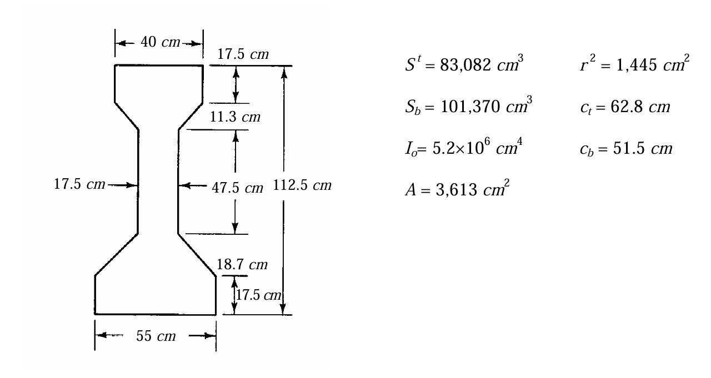

### 考題編號：RC-2007-4

**主分類：** `RC-U4-1` 預力梁斷面應力分析
**副分類：** `RC-U4-2` 預力量與偏心量設計
**設計法：** WSD工作應力法
**標籤：** `I形橋梁` `組合T型斷面` `兩階段應力疊加` `底纖維拉力控制` `集中活載重` `不同f'c轉換` `容許應力設計` `內梁`

---

## 1. 原始題目重述 (Problem Restatement)

20 m 跨簡支預力 I 形橋梁，橋面板硬化後形成**組合斷面**，求中間梁**跨中可承受的最大集中活載重 P**。

**已知條件：**

| 項目 | 數值 |
|------|------|
| 跨度 $L$ | 20 m = 2000 cm |
| 梁間距 | 2.2 m |
| I 形梁 $f'_{c1}$ | 350 kgf/cm² |
| 橋面版 $f'_{c2}$，厚度 | 280 kgf/cm²，20 cm |
| 容許壓應力 | $0.4f'_c$（梁：140，版：112 kgf/cm²）|
| 容許拉應力 | $3\sqrt{f'_c}$（梁：56.1，版：50.1 kgf/cm²）|
| 預力鋼線容許應力 | 13,200 kgf/cm² |
| 預力鋼線面積 $A_{ps}$ | 21.7 cm² |
| 預力損失 | 20% |
| c.g.s. 距梁底 | 20 cm（最小值）|
| 附加靜載重 | 750 kgf/m（梁版自重以外）|
| $\gamma_c$ | 2400 kgf/m³ |

**非組合 I 形梁斷面性質：**

| $A = 3{,}613$ cm² | $I_o = 5.2 \times 10^6$ cm⁴ |
|---|---|
| $c_t = 62.8$ cm | $S_t = 83{,}082$ cm³ |
| $c_b = 51.5$ cm | $S_b = 101{,}370$ cm³ |
| 梁全深 = $c_t + c_b = 114.3$ cm | $r^2 = 1{,}445$ cm² |

**題目附圖：**

*圖說：I 形梁，頂翼板寬 40 cm，底翼板寬 55 cm，梁全深 114.3 cm。橋面版寬 220 cm（梁間距 2.2 m），厚 20 cm，硬化後與梁形成組合斷面。c.g.s. 距梁底 20 cm，偏心距 $e = 51.5 - 20 = 31.5$ cm。*

---

## 2. 考題核心精神與出題者意圖 (Core Concepts & Examiner's Intent)

**核心：** 兩階段應力疊加（施工順序決定作用斷面）：
- **Stage 1（非組合）：** 預力 + 梁自重 + 橋面版濕混凝土重 → 作用於 I 形梁斷面
- **Stage 2（組合）：** 附加靜載重 + 活載重 → 作用於組合斷面

**關鍵：** 最大 P 由**梁底纖維不超過容許拉應力**控制（底部有預壓，被活載重彎矩耗盡）。

**若忽略組合斷面而將所有載重施於非組合梁：** 頂纖維壓力在全 DL 後已達 137 kgf/cm²（容許 140），LL 幾乎無空間 → 答案不合理（≈ 0.43 tf），必須用兩階段。

---

## 3. 解題戰略地圖與陷阱分析 (Strategic Roadmap & Trap Analysis)

| 步驟 | 工作 |
|------|------|
| 1 | 計算有效預力 $P_e$、偏心距 $e$ |
| 2 | Stage 1：$P_e$ + 梁 SW + 版 DL → 非組合梁應力 |
| 3 | 計算組合轉換斷面性質（$n = \sqrt{280/350}$）|
| 4 | Stage 2：750 kgf/m DL → 組合斷面應力 |
| 5 | 集中 LL（$P$ 在跨中）→ 組合斷面；三條件解 $P_{max}$ |

**三大陷阱：**

| 陷阱 | 說明 |
|------|------|
| ⚠ 版濕重在非組合階段 | 版混凝土澆置時尚未硬化，梁單獨承受其重量（Stage 1）|
| ⚠ 附加 DL 在組合階段 | 道路鋪面、欄杆等在版硬化後施加 → 作用於組合斷面（Stage 2）|
| ⚠ 三條限制求最小 P | 需同時檢核梁頂壓力、梁底拉力、版頂壓力，取最小值 |

---

## 3.5 變數層次分析 (Variable Hierarchy Analysis)

> 複習提示：第一次解題後，在每個卡住的知識點旁標記 `⚠`；第二次複習時只看有 `⚠` 的項目。

### 最終目標
`以兩階段應力疊加，找三個容許應力條件下最小的 P_max`

### 本題關鍵公式（依計算順序）

$$\text{Stage 1: } f = \frac{P_e}{A} \pm \frac{P_e \cdot e}{S} \mp \frac{M_{S1}}{S} \quad (\text{非組合梁})$$

$$\text{組合斷面: } n = \sqrt{\frac{f'_{c2}}{f'_{c1}}}, \quad b' = b_{deck} \times n, \quad \bar{y} = \frac{\sum A_i y_i}{\sum A_i}$$

$$I_{comp} = I_o + A_{beam}(\bar{y}-y_{beam})^2 + I'_{deck} + A'_{deck}(\bar{y}-y_{deck})^2$$

$$\text{Stage 2: } \Delta f = \pm \frac{M_{S2} \cdot y}{I_{comp}} \quad (\text{組合斷面；版取} \times n)$$

$$P_{max} = \min\!\left(\frac{[\sigma_{allow}]_{top} - f_{top,S1+S2}}{M_{LL,per P}/I_{comp} \cdot y_{top}},\ \frac{f_{bot,S1+S2} + [\sigma_{allow}]_{bot,tens}}{M_{LL,per P}/I_{comp} \cdot y_{bot}},\ \ldots\right)$$

### L1：題目直接給定

| 符號 | 數值 | 說明 |
|------|------|------|
| $A$, $I_o$, $S_t$, $S_b$ | 3613, 5.2×10⁶, 83082, 101370 | 非組合梁性質 |
| $c_t$, $c_b$ | 62.8, 51.5 cm | 形心至頂/底距離 |
| $f'_{c1}$, $f'_{c2}$ | 350, 280 kgf/cm² | 梁、版強度 |
| c.g.s. | 距梁底 20 cm | 鋼腱中心 |
| $A_{ps}$ | 21.7 cm² | 鋼腱面積 |
| $f_{pi}$ | 13,200 kgf/cm² | 鋼腱初始應力 |
| 損失 | 20% | |
| 梁間距 | 2.2 m | |
| 版厚 | 20 cm | |
| 附加 DL | 750 kgf/m | Stage 2 |
| $L$ | 2000 cm | |

### L2：需知識點推導

**Step 1：預力**

| 符號 | 公式/來源 | 卡關? |
|------|----------|:-----:|
| $P_i$ | $13{,}200\times21.7=286{,}440$ kgf | |
| $P_e$ | $286{,}440\times0.8=229{,}152$ kgf | |
| $e$ | $51.5-20=31.5$ cm（c.g.s.在形心下方）| |

**Step 2：Stage 1**

| 符號 | 公式/來源 | 卡關? |
|------|----------|:-----:|
| $w_{beam}$ | $2400\times3613/10^4=867.1$ kgf/m | |
| $w_{deck}$ | $2400\times0.20\times2.2=1056$ kgf/m | |
| $M_{S1}$ | $(867.1+1056)\times20^2/8=9{,}615{,}500$ kgf·cm | |
| $f_{top}^{S1}$ | $+92.29$ kgf/cm²（壓）| |
| $f_{bot}^{S1}$ | $+39.79$ kgf/cm²（壓）| |

**Step 3：組合斷面**

| 符號 | 公式/來源 | 卡關? |
|------|----------|:-----:|
| $n$ | $\sqrt{280/350}=0.8944$ | |
| $b'_{deck}$ | $220\times0.8944=196.8$ cm | |
| $\bar{y}$ | $(3613\times51.5+3936\times124.3)/7549=89.44$ cm（梁底起）| |
| $I_{comp}$ | $15.31\times10^6$ cm⁴ | |
| $S_{comp,bot}$ | $15.31\times10^6/89.44=171{,}234$ cm³（梁底）| |

**Step 4：Stage 2 DL + LL 求 $P_{max}$**

| 條件 | 限制式 | $P_{max}$ |
|------|--------|---------|
| 梁底拉力 | $17.89 - P\times500/171{,}234 \geq -56.1$ | **25.3 tf（控制）** |
| 梁頂壓力 | $98.38 + P\times500/615{,}877 \leq 140$ | 51.3 tf |
| 版頂壓力 | $9.82 + P\times500\times0.8944/341{,}387 \leq 112$ | 78.1 tf |

### L3：深層知識（不懂就卡住）

| 知識點 | 說明 | 卡關? |
|--------|------|:-----:|
| 版 DL 在 Stage 1 | 澆版時版為液態，梁獨自承受 → 用非組合 I 形梁斷面 | |
| 組合斷面版應力 = 轉換應力 × $n$ | 版的彈性模數比梁低，相同應變 → 較低應力 | |
| 三條件取最小 | 梁底（拉力）→ 版頂（壓力）→ 梁頂（壓力），逐一算 | |
| $e$ 正方向 | e 以 c.g.s. 在形心**下方**為正，對梁底增加壓力 | |

---

## 4. 步驟化詳細計算過程 (Step-by-Step Detailed Calculation)

### Step 1：有效預力與偏心距

$$P_i = f_{pi} \times A_{ps} = 13{,}200 \times 21.7 = 286{,}440 \text{ kgf}$$
$$P_e = 286{,}440 \times (1 - 0.20) = \boxed{229{,}152 \text{ kgf}}$$
$$e = c_b - 20 = 51.5 - 20 = \boxed{31.5 \text{ cm}} \quad (\text{c.g.s. 在形心下方})$$

**預力應力（壓縮為正）：**

$$f_{top}^{PS} = \frac{P_e}{A} - \frac{P_e \cdot e}{S_t} = \frac{229{,}152}{3{,}613} - \frac{229{,}152 \times 31.5}{83{,}082} = 63.43 - 86.88 = \boxed{-23.45 \text{ kgf/cm}^2 \text{ （拉）}}$$

$$f_{bot}^{PS} = \frac{P_e}{A} + \frac{P_e \cdot e}{S_b} = 63.43 + \frac{229{,}152 \times 31.5}{101{,}370} = 63.43 + 71.21 = \boxed{+134.64 \text{ kgf/cm}^2 \text{ （壓）}}$$

---

### Step 2：Stage 1（非組合梁：預力 + 梁 SW + 版 DL）

**荷載：**
$$w_{beam} = 2400 \times \frac{3{,}613}{10{,}000} = 867.1 \text{ kgf/m}, \quad w_{deck} = 2400 \times 0.20 \times 2.2 = 1{,}056 \text{ kgf/m}$$
$$w_{S1} = 867.1 + 1{,}056 = 1{,}923.1 \text{ kgf/m} = 19.231 \text{ kgf/cm}$$

$$M_{S1} = \frac{19.231 \times 2000^2}{8} = \boxed{9{,}615{,}500 \text{ kgf·cm}}$$

**Stage 1 DL 應力：**
$$f_{top}^{S1,DL} = +\frac{M_{S1}}{S_t} = +\frac{9{,}615{,}500}{83{,}082} = +115.74 \text{ kgf/cm}^2 \text{ （壓）}$$
$$f_{bot}^{S1,DL} = -\frac{M_{S1}}{S_b} = -\frac{9{,}615{,}500}{101{,}370} = -94.85 \text{ kgf/cm}^2 \text{ （拉）}$$

**Stage 1 總應力（預力 + DL）：**
$$f_{top}^{S1} = -23.45 + 115.74 = \boxed{+92.29 \text{ kgf/cm}^2 \text{ （壓）}} \leq 140 \quad \checkmark$$
$$f_{bot}^{S1} = +134.64 - 94.85 = \boxed{+39.79 \text{ kgf/cm}^2 \text{ （壓）}} \quad \checkmark$$

---

### Step 3：組合轉換斷面（版硬化後）

$$n = \frac{E_{c,deck}}{E_{c,beam}} = \sqrt{\frac{f'_{c2}}{f'_{c1}}} = \sqrt{\frac{280}{350}} = \sqrt{0.8} = 0.8944$$

轉換版寬：$b'_{deck} = 220 \times 0.8944 = 196.8$ cm

各子斷面（梁底起量）：

| 子斷面 | 面積 $A_i$ | 形心高度 $y_i$ |
|--------|-----------|--------------|
| I 形梁 | 3,613 cm² | 51.5 cm |
| 轉換版（196.8×20）| 3,936 cm² | $114.3+10 = 124.3$ cm |
| **合計** | **7,549 cm²** | — |

**組合形心（梁底起）：**
$$\bar{y} = \frac{3{,}613 \times 51.5 + 3{,}936 \times 124.3}{7{,}549} = \frac{186{,}070 + 489{,}245}{7{,}549} = \frac{675{,}315}{7{,}549} = \boxed{89.44 \text{ cm}}$$

**各關鍵點到組合形心距離：**
- 梁底（受拉面）：$y_{bot} = 89.44$ cm（形心下方）
- 梁頂：$y_{beam,top} = 114.3 - 89.44 = 24.86$ cm（形心上方）
- 版頂：$y_{deck,top} = 134.3 - 89.44 = 44.86$ cm（形心上方）

**組合斷面慣性矩：**
$$I_{beam} = 5{,}200{,}000 + 3{,}613 \times (89.44-51.5)^2 = 5{,}200{,}000 + 3{,}613 \times 37.94^2$$
$$= 5{,}200{,}000 + 3{,}613 \times 1{,}439.4 = 5{,}200{,}000 + 5{,}200{,}567 = 10{,}400{,}567 \text{ cm}^4$$

$$I_{deck} = \frac{196.8 \times 20^3}{12} + 3{,}936 \times (124.3 - 89.44)^2 = 131{,}200 + 3{,}936 \times 34.86^2$$
$$= 131{,}200 + 3{,}936 \times 1{,}215.2 = 131{,}200 + 4{,}783{,}027 = 4{,}914{,}227 \text{ cm}^4$$

$$\boxed{I_{comp} = 10{,}400{,}567 + 4{,}914{,}227 = 15{,}314{,}794 \approx 15.31 \times 10^6 \text{ cm}^4}$$

**截面模數（梁材料應力）：**
$$S_{comp,bot} = \frac{I_{comp}}{y_{bot}} = \frac{15{,}314{,}794}{89.44} = 171{,}234 \text{ cm}^3$$
$$S_{comp,beam top} = \frac{I_{comp}}{y_{beam,top}} = \frac{15{,}314{,}794}{24.86} = 615{,}877 \text{ cm}^3$$

---

### Step 4：Stage 2（組合斷面：附加 DL = 750 kgf/m）

$$w_{S2} = 750 \text{ kgf/m} = 7.5 \text{ kgf/cm}$$
$$M_{S2} = \frac{7.5 \times 2000^2}{8} = 3{,}750{,}000 \text{ kgf·cm}$$

**Stage 2 DL 應力（在梁）：**
$$f_{beam,top}^{S2} = +\frac{M_{S2} \cdot y_{beam,top}}{I_{comp}} = +\frac{3{,}750{,}000 \times 24.86}{15{,}314{,}794} = +6.09 \text{ kgf/cm}^2 \text{ （壓）}$$

$$f_{beam,bot}^{S2} = -\frac{M_{S2} \cdot y_{bot}}{I_{comp}} = -\frac{3{,}750{,}000 \times 89.44}{15{,}314{,}794} = -21.89 \text{ kgf/cm}^2 \text{ （拉）}$$

**Stage 2 DL 應力（版頂，實際版混凝土應力）：**
$$f_{deck,top}^{S2} = +\frac{M_{S2} \cdot y_{deck,top}}{I_{comp}} \times n = +\frac{3{,}750{,}000 \times 44.86}{15{,}314{,}794} \times 0.8944 = +9.82 \text{ kgf/cm}^2 \text{ （壓）}$$

**累積應力（Stage 1 + Stage 2 DL）：**

| 位置 | Stage 1 | Stage 2 DL | 累積 | 限制 | 判斷 |
|------|---------|-----------|------|------|------|
| 梁頂 | +92.29 | +6.09 | **+98.38** | ≤ 140 | ✓ |
| 梁底 | +39.79 | −21.89 | **+17.90** | ≥ −56.1 | ✓ |
| 版頂 | 0 | +9.82 | **+9.82** | ≤ 112 | ✓ |

---

### Step 5：集中活載重 P（跨中，組合斷面）

$$M_{LL} = \frac{P \times L}{4} = \frac{P \times 2000}{4} = 500P \text{ kgf·cm}$$

LL 引起的應力增量：

$$\Delta f_{beam,top} = +\frac{500P \times 24.86}{15{,}314{,}794} = +0.0008115P \text{ kgf/cm}^2 \text{ （壓）}$$

$$\Delta f_{beam,bot} = -\frac{500P \times 89.44}{15{,}314{,}794} = -0.002920P \text{ kgf/cm}^2 \text{ （拉）}$$

$$\Delta f_{deck,top} = +\frac{500P \times 44.86}{15{,}314{,}794} \times 0.8944 = +0.001310P \text{ kgf/cm}^2$$

**三條限制求 $P_{max}$：**

**① 梁底不超過容許拉應力（$3\sqrt{350} = 56.1$ kgf/cm²）：**
$$17.90 - 0.002920P \geq -56.1$$
$$P \leq \frac{17.90 + 56.1}{0.002920} = \frac{74.0}{0.002920} = \boxed{25{,}342 \text{ kgf} = 25.3 \text{ tf}} \quad \leftarrow \textbf{控制}$$

**② 梁頂不超過容許壓應力（$0.4 \times 350 = 140$ kgf/cm²）：**
$$98.38 + 0.0008115P \leq 140$$
$$P \leq \frac{41.62}{0.0008115} = 51{,}288 \text{ kgf} = 51.3 \text{ tf}$$

**③ 版頂不超過容許壓應力（$0.4 \times 280 = 112$ kgf/cm²）：**
$$9.82 + 0.001310P \leq 112$$
$$P \leq \frac{102.18}{0.001310} = 78{,}000 \text{ kgf} = 78.0 \text{ tf}$$

$$\boxed{P_{max} = 25.3 \text{ tf} = 25{,}342 \text{ kgf}} \quad \text{（梁底拉力控制）}$$

---

## 5. 關鍵爭議點與進階探討 (Critical Issues & Advanced Discussion)

### 為何必須用兩階段分析？

若所有 DL（含 750 kgf/m）作用於非組合梁，則全 DL 後梁頂應力 = +137.4 kgf/cm²，距容許值 140 僅差 2.6 kgf/cm²，對應 P_max ≈ **430 kgf**（不合理）。

兩階段分析將附加 DL 與 LL 放到剛性大得多的組合斷面，使梁頂有充裕的安全餘裕，最終 P_max = **25.3 tf**（合理的橋梁設計值）。

### 控制條件彙整

| 條件 | 位置 | 累積+LL應力 | 容許值 | P_max |
|------|------|-----------|--------|-------|
| **梁底拉力** | 梁底 | $17.90 - 0.00292P$ | $\geq -56.1$ | **25.3 tf ← 控制** |
| 梁頂壓力 | 梁頂 | $98.38 + 0.000812P$ | $\leq 140$ | 51.3 tf |
| 版頂壓力 | 版頂 | $9.82 + 0.00131P$ | $\leq 112$ | 78.0 tf |

### $n$ 值的影響

$n = \sqrt{280/350} = 0.894$ 使版的有效剛度稍低於梁。若取 $n=1$（同材料）：
- 組合 $I_{comp}$ 略大，$P_{max}$ 略增
- 誤差約 5-10%

考試場合：可取 $n = \sqrt{f'_{c2}/f'_{c1}}$ 或 $n=1$（若題目未指定可合理假設）。

### 梁底拉力容許值 $3\sqrt{f'_c}$

本題容許**正拉應力** $= 3\sqrt{350} = 56.1$ kgf/cm²，屬於「B 級」截面（部分允許拉力裂縫）。若為更嚴格的「A 級」（全預壓），則容許拉應力 = 0，此時：
$$P_{max}^{no-tension} = 17.90/0.002920 = 6{,}130 \text{ kgf} = 6.13 \text{ tf}$$
大幅降低，顯示容許拉應力對 PC 橋梁活載重承載力影響很大。
