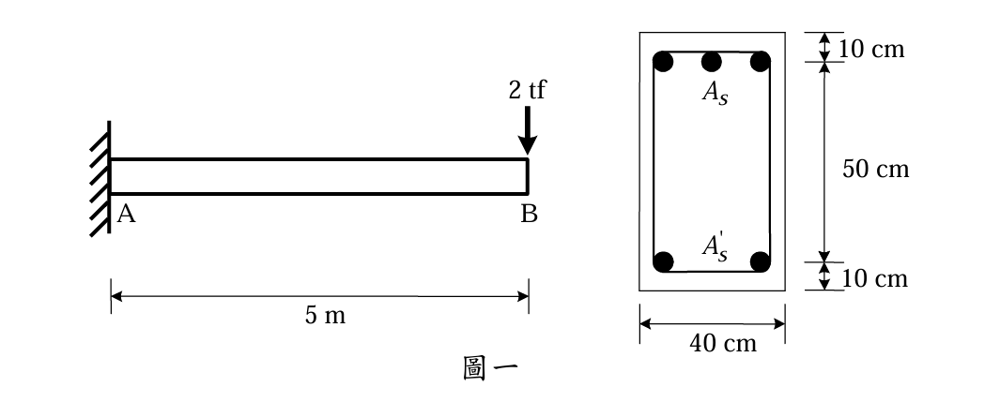

### 考題編號：RC-2008-1

**主分類：** `RC-U3-1` 梁工作性要求（含撓度、裂縫）
**副分類：** 無
**設計法：** USD強度設計法
**標籤：** `懸臂梁` `雙筋梁` `長期撓度` `有效慣性矩Ie` `開裂彎矩Mcr` `λ長期修正係數` `轉換斷面法`

---

## 1. 原始題目重述 (Problem Restatement)

有一懸臂梁（固定端 A、自由端 B），梁端 B 點承受集中載重 $P = 2 \text{ tf}$，計算**集中載重與梁自重持續作用一年後，B 點之撓度**。

**已知條件：**

| 項目 | 數值 |
|------|------|
| 斷面 | $b = 40 \text{ cm}$，$h = 50 \text{ cm}$ |
| 張力鋼筋（頂部） | $A_s = 50 \text{ cm}^2$，保護層 $10 \text{ cm}$ |
| 壓力鋼筋（底部） | $A_s' = 20 \text{ cm}^2$，保護層 $10 \text{ cm}$ |
| $f'_c$ | $280 \text{ kgf/cm}^2$ |
| $f_y$ | $4200 \text{ kgf/cm}^2$ |
| $E_s$ | $2.04 \times 10^6 \text{ kgf/cm}^2$ |
| $n$ | $8$ |
| 跨度 | $L = 5 \text{ m} = 500 \text{ cm}$ |
| 集中載重 | $P = 2 \text{ tf} = 2000 \text{ kgf}$ |

**題目附圖：**

*圖說：懸臂梁 A（固定端）至 B（自由端）跨度 5 m。斷面 $b \times h = 40 \times 50 \text{ cm}$，頂部（張力側）$A_s = 50 \text{ cm}^2$，距頂面 10 cm；底部（壓力側）$A_s' = 20 \text{ cm}^2$，距底面 10 cm。$f'_c = 280 \text{ kgf/cm}^2$，$f_y = 4200 \text{ kgf/cm}^2$，$n = 8$。*

**題目給定的撓度公式：**
$$\delta_P = \frac{PL^3}{3EI}, \quad \delta_w = \frac{wL^4}{8EI}$$

---

## 2. 考題核心精神與出題者意圖 (Core Concepts & Examiner's Intent)

**核心觀念：** ACI 有效慣性矩法（$I_e$）求即時撓度，再乘以長期修正係數 $\lambda$ 估算潛變與收縮引起的附加撓度。

**出題者測驗能力：**
1. 能否正確識別懸臂梁「哪側是壓力側」——懸臂梁頂部受拉，故 $A_s$（頂部，50 cm²）是張力鋼筋，$A_s'$（底部，20 cm²）是壓力鋼筋（$\rho'$ 用此算）
2. 能否用轉換斷面法求 $I_{cr}$（雙筋梁，壓力鋼筋以 $(n-1)A_s'$ 計）
3. 能否正確套用 $I_e$ 公式（以固定端最大彎矩 $M_a$ 代入）
4. 能否正確選取 1 年對應的 $\xi = 1.4$，並計算 $\lambda$

---

## 3. 解題戰略地圖與陷阱分析 (Strategic Roadmap & Trap Analysis)

**作戰順序：**
1. 算 $E_c = E_s/n$；算梁自重 $w$
2. 算 $I_g$、$M_{cr}$；算固定端最大彎矩 $M_a$，判斷是否開裂
3. 用轉換斷面法解中性軸深度 $kd$，求 $I_{cr}$
4. 套 $I_e$ 公式
5. 算即時撓度 $\delta_i$（集中載重 + 自重）
6. 算長期修正係數 $\lambda$（$\xi = 1.4$ 對應 1 年），求 1 年後總撓度

**四大陷阱：**

| 陷阱 | 說明 |
|------|------|
| ⚠ 壓力側判斷 | 懸臂梁頂受拉，$A_s'$（壓力鋼筋）在**底部**；$\rho'$ 用 $A_s'/(b \cdot d)$ 計算 |
| ⚠ $M_a$ 的計算基準 | 對懸臂梁，$M_a$ 取固定端（最大彎矩截面），而非跨中 |
| ⚠ $\xi$ 值選取 | 1 年 → $\xi = 1.4$（≥5年才取 2.0） |
| ⚠ $I_{cr}$ 中壓力鋼筋係數 | 轉換斷面法中壓力鋼筋面積取 $(n-1)A_s'$，不是 $nA_s'$ |

---

## 3.5 變數層次分析 (Variable Hierarchy Analysis)

> 複習提示：第一次解題後，在每個卡住的知識點旁標記 `⚠`；第二次複習時只看有 `⚠` 的項目。

### 最終目標
`求懸臂梁 B 點在集中載重 + 自重持續作用 1 年後的總撓度 δ_total`

### 本題關鍵公式（依計算順序）

> $\boxed{\cdot}$ = 需由前步驟推導，非題目直接給定的變數

$$\text{Step 1: } E_c = \frac{E_s}{n}, \quad w = \gamma \cdot b \cdot h$$

$$\text{Step 2: } M_a = P \cdot L + \frac{w L^2}{2}$$

$$\text{Step 3 (Mcr): } M_{cr} = \frac{f_r \cdot I_g}{y_t}, \quad f_r = 2\sqrt{f'_c}$$

$$\text{Step 4 (Icr): } \frac{b \cdot (kd)^2}{2} + (n-1)A_s'(kd - d') = n A_s (d - kd)$$

$$I_{cr} = \frac{b(\boxed{kd})^3}{3} + (n-1)A_s'(\boxed{kd}-d')^2 + n A_s (d - \boxed{kd})^2$$

$$\text{Step 5: } I_e = \left(\frac{M_{cr}}{M_a}\right)^3 I_g + \left[1 - \left(\frac{M_{cr}}{M_a}\right)^3\right] \boxed{I_{cr}}$$

$$\text{Step 6 (即時撓度): } \delta_i = \frac{PL^3}{3 E_c \boxed{I_e}} + \frac{w L^4}{8 E_c \boxed{I_e}}$$

$$\text{Step 7 (長期撓度): } \lambda = \frac{\xi}{1 + 50\rho'}, \quad \delta_{total} = \boxed{\delta_i}(1 + \lambda)$$

### L1：題目直接給定

| 符號 | 數值 | 說明 |
|------|------|------|
| $b$ | 40 cm | 梁寬 |
| $h$ | 50 cm | 梁總深 |
| $A_s$ | 50 cm² | 頂部（張力）鋼筋 |
| $A_s'$ | 20 cm² | 底部（壓力）鋼筋 |
| cover | 10 cm（頂底均同） | 淨保護層（至鋼筋中心） |
| $f'_c$ | 280 kgf/cm² | 混凝土抗壓強度 |
| $f_y$ | 4200 kgf/cm² | 鋼筋降伏強度 |
| $E_s$ | $2.04 \times 10^6$ kgf/cm² | 鋼筋彈性模數 |
| $n$ | 8 | 模數比 $E_s/E_c$ |
| $L$ | 500 cm | 懸臂梁跨度 |
| $P$ | 2000 kgf | B 點集中載重 |

### L2：需知識點推導

**Step 1：基本材料參數**

| 符號 | 公式/來源 | 卡關? |
|------|----------|:-----:|
| $E_c$ | $E_s / n = 2{,}040{,}000/8 = 255{,}000 \text{ kgf/cm}^2$ | |
| $d$ | $h - \text{cover} = 50 - 10 = 40 \text{ cm}$（張力鋼筋到壓力緣距離）| |
| $d'$ | $\text{cover} = 10 \text{ cm}$（壓力鋼筋到壓力緣距離）| |
| $w$ | $2400 \times 0.40 \times 0.50 = 480 \text{ kgf/m} = 4.8 \text{ kgf/cm}$ | |

**Step 2：固定端最大彎矩**

| 符號 | 公式/來源 | 卡關? |
|------|----------|:-----:|
| $M_P$ | $P \cdot L = 2000 \times 500 = 1{,}000{,}000 \text{ kgf·cm}$ | |
| $M_w$ | $wL^2/2 = 4.8 \times 500^2/2 = 600{,}000 \text{ kgf·cm}$ | |
| $M_a$ | $1{,}000{,}000 + 600{,}000 = 1{,}600{,}000 \text{ kgf·cm}$ | |

**Step 3：開裂彎矩**

| 符號 | 公式/來源 | 卡關? |
|------|----------|:-----:|
| $I_g$ | $bh^3/12 = 40 \times 50^3/12 = 416{,}667 \text{ cm}^4$ | |
| $f_r$ | $2\sqrt{f'_c} = 2\sqrt{280} = 33.47 \text{ kgf/cm}^2$ | |
| $y_t$ | $h/2 = 25 \text{ cm}$（矩形斷面）| |
| $M_{cr}$ | $33.47 \times 416{,}667/25 = 557{,}780 \text{ kgf·cm}$ | |

→ $M_a = 1{,}600{,}000 > M_{cr} = 557{,}780$，斷面**已開裂**

**Step 4：開裂轉換斷面慣性矩**

| 符號 | 公式/來源 | 卡關? |
|------|----------|:-----:|
| $kd$ | 由二次方程求解（壓力緣量起） = 18.94 cm | |
| $I_{cr}$ | 三項之和 = 279,187 cm⁴ | |

**Step 5：有效慣性矩**

| 符號 | 公式/來源 | 卡關? |
|------|----------|:-----:|
| $(M_{cr}/M_a)^3$ | $(557{,}780/1{,}600{,}000)^3 = 0.04237$ | |
| $I_e$ | ACI 公式 = 285,150 cm⁴（≤ $I_g$）✓ | |

**Step 6：即時撓度**

| 符號 | 公式/來源 | 卡關? |
|------|----------|:-----:|
| $\delta_P$ | $PL^3/(3E_cI_e) = 1.146 \text{ cm}$ | |
| $\delta_w$ | $wL^4/(8E_cI_e) = 0.516 \text{ cm}$ | |
| $\delta_i$ | $1.146 + 0.516 = 1.662 \text{ cm}$ | |

**Step 7：1 年長期撓度**

| 符號 | 公式/來源 | 卡關? |
|------|----------|:-----:|
| $\rho'$ | $A_s'/(b \cdot d) = 20/(40 \times 40) = 0.0125$ | |
| $\xi$ | 1 年 → $\xi = 1.4$（查 ACI 表格）| |
| $\lambda$ | $1.4/(1 + 50 \times 0.0125) = 0.862$ | |
| $\delta_{total}$ | $1.662 \times (1 + 0.862) = 3.09 \text{ cm}$ | |

### L3：深層知識（不懂就卡住）

| 知識點 | 說明 | 卡關? |
|--------|------|:-----:|
| 懸臂梁壓力側方向 | 懸臂梁下側受壓（底部壓力），頂部受拉；$A_s'$ 在底（壓力側） | |
| $I_{cr}$ 壓力鋼筋係數 | 壓力鋼筋用 $(n-1)A_s'$（總轉換面積 $= nA_s'$，減去混凝土面積 $A_s'$）| |
| ACI $I_e$ 的 $M_a$ 選取 | 懸臂梁用固定端最大彎矩（不像連續梁取跨中）| |
| $\xi$ 與持續時間 | 3月→1.0、6月→1.2、1年→**1.4**、5年以上→2.0 | |
| $\lambda$ 為何含 $\rho'$ | $\rho'$ 愈大代表壓力鋼筋愈多，可抵抗潛變，故長期撓度修正愈小 | |

---

## 4. 步驟化詳細計算過程 (Step-by-Step Detailed Calculation)

### Step 1：基本材料與幾何

$$E_c = \frac{E_s}{n} = \frac{2.04 \times 10^6}{8} = 255{,}000 \text{ kgf/cm}^2$$

懸臂梁受向下載重時，頂部為張力側，底部為壓力側：
$$d = 50 - 10 = 40 \text{ cm} \quad (\text{壓力緣至張力鋼筋中心})$$
$$d' = 10 \text{ cm} \quad (\text{壓力緣至壓力鋼筋中心})$$

梁自重（$\gamma = 2400 \text{ kgf/m}^3$）：
$$w = 2400 \times 0.40 \times 0.50 = 480 \text{ kgf/m} = 4.8 \text{ kgf/cm}$$

### Step 2：固定端最大服務彎矩

$$M_P = P \cdot L = 2000 \times 500 = 1{,}000{,}000 \text{ kgf·cm}$$

$$M_w = \frac{wL^2}{2} = \frac{4.8 \times 500^2}{2} = 600{,}000 \text{ kgf·cm}$$

$$M_a = M_P + M_w = \boxed{1{,}600{,}000 \text{ kgf·cm}}$$

### Step 3：開裂彎矩

$$I_g = \frac{bh^3}{12} = \frac{40 \times 50^3}{12} = 416{,}667 \text{ cm}^4$$

$$f_r = 2\sqrt{f'_c} = 2\sqrt{280} = 33.47 \text{ kgf/cm}^2$$

$$M_{cr} = \frac{f_r \cdot I_g}{y_t} = \frac{33.47 \times 416{,}667}{25} = 557{,}780 \text{ kgf·cm}$$

比較：$M_a = 1{,}600{,}000 > M_{cr} = 557{,}780$ kgf·cm → **斷面已開裂，需計算 $I_{cr}$**

### Step 4：開裂轉換斷面中性軸（$kd$ 從壓力緣量起）

雙筋梁裂縫斷面力矩平衡（壓力區面積矩 = 張力區面積矩）：

$$\frac{b \cdot (kd)^2}{2} + (n-1)A_s'(kd - d') = n A_s (d - kd)$$

代入數值：
$$\frac{40(kd)^2}{2} + 7 \times 20 \times (kd - 10) = 8 \times 50 \times (40 - kd)$$

$$20(kd)^2 + 140 \cdot kd - 1{,}400 = 16{,}000 - 400 \cdot kd$$

$$20(kd)^2 + 540 \cdot kd - 17{,}400 = 0$$

$$\Rightarrow (kd)^2 + 27 \cdot kd - 870 = 0$$

$$kd = \frac{-27 + \sqrt{27^2 + 4 \times 870}}{2} = \frac{-27 + \sqrt{729 + 3{,}480}}{2} = \frac{-27 + \sqrt{4{,}209}}{2} = \frac{-27 + 64.88}{2}$$

$$\boxed{kd = 18.94 \text{ cm}}$$

驗證：$kd = 18.94 > d' = 10$ cm → 壓力鋼筋確在壓力區 ✓

### Step 5：開裂斷面慣性矩 $I_{cr}$

$$I_{cr} = \frac{b(kd)^3}{3} + (n-1)A_s'(kd - d')^2 + n A_s (d - kd)^2$$

$$= \frac{40 \times (18.94)^3}{3} + 7 \times 20 \times (18.94 - 10)^2 + 8 \times 50 \times (40 - 18.94)^2$$

$$= \frac{40 \times 6{,}794}{3} + 140 \times (8.94)^2 + 400 \times (21.06)^2$$

$$= 90{,}587 + 140 \times 79.92 + 400 \times 443.52$$

$$= 90{,}587 + 11{,}189 + 177{,}408 = \boxed{279{,}184 \text{ cm}^4}$$

### Step 6：有效慣性矩 $I_e$

$$\left(\frac{M_{cr}}{M_a}\right)^3 = \left(\frac{557{,}780}{1{,}600{,}000}\right)^3 = (0.3486)^3 = 0.04237$$

$$I_e = \left(\frac{M_{cr}}{M_a}\right)^3 I_g + \left[1 - \left(\frac{M_{cr}}{M_a}\right)^3\right] I_{cr}$$

$$= 0.04237 \times 416{,}667 + 0.95763 \times 279{,}184$$

$$= 17{,}654 + 267{,}480 = \boxed{285{,}134 \text{ cm}^4}$$

（$I_e = 285{,}134 < I_g = 416{,}667$ cm⁴ ✓）

$$EI = E_c \times I_e = 255{,}000 \times 285{,}134 = 7.271 \times 10^{10} \text{ kgf·cm}^2$$

### Step 7：即時撓度 $\delta_i$

集中載重 $P = 2000$ kgf：
$$\delta_P = \frac{PL^3}{3EI} = \frac{2000 \times (500)^3}{3 \times 7.271 \times 10^{10}} = \frac{2.500 \times 10^{11}}{2.181 \times 10^{11}} = 1.146 \text{ cm}$$

均布自重 $w = 4.8$ kgf/cm：
$$\delta_w = \frac{wL^4}{8EI} = \frac{4.8 \times (500)^4}{8 \times 7.271 \times 10^{10}} = \frac{3.000 \times 10^{11}}{5.817 \times 10^{11}} = 0.516 \text{ cm}$$

$$\delta_i = \delta_P + \delta_w = 1.146 + 0.516 = \boxed{1.662 \text{ cm}}$$

### Step 8：長期撓度修正（1 年）

壓力鋼筋比（以懸臂梁壓力側 $A_s' = 20$ cm² 計算）：
$$\rho' = \frac{A_s'}{b \cdot d} = \frac{20}{40 \times 40} = 0.0125$$

查 ACI：持續作用 **1 年**對應 $\xi = 1.4$

$$\lambda = \frac{\xi}{1 + 50\rho'} = \frac{1.4}{1 + 50 \times 0.0125} = \frac{1.4}{1.625} = 0.862$$

兩種載重均為持續作用，故全部即時撓度均乘以 $\lambda$：
$$\Delta_{LT} = \lambda \cdot \delta_i = 0.862 \times 1.662 = 1.432 \text{ cm}$$

### 最終答案

$$\delta_{total} = \delta_i + \Delta_{LT} = 1.662 + 1.432 = \boxed{3.09 \text{ cm}}$$

---

## 5. 關鍵爭議點與進階探討 (Critical Issues & Advanced Discussion)

### 爭議 1：自重是否應計入持續荷載？

本題明確說「集中載重**及梁自重**持續作用一年後」，故兩者均為持續載重，全部即時撓度均需乘以 $\lambda$。若題目說「活載重為短期載重」，則只對持續部分（如死載重）乘 $\lambda$。

### 爭議 2：$d$ 的認定（10 cm 是到形心還是到外緣？）

本題圖說明確標示 10 cm 為保護層（到鋼筋中心），故 $d = 40$ cm、$d' = 10$ cm。若題目改為「到外緣 10 cm，鋼筋直徑 xx」，則需再扣半徑。

### 進階：懸臂梁 $I_e$ 的另一種處理

ACI 318-14 後，部分文獻建議懸臂梁可用全跨平均 $I_e$（類似連續梁作法），但考試場合以**固定端最大彎矩計算之 $I_e$** 最為保守且常見，為正規做法。

### 進階：若改為不計自重？

若題目只問集中載重的即時撓度：$M_a = 1{,}000{,}000$ kgf·cm，此時 $(M_{cr}/M_a)^3 = (0.5578)^3 = 0.1737$，$I_e$ 明顯偏大（接近未裂斷面），答案會差很多——提醒自重對雙筋重梁不可忽略。
