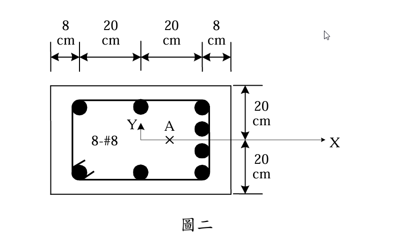

### 考題編號：RC-2008-2

**主分類：** `RC-U1-2` RC 柱強度分析與設計
**副分類：** 無
**設計法：** USD強度設計法
**標籤：** `方形柱` `P-M互制` `拉力鋼筋應變為零` `應變相容` `中排鋼筋在壓力區` `三排配筋` `壓力控制` `偏心受壓`

---

## 1. 原始題目重述 (Problem Restatement)

有一短柱，已知條件如下，壓力作用於 X 軸上之 A 點，**右側為壓力側**。若此柱斷面達到其軸力計算強度 $P_n$ 時，**拉力側鋼筋之應變剛好等於零**，求此時柱斷面所承受的彎矩 $M_n$。

**已知條件：**

| 項目 | 數值 |
|------|------|
| 斷面 | $56 \times 56 \text{ cm}$（方形） |
| 鋼筋 | 8-#8，$A_b = 5.07 \text{ cm}^2/\text{根}$ |
| $f'_c$ | $350 \text{ kgf/cm}^2$ |
| $f_y$ | $4200 \text{ kgf/cm}^2$ |
| $E_s$ | $2.04 \times 10^6 \text{ kgf/cm}^2$ |

**題目附圖：**

*圖說：方形柱斷面 $56 \times 56 \text{ cm}$。保護層 8 cm，鋼筋列間距 20 cm，8-#8 鋼筋共三排：壓力排（距壓力面 $d_1=8$ cm）3 根、中排（$d_2=28$ cm）2 根、拉力排（$d_3=48$ cm）3 根，合計 8 根。$f'_c=350 \text{ kgf/cm}^2$，$f_y=4200 \text{ kgf/cm}^2$。*

---

## 2. 考題核心精神與出題者意圖 (Core Concepts & Examiner's Intent)

**核心觀念：** 在 P-M 互制圖上，**拉力側應變 = 0** 是一個特殊的「邊界狀態」——整個斷面全部受壓（含拉力側鋼筋剛好為零應變），但仍屬壓力控制區域。

**出題者測驗能力：**
1. 能否由「拉力側應變 = 0」的條件，直接推導出中性軸深度 $c = d_3$（不需解方程式）
2. 能否對三排鋼筋分別進行應變相容計算，並判斷各排是否降伏
3. 能否正確處理「位於壓力區內的鋼筋需扣除 $0.85f'_c$」（避免重複計算混凝土面積）
4. 能否對各力取矩求彎矩（而非僅算 $P_n$）

---

## 3. 解題戰略地圖與陷阱分析 (Strategic Roadmap & Trap Analysis)

**作戰順序：**
1. 由條件 $\varepsilon_3 = 0$ → 直接確定 $c = d_3 = 48$ cm
2. 計算 $\beta_1$（$f'_c = 350 > 280$，需折減）→ $a = \beta_1 c$
3. 應變相容：計算三排鋼筋應變，與 $\varepsilon_y$ 比較判斷降伏
4. 計算各力（$C_c$，各排 $C_{si}$ 或 $T$），注意壓力區鋼筋扣除混凝土
5. 對截面形心取矩，求 $M_n$

**四大陷阱：**

| 陷阱 | 說明 |
|------|------|
| ⚠ $\beta_1$ 折減 | $f'_c = 350 > 280$，$\beta_1 = 0.85 - 0.05 \times(350-280)/70 = 0.80$（非 0.85）|
| ⚠ 壓力鋼筋扣除混凝土 | 壓力區內的鋼筋力要用 $(f_s - 0.85f'_c)$，避免與 $C_c$ 重複計算 |
| ⚠ 中排鋼筋是否降伏 | 中排 $d_2=28$ cm 時，$\varepsilon_2 = 0.00125 < \varepsilon_y = 0.00206$，**未降伏** |
| ⚠ 拉力側力為零 | $\varepsilon_3 = 0 \Rightarrow f_{s3} = 0$，拉力鋼筋對 $P_n$ 和 $M_n$ 均無貢獻 |

---

## 3.5 變數層次分析 (Variable Hierarchy Analysis)

> 複習提示：第一次解題後，在每個卡住的知識點旁標記 `⚠`；第二次複習時只看有 `⚠` 的項目。

### 最終目標
`由「拉力側應變 = 0」條件，求此 P-M 互制圖特殊點的標稱彎矩 Mn`

### 本題關鍵公式（依計算順序）

> $\boxed{\cdot}$ = 需由前步驟推導，非題目直接給定的變數

$$\text{Step 1: } \varepsilon_3 = 0 \Rightarrow c = d_3 = 48 \text{ cm}$$

$$\text{Step 2: } \beta_1 = 0.85 - \frac{f'_c - 280}{70} \times 0.05, \quad a = \beta_1 \cdot \boxed{c}$$

$$\text{Step 3: } \varepsilon_i = \varepsilon_{cu} \cdot \frac{\boxed{c} - d_i}{\boxed{c}}$$

$$\text{Step 4 (forces): } C_c = 0.85 f'_c \cdot \boxed{a} \cdot b$$
$$C_{si} = (f_{si} - 0.85f'_c) \cdot A_{si} \quad (d_i < \boxed{a}, \text{ 壓力區內})$$

$$\text{Step 5: } M_n = C_c \!\left(\frac{h}{2} - \frac{\boxed{a}}{2}\right) + \sum C_{si}\!\left(\frac{h}{2} - d_i\right)$$

### L1：題目直接給定

| 符號 | 數值 | 說明 |
|------|------|------|
| $h = b$ | 56 cm | 斷面邊長（方形，$8+20+20+8$）|
| cover | 8 cm | 保護層（至鋼筋中心）|
| 鋼筋排距 | 20 cm | 各排鋼筋間距 |
| $A_b$ | 5.07 cm² | #8 單根面積 |
| $f'_c$ | 350 kgf/cm² | 混凝土強度 |
| $f_y$ | 4200 kgf/cm² | 鋼筋降伏強度 |
| $E_s$ | $2.04 \times 10^6$ kgf/cm² | 鋼筋彈性模數 |

### L2：需知識點推導

**Step 1：中性軸深度**

| 符號 | 公式/來源 | 卡關? |
|------|----------|:-----:|
| $d_1, d_2, d_3$ | $8, 28, 48$ cm（從壓力面量起）| |
| $c$ | $\varepsilon_3=0 \Rightarrow$ 中性軸在拉力鋼筋處 $\Rightarrow c = 48$ cm | |

**Step 2：β₁ 與壓力塊**

| 符號 | 公式/來源 | 卡關? |
|------|----------|:-----:|
| $\beta_1$ | $0.85 - 0.05 \times(350-280)/70 = 0.80$ | |
| $a$ | $\beta_1 \times c = 0.80 \times 48 = 38.4$ cm | |

**Step 3：各排鋼筋應變與應力**

| 符號 | 公式/來源 | 卡關? |
|------|----------|:-----:|
| $\varepsilon_y$ | $f_y/E_s = 4200/2{,}040{,}000 = 0.00206$ | |
| $\varepsilon_1$ | $0.003 \times (48-8)/48 = 0.00250 > \varepsilon_y$ → 降伏，$f_{s1}=4200$ | |
| $\varepsilon_2$ | $0.003 \times (48-28)/48 = 0.00125 < \varepsilon_y$ → 未降伏，$f_{s2}=2550$ | |
| $\varepsilon_3$ | $0$（題目條件）→ $f_{s3}=0$ | |

**Step 4：各力**

| 符號 | 公式/來源 | 卡關? |
|------|----------|:-----:|
| $C_c$ | $0.85 \times 350 \times 38.4 \times 56 = 639{,}744$ kgf | |
| $A_{s1}$ | $3 \times 5.07 = 15.21$ cm² （壓力排，$d_1=8 < a=38.4$）| |
| $C_{s1}$ | $(4200-297.5) \times 15.21 = 59{,}357$ kgf | |
| $A_{s2}$ | $2 \times 5.07 = 10.14$ cm² （中排，$d_2=28 < a=38.4$）| |
| $C_{s2}$ | $(2550-297.5) \times 10.14 = 22{,}840$ kgf | |
| $T_3$ | $0$（$f_{s3}=0$）| |
| $P_n$ | $639{,}744 + 59{,}357 + 22{,}840 = 721{,}941$ kgf = **722 tf** | |

**Step 5：對形心取矩**

| 符號 | 公式/來源 | 卡關? |
|------|----------|:-----:|
| 形心位置 | $h/2 = 28$ cm 從壓力面 | |
| $C_c$ 力臂 | $28 - a/2 = 28 - 19.2 = 8.8$ cm | |
| $C_{s1}$ 力臂 | $28 - 8 = 20$ cm | |
| $C_{s2}$ 力臂 | $28 - 28 = 0$ cm（在形心，無力矩）| |
| $M_n$ | $639{,}744 \times 8.8 + 59{,}357 \times 20 = 6{,}816{,}887$ kgf·cm = **68.2 tf·m** | |

### L3：深層知識（不懂就卡住）

| 知識點 | 說明 | 卡關? |
|--------|------|:-----:|
| 拉力側應變=0 意義 | 整個斷面全部受壓，中性軸恰位於最遠鋼筋處；這是壓力控制與「全壓」的邊界 | |
| 壓力區鋼筋淨力 | $C_{si} = (f_{si} - 0.85f'_c) \times A_{si}$：因 Whitney 塊已包含該位置混凝土，需扣除避免重複 | |
| $\beta_1$ 折減規則 | $f'_c > 280$：每增加 70 kgf/cm²，$\beta_1$ 減少 0.05（最小 0.65）| |
| 未降伏鋼筋的應力 | $f_s = E_s \varepsilon_s$（線彈性），不能直接用 $f_y$ | |

---

## 4. 步驟化詳細計算過程 (Step-by-Step Detailed Calculation)

### Step 1：鋼筋幾何與中性軸深度

鋼筋排位置（從壓力面量起）：
$$d_1 = 8 \text{ cm},\quad d_2 = 28 \text{ cm},\quad d_3 = 48 \text{ cm}$$

各排根數：
- 壓力排（$d_1 = 8$）：3 根，$A_{s1} = 3 \times 5.07 = 15.21 \text{ cm}^2$
- 中排（$d_2 = 28$）：2 根，$A_{s2} = 2 \times 5.07 = 10.14 \text{ cm}^2$
- 拉力排（$d_3 = 48$）：3 根，$A_{s3} = 3 \times 5.07 = 15.21 \text{ cm}^2$

由題目條件「拉力側鋼筋應變 $= 0$」：

$$\varepsilon_3 = \varepsilon_{cu} \cdot \frac{c - d_3}{c} = 0 \quad \Rightarrow \quad c = d_3 = \boxed{48 \text{ cm}}$$

（直接確定中性軸深度，無需解方程式）

### Step 2：β₁ 與壓力塊深度

$$f'_c = 350 \text{ kgf/cm}^2 > 280 \text{ kgf/cm}^2$$

$$\beta_1 = 0.85 - 0.05 \times \frac{350 - 280}{70} = 0.85 - 0.05 \times 1 = \boxed{0.80}$$

$$a = \beta_1 \cdot c = 0.80 \times 48 = \boxed{38.4 \text{ cm}}$$

### Step 3：各排鋼筋應變相容

$$\varepsilon_{cu} = 0.003, \quad \varepsilon_y = \frac{f_y}{E_s} = \frac{4200}{2{,}040{,}000} = 0.002059$$

**壓力排** $d_1 = 8$ cm（壓力應變，計為正）：
$$\varepsilon_1 = 0.003 \times \frac{48 - 8}{48} = 0.003 \times \frac{40}{48} = 0.00250 \quad > \varepsilon_y = 0.00206$$
→ **已降伏**，$f_{s1} = f_y = 4200 \text{ kgf/cm}^2$（壓力）

**中排** $d_2 = 28$ cm：
$$\varepsilon_2 = 0.003 \times \frac{48 - 28}{48} = 0.003 \times \frac{20}{48} = 0.00125 \quad < \varepsilon_y$$
→ **未降伏**，$f_{s2} = E_s \varepsilon_2 = 2{,}040{,}000 \times 0.00125 = 2{,}550 \text{ kgf/cm}^2$（壓力）

**拉力排** $d_3 = 48$ cm：
$$\varepsilon_3 = 0 \quad \Rightarrow \quad f_{s3} = 0$$

### Step 4：各力計算

**混凝土壓力：**
$$C_c = 0.85 f'_c \cdot a \cdot b = 0.85 \times 350 \times 38.4 \times 56 = \boxed{639{,}744 \text{ kgf}}$$

**壓力排鋼筋淨力**（$d_1 = 8 < a = 38.4$，在壓力區內，扣除混凝土）：
$$C_{s1} = (f_{s1} - 0.85 f'_c) \times A_{s1} = (4200 - 297.5) \times 15.21 = 3902.5 \times 15.21 = \boxed{59{,}357 \text{ kgf}}$$

**中排鋼筋淨力**（$d_2 = 28 < a = 38.4$，在壓力區內，扣除混凝土）：
$$C_{s2} = (f_{s2} - 0.85 f'_c) \times A_{s2} = (2550 - 297.5) \times 10.14 = 2252.5 \times 10.14 = \boxed{22{,}840 \text{ kgf}}$$

**拉力排鋼筋力**（$d_3 = 48 > a = 38.4$，在拉力區，不扣混凝土）：
$$T_3 = f_{s3} \times A_{s3} = 0 \times 15.21 = 0$$

**標稱軸力強度：**
$$P_n = C_c + C_{s1} + C_{s2} - T_3 = 639{,}744 + 59{,}357 + 22{,}840 - 0 = \boxed{721{,}941 \text{ kgf} \approx 722 \text{ tf}}$$

### Step 5：對截面形心取矩求 $M_n$

截面形心位置：距壓力面 $h/2 = 56/2 = 28$ cm

各力臂（從壓力面量，形心在 28 cm）：

| 力 | 作用位置（從壓力面）| 力臂（至形心）| 力矩（kgf·cm）|
|----|----------|----------|----------|
| $C_c = 639{,}744$ kgf | $a/2 = 19.2$ cm | $28 - 19.2 = 8.8$ cm | $+5{,}629{,}747$ |
| $C_{s1} = 59{,}357$ kgf | $d_1 = 8$ cm | $28 - 8 = 20$ cm | $+1{,}187{,}140$ |
| $C_{s2} = 22{,}840$ kgf | $d_2 = 28$ cm | $28 - 28 = 0$ cm | $0$ |
| $T_3 = 0$ | $d_3 = 48$ cm | $48 - 28 = 20$ cm | $0$ |

$$M_n = 5{,}629{,}747 + 1{,}187{,}140 + 0 + 0 = 6{,}816{,}887 \text{ kgf·cm}$$

$$\boxed{M_n \approx 6{,}817{,}000 \text{ kgf·cm} = 68.2 \text{ tf·m}}$$

---

## 5. 關鍵爭議點與進階探討 (Critical Issues & Advanced Discussion)

### 此點在 P-M 互制圖上的位置

「拉力側應變 = 0」是 P-M 互制圖中一個特殊點：

- **純軸壓點** $P_0$：$e = 0$，無彎矩，所有鋼筋受壓
- **本題點**：$P_n = 722$ tf，$M_n = 68.2$ tf·m，拉力排剛好為零（整斷面全部受壓）
- **平衡點** $P_b$：拉力筋剛好降伏（$\varepsilon_t = \varepsilon_y$），彎矩最大附近
- **純彎點**：$P = 0$

本題點在平衡點**以上**（壓力控制區），是壓力控制與「全斷面受壓」的分界點。

### 爭議：中排鋼筋的 0.85f'c 扣除

當鋼筋位置恰好在 Whitney 塊邊緣時（$d_i$ 非常接近 $a$），扣除 $0.85f'_c$ 的效果不大，但仍應扣。本題 $d_2 = 28 < a = 38.4$，確實在壓力區內，需扣除 $0.85f'_c = 297.5$ kgf/cm²。

### 進階：若改為「拉力排剛好降伏」（平衡點）

若題目改成「拉力排應變 $= \varepsilon_y$」，則：
$$c_b = \frac{\varepsilon_{cu}}{\varepsilon_{cu} + \varepsilon_y} \times d_3 = \frac{0.003}{0.003 + 0.00206} \times 48 = 28.46 \text{ cm}$$

此時 $a_b = 0.80 \times 28.46 = 22.77$ cm，$P_b$ 和 $M_b$ 均可類似方法求得，且 $M_b > M_n$（本題）。
