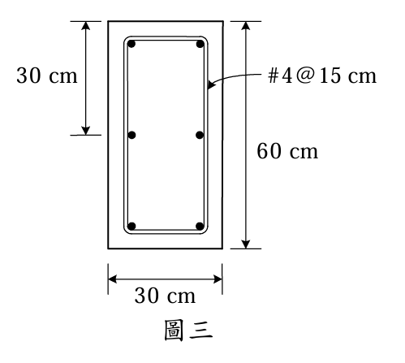

### 考題編號：RC-2008-3

**主分類：** `RC-U2-2` RC 扭力強度設計
**副分類：** 無
**設計法：** USD強度設計法
**標籤：** `矩形梁` `純扭矩` `斷面適當性` `空間桁架類比` `閉合箍筋` `Aoh計算` `poh最大間距` `縱向扭力筋`

---

## 1. 原始題目重述 (Problem Restatement)

矩形梁承受**純扭矩**，試驗算：
- **(a)** 斷面大小是否合適？（10 分）
- **(b)** 扭力鋼筋配置是否合適？（15 分）

**已知條件：**

| 項目 | 數值 |
|------|------|
| 斷面 | $b \times h = 30 \times 60 \text{ cm}$ |
| $f'_c$ | $280 \text{ kgf/cm}^2$ |
| $f_y = f_{yt}$ | $2800 \text{ kgf/cm}^2$ |
| 閉合箍筋 | #4，$d_b = 1.27 \text{ cm}$，$A_t = 1.27 \text{ cm}^2$，間距 $s = 15 \text{ cm}$ |
| 縱向鋼筋 | #4，$A_b = 1.27 \text{ cm}^2$（每根）|
| 淨保護層 | $4 \text{ cm}$ |
| 設計扭矩 | $T_u = 3.0 \text{ tf·m} = 300{,}000 \text{ kgf·cm}$ |
| $\phi$（扭力）| $0.75$ |

**題目附圖：**

*圖說：矩形斷面 $b \times h = 30 \times 60 \text{ cm}$，#4 閉合箍筋（$d_b=1.27$ cm，$A_t=1.27$ cm²）間距 15 cm，淨保護層 4 cm（至箍筋外緣）。$f'_c=280$，$f_y=f_{yt}=2800$ kgf/cm²，純扭矩設計 $T_u=3.0$ tf·m。*

---

## 2. 考題核心精神與出題者意圖 (Core Concepts & Examiner's Intent)

1. **(a) 斷面適當性** = 驗算混凝土不因斜壓破壞而壓碎（上限公式），與鋼筋量無關
2. **(b) 鋼筋適當性** = 空間桁架模型，驗算 $\phi T_n \geq T_u$，並查最大間距 $s \leq p_{oh}/8$

**出題者陷阱：**
- $f_y = 2800$（非 4200），容易用錯
- 淨保護層到箍筋**外緣**，求 $A_{oh}$ 時需加 $d_b/2$ 到箍筋中心

---

## 3. 解題戰略地圖與陷阱分析 (Strategic Roadmap & Trap Analysis)

| 步驟 | 工作項目 |
|------|---------|
| 1 | 計算 $A_{cp}$、$p_{cp}$（外輪廓）和 $A_{oh}$、$p_{oh}$（箍筋中心線）|
| 2 | **(a)** 計算扭力剪應力 $\tau_T$，與 $\phi(\tau_c + \tau_{max})$ 比較 |
| 3 | **(b-1)** 計算 $\phi T_n$（箍筋貢獻），與 $T_u$ 比較 |
| 4 | **(b-2)** 驗算最大間距 $s \leq p_{oh}/8$ |
| 5 | **(b-3)** 計算需要之縱向鋼筋 $A_l$，換算 #4 根數 |

**四大陷阱：**

| 陷阱 | 說明 |
|------|------|
| ⚠ 保護層到箍筋中心 | $c_{to center} = 4 + 1.27/2 = 4.635$ cm，不是直接用 4 cm |
| ⚠ $f_y = 2800$（非 4200）| 本題特殊，縱向和橫向鋼筋降伏強度均為 2800 |
| ⚠ 斷面適當性與鋼筋量無關 | (a) 只看斷面幾何，不看鋼筋多少 |
| ⚠ $A_o = 0.85 A_{oh}$，非 $A_{oh}$ | 計算 $T_n$ 時用 $A_o$，計算間距/縱筋用 $A_{oh}$ / $p_{oh}$ |

---

## 3.5 變數層次分析 (Variable Hierarchy Analysis)

> 複習提示：第一次解題後，在每個卡住的知識點旁標記 `⚠`；第二次複習時只看有 `⚠` 的項目。

### 最終目標
`(a) 驗算斷面剪應力上限；(b) 驗算 φTn≥Tu 及間距、縱筋是否合規`

### 本題關鍵公式（依計算順序）

$$\text{Step 1: } A_{oh} = x_{oh} \times y_{oh}, \quad p_{oh} = 2(x_{oh}+y_{oh}), \quad A_o = 0.85 A_{oh}$$

$$\text{(a) Step 2: } \frac{T_u \cdot p_{oh}}{1.7 A_{oh}^2} \leq \phi\!\left(\frac{V_c}{b_w d} + \frac{2\sqrt{f'_c}}{3}\right)$$

$$\text{(b) Step 3: } \phi T_n = \phi \cdot 2 \boxed{A_o} \cdot \frac{A_t}{s} \cdot f_{yt} \geq T_u$$

$$\text{Step 4 (間距): } s \leq \frac{p_{oh}}{8}, \quad s \leq 30 \text{ cm}$$

$$\text{Step 5 (縱筋): } A_l = \frac{A_t}{s} \cdot \boxed{p_{oh}} \cdot \frac{f_{yt}}{f_y}$$

### L1：題目直接給定

| 符號 | 數值 | 說明 |
|------|------|------|
| $b, h$ | 30, 60 cm | 斷面外輪廓 |
| 淨保護層 | 4 cm | 至箍筋外緣 |
| $d_b$ | 1.27 cm（#4）| 箍筋直徑 |
| $A_t$ | 1.27 cm² | 單肢箍筋面積 |
| $s$ | 15 cm | 箍筋間距 |
| $f'_c$ | 280 kgf/cm² | |
| $f_y = f_{yt}$ | 2800 kgf/cm² | 縱向與橫向均同 |
| $T_u$ | 300,000 kgf·cm | |
| $\phi$ | 0.75 | |

### L2：需知識點推導

**Step 1：幾何計算**

| 符號 | 公式/來源 | 卡關? |
|------|----------|:-----:|
| 箍筋中心至面距 | $4 + 1.27/2 = 4.635$ cm | |
| $x_{oh}$ | $30 - 2 \times 4.635 = 20.73$ cm | |
| $y_{oh}$ | $60 - 2 \times 4.635 = 50.73$ cm | |
| $A_{oh}$ | $20.73 \times 50.73 = 1051.6$ cm² | |
| $p_{oh}$ | $2(20.73+50.73) = 142.92$ cm | |
| $A_o$ | $0.85 \times 1051.6 = 893.9$ cm² | |
| $A_{cp}$ | $30 \times 60 = 1800$ cm² | |

**Step 2：(a) 斷面適當性**

| 符號 | 公式/來源 | 卡關? |
|------|----------|:-----:|
| $\tau_T$（左側）| $T_u \cdot p_{oh}/(1.7 A_{oh}^2) = 300{,}000 \times 142.92 / (1.7 \times 1051.6^2) = 22.81$ kgf/cm² | |
| $V_c/b_wd$（右側）| $0.53\sqrt{280} = 8.87$ kgf/cm² | |
| $(2/3)\sqrt{f'_c}$ | $(2/3)\times 16.73 = 11.16$ kgf/cm² | |
| 右側上限 | $\phi(8.87+11.16) = 0.75 \times 20.03 = 15.02$ kgf/cm² | |
| **結論** | $22.81 > 15.02$ → **斷面不合適，需加大** | |

**Step 3：(b) 箍筋能力**

| 符號 | 公式/來源 | 卡關? |
|------|----------|:-----:|
| $\phi T_n$ | $0.75 \times 2 \times 893.9 \times (1.27/15) \times 2800 = 317{,}900$ kgf·cm $= 3.179$ tf·m | |
| **結論** | $3.179 > T_u = 3.0$ tf·m → 箍筋強度**合適** | |
| 最大間距 | $p_{oh}/8 = 142.92/8 = 17.87$ cm；$s = 15 < 17.87$ ✓ | |

**Step 4：(b) 縱向鋼筋**

| 符號 | 公式/來源 | 卡關? |
|------|----------|:-----:|
| $A_l$（需求）| $(A_t/s)_{req} \times p_{oh} = 0.07991 \times 142.92 = 11.42$ cm² | |
| \#4 根數 | $11.42/1.27 = 9.0$，需 **9 根** | |
| 縱筋間距 | $p_{oh}/9 = 15.88$ cm $\leq 30$ cm ✓ | |

### L3：深層知識（不懂就卡住）

| 知識點 | 說明 | 卡關? |
|--------|------|:-----:|
| 斷面適當性公式意義 | 左側為扭力產生之斜向壓力應力；右側為混凝土能承受的上限（防止斜壓壓碎）| |
| $A_o$ vs $A_{oh}$ | $A_{oh}$ 是箍筋中心圍成的面積；$A_o = 0.85A_{oh}$ 是有效剪力流面積（考慮混凝土彈性與裂縫後退縮）| |
| 最大間距 $p_{oh}/8$ | 確保在每個 45° 對角裂縫段至少有一支箍筋；$p_{oh}$ 是箍筋中心線周長 | |
| $(A_t/s)_{req}$ vs 已提供 | 計算需求縱筋時用**需求的** $A_t/s$（非提供值），避免虛增縱筋 | |

---

## 4. 步驟化詳細計算過程 (Step-by-Step Detailed Calculation)

### Step 1：幾何計算

外輪廓（$A_{cp}$、$p_{cp}$）：
$$A_{cp} = b \times h = 30 \times 60 = 1800 \text{ cm}^2$$
$$p_{cp} = 2(b+h) = 2(30+60) = 180 \text{ cm}$$

至箍筋中心的距離：
$$c_{eff} = \text{淨保護層} + \frac{d_b}{2} = 4 + \frac{1.27}{2} = 4.635 \text{ cm}$$

箍筋中心圍成的矩形：
$$x_{oh} = b - 2c_{eff} = 30 - 2 \times 4.635 = \boxed{20.73 \text{ cm}}$$
$$y_{oh} = h - 2c_{eff} = 60 - 2 \times 4.635 = \boxed{50.73 \text{ cm}}$$

$$A_{oh} = x_{oh} \times y_{oh} = 20.73 \times 50.73 = \boxed{1051.6 \text{ cm}^2}$$
$$p_{oh} = 2(x_{oh}+y_{oh}) = 2(20.73+50.73) = 2 \times 71.46 = \boxed{142.92 \text{ cm}}$$
$$A_o = 0.85 A_{oh} = 0.85 \times 1051.6 = \boxed{893.9 \text{ cm}^2}$$

---

### (a) 斷面大小是否合適？

**斷面適當性上限公式**（純扭矩，$V_u = 0$）：

$$\frac{T_u \cdot p_{oh}}{1.7 A_{oh}^2} \leq \phi\left(\frac{V_c}{b_w d} + \frac{2\sqrt{f'_c}}{3}\right)$$

**左側（扭力剪應力）：**
$$\tau_T = \frac{T_u \cdot p_{oh}}{1.7 A_{oh}^2} = \frac{300{,}000 \times 142.92}{1.7 \times (1051.6)^2}$$

$$= \frac{42{,}876{,}000}{1.7 \times 1{,}105{,}863} = \frac{42{,}876{,}000}{1{,}879{,}967} = \boxed{22.81 \text{ kgf/cm}^2}$$

**右側上限：**
$$\frac{V_c}{b_w d} = 0.53\sqrt{f'_c} = 0.53 \times \sqrt{280} = 0.53 \times 16.73 = 8.87 \text{ kgf/cm}^2$$

$$\frac{2\sqrt{f'_c}}{3} = \frac{2 \times 16.73}{3} = 11.16 \text{ kgf/cm}^2$$

$$\phi\left(\frac{V_c}{b_w d} + \frac{2\sqrt{f'_c}}{3}\right) = 0.75 \times (8.87 + 11.16) = 0.75 \times 20.03 = \boxed{15.02 \text{ kgf/cm}^2}$$

**比較：**
$$\tau_T = 22.81 \text{ kgf/cm}^2 \quad > \quad 15.02 \text{ kgf/cm}^2$$

$$\boxed{\text{斷面不合適，混凝土斜壓應力超限，需加大斷面尺寸}}$$

---

### (b) 扭力鋼筋配置是否合適？

#### b-1：閉合箍筋強度驗算

標稱扭矩（空間桁架模型）：
$$T_n = 2 A_o \cdot \frac{A_t}{s} \cdot f_{yt} = 2 \times 893.9 \times \frac{1.27}{15} \times 2800$$

$$= 2 \times 893.9 \times 0.08467 \times 2800 = 1787.8 \times 237.1 = 423{,}887 \text{ kgf·cm}$$

$$\phi T_n = 0.75 \times 423{,}887 = 317{,}915 \text{ kgf·cm} = \boxed{3.179 \text{ tf·m}}$$

$$\phi T_n = 3.179 \text{ tf·m} \quad > \quad T_u = 3.0 \text{ tf·m} \quad \checkmark$$

→ **箍筋強度合適**

#### b-2：最大間距驗算

$$s_{max} = \min\!\left(\frac{p_{oh}}{8},\ 30 \text{ cm}\right) = \min\!\left(\frac{142.92}{8},\ 30\right) = \min(17.87,\ 30) = 17.87 \text{ cm}$$

$$s = 15 \text{ cm} \leq s_{max} = 17.87 \text{ cm} \quad \checkmark$$

→ **箍筋間距合適**

#### b-3：縱向扭力鋼筋需求

需求 $A_t/s$（依 $T_u$）：
$$\left(\frac{A_t}{s}\right)_{req} = \frac{T_u}{\phi \cdot 2 A_o \cdot f_{yt}} = \frac{300{,}000}{0.75 \times 2 \times 893.9 \times 2800} = \frac{300{,}000}{3{,}754{,}380} = 0.07991 \text{ cm}^2/\text{cm}$$

需求縱向鋼筋總面積（$f_y = f_{yt}$ 時 $f_{yt}/f_y = 1$）：
$$A_l = \left(\frac{A_t}{s}\right)_{req} \times p_{oh} \times \frac{f_{yt}}{f_y} = 0.07991 \times 142.92 \times 1.0 = \boxed{11.42 \text{ cm}^2}$$

使用 #4 縱向鋼筋（$A_b = 1.27$ cm²），需要根數：
$$n = \frac{A_l}{A_b} = \frac{11.42}{1.27} = 8.99 \rightarrow \text{最少需 } \boxed{9 \text{ 根 #4 縱向鋼筋}}$$

縱筋間距驗算（沿 $p_{oh}$ 均勻分布）：
$$s_l = \frac{p_{oh}}{n} = \frac{142.92}{9} = 15.88 \text{ cm} \leq 30 \text{ cm} \quad \checkmark$$

**縱向鋼筋小結：**
- 需 $A_l = 11.42$ cm²，以 #4 計最少 **9 根**
- 均勻分布於箍筋周圍，間距 ≈ 15.9 cm ≤ 30 cm ✓
- 四角落必須各配一根，長側（$y_{oh}=50.73$ cm）需至少 3 根（包含角落），短側（$x_{oh}=20.73$ cm）需至少 2 根（包含角落），共最少配置 **10 根**（4角+2根×長側2面+1根×短側2面=10根）即可滿足間距 ≤ 30 cm 並提供足夠 $A_l$

---

## 5. 關鍵爭議點與進階探討 (Critical Issues & Advanced Discussion)

### 爭議：(a) 斷面不合適，(b) 鋼筋卻合適？

這兩個檢核是**獨立的**：
- **(a) 斷面壓碎上限**：確保混凝土斜向壓力不超限（一旦超限，加多少鋼筋都沒用）
- **(b) 鋼筋強度**：確保扭力靠鋼筋的剪力流抵抗

因此即使斷面不足，計算顯示所提供的 #4@15 箍筋在數學上仍能提供 3.18 tf·m > 3.0 tf·m。實際設計時，應優先**加大斷面**（使 (a) 通過），然後重新驗算鋼筋。

### 如何加大斷面？

若將 $h$ 加大至 70 cm（其他不變）：
- $y_{oh} = 70 - 9.27 = 60.73$ cm
- $A_{oh} = 20.73 \times 60.73 = 1258.9$ cm²
- $p_{oh} = 2(20.73+60.73) = 162.92$ cm
- $\tau_T = 300{,}000 \times 162.92/(1.7 \times 1258.9^2) = 48{,}876{,}000/2{,}698{,}570 = 18.11$ kgf/cm²

仍超過 15.02 kgf/cm²。需要更大的斷面或提高 $f'_c$。

### $(A_t/s)_{req}$ 用需求值還是提供值計算 $A_l$？

ACI 規定：計算**需求** $A_l$ 時，用**需求的** $A_t/s$（不能用提供值放大 $A_l$，那樣反而增加鋼筋用量，不合理）。
