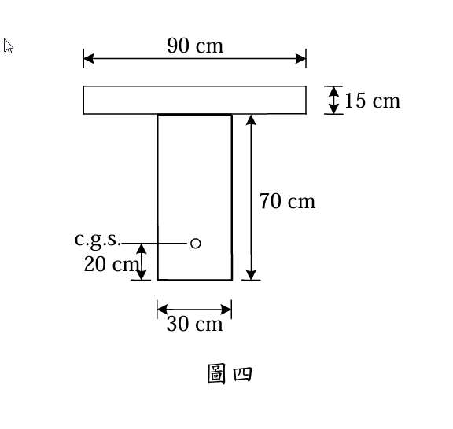

### 考題編號：RC-2008-4

**主分類：** `RC-U4-1` 預力梁斷面應力分析
**副分類：** `RC-U4-2` 預力量與偏心量設計
**設計法：** WSD工作應力法
**標籤：** `後拉法` `組合T型斷面` `兩階段應力疊加` `非組合梁承受DL` `組合梁承受LL` `底纖維拉力控制` `容許應力設計` `不同f'c轉換`

---

## 1. 原始題目重述 (Problem Restatement)

簡支預力梁（跨度 15 m），先架設梁（承受梁自重），再澆置 15 cm 厚樓版（非組合階段承受版DL），版硬化後形成組合斷面，於版上施加均布活載重 $w_{LL}$，求最大 $w_{LL}$。

**已知條件：**

| 項目 | 數值 |
|------|------|
| 跨度 $L$ | 15 m = 1500 cm |
| 梁斷面 | $b_1=30$ cm，$h_1=70$ cm |
| 版斷面（組合後）| 寬 90 cm，厚 15 cm |
| 梁 $f'_{c1}$ | $350 \text{ kgf/cm}^2$ |
| 版 $f'_{c2}$ | $280 \text{ kgf/cm}^2$ |
| 有效預力 $P_e$（損失後）| $200 \text{ tf} = 200{,}000 \text{ kgf}$ |
| c.g.s. 位置 | 距梁底 20 cm |
| 壓應力上限 | $0.45 f'_c$（梁及版各自適用）|
| 張應力 | 不允許（任何混凝土）|

**題目附圖：**

*圖說：跨中斷面。版寬 90 cm，厚 15 cm（$f'_{c2}=280$ kgf/cm²）；梁寬 30 cm，梁深 70 cm（$f'_{c1}=350$ kgf/cm²）；總高 85 cm。c.g.s. 距梁底 20 cm，梁自重偏心距 $e=35-20=15$ cm（c.g.s. 在形心下方）。$P_e=200$ tf，$L=15$ m。*

---

## 2. 考題核心精神與出題者意圖 (Core Concepts & Examiner's Intent)

**核心觀念：** 施工順序決定各載重的作用斷面：
- **非組合階段**（Stage 1）：預力 + 梁自重 + **版DL**（版尚未硬化，梁單獨承擔）→ 以**梁斷面**計算應力
- **組合階段**（Stage 2）：版硬化後，活載重 → 以**組合轉換斷面**計算增量應力

最大 $w_{LL}$ 由**底纖維不可受拉**控制（Stage 1 底部壓力被 Stage 2 LL 拉力抵消）

**出題者測驗能力：**
1. 正確判斷施工順序：**版DL 在非組合階段承受**（最常見陷阱）
2. 計算不同 $f'_c$ 的組合轉換斷面（$n = \sqrt{f'_{c2}/f'_{c1}}$）
3. 疊加兩階段應力並找出控制條件

---

## 3. 解題戰略地圖與陷阱分析 (Strategic Roadmap & Trap Analysis)

**作戰順序：**

| 階段 | 載重 | 作用斷面 | 目的 |
|------|------|---------|------|
| Stage 1 | $P_e$ + 梁 SW + 版 DL | 非組合梁斷面 | 求 $f_{1,bot}$, $f_{1,top}$ |
| Stage 2 | $w_{LL}$ | 組合轉換斷面 | 求增量 $\Delta f_{2,bot}$ |
| 控制條件 | $f_{1,bot} + \Delta f_{2,bot} \geq 0$（不拉） | — | 反推 $w_{LL,max}$ |

**四大陷阱：**

| 陷阱 | 說明 |
|------|------|
| ⚠ 版DL 作用在非組合梁 | 澆置版時版尚未硬化，版自重由梁單獨承受（不是組合斷面）|
| ⚠ 偏心距定義 | $e = $ 非組合梁形心 $-$ c.g.s. $= 35-20=15$ cm（c.g.s.在形心下方）|
| ⚠ 不同 $f'_c$ 的轉換 | 組合斷面需用 $n=\sqrt{280/350}=0.894$，將版寬折減為轉換版寬 |
| ⚠ 版在組合前應力為零 | 版的初始應力為 0；只有 Stage 2 的 $w_{LL}$ 使版受壓 |

---

## 3.5 變數層次分析 (Variable Hierarchy Analysis)

> 複習提示：第一次解題後，在每個卡住的知識點旁標記 `⚠`；第二次複習時只看有 `⚠` 的項目。

### 最終目標
`以兩階段應力疊加，找底纖維不受拉條件，反推最大均布活載重 w_LL`

### 本題關鍵公式（依計算順序）

$$\text{Step 1: } e = \frac{h_1}{2} - 20 \text{ cm}, \quad S_{b1} = S_{t1} = \frac{I_1}{h_1/2}$$

$$\text{Step 2 (Stage 1): } f_{1,bot} = -\frac{P_e}{A_1} - \frac{P_e \cdot e}{S_{b1}} + \frac{M_{DL}}{S_{b1}}$$

$$\text{Step 3: } n = \sqrt{\frac{f'_{c2}}{f'_{c1}}}, \quad b'_{slab} = 90 \times n, \quad \bar{y} = \frac{\sum A_i y_i}{\sum A_i}$$

$$\text{Step 4: } I_c = I_1 + A_1(\bar{y}-y_1)^2 + I_{slab}' + A_{slab}'(\bar{y}-y_2)^2$$

$$\text{Step 5 (控制條件): } f_{1,bot} + \frac{M_{LL} \cdot \bar{y}}{I_c} \leq 0 \Rightarrow M_{LL,max} = |f_{1,bot}| \cdot \frac{I_c}{\bar{y}}$$

$$\text{Step 6: } w_{LL,max} = \frac{8 M_{LL,max}}{L^2}$$

### L1：題目直接給定

| 符號 | 數值 | 說明 |
|------|------|------|
| $L$ | 1500 cm | 跨度 |
| $b_1, h_1$ | 30, 70 cm | 梁斷面 |
| $b_{slab}, t_{slab}$ | 90, 15 cm | 版外輪廓 |
| $f'_{c1}$ | 350 kgf/cm² | 梁混凝土 |
| $f'_{c2}$ | 280 kgf/cm² | 版混凝土 |
| $P_e$ | 200,000 kgf | 有效預力 |
| c.g.s. | 距梁底 20 cm | 預力鋼腱中心 |

### L2：需知識點推導

**Step 1：非組合梁斷面**

| 符號 | 公式/來源 | 卡關? |
|------|----------|:-----:|
| $e$ | $35-20=15$ cm | |
| $A_1$ | $30\times70=2100$ cm² | |
| $I_1$ | $30\times70^3/12=857{,}500$ cm⁴ | |
| $S_{b1}=S_{t1}$ | $857{,}500/35=24{,}500$ cm³ | |

**Step 2：Stage 1 各載重**

| 符號 | 公式/來源 | 卡關? |
|------|----------|:-----:|
| $w_{SW}$ | $2400\times0.30\times0.70=504$ kgf/m = 5.04 kgf/cm | |
| $w_{slab}$ | $2400\times0.90\times0.15=324$ kgf/m = 3.24 kgf/cm | |
| $w_{DL}$ | $5.04+3.24=8.28$ kgf/cm（全作用於非組合梁）| |
| $M_{DL}$ | $8.28\times1500^2/8=2{,}328{,}750$ kgf·cm | |

**Step 3：Stage 1 底/頂纖維應力**

| 符號 | 公式/來源 | 卡關? |
|------|----------|:-----:|
| $f_{1,bot}$ | $-95.24-122.45+95.05=-122.6$ kgf/cm²（壓）| |
| $f_{1,top}$ | $-95.24+122.45-95.05=-67.8$ kgf/cm²（壓）| |

**Step 4：組合轉換斷面**

| 符號 | 公式/來源 | 卡關? |
|------|----------|:-----:|
| $n$ | $\sqrt{280/350}=0.8944$ | |
| $b'_{slab}$ | $90\times0.8944=80.50$ cm | |
| $A_{slab}'$ | $80.50\times15=1207.5$ cm² | |
| $\bar{y}$ | $(2100\times35+1207.5\times77.5)/(2100+1207.5)=50.52$ cm | |
| $I_c$ | $2{,}265{,}000$ cm⁴ | |
| $S_{cb}$ | $I_c/\bar{y}=44{,}840$ cm³ | |

**Step 5：控制條件 → w_LL**

| 符號 | 公式/來源 | 卡關? |
|------|----------|:-----:|
| $M_{LL,max}$ | $122.6\times44{,}840=5{,}497{,}600$ kgf·cm | |
| $w_{LL,max}$ | $8\times5{,}497{,}600/1500^2=19.55$ kgf/cm = **1955 kgf/m** | |

### L3：深層知識（不懂就卡住）

| 知識點 | 說明 | 卡關? |
|--------|------|:-----:|
| 版DL 在哪個斷面承擔？ | 版尚未硬化時是液態，梁獨自承受其重量（非組合）| |
| 不同 $f'_c$ 的轉換 | 取梁混凝土為基準，版寬 × $n=\sqrt{f'_{c2}/f'_{c1}}$ → 折減 | |
| 為何底纖維控制？ | Stage 1 壓力（預力）+ Stage 2 拉力（LL）= 越加越少，最終歸零 | |
| 版的初始應力 | 版硬化時已有版自重彎矩（但作用在非組合梁上，版本身不受彎）→ 版初始應力為 0 | |

---

## 4. 步驟化詳細計算過程 (Step-by-Step Detailed Calculation)

### Step 1：非組合梁斷面性質

$$A_1 = 30 \times 70 = 2100 \text{ cm}^2$$

$$I_1 = \frac{30 \times 70^3}{12} = \frac{30 \times 343{,}000}{12} = 857{,}500 \text{ cm}^4$$

$$S_{b1} = S_{t1} = \frac{857{,}500}{35} = 24{,}500 \text{ cm}^3 \quad (\text{對稱斷面})$$

偏心距（c.g.s. 在形心下方）：
$$e = \frac{h_1}{2} - 20 = 35 - 20 = 15 \text{ cm}$$

---

### Step 2：Stage 1 各載重（作用於非組合梁）

施工順序：① 梁架設（梁 SW 即刻起作用）→ ② 版澆置（版尚未硬化，版 DL 由梁獨自承擔）

**梁自重：**
$$w_{SW} = 2400 \times 0.30 \times 0.70 = 504 \text{ kgf/m} = 5.04 \text{ kgf/cm}$$

**版自重（澆置時作用於非組合梁）：**
$$w_{slab} = 2400 \times 0.90 \times 0.15 = 324 \text{ kgf/m} = 3.24 \text{ kgf/cm}$$

**Stage 1 總死載重：**
$$w_{DL} = 5.04 + 3.24 = 8.28 \text{ kgf/cm}$$

$$M_{DL} = \frac{w_{DL} L^2}{8} = \frac{8.28 \times 1500^2}{8} = 8.28 \times 281{,}250 = 2{,}328{,}750 \text{ kgf·cm}$$

---

### Step 3：Stage 1 跨中應力（預力 + 全部DL，作用於非組合梁）

**預力各項：**
$$\frac{P_e}{A_1} = \frac{200{,}000}{2100} = 95.24 \text{ kgf/cm}^2$$

$$\frac{P_e \cdot e}{S_{b1}} = \frac{200{,}000 \times 15}{24{,}500} = \frac{3{,}000{,}000}{24{,}500} = 122.45 \text{ kgf/cm}^2$$

$$\frac{M_{DL}}{S_{b1}} = \frac{2{,}328{,}750}{24{,}500} = 95.05 \text{ kgf/cm}^2$$

**底纖維（非組合梁）：**
$$f_{1,bot} = -\frac{P_e}{A_1} - \frac{P_e e}{S_{b1}} + \frac{M_{DL}}{S_{b1}}$$
$$= -95.24 - 122.45 + 95.05 = \boxed{-122.64 \text{ kgf/cm}^2} \quad (\text{壓縮})$$

**頂纖維（非組合梁）：**
$$f_{1,top} = -\frac{P_e}{A_1} + \frac{P_e e}{S_{t1}} - \frac{M_{DL}}{S_{t1}}$$
$$= -95.24 + 122.45 - 95.05 = \boxed{-67.84 \text{ kgf/cm}^2} \quad (\text{壓縮})$$

**驗算 Stage 1 限制：**
- 底纖維：$|-122.64| < 0.45 \times 350 = 157.5$ kgf/cm² ✓
- 頂纖維：$|-67.84| < 157.5$ kgf/cm²，無張應力 ✓

---

### Step 4：組合轉換斷面性質（版硬化後）

取**梁混凝土**為基準，將版轉換為等效梁材料：

$$n = \sqrt{\frac{f'_{c2}}{f'_{c1}}} = \sqrt{\frac{280}{350}} = \sqrt{0.8} = \boxed{0.8944}$$

轉換版寬：
$$b'_{slab} = 90 \times 0.8944 = 80.50 \text{ cm}$$

各子面積（從梁底量起）：

| 子斷面 | 面積 $A_i$ | 形心 $y_i$（梁底起）|
|--------|-----------|---------|
| 梁（30×70）| 2100 cm² | 35 cm |
| 轉換版（80.50×15）| 1207.5 cm² | 77.5 cm（= 70+7.5）|
| **合計** | **3307.5 cm²** | — |

**組合形心（從梁底量起）：**
$$\bar{y} = \frac{2100 \times 35 + 1207.5 \times 77.5}{3307.5} = \frac{73{,}500 + 93{,}581}{3307.5} = \frac{167{,}081}{3307.5} = \boxed{50.52 \text{ cm}}$$

各子斷面到組合形心之距離：
- 梁形心距：$d_1 = 50.52 - 35 = 15.52$ cm
- 版形心距：$d_2 = 77.5 - 50.52 = 26.98$ cm

**組合斷面慣性矩：**
$$I_c = \left[\frac{30 \times 70^3}{12} + 2100 \times 15.52^2\right] + \left[\frac{80.50 \times 15^3}{12} + 1207.5 \times 26.98^2\right]$$

$$= \left[857{,}500 + 2100 \times 240.87\right] + \left[22{,}641 + 1207.5 \times 728.52\right]$$

$$= \left[857{,}500 + 505{,}827\right] + \left[22{,}641 + 879{,}768\right]$$

$$= 1{,}363{,}327 + 902{,}409 = \boxed{2{,}265{,}736 \text{ cm}^4}$$

**梁底纖維截面模數（組合斷面）：**
$$S_{cb} = \frac{I_c}{\bar{y}} = \frac{2{,}265{,}736}{50.52} = \boxed{44{,}849 \text{ cm}^3}$$

---

### Step 5：控制條件分析（Stage 2 活載重）

活載重 $w_{LL}$ 作用於組合斷面，跨中正彎矩使底纖維增加**拉力**：

$$\Delta f_{2,bot} = +\frac{M_{LL}}{\; S_{cb}} = +\frac{M_{LL}}{44{,}849} \quad (\text{拉力，正值})$$

**四個應力條件列表：**

| 位置 | Stage 1 應力 | Stage 2 增量 | 控制式 |
|------|------------|------------|--------|
| 梁底（不可拉）| $-122.64$ | $+M_{LL}/44{,}849$ | $M_{LL} \leq 122.64 \times 44{,}849 = 5{,}498{,}900$ kgf·cm **← 控制** |
| 梁底（壓力限）| $-122.64$ | $+M_{LL}/44{,}849$ | 自動滿足（LL 減少壓力）|
| 梁頂（壓力限）| $-67.84$ | $-M_{LL}/116{,}311$ | $M_{LL} \leq 89.66 \times 116{,}311 = 10{,}427{,}300$ kgf·cm |
| 版頂（壓力限）| $0$ | $-M_{LL} \times n/65{,}741$ | $M_{LL} \leq 126 \times 65{,}741/0.8944 = 9{,}261{,}700$ kgf·cm |

> 梁頂截面模數：$S_{ct,beam} = I_c/(70-\bar{y}) = 2{,}265{,}736/19.48 = 116{,}311$ cm³  
> 版頂截面模數（轉換）：$S_{ct,slab} = I_c/(85-\bar{y}) = 2{,}265{,}736/34.48 = 65{,}741$ cm³

**最嚴格控制條件：梁底不可受拉，$M_{LL,max} = 5{,}498{,}900$ kgf·cm**

---

### Step 6：最大均布活載重

$$M_{LL,max} = \frac{w_{LL,max} \cdot L^2}{8} = 5{,}498{,}900 \text{ kgf·cm}$$

$$w_{LL,max} = \frac{8 \times 5{,}498{,}900}{1500^2} = \frac{43{,}991{,}200}{2{,}250{,}000} = 19.55 \text{ kgf/cm}$$

$$\boxed{w_{LL,max} = 1955 \text{ kgf/m} \approx 1.955 \text{ tf/m}}$$

**驗算各控制點應力（以 $M_{LL} = 5{,}498{,}900$ kgf·cm 代入）：**

| 位置 | Stage 1 | Stage 2 增量 | 總應力 | 限制 | 判斷 |
|------|---------|------------|--------|------|------|
| 梁底纖維 | $-122.6$ | $+122.6$ | $0$ kgf/cm² | $\geq 0$（不拉）| ✓ |
| 梁頂纖維 | $-67.8$ | $-47.3$ | $-115.1$ kgf/cm² | $\geq -157.5$ | ✓ |
| 版頂纖維 | $0$ | $-74.9 \times n = -67.0$ | $-67.0$ kgf/cm² | $\geq -126$ | ✓ |

---

## 5. 關鍵爭議點與進階探討 (Critical Issues & Advanced Discussion)

### 爭議：版DL 在哪個斷面作用？

這是最關鍵的判斷。實際施工順序：
- 梁先架設（梁自重 → 非組合梁）
- 版澆置時，版的混凝土是流動狀態，**梁獨自承受版重**（非組合）
- 版硬化後形成組合斷面，後續活載重才在組合斷面上作用

若誤將版 DL 放在組合斷面：$M_{DL,stage1}$ 只有梁 SW = 1,417,500 kgf·cm，則：
$$f_{1,bot} = -95.24 - 122.45 + 57.86 = -159.83 \text{ kgf/cm}^2 > 157.5 \text{ kgf/cm}^2$$
超過允許壓應力，說明此解釋不正確。**版 DL 必須在非組合階段計算。**

### 簡化：是否需要模數比 $n$？

本題兩種混凝土 $f'_c$ 相差 20%（350 vs 280），若取 $n=1$：
- 轉換版寬 = 90 cm（不折減）
- $\bar{y} = 51.63$ cm，$I_c = 2{,}367{,}000$ cm⁴，$S_{cb} = 45{,}840$ cm³
- $M_{LL,max} = 122.64 \times 45{,}840 = 5{,}623{,}000$ kgf·cm
- $w_{LL,max} = 8 \times 5{,}623{,}000/2{,}250{,}000 = 19.99 \approx 2.00$ tf/m

正確使用 $n=0.894$ 時答案為 1.955 tf/m，與 $n=1$ 的 2.00 tf/m 相差約 2.3%。嚴格解題應使用 $n$。

### 版底纖維應力驗算

版底（梁頂）位於組合形心上方 19.48 cm：
$$f_{slab,bot} = -\frac{M_{LL} \times 19.48}{I_c} \times n = -\frac{5{,}498{,}900 \times 19.48}{2{,}265{,}736} \times 0.8944 = -42.3 \text{ kgf/cm}^2$$

$|-42.3| < 0.45 \times 280 = 126$ kgf/cm² ✓，版底（界面）應力亦合格。
