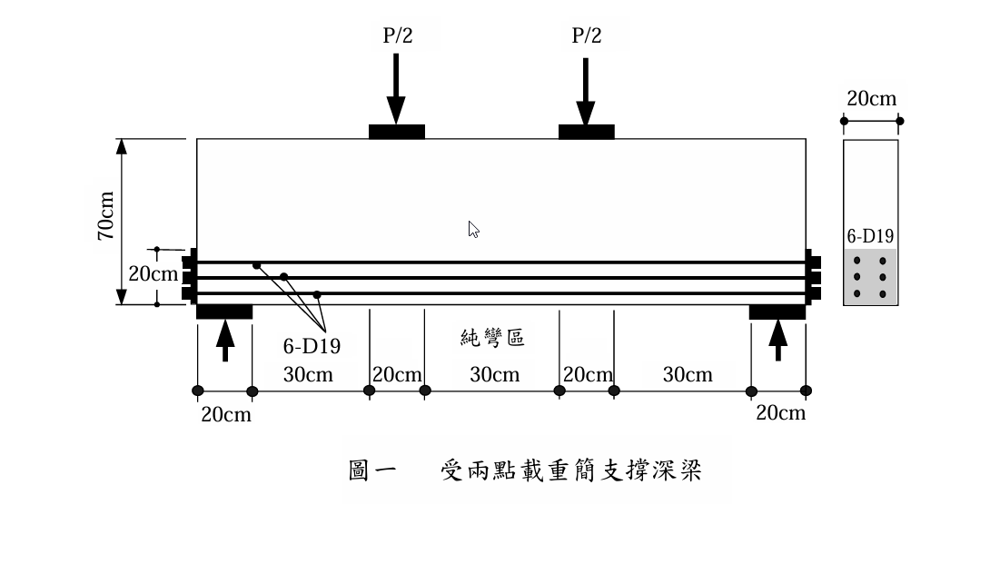

# 考題編號：RC-2009-3

**主分類：** `RC-U2-1` RC 剪力強度分析與設計  
**副分類：** 無  
**設計法：** USD 強度設計法（STM 壓拉桿模式）  
**標籤：** `壓拉桿模式` `STM` `深梁` `兩點載重` `拉力桿` `壓力桿` `節點強度` `CCT節點` `CCC節點` `βs` `βn` `瓶形壓桿` `破壞模式`

---

## 1. 原始題目重述 (Problem Restatement)

以**壓拉桿模式（STM）**預估圖一受兩點載重簡支深梁之最大載重 $P$ 及可能破壞模式。

*圖說：簡支深梁，梁寬 $b=20$ cm，梁高 $h=70$ cm；兩點載重 $P/2$ 各距支承 $a=30$ cm，兩載重間純彎區 20 cm；6-D19 底部縱向鋼筋（拉力桿）；承壓鈑尺寸 $l_b = 20$ cm；梁配有符合 ACI 規範之水平與垂直腹筋。*

**材料：** $f'_c = 250$ kgf/cm²，$f_y = 4200$ kgf/cm²，$A_{s,D19} = 2.87$ cm²  
**假設：** 純彎區水平壓桿寬 = 20 cm；$\phi = 1.0$（不考慮強度折減）

---

## 2. 考題核心精神與出題者意圖 (Core Concepts & Examiner's Intent)

**核心觀念：**
- 深梁（$a/d \ll 2$）不滿足平截面假設，傳力路徑以壓拉桿模式描述
- STM 三要素：**壓力桿**（Struts）、**拉力桿**（Ties）、**節點**（Nodes）
- 各要素強度限制，最小者決定最大載重

**出題者意圖：**
1. 測驗 STM 幾何建立（力臂 $z$、桿件角度）
2. 測驗壓力桿有效強度（$\beta_s$ 係數）
3. 測驗節點強度（$\beta_n$ 係數：CCC vs CCT）
4. 推論破壞模式（脆性 vs 延性）

---

## 3. 解題戰略地圖與陷阱分析 (Strategic Roadmap & Trap Analysis)

**作戰計畫：**
1. 建立 STM 幾何（確定力臂 $z$，計算角度 $\theta$）
2. 計算各桿件力（用平衡）
3. 計算各限制強度（拉力桿、壓力桿、節點）
4. 取最小值，確認破壞模式

**關鍵陷阱：**

| 陷阱 | 說明 | 應對 |
|------|------|------|
| ❶ $\beta_s$ 選用錯誤 | 瓶形壓桿 $\beta_s=0.75$（有腹筋），純彎區棱柱壓桿 $\beta_s=1.0$ | 按桿件類型選取 |
| ❷ $\beta_n$ CCT vs CCC | CCT 節點（一條拉桿）$\beta_n=0.80$；CCC（全壓）$\beta_n=1.0$ | 支承為 CCT，載重點為 CCC |
| ❸ 節點受力面分別驗核 | CCT 節點需驗核**承壓面**、**壓桿面**和**拉桿面** | 分面計算 |
| ❹ STM 桿件角度 ≥ 25° | ACI 要求壓桿與拉桿夾角 ≥ 25° | 驗核 $\theta$ |

---

## 3.5 變數層次分析 (Variable Hierarchy Analysis)

### 最終目標

用 STM 求深梁最大載重 $P_{max}$ 並說明可能破壞模式。

### 本題關鍵公式

$$\text{幾何：} z = h - \frac{h_c}{2} - e_t,\quad \tan\theta = \frac{z}{a}$$

$$\text{桿件力：} T = \frac{P}{2}\cot\theta = \frac{P}{2}\cdot\frac{a}{z},\quad F_{diag} = \frac{P/2}{\sin\theta}$$

$$\text{壓桿強度：} F_{ns} = f_{ce}\cdot A_{cs},\quad f_{ce} = 0.85\,\beta_s\,f'_c$$

$$\text{節點強度：} \sigma_{face} \le 0.85\,\beta_n\,f'_c$$

### L1：題目直接給定

| 符號 | 數值 | 說明 |
|------|------|------|
| $h$ | 70 cm | 梁高 |
| $b$ | 20 cm | 梁寬 |
| $a$ | 30 cm | 剪力跨（支承至載重） |
| 純彎區壓桿寬 $h_c$ | 20 cm | 水平壓桿高度 |
| 承壓鈑 $l_b$ | 20 cm | 支承及載重點承壓板寬 |
| 6-D19 | As = 17.22 cm² | 拉力桿總面積 |
| $f'_c$ | 250 kgf/cm² | |
| $f_y$ | 4200 kgf/cm² | |

### L2：需知識點推導

| 符號 | 計算 | 卡關? |
|------|------|-------|
| $e_t$（拉力桿偏心） | 鋼筋形心距底 ≈ 10 cm → 節點高 $h_t = 20$ cm | |
| $z$ | $70 - 10 - 10 = 50$ cm | |
| $\theta$ | $\arctan(50/30) = 59°$ | |
| $T$（拉力桿力） | $(P/2)\times(30/50) = 0.3P$ | |
| $F_{diag}$ | $(P/2)/\sin59° = 0.583P$ | |
| CCT 節點 $\beta_n$ | 0.80 | |
| 瓶形壓桿 $\beta_s$ | 0.75（有腹筋滿足 ACI） | |

### L3：深層知識（不懂就卡住）

| 知識點 | 說明 | 卡關? |
|--------|------|-------|
| 瓶形壓桿 (bottle-shaped) | 壓應力場橫向擴展（像瓶頸），產生橫向拉力，需腹筋防止開裂 | |
| CCT 節點高度 = $2e_t$ | 節點邊界由拉力桿中心到底面的兩倍距離確定 | |
| 壓桿寬度 = 幾何投影 | $w_s = l_b\sin\theta + h_{node}\cos\theta$ | |
| 最小桿件角度 25° | ACI STM 要求壓桿與拉桿夾角 ≥ 25°，防止混凝土劈裂失效 | |

---

## 4. 步驟化詳細計算過程 (Step-by-Step Detailed Calculation)

### Step 1：STM 幾何建立

**深梁幾何：**

| 元素 | 位置 | 說明 |
|------|------|------|
| 水平壓桿（頂） | 中心在頂部 $h_c/2 = 10$ cm 處 | 純彎區水平壓桿 |
| 拉力桿（底） | 6-D19 形心距底 $e_t \approx 10$ cm | CCT 節點高 $h_t = 20$ cm |
| 力臂 | $z = 70 - 10 - 10 = 50$ cm | |
| 剪力跨 | $a = 30$ cm | 支承至載重 |

**壓桿角度（符合 ACI ≥ 25°）：**

$$\tan\theta = \frac{z}{a} = \frac{50}{30} = \frac{5}{3} \Rightarrow \theta = 59°$$

$$\sin\theta = \frac{5}{\sqrt{34}} = 0.857,\quad \cos\theta = \frac{3}{\sqrt{34}} = 0.514 \quad \checkmark\ (59° > 25°)$$

---

### Step 2：各桿件力（以 $P$ 表示）

對稱條件：每個支承反力 = $P/2$

| 桿件 | 力 | 推導 |
|------|-----|------|
| 拉力桿（水平） | $T = 0.3P$ | $(P/2)\times(a/z) = (P/2)\times(30/50)$ |
| 對角斜壓桿 | $F_{diag} = 0.583P$ | $(P/2)/\sin59° = (P/2)/0.857$ |
| 純彎區水平壓桿 | $C = T = 0.3P$ | 水平平衡 |

驗核：$\sqrt{T^2 + R^2} = P\sqrt{0.09+0.25} = P\sqrt{0.34} = 0.583P$ ✓

---

### Step 3：拉力桿強度限制

$$T_{cap} = A_s\,f_y = 6\times2.87\times4200 = 17.22\times4200 = 72{,}324 \text{ kgf}$$

$$0.3P \le 72{,}324 \Rightarrow \boxed{P \le 241{,}080 \text{ kgf} = 241 \text{ tf}}$$

---

### Step 4：純彎區水平壓桿強度限制

純彎區壓桿為**棱柱形壓桿**（均勻壓縮，無橫向拉力），$\beta_s = 1.0$：

$$f_{ce} = 0.85\times\beta_s\times f'_c = 0.85\times1.0\times250 = 212.5 \text{ kgf/cm}^2$$

壓桿截面積：$A_{cs} = h_c\times b = 20\times20 = 400$ cm²

$$C\le f_{ce}\times A_{cs} = 212.5\times400 = 85{,}000 \text{ kgf}$$

$$0.3P \le 85{,}000 \Rightarrow \boxed{P \le 283{,}333 \text{ kgf} = 283 \text{ tf}}$$

---

### Step 5：斜向壓桿（瓶形）強度限制

斜向壓桿為**瓶形壓桿**（有腹筋符合 ACI），$\beta_s = 0.75$：

$$f_{ce} = 0.85\times0.75\times250 = 159.4 \text{ kgf/cm}^2$$

**壓桿寬度（在支承節點處）：**

$$w_s = l_b\sin\theta + h_t\cos\theta = 20\times0.857 + 20\times0.514 = 17.14 + 10.28 = 27.4 \text{ cm}$$

壓桿截面積：$A_{cs} = w_s\times b = 27.4\times20 = 548$ cm²

$$F_{diag} \le f_{ce}\times A_{cs} = 159.4\times548 = 87{,}351 \text{ kgf}$$

$$0.583P \le 87{,}351 \Rightarrow \boxed{P \le 149{,}831 \text{ kgf} \approx 150 \text{ tf}}$$

---

### Step 6：節點強度限制

**支承節點（CCT節點：一條拉桿）：**

$$f_{ce,CCT} = 0.85\times\beta_n\times f'_c = 0.85\times0.80\times250 = 170 \text{ kgf/cm}^2$$

承壓面（支承反力面）：$A = l_b\times b = 20\times20 = 400$ cm²

$$\sigma_{bearing} = \frac{P/2}{400} \le 170$$

$$\boxed{P \le 2\times170\times400 = 136{,}000 \text{ kgf} = 136 \text{ tf}} \quad \leftarrow \text{最嚴格}$$

拉桿面（水平）：$A = 20\times20 = 400$ cm²
$$T/(400) = 0.3P/400 \le 170 \Rightarrow P \le 226{,}667 \text{ kgf} \quad \checkmark$$

斜壓桿面：$A = w_s\times b = 548$ cm²
$$F_{diag}/548 = 0.583P/548 \le 170 \Rightarrow P \le 159{,}862 \text{ kgf} \quad \checkmark$$

---

**載重點節點（CCC節點：全為壓力）：**

$$f_{ce,CCC} = 0.85\times1.0\times250 = 212.5 \text{ kgf/cm}^2$$

載重承壓面：$A = 20\times20 = 400$ cm²
$$P/2/400 \le 212.5 \Rightarrow P \le 170{,}000 \text{ kgf} = 170 \text{ tf} \quad \checkmark$$

---

### Step 7：彙整與最大載重

| 限制條件 | 最大 $P$ | 備註 |
|---------|---------|------|
| 拉力桿降伏 | 241 tf | 延性破壞 |
| 純彎區水平壓桿 | 283 tf | $\beta_s=1.0$ |
| 斜向壓桿（瓶形） | 150 tf | $\beta_s=0.75$ |
| **CCT 節點承壓面** | **136 tf** | **← 控制** |
| CCC 節點承壓面 | 170 tf | |

$$\boxed{P_{max} = 136 \text{ tf（由 CCT 節點承壓強度控制）}}$$

---

### Step 8：可能破壞模式

依強度由低至高：

1. **支承節點（CCT）承壓破壞** → P = 136 tf → **脆性破壞（最先發生）**
   - 承壓鈑下方混凝土被壓碎
   - 無明顯預警，突然脆斷

2. **斜向壓桿劈裂/壓碎** → P = 150 tf
   - 瓶形壓桿因橫向拉力產生斜裂縫
   - 腹筋抑制發展，但強度仍低

3. **拉力桿鋼筋降伏** → P = 241 tf
   - 6-D19 底筋屈服（最延性）
   - 但受前兩種模式限制，此破壞不會率先發生

**改善建議：** 加大承壓鈑尺寸（延遲節點破壞），使破壞模式轉為拉力桿降伏（延性）。

---

## 5. 關鍵爭議點與進階探討 (Critical Issues & Advanced Discussion)

**① 為何 CCT 節點比 CCC 節點弱？**

| 節點類型 | $\beta_n$ | $f_{ce}$ (kgf/cm²) |
|---------|-----------|-------------------|
| CCC（全壓，無拉桿） | 1.00 | 212.5 |
| CCT（含一條拉桿） | 0.80 | 170 |
| CTT（含兩條拉桿） | 0.60 | 127.5 |

拉桿在節點內產生分裂拉力，降低節點有效壓力強度。

**② 瓶形壓桿的物理意義**

瓶形壓桿（bottle-shaped strut）中，壓應力場在傳遞過程中橫向擴展，產生橫向拉力（垂直於壓桿方向）。若無腹筋，這種橫向拉力可能使壓桿沿中央劈裂。有腹筋（ACI 規定的最小水平/垂直腹筋）時，可使用 $\beta_s = 0.75$；否則只能取 $\beta_s = 0.60$。

**③ $a/d$ 比值判斷深梁**

$a/d \approx 30/60 = 0.5 < 2$（深梁區域），滿足使用 STM 的條件。

若 $a/d > 2$（細長梁），則彎矩公式（Whitney 應力塊）更適用。

**④ 考場重點：三種限制都要算**

| 桿件/節點 | $\beta$ | 面積 | 受力 | 上限P |
|---------|---------|------|------|------|
| 拉力桿 | fy | 17.22 cm² | 0.3P | 241 tf |
| 水平壓桿 | βs=1.0 | 400 cm² | 0.3P | 283 tf |
| 斜壓桿 | βs=0.75 | 548 cm² | 0.583P | 150 tf |
| CCT節點 | βn=0.80 | 400 cm² | P/2 | **136 tf** ✓ |
