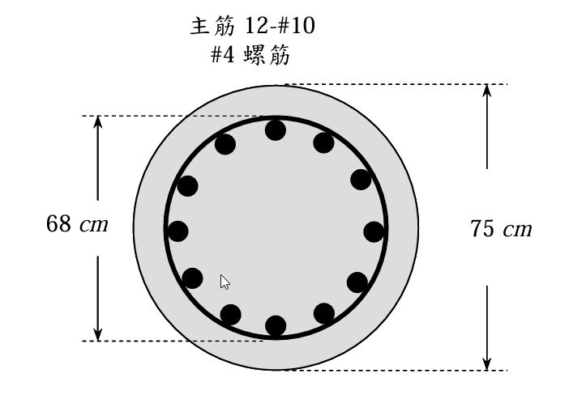

# 考題編號：RC-2010-1

**主分類：** `RC-U1-2` RC 柱強度分析與設計  
**副分類：** 無  
**設計法：** USD 強度設計法  
**標籤：** `圓形螺旋柱` `降伏軸力` `極限軸力` `螺旋筋圍束` `圍束混凝土強度` `ρs最小值` `f'cc` `fL側向圍束壓力` `Pu≥Py檢核` `12根主筋`

---

## 1. 原始題目重述 (Problem Restatement)

檢核圓形 RC 螺旋柱（`RC-2010-1-fig-1.png`）所能承受之**降伏軸力 $P_y$** 與**極限軸力 $P_u$**：

*圖說：圓形柱全斷面外徑 $D = 75$ cm；螺旋筋外徑（外緣至外緣）$D_c = 68$ cm；主筋 12-#10 環排；橫向螺旋筋 #4 @ $s = 10$ cm（由圖讀取）。*

**材料：** $f'_c = 350$ kgf/cm²，$f_y = 4200$ kgf/cm²  
**鋼筋面積：** #4（螺筋）$A_{sp} = 1.27$ cm²；#10（主筋）$A_s = 8.17$ cm²（40 分）

---

## 2. 考題核心精神與出題者意圖 (Core Concepts & Examiner's Intent)

**核心觀念：** 螺旋柱的延性機制：
- **$P_y$（降伏/蓋層破壞）**：外圍蓋層混凝土達到極限應變後開始剝落，以全斷面計算
- **$P_u$（圍束極限）**：蓋層脫落後，螺旋筋提供側向圍束壓力 $f_L$，使核心混凝土強度提升至 $f'_{cc}$
- 設計要求：$P_u \ge P_y$（螺旋筋補償蓋層損失），等效 $\rho_s \ge \rho_{s,\min}$

**出題者意圖：**
1. 測驗兩個不同強度（蓋層 vs. 圍束核心）的物理意義
2. 測驗螺旋筋體積比 $\rho_s$ 的計算及最小值檢核
3. 測驗圍束強度 $f'_{cc}$ 的計算

---

## 3. 解題戰略地圖與陷阱分析 (Strategic Roadmap & Trap Analysis)

**作戰計畫：**
1. 計算各斷面幾何（$A_g$、$A_{ch}$、$A_{st}$）
2. 計算 $P_y$（全斷面，用 $0.85f'_c$）
3. 計算 $\rho_s$，與 $\rho_{s,\min}$ 比較
4. 計算 $f_L$、$f'_{cc}$、$P_u$（核心斷面）
5. 比較 $P_u$ vs $P_y$，作出結論

**關鍵陷阱：**

| 陷阱 | 說明 | 應對 |
|------|------|------|
| ❶ $D_c$ 是外緣到外緣，$D_{c,cc}$ 才是中心到中心 | $\rho_s$ 公式用**中心到中心**直徑 | $D_{c,cc} = D_c - d_b = 68 - 1.27 = 66.73$ cm |
| ❷ $A_{ch}$ 定義以螺旋筋外緣圍成面積 | $A_{ch} = \pi(D_c/2)^2$，非中心到中心圍成面積 | $A_{ch} = \pi \times 34^2$ |
| ❸ $P_y$ 用 $0.85f'_c$，非 $f'_c$ | ACI 公式採等效矩形應力分布（Whitney 概念延伸） | $P_y = 0.85f'_c(A_g - A_{st}) + f_y A_{st}$ |
| ❹ $P_u$ 是核心面積乘以圍束強度，不含蓋層 | 蓋層已假設剝落，不貢獻 $P_u$ | $P_u = f'_{cc}(A_{ch} - A_{st}) + f_y A_{st}$ |

---

## 3.5 變數層次分析 (Variable Hierarchy Analysis)

### 最終目標

計算 $P_y$（蓋層破壞軸力）與 $P_u$（圍束核心軸力），並驗證 $P_u \ge P_y$。

### 本題關鍵公式（依計算順序）

$$\text{Step 1：} A_g = \pi(D/2)^2,\quad A_{ch} = \pi(D_c/2)^2,\quad A_{st} = n \cdot A_{\#10}$$

$$\text{Step 2：} P_y = 0.85f'_c(\boxed{A_g} - \boxed{A_{st}}) + f_y \boxed{A_{st}}$$

$$\text{Step 3：} \rho_s = \frac{4A_{sp}}{D_{c,cc}\cdot s},\quad \rho_{s,\min} = 0.45\!\left(\frac{\boxed{A_g}}{\boxed{A_{ch}}} - 1\right)\!\frac{f'_c}{f_{yt}}$$

$$\text{Step 4：} f_L = \frac{\rho_s \cdot f_{yt}}{2},\quad f'_{cc} = f'_c + 4.1\boxed{f_L}$$

$$\text{Step 5：} P_u = \boxed{f'_{cc}}(\boxed{A_{ch}} - \boxed{A_{st}}) + f_y \boxed{A_{st}}$$

### L1：題目直接給定

| 符號 | 數值 | 說明 |
|------|------|------|
| $D$ | 75 cm | 圓柱全斷面外徑 |
| $D_c$ | 68 cm | 螺旋筋外緣直徑（外到外） |
| $f'_c$ | 350 kgf/cm² | |
| $f_y = f_{yt}$ | 4200 kgf/cm² | |
| $A_{sp}$（#4） | 1.27 cm² | 螺旋筋單根面積 |
| $A_{\#10}$ | 8.17 cm² | 主筋單根面積 |
| $n$（主筋根數） | 12 | |
| $s$（螺旋間距） | 10 cm | 由圖讀取 |

### L2：需知識點推導

**▌ 斷面幾何**

| 符號 | 公式／計算 | 卡關? |
|------|-----------|-------|
| $A_g$ | $\pi(75/2)^2 = \pi\times37.5^2 = 4418$ cm² | |
| $D_{c,cc}$ | $D_c - d_{b,sp} = 68-1.27 = 66.73$ cm | |
| $A_{ch}$ | $\pi(68/2)^2 = \pi\times34^2 = 3632$ cm²（外緣至外緣） | |
| $A_{st}$ | $12\times8.17 = 98.04$ cm² | |

**▌ 螺旋筋比 $\rho_s$**

| 符號 | 公式 | 卡關? |
|------|------|-------|
| $\rho_s$（提供） | $4A_{sp}/(D_{c,cc}\cdot s) = 4\times1.27/(66.73\times10) = 0.00762$ | |
| $\rho_{s,\min}$ | $0.45(A_g/A_{ch}-1)(f'_c/f_{yt}) = 0.45\times0.2165\times0.08333 = 0.00812$ | |

**▌ 圍束強度 $f'_{cc}$ 與 $P_u$**

| 符號 | 公式 | 卡關? |
|------|------|-------|
| $f_L$ | $\rho_s\cdot f_{yt}/2 = 0.00762\times4200/2 = 15.99$ kgf/cm² | |
| $f'_{cc}$ | $f'_c + 4.1f_L = 350+65.6 = 415.6$ kgf/cm² | |
| $P_u$ | $f'_{cc}(A_{ch}-A_{st}) + f_y A_{st}$ | |

### L3：深層知識（不懂就卡住）

| 知識點 | 說明 | 卡關? |
|--------|------|-------|
| $f_L = \rho_s f_{yt}/2$ 的物理意義 | 螺旋筋提供的側向圍束壓力，由薄圓環平衡方程推導 | |
| 螺旋柱 $P_u \ge P_y$ 的設計邏輯 | 蓋層脫落後，圍束使核心強度提升，維持承載力不驟降 | |
| $A_{ch}$ 量到螺旋筋**外緣**，$D_{c,cc}$ 量到螺旋筋**中心** | 兩者用途不同：$A_{ch}$ 計算核心面積，$D_{c,cc}$ 計算 $\rho_s$ | |
| 最小螺旋比 $\rho_{s,\min} = 0.45(A_g/A_{ch}-1)(f'_c/f_{yt})$ 的推導 | 由 $P_u \ge P_y$ 條件推導得，ACI 加入安全裕度（0.45 > 理論值 0.41）| |

---

## 4. 步驟化詳細計算過程 (Step-by-Step Detailed Calculation)

### Step 1：斷面幾何

$$A_g = \pi\left(\frac{75}{2}\right)^2 = \pi\times37.5^2 = \boxed{4417.9 \text{ cm}^2}$$

$$A_{ch} = \pi\left(\frac{68}{2}\right)^2 = \pi\times34^2 = \boxed{3631.7 \text{ cm}^2}$$

$$A_{st} = 12\times8.17 = \boxed{98.04 \text{ cm}^2}$$

$$D_{c,cc} = D_c - d_{b,sp} = 68 - 1.27 = 66.73 \text{ cm}$$

蓋層面積：$A_g - A_{ch} = 4417.9 - 3631.7 = 786.2$ cm²

---

### Step 2：降伏軸力 $P_y$（全斷面）

**定義：** 蓋層混凝土恰達 $f'_c$ 之極限，蓋層開始剝落，以**全斷面**計算：

$$P_y = 0.85f'_c(A_g - A_{st}) + f_y A_{st}$$

$$= 0.85\times350\times(4417.9-98.04) + 4200\times98.04$$

$$= 297.5\times4319.86 + 411{,}768$$

$$= 1{,}285{,}156 + 411{,}768 = 1{,}696{,}924 \text{ kgf}$$

$$\boxed{P_y = 1{,}697 \text{ tf}}$$

---

### Step 3：螺旋筋比 $\rho_s$ 及最小值驗核

**提供的螺旋筋比：**

$$\rho_s = \frac{4A_{sp}}{D_{c,cc}\cdot s} = \frac{4\times1.27}{66.73\times10} = \frac{5.08}{667.3} = 0.00762$$

**ACI 最小螺旋筋比：**

$$\rho_{s,\min} = 0.45\!\left(\frac{A_g}{A_{ch}} - 1\right)\!\frac{f'_c}{f_{yt}} = 0.45\times\!\left(\frac{4417.9}{3631.7}-1\right)\!\times\frac{350}{4200}$$

$$= 0.45\times0.2165\times0.08333 = \boxed{0.00812}$$

**比較：**

$$\rho_s^{\text{provided}} = 0.00762 < \rho_{s,\min} = 0.00812 \quad \Rightarrow \quad \text{❌ 不符 ACI 最小螺旋筋比要求}$$

**需要的最大螺旋間距：**

$$s_{\max} = \frac{4A_{sp}}{\rho_{s,\min}\cdot D_{c,cc}} = \frac{4\times1.27}{0.00812\times66.73} = \frac{5.08}{0.5419} = 9.37 \text{ cm}$$

→ 需採用 $s \le 9.4$ cm（現用 $s = 10$ cm，偏大）

---

### Step 4：圍束混凝土強度 $f'_{cc}$ 與極限軸力 $P_u$

**側向圍束壓力 $f_L$：**

$$f_L = \frac{\rho_s\cdot f_{yt}}{2} = \frac{0.00762\times4200}{2} = \frac{31.99}{2} = 15.99 \text{ kgf/cm}^2$$

**圍束混凝土強度（Richart 公式）：**

$$f'_{cc} = f'_c + 4.1\cdot f_L = 350 + 4.1\times15.99 = 350 + 65.6 = \boxed{415.6 \text{ kgf/cm}^2}$$

**極限軸力 $P_u$（蓋層已剝落，僅核心承載）：**

$$P_u = f'_{cc}(A_{ch} - A_{st}) + f_y A_{st}$$

$$= 415.6\times(3631.7-98.04) + 4200\times98.04$$

$$= 415.6\times3533.66 + 411{,}768$$

$$= 1{,}468{,}386 + 411{,}768 = 1{,}880{,}154 \text{ kgf}$$

$$\boxed{P_u = 1{,}880 \text{ tf}}$$

---

### Step 5：強度檢核彙整

| 項目 | 數值 | 判定 |
|------|------|------|
| 降伏軸力 $P_y$（蓋層臨界） | **1,697 tf** | — |
| 極限軸力 $P_u$（圍束核心） | **1,880 tf** | — |
| $P_u \ge P_y$ ？ | $1880 > 1697$ | **✅ 強度檢核通過** |
| $\rho_s \ge \rho_{s,\min}$ ？ | $0.00762 < 0.00812$ | **❌ 螺旋筋比不足** |

$$\boxed{P_y = 1{,}697 \text{ tf},\quad P_u = 1{,}880 \text{ tf},\quad P_u > P_y \text{ ✅（但 } \rho_s < \rho_{s,\min}\text{）}}$$

**設計建議：** 將螺旋間距由 $s = 10$ cm 縮小至 $s \le 9.4$ cm（如採用 $s = 9$ cm），可滿足 ACI 最小螺旋筋比要求。

---

### 附：ACI 設計容量（φ 折減後）

螺旋柱 $\phi = 0.75$：
$$\phi P_{n,\max} = 0.85\times\phi\times P_y^{nom} = 0.85\times0.75\times1{,}697 = \boxed{1{,}082 \text{ tf}}$$

---

## 5. 關鍵爭議點與進階探討 (Critical Issues & Advanced Discussion)

**① $P_y$ vs. $P_u$：螺旋柱延性機制**

螺旋柱設計的核心概念：
1. 蓋層混凝土（$A_g - A_{ch}$）是"犧牲層"，在地震或過載時先行剝落
2. 剝落後，螺旋筋提供側向圍束，使核心強度從 $f'_c$ 提升至 $f'_{cc}$
3. 設計目標：$P_u \ge P_y$，確保強度**不驟降**（非脆性破壞）

**② $4.1f_L$ 圍束強度公式的來源**

Richart (1929) 的三軸實驗：
$$f'_{cc} = f'_c + 4.1f_L$$
其中 $4.1$ 為實驗係數，代表側向圍束壓力對縱向強度提升的效率。
側向圍束壓力 $f_L$ 從螺旋筋環的均衡方程推導：
$$f_L = \frac{2A_{sp}f_{yt}}{D_{c,cc}\cdot s} = \frac{\rho_s\cdot f_{yt}}{2}$$

**③ 矩形箍筋柱（tied column）vs. 螺旋柱（spiral column）**

| 比較項 | 矩形箍筋柱 | 螺旋柱 |
|--------|-----------|--------|
| $\phi$ | 0.65 | 0.75 |
| $\phi P_{n,\max}$ 係數 | 0.80 | 0.85 |
| 蓋層剝落後 | 承載力驟降 | 圍束補償，平緩 |
| 適用情境 | 一般使用 | 高地震區重要柱 |

**④ 考場速解提示**

螺旋柱 40 分題必須含：
- $P_y$（$0.85f'_c + f_y$ 公式）
- $\rho_s$ 計算 + $\rho_{s,\min}$ 比較
- $f_L \to f'_{cc} \to P_u$ 計算
- $P_u \ge P_y$ 結論
