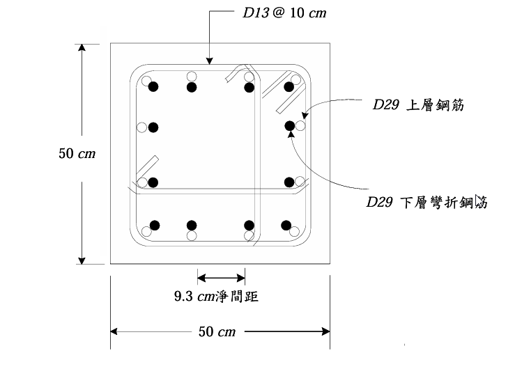

# 考題編號：RC-2010-2

**主分類：** `RC-U3-3` 韌性要求與耐震設計  
**副分類：** `RC-U2-3` 鋼筋錨定長度與斷點計算  
**設計法：** 概念題 + USD  
**標籤：** `耐震柱` `縱向搭接` `Class B搭接` `拉力搭接` `搭接位置限制` `搭接面積` `橫向鋼筋` `D29搭接` `development length` `ld計算` `Ktr圍束` `cb計算`

---

## 1. 原始題目重述 (Problem Restatement)

**(一)（10 分）** 說明混凝土設計規範對**耐震柱縱向搭接鋼筋面積與配置之要求**。

**(二)（10 分）** 耐震柱（如圖 `RC-2010-2-fig-1.png`）：

*圖說：方形柱 50×50 cm，縱向主筋 D29（$d_b=2.87$ cm，$A_s=6.469$ cm²），上層鋼筋為直鋼筋，下層鋼筋為彎折鋼筋，兩組在搭接區重疊；D13@10 cm 閉合箍筋（$d_b=1.27$ cm，$A_s=1.267$ cm²）；鋼筋淨間距 9.3 cm；鋼筋比 $\rho_g \approx 3\%$。*

材料：$f'_c = 280$ kgf/cm²，$f_y = 4200$ kgf/cm²，試設計其**抗拉搭接長度**。

---

## 2. 考題核心精神與出題者意圖 (Core Concepts & Examiner's Intent)

**核心觀念：**
- 耐震柱縱向搭接的嚴格限制，是為防止塑性鉸區因搭接失效導致柱脆性崩潰
- 必須使用 Class B 拉力搭接（$l_s = 1.3l_d$），即使鋼筋可能承受壓力也如此
- $l_d$ 的計算需要正確判斷圍束條件（cb、Ktr）和修正係數

**出題者意圖：**
1. **(一)** 測驗耐震規範對搭接的「位置、面積、類型、橫向鋼筋」四項要求
2. **(二)** 測驗 ACI §12.2 發展長度公式的完整計算流程（cb、Ktr、修正係數）

---

## 3. 解題戰略地圖與陷阱分析 (Strategic Roadmap & Trap Analysis)

**作戰計畫（Part (二)）：**
1. 求柱的幾何（淨間距→c.t.c.間距→$c_b$；保護層→$c_b$）
2. 求 $K_{tr}$（箍筋圍束貢獻）
3. 計算 $(c_b+K_{tr})/d_b$，上限 2.5
4. 代入 ACI 發展長度公式求 $l_d$
5. Class B 搭接：$l_s = 1.3\,l_d$

**關鍵陷阱：**

| 陷阱 | 說明 | 應對 |
|------|------|------|
| ❶ 搭接長度 ≠ $l_d$ | 耐震柱規定 Class B → $l_s = 1.3\,l_d$ | 先算 $l_d$，再乘 1.3 |
| ❷ $c_b$ 取小值 | $c_b = \min$(保護層到中心, 半個c.t.c.) | 計算兩項取小者 |
| ❸ $(c_b+K_{tr})/d_b$ 上限 2.5 | 計算結果若超過 2.5，一律取 2.5 | |
| ❹ $\psi_t = 1.0$（直柱縱筋） | 垂直配置的柱筋不符合 ACI「頂部鋼筋」（澆置面以下 ≥ 30 cm）定義 | 直柱筋 $\psi_t = 1.0$ |
| ❺ $\psi_s = 1.0$（D29 大於 D22） | ACI：D22 以上 $\psi_s = 1.0$，D22 以下 $\psi_s = 0.8$ | |

---

## 3.5 變數層次分析 (Variable Hierarchy Analysis)

### 最終目標

計算 D29 縱向鋼筋在耐震柱中的 Class B 拉力搭接長度 $l_s$。

### 本題關鍵公式（依計算順序）

$$\text{Step 1：} c_b = \min\!\left(\text{保護層至中心},\ \frac{s_{cc}+d_b}{2}\right)$$

$$\text{Step 2：} K_{tr} = \frac{40\,A_{tr}}{s\cdot n}$$

$$\text{Step 3：} \frac{c_b + \boxed{K_{tr}}}{d_b} \le 2.5$$

$$\text{Step 4：} l_d = \frac{f_y\,\psi_t\,\psi_e\,\psi_s}{3.5\lambda\sqrt{f'_c}} \cdot \frac{d_b}{\boxed{(c_b+K_{tr})/d_b}}$$

$$\text{Step 5（Class B）：} l_s = 1.3\,\boxed{l_d}$$

### L1：題目直接給定

| 符號 | 數值 | 說明 |
|------|------|------|
| $b = h$ | 50 cm | 方形柱邊長 |
| $f'_c$ | 280 kgf/cm² | |
| $f_y$ | 4200 kgf/cm² | |
| $d_b$（D29） | 2.87 cm | 待搭接主筋直徑 |
| $d_{b,s}$（D13） | 1.27 cm | 箍筋直徑 |
| $A_{tr}$（D13） | 1.267 cm² | 箍筋單腳面積 |
| $s$（箍筋間距） | 10 cm | |
| 淨間距 | 9.3 cm | 相鄰 D29 的淨間距 |
| $\rho_g$ | ≈ 3% | 縱向鋼筋比 |

### L2：需知識點推導

**▌ 圍束幾何**

| 符號 | 計算 | 卡關? |
|------|------|-------|
| $c.t.c.$ 間距 | $9.3 + 2.87 = 12.17$ cm | |
| $c_b$（半c.t.c.） | $12.17/2 = 6.085$ cm | |
| 保護層（cc）至 D13 中心 | $4 + 1.27/2 = 4.635$ cm（假設 cc = 4 cm） | |
| 保護層至 D29 中心 | $4 + 1.27 + 2.87/2 = 6.705$ cm | |
| $c_b$ 取 min | $\min(6.705,\ 6.085) = 6.085$ cm → **半c.t.c.控制** | |

**▌ 箍筋圍束 $K_{tr}$**

| 符號 | 計算 | 卡關? |
|------|------|-------|
| $\rho_g = 3\%$ → 根數 | $0.03\times50^2/6.469 = 75/6.469 \approx 12$ 根 D29 | |
| 每面根數 $n$ | 12 根均布 → 每面 3 根（包含角隅）| |
| $K_{tr}$ | $40\times1.267/(10\times3) = 1.689$ cm | |
| $(c_b+K_{tr})/d_b$ | $(6.085+1.689)/2.87 = 2.71 > 2.5$ → 上限 **2.5** | |

**▌ 修正係數**

| 符號 | 值 | 原因 |
|------|-----|------|
| $\psi_t$ | 1.0 | 直柱縱筋，非澆置頂層水平筋 |
| $\psi_e$ | 1.0 | 無環氧樹脂塗層 |
| $\psi_s$ | 1.0 | D29 > D22 |
| $\lambda$ | 1.0 | 正常重量混凝土 |

**▌ $l_d$ 與 $l_s$**

| 符號 | 計算 | 卡關? |
|------|------|-------|
| $l_d$ | $[4200/(3.5\times16.73)] \times (2.87/2.5) = 71.72\times1.148 = 82.3$ cm | |
| $l_s$ (Class B) | $1.3\times82.3 = 107.0$ cm | |

### L3：深層知識（不懂就卡住）

| 知識點 | 說明 | 卡關? |
|--------|------|-------|
| 耐震柱強制 Class B | 即使鋼筋受壓也用 Class B，因塑性鉸可能使方向反轉 | |
| $K_{tr}$ 的物理意義 | 橫向箍筋圍束作用，減少沿搭接面的分裂裂縫傾向，使 $l_d$ 縮短 | |
| ACI §12.2 在 kgf/cm² 的轉換係數 3.5 | 由 ACI-SI 公式 $l_d/d_b = f_y/(1.1\sqrt{f'_c})$ 轉換（1.1×3.193 = 3.51 ≈ 3.5）| |

---

## 4. 步驟化詳細計算過程 (Step-by-Step Detailed Calculation)

### Part (一)：耐震柱縱向搭接鋼筋規範要求

依**混凝土設計規範（TCRCDC，ACI 318 Chapter 21）**，特殊矩形框架柱縱向搭接需符合：

**① 搭接位置（Location）**
> 縱向鋼筋搭接**只能設置在柱淨高的中段 1/2 範圍內**（遠離柱端塑性鉸潛在位置）。
> 嚴禁在柱接頭區（joint）及柱端密箍區（$l_o$）內搭接。

**② 搭接面積（Area）**
> 在任一斷面上，搭接縱向鋼筋的面積不得超過總縱向鋼筋面積的 **50%**。
> 若需更多鋼筋在同一截面對接，必須改用機械式接頭或焊接接頭。

**③ 搭接類型（Type）**
> 一律採用 **Class B 拉力搭接**，搭接長度 $l_s = 1.3\,l_d$（$l_d$ = 拉力發展長度）。
> 即使鋼筋在服務載重下為壓力，耐震設計仍強制使用拉力搭接（地震時應力方向可能逆轉）。

**④ 橫向鋼筋（Lateral Reinforcement）**
> 搭接長度全程必須配置符合 §21.4.4 規定的**閉合箍筋（hoops）**。
> 箍筋間距、面積需同時滿足密箍區規定（即不放寬）。

---

### Part (二)：D29 搭接長度計算

---

#### Step 1：柱幾何 → $c_b$

**半中心間距：**
$$c.t.c. = s_{cc} + d_b = 9.3 + 2.87 = 12.17 \text{ cm}$$
$$c_{b,\text{spacing}} = \frac{c.t.c.}{2} = \frac{12.17}{2} = 6.085 \text{ cm}$$

**保護層至 D29 中心：**（清保護層 $cc = 4$ cm）
$$c_{b,\text{cover}} = cc + d_{b,s} + \frac{d_b}{2} = 4 + 1.27 + 1.435 = 6.705 \text{ cm}$$

$$c_b = \min(6.085,\ 6.705) = \boxed{6.085 \text{ cm}} \quad \text{（半c.t.c.間距控制）}$$

---

#### Step 2：箍筋圍束 $K_{tr}$

縱向鋼筋總量：$0.03\times50^2 = 75$ cm² → 根數 $= 75/6.469 \approx 12$ 根 D29

均布排列（每面 3 根），分裂平面方向每面 $n = 3$ 根：

$$K_{tr} = \frac{40\,A_{tr}}{s\cdot n} = \frac{40\times1.267}{10\times3} = \frac{50.68}{30} = 1.689 \text{ cm}$$

---

#### Step 3：圍束係數驗核

$$\frac{c_b + K_{tr}}{d_b} = \frac{6.085 + 1.689}{2.87} = \frac{7.774}{2.87} = 2.709 > 2.5$$

$$\Rightarrow \text{取上限：}\frac{c_b + K_{tr}}{d_b} = \boxed{2.5}$$

---

#### Step 4：修正係數

| 係數 | 值 | 說明 |
|------|----|------|
| $\psi_t$ | **1.0** | 垂直柱筋，非 ACI 頂部鋼筋（fresh concrete below < 300 mm 規定不適用於垂直筋） |
| $\psi_e$ | **1.0** | 無塗層鋼筋 |
| $\psi_s$ | **1.0** | D29 > D22 |
| $\lambda$ | **1.0** | 正常重量混凝土 |

---

#### Step 5：計算基本發展長度 $l_d$（kgf/cm² 系統）

$$l_d = \frac{f_y\,\psi_t\,\psi_e\,\psi_s}{3.5\lambda\sqrt{f'_c}} \cdot \frac{d_b}{(c_b+K_{tr})/d_b}$$

$$= \frac{4200\times1.0\times1.0\times1.0}{3.5\times1.0\times\sqrt{280}} \times \frac{2.87}{2.5}$$

$$= \frac{4200}{3.5\times16.733} \times 1.148 = \frac{4200}{58.57} \times 1.148$$

$$= 71.72\times1.148 = \boxed{82.3 \text{ cm}}$$

驗核最小值：$l_d \ge 30$ cm → 82.3 cm ✓

---

#### Step 6：Class B 拉力搭接長度

耐震柱規定一律採 Class B：

$$\boxed{l_s = 1.3\,l_d = 1.3\times82.3 = 107 \text{ cm}}$$

---

**彙整：**

| 項目 | 結果 |
|------|------|
| $c_b$（半c.t.c.控制） | 6.085 cm |
| $K_{tr}$ | 1.689 cm |
| $(c_b+K_{tr})/d_b$（上限 2.5） | 2.5 |
| 基本發展長度 $l_d$ | 82.3 cm |
| **Class B 拉力搭接長度 $l_s$** | **107 cm** |

---

## 5. 關鍵爭議點與進階探討 (Critical Issues & Advanced Discussion)

**① 為何耐震柱強制 Class B？**

塑性鉸形成時，鋼筋拉力需求達到 $\alpha_s f_y$（$\alpha_s \ge 1.25$）。Class B 搭接本已保守，加上搭接區域要求密箍，確保搭接面不因地震反覆載重而劣化。

**② 搭接鋼筋數量（50% 限制）**

| 搭接數量 | 要求 |
|---------|------|
| 同一截面搭接 ≤ 50% | Class B（1.3ld）即可 |
| 同一截面搭接 > 50% | 改用機械式或焊接接頭 |

**③ $K_{tr} = 0$ 保守算法**

若不確定 $n$ 值，可令 $K_{tr} = 0$（忽略箍筋圍束貢獻），此時：
$(c_b+0)/d_b = 6.085/2.87 = 2.12$，未超過 2.5，不需 cap。
$l_d = [4200/(3.5\times16.733)] \times (2.87/2.12) = 71.72 \times 1.354 = 97.1$ cm
$l_s = 1.3\times97.1 = 126$ cm（保守值）

本題取 $K_{tr}$ 計入後：$l_s = 107$ cm（比保守值短，因圍束有效）。

**④ 考場提示**

若題目只給淨間距且不確定 n，用 $K_{tr}=0$ 是安全的保守選擇，不影響方法分。
