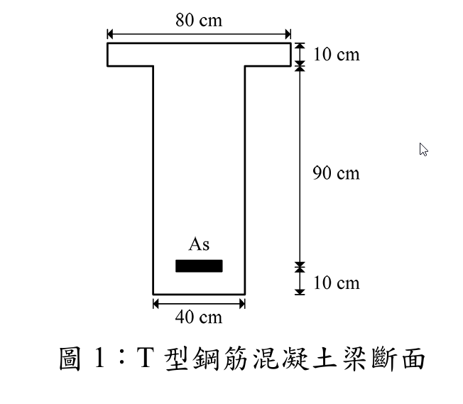

# 考題編號：RC-2011-2

**主分類：** `RC-U1-1` RC 梁彎矩強度分析與設計  
**副分類：** 無  
**設計法：** USD 強度設計法  
**標籤：** `T形梁` `平衡鋼筋量` `NA在腹板` `過渡區φ值` `斷面韌性容量` `曲率延展比` `降伏曲率` `極限曲率` `彈性中性軸` `As=0.9Asb`

---

## 1. 原始題目重述 (Problem Restatement)

針對圖 1 所示之 T 型 RC 梁斷面（`RC-2011-2-fig-1.png`）：

*圖說：翼板寬 $b_f=80$ cm，翼板厚 $h_f=10$ cm；腹板寬 $b_w=40$ cm，腹板高 90 cm；全斷面總高 $h=100$ cm；底部鋼筋形心至底纖維距離 10 cm，故有效深度 $d=90$ cm；受拉鋼筋 $A_s$ 位於底部。*

**材料：** $f'_c = 350$ kgf/cm²，$f_y = 4200$ kgf/cm²

**(一)** 已知 $A_s = 0.9A_{sb}$（$A_{sb}$ 為此 T 型梁之平衡鋼筋量），求設計彎矩強度 $\phi M_n$。（15 分）

**(二)** 求斷面韌性容量 $\mu_\phi = \phi_u / \phi_y$，其中 $\phi_u$ 及 $\phi_y$ 分別為極限曲率及降伏曲率。（10 分）

---

## 2. 考題核心精神與出題者意圖 (Core Concepts & Examiner's Intent)

**核心觀念：**
- **(一)**：T型梁平衡鋼筋量計算需考慮翼板額外壓力貢獻；$A_s = 0.9A_{sb}$ 表示輕微低配筋，中性軸仍在腹板（過渡區）。
- **(二)**：曲率延展比 = 極限曲率（Whitney 應力塊非線性中性軸）/ 降伏曲率（彈性轉換斷面中性軸）；重配筋比 → 低延性。

**出題者意圖：**
1. 測驗是否能正確判斷 T 型梁平衡條件下中性軸位置（翼板內 vs. 腹板中）
2. 測驗 $\phi$ 值過渡區插值是否會算
3. 測驗 $\phi_y$ 與 $\phi_u$ 採用不同中性軸（彈性 vs. 塑性）的觀念

---

## 3. 解題戰略地圖與陷阱分析 (Strategic Roadmap & Trap Analysis)

**作戰計畫：**
1. 確認材料常數（$\beta_1$、$\varepsilon_y$、$E_c$、$n$）
2. 求 T 型梁 $A_{sb}$：先算平衡 $c_b$、$a_b$，判斷翼板是否完全壓縮
3. 求 $A_s = 0.9A_{sb}$，再反算實際 $a$
4. 計算 $\varepsilon_t$，決定 $\phi$ 值
5. 對 $A_s$ 位置取矩，得 $M_n$；乘 $\phi$ 得 $\phi M_n$
6. 求彈性中性軸深度 → $\phi_y$
7. 用塑性中性軸 → $\phi_u$
8. 計算 $\mu_\phi = \phi_u/\phi_y$

**關鍵陷阱：**

| 陷阱 | 說明 | 應對 |
|------|------|------|
| ❶ $A_{sb}$ 須用 T 型梁公式 | 不能直接用 $\rho_b \cdot b_w \cdot d$，翼板多出壓力 $\to$ 多出鋼筋 | $A_{sb} = A_{sf} + A_{sw}$；或直接用壓力平衡 |
| ❷ $a_b$ 跨過翼板 | $a_b = 42.7$ cm $> h_f = 10$ cm，壓力區形狀是倒 T，**非矩形** | 壓力 = 翼板 + 腹板矩形塊，分開計算 |
| ❸ 過渡區 $\phi$ 值 | $\varepsilon_y < \varepsilon_t < 0.005$，$\phi$ 需線性插值，非直接 0.9 | $\phi = 0.65 + 0.25\dfrac{\varepsilon_t - \varepsilon_y}{0.005 - \varepsilon_y}$ |
| ❹ $\phi_y$ 用彈性中性軸，$\phi_u$ 用塑性中性軸 | 兩個中性軸概念不同，不可混用 | $\phi_y = \varepsilon_y/(d - k_y d)$；$\phi_u = \varepsilon_{cu}/c_u$ |

---

## 3.5 變數層次分析 (Variable Hierarchy Analysis)

### 最終目標

**(一)** 求 $\phi M_n$（T 型梁設計彎矩強度）；**(二)** 求 $\mu_\phi = \phi_u/\phi_y$（斷面韌性容量）

### 本題關鍵公式（依計算順序）

$$\text{Step 1：} \beta_1 = 0.85 - 0.05\cdot\frac{f'_c - 280}{70}$$

$$\text{Step 2：} a_b = \beta_1 \cdot \frac{6120}{6120+f_y}\cdot d \quad \Rightarrow \quad A_{sb} = \frac{0.85f'_c\bigl[b_f h_f + b_w(\boxed{a_b}-h_f)\bigr]}{f_y}$$

$$\text{Step 3：} 0.85f'_c\bigl[b_f h_f + b_w(a-h_f)\bigr] = 0.9\boxed{A_{sb}}\cdot f_y \quad \Rightarrow \quad a$$

$$\text{Step 4：} \varepsilon_t = \varepsilon_{cu}\cdot\frac{d - \boxed{a}/\beta_1}{\boxed{a}/\beta_1} \quad \Rightarrow \quad \phi$$

$$\text{Step 5：} M_n = 0.85f'_c\,(b_f-b_w)\,h_f\!\left(d - \tfrac{h_f}{2}\right) + 0.85f'_c\,b_w\,\boxed{a}\!\left(d - \tfrac{\boxed{a}}{2}\right)$$

$$\text{Step 6（}\phi_y\text{）：} 20x^2 + (n\cdot A_s + 400)\,x - \bigl[n\cdot A_s\cdot d + 2000\bigr] = 0 \quad \Rightarrow \quad \phi_y = \frac{\varepsilon_y}{d - \boxed{x}}$$

$$\text{Step 7（}\phi_u\text{）：} \phi_u = \frac{\varepsilon_{cu}}{\boxed{a}/\beta_1}$$

### L1：題目直接給定

| 符號 | 數值 | 說明 |
|------|------|------|
| $f'_c$ | 350 kgf/cm² | 混凝土抗壓強度 |
| $f_y$ | 4200 kgf/cm² | 鋼筋降伏強度 |
| $b_f$ | 80 cm | 翼板寬度 |
| $h_f$ | 10 cm | 翼板厚度 |
| $b_w$ | 40 cm | 腹板寬度 |
| $h$ | 100 cm | 全斷面高（10+90） |
| $d$ | 90 cm | 有效深度（h - 10 cm 保護層） |
| $A_s$ | $0.9A_{sb}$ | 拉力鋼筋量（以平衡量的倍數給定） |

### L2：需知識點推導

**▌ 材料常數**

| 符號 | 公式／來源 | 卡關? |
|------|-----------|-------|
| $\beta_1$ | $0.85 - 0.05\times(350-280)/70 = 0.80$ | |
| $\varepsilon_y$ | $f_y/E_s = 4200/2{,}040{,}000 = 0.002059$ | |
| $E_c$ | $15000\sqrt{f'_c} = 15000\sqrt{350} = 280{,}624$ kgf/cm² | |
| $n$ | $E_s/E_c = 2{,}040{,}000/280{,}624 = 7.27$ | |

**▌ T 型梁平衡鋼筋量 $A_{sb}$**

| 符號 | 公式／來源 | 卡關? |
|------|-----------|-------|
| $c_b$ | $6120/(6120+4200)\times 90 = 53.37$ cm | |
| $a_b$ | $0.80\times 53.37 = 42.70$ cm $> h_f$ → NA 在腹板 | |
| $C_c$ | $0.85\times350\times[80\times10 + 40\times(42.70-10)] = 626{,}630$ kgf | |
| $A_{sb}$ | $C_c/f_y = 626{,}630/4200 = 149.2$ cm² | |
| $A_s$ | $0.9\times149.2 = 134.3$ cm² | |

**▌ 實際中性軸 $a$**

| 符號 | 公式／來源 | 卡關? |
|------|-----------|-------|
| $a$ | 由 $0.85\times350\times[800+40(a-10)]=134.3\times4200$ 解得 37.40 cm | |
| $c_u$ | $a/\beta_1 = 37.40/0.80 = 46.75$ cm | |

**▌ φ 值（過渡區）**

| 符號 | 公式／來源 | 卡關? |
|------|-----------|-------|
| $\varepsilon_t$ | $0.003\times(90-46.75)/46.75 = 0.002776$ | |
| $\phi$ | $0.65 + 0.25\times(0.002776-0.002059)/(0.005-0.002059) = 0.711$ | |

**▌ 韌性計算**

| 符號 | 公式／來源 | 卡關? |
|------|-----------|-------|
| $k_y d$ | 彈性裂縫斷面 NA（見 §4 Step 8）= 40.94 cm | |
| $\phi_y$ | $\varepsilon_y/(d-k_y d) = 0.002059/49.06 = 4.197\times10^{-5}$ rad/cm | |
| $\phi_u$ | $\varepsilon_{cu}/c_u = 0.003/46.75 = 6.417\times10^{-5}$ rad/cm | |
| $\mu_\phi$ | $\phi_u/\phi_y = 6.417/4.197 = 1.53$ | |

### L3：深層知識（不懂就卡住）

| 知識點 | 說明 | 卡關? |
|--------|------|-------|
| T 型梁 $A_{sb}$ 含翼板貢獻 | 翼板多出的壓力需由多出的鋼筋平衡，$A_{sb}$ 遠大於 $\rho_b\cdot b_w\cdot d$ | |
| $\phi_y$ 對應彈性中性軸（轉換斷面法） | 降伏瞬間鋼筋剛達 $f_y$，混凝土仍為彈性，需用轉換斷面（$n\times A_s$）計算 NA | |
| $\phi_u$ 對應 Whitney 塑性中性軸 | 極限狀態用等效矩形應力塊，$c_u = a/\beta_1$，與彈性 NA 位置完全不同 | |
| 重配筋 → 低延性 | $A_s = 0.9A_{sb}$ 表示接近平衡破壞，$\varepsilon_t$ 僅略高於 $\varepsilon_y$，曲率延展比 $\approx 1.5$ | |

---

## 4. 步驟化詳細計算過程 (Step-by-Step Detailed Calculation)

### Part (一)：設計彎矩強度 $\phi M_n$

---

#### Step 1：材料常數

$$\beta_1 = 0.85 - 0.05\times\frac{350-280}{70} = 0.85 - 0.05 = \boxed{0.80}$$

$$\varepsilon_y = \frac{f_y}{E_s} = \frac{4200}{2{,}040{,}000} = 0.002059$$

$$E_c = 15000\sqrt{350} = 15000 \times 18.71 = 280{,}624 \text{ kgf/cm}^2$$

$$n = \frac{E_s}{E_c} = \frac{2{,}040{,}000}{280{,}624} = 7.27$$

---

#### Step 2：T 型梁平衡鋼筋量 $A_{sb}$

**平衡中性軸深度：**

$$c_b = \frac{6120}{6120+4200}\times 90 = \frac{6120}{10320}\times 90 = 53.37 \text{ cm}$$

$$a_b = \beta_1\cdot c_b = 0.80\times 53.37 = 42.70 \text{ cm}$$

由於 $a_b = 42.70 \text{ cm} > h_f = 10 \text{ cm}$，**平衡時中性軸在腹板中**。

**平衡壓力（分兩部分）：**

$$C_c = 0.85f'_c\bigl[b_f\cdot h_f + b_w\cdot(a_b - h_f)\bigr]$$

$$= 0.85\times350\times\bigl[80\times10 + 40\times(42.70-10)\bigr]$$

$$= 297.5\times\bigl[800 + 40\times32.70\bigr] = 297.5\times2108 = 626{,}630 \text{ kgf}$$

$$\boxed{A_{sb} = \frac{C_c}{f_y} = \frac{626{,}630}{4200} = 149.2 \text{ cm}^2}$$

---

#### Step 3：計算 $A_s = 0.9 A_{sb}$

$$A_s = 0.9\times149.2 = \boxed{134.3 \text{ cm}^2}$$

---

#### Step 4：反算實際壓力塊深度 $a$

假設 $a > h_f$（待驗證）：

$$0.85f'_c\bigl[b_f\cdot h_f + b_w\cdot(a-h_f)\bigr] = A_s\cdot f_y$$

$$297.5\times\bigl[800 + 40(a-10)\bigr] = 134.3\times4200 = 564{,}060$$

$$800 + 40(a-10) = \frac{564{,}060}{297.5} = 1896.1$$

$$40(a-10) = 1096.1 \quad\Rightarrow\quad a = 10 + 27.40 = \boxed{37.40 \text{ cm}}$$

✅ 驗證：$a = 37.40 > h_f = 10$ cm，假設成立。

---

#### Step 5：$\varepsilon_t$ 與 $\phi$ 值

$$c_u = \frac{a}{\beta_1} = \frac{37.40}{0.80} = 46.75 \text{ cm}$$

$$\varepsilon_t = \varepsilon_{cu}\cdot\frac{d - c_u}{c_u} = 0.003\times\frac{90-46.75}{46.75} = 0.003\times0.9251 = 0.002775$$

**判斷區間：** $\varepsilon_y = 0.002059 < \varepsilon_t = 0.002775 < 0.005$ → **過渡區**

$$\phi = 0.65 + 0.25\times\frac{\varepsilon_t - \varepsilon_y}{0.005 - \varepsilon_y} = 0.65 + 0.25\times\frac{0.002775-0.002059}{0.005-0.002059}$$

$$= 0.65 + 0.25\times\frac{0.000716}{0.002941} = 0.65 + 0.25\times0.2435 = 0.65 + 0.0609 = \boxed{0.711}$$

---

#### Step 6：計算 $M_n$（對 $A_s$ 形心取矩）

**策略：** 將壓力分為腹板矩形塊 + 翼板外挑矩形塊（均勻應力 $0.85f'_c$）：

$$C_{c,\text{web}} = 0.85\times350\times b_w\times a = 297.5\times40\times37.40 = 444{,}820 \text{ kgf}$$

$$\text{力臂}_{web} = d - \frac{a}{2} = 90 - 18.70 = 71.30 \text{ cm}$$

$$C_{c,\text{flange}} = 0.85\times350\times(b_f-b_w)\times h_f = 297.5\times40\times10 = 119{,}000 \text{ kgf}$$

$$\text{力臂}_{flange} = d - \frac{h_f}{2} = 90 - 5 = 85.00 \text{ cm}$$

**驗算平衡：** $C_{c,\text{web}} + C_{c,\text{flange}} = 444{,}820 + 119{,}000 = 563{,}820 \approx A_s\cdot f_y = 564{,}060$ kgf ✅

$$M_n = 444{,}820\times71.30 + 119{,}000\times85.00$$

$$= 31{,}715{,}666 + 10{,}115{,}000 = 41{,}830{,}666 \text{ kgf·cm} = 418.3 \text{ tf·m}$$

$$\boxed{\phi M_n = 0.711\times418.3 = 297.4 \text{ tf·m}}$$

---

### Part (二)：斷面韌性容量 $\mu_\phi = \phi_u/\phi_y$

---

#### Step 7：降伏曲率 $\phi_y$（彈性轉換斷面法）

**求彈性裂縫斷面中性軸深度 $k_y d$（設 $x = k_y d$）：**

令 NA 在腹板（$x > h_f$），對 NA 取面積矩：

$$b_f\cdot h_f\left(x - \frac{h_f}{2}\right) + \frac{b_w\cdot(x-h_f)^2}{2} = n\cdot A_s\cdot(d-x)$$

代入數值（$b_f=80$，$h_f=10$，$b_w=40$，$n=7.27$，$A_s=134.3$，$d=90$）：

$$80\times10\times(x-5) + \frac{40\times(x-10)^2}{2} = 7.27\times134.3\times(90-x)$$

$$800(x-5) + 20(x-10)^2 = 976.2(90-x)$$

展開：

$$800x - 4000 + 20x^2 - 400x + 2000 = 87{,}858 - 976.2x$$

$$20x^2 + 1376.2x - 89{,}858 = 0$$

$$x^2 + 68.81x - 4492.9 = 0$$

$$x = \frac{-68.81 + \sqrt{68.81^2 + 4\times4492.9}}{2} = \frac{-68.81 + \sqrt{4734.8 + 17971.6}}{2} = \frac{-68.81 + 150.69}{2}$$

$$\boxed{k_y d = x = 40.94 \text{ cm}} \quad (> h_f \text{，假設成立})$$

$$\phi_y = \frac{\varepsilon_y}{d - k_y d} = \frac{0.002059}{90 - 40.94} = \frac{0.002059}{49.06} = 4.197\times10^{-5} \text{ rad/cm}$$

---

#### Step 8：極限曲率 $\phi_u$（Whitney 塑性中性軸）

極限狀態中性軸 $c_u$ 已由 Part (一) 算出：

$$c_u = 46.75 \text{ cm}$$

$$\phi_u = \frac{\varepsilon_{cu}}{c_u} = \frac{0.003}{46.75} = 6.417\times10^{-5} \text{ rad/cm}$$

---

#### Step 9：斷面韌性容量

$$\boxed{\mu_\phi = \frac{\phi_u}{\phi_y} = \frac{6.417\times10^{-5}}{4.197\times10^{-5}} = 1.53}$$

> **物理意義：** $A_s = 0.9A_{sb}$ 為高配筋（接近平衡破壞），$\varepsilon_t$ 僅略高於 $\varepsilon_y$，故延性極為有限（$\mu_\phi\approx1.53$）。相較而言，低配筋梁（$A_s\approx0.3A_{sb}$）的 $\mu_\phi$ 通常可達 5–10。

---

## 5. 關鍵爭議點與進階探討 (Critical Issues & Advanced Discussion)

**① $A_{sb}$ 為何遠大於單純腹板矩形梁？**

T 型梁翼板多提供 $C_{c,\text{overhang}} = 0.85\times350\times40\times10 = 119{,}000$ kgf 之壓力，折合鋼筋 $= 119{,}000/4200 = 28.3$ cm²。因此：
$$A_{sb,T} = A_{sb,\text{web}} + A_{sf} = 120.9 + 28.3 = 149.2 \text{ cm}^2 \gg A_{sb,\text{rect}} = 0.0336\times40\times90 = 121.1 \text{ cm}^2$$

翼板貢獻約 19%，不可忽略。

**② 過渡區 $\phi$ 值的考場處理**

$A_s < A_{sb}$ 不代表 $\phi = 0.9$，必須計算 $\varepsilon_t$ 後插值。本題 $\phi = 0.711$，若直接取 0.9 將高估 $\phi M_n$ 約 27%，導致設計不安全。

**③ 彈性 vs. 塑性中性軸的深度比較**

| | 位置 | 方法 |
|-|------|------|
| 彈性 NA（$\phi_y$ 用） | $k_y d = 40.94$ cm | 轉換斷面一次矩 |
| 塑性 NA（$\phi_u$ 用） | $c_u = 46.75$ cm | Whitney 等效應力塊 |

塑性 NA 比彈性 NA 更深（壓力區更大），因為極限狀態混凝土應力分布為矩形，比彈性三角形提供更大壓力中心距底面的力臂，導致中性軸需更深才能與鋼筋拉力平衡。

**④ 考場速解提示**

- 先判斷 $a_b$ 位置（翼板 or 腹板），免得後面全錯
- $\phi$ 值一定要算，不要假設
- $\phi_y$ 和 $\phi_u$ 的中性軸完全不同，**不可混用**
