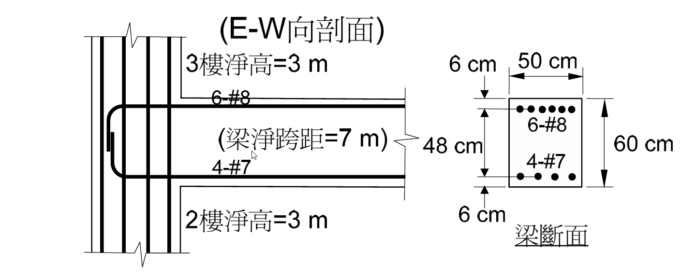
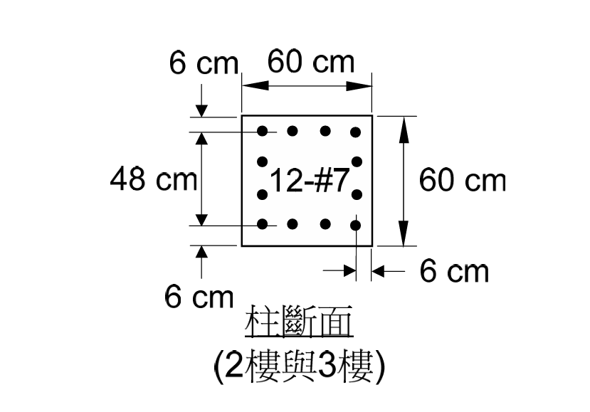

# 考題編號：RC-2012-2

**主分類：** `RC-U3-3` 韌性要求與耐震設計
**副分類：** `RC-U1-1` RC 梁彎矩強度分析與設計
**設計法：** USD 強度設計法
**標籤：** `耐震梁` `特殊矩形框架梁` `可能彎矩強度Mpr` `地震彎矩` `梁端強度` `強柱弱梁` `1.25fy`

---

## 1. 原始題目重述 (Problem Restatement)

詳附圖構架（單跨多層 RC 抗彎構架），試計算梁構件所受**地震引致之最大彎矩強度**為何？（20 分）



*圖說：梁斷面 bw = 50 cm，h = 60 cm；頂筋 6-#8（保護層 6 cm）；底筋 4-#7（保護層 6 cm）；柱斷面 60×60 cm，12-#7，保護層 6 cm；梁淨跨距 7 m，各樓層柱淨高 3 m。*



*圖說：柱斷面（2 樓與 3 樓），60×60 cm，12-#7，四面均勻配筋，保護層 6 cm。*

**設計參數：**
- $f'_c = 280\ \text{kgf/cm}^2$，$f_y = 4{,}200\ \text{kgf/cm}^2$
- 梁主筋：#7（$A_b = 3.87\ \text{cm}^2$）、#8（$A_b = 5.07\ \text{cm}^2$）
- 梁斷面：$b_w = 50\ \text{cm}$，$h = 60\ \text{cm}$，$d = 60 - 6 = 54\ \text{cm}$
- 頂筋：$6\text{-\#8}$，$A_{s,\text{top}} = 6\times5.07 = 30.42\ \text{cm}^2$
- 底筋：$4\text{-\#7}$，$A_{s,\text{bot}} = 4\times3.87 = 15.48\ \text{cm}^2$

---

## 2. 考題核心精神與出題者意圖 (Core Concepts & Examiner's Intent)

**核心精神：**
特殊矩形框架（SMF）採**強柱弱梁**機制：地震時能量消散集中於梁端塑鉸。
梁端強度使用**可能彎矩強度（Mpr）**，以 $f_{ps} = 1.25\,f_y$ 計算（考量鋼筋應變硬化），且 $\phi = 1.0$。

**出題者意圖：**
1. 測試 Mpr 公式（$f_{ps} = 1.25\,f_y$，$\phi = 1.0$）與一般 $\phi M_n$（$f_y$，$\phi = 0.9$）的差異
2. 測試地震正反兩向：頂筋決定負彎矩 Mpr（EQ→右），底筋決定正彎矩 Mpr（EQ→左）
3. 梁最大彎矩 = 頂筋 Mpr（通常頂筋多於底筋）

---

## 3. 解題戰略地圖與陷阱分析 (Strategic Roadmap & Trap Analysis)

**作戰計畫：**
```
Step 1：確認 fps = 1.25fy（Mpr 用，非 fy）
Step 2：計算負彎矩 Mpr⁻（頂筋 6-#8 受拉）
Step 3：計算正彎矩 Mpr⁺（底筋 4-#7 受拉）
Step 4：報告最大值 = Mpr⁻（頂筋控制）
```

**關鍵陷阱：**

| # | 陷阱 | 應對策略 |
|---|------|---------|
| 1 | **用 fy = 4200 計算 Mpr**：應用 1.25fy | fps = 1.25 × 4200 = **5250 kgf/cm²** |
| 2 | **忘記 φ = 1.0**：Mpr 不折減 | Mpr = As × fps × (d − a/2)，無 φ 係數 |
| 3 | **只算一個方向**：地震雙向 → 頂筋和底筋各管一個方向 | Mpr⁻（頂筋）和 Mpr⁺（底筋）均需計算 |
| 4 | **d 混淆**：d = h − 6 = 54 cm（6 cm 到筋心） | 對稱保護層，兩個方向 d 相同 = 54 cm |

---

## 3.5 變數層次分析 (Variable Hierarchy Analysis)

> 複習提示：第一次解題後，在每個卡住的知識點旁標記 `⚠`；第二次複習時只看有 `⚠` 的項目。

### 最終目標
`計算梁端地震最大彎矩強度 = max(Mpr⁻, Mpr⁺)，其中 fps = 1.25fy，φ = 1.0`

### 本題關鍵公式（依計算順序）

$$\text{Step 1:}\quad f_{ps} = 1.25\,f_y = 1.25\times4{,}200 = 5{,}250\ \text{kgf/cm}^2$$

$$\text{Step 2:}\quad a = \frac{A_s \cdot f_{ps}}{0.85\,f'_c\,b_w}$$

$$\text{Step 3:}\quad M_{pr} = A_s \cdot f_{ps} \cdot \left(d - \frac{\boxed{a}}{2}\right)$$

### L1：題目直接給定

| 符號 | 數值 | 說明 |
|------|------|------|
| $b_w$ | 50 cm | 梁寬（圖示） |
| $h$ | 60 cm | 梁高 |
| $f'_c$ | 280 kgf/cm² | 混凝土強度 |
| $f_y$ | 4200 kgf/cm² | 鋼筋降伏強度 |
| 頂筋 | 6-#8，$A_{s,\text{top}}=30.42\ \text{cm}^2$ | 負彎矩拉力鋼筋 |
| 底筋 | 4-#7，$A_{s,\text{bot}}=15.48\ \text{cm}^2$ | 正彎矩拉力鋼筋 |

### L2：需知識點推導

| 符號 | 公式／來源 | 卡關? |
|------|----------|:-----:|
| $d$ | $60-6=54\ \text{cm}$（6 cm 保護層至筋心） | |
| $f_{ps}$ | $1.25\times4{,}200=5{,}250\ \text{kgf/cm}^2$（Mpr 用，含硬化） | |
| $a_{\text{neg}}$ | $30.42\times5{,}250/(0.85\times280\times50)=13.42\ \text{cm}$ | |
| $M_{pr}^-$ | $30.42\times5{,}250\times(54-6.71)=75.5\ \text{tf·m}$ | |
| $a_{\text{pos}}$ | $15.48\times5{,}250/(0.85\times280\times50)=6.83\ \text{cm}$ | |
| $M_{pr}^+$ | $15.48\times5{,}250\times(54-3.42)=41.1\ \text{tf·m}$ | |

### L3：深層知識（不懂就卡住）

| 知識點 | 說明 | 卡關? |
|--------|------|:-----:|
| **Mpr vs Mn vs φMn** | Mpr：$1.25f_y$，$\phi=1.0$（塑鉸最大可能強度）；Mn：$f_y$，$\phi=1.0$；$\phi M_n$：$f_y$，$\phi=0.9$。Mpr > Mn > φMn | |
| **1.25fy 的由來** | 鋼筋降伏後有應變硬化（strain hardening），實際承載力高於降伏強度。ACI 318 用 1.25fy 估計塑鉸區的最壞情況，確保柱設計有足夠保守性 | |
| **地震雙向性** | EQ 向右：梁端負彎矩，頂筋受拉，Mpr⁻ 控制；EQ 向左：梁端正彎矩，底筋受拉，Mpr⁺ 控制。兩個值均為設計所需 | |

---

## 4. 步驟化詳細計算過程 (Step-by-Step Detailed Calculation)

### Step 1：可能鋼筋應力

$$f_{ps} = 1.25\,f_y = 1.25\times4{,}200 = \boxed{5{,}250\ \text{kgf/cm}^2}$$

### Step 2：有效深度

頂筋與底筋均採 6 cm 保護層至筋心：

$$d = h - 6 = 60 - 6 = \boxed{54\ \text{cm}}$$

---

### ▌Mpr⁻（負彎矩，頂筋 6-#8 受拉）

> EQ 向右時，梁柱接頭面受負彎矩（頂纖維拉力），頂筋 6-#8 為拉力鋼筋。

$$A_{s,\text{top}} = 6\times5.07 = 30.42\ \text{cm}^2$$

**Whitney 壓力塊深度**（壓縮區在梁底）：

$$a^- = \frac{A_{s,\text{top}}\times f_{ps}}{0.85\,f'_c\,b_w} = \frac{30.42\times5{,}250}{0.85\times280\times50} = \frac{159{,}705}{11{,}900} = \boxed{13.42\ \text{cm}}$$

**可能負彎矩強度：**

$$M_{pr}^- = A_{s,\text{top}}\times f_{ps}\times\left(d-\frac{a^-}{2}\right) = 30.42\times5{,}250\times\left(54-6.71\right)$$

$$= 159{,}705\times47.29 = 7{,}552{,}400\ \text{kgf·cm} = \boxed{75.5\ \text{tf·m}}$$

---

### ▌Mpr⁺（正彎矩，底筋 4-#7 受拉）

> EQ 向左時，梁柱接頭面受正彎矩（底纖維拉力），底筋 4-#7 為拉力鋼筋。

$$A_{s,\text{bot}} = 4\times3.87 = 15.48\ \text{cm}^2$$

**Whitney 壓力塊深度**（壓縮區在梁頂）：

$$a^+ = \frac{A_{s,\text{bot}}\times f_{ps}}{0.85\,f'_c\,b_w} = \frac{15.48\times5{,}250}{0.85\times280\times50} = \frac{81{,}270}{11{,}900} = \boxed{6.83\ \text{cm}}$$

**可能正彎矩強度：**

$$M_{pr}^+ = A_{s,\text{bot}}\times f_{ps}\times\left(d-\frac{a^+}{2}\right) = 15.48\times5{,}250\times\left(54-3.42\right)$$

$$= 81{,}270\times50.58 = 4{,}110{,}607\ \text{kgf·cm} = \boxed{41.1\ \text{tf·m}}$$

---

### 結論彙整

| 彎矩方向 | 拉力鋼筋 | $a$ | $M_{pr}$ | 地震方向 |
|:---:|:---:|:---:|:---:|:---:|
| 負（頂筋受拉） | 6-#8，30.42 cm² | 13.42 cm | **75.5 tf·m** | EQ→右 |
| 正（底筋受拉） | 4-#7，15.48 cm² | 6.83 cm | 41.1 tf·m | EQ→左 |

$$\boxed{\text{梁端地震最大彎矩強度} = M_{pr}^- = 75.5\ \text{tf·m}\ \text{（頂筋控制）}}$$

> 兩個 Mpr 值在後續柱剪力（第三題）與接頭剪力（第四題）設計中均需使用。

---

## 5. 關鍵爭議點與進階探討 (Critical Issues & Advanced Discussion)

**① Mpr ≥ ½ Mpr 另端的耐震規定檢核**

ACI 318 特殊框架梁規定：
$$M_{pr}^+ \geq \frac{1}{2}\,M_{pr}^- \implies 41.1 \geq \frac{1}{2}\times75.5 = 37.75\ \text{tf·m} \quad ✓$$

此規定確保梁在正反彎矩下均有足夠塑鉸能力，不致因底筋過少而在正彎矩時發生脆性破壞。

**② 為何不直接用 φMn 作為「地震最大彎矩」**

- $\phi M_n$ 是**設計容量**（考慮不確定性折減），代表梁「至少能承受」的彎矩
- $M_{pr}$ 是**最大可能強度**（應變硬化 + 不折減），代表梁「最多可能發展」的彎矩
- 設計柱和接頭時，必須用 Mpr（而非 φMn）來確保強柱弱梁機制確實成立

**③ 梁端最大地震彎矩的物理意義**

當梁形成塑鉸（beam hinging），梁端彎矩理論最大值為 Mpr。超過此值後梁進入全截面降伏，力量不再增加。故 Mpr = 75.5 tf·m 是此梁「地震荷重下最惡劣的梁端彎矩」，也是設計柱和接頭時的驅動力。
