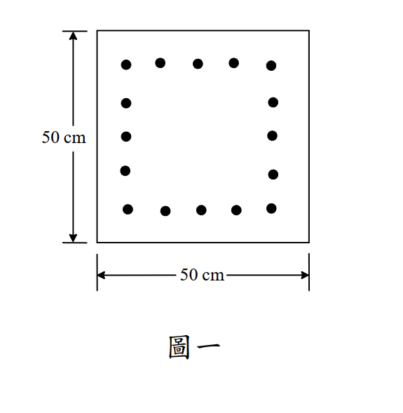

# 考題編號：RC-2013-2

**主分類：** `RC-U3-3` 韌性要求與耐震設計
**副分類：** `RC-U1-2` RC 柱強度分析與設計
**設計法：** USD 強度設計法
**標籤：** `特殊矩形柱` `耐震圍束箍筋` `密箍區` `Ash公式` `D13箍筋` `crossties繫筋` `方形柱` `16根D32`

---

## 1. 原始題目重述 (Problem Restatement)

一**方形柱**，斷面 $50\ \text{cm} \times 50\ \text{cm}$，配置 **16 支 D32 主筋**（如圖一），依耐震設計特別規定（特殊矩形框架柱）配置橫向鋼筋。（25 分）



*圖說：方形柱 50 cm × 50 cm；16 支 D32（$d_b=3.22\ \text{cm}$，$A_b=8.14\ \text{cm}^2$）；每面 5 根（含角筋），共 $4\times(5-1)=16$ 根；保護層 4 cm（至箍筋外緣）；橫向鋼筋 $f_{yh}=2800\ \text{kgf/cm}^2$，$f'_c=280\ \text{kgf/cm}^2$。*

**參考公式（Ash 兩公式取大）：**

$$A_{sh} \geq \max\!\left[0.3\,s\,h_c\!\left(\frac{A_g}{A_{ch}}-1\right)\frac{f'_c}{f_{yh}},\quad 0.09\,s\,h_c\frac{f'_c}{f_{yh}}\right]$$

---

## 2. 考題核心精神與出題者意圖 (Core Concepts & Examiner's Intent)

**核心精神：**
特殊矩形框架柱（SMF Column）的耐震圍束設計有兩層工作：
1. **間距控制**：依三個上限（b/4、6db、so）取最小值，確保密箍區防止混凝土壓碎和縱筋挫屈
2. **Ash 控制**：由兩個 Ash 公式取大，確保混凝土核心有足夠側向圍束力

**出題者意圖：**
1. 測試密箍區最大間距三條件（b/4、6db、so）
2. 測試 Ash 公式計算與繫筋（crossties）數量的決定
3. 測試「圖說」：所有主筋都必須被角部箍筋或繫筋直接支撐

---

## 3. 解題戰略地圖與陷阱分析 (Strategic Roadmap & Trap Analysis)

**作戰計畫：**

```
Step 1：確認斷面參數（hc, Ag, Ach）
Step 2：計算兩公式所需 Ash / s（單位面積/單位間距的比值）
Step 3：決定密箍區最大間距 s（三條件 min）
Step 4：計算 s = 12 cm 時所需 Ash
Step 5：選擇箍筋規格與繫筋數量
Step 6：決定密箍區長度 lo
Step 7：繪圖說明
```

**關鍵陷阱：**

| # | 陷阱 | 應對策略 |
|---|------|---------|
| 1 | **hc 用淨尺寸（50-2×4=42）vs 核心中心尺寸** | ACI/CNS: hc = 外緣尺寸 - 2×保護層 = 到**箍筋外面**的距離 = 42 cm |
| 2 | **Ash 是「一個方向」的箍筋截面積** | Ash 只計算同一方向（x or y）的所有箍筋腳（outer tie + crossties）之截面積 |
| 3 | **漏算 so 公式（第三條間距限制）** | s ≤ so = 10 + (35 - hx)/3 ≤ 15 cm；需先算 hx（相鄰支撐主筋間最大中心距） |
| 4 | **忽略最大間距 so ≤ 15 cm 上限** | so 公式計算後還要加上限 15 cm（規範明文限制） |
| 5 | **crossties 數量不足導致 Ash 不夠** | 本題以 D13 搭配 1 外箍 + 3 繫筋 = 5 腳 ✓；若只用 4 腳（2 繫筋），則 Ash 不足 |

---

## 3.5 變數層次分析 (Variable Hierarchy Analysis)

> 複習提示：第一次解題後，在每個卡住的知識點旁標記 `⚠`；第二次複習時只看有 `⚠` 的項目。

### 最終目標
`決定密箍區間距 s（三條件最小值）、選定橫向鋼筋規格與配置（Ash 雙公式驗算）`

### 本題關鍵公式（依計算順序）

> $\boxed{\cdot}$ = 需由前步驟推導，非題目直接給定的變數

$$\text{Step 1:}\quad h_c = b - 2c_c,\quad A_g = b^2,\quad A_{ch} = \boxed{h_c}^2$$

$$\text{Step 2:}\quad A_{sh,1} = 0.3\,s\,\boxed{h_c}\!\left(\frac{A_g}{\boxed{A_{ch}}}-1\right)\!\frac{f'_c}{f_{yh}},\quad A_{sh,2} = 0.09\,s\,\boxed{h_c}\frac{f'_c}{f_{yh}}$$

$$\text{Step 3（s 上限）:}\quad s \leq \min\!\left(\frac{b}{4},\;6\,d_b,\;s_o\right),\quad s_o = 10 + \frac{35-\boxed{h_x}}{3} \leq 15\ \text{cm}$$

$$\text{Step 4:}\quad A_{sh,\text{req}} = \max(A_{sh,1},A_{sh,2})\big|_{s=12\text{cm}}$$

$$\text{Step 5:}\quad A_{sh,\text{prov}} = n_{\text{legs}}\times A_b \geq A_{sh,\text{req}}$$

### L1：題目直接給定

| 符號 | 數值 | 說明 |
|------|------|------|
| $b = h$ | 50 cm | 方形柱邊長 |
| $c_c$ | 4 cm | 保護層（至箍筋外緣） |
| $d_b$ | 3.22 cm | D32 主筋直徑 |
| $f_{yh}$ | 2800 kgf/cm² | 橫向鋼筋降伏強度 |
| $f'_c$ | 280 kgf/cm² | 混凝土強度 |
| D13 | $A_b = 1.27\ \text{cm}^2$ | 箍筋選用規格（見解析） |

### L2：需知識點推導

**Step 1：斷面幾何**

| 符號 | 公式／來源 | 卡關? |
|------|----------|:-----:|
| $h_c$ | $50 - 2\times4 = 42\ \text{cm}$（核心邊長，外到外） | |
| $A_g$ | $50^2 = 2500\ \text{cm}^2$（全斷面積） | |
| $A_{ch}$ | $42^2 = 1764\ \text{cm}^2$（核心截面積） | |
| $A_g/A_{ch}$ | $2500/1764 = 1.417$ | |

**Step 2：Ash 公式**

| 符號 | 公式／來源 | 卡關? |
|------|----------|:-----:|
| $A_{sh,1}/s$ | $0.3\times42\times0.417\times(280/2800) = 0.526\ \text{cm}^2/\text{cm}$ | |
| $A_{sh,2}/s$ | $0.09\times42\times(280/2800) = 0.378\ \text{cm}^2/\text{cm}$ | |
| 控制 | 公式1控制（0.526 > 0.378） | |

**Step 3：密箍區最大間距**

| 條件 | 計算 | 結果 |
|------|------|------|
| $b/4$ | $50/4 = 12.5\ \text{cm}$ | 12.5 cm |
| $6\,d_b$ | $6\times3.22 = 19.3\ \text{cm}$ | 19.3 cm |
| $s_o$ | $10 + (35-h_x)/3 \leq 15\ \text{cm}$ | 15 cm（見下） |
| **$s$** | $\min(12.5, 19.3, 15) = 12.5\ \text{cm} \Rightarrow$ 取 **$s = 12\ \text{cm}$** | **12 cm** |

**Step 4：Ash 需求與配置**

| 符號 | 公式／來源 | 卡關? |
|------|----------|:-----:|
| $A_{sh,\text{req}}$ | $0.526\times12 = 6.31\ \text{cm}^2$（單方向） | |
| D13 腳數 | 需 $\geq 6.31/1.27 = 4.97$ 腳 → 取 **5 腳** | |
| 配置 | 1 外方箍（2 腳/方向）+ 3 繫筋（3 腳/方向）= 5 腳/方向 | |
| $A_{sh,\text{prov}}$ | $5\times1.27 = 6.35\ \text{cm}^2 \geq 6.31$ ✓ | |

### L3：深層知識（不懂就卡住）

| 知識點 | 說明 | 卡關? |
|--------|------|:-----:|
| **Ash 是「單方向」概念** | Ash_x = 所有沿 y 方向延伸的箍筋腳截面積；外方箍提供 2 腳，每根繫筋提供 1 腳 | |
| **so 公式的物理意義** | hx 小（繫筋多、支點密）→ so 大（可用較大間距）；反之 hx 大→ so 小（需縮小間距補償） | |
| **所有主筋必須被直接支撐** | ACI 21 要求：每根縱筋需在角部或 hx ≤ 35 cm 範圍內被繫筋支撐；方形柱 3 根中間筋均需繫筋 | |
| **lo 密箍區長度** | SMF 柱 lo = max(柱最大邊長、淨高/6、450 mm)；本題柱高未知，至少 max(50, 45) = 50 cm | |

---

## 4. 步驟化詳細計算過程 (Step-by-Step Detailed Calculation)

### Step 1：斷面幾何（橫向鋼筋取 D13）

$$h_c = 50 - 2 \times c_c = 50 - 2\times4 = \boxed{42\ \text{cm}} \quad \text{（核心邊長，量至箍筋外緣）}$$

$$A_g = 50^2 = 2500\ \text{cm}^2 \qquad A_{ch} = 42^2 = \boxed{1764\ \text{cm}^2}$$

$$\frac{A_g}{A_{ch}} = \frac{2500}{1764} = 1.417 \qquad \frac{f'_c}{f_{yh}} = \frac{280}{2800} = 0.10$$

---

### Step 2：計算所需 Ash（兩公式取大）

$$A_{sh,1} = 0.3\,s\,h_c\!\left(\frac{A_g}{A_{ch}}-1\right)\!\frac{f'_c}{f_{yh}} = 0.3\times s\times42\times0.417\times0.10 = 0.526\,s\ \text{cm}^2$$

$$A_{sh,2} = 0.09\,s\,h_c\frac{f'_c}{f_{yh}} = 0.09\times s\times42\times0.10 = 0.378\,s\ \text{cm}^2$$

$$\Rightarrow \quad \textbf{公式 1 控制：} A_{sh} \geq 0.526\,s$$

---

### Step 3：密箍區最大間距（三條件取小）

**條件一：$b/4$**

$$s \leq \frac{b}{4} = \frac{50}{4} = 12.5\ \text{cm}$$

**條件二：$6\,d_b$（縱筋直徑）**

$$s \leq 6\times d_{b,\text{long}} = 6\times3.22 = 19.3\ \text{cm}$$

**條件三：$s_o$ 公式（先算 hx）**

主筋排列（5 根/面，共 16 根），以 D13 箍筋（$d_b = 1.27\ \text{cm}$）計算主筋心距：

$$\text{角筋至相鄰中間筋心距} = \frac{h_c - 2(d_{\text{tie}}/2) - 2(d_{\text{long}}/2)}{4\text{個間隔}} = \frac{42 - 1.27 - 3.22}{4} = \frac{37.51}{4} = 9.38\ \text{cm}$$

（近似取 9.4 cm；所有中間筋均配置繫筋時，hx = 9.4 cm）

若僅在位置 2、4 配繫筋（跳過位置 3）：$h_x = 2 \times 9.4 = 18.8\ \text{cm}$

$$s_o = 10 + \frac{35 - 18.8}{3} = 10 + 5.4 = 15.4\ \text{cm} \quad \xrightarrow{\text{上限}} s_o = 15\ \text{cm}$$

$$\text{三條件：} s \leq \min(12.5,\ 19.3,\ 15.0) = 12.5\ \text{cm}$$

$$\boxed{s = 12\ \text{cm}} \quad \text{（取整至 cm）}$$

---

### Step 4：決定箍筋配置

以 $s = 12\ \text{cm}$ 代入控制公式：

$$A_{sh,\text{req}} = 0.526 \times 12 = \boxed{6.31\ \text{cm}^2/\text{方向}}$$

選用 **D13 箍筋**（$A_b = 1.27\ \text{cm}^2$）：

最少腿數 = $\lceil 6.31/1.27 \rceil = \lceil 4.97 \rceil = 5$ 腳/方向

**配置：**

| 構件 | 提供腳數（x 方向）| 提供腳數（y 方向）|
|------|:---:|:---:|
| 外方箍（D13 方形箍） | 2（左右兩腿）| 2（上下兩腿）|
| 繫筋①（位置 2，連上下面中間筋） | 1 | 0 |
| 繫筋②（位置 3，連上下面中間筋） | 1 | 0 |
| 繫筋③（位置 4，連上下面中間筋） | 1 | 0 |
| 繫筋④（位置 2，連左右面中間筋） | 0 | 1 |
| 繫筋⑤（位置 3，連左右面中間筋） | 0 | 1 |
| 繫筋⑥（位置 4，連左右面中間筋） | 0 | 1 |
| **合計** | **5** | **5** |

$$A_{sh,x} = A_{sh,y} = 5 \times 1.27 = \boxed{6.35\ \text{cm}^2} \geq 6.31\ ✓$$

---

### Step 5：密箍區長度 $l_o$

$$l_o \geq \max\!\left(\text{柱最大邊長},\ \frac{l_u}{6},\ 45\ \text{cm}\right) = \max\!\left(50,\ \frac{l_u}{6},\ 45\right)$$

柱淨高未給定；至少取 $l_o \geq 50\ \text{cm}$。

---

### 箍筋配置圖說

```
       │←─────────── 50 cm ────────────→│
       ┌─────┬──────┬──────┬──────┬─────┐  ─
       │  ●  │  ●   │  ●   │  ●   │  ●  │  ↑
       │─────┤  ┊繫  │  ┊繫  │  繫  ├─────│  │
       │  ●  │  ┊筋y │  ┊筋y │  筋y │  ●  │  │
   50  │─────┤  ┊  2 │  ┊  3 │   4  ├─────│  │
  cm   │  ●  │  ┊   │  ┊   │      │  ●  │  │
       │─────┤  ┊   │  ┊   │      ├─────│  ↓
       │  ●  │  ●   │  ●   │  ●   │  ●  │  ─
       └─────┴──────┴──────┴──────┴─────┘

  ────── 繫筋 x 方向（位置 2, 3, 4，連左右面中間筋） ──────

箍筋組：外方箍 D13 + 3 繫筋（x 方向）+ 3 繫筋（y 方向）
間距：s = 12 cm（密箍區 lo ≥ 50 cm 內）
```

---

### Step 6：彙整（密箍區設計）

| 項目 | 數值 |
|------|------|
| 密箍區最大間距 $s$ | **12 cm** |
| 箍筋規格 | **D13**（$f_{yh}=2800\ \text{kgf/cm}^2$） |
| 每組橫向鋼筋組成 | 外方箍 × 1 + 繫筋 × 3（每方向） |
| $A_{sh,\text{prov}}$ | $5 \times 1.27 = \mathbf{6.35\ \text{cm}^2}$（每方向）|
| $A_{sh,\text{req}}$ | $6.31\ \text{cm}^2$ → OK ✓ |
| 密箍區長度 $l_o$ | $\geq \max(50\ \text{cm},\ l_u/6,\ 45\ \text{cm})$ |

---

## 5. 關鍵爭議點與進階探討 (Critical Issues & Advanced Discussion)

**① D13 vs D10 的選用**

以 D10（$A_b = 0.71\ \text{cm}^2$）嘗試：最多 5 腳 × 0.71 = 3.55 cm² < 6.31 cm²。
→ **D10 不足**，必須用 D13（或更大規格）。

**② 全部中間筋都需繫筋嗎？**

ACI 21 要求：每根縱筋需距最近支撐點 ≤ 35 cm（hx 限制）。本柱相鄰主筋間距 ≈ 9.4 cm，若只在位置 2 和 4 配繫筋（跳過 3），位置 3 距最近支點 = 9.4 cm < 35 cm ✓。

但若跳過位置 3 只用 2 繫筋/方向（4 腳 D13 = 5.08 cm²），則 $A_{sh}$ 不足（5.08 < 6.31）。
→ **因 Ash 要求，仍需 3 繫筋/方向（支撐所有中間筋）**。

**③ 密箍區外的間距**

在 lo 以外的柱身，橫向鋼筋只需防縱筋挫屈：
$$s_{\text{outside}} \leq 6\,d_b = 6\times3.22 = 19.3\ \text{cm}$$
以 D13@15 cm 或 D13@19 cm 即可（無需 Ash 驗算）。
