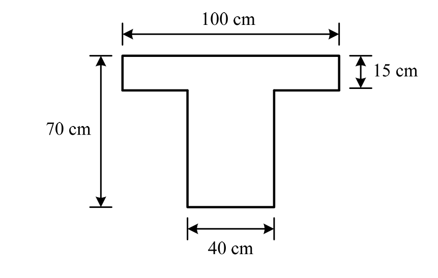

# 考題編號：RC-2015-3

**主分類：** `RC-U1-1` RC 梁彎矩強度分析與設計  
**副分類：** （無）  
**設計法：** USD強度設計法  
**標籤：** `T型梁` `負彎矩` `雙筋梁` `腹板矩形等效` `壓縮區在腹板` `εt=0.004限制` `分步設計法`

---

## 1. 原始題目重述（Problem Restatement）

T 型 RC 梁斷面，幾何條件如下：

| 項目 | 數值 |
|------|------|
| 翼板寬 $b_f$ | 100 cm |
| 翼板厚 $t_f$ | 15 cm |
| 腹板寬 $b_w$ | 40 cm |
| 梁總深 $h$ | 70 cm |
| 鋼筋保護層深度 $d'$ | 7 cm（從各受力面量起） |
| 有效深度 $d$ | $h - d' = 70 - 7 = 63$ cm |
| $f'_c$ | 350 kgf/cm² |
| $f_y$ | 4200 kgf/cm² |



*圖說：T 型斷面，頂部翼板 bf = 100 cm、tf = 15 cm，腹板 bw = 40 cm，全梁深 h = 70 cm。負彎矩時翼板在拉力側，腹板在壓力側。*

**試求：** 此 T 型梁斷面在承受極限負彎矩 $M_u = -150$ tf-m 時所需之抗彎鋼筋（As 與 A's）。（20 分）

---

## 2. 考題核心精神與出題者意圖（Core Concepts & Examiner's Intent）

**核心觀念：** T 型梁在**負彎矩**下，壓力區在腹板（下方），翼板在拉力側（不參與受壓）。此時設計等效為**矩形梁 b = bw = 40 cm**。由於 Mu = 150 tf·m 超過單筋矩形梁（b=40, d=63）的最大設計彎矩，需設計雙筋梁，在底面加入壓力鋼筋 A's。

**出題者意圖：**
- 測驗考生是否知道「T 型梁負彎矩 = 矩形腹板受壓」的關鍵判斷
- 測驗雙筋梁設計流程（分步法：先單筋設計到 εt = 0.004 上限，剩餘彎矩由壓力鋼筋承擔）
- 測驗 φ 值於 εt = 0.004 的正確計算

---

## 3. 解題戰略地圖與陷阱分析（Strategic Roadmap & Trap Analysis）

**關鍵判斷：負彎矩下的等效壓縮區**

```
Mu = -150 tf·m（負彎矩）
→ 翼板在上方（拉力側）→ 不貢獻壓力
→ 壓力區：腹板（矩形，b = bw = 40 cm）
→ 等效為矩形梁：b = 40 cm，d = 63 cm
```

**作戰計畫（三步驟）：**

```
Step 1  確認等效斷面（b = bw = 40 cm）
        計算單筋最大彎矩 φMn,1（εt = 0.004）
        → 109.6 tf·m < Mu = 150 tf·m → 需雙筋
   ↓
Step 2  計算壓力鋼筋 A's（由剩餘彎矩設計）
        確認壓力鋼筋降伏（ε's > εy）
   ↓
Step 3  計算總拉力鋼筋 As = As,1 + ΔAs
        驗算 φMn ≥ Mu
```

**關鍵陷阱（四個）：**

| # | 陷阱 | 正確做法 |
|---|------|---------|
| ① | 負彎矩仍用全翼板寬 100 cm 計算壓力 | 壓力在腹板，b = **bw = 40 cm** |
| ② | 中性軸在翼板（正彎矩邏輯套用負彎矩） | 負彎矩下翼板在拉力側，壓力區是腹板 |
| ③ | 壓力鋼筋淨力未扣混凝土占位 | $C'_s = A'_s(f'_s - 0.85f'_c)$ |
| ④ | φ = 0.9（誤以為拉力控制） | εt = 0.004 在過渡區，φ = 0.817 |

---

## 3.5 變數層次分析（Variable Hierarchy Analysis）

> 複習提示：第一次解題後，在每個卡住的知識點旁標記 `⚠`；第二次複習時只看有 `⚠` 的項目。

### 最終目標

設計 T 型梁（負彎矩下等效矩形腹板）的雙筋斷面：求 As（拉力，上方）與 A's（壓力，下方）。

### 本題關鍵公式（依計算順序）

$$\text{Step 1:}\quad c_{\max} = \frac{3}{7}\,d,\quad a_{\max} = \beta_1\,\boxed{c_{\max}}$$

$$\text{Step 2:}\quad \varphi M_{n,1} = \varphi\,C_c\!\left(d - \tfrac{a_{\max}}{2}\right),\quad C_c = 0.85\,f'_c\,\boxed{a_{\max}}\,b_w$$

$$\text{Step 3:}\quad \Delta M_u = M_u - \varphi M_{n,1}$$

$$\text{Step 4:}\quad A'_s = \frac{\Delta M_u}{\varphi\,(f'_y - 0.85f'_c)(d - d')}$$

$$\text{Step 5:}\quad A_s = \underbrace{\frac{C_c}{f_y}}_{A_{s,1}} + \underbrace{\frac{A'_s(f'_y - 0.85f'_c)}{f_y}}_{\Delta A_s}$$

### L1：題目直接給定

| 符號 | 數值 | 說明 |
|------|------|------|
| $b_f, t_f$ | 100, 15 cm | 翼板幾何（負彎矩時在拉力側） |
| $b_w$ | 40 cm | 腹板寬（負彎矩時的壓縮寬度） |
| $h$ | 70 cm | 梁總深 |
| $d'$ | 7 cm | 從受力面到鋼筋形心距離 |
| $d$ | 63 cm | 有效深度（70−7） |
| $f'_c, f_y$ | 350, 4200 kgf/cm² | 材料強度 |
| $M_u$ | 150 tf·m（取絕對值） | 負彎矩設計值 |

### L2：需知識點推導

**▎負彎矩等效斷面判斷**

| 符號 | 公式／來源 | 卡關? |
|------|-----------|-------|
| 等效壓縮寬度 | $b_w = 40$ cm（翼板在拉力側，不貢獻壓力） | |
| $\beta_1$ | $0.85 - 0.05 \times (350-280)/70 = 0.80$ | |

**▎單筋最大彎矩（Step 1-2）**

| 符號 | 公式／來源 | 卡關? |
|------|-----------|-------|
| $c_{\max}$ | $3d/7 = 27$ cm | |
| $a_{\max}$ | $0.80 \times 27 = 21.6$ cm | |
| $C_c$ | $0.85 \times 350 \times 21.6 \times 40$ | |
| $\varphi M_{n,1}$ | $0.817 \times C_c(d - a_{\max}/2)$ | |

**▎壓力鋼筋設計（Step 3-5）**

| 符號 | 公式／來源 | 卡關? |
|------|-----------|-------|
| $\Delta M_u$ | $M_u - \varphi M_{n,1}$ | |
| $\varepsilon'_s$ | $0.003(c_{\max} - d')/c_{\max}$（驗算是否降伏） | |
| $A'_s$ | $\Delta M_u / [\varphi(f_y - 0.85f'_c)(d-d')]$ | |
| $\Delta A_s$ | $A'_s(f_y - 0.85f'_c)/f_y$（對應壓力鋼筋的額外拉力鋼筋） | |
| $A_s$ | $C_c/f_y + \Delta A_s$ | |

### L3：深層知識（不懂就卡住）

| 知識點 | 說明 | 卡關? |
|--------|------|-------|
| 負彎矩下 T 型梁 = 矩形腹板 | 翼板在拉力側，混凝土不計拉力，壓縮區退化為 b = bw 的矩形梁 | |
| 雙筋梁「分步設計法」 | Step 1：單筋承擔到最大（εt=0.004），Step 2：剩餘由壓力鋼筋承擔，總 c 不變 | |
| 壓力鋼筋降伏驗算 | 加入 A's 後，NA 不變（c=27 cm），故 ε's 不變，需再確認 ε's ≥ εy | |
| 為何 c 不變 | 分步設計法中，壓力鋼筋提供額外力矩，NA 保持在 c=27 cm，εt 仍為 0.004 | |

---

## 4. 步驟化詳細計算過程（Step-by-Step Detailed Calculation）

### Step 0：確認負彎矩下之等效斷面

> **策略關鍵：** 負彎矩 → 翼板（上）在拉力側 → 壓力區僅腹板（矩形，b = bw = 40 cm）。

$$\beta_1 = 0.85 - 0.05 \times \frac{350-280}{70} = \boxed{0.80},\quad \varepsilon_y = \frac{4200}{2{,}040{,}000} = 0.00206$$

等效計算斷面：$b = b_w = 40$ cm，$d = 63$ cm，$d' = 7$ cm

---

### Step 1：單筋最大彎矩（εt = 0.004 控制）

$$c_{\max} = \frac{3}{7} \times 63 = \boxed{27 \text{ cm}},\quad a_{\max} = 0.80 \times 27 = \boxed{21.6 \text{ cm}}$$

$$C_c = 0.85 \times 350 \times 21.6 \times 40 = 297.5 \times 21.6 \times 40 = \boxed{257{,}040 \text{ kgf}}$$

$$\varphi = 0.65 + \frac{0.004-0.002}{0.003} \times 0.25 = 0.65 + 0.167 = \boxed{0.817}$$

$$\varphi M_{n,1} = 0.817 \times 257{,}040 \times \left(63 - \frac{21.6}{2}\right) = 0.817 \times 257{,}040 \times 52.2$$

$$= 0.817 \times 13{,}417{,}488 = 10{,}962{,}087 \text{ kgf·cm} = \boxed{109.6 \text{ tf·m}}$$

**判斷：** $\varphi M_{n,1} = 109.6$ tf·m $< M_u = 150$ tf·m → **需加壓力鋼筋（雙筋梁設計）**

---

### Step 2：壓力鋼筋 A's 設計

剩餘設計彎矩：
$$\Delta M_u = 150.0 - 109.6 = 40.4 \text{ tf·m} = 4{,}040{,}000 \text{ kgf·cm}$$

先確認壓力鋼筋是否降伏（c = 27 cm 不變）：
$$\varepsilon'_s = 0.003 \times \frac{c_{\max} - d'}{c_{\max}} = 0.003 \times \frac{27 - 7}{27} = 0.003 \times \frac{20}{27} = 0.00222 > \varepsilon_y = 0.00206$$

$$\Rightarrow \boxed{f'_s = f_y = 4{,}200 \text{ kgf/cm}^2 \text{（壓力鋼筋降伏）}}$$

由壓力鋼筋力矩求 A's：
$$\varphi \cdot A'_s \cdot (f_y - 0.85f'_c) \cdot (d - d') = \Delta M_u$$

$$0.817 \times A'_s \times (4{,}200 - 297.5) \times (63 - 7) = 4{,}040{,}000$$

$$0.817 \times A'_s \times 3{,}902.5 \times 56 = 4{,}040{,}000$$

$$0.817 \times 218{,}540 \times A'_s = 4{,}040{,}000$$

$$178{,}547 \times A'_s = 4{,}040{,}000$$

$$\boxed{A'_s = 22.63 \text{ cm}^2 \text{（壓力鋼筋，位於底面以上 } d' = 7 \text{ cm）}}$$

---

### Step 3：總拉力鋼筋 As

對應單筋部分之拉力鋼筋：
$$A_{s,1} = \frac{C_c}{f_y} = \frac{257{,}040}{4{,}200} = 61.20 \text{ cm}^2$$

對應壓力鋼筋之額外拉力鋼筋（力平衡）：
$$\Delta A_s = \frac{A'_s \cdot (f_y - 0.85f'_c)}{f_y} = \frac{22.63 \times 3{,}902.5}{4{,}200} = \frac{88{,}294}{4{,}200} = 21.02 \text{ cm}^2$$

$$\boxed{A_s = A_{s,1} + \Delta A_s = 61.20 + 21.02 = 82.22 \text{ cm}^2 \text{（拉力鋼筋，位於頂面以下 } d' = 7 \text{ cm）}}$$

---

### Step 4：驗算

力平衡：
$$C_c + A'_s(f_y - 0.85f'_c) = 257{,}040 + 22.63 \times 3{,}902.5 = 257{,}040 + 88{,}294 = 345{,}334 \text{ kgf}$$

$$A_s \times f_y = 82.22 \times 4{,}200 = 345{,}324 \text{ kgf} \approx 345{,}334 \quad \checkmark$$

設計彎矩：
$$\varphi M_n = 0.817 \times \left[257{,}040 \times 52.2 + 22.63 \times 3{,}902.5 \times 56\right]$$

$$= 0.817 \times \left[13{,}417{,}488 + 4{,}945{,}487\right] = 0.817 \times 18{,}362{,}975$$

$$= \boxed{15{,}002{,}551 \text{ kgf·cm} \approx 150.0 \text{ tf·m} \geq M_u = 150 \text{ tf·m} \quad \checkmark}$$

---

### 設計結果彙整

| 鋼筋 | 面積 | 位置 | 說明 |
|------|------|------|------|
| 拉力鋼筋 $A_s$ | **82.22 cm²** | 頂部，$d' = 7$ cm 以下 | 分佈於頂部翼板區 |
| 壓力鋼筋 $A'_s$ | **22.63 cm²** | 底部，$d' = 7$ cm 以上 | 位於腹板底端 |
| 中性軸深度 $c$ | 27 cm | — | $\varepsilon_t = 0.004$，過渡區 |
| 強度折減係數 $\varphi$ | 0.817 | — | $\varepsilon_t = 0.004$ |

---

## 5. 關鍵爭議點與進階探討（Critical Issues & Advanced Discussion）

### 爭議 1：負彎矩時翼板可否計入受壓？

對於正彎矩（翼板受壓），T 型梁的有效壓縮翼板寬度按規範取值，可大幅增加壓縮面積。  
對於**負彎矩（翼板受拉）**，翼板不計入壓縮，壓縮區僅為矩形腹板（b = bw），設計彎矩容量大幅縮小。

### 爭議 2：拉力鋼筋 As = 82.22 cm² 的實際配置

負彎矩的拉力鋼筋通常分佈在頂部（連續梁支承區），包含：
- **翼板拉力筋：** 分布於翼板寬度（bf = 100 cm）內，承擔翼板拉力
- ACI 規定：在有效翼板寬度範圍內分佈鋼筋（細部規定見 ACI 318-19 §9.7.3）

實際分配時，82.22 cm² 的拉力筋應均勻分布在頂部翼板區，以確保有效承拉。

### 單筋設計的容量上限（對照）

| 設計方式 | 壓縮寬度 | 最大 φMn（εt=0.004） |
|---------|---------|:---:|
| 負彎矩（腹板受壓） | bw = 40 cm | 109.6 tf·m |
| 正彎矩（翼板受壓，假設 a ≤ tf） | bf = 100 cm | >> 150 tf·m |

T 型梁在正彎矩下容量遠大於負彎矩，這是連續梁設計中的典型不對稱性。
