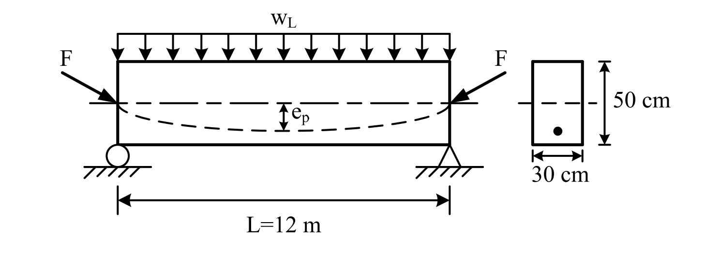

# 考題編號：RC-2015-4

**主分類：** `RC-U4-2` 預力量與偏心量設計  
**副分類：** `RC-U4-1` 預力梁斷面應力分析  
**設計法：** WSD工作應力法  
**標籤：** `後拉法` `拋物線腱` `端部無偏心` `四控制條件` `容許應力設計` `最大活載重` `簡支預力梁` `核心距`

---

## 1. 原始題目重述（Problem Restatement）

後拉法（post-tensioned）預力混凝土簡支矩形梁，條件如下：

| 項目 | 數值 |
|------|------|
| 斷面寬 $b$ | 30 cm |
| 斷面深 $h$ | 50 cm |
| 跨度 $L$ | 12 m |
| 混凝土設計強度 $f'_c$ | 350 kgf/cm² |
| 鋼鍵配置 | 拋物線，端部無偏心，跨中偏心量 $e_p$ |
| 容許壓應力 $f_{ca}$ | 140 kgf/cm² |
| 容許拉應力 $f_{ta}$ | 0 kgf/cm²（全程不允許拉應力） |

施預力時與全部載重時，容許應力條件均相同。



*圖說：簡支梁跨度 L = 12 m，受均佈活載重 wL，預力 F 在端部沿軸線施加（偏心 = 0），鋼鍵以拋物線下偏至跨中偏心 ep。斷面矩形，寬 30 cm × 深 50 cm。*

**試求：** 為使此梁承受最大均佈活載重 $w_{L,\max}$，試分析最優之預力 $F$ 值、跨中偏心量 $e_p$ 值及最大活載重 $w_{L,\max}$。（20 分）

---

## 2. 考題核心精神與出題者意圖（Core Concepts & Examiner's Intent）

**核心觀念：** 預力梁在「施預力時」與「服務載重時」各有頂底纖維的應力限制，共四個邊界條件（允許壓應力上限、禁止拉應力）。**同時啟動四個邊界條件**（頂底各達極限），斷面應力空間被最充分利用，此時可承受之活載重最大、預力量最小。

**出題者意圖：**
- 測驗容許應力設計的四個邊界條件的建立能力
- 測驗聯立方程組解 F 與 ep 的能力
- 測驗從「最大活載重」反求 ML 再求 wLmax 的思路

---

## 3. 解題戰略地圖與陷阱分析（Strategic Roadmap & Trap Analysis）

**四個關鍵應力邊界條件（同時啟動 → 最優設計）：**

```
[施預力時（wD 作用）]           [全部載重時（wD + wLmax）]
頂部：fta = 0（不拉）           頂部：fca = 140（最大壓）
底部：fca = 140（最大壓）       底部：fta = 0（不拉）
```

**作戰計畫（四步驟）：**

```
Step 1  計算斷面性質（A、S、對稱性）
        計算梁自重 wD 與跨中彎矩 MD
   ↓
Step 2  建立四個應力邊界方程，以「頂底對稱」簡化
        → 三個方程：聯立解 F、ep、ML
   ↓
Step 3  由 ML 反求 wLmax
   ↓
Step 4  驗算四個應力條件均滿足
```

**關鍵陷阱（四個）：**

| # | 陷阱 | 正確做法 |
|---|------|---------|
| ① | 忘記自重 wD | 自重恆在，施預力時已有 MD，不能只考慮 wLmax |
| ② | 只列 2 個條件（設計保守） | 四個條件同時啟動 → 最優（最大 wLmax） |
| ③ | 應力公式符號弄錯 | 壓正拉負；偏心在形心下方 → 底部多壓、頂部少壓 |
| ④ | 跨中與端部混淆 | 端部 e=0（僅 F/A）；跨中 e=ep（F/A ± F·ep/S） |

---

## 3.5 變數層次分析（Variable Hierarchy Analysis）

> 複習提示：第一次解題後，在每個卡住的知識點旁標記 `⚠`；第二次複習時只看有 `⚠` 的項目。

### 最終目標

找最優預力力量 F、跨中偏心量 ep，使梁可承受最大均佈活載重 wLmax，同時全程不超過容許應力範圍。

### 本題關鍵公式（依計算順序）

$$\text{Step 1:}\quad A = bh,\ S_t = S_b = \frac{bh^2}{6},\ w_D = \gamma_c bh,\ M_D = \frac{w_D L^2}{8}$$

$$\text{Step 2（施預力時頂）:}\quad \frac{F}{A} - \frac{F\,e_p}{S} + \frac{M_D}{S} = 0$$

$$\text{Step 3（全部載重時底）:}\quad \frac{F}{A} + \frac{F\,e_p}{S} - \frac{M_D + M_L}{S} = 0$$

$$\text{Step 4（兩式相加）:}\quad \frac{2F}{A} = \frac{M_L}{S} \quad\Rightarrow\quad F = \frac{M_L \cdot A}{2S}$$

$$\text{Step 5（由頂部條件）:}\quad \frac{F\,e_p}{S} = f_{ca} - \frac{F}{A} + \frac{M_D}{S} \quad\Rightarrow\quad e_p$$

$$\text{Step 6:}\quad M_L = f_{ca} \cdot S \quad\Rightarrow\quad w_{L,\max} = \frac{8 M_L}{L^2}$$

### L1：題目直接給定

| 符號 | 數值 | 說明 |
|------|------|------|
| $b, h$ | 30, 50 cm | 矩形斷面 |
| $L$ | 12 m = 1200 cm | 跨度 |
| $f'_c$ | 350 kgf/cm² | 混凝土設計強度 |
| $f_{ca}$ | 140 kgf/cm² | 全程容許壓應力 |
| $f_{ta}$ | 0 kgf/cm² | 全程容許拉應力（不允許） |
| 腱形 | 端部無偏心，拋物線到跨中 ep | 幾何條件 |

### L2：需知識點推導

| 符號 | 公式／來源 | 卡關? |
|------|-----------|-------|
| $A$ | $30 \times 50 = 1{,}500$ cm² | |
| $S_t = S_b$ | $30 \times 50^2/6 = 12{,}500$ cm³ | |
| $w_D$ | $2{,}400 \times 0.30 \times 0.50 = 360$ kgf/m（自重） | |
| $M_D$ | $w_D L^2/8 = 360 \times 144/8 = 648{,}000$ kgf·cm | |
| $M_L$ | 由四條件聯立：$M_L = f_{ca} \times S$ | |
| $F$ | 由聯立：$F = M_L \cdot A/(2S) = f_{ca} \cdot A/2$ | |
| $e_p$ | 由頂部條件：$e_p = (f_{ca}/2 + M_D/S) \times S/F$ | |
| $w_{L,\max}$ | $8M_L/L^2$ | |

### L3：深層知識（不懂就卡住）

| 知識點 | 說明 | 卡關? |
|--------|------|-------|
| 四個應力邊界同時啟動 = 最優設計 | 若只啟動 2 個條件，仍有裕度，代表沒用到最大容量；同時啟動 4 個才是最優 | |
| 對稱斷面的簡化 | $S_t = S_b$（矩形對稱），聯立方程中的「加減消去法」特別簡潔 | |
| 端部 e=0 的應力 | 端部只有軸壓 $F/A$，自動滿足 $0 \leq F/A \leq f_{ca}$ | |
| 四條件聯立的物理意義 | 施預力時底部壓力最大（自重使底部「卸荷」），服務載重時頂部壓力最大（活載加壓頂部）；這就是預力梁的「應力翻轉」設計原理 | |

---

## 4. 步驟化詳細計算過程（Step-by-Step Detailed Calculation）

### Step 1：斷面性質與自重

$$A = 30 \times 50 = 1{,}500 \text{ cm}^2$$

$$S_t = S_b = S = \frac{30 \times 50^2}{6} = \frac{75{,}000}{6} = \boxed{12{,}500 \text{ cm}^3} \quad \text{（矩形對稱，頂底相同）}$$

$$w_D = 2{,}400 \times 0.30 \times 0.50 = 360 \text{ kgf/m} = 0.36 \text{ tf/m}$$

$$M_D = \frac{w_D L^2}{8} = \frac{360 \times 12^2}{8} = \frac{360 \times 144}{8} = \boxed{648{,}000 \text{ kgf·cm} = 6.48 \text{ tf·m}}$$

---

### Step 2：建立四個應力邊界方程

> **規則：** 壓應力為正（+），拉應力為負（−）。鋼鍵在形心**以下** ep，正彎矩（wD, wL 向下）使頂壓底拉。

設 $a = F/A$（軸壓應力），$b_e = F \cdot e_p/S$（偏心彎矩應力）。

| 條件 | 纖維 | 公式（壓正拉負） | 邊界值 |
|------|------|----------------|--------|
| 施預力時（含 wD）| **頂**（拉力邊） | $a - b_e + M_D/S$ | $= f_{ta} = 0$ |
| 施預力時（含 wD）| **底**（壓力邊） | $a + b_e - M_D/S$ | $= f_{ca} = 140$ |
| 全部載重時（wD+wL）| **頂**（壓力邊） | $a - b_e + (M_D+M_L)/S$ | $= f_{ca} = 140$ |
| 全部載重時（wD+wL）| **底**（拉力邊） | $a + b_e - (M_D+M_L)/S$ | $= f_{ta} = 0$ |

---

### Step 3：聯立求解 ML

**條件①（施預力頂）：**
$$a - b_e + M_D/S = 0 \quad\Rightarrow\quad a - b_e = -M_D/S \qquad \cdots (1)$$

**條件④（全部載重底）：**
$$a + b_e - (M_D + M_L)/S = 0 \quad\Rightarrow\quad a + b_e = (M_D + M_L)/S \qquad \cdots (4)$$

(1) + (4)：
$$2a = \frac{M_L}{S}$$

**條件②（施預力底）：**
$$a + b_e - M_D/S = 140 \quad\Rightarrow\quad a + b_e = 140 + M_D/S \qquad \cdots (2)$$

**條件③（全部載重頂）：**
$$a - b_e + (M_D + M_L)/S = 140 \quad\Rightarrow\quad a - b_e = 140 - (M_D + M_L)/S \qquad \cdots (3)$$

(2) + (3)：
$$2a = 280 - M_L/S$$

由兩個 $2a$ 的表達式相等：
$$\frac{M_L}{S} = 280 - \frac{M_L}{S}$$

$$\frac{2M_L}{S} = 280 \quad\Rightarrow\quad M_L = 140 \times S = 140 \times 12{,}500 = \boxed{1{,}750{,}000 \text{ kgf·cm} = 17.5 \text{ tf·m}}$$

---

### Step 4：求 F（預力）

$$2a = \frac{M_L}{S} = \frac{1{,}750{,}000}{12{,}500} = 140 \text{ kgf/cm}^2$$

$$a = \frac{F}{A} = 70 \text{ kgf/cm}^2$$

$$\boxed{F = 70 \times 1{,}500 = 105{,}000 \text{ kgf} = 105 \text{ tf}}$$

---

### Step 5：求 ep（跨中偏心量）

由條件①：
$$a - b_e = -M_D/S \quad\Rightarrow\quad b_e = a + M_D/S = 70 + \frac{648{,}000}{12{,}500} = 70 + 51.84 = 121.84 \text{ kgf/cm}^2$$

$$b_e = \frac{F \cdot e_p}{S} = 121.84$$

$$e_p = \frac{121.84 \times S}{F} = \frac{121.84 \times 12{,}500}{105{,}000} = \frac{1{,}523{,}000}{105{,}000} = \boxed{14.50 \text{ cm}}$$

---

### Step 6：求 wLmax（最大均佈活載重）

$$M_L = \frac{w_{L,\max} \cdot L^2}{8}$$

$$w_{L,\max} = \frac{8 M_L}{L^2} = \frac{8 \times 1{,}750{,}000 \text{ kgf·cm}}{(1200 \text{ cm})^2} = \frac{14{,}000{,}000}{1{,}440{,}000} = \boxed{9.72 \text{ kgf/cm} = 972 \text{ kgf/m} \approx 0.972 \text{ tf/m}}$$

---

### Step 7：驗算四個應力條件

$a = 70$ kgf/cm²，$b_e = 121.84$ kgf/cm²，$M_D/S = 51.84$ kgf/cm²，$(M_D+M_L)/S = 191.84$ kgf/cm²

| 條件 | 計算式 | 結果 | 限制 | 判斷 |
|------|--------|------|------|------|
| 施預力時－頂 | $70 - 121.84 + 51.84$ | $= 0$ | $\geq 0$ | ✅ |
| 施預力時－底 | $70 + 121.84 - 51.84$ | $= 140$ | $\leq 140$ | ✅ |
| 全部載重－頂 | $70 - 121.84 + 191.84$ | $= 140$ | $\leq 140$ | ✅ |
| 全部載重－底 | $70 + 121.84 - 191.84$ | $= 0$ | $\geq 0$ | ✅ |

---

### 設計結果彙整

$$\boxed{F = 105 \text{ tf},\quad e_p = 14.50 \text{ cm},\quad w_{L,\max} = 0.972 \text{ tf/m}}$$

---

## 5. 關鍵爭議點與進階探討（Critical Issues & Advanced Discussion）

### 四個條件的物理意義：預力梁的「應力翻轉」

| 時機 | 頂纖維 | 底纖維 | 原因 |
|------|:------:|:------:|------|
| 施預力時（僅 wD） | 達零拉（拉力邊界） | 達最大壓 | 偏心預力產生頂拉底壓，自重彎矩（頂壓底拉）部分抵消，最終頂部最危險 |
| 全部載重時 | 達最大壓（壓力邊界） | 達零拉 | 活載重彎矩（頂壓底拉）使頂部趨向壓力飽和，底部趨向零拉 |

這種「施預力時底部最大壓、服務時頂部最大壓」的設計，使斷面的壓應力容量被最充分利用——這是預力梁「彈性核」（core）設計的精髓。

### 端部應力驗算

端部鋼鍵偏心為 0，端部應力 = $F/A = 70$ kgf/cm²（均勻壓縮），介於 0 至 140 kgf/cm² 之間，自動滿足。

### 幾何可行性

$e_p = 14.50$ cm，形心在斷面中央（25 cm 處），鋼鍵距底面 = $25 - 14.50 = 10.50$ cm，留有足夠保護層（通常 5∼7 cm），幾何上可行。
