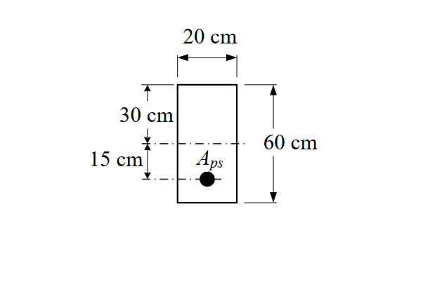

# 考題編號：RC-2016-4

**主分類：** `RC-U4-3` 預力損失  
**副分類：** `RC-U4-1` 預力梁斷面應力分析  
**設計法：** WSD工作應力法  
**標籤：** `先拉法` `彈性縮短損失` `初施預力` `斷面應力分析` `裂縫判斷` `壓應力檢核` `矩形斷面` `n值計算`

---

## 1. 原始題目重述（Problem Restatement）

某預力梁矩形斷面，斷面尺寸為 **20 cm（寬）× 60 cm（深）**，預力鋼鍵置於斷面中心以下 15 cm 處。

**斷面與材料條件：**

| 項目 | 數值 |
|------|------|
| 斷面寬 $b$ | 20 cm |
| 斷面深 $h$ | 60 cm |
| 偏心距 $e$（離斷面中心） | 15 cm（Aps 在形心以下） |
| 鋼鍵總面積 $A_{ps}$ | 3.95 cm² |
| 鋼鍵抗拉強度 $f_{pu}$ | 19,000 kgf/cm² |
| 混凝土設計強度 $f'_c$ | 350 kgf/cm² |
| 彈性模數比值 $n$ | 6 |
| 初施預力 $f_{pi}$ | $0.7\,f_{pu} = 13{,}300$ kgf/cm² |
| 初施預力時混凝土強度 $f'_{ci}$ | $0.7\,f'_c = 245$ kgf/cm² |



*圖說：矩形斷面 20 cm × 60 cm，形心軸（中性軸）距頂面 30 cm；Aps = 3.95 cm² 位於距頂面 45 cm 處，偏心距 e = 15 cm。*

**試求：**
1. 初施預力時，混凝土彈性收縮造成之預力損失 $\Delta f_{pES}$
2. 彈性收縮後，混凝土頂部與底部纖維之應力
3. 判斷混凝土是否開裂（開裂）或受壓過多

---

## 2. 考題核心精神與出題者意圖（Core Concepts & Examiner's Intent）

**核心觀念：** 預力傳遞給混凝土的瞬間，混凝土因受壓而彈性縮短，鋼鍵隨之縮短，預力因此減少。這是「立即損失」的核心，也是先拉法的標誌性損失項目。

**出題者意圖：**
- 測驗彈性縮短損失公式的正確應用：$\Delta f_{pES} = n \cdot f_{cpa}$
- 測驗斷面應力的組合（軸壓 + 偏心彎矩）：$f = \frac{P_e}{A} \pm \frac{P_e \cdot e \cdot y}{I}$
- 測驗容許應力判斷能力：開裂（抗拉）與受壓過多（抗壓）

**關鍵陷阱預告：**
- $f_{cpa}$ 必須是 **Aps 形心位置處的混凝土壓應力**，不是斷面最大壓應力
- 頂部纖維因偏心效應會出現**拉應力**，須與開裂強度 $f_r = 2\sqrt{f'_{ci}}$ 比較
- 底部纖維為最大壓應力，須與 $0.60\,f'_{ci}$ 比較
- 彈性收縮後的有效預力 $P_e$（而非 $P_i$）用於計算斷面應力

---

## 3. 解題戰略地圖與陷阱分析（Strategic Roadmap & Trap Analysis）

**作戰計畫（五步驟）：**

```
Step 1  計算斷面幾何性質（A、I、yt、yb）
   ↓
Step 2  計算初始預力合力 Pi，求 Aps 位置之混凝土應力 fcpa
   ↓
Step 3  彈性縮短損失：ΔfpES = n × fcpa（立即損失）
   ↓
Step 4  有效預力 Pe = (fpi - ΔfpES) × Aps，計算頂底纖維應力
   ↓
Step 5  判斷：ft vs. fr（開裂）、fb vs. 0.60 f'ci（受壓過多）
```

**陷阱分析（四個關鍵陷阱）：**

| # | 陷阱 | 正確做法 |
|---|------|---------|
| ① | 以 $P_i$ 計算斷面應力（忽略彈性縮短後的損失） | 計算 $\Delta f_{pES}$ → 得 $P_e$ → 再算斷面應力 |
| ② | $f_{cpa}$ 誤算為只有軸壓項 $P_i/A$ | $f_{cpa} = P_i/A + P_i e^2/I$（含偏心貢獻） |
| ③ | 開裂判斷用 $f'_{ci}$ 而非 $f_r = 2\sqrt{f'_{ci}}$ | 抗拉開裂強度為模數破裂 $f_r = 2\sqrt{f'_{ci}}$ |
| ④ | 忘記頂部纖維為拉應力（符號錯誤） | 偏心預力在頂部引起**拉力**，需特別注意 |

---

## 3.5 變數層次分析（Variable Hierarchy Analysis）

> 複習提示：第一次解題後，在每個卡住的知識點旁標記 `⚠`；第二次複習時只看有 `⚠` 的項目。

### 最終目標

計算初施預力時的彈性縮短預力損失，以及損失後混凝土頂底纖維應力，並判斷開裂與受壓過多。

### 本題關鍵公式（依計算順序）

$$\text{Step 1:}\quad A = b \cdot h,\quad I = \frac{b h^3}{12},\quad y_t = y_b = h/2$$

$$\text{Step 2:}\quad P_i = f_{pi} \cdot A_{ps}$$

$$\text{Step 3:}\quad f_{cpa} = \frac{P_i}{A} + \frac{P_i \cdot e^2}{I}$$

$$\text{Step 4:}\quad \Delta f_{pES} = n \cdot \boxed{f_{cpa}}$$

$$\text{Step 5:}\quad P_e = (f_{pi} - \boxed{\Delta f_{pES}}) \cdot A_{ps}$$

$$\text{Step 6:}\quad f_{top} = \frac{\boxed{P_e}}{A} - \frac{\boxed{P_e} \cdot e \cdot y_t}{I},\quad f_{bot} = \frac{\boxed{P_e}}{A} + \frac{\boxed{P_e} \cdot e \cdot y_b}{I}$$

$$\text{Step 7 判斷:}\quad f_{top}\ \text{(拉力)} \overset{?}{<} f_r = 2\sqrt{f'_{ci}},\quad f_{bot}\ \text{(壓力)} \overset{?}{<} 0.60\,f'_{ci}$$

### L1：題目直接給定

| 符號 | 數值 | 說明 |
|------|------|------|
| $b$ | 20 cm | 斷面寬 |
| $h$ | 60 cm | 斷面深 |
| $e$ | 15 cm | Aps 離斷面中心之偏心距 |
| $A_{ps}$ | 3.95 cm² | 鋼鍵總面積 |
| $f_{pu}$ | 19,000 kgf/cm² | 鋼鍵極限抗拉強度 |
| $f'_c$ | 350 kgf/cm² | 混凝土設計強度 |
| $f'_{ci}$ | 245 kgf/cm²（= $0.7f'_c$） | 初施預力時混凝土強度 |
| $n$ | 6 | 彈性模數比（$E_p/E_{ci}$） |
| $f_{pi}$ | 13,300 kgf/cm²（= $0.7f_{pu}$） | 初施預力（未扣損失） |

### L2：需知識點推導

**▎斷面幾何**

| 符號 | 公式／來源 | 卡關? |
|------|-----------|-------|
| $A$ | $b \cdot h = 20 \times 60$ | |
| $I$ | $\frac{b h^3}{12} = \frac{20 \times 60^3}{12}$ | |
| $y_t = y_b$ | $h/2 = 30$ cm（矩形對稱） | |

**▎初始預力與 fcpa**

| 符號 | 公式／來源 | 卡關? |
|------|-----------|-------|
| $P_i$ | $f_{pi} \times A_{ps}$ | |
| $f_{cpa}$ | $P_i/A + P_i e^2/I$（Aps 位置之混凝土壓應力） | |

**▎彈性縮短損失**

| 符號 | 公式／來源 | 卡關? |
|------|-----------|-------|
| $\Delta f_{pES}$ | $n \cdot f_{cpa}$（先拉法，全部鋼鍵同時損失） | |
| 損失率 | $\Delta f_{pES} / f_{pi} \times 100\%$ | |

**▎彈性縮短後之有效預力與斷面應力**

| 符號 | 公式／來源 | 卡關? |
|------|-----------|-------|
| $f_{pe}$ | $f_{pi} - \Delta f_{pES}$ | |
| $P_e$ | $f_{pe} \times A_{ps}$ | |
| $f_{top}$ | $P_e/A - P_e \cdot e \cdot y_t / I$（拉為負） | |
| $f_{bot}$ | $P_e/A + P_e \cdot e \cdot y_b / I$（壓為正） | |

**▎開裂與受壓過多判斷**

| 符號 | 公式／來源 | 卡關? |
|------|-----------|-------|
| $f_r$ | $2\sqrt{f'_{ci}}$（模數破裂強度，kgf/cm²） | |
| 壓應力上限 | $0.60\,f'_{ci}$（初施預力階段容許壓應力） | |

### L3：深層知識（不懂就卡住）

| 知識點 | 說明 | 卡關? |
|--------|------|-------|
| 先拉法彈性縮短機制 | 鋼鍵先張拉後鑄入混凝土，放張後混凝土受壓縮短，鋼鍵縮短量 = 混凝土縮短量，故損失 = $n \times f_{cpa}$ | |
| $f_{cpa}$ 的意義 | 不是斷面中性軸應力，而是**Aps 形心所在位置**的混凝土壓應力（含偏心彎矩貢獻） | |
| 偏心預力的應力方向 | 偏心在形心**以下**，使斷面頂部受**拉**、底部受**額外壓**；偏心預力在頂部同時產生軸壓（$P_e/A$，壓）和彎矩拉（$P_e e y_t/I$，拉），拉力通常大於軸壓 | |
| 開裂判斷依據 | 用模數破裂 $f_r = 2\sqrt{f'_{ci}}$（kgf/cm²），拉應力超過此值即開裂 | |
| 受壓過多判斷依據 | 初施預力階段容許壓應力 = $0.60\,f'_{ci}$（ACI 規範） | |

---

## 4. 步驟化詳細計算過程（Step-by-Step Detailed Calculation）

### Step 1：斷面幾何性質

$$A = 20 \times 60 = 1{,}200 \text{ cm}^2$$

$$I = \frac{20 \times 60^3}{12} = \frac{20 \times 216{,}000}{12} = 360{,}000 \text{ cm}^4$$

$$y_t = y_b = \frac{60}{2} = 30 \text{ cm}$$

Aps 位置：距頂面 = $30 + 15 = 45$ cm（距底面 = 15 cm）

---

### Step 2：初始預力合力

$$f_{pi} = 0.7 \times 19{,}000 = 13{,}300 \text{ kgf/cm}^2$$

$$P_i = f_{pi} \times A_{ps} = 13{,}300 \times 3.95 = \boxed{52{,}535 \text{ kgf}}$$

---

### Step 3：Aps 位置之混凝土應力 $f_{cpa}$

> **策略：** 僅考慮預力（無外載），Aps 所在位置受：(1) 均勻軸壓 $P_i/A$ 和 (2) 偏心彎矩在 Aps 位置處的附加壓力 $P_i e^2/I$，兩者均為壓力（同號）。

$$f_{cpa} = \frac{P_i}{A} + \frac{P_i \cdot e^2}{I}$$

$$= \frac{52{,}535}{1{,}200} + \frac{52{,}535 \times 15^2}{360{,}000}$$

$$= 43.78 + \frac{52{,}535 \times 225}{360{,}000}$$

$$= 43.78 + 32.83$$

$$= \boxed{76.61 \text{ kgf/cm}^2 \text{（壓）}}$$

---

### Step 4：彈性縮短預力損失

$$\Delta f_{pES} = n \cdot f_{cpa} = 6 \times 76.61 = \boxed{459.7 \text{ kgf/cm}^2}$$

損失率：
$$\frac{\Delta f_{pES}}{f_{pi}} = \frac{459.7}{13{,}300} = 3.46\%$$

---

### Step 5：彈性縮短後之有效預力

$$f_{pe} = f_{pi} - \Delta f_{pES} = 13{,}300 - 459.7 = 12{,}840.3 \text{ kgf/cm}^2$$

$$P_e = f_{pe} \times A_{ps} = 12{,}840.3 \times 3.95 = \boxed{50{,}719 \text{ kgf} \approx 50.72 \text{ tf}}$$

---

### Step 6：彈性收縮後混凝土頂底纖維應力

> **規則：** 壓應力為正（+），拉應力為負（−）

$$\frac{P_e}{A} = \frac{50{,}719}{1{,}200} = 42.27 \text{ kgf/cm}^2$$

$$\frac{P_e \cdot e \cdot y_t}{I} = \frac{50{,}719 \times 15 \times 30}{360{,}000} = \frac{22{,}823{,}550}{360{,}000} = 63.40 \text{ kgf/cm}^2$$

**頂部纖維（偏心預力在頂部引起拉力）：**

$$f_{top} = \frac{P_e}{A} - \frac{P_e \cdot e \cdot y_t}{I} = 42.27 - 63.40 = \boxed{-21.13 \text{ kgf/cm}^2 \text{（拉）}}$$

**底部纖維（偏心預力在底部引起額外壓力）：**

$$f_{bot} = \frac{P_e}{A} + \frac{P_e \cdot e \cdot y_b}{I} = 42.27 + 63.40 = \boxed{+105.67 \text{ kgf/cm}^2 \text{（壓）}}$$

---

### Step 7：開裂與受壓過多判斷

**（a）開裂判斷（頂部拉應力 vs. 模數破裂強度）：**

$$f_r = 2\sqrt{f'_{ci}} = 2\sqrt{245} = 2 \times 15.65 = 31.30 \text{ kgf/cm}^2$$

$$f_{top}(\text{拉}) = 21.13 \text{ kgf/cm}^2 < f_r = 31.30 \text{ kgf/cm}^2$$

$$\Rightarrow \boxed{\text{頂部纖維不開裂}}$$

**（b）受壓過多判斷（底部壓應力 vs. 容許壓應力）：**

$$0.60\,f'_{ci} = 0.60 \times 245 = 147 \text{ kgf/cm}^2$$

$$f_{bot}(\text{壓}) = 105.67 \text{ kgf/cm}^2 < 147 \text{ kgf/cm}^2$$

$$\Rightarrow \boxed{\text{底部纖維受壓未過多}}$$

**結論：** 初施預力彈性收縮後，頂部拉應力 21.13 kgf/cm² 未超過開裂強度，底部壓應力 105.67 kgf/cm² 未超過容許值，斷面安全。

---

### 計算結果彙整

| 項目 | 計算值 | 限制值 | 判斷 |
|------|--------|--------|------|
| 彈性縮短預力損失 $\Delta f_{pES}$ | 459.7 kgf/cm²（3.46%） | — | — |
| 頂部纖維應力 $f_{top}$ | 21.13 kgf/cm²（拉） | $f_r = 31.30$ kgf/cm² | ✅ 不開裂 |
| 底部纖維應力 $f_{bot}$ | 105.67 kgf/cm²（壓） | $0.60 f'_{ci} = 147$ kgf/cm² | ✅ 受壓未過多 |

---

## 5. 關鍵爭議點與進階探討（Critical Issues & Advanced Discussion）

### 爭議 1：$f_{cpa}$ 應用初始預力 $P_i$ 或有效預力 $P_e$？

嚴格而言，彈性縮短後的 $f_{cpa}$ 應用 $P_e$（損失後的力），但這形成循環計算。考場標準做法是**用 $P_i$ 近似計算 $f_{cpa}$**，誤差約 3–5%，為業界與考試認可的近似解。

### 爭議 2：先拉法 vs. 後拉法的彈性縮短差異

| 類型 | 彈性縮短損失 |
|------|------------|
| 先拉法（全部鋼鍵同時放張） | $\Delta f_{pES} = n \cdot f_{cpa}$（本題） |
| 後拉法（單一鋼鍵） | 等效地，幾乎無彈性縮短損失（千斤頂直接施力於已縮短的混凝土） |
| 後拉法（多鋼鍵依序張拉） | 約為先拉法的一半：$\Delta f_{pES} = \frac{n}{2} \cdot f_{cpa}$ |

本題給定 $n = 6$ 且不提千斤頂施拉條件，採先拉法公式處理。

### 進階：偏心對損失量的放大效應

如果鋼鍵位於形心（$e = 0$），則：
$$f_{cpa} = P_i/A = 43.78 \text{ kgf/cm}^2 \Rightarrow \Delta f_{pES} = 262.7 \text{ kgf/cm}^2$$

而本題偏心 $e = 15$ cm 使 $f_{cpa}$ 增加 $P_i e^2/I = 32.83$，導致損失多出 197 kgf/cm²（約75%增幅）。偏心越大，Aps 位置的混凝土壓應力越高，彈性縮短損失也越大。
