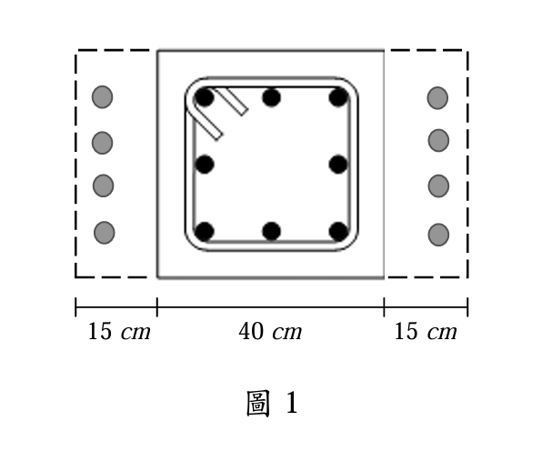
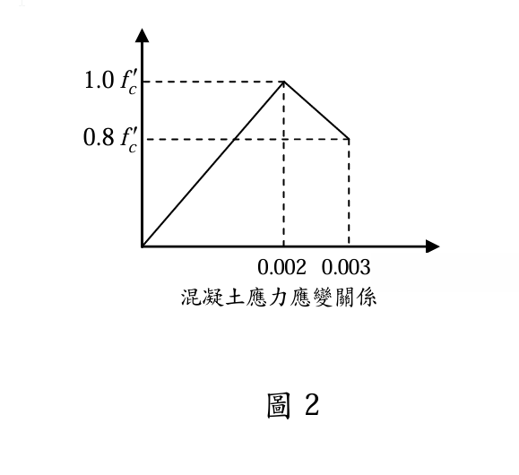

### 考題編號：RC-2017-1

**主分類：** `RC-U1-2` RC 柱強度分析與設計
**副分類：** 無
**設計法：** USD強度設計法
**標籤：** `加大柱` `組合截面` `軸壓強度` `雙折線應力應變` `最大可用軸力` `締箍柱` `最小偏心` `新舊混凝土`

---

## 1. 原始題目重述 (Problem Restatement)

**規範依據：** 中國土木水利工程學會「混凝土工程設計規範與解說」（土木 401-100）

一方形柱斷面原為 $40\text{ cm} \times 40\text{ cm}$，配有 $8$ 支 D25 鋼筋（$f_y = 4{,}200\text{ kgf/cm}^2$，$A_b = 5.067\text{ cm}^2$），如附圖1所示。混凝土強度 $f'_c = 210\text{ kgf/cm}^2$。

評估後發現必須將柱加大為 $40\text{ cm} \times 70\text{ cm}$（兩側各加寬 $15\text{ cm}$，斷面構成為 $15\text{ cm}|40\text{ cm}|15\text{ cm}$），使用常重混凝土（$f'_c = 210\text{ kgf/cm}^2$），鋼筋維持 $8$ 支 D25（$4$ 支集中於 $40\text{ cm}$ 面各端），保護層 $6.5\text{ cm}$（量至鋼筋中心）。

混凝土應力應變關係可簡化為雙折線（圖2）：

$$\text{上升段（}0 \leq \varepsilon_c \leq 0.002\text{）：} f_c = \frac{\varepsilon_c}{0.002} \cdot f'_c \quad(\text{線性至 }1.0f'_c)$$

$$\text{下降段（}0.002 \leq \varepsilon_c \leq 0.003\text{）：} f_c \text{ 線性自 } 1.0f'_c \text{ 降至 } 0.8f'_c$$

即在極限應變 $\varepsilon_{cu} = 0.003$ 時，$f_c = 0.8f'_c$。

**試求：**
1. 加大後柱在 $e = 0$（純軸壓）時的標稱軸壓強度 $P_n$，以及締箍柱最大可用設計軸力 $\phi P_{n,\max}$
2. 在**適當軸力**（平衡軸力 $P_{n,b}$）下，長邊（70 cm 方向）所能承受的**最大可能彎矩** $M_{n,b}$

（25分）

*圖說：原柱 $40\text{ cm} \times 40\text{ cm}$，兩側各擴增 $15\text{ cm}$ 新混凝土，加大後為 $40\text{ cm} \times 70\text{ cm}$；鋼筋 8 支 D25（$A_b = 5.067\text{ cm}^2$），保護層至鋼筋中心 $= 6.5\text{ cm}$，$f'_c = 210\text{ kgf/cm}^2$（新舊相同），$f_y = 4{,}200\text{ kgf/cm}^2$。*

*圖說：雙折線簡化模型；上升段 $0 \sim 0.002$ 線性至峰值 $1.0f'_c = 210\text{ kgf/cm}^2$；下降段 $0.002 \sim 0.003$ 線性降至 $0.8f'_c = 168\text{ kgf/cm}^2$；極限應變 $\varepsilon_{cu} = 0.003$ 對應混凝土應力 $= 0.8f'_c$。*

---

## 2. 考題核心精神與出題者意圖 (Core Concepts & Examiner's Intent)

**核心觀念：** 本題是「加大柱（Column Jacketing）」的軸壓強度計算，考驗兩項能力：

1. **雙折線直接讀取**：不使用 Whitney 矩形應力塊（$0.85f'_c$），而是根據題目提供的雙折線在 $\varepsilon_{cu} = 0.003$ 直接讀取 $f_c = 0.8f'_c$；
2. **締箍柱規範限制**：理解規範以 $0.80$ 係數（對應 $e_{\min} = 0.10h$）反映施工不可避免之偶然偏心，進而得到最大可用設計軸力 $\phi P_{n,\max}$。

**出題者意圖：**
- 測試學生是否能辨識「題目另給應力-應變模型時，不應自動套用 Whitney $0.85f'_c$」
- 測試「純軸壓標稱強度」與「最大可用設計軸力」兩個不同層次的概念

---

## 3. 解題戰略地圖與陷阱分析 (Strategic Roadmap & Trap Analysis)

**作戰計畫：**
1. 計算斷面幾何：$A_g$、$A_{st}$、$\rho_g$（確認在 1~8% 限制內）
2. 確認鋼筋降伏：$\varepsilon_{cu} = 0.003 > \varepsilon_y$？
3. 讀取雙折線：$\varepsilon_{cu} = 0.003 \Rightarrow f_c = 0.8f'_c$
4. 計算 $P_n(e=0)$
5. 套用締箍柱最大軸力限制：$\phi P_{n,\max} = 0.80 \times \phi \times P_n$

**關鍵陷阱：**

| # | 陷阱 | 正確做法 |
|---|------|---------| 
| 1 | **套用 Whitney $0.85f'_c$**：習慣直接用 ACI 矩形應力塊，忽略題目額外給定了雙折線模型 | 雙折線在 $\varepsilon_{cu}=0.003$ 直接給出 $f_c = \mathbf{0.8}f'_c$，不用 $0.85f'_c$ |
| 2 | **遺漏締箍柱 0.80 折減**：算完 $\phi P_n(e=0)$ 後直接報答，未考慮最小偏心 | 締箍柱最終答案 $= 0.80 \times \phi \times P_n$（螺旋柱為 $0.85$） |
| 3 | **$\phi$ 值誤用 0.9**：誤判為拉力控制 | $e=0$ 全截面受壓，壓力控制：締箍柱 $\phi = \mathbf{0.65}$ |
| 4 | **未扣除鋼筋面積**：$P_c = 0.8f'_c \times A_g$（錯），應用淨面積 | $P_c = 0.8f'_c \times (A_g - A_{st})$，鋼筋單獨計算 $P_s = f_y A_{st}$ |

---

## 3.5 變數層次分析 (Variable Hierarchy Analysis)

> 複習提示：第一次解題後，在每個卡住的知識點旁標記 `⚠`；第二次複習時只看有 `⚠` 的項目。

### 最終目標
`(a) Pn(e=0) 與 φPn,max；(c) 平衡點最大彎矩 Mn,b：須對雙折線應力分布進行分區積分`

### 本題關鍵公式（依計算順序）

> $\boxed{\cdot}$ = 需由前步驟推導，非題目直接給定的變數

$$\text{Step 1: } A_g = b \times h, \quad A_{st} = n \cdot A_b$$

$$\text{Step 2: } \varepsilon_y = \frac{f_y}{E_s} \quad \Rightarrow \quad \text{確認 }\varepsilon_{cu} > \varepsilon_y \Rightarrow f_s = f_y$$

$$\text{Step 3: 雙折線讀取：}\varepsilon_{cu} = 0.003 \Rightarrow f_c = 0.8f'_c$$

$$\text{Step 4: } P_n(e=0) = 0.8f'_c \cdot \left(\boxed{A_g} - \boxed{A_{st}}\right) + f_y \cdot \boxed{A_{st}}$$

$$\text{Step 5: } \phi P_{n,\max} = 0.80 \times \phi \times \boxed{P_n(e=0)}$$

### L1：題目直接給定

| 符號 | 數值 | 說明 |
|------|------|------|
| $b$ | 40 cm | 加大後柱寬 |
| $h$ | 70 cm | 加大後柱高（15+40+15 cm） |
| $n$ | 8 支 | D25 縱向鋼筋數量 |
| $A_b$ | 5.067 cm² | 單支 D25 鋼筋面積 |
| $f_y$ | 4,200 kgf/cm² | 鋼筋降伏強度 |
| $f'_c$ | 210 kgf/cm² | 混凝土強度（新舊相同） |
| $d'$ | 6.5 cm | 保護層至鋼筋中心 |
| $\varepsilon_{cu}$ | 0.003 | 混凝土極限應變（雙折線右端點） |
| $E_s$ | 2.04×10⁶ kgf/cm² | 鋼筋彈性模數（考卷給定） |

### L2：需知識點推導

**Step 1：斷面幾何**

| 符號 | 公式/來源 | 卡關? |
|------|----------|:-----:|
| $A_g$ | $40 \times 70 = 2{,}800\text{ cm}^2$ | |
| $A_{st}$ | $8 \times 5.067 = 40.54\text{ cm}^2$ | |
| $\rho_g$ | $40.54/2800 = 1.45\%$，介於 $1\%\sim8\%$ ✓ | |

**Step 2：鋼筋降伏確認**

| 符號 | 公式/來源 | 卡關? |
|------|----------|:-----:|
| $\varepsilon_y$ | $f_y / E_s = 4200 / 2{,}040{,}000 = 0.00206$ | |
| 判斷 | $\varepsilon_{cu} = 0.003 > \varepsilon_y = 0.00206$ → 鋼筋降伏 ✓ | |

**Step 3：雙折線極限應力讀取**

| 符號 | 公式/來源 | 卡關? |
|------|----------|:-----:|
| $f_c(\varepsilon_{cu})$ | 由圖2讀取：$\varepsilon=0.003$ 時 $f_c = 0.8f'_c = 0.8 \times 210 = 168\text{ kgf/cm}^2$ | |

**Step 4：標稱軸壓強度**

| 符號 | 公式/來源 | 卡關? |
|------|----------|:-----:|
| $P_c$ | $0.8f'_c \times (A_g - A_{st}) = 168 \times 2{,}759.46 = 463{,}589\text{ kgf}$ | |
| $P_s$ | $f_y \times A_{st} = 4{,}200 \times 40.54 = 170{,}268\text{ kgf}$ | |
| $P_n$ | $463{,}589 + 170{,}268 = 633{,}857\text{ kgf} \approx 634\text{ tf}$ | |

**Step 5：最大可用設計軸力**

| 符號 | 公式/來源 | 卡關? |
|------|----------|:-----:|
| $\phi$ | 0.65（締箍柱，壓力控制） | |
| $e_{\min}$ | $0.10h = 0.10 \times 70 = 7.0\text{ cm}$（對應 0.80 折減） | |
| $\phi P_{n,\max}$ | $0.80 \times 0.65 \times 634 = 329.7\text{ tf} \approx 330\text{ tf}$ | |

### L3：深層知識（不懂就卡住）

| 知識點 | 說明 | 卡關? |
|--------|------|:-----:|
| 雙折線 vs Whitney 差異 | Whitney 用 $0.85f'_c$ 作為等效矩形平均應力；本題雙折線在 $\varepsilon_{cu}=0.003$ 直接讀出 $0.8f'_c$，兩者差 6%，必須用題目給的模型 | |
| 締箍柱 0.80 的物理意義 | 代表最小偶然偏心 $e_{\min} \approx 0.10h$，規範要求即使設計為純軸壓，也不得超過 $0.80\phi P_n(e=0)$ | |
| 螺旋柱 vs 締箍柱係數差異 | 螺旋柱：$0.85\phi P_n$；締箍柱：$0.80\phi P_n$（螺旋圍束效果更好） | |
| $e=0$ 時不需計算中性軸 | 對稱截面受純軸力→全截面均勻壓縮→不需要建立應變分布圖，直接取 $\varepsilon_{cu}$ 代入 | |

---

## 4. 步驟化詳細計算過程 (Step-by-Step Detailed Calculation)

### 【前置】材料參數確認

$$f'_c = 210\text{ kgf/cm}^2,\quad f_y = 4{,}200\text{ kgf/cm}^2,\quad E_s = 2.04 \times 10^6\text{ kgf/cm}^2$$

$$\beta_1 = 0.85 \quad (f'_c = 210\text{ kgf/cm}^2 \leq 280\text{ kgf/cm}^2)$$

$$\text{規範：土木 401-100；締箍柱 }\phi = 0.65\text{（壓力控制）}$$

---

### 【Step 1】斷面幾何

加大後柱截面 $b \times h = 40\text{ cm} \times 70\text{ cm}$：

$$A_g = 40 \times 70 = \boxed{2{,}800\text{ cm}^2}$$

縱向鋼筋（8 支 D25，保護層至鋼筋中心 $d' = 6.5\text{ cm}$，4 支集中於截面兩端）：

$$A_{st} = 8 \times 5.067 = \boxed{40.54\text{ cm}^2}$$

**配筋率驗核：**
$$\rho_g = \frac{A_{st}}{A_g} = \frac{40.54}{2{,}800} = 1.45\% \quad \Rightarrow \quad 1\% \leq 1.45\% \leq 8\% \quad \checkmark$$

---

### 【Step 2】確認鋼筋降伏

$$\varepsilon_y = \frac{f_y}{E_s} = \frac{4{,}200}{2{,}040{,}000} = 0.002059$$

$$\varepsilon_{cu} = 0.003 > \varepsilon_y = 0.002059 \quad \Rightarrow \quad \text{所有縱筋均降伏，}f_s = f_y = 4{,}200\text{ kgf/cm}^2 \quad \checkmark$$

---

### 【Step 3】雙折線極限混凝土應力

由題目圖2，雙折線模型在 $\varepsilon_{cu} = 0.003$ 時：

$$f_c = 0.8f'_c = 0.8 \times 210 = \boxed{168\text{ kgf/cm}^2}$$

> 📝 **策略註解：** 此 $0.8f'_c$ 直接來自雙折線下降段終點，與 ACI Whitney 矩形應力塊的 $0.85f'_c$ 不同。在 $e=0$ 的均勻壓縮情況下，整個截面混凝土應力均等於此值，無需積分。

---

### 【Part (a)：純軸壓標稱強度 $P_n(e=0)$】

$e = 0$ 時，截面受均勻壓縮（全截面應變均為 $\varepsilon_{cu} = 0.003$）：

**混凝土承壓力：**
$$P_c = f_c \times (A_g - A_{st}) = 168 \times (2{,}800 - 40.54) = 168 \times 2{,}759.46 = 463{,}589\text{ kgf}$$

**鋼筋承壓力（已確認降伏）：**
$$P_s = f_y \times A_{st} = 4{,}200 \times 40.54 = 170{,}268\text{ kgf}$$

**標稱軸壓強度：**
$$\boxed{P_n(e=0) = 463{,}589 + 170{,}268 = 633{,}857\text{ kgf} \approx \mathbf{634\text{ tf}}}$$

---

### 【Part (b)：最大可用設計軸力 $\phi P_{n,\max}$】

依土木 401-100（ACI 318 §22.4.2.1），**締箍柱**設計軸力上限：

$$\phi P_{n,\max} = 0.80 \times \phi \times P_n(e=0)$$

其中：
- $\phi = 0.65$（締箍柱，壓力控制）  
- $0.80$ 係數：代表最小偶然偏心 $e_{\min} = 0.10h = 0.10 \times 70 = 7.0\text{ cm}$

$$\phi P_{n,\max} = 0.80 \times 0.65 \times 634 = 0.52 \times 634 = \boxed{\mathbf{329.7\text{ tf} \approx 330\text{ tf}}}$$

> 📝 **策略註解：** 此 $330\text{ tf}$ 為「最大可用」軸力—即使設計目標為純軸壓，規範亦不允許設計軸力超過此值；物理意義是承認任何施工都有不可避免的偶然偏心，以 $e_{\min} = 7.0\text{ cm}$ 加以保守修正。

---

### 【Part (c)：適當軸力下長邊最大可能彎矩 $M_{n,b}$】

「最大可能彎矩」對應 **P-M 交互曲線的頂點**，即平衡點（Balanced Point）：拉力鋼筋恰好達到降伏 $\varepsilon_t = \varepsilon_y$ 的同時，壓力面混凝土達到極限應變 $\varepsilon_{cu} = 0.003$。

#### 【c-1】平衡中性軸深度 $c_b$

線性應變分布（$\varepsilon_{cu}=0.003$ 在壓力面，$\varepsilon_t=\varepsilon_y=0.002059$ 在拉力鋼筋處 $d=63.5\text{ cm}$）：

$$\frac{\varepsilon_{cu}}{c_b} = \frac{\varepsilon_y}{d - c_b} \quad\Rightarrow\quad c_b = \frac{\varepsilon_{cu}}{{\varepsilon_{cu}+\varepsilon_y}}\cdot d = \frac{0.003}{0.003+0.002059}\times63.5 = \boxed{37.7\text{ cm}}$$

#### 【c-2】雙折線應力分布：三個關鍵深度

任意深度 $x$（由壓力面量起）的應變：$\varepsilon(x)=0.003(1 - x/37.7)$

| 位置 $x$ | 應變 $\varepsilon$ | 雙折線區段 | 混凝土應力 $f_c$ |
|:--------:|:-----------------:|:---------:|:----------------:|
| $x=0$（壓力面） | 0.003 | 下降段端點 | $0.8f'_c = 168$ kgf/cm² |
| $x_{\text{peak}}=12.57\text{ cm}$ | 0.002 | 轉折點（峰值） | $1.0f'_c = 210$ kgf/cm² |
| $x=37.7\text{ cm}$（中性軸） | 0 | 上升段端點 | 0 |

> 📝 **策略重點：** 雙折線模型的峰值應力不在壓力面，而在距壓力面 $c_b/3 = 12.57\text{ cm}$ 處！這與 Whitney 矩形應力塊完全不同，必須分兩段積分。

**各分段的應力表達式：**

- **下降段**（$0 \leq x \leq 12.57\text{ cm}$）：$f_c(x) = 168 + 3.34x$ （kgf/cm²，由 168 線性升至 210）
- **上升段**（$12.57\text{ cm} \leq x \leq 37.7\text{ cm}$）：$f_c(x) = 210\times\dfrac{37.7-x}{25.13}$（由 210 線性降至 0）

#### 【c-3】混凝土壓力合力 $C_c$ 及其作用點 $\bar{x}_c$

**分段一（梯形分布，底 168、頂 210，長度 12.57 cm）：**
$$C_1 = \frac{168+210}{2}\times12.57\times40 = 189\times12.57\times40 = \boxed{95{,}066\text{ kgf}}$$

梯形形心距壓力面：$\bar{x}_1 = 12.57\times\dfrac{168+2\times210}{3\times(168+210)} = 12.57\times\dfrac{588}{1134} = \boxed{6.52\text{ cm}}$

**分段二（三角形分布，底 210、頂 0，長度 25.13 cm）：**
$$C_2 = \frac{210}{2}\times25.13\times40 = 105\times25.13\times40 = \boxed{105{,}546\text{ kgf}}$$

三角形形心距壓力面：$\bar{x}_2 = 12.57 + \dfrac{25.13}{3} = 12.57 + 8.38 = \boxed{20.95\text{ cm}}$

**合計：**
$$C_c = C_1 + C_2 = 95{,}066 + 105{,}546 = \boxed{200{,}612\text{ kgf} \approx 200.6\text{ tf}}$$

$$\bar{x}_c = \frac{C_1\bar{x}_1 + C_2\bar{x}_2}{C_c} = \frac{95{,}066\times6.52 + 105{,}546\times20.95}{200{,}612} = \frac{619{,}830 + 2{,}211{,}189}{200{,}612} = \boxed{14.11\text{ cm}}\text{（距壓力面）}$$

#### 【c-4】鋼筋力

**壓力鋼筋**（4-D25，$d'=6.5\text{ cm}$，位於下降段，應變 $\varepsilon_{s'}=0.00248 > \varepsilon_y$ → 降伏）：
$$f_c\text{@}x{=}6.5 = 168 + 3.34\times6.5 = 189.7\text{ kgf/cm}^2$$
$$C_{s'} = (f_y - f_c@d')\times A_{st,\text{comp}} = (4{,}200 - 189.7)\times20.27 = 4{,}010.3\times20.27 = \boxed{81{,}289\text{ kgf}}$$

**拉力鋼筋**（4-D25，$d=63.5\text{ cm}$，恰好降伏）：
$$T_s = f_y\times A_{st,\text{tens}} = 4{,}200\times20.27 = \boxed{85{,}134\text{ kgf}}$$

#### 【c-5】平衡軸力與最大標稱彎矩（對截面形心取矩）

截面形心在 $h/2 = 35\text{ cm}$ 處（對稱截面）。

**平衡軸力：**
$$P_{n,b} = C_c + C_{s'} - T_s = 200{,}612 + 81{,}289 - 85{,}134 = \boxed{196{,}767\text{ kgf} \approx 197\text{ tf}}$$

**最大標稱彎矩（對形心取矩）：**

$$M_{n,b} = C_c\times(35-\bar{x}_c) + C_{s'}\times(35-d') + T_s\times(d-35)$$

$$= 200{,}612\times(35-14.11) + 81{,}289\times(35-6.5) + 85{,}134\times(63.5-35)$$

$$= 200{,}612\times20.89 + 81{,}289\times28.5 + 85{,}134\times28.5$$

$$= 4{,}190{,}785 + 2{,}316{,}737 + 2{,}426{,}319 = 8{,}933{,}841\text{ kgf·cm}$$

$$\boxed{M_{n,b} \approx 89.3\text{ tf·m}}$$

#### 【c-6】強度折減係數與設計值

平衡點 $\varepsilon_t = \varepsilon_y = 0.00206$，恰在過渡區：

$$\phi = 0.65 + (\varepsilon_t - 0.002)\times\frac{0.25}{0.003} = 0.65 + (0.00206 - 0.002)\times83.33 = 0.65 + 0.005 = 0.655$$

$$\phi P_{n,b} = 0.655\times197 = \boxed{129\text{ tf}}$$

$$\phi M_{n,b} = 0.655\times89.3 = \boxed{58.5\text{ tf·m}}$$

> 📝 **物理意義：** $(\phi P_{n,b},\,\phi M_{n,b}) = (129\text{ tf},\,58.5\text{ tf·m})$ 即為本柱 P-M 互動曲線頂點，代表「長邊（70cm 方向）在最有利軸力下所能抵抗的最大設計彎矩」。

---

### 【結論】

| 求解項目 | 公式 | 結果 |
|---------|------|:----:|
| **(a)** 純軸壓標稱強度 $P_n(e=0)$ | $0.8f'_c(A_g-A_{st}) + f_y A_{st}$ | $\boxed{634\text{ tf}}$ |
| **(b)** 最大可用設計軸力 $\phi P_{n,\max}$ | $0.80 \times 0.65 \times P_n(e=0)$ | $\boxed{330\text{ tf}}$ |
| **(c)** 平衡點標稱彎矩 $M_{n,b}$ | 雙折線分區積分（梯形+三角形） | $\boxed{89.3\text{ tf·m}}$ |
| **(c)** 設計最大彎矩 $\phi M_{n,b}$ | $\phi=0.655$，$\phi M_{n,b}$ | $\boxed{58.5\text{ tf·m}}$（對應 $\phi P_{n,b}=129\text{ tf}$）|

---

## 5. 關鍵爭議點與進階探討 (Critical Issues & Advanced Discussion)

**爭議1：雙折線 vs Whitney 的數值差異**
- 本題雙折線在 $\varepsilon_{cu} = 0.003$ 給 $f_c = 0.8f'_c$（而非 ACI Whitney 的 $0.85f'_c$）
- 兩種方法差異：$0.85/0.80 = 1.0625$，約高估 6%
- 考場規則：題目若提供應力-應變圖，**必須依題目模型計算**，不可自行改用 Whitney

**爭議2：新舊混凝土是否需分別計算？**
- 本題新舊混凝土 $f'_c$ 相同（均為 $210\text{ kgf/cm}^2$），可視為一整體截面計算
- 若新舊混凝土 $f'_c$ 不同，需依彈性模數比 $n = E_{c,new}/E_{c,old}$ 做轉換截面

**爭議3：配筋方式的假設**
- 題目未明確說明 8 支 D25 的排列；本解假設 4 支位於 $d' = 6.5\text{ cm}$（一端），4 支位於 $70 - 6.5 = 63.5\text{ cm}$（另一端）
- 對純軸壓（$e = 0$）無影響，因全部鋼筋受力相同

**進階：為何需要題目第二題（植筋設計）？**
- 新舊混凝土若無有效介面連結，各自單獨承力（不發揮組合截面效果）
- 植筋確保介面剪力傳遞，才能讓加大後截面真正以 $A_g = 2{,}800\text{ cm}^2$ 整體受力
- 此即第二題的設計目的（→ RC-2017-2）
