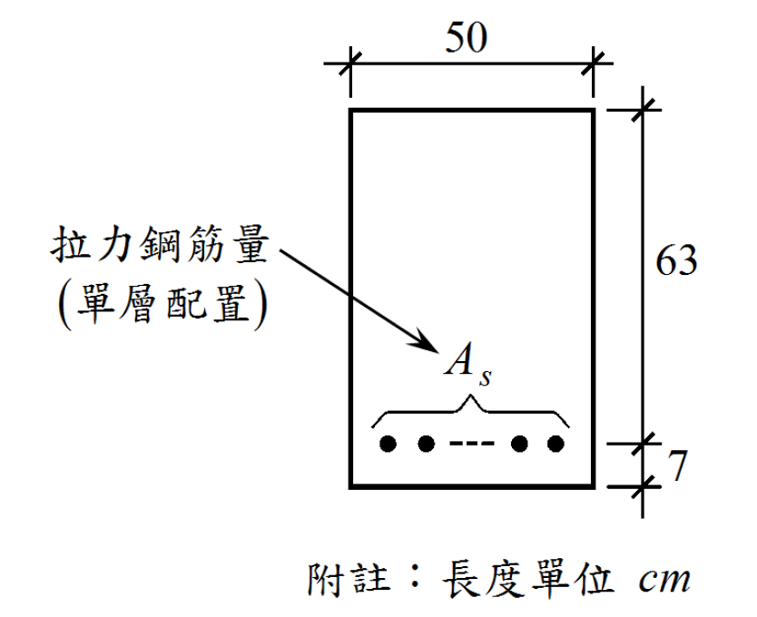

# 考題編號：RC-2019-1

**主分類：** `RC-U1` RC 梁彎矩強度分析與設計
**副分類：** 無
**設計法：** USD 強度設計法
**標籤：** `單筋梁` `過渡區φ值` `Whitney應力塊` `矩形斷面` `二次方程求As` `應變相容` `φ=0.65~0.9`

---

## 1. 原始題目重述 (Problem Restatement)

如附圖所示，一鋼筋混凝土**單筋矩形梁**斷面（單層配置），承受設計彎矩 $M_u = 85.72\ \text{tf·m}$，試求所需之**拉力鋼筋量** $A_s$。

**斷面幾何（依附圖）：**

*圖說：矩形斷面，寬 b = 50 cm，有效深度 d = 63 cm（鋼筋單層配置），保護層至形心距離 7 cm，總梁深 h = 70 cm。鋼筋量 As 為未知數。*

**材料強度：**
- 混凝土抗壓強度：$f'_c = 210\ \text{kgf/cm}^2$
- 鋼筋降伏應力：$f_y = 4{,}200\ \text{kgf/cm}^2$

**規範：** 土木 401-100（CNS 1480）

**提示（來自原題）：** 強度折減因數 $\phi$ 界於 0.65 與 0.9 之間（即過渡區）。

---

## 2. 考題核心精神與出題者意圖 (Core Concepts & Examiner's Intent)

**核心觀念：** 本題測驗考生能否在 $\phi$ 值未知（過渡區）的情況下，正確建立 $\phi$–$A_s$–$\varepsilon_t$ 的聯立方程，透過**代入消元**化為二次方程求解 $A_s$，而非直接假設 $\phi = 0.9$。

**出題者意圖：**
1. 強迫考生理解 $\phi$ 值不是固定的，需由應變條件決定
2. 測試是否知道過渡區 $\phi$ 的線性內插公式
3. 透過「$\phi$ 界於 0.65 與 0.9」的提示，告知考生：假設 $\phi = 0.9$ 算出的答案不對，直接假設 $\phi = 0.65$ 也不對
4. 考察將多個方程式聯立整理後求解的代數能力

**陷阱所在：** 若直接假設 $\phi = 0.9$，求出 $A_s$ 後驗算 $\varepsilon_t < 0.005$，發現矛盾——表示需要用過渡區公式重解，否則白費工夫。

---

## 3. 解題戰略地圖與陷阱分析 (Strategic Roadmap & Trap Analysis)

**作戰計畫（五步驟）：**
1. 確認 $\beta_1$（依 $f'_c$ 決定）
2. 以 $A_s$ 為未知數，將 $a$、$c$、$\varepsilon_t$ 全部表示為 $A_s$ 的函數
3. 將過渡區 $\phi$ 公式也表示為 $A_s$ 的函數
4. 代入 $\phi M_n = M_u$ 展開，化為二次方程求 $A_s$
5. 驗算 $\varepsilon_t$ 落在過渡區（$\varepsilon_y < \varepsilon_t < 0.005$），確認合法

**關鍵陷阱與應對：**

| # | 陷阱 | 應對策略 |
|---|------|---------|
| 1 | **直接假設 $\phi = 0.9$** 然後求 $A_s$，略過驗算 | 題目已明示 $\phi$ 不等於 0.9；必須以聯立方程求解 |
| 2 | **$\varepsilon_y$ 的數值** 不知道或用錯（用 0.002 而非 0.002059） | $\varepsilon_y = f_y/E_s = 4200/2{,}040{,}000 = 0.002059$（土木 401-100 取 $E_s = 2.04 \times 10^6$） |
| 3 | **過渡區 $\phi$ 線性內插**方向反了（以為 $\varepsilon_t$ 越大 $\phi$ 越小） | $\varepsilon_t$ 越大越偏向拉力控制，$\phi$ 越接近 0.9（越大） |
| 4 | **有效深度 $d$ 的判讀** 錯誤（把 63 當成全斷面高、把 7 忽略或誤用） | 題目圖中 63 cm 為有效深度 $d$，7 cm 為鋼筋形心至底纖維距離，$h = 70$ cm |

---

## 3.5 變數層次分析 (Variable Hierarchy Analysis)

> 複習提示：第一次解題後，在每個卡住的知識點旁標記 `⚠`；第二次複習時只看有 `⚠` 的項目。

### 最終目標

求所需拉力鋼筋量 $A_s$（$\text{cm}^2$），使 $\phi M_n \geq M_u = 85.72\ \text{tf·m}$，其中 $\phi$ 屬於過渡區。

---

### 本題關鍵公式（依計算順序）

$$
\text{Step 1: } a = \frac{A_s \cdot f_y}{0.85 f'_c \cdot b}
$$

$$
\text{Step 2: } c = \frac{\boxed{a}}{\beta_1}
$$

$$
\text{Step 3: } \varepsilon_t = 0.003 \cdot \frac{d - \boxed{c}}{\boxed{c}} = \frac{0.3414}{A_s} - 0.003
$$

$$
\text{Step 4: } \phi = 0.65 + \frac{\boxed{\varepsilon_t} - \varepsilon_y}{0.005 - \varepsilon_y} \times 0.25 = 0.220 + \frac{29.02}{A_s}
$$

$$
\text{Step 5: } \phi M_n = \boxed{\phi} \cdot A_s \cdot f_y \cdot \left(d - \frac{\boxed{a}}{2}\right) = M_u \quad \Rightarrow \quad \text{二次方程求 } A_s
$$

---

### L1：題目直接給定

| 符號 | 數值 | 說明 |
|------|------|------|
| $b$ | 50 cm | 梁寬 |
| $d$ | 63 cm | 有效深度（由圖讀取） |
| $h$ | 70 cm | 全斷面深（63 + 7） |
| $f'_c$ | 210 kgf/cm² | 混凝土抗壓強度 |
| $f_y$ | 4,200 kgf/cm² | 鋼筋降伏應力 |
| $M_u$ | 85.72 tf·m = 8,572,000 kgf·cm | 設計彎矩 |

---

### L2：需知識點推導

**（A）材料常數**

| 符號 | 公式／來源 | 卡關? |
|------|-----------|-------|
| $\beta_1$ | $f'_c \leq 280 \Rightarrow \beta_1 = 0.85$（土木 401-100 第 10.2.7 條） | |
| $E_s$ | $= 2.04 \times 10^6\ \text{kgf/cm}^2$（土木 401-100） | |
| $\varepsilon_y$ | $= f_y/E_s = 4200/2{,}040{,}000 = 0.002059$ | |

**（B）幾何量（以 $A_s$ 表示）**

| 符號 | 公式／來源 | 卡關? |
|------|-----------|-------|
| $a$ | $= A_s \cdot f_y/(0.85 f'_c \cdot b) = 0.4706\,A_s$ | |
| $c$ | $= a/\beta_1 = 0.5536\,A_s$ | |
| $\varepsilon_t$ | $= 0.003(d-c)/c = 0.3414/A_s - 0.003$ | |

**（C）強度折減因數**

| 符號 | 公式／來源 | 卡關? |
|------|-----------|-------|
| $\phi$ | 過渡區：$0.65 + (\varepsilon_t-\varepsilon_y)/(0.005-\varepsilon_y) \times 0.25$ | |
| $\phi$（整理後） | $= 0.220 + 29.02/A_s$ | |

**（D）二次方程求解**

| 符號 | 公式／來源 | 卡關? |
|------|-----------|-------|
| 方程式 | $0.05177\,A_s^2 - 7.031\,A_s + 213.1 = 0$ | |
| $A_s$ | 較小根（較大根鋼筋未降伏，不合） | |

---

### L3：深層知識（不懂就卡住）

| 知識點 | 說明 | 卡關? |
|--------|------|-------|
| **過渡區定義** | $\varepsilon_y < \varepsilon_t < 0.005$ 時，$\phi$ 在 0.65~0.9 之間線性內插；$\varepsilon_t \geq 0.005$ 才用 $\phi=0.9$（拉力控制） | |
| **為什麼二次方程有兩根** | 較大根對應鋼筋未降伏（$\varepsilon_t < \varepsilon_y$）的情況，物理上無效，必須捨棄 | |
| **$\beta_1$ 的分界值** | $f'_c = 280\ \text{kgf/cm}^2$ 時 $\beta_1 = 0.85$；$> 280$ 每增加 70 減 0.05，最小 0.65 | |
| **$\phi = 0.9$ 的前提** | 拉力控制斷面（$\varepsilon_t \geq 0.005$）才能直接用 $\phi = 0.9$；本題 $\varepsilon_t \approx 0.00447 < 0.005$，故不能直接用 | |

---

## 4. 步驟化詳細計算過程 (Step-by-Step Detailed Calculation)

### 4.1 斷面參數確認

由附圖：

$$b = 50\ \text{cm}, \quad d = 63\ \text{cm}, \quad h = 70\ \text{cm}$$

$$f'_c = 210\ \text{kgf/cm}^2 \leq 280\ \text{kgf/cm}^2 \quad \Rightarrow \quad \beta_1 = 0.85$$

$$E_s = 2.04 \times 10^6\ \text{kgf/cm}^2, \quad \varepsilon_y = \frac{4200}{2{,}040{,}000} = 0.002059$$

$$M_u = 85.72\ \text{tf·m} = 8{,}572{,}000\ \text{kgf·cm}$$

---

### 4.2 建立 $a$、$c$、$\varepsilon_t$ 與 $A_s$ 的關係

由等效矩形應力塊（Whitney）平衡：

$$a = \frac{A_s \cdot f_y}{0.85 f'_c \cdot b} = \frac{4200\,A_s}{0.85 \times 210 \times 50} = \frac{4200\,A_s}{8925} = 0.4706\,A_s \ \text{(cm)}$$

$$c = \frac{a}{\beta_1} = \frac{0.4706\,A_s}{0.85} = 0.5536\,A_s \ \text{(cm)}$$

底部鋼筋淨拉應變：

$$\varepsilon_t = 0.003 \cdot \frac{d - c}{c} = 0.003 \cdot \frac{63 - 0.5536\,A_s}{0.5536\,A_s} = \frac{0.003 \times 63}{0.5536\,A_s} - 0.003 = \frac{0.3414}{A_s} - 0.003$$

---

### 4.3 建立過渡區 $\phi$ 與 $A_s$ 的關係

由題目提示確認為過渡區（$\varepsilon_y < \varepsilon_t < 0.005$），套入線性內插公式：

$$\phi = 0.65 + \frac{\varepsilon_t - \varepsilon_y}{0.005 - \varepsilon_y} \times 0.25$$

代入 $\varepsilon_t = 0.3414/A_s - 0.003$ 與 $\varepsilon_y = 0.002059$，$0.005 - \varepsilon_y = 0.002941$：

$$\phi = 0.65 + \frac{\left(\dfrac{0.3414}{A_s} - 0.003 - 0.002059\right)}{0.002941} \times 0.25$$

$$= 0.65 + \frac{0.25}{0.002941} \cdot \left(\frac{0.3414}{A_s} - 0.005059\right)$$

$$= 0.65 + 85.00 \times \frac{0.3414}{A_s} - 85.00 \times 0.005059$$

$$= 0.65 + \frac{29.02}{A_s} - 0.430$$

$$\boxed{\phi = 0.220 + \frac{29.02}{A_s}}$$

---

### 4.4 代入彎矩方程，化簡為二次方程

設計強度條件：$\phi M_n = M_u$

$$\phi \cdot A_s \cdot f_y \cdot \left(d - \frac{a}{2}\right) = M_u$$

$$\left(0.220\,A_s + 29.02\right) \times 4200 \times \left(63 - 0.2353\,A_s\right) = 8{,}572{,}000$$

兩側除以 4200：

$$\left(0.220\,A_s + 29.02\right)\left(63 - 0.2353\,A_s\right) = 2041.4$$

展開左側：

$$\underbrace{0.220 \times 63}_{13.86}\,A_s - \underbrace{0.220 \times 0.2353}_{0.05177}\,A_s^2 + \underbrace{29.02 \times 63}_{1828.3} - \underbrace{29.02 \times 0.2353}_{6.829}\,A_s = 2041.4$$

整理：

$$-0.05177\,A_s^2 + (13.86 - 6.829)\,A_s + 1828.3 = 2041.4$$

$$\boxed{0.05177\,A_s^2 - 7.031\,A_s + 213.1 = 0}$$

---

### 4.5 求解二次方程

$$A_s = \frac{7.031 \pm \sqrt{7.031^2 - 4 \times 0.05177 \times 213.1}}{2 \times 0.05177}$$

$$= \frac{7.031 \pm \sqrt{49.43 - 44.14}}{0.10354}$$

$$= \frac{7.031 \pm \sqrt{5.29}}{0.10354}$$

$$= \frac{7.031 \pm 2.300}{0.10354}$$

| 根 | $A_s$ (cm²) | 說明 |
|----|-----------|------|
| 取 $+$ | $(7.031 + 2.300)/0.10354 = 90.1\ \text{cm}^2$ | **無效**：代入後 $\varepsilon_t < \varepsilon_y$，鋼筋未降伏 |
| 取 $-$ | $(7.031 - 2.300)/0.10354 = \mathbf{45.7}\ \text{cm}^2$ | **有效解** |

$$\boxed{A_s \approx 45.7\ \text{cm}^2}$$

---

### 4.6 驗算

$$a = 0.4706 \times 45.7 = 21.51\ \text{cm}$$

$$c = 21.51/0.85 = 25.31\ \text{cm}$$

$$\varepsilon_t = 0.003 \times \frac{63 - 25.31}{25.31} = 0.003 \times 1.489 = 0.00447$$

$$\varepsilon_y = 0.002059 < \varepsilon_t = 0.00447 < 0.005 \quad \checkmark \text{（過渡區確認）}$$

$$\phi = 0.65 + \frac{0.00447 - 0.002059}{0.005 - 0.002059} \times 0.25 = 0.65 + \frac{0.002411}{0.002941} \times 0.25 = 0.65 + 0.205 = 0.855$$

$$\phi M_n = 0.855 \times 45.7 \times 4200 \times (63 - 10.755) = 0.855 \times 45.7 \times 4200 \times 52.245$$

$$= 0.855 \times 10{,}026{,}573 = 8{,}572{,}720\ \text{kgf·cm} \approx 85.73\ \text{tf·m} \approx 85.72\ \text{tf·m} \quad \checkmark$$

**最小鋼筋量驗核：**

$$A_{s,\min} = \max\!\left(\frac{0.80\sqrt{f'_c}}{f_y},\, \frac{14}{f_y}\right) b_w d = \max(0.00276,\, 0.00333) \times 50 \times 63 = 10.49\ \text{cm}^2$$

$$A_s = 45.7\ \text{cm}^2 \gg A_{s,\min} = 10.49\ \text{cm}^2 \quad \checkmark$$

---

## 5. 關鍵爭議點與進階探討 (Critical Issues & Advanced Discussion)

### 5.1 本題解法的唯一性

本題的「正解路徑」是**將 $\phi$ 表示為 $A_s$ 的函數後聯立求解**。市面上部分解析使用「迭代法」（假設 $\phi$→求 $A_s$→回代驗算→修正 $\phi$）同樣可以得到正確答案，但收斂需要 3~5 次疊代，在考場上較不效率。

二次方程法是最直接的路徑，且**不需要事先猜測 $\phi$**，推薦考場使用。

### 5.2 $\varepsilon_y$ 的計算與 CNS 規範

土木 401-100 採用 $E_s = 2.04 \times 10^6\ \text{kgf/cm}^2$，因此：

$$\varepsilon_y = 4200/2{,}040{,}000 = 0.002059 \neq 0.002$$

若誤用 $E_s = 2 \times 10^6$，則 $\varepsilon_y = 0.0021$，最終答案誤差不大（約 $A_s$ 差 1%），但規範上不精確。

### 5.3 高鋼筋比的實務意義

本題 $\rho = 45.7/(50 \times 63) = 0.01451$，對應的平衡鋼筋比：

$$\rho_b = 0.85 \times 0.85 \times \frac{210}{4200} \times \frac{6120}{6120+4200} = 0.02143$$

$\rho/\rho_b = 0.68$，鋼筋量偏高（約 $\rho_b$ 的 68%），接近過渡區邊界。實務設計上，若有條件應增大斷面或採用壓力筋以提升延性（使 $\varepsilon_t \geq 0.005$，$\phi = 0.9$）。
