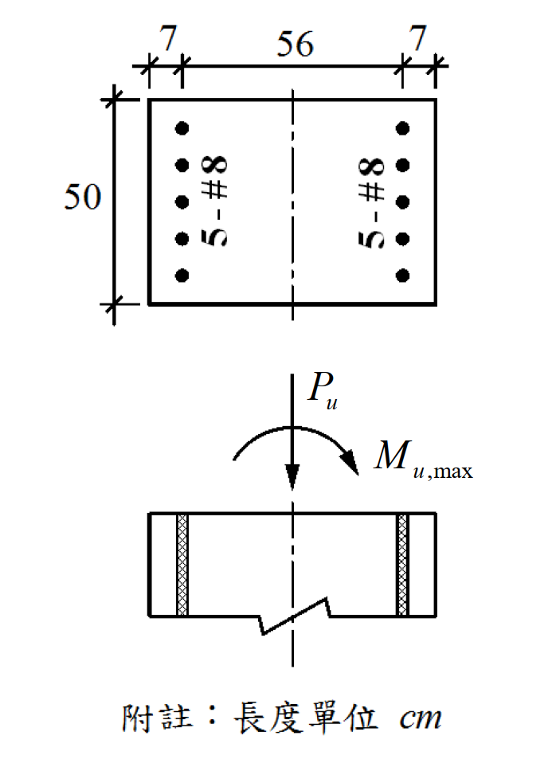

# 考題編號：RC-2019-2

**主分類：** `RC-U1` RC 柱強度分析與設計
**副分類：** 無
**設計法：** USD 強度設計法
**標籤：** `矩形柱` `P-M互制` `壓力控制斷面` `拉力鋼筋未降伏` `二次方程求中性軸` `每側5-#8` `偏心受壓`

---

## 1. 原始題目重述 (Problem Restatement)

如附圖所示，一矩形鋼筋混凝土柱斷面，柱內縱向鋼筋為**每側 5-#8**（共 10 根）。在設計軸力 $P_u = 291\ \text{tf}$ 作用下，試求該柱斷面所能承受之**最大設計彎矩 $M_{u,\max}$**。

**斷面幾何（依附圖）：**

*圖說：矩形柱斷面，彎曲方向全深 h = 70 cm（由「7 + 56 + 7」讀取），垂直彎曲方向寬 b = 50 cm；壓力側保護層（至鋼筋形心）d′ = 7 cm，拉力側有效深度 d = 63 cm；左側（壓力側）5-#8，右側（拉力側）5-#8，$A_b^{\#8} = 5.07\ \text{cm}^2$。*

**材料強度：**
- $f'_c = 280\ \text{kgf/cm}^2$
- $f_y = 4{,}200\ \text{kgf/cm}^2$
- $A_b^{\#8} = 5.07\ \text{cm}^2$

**提示（來自原題）：**
1. 本命題之斷面屬於「壓力控制斷面」→ $\phi = 0.65$（矩形箍筋柱）
2. 一根 #8 筋斷面積 $A_b^{\#8} = 5.07\ \text{cm}^2$

---

## 2. 考題核心精神與出題者意圖 (Core Concepts & Examiner's Intent)

**核心觀念：** 給定軸力 $P_u$，在 P-M 互制曲線上找出對應的最大設計彎矩。本題測驗：

1. 能否正確判斷 $\phi = 0.65$（壓力控制，已由題目提示）
2. 能否建立「拉力鋼筋**未降伏**」的軸力平衡方程，化為二次方程求中性軸深度 $c$
3. 能否正確計算混凝土壓力合力與鋼筋力對**塑性形心**的力臂，求出 $M_n$

**出題者意圖：**
- 壓力控制斷面的 $\phi M_n$ 低於拉力控制，但對應的 $\phi P_n$ 較高；題目選取 $P_u = 291\ \text{tf}$ 使斷面恰好落在壓力控制區（$c > c_b$），考察考生是否理解這個條件。
- 壓力控制時拉力鋼筋通常「尚未降伏」，若誤用 $f_s = f_y$（拉力鋼筋已降伏）則方程直接求解，答案偏高且錯誤。

---

## 3. 解題戰略地圖與陷阱分析 (Strategic Roadmap & Trap Analysis)

**作戰計畫（五步驟）：**
1. 確認 $\beta_1$、確定 $A_s = A_s' = 5 \times 5.07\ \text{cm}^2$
2. 以 $P_u/\phi$ 求名義軸力 $P_n$
3. 判斷各鋼筋應變狀態（壓力筋已降伏？拉力筋未降伏？）
4. 建立軸力平衡方程化為二次方程，求中性軸深度 $c$
5. 對塑性形心取力矩，求 $M_n$，再乘以 $\phi$ 得 $M_{u,\max}$

**關鍵陷阱與應對：**

| # | 陷阱 | 應對策略 |
|---|------|---------|
| 1 | **拉力鋼筋假設已降伏**（誤用 $f_s = f_y$） | 壓力控制時 $c > c_b$，拉力鋼筋應變 $\varepsilon_t < \varepsilon_y$，應用 $f_s = E_s \varepsilon_t$ |
| 2 | **壓力鋼筋力計算忘減混凝土**（Cs′ 重複計算混凝土） | 壓力鋼筋在應力塊範圍內：$C_s' = A_s'(f_s' - 0.85f'_c)$ |
| 3 | **力矩基準點選錯**（取壓力合力作用點，而非塑性形心） | 對塑性形心（$h/2 = 35\ \text{cm}$ 處）取矩；對稱斷面等鋼筋，塑性形心 = 幾何形心 |
| 4 | **$\beta_1 = 0.85$ 的邊界** | $f'_c = 280\ \text{kgf/cm}^2$ 恰為分界點，仍取 $\beta_1 = 0.85$ |

---

## 3.5 變數層次分析 (Variable Hierarchy Analysis)

> 複習提示：第一次解題後，在每個卡住的知識點旁標記 `⚠`；第二次複習時只看有 `⚠` 的項目。

### 最終目標

在已知 $P_u = 291\ \text{tf}$（壓力控制）下，求柱斷面所能承受之最大設計彎矩 $M_{u,\max} = \phi M_n$。

---

### 本題關鍵公式（依計算順序）

$$
\text{Step 1: } P_n = \frac{P_u}{\phi} = \frac{291}{0.65}
$$

$$
\text{Step 2: } C_c = 0.85 f'_c \cdot a \cdot b = 0.85 f'_c \cdot \beta_1 c \cdot b
$$

$$
\text{Step 3: } \varepsilon_s' = 0.003\,\frac{c-d'}{c} \geq \varepsilon_y \Rightarrow f_s' = f_y \quad ;\quad C_s' = A_s'(f_y - 0.85f'_c)
$$

$$
\text{Step 4: } \varepsilon_t = 0.003\,\frac{d-c}{c} < \varepsilon_y \Rightarrow f_s = \frac{6120(d-c)}{c} \quad ;\quad T = A_s \cdot f_s
$$

$$
\text{Step 5: } P_n = \boxed{C_c} + \boxed{C_s'} - \boxed{T} \quad \Rightarrow \quad \text{二次方程求 }c
$$

$$
\text{Step 6: } M_n = \boxed{C_c}\!\left(\frac{h}{2}-\frac{\boxed{a}}{2}\right) + \boxed{C_s'}\!\left(\frac{h}{2}-d'\right) + \boxed{T}\!\left(d-\frac{h}{2}\right)
$$

$$
\text{Step 7: } M_{u,\max} = \phi \cdot \boxed{M_n}
$$

---

### L1：題目直接給定

| 符號 | 數值 | 說明 |
|------|------|------|
| $b$ | 50 cm | 柱寬（垂直彎曲方向） |
| $h$ | 70 cm | 柱深（彎曲方向全深，7+56+7） |
| $d'$ | 7 cm | 壓力側保護層至鋼筋形心 |
| $d$ | 63 cm | 拉力側有效深度（70 − 7） |
| $f'_c$ | 280 kgf/cm² | 混凝土抗壓強度 |
| $f_y$ | 4,200 kgf/cm² | 鋼筋降伏應力 |
| $A_s = A_s'$ | 25.35 cm²（= 5 × 5.07） | 各側縱向鋼筋量 |
| $P_u$ | 291 tf = 291,000 kgf | 設計軸力 |
| $\phi$ | 0.65 | 壓力控制（矩形箍筋柱，題目已告知） |

---

### L2：需知識點推導

**（A）材料常數**

| 符號 | 公式／來源 | 卡關? |
|------|-----------|-------|
| $\beta_1$ | $f'_c = 280 \leq 280 \Rightarrow \beta_1 = 0.85$ | |
| $E_s$ | $2.04 \times 10^6\ \text{kgf/cm}^2$ | |
| $\varepsilon_y$ | $= 4200/2{,}040{,}000 = 0.002059$ | |

**（B）軸力分解**

| 符號 | 公式／來源 | 卡關? |
|------|-----------|-------|
| $P_n$ | $= P_u/\phi = 291{,}000/0.65 = 447{,}692\ \text{kgf}$ | |
| $C_c$ | $= 0.85 \times 280 \times 0.85c \times 50 = 10{,}115c$ | |
| $C_s'$ | $= 25.35(4200 - 0.85 \times 280) = 100{,}437\ \text{kgf}$（壓力筋已降伏） | |
| $T$ | $= 25.35 \times 6120(63-c)/c = 155{,}142(63-c)/c$ | |

**（C）二次方程與解**

| 符號 | 公式／來源 | 卡關? |
|------|-----------|-------|
| 方程 | $c^2 - 18.99c - 966.3 = 0$ | |
| $c$ | $= 42.00\ \text{cm}$（取正根） | |

**（D）彎矩計算**

| 符號 | 公式／來源 | 卡關? |
|------|-----------|-------|
| $M_n$ | 各力 × 力臂（對塑性形心 $h/2 = 35\ \text{cm}$） | |
| $M_{u,\max}$ | $= \phi M_n = 0.65 M_n$ | |

---

### L3：深層知識（不懂就卡住）

| 知識點 | 說明 | 卡關? |
|--------|------|-------|
| **壓力控制定義** | $\varepsilon_t \leq \varepsilon_y$（拉力側鋼筋未達降伏），對應 $c > c_b$；$\phi = 0.65$（矩形箍筋） | |
| **平衡點 $c_b$ 的計算** | $c_b = 6120d/(6120+f_y) = 6120 \times 63/(6120+4200) = 37.36\ \text{cm}$；$c > c_b$ 確認壓力控制 | |
| **壓力鋼筋力需減去混凝土** | 壓力鋼筋被混凝土包圍，在 Whitney 應力塊範圍內，混凝土早已計算過一次，故 $C_s' = A_s'(f_s' - 0.85f'_c)$ | |
| **塑性形心 = 幾何形心（本題）** | 左右各等量等位置的鋼筋，對稱→塑性形心在 $h/2$；若不對稱需另行計算塑性形心 | |
| **為何拉力筋未降伏** | 壓力控制下中性軸深，拉力側拉應變小；$\varepsilon_t = 0.003(d-c)/c < \varepsilon_y$ | |

---

## 4. 步驟化詳細計算過程 (Step-by-Step Detailed Calculation)

### 4.1 斷面確認與材料參數

$$h = 70\ \text{cm},\quad b = 50\ \text{cm},\quad d' = 7\ \text{cm},\quad d = 63\ \text{cm}$$

$$f'_c = 280\ \text{kgf/cm}^2\ (\leq 280) \Rightarrow \beta_1 = 0.85$$

$$A_s = A_s' = 5 \times 5.07 = 25.35\ \text{cm}^2,\quad \varepsilon_y = \frac{4200}{2{,}040{,}000} = 0.002059$$

$$\phi = 0.65\ (\text{壓力控制，矩形箍筋柱，題目已告知})$$

---

### 4.2 求名義軸力 $P_n$

$$P_n = \frac{P_u}{\phi} = \frac{291{,}000}{0.65} = 447{,}692\ \text{kgf}$$

---

### 4.3 確認平衡點並驗證壓力控制

平衡中性軸深度：

$$c_b = \frac{6120\,d}{6120 + f_y} = \frac{6120 \times 63}{6120 + 4200} = \frac{385{,}560}{10{,}320} = 37.36\ \text{cm}$$

後續若解出 $c > 37.36\ \text{cm}$，確認為壓力控制 ✓

---

### 4.4 建立各力

**① 混凝土壓力合力**

$$C_c = 0.85 f'_c \cdot a \cdot b = 0.85 \times 280 \times (\beta_1 c) \times 50 = 0.85 \times 280 \times 0.85c \times 50 = 10{,}115\,c\ \text{(kgf)}$$

**② 壓力鋼筋（假設已降伏，後驗算）**

$d' = 7\ \text{cm} \ll c$，待求 c 必然 $> d'$，故壓力筋應變遠大於 $\varepsilon_y$，已降伏 $\Rightarrow f_s' = f_y = 4200\ \text{kgf/cm}^2$

壓力鋼筋在 Whitney 應力塊範圍內（$d' = 7 < a = 0.85c$），需扣除已計算的混凝土壓力：

$$C_s' = A_s'(f_y - 0.85 f'_c) = 25.35 \times (4200 - 0.85 \times 280) = 25.35 \times (4200 - 238) = 25.35 \times 3962 = 100{,}437\ \text{kgf}$$

**③ 拉力鋼筋（假設未降伏，用 $\varepsilon_t$ 計算）**

$$\varepsilon_t = 0.003 \cdot \frac{d - c}{c} = 0.003 \cdot \frac{63 - c}{c}$$

$$f_s = E_s \varepsilon_t = 2{,}040{,}000 \times 0.003 \cdot \frac{63 - c}{c} = \frac{6120(63 - c)}{c}\ \text{kgf/cm}^2$$

$$T = A_s \cdot f_s = 25.35 \times \frac{6120(63 - c)}{c} = \frac{155{,}142(63 - c)}{c}\ \text{kgf}$$

---

### 4.5 軸力平衡方程

$$P_n = C_c + C_s' - T$$

$$447{,}692 = 10{,}115\,c + 100{,}437 - \frac{155{,}142(63 - c)}{c}$$

兩側乘以 $c$：

$$447{,}692\,c = 10{,}115\,c^2 + 100{,}437\,c - 155{,}142 \times 63 + 155{,}142\,c$$

$$447{,}692\,c = 10{,}115\,c^2 + 255{,}579\,c - 9{,}773{,}946$$

整理：

$$10{,}115\,c^2 - 192{,}113\,c - 9{,}773{,}946 = 0$$

除以 10,115：

$$\boxed{c^2 - 18.99\,c - 966.3 = 0}$$

求解：

$$c = \frac{18.99 + \sqrt{18.99^2 + 4 \times 966.3}}{2} = \frac{18.99 + \sqrt{360.6 + 3865.2}}{2} = \frac{18.99 + \sqrt{4225.8}}{2} = \frac{18.99 + 65.01}{2} = \boxed{42.00\ \text{cm}}$$

（捨去另一根 $c = -22.01\ \text{cm}$，無物理意義）

---

### 4.6 驗算各假設

$$a = \beta_1 c = 0.85 \times 42.00 = 35.70\ \text{cm}$$

**拉力鋼筋應變驗算：**

$$\varepsilon_t = 0.003 \times \frac{63 - 42}{42} = 0.003 \times 0.500 = 0.00150 < \varepsilon_y = 0.002059 \quad \checkmark\ \text{（未降伏，假設正確）}$$

$$f_s = 6120 \times \frac{63 - 42}{42} = 6120 \times 0.500 = 3{,}060\ \text{kgf/cm}^2 < f_y \quad \checkmark$$

**壓力鋼筋應變驗算：**

$$\varepsilon_s' = 0.003 \times \frac{42 - 7}{42} = 0.003 \times \frac{35}{42} = 0.00250 > \varepsilon_y = 0.002059 \quad \checkmark\ \text{（已降伏，假設正確）}$$

**壓力控制確認：**

$$c = 42.00\ \text{cm} > c_b = 37.36\ \text{cm},\quad \varepsilon_t = 0.0015 < \varepsilon_y \quad \checkmark$$

**軸力驗算：**

$$C_c = 10{,}115 \times 42.00 = 424{,}830\ \text{kgf}$$
$$T = 25.35 \times 3{,}060 = 77{,}571\ \text{kgf}$$
$$P_n = 424{,}830 + 100{,}437 - 77{,}571 = 447{,}696\ \text{kgf}$$
$$\phi P_n = 0.65 \times 447{,}696 = 291{,}003\ \text{kgf} \approx 291\ \text{tf} \quad \checkmark$$

---

### 4.7 計算 $M_n$（對塑性形心取矩）

對稱斷面（等量等位置鋼筋），**塑性形心** = 幾何中心 = 距壓力面 $h/2 = 35\ \text{cm}$

各力對塑性形心之力臂：

| 力 | 大小 (kgf) | 力臂 (cm) | 力矩 (kgf·cm) |
|----|-----------|---------|--------------|
| $C_c$（→壓力形心 $a/2 = 17.85\ \text{cm}$ 處） | 424,830 | $35 - 17.85 = 17.15$ | $7{,}285{,}835$ |
| $C_s'$（→壓力鋼筋，$d' = 7\ \text{cm}$ 處） | 100,437 | $35 - 7 = 28.00$ | $2{,}812{,}236$ |
| $T$（→拉力鋼筋，$d = 63\ \text{cm}$ 處） | 77,571 | $63 - 35 = 28.00$ | $2{,}171{,}988$ |

$$M_n = 7{,}285{,}835 + 2{,}812{,}236 + 2{,}171{,}988 = 12{,}270{,}059\ \text{kgf·cm} = 122.70\ \text{tf·m}$$

$$\boxed{M_{u,\max} = \phi M_n = 0.65 \times 122.70 = 79.76\ \text{tf·m}}$$

---

## 5. 關鍵爭議點與進階探討 (Critical Issues & Advanced Discussion)

### 5.1 本題的「最大彎矩」概念

在 P-M 互制曲線上，對於特定軸力 $P_u = 291\ \text{tf}$，對應曲線上的**唯一交點**就是最大設計彎矩。由於 $P_u > \phi P_{n,b}$（平衡點設計強度），此交點落在壓力控制區。

平衡點軸力驗算（供參考）：

$$\phi P_{n,b} = 0.65 \times (C_{c,b} + C_{s,b}' - T_b)$$
$$= 0.65 \times (377{,}944 + 100{,}437 - 106{,}470) = 0.65 \times 371{,}911 = 241.7\ \text{tf}$$

$P_u = 291\ \text{tf} > \phi P_{n,b} = 241.7\ \text{tf}$，確認在壓力控制區 ✓

### 5.2 $c = 42\ \text{cm}$ 的整數結果

注意到 $\varepsilon_t = 0.0015$ 且 $f_s = 3060\ \text{kgf/cm}^2 = 0.5 f_y$，這是題目精心設計的整數答案（$c/d = 42/63 = 2/3$），使計算過程特別簡潔。

### 5.3 最大軸壓力上限驗核

$$\phi P_{n,\max} = 0.80 \times 0.65 \times [0.85 f'_c(A_g - A_{st}) + f_y A_{st}]$$
$$= 0.52 \times [0.85 \times 280 \times (3500 - 50.7) + 4200 \times 50.7]$$
$$= 0.52 \times [238 \times 3449.3 + 212{,}940]$$
$$= 0.52 \times 1{,}033{,}935 = 537{,}646\ \text{kgf} = 537.6\ \text{tf}$$

$P_u = 291\ \text{tf} < \phi P_{n,\max} = 537.6\ \text{tf}$ ✓，軸力在許可範圍內。
