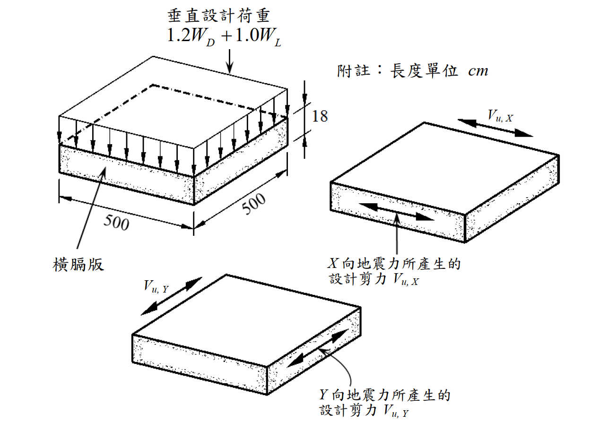

# 考題編號：RC-2019-3

**主分類：** `RC-U3` 韌性要求與耐震設計
**副分類：** `RC-U3-2` 樓版與基腳設計
**設計法：** USD 強度設計法
**標籤：** `橫膈版` `地震剪力` `抗剪鋼筋` `雙向版` `ρt計算` `撓曲控制間距` `最終設計比較`

---

## 1. 原始題目重述 (Problem Restatement)

如附圖所示，一片**橫膈版（Diaphragm Slab）**，已依設計重力載重 $1.2W_D + 1.0W_L$ 完成撓曲設計，採用 **#4@25，雙層、雙向、等間距**配置。

X 向與 Y 向地震力所產生之設計剪力分別為：

$$V_{u,X} = 100\ \text{tf}, \quad V_{u,Y} = 100\ \text{tf}$$

試求：
1. 橫膈版內所需之**抗剪鋼筋量**（$\rho_t$）
2. 採用 #4 鋼筋，雙層、雙向、等間距配置，**最終設計所需鋼筋間距 $s$**

*圖說：橫膈版平面尺寸 500 × 500 cm，厚度 t = 18 cm。X 向地震剪力 Vu,X 作用於 Y 向截面；Y 向地震剪力 Vu,Y 作用於 X 向截面。圖中標示雙向配筋示意。*

**材料強度：**
- $f'_c = 280\ \text{kgf/cm}^2$
- $f_y = 2{,}800\ \text{kgf/cm}^2$（注意：非 4200！）
- $A_b^{\#4} = 1.27\ \text{cm}^2$

**計算剪力強度公式（原題提示）：**
$$V_n = \left(0.53\sqrt{f'_c} + \rho_t f_y\right) A_{cv}$$
$$\phi = 0.6\ (\text{剪力設計強度折減因數})$$

---

## 2. 考題核心精神與出題者意圖 (Core Concepts & Examiner's Intent)

**核心觀念：** 橫膈版同時承受重力載重產生的**撓曲需求**與地震力產生的**剪力需求**，最終鋼筋間距由兩者中較嚴格者控制。本題測驗考生能否：

1. 正確辨識橫膈版剪力設計公式中的 $A_{cv}$（截面積 = 厚度 × 剪力方向垂直邊長）
2. 從 $\phi V_n \geq V_u$ 反推所需 $\rho_t$，再換算所需間距
3. 對比撓曲間距與剪力間距，取較嚴格者為最終設計

**出題者意圖：** 本題特意設計讓撓曲控制（s = 25 cm）比剪力控制（s ≈ 41 cm）更嚴格，藉此測試考生能否完整走完比較流程，不偷懶直接給出剪力控制間距。

---

## 3. 解題戰略地圖與陷阱分析 (Strategic Roadmap & Trap Analysis)

**作戰計畫（四步驟）：**
1. 確認 $A_{cv}$（厚度 × 版的邊長）
2. 由 $\phi V_n = V_u$ 求所需 $\rho_t$
3. 由 $\rho_t$ 反推剪力所需間距 $s_{\text{shear}}$
4. 比較 $s_{\text{flex}} = 25\ \text{cm}$ 與 $s_{\text{shear}}$，取較小者為最終設計

**關鍵陷阱與應對：**

| # | 陷阱 | 應對策略 |
|---|------|---------|
| 1 | **$f_y$ 用成 4200** | 本題鋼筋為 SD280，$f_y = 2800\ \text{kgf/cm}^2$（非 SD420），需仔細讀題 |
| 2 | **$A_{cv}$ 誤算為版的全斷面（500×500）** | $A_{cv}$ 是受剪截面面積，對於 X 向剪力：$A_{cv} = t \times L_Y = 18 \times 500 = 9{,}000\ \text{cm}^2$ |
| 3 | **$\rho_t$ 忘乘以雙層** | 雙層配置時每單位寬度有 2 根鋼筋，$\rho_t = 2A_b/(s \cdot t)$ |
| 4 | **最終間距直接取剪力間距而不比較撓曲** | 最終 s = min(s_flex, s_shear)；本題撓曲控制 |

---

## 3.5 變數層次分析 (Variable Hierarchy Analysis)

> 複習提示：第一次解題後，在每個卡住的知識點旁標記 `⚠`；第二次複習時只看有 `⚠` 的項目。

### 最終目標

求橫膈版最終設計所需之鋼筋間距 $s$（#4，雙層、雙向、等間距），同時滿足撓曲與剪力要求。

---

### 本題關鍵公式（依計算順序）

$$
\text{Step 1: } A_{cv} = t \times L_{\perp} = 18 \times 500 = 9{,}000\ \text{cm}^2
$$

$$
\text{Step 2: } \phi V_n = \phi\left(0.53\sqrt{f'_c} + \rho_t f_y\right) A_{cv} \geq V_u
$$

$$
\text{Step 3: } \rho_t \geq \frac{V_u/(\phi A_{cv}) - 0.53\sqrt{f'_c}}{f_y} \quad \Rightarrow \quad \rho_{t,\text{required}}
$$

$$
\text{Step 4: } \rho_t = \frac{2A_b}{\boxed{s} \cdot t} \quad \Rightarrow \quad s_{\text{shear}} = \frac{2A_b}{\rho_{t,\text{required}} \cdot t}
$$

$$
\text{Step 5: } s_{\text{final}} = \min\!\left(s_{\text{flex}},\ s_{\text{shear}}\right) = \min(25\ \text{cm},\ \boxed{s_{\text{shear}}})
$$

---

### L1：題目直接給定

| 符號 | 數值 | 說明 |
|------|------|------|
| $L_X = L_Y$ | 500 cm | 橫膈版平面邊長（正方形） |
| $t$ | 18 cm | 版厚 |
| $f'_c$ | 280 kgf/cm² | 混凝土抗壓強度 |
| $f_y$ | 2,800 kgf/cm² | 鋼筋降伏應力（SD280） |
| $A_b^{\#4}$ | 1.27 cm² | 單根 #4 鋼筋面積 |
| $V_{u,X} = V_{u,Y}$ | 100 tf = 100,000 kgf | X 向與 Y 向地震設計剪力 |
| $\phi$ | 0.6 | 剪力強度折減因數 |
| $s_{\text{flex}}$ | 25 cm | 已確定的撓曲鋼筋間距 |

---

### L2：需知識點推導

**（A）受剪截面**

| 符號 | 公式／來源 | 卡關? |
|------|-----------|-------|
| $A_{cv}$ | $= t \times L_{\perp} = 18 \times 500 = 9{,}000\ \text{cm}^2$ | |

**（B）求所需 ρt**

| 符號 | 公式／來源 | 卡關? |
|------|-----------|-------|
| $V_n$ 公式貢獻分析 | $0.53\sqrt{280} = 8.868\ \text{kgf/cm}^2$ | |
| $\rho_{t,\text{req}}$ | 由 $\phi V_n = V_u$ 求解：$\rho_t = 0.003447$ | |

**（C）換算間距**

| 符號 | 公式／來源 | 卡關? |
|------|-----------|-------|
| $s_{\text{shear}}$ | $= 2A_b/(\rho_t \cdot t) = 2 \times 1.27/(0.003447 \times 18) = 40.9\ \text{cm}$ | |
| $s_{\text{final}}$ | $= \min(25,\ 40.9) = 25\ \text{cm}$ | |

---

### L3：深層知識（不懂就卡住）

| 知識點 | 說明 | 卡關? |
|--------|------|-------|
| **橫膈版的 Acv 定義** | 橫膈版類比水平剪力牆；對 X 向剪力，受剪截面 = 厚度 × Y 向邊長（非版全面積）| |
| **ρt 含義** | 橫膈版剪力公式中，$\rho_t$ = 平行於剪力方向的鋼筋（雙層計）佔受剪截面積之比 | |
| **雙層計算** | 「雙層」= 上下各一根 → 每間距 $s$ 內有 2 根鋼筋 → $\rho_t = 2A_b/(s \cdot t)$ | |
| **最終設計比較邏輯** | 兩個需求（撓曲、剪力）各自給出最大允許間距；最終取較嚴格者（較小間距） | |

---

## 4. 步驟化詳細計算過程 (Step-by-Step Detailed Calculation)

### 4.1 確認受剪截面積 Acv

對稱方形橫膈版。X 向地震剪力 $V_{u,X}$ 作用於 Y 向截面，Y 向地震剪力 $V_{u,Y}$ 作用於 X 向截面，兩者截面積相同：

$$A_{cv} = t \times L_{\perp} = 18\ \text{cm} \times 500\ \text{cm} = 9{,}000\ \text{cm}^2$$

由對稱性，只需針對任一方向進行計算（結果相同）。

---

### 4.2 求所需配筋率 ρt

由剪力設計條件：

$$\phi V_n \geq V_u$$

$$0.6 \times \left(0.53\sqrt{280} + \rho_t \times 2800\right) \times 9{,}000 = 100{,}000\ \text{kgf}$$

計算混凝土貢獻：

$$0.53\sqrt{280} = 0.53 \times 16.733 = 8.868\ \text{kgf/cm}^2$$

代入求解：

$$\left(8.868 + 2800\,\rho_t\right) \times 9{,}000 = \frac{100{,}000}{0.6} = 166{,}667\ \text{kgf}$$

$$8.868 + 2800\,\rho_t = \frac{166{,}667}{9{,}000} = 18.519\ \text{kgf/cm}^2$$

$$2800\,\rho_t = 18.519 - 8.868 = 9.651$$

$$\boxed{\rho_{t,\text{required}} = \frac{9.651}{2800} = 0.003447}$$

---

### 4.3 換算剪力所需鋼筋間距

採用 **#4，雙層**配置，每間距 $s$ 提供之鋼筋比：

$$\rho_t = \frac{2 A_b}{s \cdot t} = \frac{2 \times 1.27}{s \times 18} = \frac{2.54}{18s}$$

令 $\rho_t = \rho_{t,\text{required}} = 0.003447$：

$$s_{\text{shear}} = \frac{2.54}{18 \times 0.003447} = \frac{2.54}{0.06205} = 40.9\ \text{cm}$$

剪力要求：**$s \leq 40.9\ \text{cm}$**

---

### 4.4 比較撓曲與剪力需求，決定最終間距

| 控制條件 | 允許最大間距 |
|---------|-----------|
| 撓曲設計（已確定） | $s_{\text{flex}} = 25\ \text{cm}$ |
| 剪力設計 | $s_{\text{shear}} = 40.9\ \text{cm}$ |

$$s_{\text{final}} = \min\!\left(s_{\text{flex}},\ s_{\text{shear}}\right) = \min(25,\ 40.9) = \boxed{25\ \text{cm}}$$

**撓曲控制，最終設計採用 #4@25，雙層、雙向、等間距。**

---

### 4.5 驗算（以 s = 25 cm 代入剪力公式）

$$\rho_t = \frac{2 \times 1.27}{25 \times 18} = \frac{2.54}{450} = 0.005644$$

$$\phi V_n = 0.6 \times (8.868 + 0.005644 \times 2800) \times 9{,}000$$

$$= 0.6 \times (8.868 + 15.803) \times 9{,}000$$

$$= 0.6 \times 24.671 \times 9{,}000 = 0.6 \times 222{,}039 = 133{,}223\ \text{kgf}$$

$$= 133.2\ \text{tf} > 100\ \text{tf} \quad \checkmark$$

---

## 5. 關鍵爭議點與進階探討 (Critical Issues & Advanced Discussion)

### 5.1 橫膈版的 Acv 如何確認

本題 $A_{cv} = 18 \times 500 = 9{,}000\ \text{cm}^2$ 是橫膈版截面的「受剪面積」，類比於剪力牆（結構牆）的計算方式。若誤取 $A_{cv} = 500 \times 500 = 250{,}000\ \text{cm}^2$（全版水平面積），所求 $\rho_t$ 會小很多，為錯誤解法。

### 5.2 X、Y 向剪力需分別驗算

本題 $V_{u,X} = V_{u,Y} = 100\ \text{tf}$，且版為正方形，故兩方向條件對稱，只需計算一次。若版為非正方形或兩方向剪力不等，需分別計算各方向所需 $\rho_t$ 與間距，取兩者中較嚴格者。

### 5.3 SD280 鋼筋的適用場合

本題 $f_y = 2{,}800\ \text{kgf/cm}^2$（SD280）用於橫膈版，屬於低強度鋼筋。在台灣現行工程慣例中，版類構件有時仍用 SD280；梁柱主筋通常用 SD420（$f_y = 4{,}200\ \text{kgf/cm}^2$）。本題 $f_y$ 若誤讀為 4200，所求 $\rho_t$ 偏低、間距偏大，屬常見讀題錯誤。

### 5.4 本題的「陷阱答案」

若考生僅計算剪力需求（$s \leq 40.9\ \text{cm}$），直接回答「採用 #4@40 cm」，忽略撓曲設計已確定的 $s = 25\ \text{cm}$ 更嚴格，則會答錯最後一步。題目明確提到「最終設計所需鋼筋間距」，意在要求兩者比較後取最小值。
