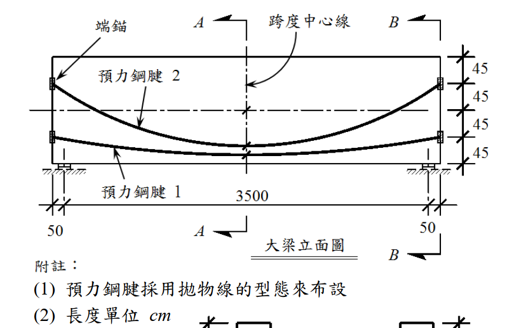
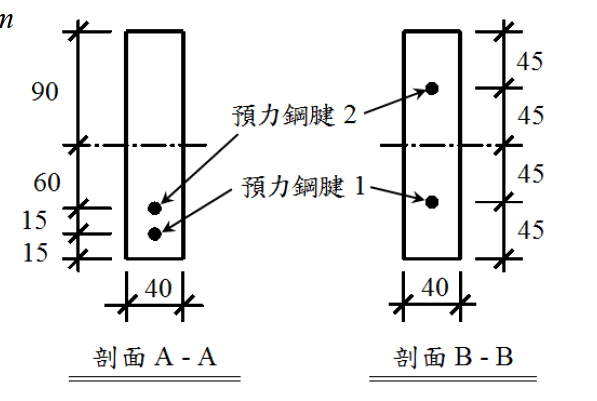

# 考題編號：RC-2019-4

**主分類：** `RC-U4-3` 預力損失
**副分類：** `RC-U4-1` 預力梁斷面應力分析
**設計法：** WSD 工作應力法
**標籤：** `後拉法` `摩擦損失` `拋物線腱` `雙腱施拉` `角度改變量` `矢高計算` `起始預力`

---

## 1. 原始題目重述 (Problem Restatement)

如圖所示之簡支預力混凝土大梁，含兩條拋物線型預力鋼腱（腱 1、腱 2），採後拉法施作。

**梁幾何條件：**
- 梁跨度 $L = 3500$ cm，兩端各有 50 cm 端錨段，梁淨長 3600 cm
- 梁寬 $b = 40$ cm，梁高 $h = 180$ cm（矩形斷面）
- 長度單位：cm

*圖說：梁全長 3600 cm（3500 cm 跨度 + 兩端各 50 cm 端錨段）。腱 1 為下腱（偏心較大），腱 2 為上腱（偏心較小）。兩腱均呈拋物線型布設，端部偏心較大，跨中偏心較小（向上凸起）。*

*圖說：斷面尺寸 b=40 cm，h=180 cm。端部斷面 A-A：由底部往上依序 15+15+60+90=180 cm，腱 1 距底 15 cm，腱 2 距底 30 cm。跨中斷面 B-B：由底部往上依序 45+45+45+45=180 cm，腱 1 距底 45 cm，腱 2 距底 90 cm（形心位置）。梁形心軸在距底 90 cm 處。*

**材料條件：**
- 混凝土抗壓強度 $f'_c = 350$ kgf/cm²
- 預力鋼腱彈性模數 $E_{ps} = 1{,}970{,}000$ kgf/cm²
- 各腱截面積 $A_{ps}^{(1)} = A_{ps}^{(2)} = 30.0$ cm²
- 搖波摩擦係數 $K = 0.0049$/m（單位長度非預期彎曲損失係數）
- 曲線摩擦係數 $\mu_p = 0.25$/rad

**施拉程序：**
1. 混凝土達 28 天齡期後，**以腱 1 一端步施拉**至 $f_{pj} = 12{,}300$ kgf/cm² 並錨碇
2. 隨後，**以腱 2 兩端同步步施拉**至 $f_{pj} = 12{,}300$ kgf/cm² 並錨碇

**附加條件（忽略項目）：**
- 不考慮端部滑動損失
- 除彈性縮短損失外，其餘長期損失（潛變、收縮、鬆弛）不計

**求：**（各 25 分）

**(一)** 鋼腱 1 和 2 在中央跨度截面之起始預力 $P_{i,Cen}^{(1)}$ 和 $P_{i,Cen}^{(2)}$

**(二)** 鋼腱 1 和 2 之端部端錨處起始預力 $P_{i,End}^{(1)}$ 和 $P_{i,End}^{(2)}$

**參考提示：**
$$P_{px} = P_{pj} \cdot e^{-\omega_{px}} \quad,\quad \omega_{px} = Kl + \mu_p \alpha_{px}$$
$$E_c = 15{,}000\sqrt{f'_c}$$

---

## 2. 考題核心精神與出題者意圖 (Core Concepts & Examiner's Intent)

### 核心概念
本題測驗**後拉法預力梁的摩擦損失**，重點在於：
1. **拋物線腱幾何→角度改變量**：從斷面偏心讀出矢高，轉換為摩擦計算用的角度改變
2. **雙腱不同施拉方式的差異**：腱 1「一端張拉」vs. 腱 2「兩端同步張拉」，導致跨中和端部預力的計算邏輯不同
3. **起始預力的定義**：即摩擦損失後，不含長期損失的瞬時預力分布

### 出題者意圖
- 驗證考生能否**從斷面圖計算拋物線矢高**（最容易出錯處）
- 考察「一端張拉」vs.「兩端張拉」的物理差異：前者全跨有摩擦損失梯度，後者以跨中對稱
- 測試摩擦損失公式 $P_{px} = P_{pj} e^{-\omega_{px}}$ 的熟練度，特別是 $\omega_{px} = Kl + \mu_p \alpha$ 中各量的取值

---

## 3. 解題戰略地圖與陷阱分析 (Strategic Roadmap & Trap Analysis)

### 解題步驟
1. **讀圖：確認梁形心位置和各腱偏心**（A-A 端部斷面 vs. B-B 跨中斷面）
2. **計算矢高 δ**：$\delta = e_{端部} - e_{跨中}$（端部偏心更大，跨中偏心更小）
3. **計算角度改變 α**：對稱拋物線腱，端到跨中 $\alpha = 4\delta/L$，端到端 $\alpha = 8\delta/L$
4. **計算 ω 和 P**：$\omega = Kl + \mu_p \alpha$，$P = P_{pj} e^{-\omega}$
5. **區分腱 1 和腱 2 的計算路徑**（一端 vs. 兩端張拉）

### 關鍵陷阱分析

| # | 陷阱 | 錯誤做法 | 正確做法 |
|---|------|---------|---------|
| ① | **矢高方向混淆** | 誤以為跨中偏心 > 端部偏心（腱向下凸） | 後拉法簡支梁：腱端部更低（偏心大），跨中較高（偏心小）；矢高 $\delta = e_{端} - e_{跨中} > 0$ |
| ② | **偏心符號定義** | 誤用距底高度直接作為偏心 | 偏心 = 梁形心高度 - 腱高度（形心在 90 cm，正偏心表示腱在形心下方） |
| ③ | **α 範圍混淆** | 計算端到端 α 時用 $4\delta/L$ | 端到跨中（半跨）：$\alpha = 4\delta/L$；端到端（全跨）：$\alpha = 8\delta/L$ |
| ④ | **K 的單位換算** | 忘記 K 的單位是 /m，而 l 需以 m 代入 | $l$ 必須以 **m** 代入（半跨 = 17.5 m，全跨 = 35 m） |

---

## 3.5 變數層次分析 (Variable Hierarchy Analysis)

> 複習提示：第一次解題後，在每個卡住的知識點旁標記 `⚠`；第二次複習時只看有 `⚠` 的項目。

### 最終目標
`計算後拉法預力梁中，腱1（一端張拉）和腱2（兩端張拉）在跨中和端部的起始預力（摩擦損失後）`

### 本題關鍵公式（依計算順序）

$$\text{Step 1（矢高）: } \delta = e_{端部} - e_{跨中}$$

$$\text{Step 2（端到跨中角度改變）: } \alpha_{半} = \frac{4\boxed{\delta}}{L}$$

$$\text{Step 3（端到端角度改變）: } \alpha_{全} = \frac{8\boxed{\delta}}{L} = 2\boxed{\alpha_{半}}$$

$$\text{Step 4（摩擦損失參數）: } \omega_{px} = Kl + \mu_p \boxed{\alpha_{px}}$$

$$\text{Step 5（起始預力）: } P_{i,x} = P_{pj} \cdot e^{-\boxed{\omega_{px}}}$$

### L1：題目直接給定

| 符號 | 數值 | 說明 |
|------|------|------|
| $L$ | 3500 cm | 梁跨度（支承間距） |
| $b$ | 40 cm | 梁寬 |
| $h$ | 180 cm | 梁高 |
| $f'_c$ | 350 kgf/cm² | 混凝土抗壓強度 |
| $E_{ps}$ | 1,970,000 kgf/cm² | 鋼腱彈性模數 |
| $A_{ps}^{(1)} = A_{ps}^{(2)}$ | 30.0 cm² | 各腱截面積 |
| $f_{pj}$ | 12,300 kgf/cm² | 張拉端鋼腱初始應力 |
| $K$ | 0.0049/m | 單位長度非預期彎曲摩擦係數 |
| $\mu_p$ | 0.25/rad | 曲線摩擦係數 |
| 腱 1 距底（端部 A-A） | 15 cm | 由圖讀取 |
| 腱 2 距底（端部 A-A） | 30 cm | 由圖讀取（15+15） |
| 腱 1 距底（跨中 B-B） | 45 cm | 由圖讀取 |
| 腱 2 距底（跨中 B-B） | 90 cm | 由圖讀取（45+45） |

### L2：需知識點推導

**Step 1：梁幾何**

| 符號 | 公式／來源 | 卡關? |
|------|-----------|:-----:|
| $\bar{y}$ | 矩形截面形心：$h/2 = 180/2 = 90$ cm | |
| $e_1^A$ | 腱 1 端部偏心（形心下方）：$90 - 15 = 75$ cm | |
| $e_1^B$ | 腱 1 跨中偏心：$90 - 45 = 45$ cm | |
| $e_2^A$ | 腱 2 端部偏心：$90 - 30 = 60$ cm | |
| $e_2^B$ | 腱 2 跨中偏心：$90 - 90 = 0$ cm | |

**Step 2：矢高（sagitta）**

| 符號 | 公式／來源 | 卡關? |
|------|-----------|:-----:|
| $\delta_1$ | 腱 1 矢高：$e_1^A - e_1^B = 75 - 45 = 30$ cm | |
| $\delta_2$ | 腱 2 矢高：$e_2^A - e_2^B = 60 - 0 = 60$ cm | |

**Step 3：角度改變量（拋物線幾何）**

| 符號 | 公式／來源 | 卡關? |
|------|-----------|:-----:|
| $\alpha_1^{半}$ | 端到跨中：$4\delta_1/L = 4(30)/3500 = 0.03429$ rad | |
| $\alpha_1^{全}$ | 端到端：$8\delta_1/L = 8(30)/3500 = 0.06857$ rad | |
| $\alpha_2^{半}$ | 端到跨中：$4\delta_2/L = 4(60)/3500 = 0.06857$ rad | |
| $\alpha_2^{全}$ | 端到端：$8\delta_2/L = 8(60)/3500 = 0.13714$ rad | |

**Step 4：施拉力**

| 符號 | 公式／來源 | 卡關? |
|------|-----------|:-----:|
| $P_{pj}^{(1)} = P_{pj}^{(2)}$ | $f_{pj} \times A_{ps} = 12300 \times 30.0 = 369{,}000$ kgf | |

**Step 5：摩擦損失參數與起始預力**

| 符號 | 公式／來源 | 卡關? |
|------|-----------|:-----:|
| $\omega_1(Cen)$ | $K \times 17.5 + \mu_p \times \alpha_1^{半} = 0.0049(17.5) + 0.25(0.03429)$ | |
| $P_{i,Cen}^{(1)}$ | $P_{pj}^{(1)} \cdot e^{-\omega_1(Cen)}$（腱 1，從一端到跨中） | |
| $\omega_2(Cen)$ | $K \times 17.5 + \mu_p \times \alpha_2^{半}$ | |
| $P_{i,Cen}^{(2)}$ | $P_{pj}^{(2)} \cdot e^{-\omega_2(Cen)}$（腱 2，從任一端到跨中） | |
| $\omega_1(End)$ | $K \times 35.0 + \mu_p \times \alpha_1^{全}$（腱 1，全跨，到非張拉端） | |
| $P_{i,End}^{(1)}$ | $P_{pj}^{(1)} \cdot e^{-\omega_1(End)}$ | |
| $P_{i,End}^{(2)}$ | $P_{pj}^{(2)}$（腱 2 兩端均為張拉端，端部無摩擦損失）| |

### L3：深層知識（不懂就卡住）

| 知識點 | 說明 | 卡關? |
|--------|------|:-----:|
| **拋物線角度改變量公式推導** | 拋物線 $y = 4\delta x(L-x)/L^2$，斜率 $dy/dx = 4\delta(L-2x)/L^2$；端部（x=0）斜率 = $4\delta/L$；跨中斜率 = 0；故端到跨中角度改變 = $4\delta/L$（小角度近似） | |
| **後拉法一端 vs. 兩端張拉** | 一端張拉：從張拉端（預力=Ppj）到非張拉端（passive end），預力沿長度遞減；兩端張拉：以跨中為最低點，兩端均為 Ppj | |
| **矢高定義（端部偏心大）** | 簡支梁承正彎矩，腱應在受拉側（底部），為使等效載重向上，拋物線腱應端部偏心大、跨中偏心小（甚至為零）；矢高 δ = e_端 - e_跨 > 0 | |
| **K 和 μ 的物理意義** | K（/m）：對應導管的非預期彎曲（wobble），獨立於幾何彎曲；μ_p（/rad）：對應幾何彎曲造成的法向力摩擦 | |

---

## 4. 步驟化詳細計算過程 (Step-by-Step Detailed Calculation)

### 前置：梁形心與偏心

矩形斷面 $b \times h = 40 \times 180$ cm，形心距底：
$$\bar{y} = \frac{h}{2} = \frac{180}{2} = 90 \text{ cm}$$

**端部截面 A-A 偏心（腱在形心下方為正）：**
$$e_1^A = 90 - 15 = 75 \text{ cm}$$
$$e_2^A = 90 - 30 = 60 \text{ cm}$$

**跨中截面 B-B 偏心：**
$$e_1^B = 90 - 45 = 45 \text{ cm}$$
$$e_2^B = 90 - 90 = 0 \text{ cm}$$（腱 2 跨中位於形心，偏心為零）

### Step 1：計算矢高（sagitta）δ

拋物線腱的矢高 = 端部偏心 - 跨中偏心：

$$\boxed{\delta_1 = e_1^A - e_1^B = 75 - 45 = 30 \text{ cm}}$$

$$\boxed{\delta_2 = e_2^A - e_2^B = 60 - 0 = 60 \text{ cm}}$$

> **策略註解：** 矢高 δ 代表拋物線腱由端錨至跨中的「拉直高度差」。δ 越大，鋼腱彎曲越劇烈，摩擦損失越大。腱 2 的矢高是腱 1 的 2 倍，故腱 2 的摩擦損失更大。

### Step 2：計算拋物線角度改變量 α

對對稱拋物線腱，由一端到跨中（半跨 $L/2 = 1750$ cm）的角度改變：

$$\alpha_{半} = \frac{4\delta}{L}$$

由一端到另一端（全跨 $L = 3500$ cm）：

$$\alpha_{全} = \frac{8\delta}{L} = 2\alpha_{半}$$

**腱 1：**
$$\alpha_1^{半} = \frac{4 \times 30}{3500} = \frac{120}{3500} = 0.03429 \text{ rad}$$
$$\alpha_1^{全} = \frac{8 \times 30}{3500} = \frac{240}{3500} = 0.06857 \text{ rad}$$

**腱 2：**
$$\alpha_2^{半} = \frac{4 \times 60}{3500} = \frac{240}{3500} = 0.06857 \text{ rad}$$
$$\alpha_2^{全} = \frac{8 \times 60}{3500} = \frac{480}{3500} = 0.13714 \text{ rad}$$

### Step 3：張拉力

兩腱截面積相同，張拉應力相同：
$$P_{pj} = f_{pj} \times A_{ps} = 12{,}300 \times 30.0 = 369{,}000 \text{ kgf} = 369 \text{ tf}$$

### Step 4（一）：跨中截面起始預力

**計算路徑長度：** 張拉端到跨中 = $L/2 = 1750$ cm = **17.5 m**

$$\omega_{px} = Kl + \mu_p \alpha$$

---

**腱 1（一端張拉，從張拉端到跨中）：**

$$\omega_1(Cen) = K \times 17.5 + \mu_p \times \alpha_1^{半}$$
$$= 0.0049 \times 17.5 + 0.25 \times 0.03429$$
$$= 0.08575 + 0.008573 = 0.09432$$

$$P_{i,Cen}^{(1)} = P_{pj} \cdot e^{-0.09432} = 369{,}000 \times 0.9100$$

$$\boxed{P_{i,Cen}^{(1)} = 335{,}790 \text{ kgf} \approx 336 \text{ tf}}$$

---

**腱 2（兩端同步張拉，從任一端到跨中）：**

$$\omega_2(Cen) = K \times 17.5 + \mu_p \times \alpha_2^{半}$$
$$= 0.0049 \times 17.5 + 0.25 \times 0.06857$$
$$= 0.08575 + 0.017143 = 0.10289$$

$$P_{i,Cen}^{(2)} = P_{pj} \cdot e^{-0.10289} = 369{,}000 \times 0.9021$$

$$\boxed{P_{i,Cen}^{(2)} = 332{,}880 \text{ kgf} \approx 333 \text{ tf}}$$

> **策略註解：** 兩腱施拉力相同，但腱 2 矢高較大（δ₂=60 cm > δ₁=30 cm），故腱 2 角度改變更大，跨中摩擦損失更多，$P_{i,Cen}^{(2)} < P_{i,Cen}^{(1)}$。

### Step 4（二）：端部端錨起始預力

**腱 1（一端張拉）：**

腱 1 只從一端張拉（active anchor），另一端為非張拉端（passive anchor）。從張拉端到非張拉端，全跨長度 = $L = 3500$ cm = **35 m**，累積所有摩擦損失：

$$\omega_1(End) = K \times 35.0 + \mu_p \times \alpha_1^{全}$$
$$= 0.0049 \times 35.0 + 0.25 \times 0.06857$$
$$= 0.1715 + 0.017143 = 0.18864$$

$$P_{i,End}^{(1)} = P_{pj} \cdot e^{-0.18864} = 369{,}000 \times 0.8282$$

$$\boxed{P_{i,End}^{(1)} = 305{,}600 \text{ kgf} \approx 306 \text{ tf}}$$

> **策略註解：** 非張拉端的預力最低，因為全跨的摩擦損失全部累積在這個端點。腱 1 在非張拉端的損失為 $369 - 306 = 63$ tf，達初拉力的 17%。

---

**腱 2（兩端同步張拉）：**

兩端同步張拉，兩端均為張拉端（active anchor），端部沒有摩擦損失：

$$\omega_2(End) = 0$$

$$P_{i,End}^{(2)} = P_{pj} = 369{,}000 \text{ kgf}$$

$$\boxed{P_{i,End}^{(2)} = 369{,}000 \text{ kgf} = 369 \text{ tf}}$$

### 計算結果彙整

| 位置 | 腱 1（一端張拉） | 腱 2（兩端同步張拉） |
|------|:--------------:|:-----------------:|
| **張拉端** | 369,000 kgf（= Ppj） | 369,000 kgf（= Ppj） |
| **跨中截面** | **335,790 kgf（336 tf）** | **332,880 kgf（333 tf）** |
| **非張拉端 / 對端** | **305,600 kgf（306 tf）** | 369,000 kgf（= Ppj，兩端均張拉） |

| ω 計算驗算 | 腱 1 | 腱 2 |
|-----------|------|------|
| δ（矢高） | 30 cm | 60 cm |
| α（端→跨中） | 0.03429 rad | 0.06857 rad |
| α（端→端） | 0.06857 rad | 0.13714 rad |
| ω（跨中） | 0.09432 | 0.10289 |
| ω（非張拉端） | 0.18864 | —（無，兩端均張拉） |
| $e^{-\omega}$（跨中） | 0.9100 | 0.9021 |
| $e^{-\omega}$（非張拉端） | 0.8282 | — |

---

## 5. 關鍵爭議點與進階探討 (Critical Issues & Advanced Discussion)

### 5.1 拋物線角度改變公式的推導驗證

對對稱拋物線 $y(x) = 4\delta \cdot \dfrac{x(L-x)}{L^2}$（以左端為原點，y 向上為正，$y(L/2) = \delta$）：

斜率（單位切線方向）：
$$y'(x) = 4\delta \cdot \frac{L - 2x}{L^2}$$

- 左端（x=0）：$y'(0) = \frac{4\delta}{L}$（向上正斜率）
- 跨中（x=L/2）：$y'(L/2) = 0$（水平）
- 右端（x=L）：$y'(L) = -\frac{4\delta}{L}$（向下負斜率）

角度改變量（絕對值）：
- 端→跨中：$|y'(0) - y'(L/2)| = \frac{4\delta}{L}$ ✓
- 端→端（全跨）：$|y'(0) - y'(L)| = \frac{8\delta}{L}$ ✓

### 5.2 本題的偏心方向邏輯確認

簡支梁在均布重力載重下，正彎矩區的預力腱應置於**梁底（受拉區）**，以抵抗拉力。

對拋物線腱：
- 端部（支承處，彎矩=0）：腱的理想位置是在形心（e=0），但為預留錨碇空間，端部仍有偏心（e > 0，腱在形心下方）
- 跨中（最大彎矩處）：腱偏心最大

但**本題的方向相反**——端部偏心 > 跨中偏心：
- 腱 1：端 75 cm > 跨中 45 cm
- 腱 2：端 60 cm > 跨中 0 cm

這種布置下，等效載重（Equivalent Load）= 向上的分布力，用以平衡向下的重力：
$$w_{eq} = \frac{8 P_e \delta}{L^2}$$（拋物線腱等效均布上升力）

本題的矢高計算以**端部偏心 > 跨中偏心**，即腱端部下壓（比跨中低），符合拋物線腱等效向上載重的設計意圖。

### 5.3 彈性縮短損失的補充計算（進階）

題目說「除彈性縮短損失外，其餘長期損失不計」，意指腱 2 張拉時，腱 1 會因混凝土彈性縮短而損失預力。

詳細計算步驟：

1. 計算腱 2 張拉後在腱 1 重心位置的混凝土應力 $f_{cg1}$
2. $\Delta f_{pES}^{(1)} = (E_{ps}/E_c) \times f_{cg1}$，$E_c = 15000\sqrt{350} = 280{,}624$ kgf/cm²
3. $n = E_{ps}/E_c = 1{,}970{,}000 / 280{,}624 = 7.02$

跨中截面（$e_2^B = 0$，腱 2 偏心為零）：
$$f_{cg1}(跨中) = \frac{P_{i,Cen}^{(2)}}{A} = \frac{332{,}880}{7{,}200} = 46.2 \text{ kgf/cm}^2$$

$$\Delta P_{ES}^{(1)}(跨中) = n \times f_{cg1} \times A_{ps}^{(1)} = 7.02 \times 46.2 \times 30 = 9{,}729 \text{ kgf}$$

修正後跨中起始預力（含彈性縮短）：
$$P_{i,Cen}^{(1),corrected} = 335{,}790 - 9{,}729 = 326{,}061 \text{ kgf} \approx 326 \text{ tf}$$

> **考場建議：** 本題關鍵計算為摩擦損失；若題目明確要求「只計算摩擦損失」（如提示「不考慮彈性縮短以外的損失」），彈性縮短計算可能需要根據題意判斷是否包含在「起始預力」定義中。考場上若時間不足，先完成摩擦損失主幹計算，再加彈性縮短作加分。

### 5.4 施拉順序的設計含義

腱 2 用兩端張拉：
- **優點**：避免非張拉端損失過大（若一端張拉，腱 2 因矢高大，另一端損失會達 $e^{-0.20579} = 0.814$，即損失 18.6%）
- **缺點**：施工較複雜（需兩側同時操作千斤頂）
- **適用時機**：腱彎曲矢高大（高偏心梁、曲線腱）、跨度長、精度要求高時

腱 1 一端張拉，非張拉端損失達 $1 - 0.8282 = 17.2\%$，在可接受範圍內。
