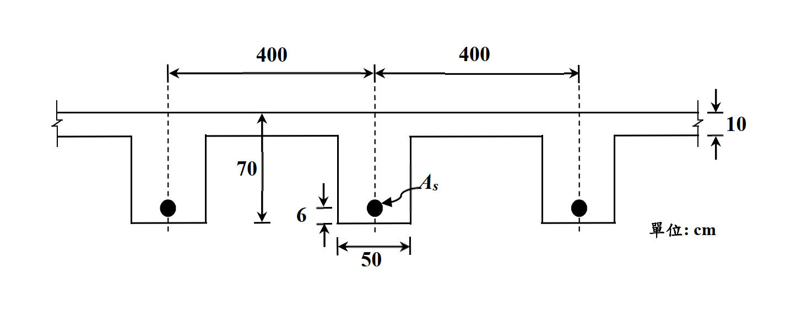

# 考題編號：RC-2020-1

**主分類：** `RC-U1-1` RC 梁彎矩強度分析與設計
**副分類：** 無
**設計法：** USD 強度設計法
**標籤：** `T形梁` `有效翼板寬` `中性軸在翼板` `最少鋼筋量` `Whitney應力塊` `正彎矩設計`

---

## 1. 原始題目重述（Problem Restatement）

一梁版系統斷面如圖所示，每一梁腹與部分相連的版可視為一 T 型梁抵抗外載。  
每一 T 型梁所受之設計（因數化）正彎矩 $M_u = 130 \text{ tf-m}$（含自重之效應），求每一 T 型梁所需之**最少**拉力筋面積 $A_s$。

**已知條件：**
- 混凝土抗壓強度 $f'_c = 210 \text{ kgf/cm}^2$
- 鋼筋降伏強度 $f_y = 4200 \text{ kgf/cm}^2$
- 梁跨度 $L = 500 \text{ cm}$
- 設計正彎矩 $M_u = 130 \text{ tf-m} = 13{,}000{,}000 \text{ kgf-cm}$

**斷面幾何（由圖讀取）：**
- 版厚（翼板厚）$h_f = 10 \text{ cm}$
- 梁腹寬 $b_w = 50 \text{ cm}$
- 梁腹高（翼板底至梁底）$= 70 \text{ cm}$
- 全深 $h = 10 + 70 = 80 \text{ cm}$
- 保護層（至鋼筋重心）$= 6 \text{ cm}$，故有效深度 $d = 80 - 6 = 74 \text{ cm}$
- 梁間淨距 $= 400 \text{ cm}$（每側）

*圖說：T形梁斷面，有效翼板範圍由三個條件控制；梁腹寬 bw=50 cm，版厚 hf=10 cm，全深 h=80 cm，d=74 cm，兩側梁間淨距均為 400 cm，L=500 cm，f'c=210 kgf/cm²，fy=4200 kgf/cm²。*

---

## 2. 考題核心精神與出題者意圖（Core Concepts & Examiner's Intent）

**核心觀念：** T 形梁有效翼板寬三個控制條件的判斷 → 中性軸位置假設與驗證 → USD 設計彎矩強度公式求 $A_s$。

**出題者意圖：**
1. 測驗考生能否正確套用三個有效翼板寬規定，取最小值
2. 判斷中性軸是否在翼板內（內 T 梁多數情況中性軸在翼板，需驗算）
3. 求解 $A_s$ 的二次方程求根，並確認最小鋼筋量

**陷阱：** 題目明示三個規定條件，考生需**全部計算**後取最小值；另外 $M_u = 130 \text{ tf-m}$ 需正確換算為 kgf-cm 單位（$\times 10^5$，不是 $\times 10^4$）。

---

## 3. 解題戰略地圖與陷阱分析（Strategic Roadmap & Trap Analysis）

**作戰計畫：**
1. 計算有效翼板寬 $b_e$（三條件取最小）
2. 假設中性軸在翼板內 → 當作矩形梁（寬 $b_e$）求解 $A_s$
3. 驗算假設（$a \leq h_f$）
4. 確認 $\varepsilon_t \geq 0.005$（拉力控制，$\phi = 0.9$）
5. 檢核最小鋼筋量 $A_{s,\min}$

**三大陷阱：**

| 陷阱 | 說明 | 對策 |
|------|------|------|
| 單位換算 | $M_u = 130 \text{ tf-m}$，1 tf = 1000 kgf，1 m = 100 cm | $M_u = 130 \times 10^5 = 1.3 \times 10^7 \text{ kgf-cm}$ |
| 有效翼板寬取最小 | 三個條件需**全部算**，取最小值 | 逐一計算後比較 |
| 最小鋼筋量用 $b_w$ | $A_{s,\min}$ 公式中用腹板寬 $b_w$，**不用** $b_e$ | $A_{s,\min} = \frac{14}{f_y} b_w d$ |

---

## 3.5 變數層次分析（Variable Hierarchy Analysis）

> 複習提示：第一次解題後，在每個卡住的知識點旁標記 `⚠`；第二次複習時只看有 `⚠` 的項目。

### 最終目標

`求滿足 φMn ≥ Mu 的最少拉力筋面積 As（同時不得低於 As,min）`

### 本題關鍵公式（依計算順序）

> $\boxed{\cdot}$ = 需由前步驟推導，非題目直接給定的變數

$$\text{Step 1: } b_e = \min\!\left(\frac{L}{4},\ b_w + 2 \times 8h_f,\ b_w + s_{clear}\right)$$

$$\text{Step 2: } a = \frac{A_s f_y}{0.85 f'_c \boxed{b_e}}$$

$$\text{Step 3: } \phi M_n = \phi A_s f_y \!\left(d - \frac{\boxed{a}}{2}\right) \geq M_u \quad \Rightarrow \text{解二次方程求 }A_s$$

$$\text{Step 4（驗算假設）: } \boxed{a} \leq h_f \quad \Rightarrow \text{中性軸確在翼板內}$$

$$\text{Step 5（延性驗算）: } \varepsilon_t = 0.003 \times \frac{d - \boxed{c}}{\boxed{c}} \geq 0.005 \quad \Rightarrow \phi = 0.9$$

$$\text{Step 6: } A_{s,\min} = \frac{14}{f_y} \cdot b_w \cdot d$$

### L1：題目直接給定

| 符號 | 數值 | 說明 |
|------|------|------|
| $f'_c$ | 210 kgf/cm² | 混凝土抗壓強度 |
| $f_y$ | 4200 kgf/cm² | 鋼筋降伏強度 |
| $M_u$ | 130 tf-m | 設計正彎矩 |
| $L$ | 500 cm | 梁跨度 |
| $h_f$ | 10 cm | 翼板（版）厚 |
| $b_w$ | 50 cm | 梁腹寬 |
| $h$ | 80 cm | 全深（10+70） |
| $d$ | 74 cm | 有效深度（h − 6） |
| $s_{clear}$ | 400 cm | 梁間淨距（每側） |

### L2：需知識點推導

**Step 1：有效翼板寬**

| 符號 | 公式/來源 | 卡關? |
|------|----------|:-----:|
| $b_e$ 條件1 | $L/4 = 500/4 = 125 \text{ cm}$（總寬限制） | |
| $b_e$ 條件2 | $b_w + 2 \times 8h_f = 50 + 160 = 210 \text{ cm}$ | |
| $b_e$ 條件3 | $b_w + s_{clear} = 50 + 400 = 450 \text{ cm}$ | |
| $b_e$ | $\min(125, 210, 450) = 125 \text{ cm}$ | |

**Step 2：β₁ 與壓力塊高度**

| 符號 | 公式/來源 | 卡關? |
|------|----------|:-----:|
| $\beta_1$ | $f'_c = 210 \leq 280 \Rightarrow \beta_1 = 0.85$ | |
| $a$ | $A_s \times 4200/(0.85 \times 210 \times 125) = 0.18826 A_s$ | |

**Step 3：求 As（二次方程）**

| 符號 | 公式/來源 | 卡關? |
|------|----------|:-----:|
| $A_s$ | $0.9 A_s \cdot 4200(74 - 0.09413A_s) = 13{,}000{,}000$ → 二次方程解 | |
| 取小根 | $A_s = (279{,}720 - \sqrt{279{,}720^2 - 4 \times 355.8 \times 13{,}000{,}000})/(2 \times 355.8)$ | |

**Step 4–5：驗算**

| 符號 | 公式/來源 | 卡關? |
|------|----------|:-----:|
| $a$ | $0.18826 \times 49.65 = 9.35 \text{ cm} \leq h_f = 10$ ✓ | |
| $c$ | $a/\beta_1 = 9.35/0.85 = 11.0 \text{ cm}$ | |
| $\varepsilon_t$ | $0.003 \times (74-11.0)/11.0 = 0.0172 \geq 0.005$ ✓ → $\phi=0.9$ | |

**Step 6：最小鋼筋量**

| 符號 | 公式/來源 | 卡關? |
|------|----------|:-----:|
| $A_{s,\min}$ | $\max(0.8\sqrt{f'_c}/f_y,\ 14/f_y) \times b_w \times d = (14/4200) \times 50 \times 74 = 12.33 \text{ cm}^2$ | |

### L3：深層知識（不懂就卡住）

| 知識點 | 說明 | 卡關? |
|--------|------|:-----:|
| 三個有效翼板寬條件的物理意義 | 條件1限制翼板參與受力的長度；條件2限制剪力滯效應；條件3避免相鄰梁翼板重疊 | |
| 中性軸假設的驗算邏輯 | 若 $a > h_f$ 必須改用 T 梁公式（分離 Asf + Asw），本題不需要 | |
| 最小鋼筋量用 $b_w$ 而非 $b_e$ | T 梁腹板是受拉側主體；若用 $b_e$ 會低估最低鋼筋要求 | |
| 二次方程取小根 | 較小根對應延性破壞（拉力控制）；較大根表示壓力控制，不符延性設計 | |

---

## 4. 步驟化詳細計算過程（Step-by-Step Detailed Calculation）

### Step 1：有效翼板寬 $b_e$

條件一：總有效翼板寬 $\leq L/4$

$$b_e \leq \frac{L}{4} = \frac{500}{4} = 125 \text{ cm}$$

條件二：每側懸出 $\leq 8h_f$

$$b_e \leq b_w + 2 \times 8h_f = 50 + 2 \times 8 \times 10 = 50 + 160 = 210 \text{ cm}$$

條件三：每側懸出 $\leq$ 梁間淨距$/2$

$$b_e \leq b_w + 2 \times \frac{400}{2} = 50 + 400 = 450 \text{ cm}$$

$$\boxed{b_e = \min(125,\ 210,\ 450) = 125 \text{ cm}}$$

### Step 2：材料參數

$$\beta_1 = 0.85 \quad (f'_c = 210 \text{ kgf/cm}^2 \leq 280)$$

單位換算：

$$M_u = 130 \text{ tf-m} = 130 \times 1000 \times 100 = 13{,}000{,}000 \text{ kgf-cm}$$

### Step 3：假設中性軸在翼板內，求 $A_s$

以 $b_e = 125 \text{ cm}$ 矩形梁進行設計，$\phi = 0.9$（先假設拉力控制）。

Whitney 應力塊高度：

$$a = \frac{A_s f_y}{0.85 f'_c b_e} = \frac{A_s \times 4200}{0.85 \times 210 \times 125} = \frac{4200 A_s}{22{,}312.5} = 0.18826 A_s$$

彎矩強度方程式：

$$\phi M_n = \phi A_s f_y \left(d - \frac{a}{2}\right) = M_u$$

$$0.9 \times A_s \times 4200 \times \left(74 - \frac{0.18826 A_s}{2}\right) = 13{,}000{,}000$$

$$3780 A_s (74 - 0.09413 A_s) = 13{,}000{,}000$$

$$279{,}720 A_s - 355.8 A_s^2 = 13{,}000{,}000$$

整理為標準二次方程式：

$$355.8 A_s^2 - 279{,}720 A_s + 13{,}000{,}000 = 0$$

判別式：

$$\Delta = 279{,}720^2 - 4 \times 355.8 \times 13{,}000{,}000 = 78{,}242{,}678{,}400 - 18{,}501{,}600{,}000 = 59{,}741{,}078{,}400$$

$$\sqrt{\Delta} = 244{,}421$$

取小根（延性解）：

$$A_s = \frac{279{,}720 - 244{,}421}{2 \times 355.8} = \frac{35{,}299}{711.6} \approx \boxed{49.6 \text{ cm}^2}$$

### Step 4：驗算中性軸假設

$$a = 0.18826 \times 49.6 = 9.34 \text{ cm} < h_f = 10 \text{ cm} \quad \checkmark$$

中性軸在翼板內，假設成立。

### Step 5：驗算 $\phi$ 值（延性確認）

$$c = \frac{a}{\beta_1} = \frac{9.34}{0.85} = 10.99 \text{ cm}$$

$$\varepsilon_t = 0.003 \times \frac{d - c}{c} = 0.003 \times \frac{74 - 10.99}{10.99} = 0.003 \times 5.732 = 0.01720 \gg 0.005 \quad \checkmark$$

$\phi = 0.9$（拉力控制），假設正確。

### Step 6：最小鋼筋量檢核

$$A_{s,\min} = \max\!\left(\frac{0.8\sqrt{f'_c}}{f_y},\ \frac{14}{f_y}\right) \times b_w \times d$$

$$= \max\!\left(\frac{0.8 \times \sqrt{210}}{4200},\ \frac{14}{4200}\right) \times 50 \times 74$$

$$= \max\left(\frac{11.59}{4200},\ \frac{14}{4200}\right) \times 3700$$

$$= \frac{14}{4200} \times 3700 = 0.003333 \times 3700 = 12.33 \text{ cm}^2$$

$$A_s = 49.6 \text{ cm}^2 \gg A_{s,\min} = 12.33 \text{ cm}^2 \quad \checkmark \text{（強度需求控制）}$$

### 最終結果

$$\boxed{A_s = 49.6 \text{ cm}^2}$$

---

## 5. 關鍵爭議點與進階探討（Critical Issues & Advanced Discussion）

**1. 有效深度 d 的取法**
本題圖面標示保護層 6 cm 為至鋼筋重心距離（台灣考題慣例），故 $d = 80 - 6 = 74$ cm。若誤解為淨保護層，需再減去鋼筋半徑，導致 $d$ 偏小。

**2. 中性軸幾乎恰在翼板底部**
$a = 9.34$ cm，距 $h_f = 10$ cm 僅剩 0.66 cm，稍有不慎（如誤用更小的 $d$）可能導致 $a > h_f$，需改用 T 梁腹板分解公式。考場上應先假設在翼板內，計算後**必須驗算**。

**3. 最小鋼筋量用 $b_w$ 不用 $b_e$**
T 梁最小鋼筋量規定使用 $b_w$（腹板寬），因腹板是受拉部分的主要承力寬度。本題 $A_{s,\min} = 12.33$ cm² 遠小於計算值 49.6 cm²，無影響。

**4. 延性驗算替代方法**
可直接檢核 $\rho \leq 0.75\rho_b$：
$$\rho = \frac{A_s}{b_e \cdot d} = \frac{49.6}{125 \times 74} = 0.00536$$
$$0.75\rho_b = 0.75 \times 0.85 \times 0.85 \times \frac{210}{4200} \times \frac{6120}{10320} = 0.01607$$
$$0.00536 \ll 0.01607 \quad \checkmark$$
