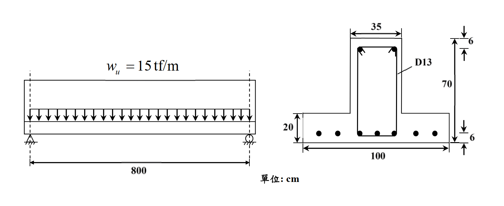

# 考題編號：RC-2020-2

**主分類：** `RC-U2-1` RC 剪力強度分析與設計
**副分類：** 無
**設計法：** USD 強度設計法
**標籤：** `倒T型梁` `臨界斷面` `d偏移規則` `最大肋筋間距` `最大設計剪力` `Vc簡化公式`

---

## 1. 原始題目重述（Problem Restatement）

一簡支獨立倒T型梁（倒T型截面，腹板在上、翼板在下），受均佈設計（因數化）載重 $w_u = 15 \text{ tf/m}$（含自重），跨度 800 cm。

**已知條件：**
- $f'_c = 280 \text{ kgf/cm}^2$，$f_y = 4200 \text{ kgf/cm}^2$
- 混凝土剪力強度公式：$V_c = 0.53\sqrt{f'_c}\, b_w d$
- 剪力筋：D13，一支斷面積 $= 1.267 \text{ cm}^2$

**斷面幾何（由圖讀取）：**
- 腹板（上方）：寬 $b_w = 35 \text{ cm}$，高 $70 \text{ cm}$
- 翼板（下方）：寬 $100 \text{ cm}$，深 $20 \text{ cm}$
- 全深 $h = 70 + 20 = 90 \text{ cm}$
- 底部保護層（至拉力鋼筋重心）$= 6 \text{ cm}$，有效深度 $d = 90 - 6 = 84 \text{ cm}$

**三小題：**
1. 支承處斷面可否按距離支承面 $d$ 處之 $V_u$ 設計？請說明原因。（5 分）
2. 計算支承位置剪力鋼筋之最大間距。（15 分）
3. 計算此梁斷面所能抵抗之最大設計剪力 $V_u$。（5 分）

*圖說：倒T型梁斷面，腹板 bw=35 cm 在上，翼板 100×20 cm 在下；h=90 cm，d=84 cm；梁跨度 L=800 cm，wu=15 tf/m（含自重）；D13 閉合箍筋，Av=2×1.267=2.534 cm²；f'c=280 kgf/cm²，fy=4200 kgf/cm²。*

---

## 2. 考題核心精神與出題者意圖（Core Concepts & Examiner's Intent）

**核心觀念：**
1. d 偏移規則（critical section at d from support）的適用條件
2. 依 $V_u$ 計算所需箍筋間距，並對照規範間距限制
3. 斷面最大可承受剪力（受規範 $V_{s,max}$ 控制）

**出題者意圖：**
- 小題(一) 是本題靈魂：測驗考生對 d 偏移適用條件的理解
- 小題(二) 測驗完整剪力設計流程（$\phi$ 值 → $V_s$ → 間距計算 → 規範上限）
- 小題(三) 測驗 $V_{s,max}$ 對截面剪力容量的控制概念

---

## 3. 解題戰略地圖與陷阱分析（Strategic Roadmap & Trap Analysis）

**作戰計畫：**
1. (一) 判斷 d 偏移：確認支承反力產生壓力區 + 載重施加於壓力側（頂部）
2. 計算 $V_c$、支承處 $V_u$（帶 d 偏移）
3. (二) 計算 $V_s$，判斷 $V_s$ vs $2V_c$ 的門檻，確認間距上限，比較強度要求
4. (三) 以 $V_{s,max} = 4V_c$ 代入求 $\phi V_{n,max}$

**四大陷阱：**

| 陷阱 | 說明 | 對策 |
|------|------|------|
| φ 值選擇 | 台灣 2019 規範剪力用 $\phi = 0.75$（依 ACI 318-14） | $\phi = 0.75$，非 0.85 |
| Av 計算 | 閉合箍筋一組 = 2 支 D13 | $A_v = 2 \times 1.267 = 2.534 \text{ cm}^2$ |
| 間距上限選擇 | 需先判斷 $V_s$ 是否超過 $2V_c$，再選 $d/2$ 或 $d/4$ | 計算後比較 |
| 最大 Vu 的 Vs,max | $V_{s,max} = 4V_c$（超過需放大斷面），非無限大 | $V_{u,max} = \phi(V_c + 4V_c) = 5\phi V_c$ |

---

## 3.5 變數層次分析（Variable Hierarchy Analysis）

> 複習提示：第一次解題後，在每個卡住的知識點旁標記 `⚠`；第二次複習時只看有 `⚠` 的項目。

### 最終目標

`(一) 判斷臨界斷面位置；(二) 求支承位置最大箍筋間距；(三) 求斷面最大可承受設計剪力`

### 本題關鍵公式（依計算順序）

$$\text{Step 1: } V_c = 0.53\sqrt{f'_c}\, b_w d$$

$$\text{Step 2: } V_u\big|_{\text{critical}} = V_{u,\text{support}} - w_u \cdot d \quad \text{（帶 d 偏移）}$$

$$\text{Step 3: } V_s = \frac{V_u}{\phi} - \boxed{V_c}$$

$$\text{Step 4: } s = \frac{A_v f_y d}{\boxed{V_s}} \leq s_{\max}$$

$$\text{Step 5（最大Vu）: } V_{u,\max} = \phi\!\left(\boxed{V_c} + 4\boxed{V_c}\right) = 5\phi V_c$$

### L1：題目直接給定

| 符號 | 數值 | 說明 |
|------|------|------|
| $f'_c$ | 280 kgf/cm² | 混凝土抗壓強度 |
| $f_y$ | 4200 kgf/cm² | 剪力筋降伏強度 |
| $w_u$ | 15 tf/m | 均佈設計載重 |
| $L$ | 800 cm | 梁跨度 |
| $b_w$ | 35 cm | 腹板寬（剪力計算用） |
| $h$ | 90 cm | 斷面全深 |
| $d$ | 84 cm | 有效深度（90−6） |
| $A_v$ | 2.534 cm² | 一組 D13 閉合箍面積（2×1.267） |

### L2：需知識點推導

**Step 1：混凝土剪力強度**

| 符號 | 公式/來源 | 卡關? |
|------|----------|:-----:|
| $V_c$ | $0.53 \times \sqrt{280} \times 35 \times 84 = 26{,}073 \text{ kgf}$ | |
| $\phi V_c$ | $0.75 \times 26{,}073 = 19{,}555 \text{ kgf} = 19.6 \text{ tf}$ | |

**Step 2：支承剪力**

| 符號 | 公式/來源 | 卡關? |
|------|----------|:-----:|
| $V_{u,\text{support}}$ | $w_u \times L/2 = 15 \times 8/2 = 60 \text{ tf}$ | |
| $V_{u,\text{critical}}$ | $60 - 15 \times (84/100) = 60 - 12.6 = 47.4 \text{ tf}$ | |

**Step 3：所需 Vs**

| 符號 | 公式/來源 | 卡關? |
|------|----------|:-----:|
| $V_s$ | $47.4/0.75 - 26.07 = 63.2 - 26.07 = 37.13 \text{ tf}$ | |

**Step 4：間距計算與上限判斷**

| 符號 | 公式/來源 | 卡關? |
|------|----------|:-----:|
| 門檻 $2V_c$ | $2 \times 26{,}073 = 52{,}146 \text{ kgf} = 52.1 \text{ tf}$ | |
| 比較 | $V_s = 37.1 \text{ tf} < 52.1 \text{ tf}$ → $s_{\max} = d/2 = 42 \text{ cm}$ | |
| $s$ （強度） | $2.534 \times 4200 \times 84 / 37{,}130 = 24.1 \text{ cm}$ | |
| 控制間距 | $\min(24.1, 42) = 24.1 \text{ cm}$ | |

**Step 5：最大設計剪力**

| 符號 | 公式/來源 | 卡關? |
|------|----------|:-----:|
| $V_{s,\max}$ | $4V_c = 4 \times 26{,}073 = 104{,}292 \text{ kgf}$ | |
| $V_{u,\max}$ | $\phi \times 5V_c = 0.75 \times 130{,}365 = 97{,}774 \text{ kgf} = 97.8 \text{ tf}$ | |

### L3：深層知識（不懂就卡住）

| 知識點 | 說明 | 卡關? |
|--------|------|:-----:|
| d 偏移適用條件 | 支承反力須在端區產生壓力；載重不得施加於拉力區（否則不可偏移） | |
| $V_s$ 間距上限雙門檻 | $V_s \leq 2V_c$ → $s \leq d/2$；$2V_c < V_s \leq 4V_c$ → $s \leq d/4$；$V_s > 4V_c$ → 需放大斷面 | |
| Av = 2 支 D13 | 閉合箍筋每組兩腳，$A_v = 2 \times 1.267$，不是 1.267 | |
| 台灣2019規範 φ = 0.75 | 剪力強度折減係數由舊版 0.85 改為 0.75（依 ACI 318-14） | |

---

## 4. 步驟化詳細計算過程（Step-by-Step Detailed Calculation）

### 前置：斷面與材料參數整理

$$b_w = 35 \text{ cm}, \quad d = 84 \text{ cm}, \quad A_v = 2 \times 1.267 = 2.534 \text{ cm}^2$$

$$\phi = 0.75 \text{（剪力，依台灣2019規範）}$$

### 小題(一)：支承處是否可採 d 偏移

**判斷結論：可以（YES）**

**理由：** 本題為簡支梁，支承處反力為向上之壓力，在梁端部產生壓縮區。均佈設計載重 $w_u$ 施加於梁的**頂部（壓力側）**，並非自拉力側（翼板）懸吊向上。

依規範，當支承反力在端部引入壓力，且載重不施加於拉力區（或受拉面）時，臨界斷面可取距支承面 $d$ 處，以該截面的 $V_u$ 進行設計。

$$\boxed{\text{臨界斷面：距支承面 } d = 84 \text{ cm 處}}$$

> **延伸說明：** 若此倒T型梁為樓板系統的支承梁，樓板載重從**下翼板（拉力側）**傳入，則視為「懸吊式載重」，不可採 d 偏移，臨界斷面應在支承面。本題題目明示均佈載重從頂部施加，故 d 偏移適用。

---

### 小題(二)：支承位置剪力筋最大間距

**Step 1：計算混凝土剪力強度 $V_c$**

$$V_c = 0.53\sqrt{f'_c}\,b_w d = 0.53 \times \sqrt{280} \times 35 \times 84$$

$$= 0.53 \times 16.733 \times 2{,}940 = 26{,}073 \text{ kgf} = 26.07 \text{ tf}$$

**Step 2：臨界斷面剪力 $V_u$（距支承面 $d$ 處）**

支承面最大剪力：

$$V_{u,\text{support}} = w_u \times \frac{L}{2} = 15 \times \frac{8}{2} = 60 \text{ tf}$$

臨界斷面剪力（d 偏移後）：

$$V_{u,d} = V_{u,\text{support}} - w_u \times d = 60 - 15 \times \frac{84}{100} = 60 - 12.6 = \mathbf{47.4 \text{ tf}}$$

**Step 3：計算所需箍筋剪力強度 $V_s$**

$$\phi V_n \geq V_u \implies V_n = V_c + V_s \geq \frac{V_u}{\phi}$$

$$V_s = \frac{V_u}{\phi} - V_c = \frac{47.4}{0.75} - 26.07 = 63.2 - 26.07 = \mathbf{37.13 \text{ tf}} = 37{,}130 \text{ kgf}$$

**Step 4：判斷規範間距上限門檻**

$$2V_c = 2 \times 26{,}073 = 52{,}146 \text{ kgf} = 52.15 \text{ tf}$$

$$V_s = 37.13 \text{ tf} < 2V_c = 52.15 \text{ tf}$$

→ 適用較寬鬆間距限制：

$$s_{\max,\text{code}} = \min\!\left(\frac{d}{2},\ 60 \text{ cm}\right) = \min(42,\ 60) = 42 \text{ cm}$$

**Step 5：由強度需求計算間距**

$$V_s = \frac{A_v f_y d}{s} \implies s = \frac{A_v f_y d}{V_s} = \frac{2.534 \times 4200 \times 84}{37{,}130} = \frac{894{,}005}{37{,}130} = \mathbf{24.1 \text{ cm}}$$

**Step 6：取最小值（控制間距）**

$$s_{\max} = \min(s_{\text{strength}},\ s_{\max,\text{code}}) = \min(24.1,\ 42) = \boxed{24.1 \text{ cm}}$$

支承位置剪力筋最大間距 $= \mathbf{24.1 \text{ cm}}$（實際採用不超過 24 cm）

---

### 小題(三)：斷面最大可承受設計剪力 $V_{u,\max}$

規範規定，箍筋可提供的最大剪力強度 $V_{s,\max}$（超過則需放大斷面）：

$$V_{s,\max} = 4V_c = 4 \times 26{,}073 = 104{,}292 \text{ kgf}$$

最大標稱剪力強度：

$$V_{n,\max} = V_c + V_{s,\max} = 26{,}073 + 104{,}292 = 130{,}365 \text{ kgf}$$

最大設計剪力容量：

$$V_{u,\max} = \phi V_{n,\max} = 0.75 \times 130{,}365 = \boxed{97{,}774 \text{ kgf} \approx 97.8 \text{ tf}}$$

**驗算：** 支承處 $V_u = 60 \text{ tf} < V_{u,\max} = 97.8 \text{ tf}$ ✓，斷面足夠。

---

## 5. 關鍵爭議點與進階探討（Critical Issues & Advanced Discussion）

**1. d 偏移的本質**
d 偏移成立的物理基礎是：支承附近的斜壓撐（diagonal compression strut）直接將外力傳至支承，不需要靠張力鋼筋的拉力來維持剪力平衡。若載重從拉力側（下翼板）「懸吊」進入腹板，這個斜壓撐機制就不成立，d 偏移不適用。

**2. 倒T型梁的現實使用**
在台灣實務中，倒T型梁（如預鑄橋梁的I型梁、T型PC梁的橋台附近）常見下翼板承托樓板的情形，此時屬懸吊載重，臨界斷面須在支承面。本題因載重說明為「均佈設計載重」施加於梁（非從翼板掛入），故認定為頂部施加，適用 d 偏移。

**3. $\phi = 0.75$ vs $\phi = 0.85$ 的選擇**
台灣 2019 規範（民國 108 年版）採 $\phi = 0.75$（剪力）。若考生引用較舊的規範（如 $\phi = 0.85$），需說明依據。本題考卷作答規範明指 108 年版，故 $\phi = 0.75$ 正確。

**4. 最小箍筋量驗核**
雖未在主要問題要求，但可確認：

$$A_{v,\min} = \frac{0.35\, b_w\, s}{f_{yt}} = \frac{0.35 \times 35 \times 24.1}{4200} = 0.0704 \text{ cm}^2 \ll A_v = 2.534 \text{ cm}^2 \quad \checkmark$$
