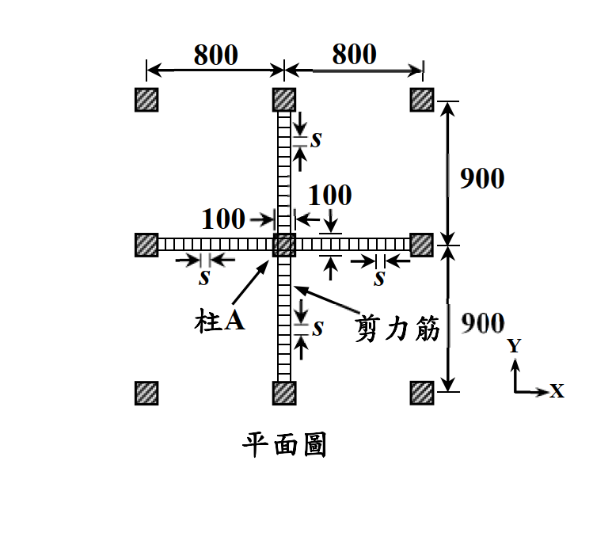
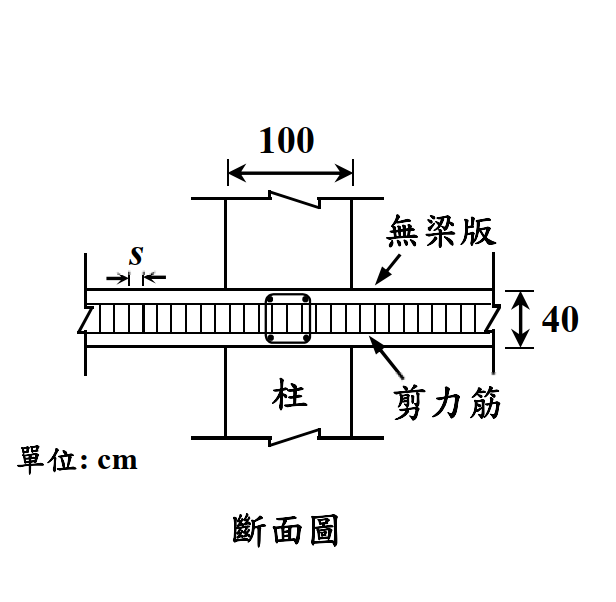

# 考題編號：RC-2020-3

**主分類：** `RC-U3-2` 樓版與基腳設計
**副分類：** 無
**設計法：** USD 強度設計法
**標籤：** `無梁版` `穿孔剪力` `雙向剪力` `內柱` `剪力鋼筋設計` `三公式控制`

---

## 1. 原始題目重述（Problem Restatement）

一地下室無梁版柱系統，版上承擔均佈設計（因數化）載重 $w_u = 4.6 \text{ tf/m}^2$（含自重），版全深 $h = 40 \text{ cm}$，平均有效深度 $d = 35 \text{ cm}$。版與柱之間無彎矩傳遞。

**已知條件：**
- $f'_c = 280 \text{ kgf/cm}^2$，$f_y = 4200 \text{ kgf/cm}^2$
- 柱尺寸：$100 \times 100 \text{ cm}$（正方形，內柱 $\alpha_s = 40$）
- 柱間距：$L_1 = L_2 = 800 \text{ cm}$
- 有效深度 $d = 35 \text{ cm}$，$d/2 = 17.5 \text{ cm}$

**規範給定穿孔剪力公式（無剪力筋）：**

$$V_c = 0.265\!\left(2 + \frac{4}{\beta}\right)\!\sqrt{f'_c}\, b_o d \quad \cdots (1)$$

$$V_c = 0.265\!\left(2 + \frac{\alpha_s d}{b_o}\right)\!\sqrt{f'_c}\, b_o d \quad \cdots (2) \quad (\alpha_s = 40 \text{ 內柱},\ 30 \text{ 邊柱},\ 20 \text{ 角柱})$$

$$V_c = 1.06\sqrt{f'_c}\, b_o d \quad \cdots (3)$$

**有剪力筋時：** $V_c = 0.53\sqrt{f'_c}\, b_o d$

**兩小題：**
1. 若版中無剪力鋼筋，驗核版於柱 A 之混凝土穿孔剪力強度是否足夠。（10 分）
2. 若不足，由柱面往外，沿 X 與 Y 方向配置雙肢剪力鋼筋，計算所需間距 $s$。（10 分）

*圖說：無梁版平面圖，方形內柱100×100 cm，柱間距800 cm（X與Y方向），版全深h=40 cm，d=35 cm；wu=4.6 tf/m²，柱A為內柱，剪力鋼筋由柱面往外沿X、Y方向排列，間距s。*

*圖說：斷面圖顯示版厚h=40 cm，有效深度d=35 cm，柱寬100 cm；剪力筋由柱面往外配置。*

---

## 2. 考題核心精神與出題者意圖（Core Concepts & Examiner's Intent）

**核心觀念：**
1. 穿孔剪力臨界周長 $b_o$ 的計算
2. 三個 $V_c$ 公式取最小值，判斷控制公式
3. 剪力鋼筋間距計算（強度 vs 規範上限）

**出題者意圖：**
- 測驗考生能否正確計算 $b_o$、判斷柱種類（內柱 $\alpha_s = 40$）
- 三個公式中哪個控制（公式(3) = $1.06\sqrt{f'_c}$ 幾乎總是最小值）
- 加入剪力筋後 $V_c$ 降低（從1.06係數降到0.53），但 $V_n$ 仍需滿足

---

## 3. 解題戰略地圖與陷阱分析（Strategic Roadmap & Trap Analysis）

**作戰計畫：**
1. 計算臨界周長 $b_o = 4(c + d) = 4 \times 135 = 540 \text{ cm}$
2. 計算穿孔剪力需求 $V_u$（扣除臨界周長內面積）
3. 代入三個 $V_c$ 公式，取最小值，乘以 $\phi = 0.75$
4. 比較 $\phi V_c$ 與 $V_u$，判斷是否足夠
5. 若不足：換用有剪力筋的 $V_c$，計算所需 $V_s$，求 $s$

**三大陷阱：**

| 陷阱 | 說明 | 對策 |
|------|------|------|
| $V_u$ 面積計算 | 需扣除臨界周長內面積（$(c+d)^2$）再乘 $w_u$ | $V_u = w_u \times [L^2 - (c+d)^2]$ |
| 三個公式全部算完才取最小 | 常見誤以為公式(1)控制（大β時），但公式(3)通常最小 | 全算後比較 |
| 有剪力筋時 $V_c$ 降低 | 加入剪力筋後 $V_c$ 從1.06換成0.53（降低），$V_s$ 需補足差額 | 重算 $V_c = 0.53\sqrt{f'_c}b_od$ |

---

## 3.5 變數層次分析（Variable Hierarchy Analysis）

> 複習提示：第一次解題後，在每個卡住的知識點旁標記 `⚠`；第二次複習時只看有 `⚠` 的項目。

### 最終目標

`(一) 驗算 φVc ≥ Vu（穿孔剪力無筋）；(二) 求雙肢剪力筋間距 s`

### 本題關鍵公式

$$\text{Step 1: } b_o = 4(c + d)$$

$$\text{Step 2: } V_u = w_u \cdot \bigl[L_1 L_2 - (c+d)^2\bigr]$$

$$\text{Step 3: } V_c = \min\!\bigl[\text{式(1), 式(2), 式(3)}\bigr];\quad \phi V_c \stackrel{?}{\geq} V_u$$

$$\text{Step 4: } V_s = \frac{V_u}{\phi} - \boxed{V_c^{(w)}} \quad (V_c^{(w)} = 0.53\sqrt{f'_c}\,\boxed{b_o}\,d)$$

$$\text{Step 5: } s = \frac{A_v f_{yt} \boxed{b_o}}{\boxed{V_s}} \leq \frac{d}{2}$$

### L1：題目直接給定

| 符號 | 數值 | 說明 |
|------|------|------|
| $f'_c$ | 280 kgf/cm² | 混凝土強度 |
| $d$ | 35 cm | 版平均有效深度 |
| $c$ | 100 cm | 正方形柱邊長 |
| $L$ | 800 cm | 柱間距 |
| $w_u$ | 4.6 tf/m² | 設計均佈載重 |
| $\alpha_s$ | 40 | 內柱 |
| $\beta$ | 1.0 | 方形柱長短邊比 |
| $A_v$ | 2.534 cm² | 一組雙肢D13箍筋（2×1.267） |

### L2：需知識點推導

**Step 1：周長與需求**

| 符號 | 公式/來源 | 卡關? |
|------|----------|:-----:|
| $b_o$ | $4(100+35) = 540 \text{ cm}$ | |
| $V_u$ | $4.6/10000 \times (640000 - 18225) = 286 \text{ tf}$ | |

**Step 2：三個 $V_c$ 公式**

| 公式 | 計算結果 | 卡關? |
|------|---------|:-----:|
| (1) $0.265(2+4/\beta)\sqrt{f'_c}b_od$ | $0.265\times6\times16.73\times18900 = 502{,}844 \text{ kgf}$ | |
| (2) $0.265(2+\alpha_s d/b_o)\sqrt{f'_c}b_od$ | $0.265\times4.593\times16.73\times18900 = 384{,}933 \text{ kgf}$ | |
| (3) $1.06\sqrt{f'_c}b_od$ | $1.06\times16.73\times18900 = 335{,}229 \text{ kgf}$ | |
| 控制 | $V_c = \min = 335{,}229 \text{ kgf}$（公式3） | |
| $\phi V_c$ | $0.75\times335{,}229 = 251{,}422 \text{ kgf} = 251.4 \text{ tf}$ | |

**Step 3：有剪力筋設計**

| 符號 | 公式/來源 | 卡關? |
|------|----------|:-----:|
| $V_c^{(w)}$ | $0.53\times16.73\times18900 = 167{,}615 \text{ kgf}$ | |
| $V_s$ | $286017/0.75 - 167615 = 213{,}741 \text{ kgf}$ | |
| $s$ (強度) | $2.534\times4200\times540/213741 = 26.9 \text{ cm}$ | |
| $s$ (規範上限) | $d/2 = 17.5 \text{ cm}$（控制） | |

### L3：深層知識（不懂就卡住）

| 知識點 | 說明 | 卡關? |
|--------|------|:-----:|
| 為何加剪力筋後 $V_c$ 反而降低 | 規範規定加剪力筋時混凝土貢獻取保守值（0.53 vs 1.06），但 $V_n$ 仍能提升 | |
| 規範最大間距 $d/2$ | 防止斜裂縫在相鄰箍筋間穿越，確保每條斜縫都有箍筋穿越 | |
| $V_u$ 為何扣除 $(c+d)^2$ | 臨界周長內的載重直接傳至柱，不在穿孔破壞面上產生剪力 | |
| β 與 αs 何者控制 | 方形柱(β=1)時公式(1)=0.265×6=1.59VC；αs=40時公式(2)≈0.265×4.6≈1.22VC；公式(3)=1.06VC 最小，通常為控制公式 | |

---

## 4. 步驟化詳細計算過程（Step-by-Step Detailed Calculation）

### 前置：斷面與材料參數

$$c = 100 \text{ cm},\quad d = 35 \text{ cm},\quad b_o = 4(c+d) = 4 \times 135 = 540 \text{ cm}$$

$$\sqrt{f'_c} = \sqrt{280} = 16.733 \text{ kgf}^{1/2}/\text{cm}$$

$$w_u = 4.6 \text{ tf/m}^2 = \frac{4.6}{10000} \text{ tf/cm}^2 = 4.6 \times 10^{-4} \text{ tf/cm}^2$$

### 小題(一)：驗核混凝土穿孔剪力強度

**Step 1：穿孔剪力需求 $V_u$**

$$V_u = w_u \times \bigl[L_1 \times L_2 - (c+d)^2\bigr]$$

$$= 4.6 \times 10^{-4} \times \bigl[800 \times 800 - 135 \times 135\bigr]$$

$$= 4.6 \times 10^{-4} \times \bigl[640{,}000 - 18{,}225\bigr]$$

$$= 4.6 \times 10^{-4} \times 621{,}775 = \mathbf{286.0 \text{ tf}} = 286{,}017 \text{ kgf}$$

**Step 2：計算三個 $V_c$ 公式**

柱型：內柱（$\alpha_s = 40$），正方形（$\beta = 1$）

$$b_o \cdot d = 540 \times 35 = 18{,}900 \text{ cm}^2;\quad \sqrt{f'_c} \cdot b_o \cdot d = 16.733 \times 18{,}900 = 316{,}254 \text{ kgf}$$

公式(1)：$\quad \beta = 1,\quad \frac{4}{\beta} = 4$

$$V_{c1} = 0.265 \times (2 + 4) \times 316{,}254 = 0.265 \times 6 \times 316{,}254 = 502{,}843 \text{ kgf}$$

公式(2)：$\quad \frac{\alpha_s d}{b_o} = \frac{40 \times 35}{540} = 2.593$

$$V_{c2} = 0.265 \times (2 + 2.593) \times 316{,}254 = 0.265 \times 4.593 \times 316{,}254 = 384{,}933 \text{ kgf}$$

公式(3)：

$$V_{c3} = 1.06 \times 316{,}254 = 335{,}229 \text{ kgf}$$

**取最小值（公式(3)控制）：**

$$V_c = \min(502{,}843;\ 384{,}933;\ 335{,}229) = \boxed{335{,}229 \text{ kgf} = 335.2 \text{ tf}}$$

**Step 3：比較 $\phi V_c$ 與 $V_u$**

$$\phi V_c = 0.75 \times 335{,}229 = 251{,}422 \text{ kgf} = 251.4 \text{ tf}$$

$$V_u = 286.0 \text{ tf} > \phi V_c = 251.4 \text{ tf} \quad \Longrightarrow \boxed{\text{穿孔剪力強度不足，需配剪力鋼筋}}$$

---

### 小題(二)：設計剪力鋼筋間距 s

加入剪力鋼筋後，混凝土剪力強度降低為：

$$V_c^{(w)} = 0.53\sqrt{f'_c}\,b_o\,d = 0.53 \times 316{,}254 = 167{,}615 \text{ kgf} = 167.6 \text{ tf}$$

**Step 1：所需箍筋剪力強度 $V_s$**

$$\phi(V_c^{(w)} + V_s) \geq V_u \implies V_s \geq \frac{V_u}{\phi} - V_c^{(w)}$$

$$V_s = \frac{286{,}017}{0.75} - 167{,}615 = 381{,}356 - 167{,}615 = \mathbf{213{,}741 \text{ kgf} = 213.7 \text{ tf}}$$

**Step 2：由強度需求求間距 $s$**

雙肢 D13 箍筋每組：$A_v = 2 \times 1.267 = 2.534 \text{ cm}^2$

穿孔剪力筋貢獻（均佈於臨界周長 $b_o$）：

$$V_s = \frac{A_v \cdot f_y \cdot b_o}{s} \implies s = \frac{A_v \cdot f_y \cdot b_o}{V_s}$$

$$s = \frac{2.534 \times 4200 \times 540}{213{,}741} = \frac{5{,}747{,}040}{213{,}741} = 26.9 \text{ cm}$$

**Step 3：規範間距上限**

$$s_{\max,\text{code}} = \frac{d}{2} = \frac{35}{2} = 17.5 \text{ cm}$$

由於規範上限 $17.5 \text{ cm} < s_{\text{strength}} = 26.9 \text{ cm}$，**規範控制**：

$$\boxed{s = 17.5 \text{ cm} = \frac{d}{2}}$$

**Step 4：驗算**

$$V_s = \frac{5{,}747{,}040}{17.5} = 328{,}402 \text{ kgf} = 328.4 \text{ tf}$$

$$\phi V_n = \phi(V_c^{(w)} + V_s) = 0.75 \times (167{,}615 + 328{,}402) = 0.75 \times 496{,}017 = 372{,}013 \text{ kgf} = \mathbf{372.0 \text{ tf}}$$

$$V_u = 286.0 \text{ tf} < \phi V_n = 372.0 \text{ tf} \quad \checkmark$$

---

## 5. 關鍵爭議點與進階探討（Critical Issues & Advanced Discussion）

**1. 加入剪力筋後 $V_c$ 反而降低的邏輯**
無剪力筋時 $V_c = 1.06\sqrt{f'_c}\,b_od = 335$ tf；有剪力筋後 $V_c$ 降為 $0.53\sqrt{f'_c}\,b_od = 168$ tf。這是規範對有剪力筋情況採取保守的混凝土貢獻值（約為一半），但加入 $V_s$ 後總 $V_n$ 仍提升至 372 tf > 251 tf（無筋情況）。考場要注意不能用舊的 $V_c$ 直接加上 $V_s$。

**2. 本題控制公式為何是(3)**
公式(3) = $1.06\sqrt{f'_c}\,b_od$ 等效於 SI 制的 $(1/3)\sqrt{f'_c}\,b_od$（MPa），這是 ACI 318 的基本上限，對方形柱（$\beta = 1$，公式(1)倍數最大）或小型柱（$\alpha_s d/b_o$ 值相對小時）幾乎恆為控制。

**3. $V_u$ 的受力面積**
扣除 $(c+d)^2 = 135^2 = 18{,}225 \text{ cm}^2$ 是因為臨界周長內的版面載重由柱直接承受，不透過穿孔破壞傳遞。若誤用全面積 $L^2 = 640{,}000 \text{ cm}^2$，$V_u$ 將偏大約 2.9%。

**4. 剪力筋範圍**
規範要求剪力筋範圍應從柱面延伸至 $4d = 140 \text{ cm}$ 以外，在此範圍外需驗算外層臨界周長（$b_o' > b_o$）的無剪力筋穿孔強度是否足夠。
