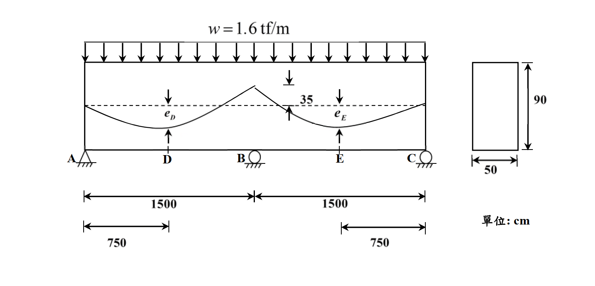

# 考題編號：RC-2020-4

**主分類：** `RC-U4-2` 預力量與偏心量設計
**副分類：** `RC-U4-1` 預力梁斷面應力分析
**設計法：** WSD 工作應力法
**標籤：** `預力連續梁` `一致腱` `二次彎矩` `等效載重法` `均勻軸壓條件` `偏心量設計` `C線`

---

## 1. 原始題目重述（Problem Restatement）

一預力連續梁 A-B-C（兩跨等跨），受均佈靜載重（含自重）$w = 1.6 \text{ tf/m}$，預力鋼腱採拋物線型配置，鋼腱於支承 B 處之偏心為 35 cm。

**已知條件：**
- 跨度：$L_{AB} = L_{BC} = 1500 \text{ cm} = 15 \text{ m}$
- $D$ = 跨 AB 之中點（距 A 750 cm），$E$ = 跨 BC 之中點（距 B 750 cm）
- 斷面：矩形 $50 \times 90 \text{ cm}$
- 鋼腱在 B 支承偏心 $e_B = 35 \text{ cm}$（由圖知在**形心以上**）
- 有效預力 $P_e$ 與初始預力 $P_i$ 之比：$P_e/P_i = 0.8$

**兩小題：**
1. 求 D、E 點偏心值（$e_D$、$e_E$）及 $P_e$，使（i）無二次彎矩、（ii）在 $P_e$ 與載重下斷面受均勻軸壓應力。（15 分）
2. 求在初始預力 $P_i$ 及載重作用下，斷面 B 上緣與下緣應力。（10 分）

*圖說：兩跨連續梁ABC，各跨L=1500 cm，D、E為各跨中點；鋼腱拋物線配置，於B支承上偏心35 cm，D、E處偏心eD、eE待求；矩形斷面50×90 cm；w=1.6 tf/m均佈靜載重（含自重）。*

---

## 2. 考題核心精神與出題者意圖（Core Concepts & Examiner's Intent）

**核心觀念：** 一致腱（concordant tendon）的設計原理：當鋼腱形狀使得預力等效荷載恰好與外部載重在各斷面產生等值反向彎矩，則：
1. 無二次彎矩（超靜定反應不改變預力效果）
2. 斷面僅受均勻軸壓，無彎曲應力

**出題者意圖：**
- 測驗「均勻軸壓 ↔ 每斷面 $M_{total} = 0$」的觀念
- 由 $P_e \cdot e(x) = M_{applied}(x)$ 同時解出 $P_e$ 和偏心分布
- 利用超靜定梁彎矩公式（支點彎矩 $M_B = -wL^2/8$，跨中彎矩 $M_D = wL^2/16$）

---

## 3. 解題戰略地圖與陷阱分析（Strategic Roadmap & Trap Analysis）

**作戰計畫：**
1. 建立均勻軸壓條件：$P_e \cdot e(x) = M_{applied}(x)$（在每個關鍵斷面）
2. 利用已知 $e_B = 35 \text{ cm}$ 和 $M_B = -wL^2/8$ → 求 $P_e$
3. 代入 $M_D = wL^2/16$ → 求 $e_D = e_E$
4. 小題(二)：$P_i = P_e/0.8$，計算等效彎矩 $M_{total}(B)$，求斷面 B 應力

**三大陷阱：**

| 陷阱 | 說明 | 對策 |
|------|------|------|
| 兩跨梁彎矩公式 | $M_D = wL^2/16$（非 $wL^2/8$），$M_B = -wL^2/8$ | 用三彎矩定理或直接記憶等跨結果 |
| 小題(二) 等效力矩方向 | $P_i > P_e$，等效上載 $> w$，B點淨力矩 = 殘差 | $M_{total}(B) = wL^2/8 \times (P_i/P_e - 1)$ |
| 斷面 B 上下緣判斷 | B點淨矩為正（下撓），上緣壓力更大 | 用 $\pm M_{total}/Z$ 分別計算上下緣 |

---

## 3.5 變數層次分析（Variable Hierarchy Analysis）

> 複習提示：第一次解題後，在每個卡住的知識點旁標記 `⚠`；第二次複習時只看有 `⚠` 的項目。

### 最終目標

`(一) 由均勻軸壓條件求 eD、eE、Pe；(二) 由 Pi + w 求斷面 B 上下緣應力`

### 本題關鍵公式

$$\text{Step 1: 均勻軸壓條件：} P_e \cdot e(x) = M_{applied}(x) \text{（每斷面）}$$

$$\text{Step 2: 由 B 點：} P_e \cdot e_B = |M_B| = \frac{wL^2}{8} \implies P_e = \frac{wL^2}{8 e_B}$$

$$\text{Step 3: 由 D 點：} e_D = \frac{M_D}{P_e} = \frac{wL^2/16}{P_e} = \frac{e_B}{2}$$

$$\text{Step 4: (二) } M_{total}(B) = M_{applied}(B) + M_{Pi,primary}(B) = -\frac{wL^2}{8} + \frac{P_i}{P_e} \cdot \frac{wL^2}{8} = \frac{wL^2}{8}\!\left(\frac{P_i}{P_e} - 1\right)$$

$$\text{Step 5: } \sigma_{top} = -\frac{P_i}{A} - \frac{\boxed{M_{total}}}{Z};\quad \sigma_{bot} = -\frac{P_i}{A} + \frac{\boxed{M_{total}}}{Z}$$

### L1：題目直接給定

| 符號 | 數值 | 說明 |
|------|------|------|
| $w$ | 1.6 tf/m | 均佈靜載重 |
| $L$ | 15 m = 1500 cm | 各跨跨度 |
| $e_B$ | 35 cm（形心以上） | 支承B鋼腱偏心 |
| $b \times h$ | 50 × 90 cm | 矩形斷面 |
| $P_e/P_i$ | 0.8 | 損失比 |

### L2：需知識點推導

**Step 1：斷面幾何**

| 符號 | 公式/來源 | 卡關? |
|------|----------|:-----:|
| $A$ | $50 \times 90 = 4500 \text{ cm}^2$ | |
| $I$ | $50 \times 90^3/12 = 3{,}037{,}500 \text{ cm}^4$ | |
| $Z_t = Z_b$ | $I/45 = 67{,}500 \text{ cm}^3$ | |

**Step 2：兩跨連續梁應用彎矩（均佈載重 w，等跨 L）**

| 位置 | 彎矩 | 公式 | 卡關? |
|------|------|------|:-----:|
| 中點 D, E | 正（撓） | $M_D = M_E = +wL^2/16$ | |
| 中間支點 B | 負（拱） | $M_B = -wL^2/8$ | |

**Step 3：求 Pe 與偏心量（一）**

| 符號 | 公式 | 數值 | 卡關? |
|------|------|------|:-----:|
| $M_B$ | $-wL^2/8$ | $-1.6 \times 225/8 = -45 \text{ tf·m}$ | |
| $P_e$ | $|M_B|/e_B = 45/0.35$ | $128.6 \text{ tf}$ | |
| $M_D$ | $+wL^2/16$ | $+22.5 \text{ tf·m}$ | |
| $e_D = e_E$ | $M_D/P_e = 22.5/128.6$ | $17.5 \text{ cm}$（形心以下） | |

**Step 4：斷面 B 應力計算（二）**

| 符號 | 公式 | 數值 | 卡關? |
|------|------|------|:-----:|
| $P_i$ | $P_e/0.8$ | $160.7 \text{ tf}$ | |
| $M_{Pi,primary}(B)$ | $+(P_i/P_e) \times |M_B|$ | $+56.25 \text{ tf·m}$ | |
| $M_{total}(B)$ | $-45 + 56.25$ | $+11.25 \text{ tf·m}$ | |
| $P_i/A$ | $160{,}714/4500$ | $35.71 \text{ kgf/cm}^2$ | |
| $M_{total}/Z$ | $1{,}125{,}000/67{,}500$ | $16.67 \text{ kgf/cm}^2$ | |

### L3：深層知識（不懂就卡住）

| 知識點 | 說明 | 卡關? |
|--------|------|:-----:|
| 一致腱的意義 | 鋼腱形狀使 $M_{primary}(x) = -M_{applied}(x)$，故 $M_{secondary} = 0$ 且無彎矩殘差 | |
| 小題(二) 為何 M_pi_primary 是正 | $P_i > P_e$，等效上拱力 $> w$，超額等效上拱力在 B 點創正（撓）彎矩 | |
| 兩跨梁 $M_D = wL^2/16$ 推導 | 由支反力 $R_A = 3wL/8$，$M_D = R_A \times L/2 - w(L/2)^2/2 = 3wL^2/16 - wL^2/8 = wL^2/16$ | |
| 偏心符號：B點在形心上方 | 在B處鋼腱在形心上方 → 使斷面受正（撓）等效彎矩 → 抵消外載負（拱）彎矩 | |

---

## 4. 步驟化詳細計算過程（Step-by-Step Detailed Calculation）

### 斷面幾何

$$A = 50 \times 90 = 4{,}500 \text{ cm}^2,\quad I = \frac{50 \times 90^3}{12} = 3{,}037{,}500 \text{ cm}^4$$

$$y_t = y_b = 45 \text{ cm},\quad Z = I/45 = 67{,}500 \text{ cm}^3$$

---

### 小題(一)：求 $e_D$、$e_E$、$P_e$

**Step 1：兩跨等跨連續梁（均佈載重 w）各關鍵斷面彎矩**

支反力：$R_A = R_C = 3wL/8$，$R_B = 5wL/4$

$$M_B = -\frac{wL^2}{8} = -\frac{1.6 \times 15^2}{8} = -\frac{360}{8} = -45 \text{ tf·m} = -4{,}500{,}000 \text{ kgf·cm}$$

$$M_D = M_E = \frac{wL^2}{16} = \frac{1.6 \times 225}{16} = \frac{360}{16} = 22.5 \text{ tf·m} = 2{,}250{,}000 \text{ kgf·cm}$$

**Step 2：均勻軸壓條件 → 一致腱**

使斷面僅受軸壓（零彎矩）的條件：

$$M_{net}(x) = M_{applied}(x) + M_{prestress}(x) = 0$$

其中 $M_{prestress}(x) = P_e \cdot e(x)$（$e$ 在形心以下為正，以上為負）

▸ 在支承 B（鋼腱在形心以上 35 cm，$e_B = -35$ cm）：

$$M_{applied}(B) + P_e \cdot e_B = 0$$

$$-45 + P_e \cdot (-0.35) = 0 \implies P_e = \frac{45}{0.35} = \frac{900}{7} \approx \boxed{128.6 \text{ tf}}$$

▸ 在跨中 D（鋼腱在形心以下，$e_D > 0$）：

$$M_{applied}(D) + P_e \cdot (-e_D) = 0$$

$$+22.5 - P_e \cdot e_D = 0 \implies e_D = \frac{22.5}{128.6} = \frac{22.5}{45/0.35} = 0.35 \times \frac{22.5}{45} = 0.35 \times 0.5 = \boxed{0.175 \text{ m} = 17.5 \text{ cm}}$$

由對稱性：$e_E = e_D = 17.5 \text{ cm}$（形心以下）

**結果彙整：**

$$\boxed{e_D = e_E = 17.5 \text{ cm（形心以下）}}$$

$$\boxed{P_e = 128.6 \text{ tf}}$$

**Step 3：驗算（等效載重法）**

拋物線腱在跨 AB 的撓度（chord sag）：
$$f = e_D - \frac{e_A + e_B}{2} = 17.5 - \frac{0 + (-35)}{2} = 17.5 + 17.5 = 35 \text{ cm}$$

等效上拱均佈力：
$$q_{eq} = \frac{8 P_e f}{L^2} = \frac{8 \times 128.6 \times 0.35}{15^2} = \frac{360}{225} = 1.6 \text{ tf/m} = w \quad \checkmark$$

等效上拱力恰好等於外載，證明設計正確。

---

### 小題(二)：斷面 B 在 $P_i$ + 載重下之應力

**Step 1：初始預力**

$$P_i = \frac{P_e}{0.8} = \frac{128.6}{0.8} = \frac{1125}{7} \approx \mathbf{160.7 \text{ tf}} = 160{,}714 \text{ kgf}$$

**Step 2：斷面 B 的總彎矩**

由於腱形為一致腱（concordant），對任意預力值均無二次彎矩（$M_{secondary} = 0$）。

$P_i$ 的等效上拱載重：$q_i = (P_i/P_e) \times w = 1.25 \times 1.6 = 2.0 \text{ tf/m}$

$P_i$ 在 B 點產生的等效撓矩（upward load → 正值）：
$$M_{Pi,B} = +\frac{q_i L^2}{8} = +\frac{2.0 \times 225}{8} = +56.25 \text{ tf·m}$$

外載在 B 點彎矩（downward, negative）：
$$M_{w,B} = -\frac{wL^2}{8} = -45 \text{ tf·m}$$

淨彎矩：
$$M_{total}(B) = M_{w,B} + M_{Pi,B} = -45 + 56.25 = +11.25 \text{ tf·m} = +1{,}125{,}000 \text{ kgf·cm}$$

（正值 = 撓曲，下緣受拉趨勢）

**Step 3：斷面 B 應力**（拉力正值）

直接軸壓應力：
$$\sigma_{axial} = -\frac{P_i}{A} = -\frac{160{,}714}{4{,}500} = -35.71 \text{ kgf/cm}^2$$

彎曲應力（$M_{total} > 0$ = 撓曲，上緣壓、下緣拉）：
$$\frac{M_{total}}{Z} = \frac{1{,}125{,}000}{67{,}500} = 16.67 \text{ kgf/cm}^2$$

**上緣應力（壓力更大）：**
$$\sigma_{top} = -35.71 - 16.67 = \boxed{-52.4 \text{ kgf/cm}^2 \text{（壓應力）}}$$

**下緣應力（壓力較小）：**
$$\sigma_{bot} = -35.71 + 16.67 = \boxed{-19.0 \text{ kgf/cm}^2 \text{（壓應力）}}$$

兩者均為壓應力（合理，初始預力未損失且腱為一致腱）。

---

## 5. 關鍵爭議點與進階探討（Critical Issues & Advanced Discussion）

**1. 一致腱（Concordant Tendon）的幾何意義**
一致腱的形狀與外部載重的彎矩圖成比例。本題連續梁外力彎矩圖：支點B為負（拱），跨中D/E為正（撓），比值 = $M_B : M_D = -2 : 1$。腱的偏心比值 = $-35 : 17.5 = -2 : 1$，完全一致，確認為一致腱。

**2. 小題(二) 應力 vs 均勻軸壓狀態的差異**
小題(一)在 $P_e$ 下斷面受均勻軸壓（$\sigma_{top} = \sigma_{bot} = -P_e/A = -128600/4500 = -28.6 \text{ kgf/cm}^2$）。小題(二)在 $P_i = 1.25 P_e$ 下，等效上拱力 $> w$，B點出現殘餘正（撓）彎矩 $+11.25 \text{ tf·m}$，因此：
- 上緣：$-52.4$ kgf/cm²（更大壓力）
- 下緣：$-19.0$ kgf/cm²（較小壓力）

這在設計階段（初始預力）是合理的暫態應力狀態，需確認不超過容許值。

**3. 等跨連續梁彎矩公式的記憶**

| 位置 | 兩跨等跨 |
|------|---------|
| 跨中 D, E | $+wL^2/16$ |
| 支點 B | $-wL^2/8$ |
| 端支點 A, C | $0$（簡支） |

$M_D/|M_B| = 1/2$，因此 $e_D = e_B/2 = 35/2 = 17.5$ cm 可直接推算（無需先求 $P_e$）。

**4. 若腱非一致腱的後果**
非一致腱在超靜定結構中會產生二次彎矩，改變支反力，並使C線偏離預設位置。本題特別要求「無二次彎矩」，即要求腱為一致腱，設計中 $e_B : e_D = -2 : 1$ 是關鍵。
