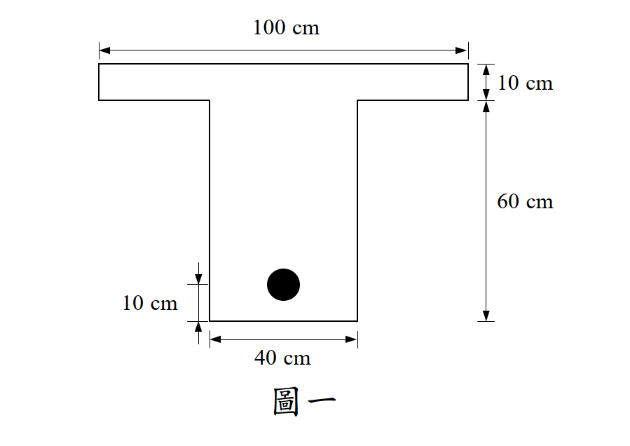

# 考題編號：RC-2021-1

**主分類：** `RC-U1-1` RC 梁彎矩強度分析與設計
**副分類：** `RC-U2-1` RC 剪力強度分析與設計
**設計法：** USD 強度設計法
**標籤：** `T形梁` `最小撓曲鋼筋` `剪力鋼筋設計` `最大肋筋間距` `Vc簡化公式` `臨界斷面` `D10肋筋`

---

## 1. 原始題目重述 (Problem Restatement)

**題目：** 跨度 8 m T 型簡支梁，求跨度中點所需最小撓曲鋼筋量 $(A_s)_{\text{req}}$，並設計兩端近支承處之最大肋筋間距 $s_{\max}$。（30 分）

**材料強度：**
- $f'_c = 240$ kgf/cm²，$f_y = 4200$ kgf/cm²，$f_{yt} = 2800$ kgf/cm²

**斷面幾何（由圖一讀取）：**
- 翼板：$b_f = 100$ cm，$h_f = 10$ cm
- 腹板：$b_w = 40$ cm，腹板高度 60 cm
- 全梁高：$h = 10 + 60 = 70$ cm
- 鋼筋重心距底：10 cm → 有效深度 $d = 70 - 10 = \mathbf{60 \text{ cm}}$

**載重：**
- 靜載重（含自重）：$D = 1.8$ tf/m
- 活載重：$L = 4.5$ tf/m



*圖說：T 型梁斷面，翼板寬 100 cm、厚 10 cm，腹板寬 40 cm、高 60 cm，總高 70 cm，撓曲鋼筋重心距底 10 cm，有效深度 d = 60 cm。*

---

## 2. 考題核心精神與出題者意圖 (Core Concepts & Examiner's Intent)

**核心觀念：** T 型梁中點撓曲設計（判斷中性軸是否在翼板內）+ 支承端剪力鋼筋設計（臨界斷面 + 最大間距控制）。

**出題者意圖：**
1. 測驗 T 型梁「中性軸是否在翼板內」的判斷（等效矩形梁 vs. T 型梁計算）
2. 考驗剪力臨界斷面位置（距支承面 $d$ 處）和 $V_c$ 公式
3. 要求辨別最大間距由「所需 $V_s$」還是「規範最大值」控制

---

## 3. 解題戰略地圖與陷阱分析 (Strategic Roadmap & Trap Analysis)

**作戰計畫：**
```
Part 1（撓曲）：
  wu → Mu（跨中）→ 假設 a ≤ hf → 解 a → 驗算 → As_req
Part 2（剪力）：
  wu → Vu（臨界斷面）→ Vc → 判斷 φVc vs Vu → 求 Vs → 求 s
```

**關鍵陷阱：**

| # | 陷阱 | 應對策略 |
|---|------|---------|
| ⚠1 | T 型梁中性軸判斷：**先假設在翼板內（$a \le h_f$）**，驗算後才確認用哪種計算 | 本題 $a = 7.24$ cm $< h_f = 10$ cm ✓，等效矩形梁 $b = 100$ cm |
| ⚠2 | 剪力設計用**腹板寬** $b_w = 40$ cm，不用翼板寬 | $V_c = 0.53\sqrt{f'_c} \cdot b_w \cdot d$（用 $b_w$）|
| ⚠3 | 臨界斷面距**支承面**（柱面） $d = 60$ cm，不是距梁端 | $V_u = w_u(L/2 - d)$ |
| ⚠4 | 最大間距有兩條限制：①所需 $V_s$ 決定的間距；②$V_s > \frac{1}{3}\sqrt{f'_c}b_wd$ 時 $s_{\max} = d/4$ | 取較小值 |

---

## 3.5 變數層次分析 (Variable Hierarchy Analysis)

> 複習提示：第一次解題後，在每個卡住的知識點旁標記 `⚠`；第二次複習時只看有 `⚠` 的項目。

### 最終目標

`Part 1：求跨中最小撓曲鋼筋量 (As)req；Part 2：求兩端最大肋筋間距 smax`

### 本題關鍵公式（依計算順序）

$$\text{Step 1：因數化載重與彎矩} \quad \boxed{w_u} = 1.2D+1.6L, \quad \boxed{M_u} = \frac{\boxed{w_u}L^2}{8}$$

$$\text{Step 2：假設 }a \le h_f\text{，解等值應力塊深度} \quad 0.85f'_c\cdot b_f\cdot\boxed{a}\!\left(d-\frac{\boxed{a}}{2}\right) = \frac{\boxed{M_u}}{\phi}$$

$$\text{Step 3：} \boxed{(A_s)_{\text{req}}} = \frac{0.85f'_c\cdot b_f\cdot\boxed{a}}{f_y} \ge A_{s,\min} = \rho_{\min}\cdot b_w\cdot d$$

$$\text{Step 4：剪力} \quad \boxed{V_u} = \boxed{w_u}\!\left(\frac{L}{2} - d\right), \quad \boxed{V_c} = 0.53\sqrt{f'_c}\cdot b_w\cdot d$$

$$\text{Step 5：需求鋼筋剪力} \quad \boxed{V_s} = \frac{\boxed{V_u}}{\phi} - \boxed{V_c}, \quad \phi = 0.75$$

$$\text{Step 6：最大間距} \quad s_{\max} = \min\!\left(\frac{A_v\cdot f_{yt}\cdot d}{\boxed{V_s}},\; s_{\text{code}}\right)$$

---

### L1：題目直接給定

| 符號 | 數值 | 說明 |
|------|------|------|
| $L$ | 8 m | 跨度 |
| $b_f$ | 100 cm | 翼板有效寬度（由圖） |
| $h_f$ | 10 cm | 翼板厚度 |
| $b_w$ | 40 cm | 腹板寬度 |
| $d$ | 60 cm | 有效深度（= 70 - 10） |
| $f'_c$ | 240 kgf/cm² | |
| $f_y$ | 4200 kgf/cm² | |
| $f_{yt}$ | 2800 kgf/cm² | 肋筋 |
| $D$ | 1.8 tf/m | 靜載重（含自重） |
| $L$ | 4.5 tf/m | 活載重 |
| $A_b$ (D10) | 0.7133 cm²，2 股 | 肋筋規格 |

---

### L2：需知識點推導

**Part 1：撓曲**

| 符號 | 公式／來源 | 卡關? |
|------|-----------|:-----:|
| $\beta_1$ | $f'_c = 240 < 280$ → 0.85 | |
| $w_u$ | $1.2\times1.8 + 1.6\times4.5$ | |
| $M_u$ | $w_u L^2/8$ | |
| $a$（解二次方程） | $0.85f'_c b_f a(d-a/2) = M_u/\phi$，取小根 | |
| 驗算 $a \le h_f$ | $a = 7.24 < 10$ cm → 中性軸在翼板內 ✓ | |
| $(A_s)_{\text{req}}$ | $0.85f'_c b_f a / f_y$ | |
| $\rho_{\min}$ | $\max(14/f_y,\, 0.8\sqrt{f'_c}/f_y)$（使用 $b_w$） | |

**Part 2：剪力**

| 符號 | 公式／來源 | 卡關? |
|------|-----------|:-----:|
| $V_u$（臨界） | $w_u(L/2 - d)$，距支承面 $d$ 處 | |
| $V_c$（簡化） | $0.53\sqrt{f'_c}\cdot b_w\cdot d$（kgf, cm） | |
| $\phi V_c$ | $0.75\times V_c$ | |
| $V_s$ | $V_u/0.75 - V_c$ | |
| $A_v$ | $2\times 0.7133 = 1.4266$ cm²（雙肢） | |
| $s$（Vs 需求） | $A_v\cdot f_{yt}\cdot d / V_s$ | |
| 切換門檻 | $(1/3)\sqrt{f'_c}\cdot b_w\cdot d$（決定 $s_{\max}$） | |
| $s_{\max}$（規範） | $d/4 = 15$ cm（若 $V_s > $ 門檻） | |

---

### L3：深層知識（不懂就卡住）

| 知識點 | 說明 | 卡關? |
|--------|------|:-----:|
| T 型梁等效矩形梁條件 | 當 $a \le h_f$ 時，壓力區完全在翼板，可等效為寬度 $b_f$ 的矩形梁計算 $A_s$ | |
| T 型梁 $\rho_{\min}$ 用 $b_w$ | 最小配筋比公式中，T 型梁用腹板寬 $b_w$，不用翼板寬 $b_f$ | |
| 剪力設計用腹板寬 | T 型梁受剪力時，剪力集中於腹板，$V_c = 0.53\sqrt{f'_c}\cdot b_w\cdot d$ 用 $b_w$，不用 $b_f$ | |
| $V_s$ 超過門檻時的最大間距 | $V_s > \frac{1}{3}\sqrt{f'_c}b_wd$ → $s_{\max} = d/4 \le 30$ cm（要求更密的箍筋） | |

---

## 4. 步驟化詳細計算過程 (Step-by-Step Detailed Calculation)

### Part 1：跨中最小撓曲鋼筋量

**Step 1：因數化載重與彎矩**
$$w_u = 1.2D + 1.6L = 1.2\times1.8 + 1.6\times4.5 = 2.16 + 7.20 = \mathbf{9.36 \text{ tf/m}}$$

$$M_u = \frac{w_u L^2}{8} = \frac{9.36\times8^2}{8} = 9.36\times8 = \mathbf{74.88 \text{ tf·m} = 7{,}488{,}000 \text{ kgf·cm}}$$

**Step 2：$\beta_1$ 與假設中性軸在翼板內**

$$\beta_1 = 0.85 \quad (f'_c = 240 \text{ kgf/cm}^2 < 280 \text{ kgf/cm}^2)$$

令 $b = b_f = 100$ cm，由 $\phi M_n = M_u$：

$$0.85f'_c\cdot b_f\cdot a\left(d-\frac{a}{2}\right) = \frac{M_u}{\phi}$$

$$0.85\times240\times100\times a\left(60-\frac{a}{2}\right) = \frac{7{,}488{,}000}{0.90} = 8{,}320{,}000$$

$$20{,}400a\left(60-\frac{a}{2}\right) = 8{,}320{,}000$$

$$1{,}224{,}000a - 10{,}200a^2 = 8{,}320{,}000$$

整理：

$$10{,}200a^2 - 1{,}224{,}000a + 8{,}320{,}000 = 0 \quad \Rightarrow \quad a^2 - 120a + 815.69 = 0$$

$$a = \frac{120 - \sqrt{120^2 - 4\times815.69}}{2} = \frac{120 - \sqrt{14{,}400 - 3{,}262.7}}{2} = \frac{120 - \sqrt{11{,}137.3}}{2} = \frac{120 - 105.53}{2}$$

$$\boxed{a = 7.24 \text{ cm} < h_f = 10 \text{ cm}} \quad\checkmark \text{（中性軸在翼板內，等效矩形梁有效）}$$

**Step 3：撓曲鋼筋量**

$$\boxed{(A_s)_{\text{req}}} = \frac{0.85f'_c\cdot b_f\cdot a}{f_y} = \frac{0.85\times240\times100\times7.24}{4200} = \frac{147{,}696}{4200} = \mathbf{35.17 \text{ cm}^2}$$

**驗算 $\phi$（確認拉力控制）：**
$$c = \frac{a}{\beta_1} = \frac{7.24}{0.85} = 8.52 \text{ cm}, \quad \varepsilon_t = \frac{0.003(60-8.52)}{8.52} = \frac{0.003\times51.48}{8.52} = 0.01814 \ge 0.005 \quad \phi = 0.90 \checkmark$$

**最小鋼筋量驗算（以腹板寬 $b_w$ 計）：**

$$\rho_{\min} = \max\!\left(\frac{14}{f_y},\;\frac{0.8\sqrt{f'_c}}{f_y}\right) = \max\!\left(\frac{14}{4200},\;\frac{0.8\times15.49}{4200}\right) = \max(0.00333,\;0.00295) = 0.00333$$

$$A_{s,\min} = 0.00333\times b_w\times d = 0.00333\times40\times60 = 7.99 \text{ cm}^2$$

$$\boxed{(A_s)_{\text{req}} = \max(35.17,\;7.99) = \mathbf{35.17 \text{ cm}^2}} \quad\text{（撓曲需求控制）}$$

---

### Part 2：兩端近支承處最大肋筋間距

**Step 4：因數化剪力（臨界斷面距支承面 $d = 60$ cm）**

$$V_u = w_u\left(\frac{L}{2} - d\right) = 9.36\times(4.0 - 0.6) = 9.36\times3.4 = \mathbf{31.82 \text{ tf}}$$

**Step 5：混凝土剪力強度**

$$V_c = 0.53\sqrt{f'_c}\cdot b_w\cdot d = 0.53\times\sqrt{240}\times40\times60 = 0.53\times15.49\times2400 = \mathbf{19{,}706 \text{ kgf} = 19.71 \text{ tf}}$$

$$\phi V_c = 0.75\times19.71 = 14.78 \text{ tf} < V_u = 31.82 \text{ tf} \quad\Rightarrow\quad \text{需設計肋筋}$$

**驗算截面尺寸是否足夠：**

$$V_{s,\max} = \frac{2}{3}\sqrt{f'_c}\cdot b_w\cdot d = \frac{2}{3}\times15.49\times40\times60 = 24{,}784 \text{ kgf} = 24.78 \text{ tf}$$

$$\phi(V_c + V_{s,\max}) = 0.75\times(19.71+24.78) = 0.75\times44.49 = 33.37 \text{ tf} > 31.82 \text{ tf} \quad\checkmark$$

**Step 6：需求鋼筋剪力**

$$V_s = \frac{V_u}{\phi} - V_c = \frac{31.82}{0.75} - 19.71 = 42.43 - 19.71 = \mathbf{22.72 \text{ tf}}$$

**Step 7：D10 雙肢肋筋間距**

$$A_v = 2\times0.7133 = 1.4266 \text{ cm}^2$$

$$s \le \frac{A_v\cdot f_{yt}\cdot d}{V_s} = \frac{1.4266\times2800\times60}{22{,}720} = \frac{239{,}669}{22{,}720} = \mathbf{10.55 \text{ cm}}$$

**Step 8：規範最大間距限制**

判斷 $V_s$ 與門檻的關係：

$$\frac{1}{3}\sqrt{f'_c}\cdot b_w\cdot d = \frac{1}{3}\times15.49\times40\times60 = 12{,}392 \text{ kgf} = 12.39 \text{ tf}$$

$$V_s = 22.72 \text{ tf} > 12.39 \text{ tf} \quad\Rightarrow\quad s_{\max,\text{code}} = \frac{d}{4} = \frac{60}{4} = 15 \text{ cm}$$

**Step 9：最大間距取小值**

$$s_{\max} = \min(10.55,\;15) = \mathbf{10.55 \text{ cm}}$$

$$\boxed{s_{\max} = 10.55 \text{ cm，取用 } \mathbf{s = 10 \text{ cm}}}$$

**驗算：** 以 $s = 10$ cm：
$$V_s = \frac{1.4266\times2800\times60}{10} = 23{,}967 \text{ kgf} = 23.97 \text{ tf}$$
$$\phi(V_c+V_s) = 0.75\times(19.71+23.97) = 0.75\times43.68 = 32.76 \text{ tf} > 31.82 \text{ tf} \quad\checkmark$$

---

## 5. 關鍵爭議點與進階探討 (Critical Issues & Advanced Discussion)

### 爭議點 1：翼板有效寬度是否為 100 cm？

題目圖一直接標示 100 cm，應取此為有效翼板寬度。若依規範自行計算：
- $L/4 = 800/4 = 200$ cm
- $b_w + 2\times8h_f = 40 + 160 = 200$ cm

兩者均 ≥ 100 cm，故 100 cm 是最保守的值，用題目所給 100 cm 即可。

### 爭議點 2：$\rho_{\min}$ 用 $b_w$ 還是 $b_f$？

ACI/台灣規範：T 型梁計算 $A_{s,\min}$ 時，用**腹板寬** $b_w$（不用翼板寬）。原因是翼板處於壓力區，最小配筋的目的是防止拉力側混凝土開裂後立即脆性破壞，故以腹板寬代入。

### 爭議點 3：最大間距由哪個控制？

本題 $V_s = 22.72$ tf 超過門檻 12.39 tf，最大間距縮為 $d/4 = 15$ cm。但由需求 $V_s$ 推算的間距 10.55 cm 更小，故最終 $s_{\max} = 10$ cm 由**強度需求**控制，而非規範最大值。

### 進階：若取 $s = 15$ cm 會怎樣？

$$V_s = \frac{1.4266\times2800\times60}{15} = 15{,}978 \text{ kgf} = 15.98 \text{ tf}$$
$$\phi V_n = 0.75\times(19.71+15.98) = 26.77 \text{ tf} < 31.82 \text{ tf} \quad \times \text{（不足！）}$$

說明：$s_{\max} = 15$ cm（規範最大值）在本題**無法**滿足強度需求，設計者必須以 10 cm 的間距才夠。
