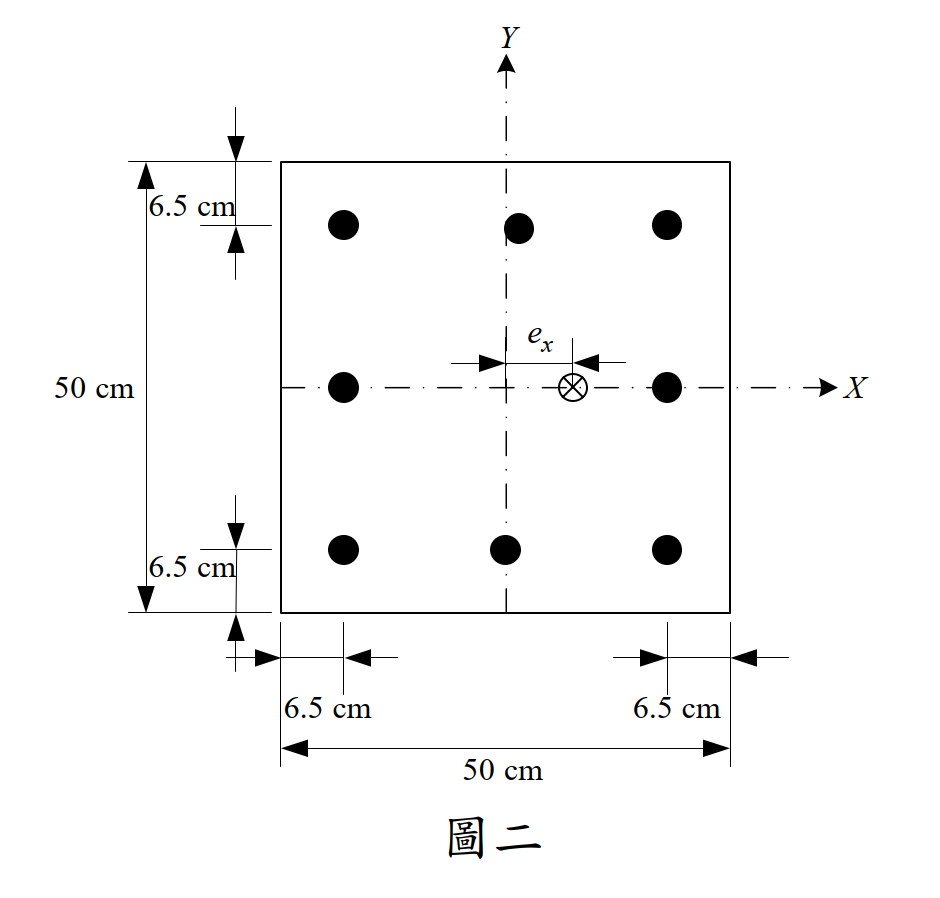

# 考題編號：RC-2021-2

**主分類：** `RC-U1-2` RC 柱強度分析與設計
**副分類：** 無
**設計法：** USD 強度設計法
**標籤：** `偏心軸壓` `偏心距求解` `P-M互制` `中性軸位置` `鋼筋應變分析` `壓縮區鋼筋淨力` `大偏心`

---

## 1. 原始題目重述 (Problem Restatement)

**題目：** 已知方柱 50×50 cm，配 8-D25，破壞時中性軸距最大壓應變面 $c = 14.5$ cm，求偏心距 $e_x$。（25 分）

**材料強度：**
- $f'_c = 280$ kgf/cm²，$E_c = 12000\sqrt{f'_c}$（kgf/cm² 單位）
- $f_y = 4200$ kgf/cm²，$E_s = 2.04\times10^6$ kgf/cm²

**斷面幾何（由圖二讀取）：**
- 斷面：$50\times50$ cm（關於 Y 軸對稱）
- 8-D25（$A_b = 5.067$ cm²）；保護層至鋼筋中心均為 6.5 cm
- 偏心距 $e_x$ 沿 X 方向（水平向）
- 鋼筋排列（3+2+3）：

| 列 | X 位置（距右面） | 棒數 | 總面積 |
|----|--------------|-----|------|
| 右列（壓力側） | 6.5 cm | 3 | 15.201 cm² |
| 中列（形心） | 25 cm | 2 | 10.134 cm² |
| 左列（拉力側） | 43.5 cm | 3 | 15.201 cm² |



*圖說：50×50 cm 方柱，8-D25 以 3（頂）+2（中）+3（底）方式排列，各排至邊緣距離 6.5 cm，偏心載重 ex 沿 X 軸（水平）施加。*

---

## 2. 考題核心精神與出題者意圖 (Core Concepts & Examiner's Intent)

**核心觀念：** 由已知中性軸深度 $c$，逆推各排鋼筋應力 → 計算 $P_n$、$M_n$ → 求偏心距 $e_x = M_n/P_n$。

**出題者意圖：**
1. 測驗考生能否從已知 $c$ 出發，**不需要試誤法**，直接求 $P_n$、$M_n$
2. 考驗壓縮區鋼筋的「淨壓力」處理（需扣除 $0.85f'_c$）
3. 確認中間排鋼筋（位於形心）應變是否達降伏

---

## 3. 解題戰略地圖與陷阱分析 (Strategic Roadmap & Trap Analysis)

**作戰計畫：**
```
Step 1：確定中性軸、β1、a
Step 2：計算各排鋼筋應變，判斷是否降伏
Step 3：計算各排鋼筋淨力
Step 4：求 Pn（水平力平衡），取矩求 Mn
Step 5：ex = Mn/Pn
```

**關鍵陷阱：**

| # | 陷阱 | 應對策略 |
|---|------|---------|
| ⚠1 | 壓縮區鋼筋（右列）位於應力塊內：需用**淨壓力** $f_{s,\text{net}} = f_s - 0.85f'_c$ | 確認 $d_s < a$ → 使用淨力 |
| ⚠2 | 中間列（x=25）鋼筋位於**截面形心**，對彎矩**無貢獻** | 力矩臂為零，只貢獻 $P_n$ |
| ⚠3 | 中間列應變是否達降伏須**驗算**（$|\varepsilon_s| > \varepsilon_y$？） | 本題 $|\varepsilon_{\text{center}}| = 0.00217 > \varepsilon_y = 0.00206$ → 剛好降伏 |
| ⚠4 | $e_x$ 可能 $> h/2 = 25$ cm（大偏心），不必驚訝 | 大偏心柱屬拉力控制，$c$ 小，$e_x$ 大 |

---

## 3.5 變數層次分析 (Variable Hierarchy Analysis)

> 複習提示：第一次解題後，在每個卡住的知識點旁標記 `⚠`；第二次複習時只看有 `⚠` 的項目。

### 最終目標

`由已知 c = 14.5 cm，求各排鋼筋應力 → Pn、Mn → ex = Mn/Pn`

### 本題關鍵公式（依計算順序）

$$\text{Step 1：} \boxed{a} = \beta_1 c = 0.85\times14.5$$

$$\text{Step 2：各排應變} \quad \varepsilon_{si} = 0.003\times\frac{c - d_i}{c}, \quad \varepsilon_y = \frac{f_y}{E_s}$$

$$\text{Step 3：各排應力（壓縮區淨力）} \quad \boxed{f_{s1,\text{net}}} = \boxed{f_{s1}} - 0.85f'_c \;\;(d_1 < \boxed{a})$$

$$\text{Step 4：軸力} \quad \boxed{P_n} = 0.85f'_c\cdot\boxed{a}\cdot b + A_{s1}\cdot\boxed{f_{s1,\text{net}}} - A_{s2}\cdot f_y - A_{s3}\cdot f_y$$

$$\text{Step 5：彎矩（對形心取矩）} \quad \boxed{M_n} = C_c\!\left(25-\frac{\boxed{a}}{2}\right) + C_{s1}(25-d_1) + T_3(d_3-25)$$

$$\text{Step 6：偏心距} \quad \boxed{e_x} = \frac{\boxed{M_n}}{\boxed{P_n}}$$

---

### L1：題目直接給定

| 符號 | 數值 | 說明 |
|------|------|------|
| $h = b$ | 50 cm | 方柱邊長 |
| $c$ | 14.5 cm | **直接給定**的中性軸深度 |
| $f'_c$ | 280 kgf/cm² | |
| $f_y$ | 4200 kgf/cm² | |
| $E_s$ | $2.04\times10^6$ kgf/cm² | |
| $A_b$ | 5.067 cm² | D25 |
| 保護層 | 6.5 cm（至鋼筋中心） | 圖二 |

---

### L2：需知識點推導

| 符號 | 公式／來源 | 卡關? |
|------|-----------|:-----:|
| $\beta_1$ | $f'_c = 280$ → 0.85（臨界值） | |
| $a$ | $0.85\times c = 0.85\times14.5$ | |
| $\varepsilon_y$ | $f_y/E_s = 4200/2{,}040{,}000$ | |
| $d_1, d_2, d_3$ | 各排距壓縮面：6.5, 25, 43.5 cm | |
| $\varepsilon_{s1}$（右列） | $0.003(c-6.5)/c$（壓縮，正） | |
| $\varepsilon_{s2}$（中列） | $0.003(c-25)/c$（張拉，負） | |
| $\varepsilon_{s3}$（左列） | $0.003(c-43.5)/c$（張拉，負） | |
| 各排是否降伏 | 比較 $|\varepsilon_{si}|$ vs $\varepsilon_y$ | |
| $f_{s1,\text{net}}$ | $f_{s1} - 0.85f'_c$（因 $d_1 < a$） | |
| $C_c$ | $0.85f'_c\cdot a\cdot b$ | |
| $P_n$ | $C_c + C_{s1} - T_2 - T_3$ | |
| $M_n$ | 對形心取矩，$T_2$ 力矩臂 $= 0$ | |
| $e_x$ | $M_n/P_n$ | |

---

### L3：深層知識（不懂就卡住）

| 知識點 | 說明 | 卡關? |
|--------|------|:-----:|
| 壓縮區鋼筋淨力的物理意義 | 鋼筋佔據了混凝土應力塊面積，若直接加 $A_s\times f_s$，混凝土壓力就被重複計算一次；淨力 $= A_s(f_s-0.85f'c)$ 才是正確的額外貢獻 | |
| 中間排對彎矩無貢獻 | 中間排在截面形心（距壓縮面 25 cm = h/2），力矩臂 = 0；但仍貢獻 $P_n$（向下的張拉力） | |
| $\beta_1 = 280$ 的臨界值 | $f'_c = 280$ 是 $\beta_1$ 折減的起始點，此值本身仍用 0.85，超過才折減 | |
| 大偏心（張力控制）的物理意義 | $c = 14.5$ cm 遠小於平衡中性軸 $c_b$；軸力小、偏心大；$e_x > h/2 = 25$ cm 表示載重作用點在截面外側，為超大偏心情形 | |

---

## 4. 步驟化詳細計算過程 (Step-by-Step Detailed Calculation)

### Step 1：材料參數與等值應力塊

$$\beta_1 = 0.85 \quad (f'_c = 280 \text{ kgf/cm}^2 \le 280)$$

$$a = \beta_1 \times c = 0.85\times14.5 = \mathbf{12.325 \text{ cm}}$$

$$\varepsilon_y = \frac{f_y}{E_s} = \frac{4200}{2{,}040{,}000} = 0.002059$$

---

### Step 2：各排鋼筋位置與應變

壓縮面在右側，各排鋼筋距壓縮面：

| 排別 | 距壓縮面 $d_i$ | 應變 $\varepsilon_{si}$ | 降伏？ | 應力 |
|------|:---:|:---:|:---:|:---:|
| 右列（3 根） | 6.5 cm | $+0.003\times\dfrac{14.5-6.5}{14.5} = +0.001655$ | 未降伏（壓縮） | $+3{,}376$ kgf/cm² |
| 中列（2 根） | 25 cm | $+0.003\times\dfrac{14.5-25}{14.5} = -0.002172$ | **剛好降伏**（拉力） | $-4{,}200$ kgf/cm² |
| 左列（3 根） | 43.5 cm | $+0.003\times\dfrac{14.5-43.5}{14.5} = -0.006$ | 降伏（拉力） | $-4{,}200$ kgf/cm² |

**右列詳算：**
$$f_{s1} = E_s \times \varepsilon_{s1} = 2{,}040{,}000\times0.001655 = 3{,}376 \text{ kgf/cm}^2 \quad (\text{壓縮，未降伏})$$

**驗算中列是否降伏：**
$$|\varepsilon_{s2}| = 0.002172 > \varepsilon_y = 0.002059 \quad\Rightarrow\quad f_{s2} = -4200 \text{ kgf/cm}^2 \checkmark$$

**右列在應力塊內？**
$$d_1 = 6.5 \text{ cm} < a = 12.325 \text{ cm} \quad\Rightarrow\quad \text{右列在壓縮應力塊內，需用淨力}$$

$$f_{s1,\text{net}} = f_{s1} - 0.85f'_c = 3{,}376 - 0.85\times280 = 3{,}376 - 238 = \mathbf{3{,}138 \text{ kgf/cm}^2}$$

---

### Step 3：各截面力

**混凝土壓力：**
$$C_c = 0.85\times f'_c\times a\times b = 0.85\times280\times12.325\times50 = 238\times616.25 = \mathbf{146{,}668 \text{ kgf}}$$

作用點距壓縮面：$a/2 = 6.163$ cm

**右列鋼筋淨壓力：**
$$C_{s1} = A_{s1}\times f_{s1,\text{net}} = (3\times5.067)\times3{,}138 = 15.201\times3{,}138 = \mathbf{47{,}701 \text{ kgf}}$$

**中列拉力（位於形心）：**
$$T_2 = A_{s2}\times f_y = (2\times5.067)\times4200 = 10.134\times4200 = \mathbf{42{,}563 \text{ kgf}}$$

**左列拉力：**
$$T_3 = A_{s3}\times f_y = (3\times5.067)\times4200 = 15.201\times4200 = \mathbf{63{,}844 \text{ kgf}}$$

---

### Step 4：軸力 $P_n$

$$P_n = C_c + C_{s1} - T_2 - T_3$$
$$= 146{,}668 + 47{,}701 - 42{,}563 - 63{,}844$$
$$= 194{,}369 - 106{,}407 = \mathbf{87{,}962 \text{ kgf} = 87.96 \text{ tf}}$$

---

### Step 5：彎矩 $M_n$（對截面形心取矩）

形心位於距壓縮面 $h/2 = 25$ cm 處，各力矩臂：

| 力 | 大小 (kgf) | 距壓縮面 (cm) | 距形心（正→壓縮側） | 力矩 (kgf·cm) |
|----|:---------:|:---:|:---:|:---:|
| $C_c$ | 146,668 | 6.163 | $25-6.163 = +18.837$ | $+2{,}762{,}734$ |
| $C_{s1}$ | 47,701 | 6.5 | $25-6.5 = +18.5$ | $+882{,}469$ |
| $T_2$ | 42,563 | 25 | $25-25 = 0$ | $\mathbf{0}$ |
| $T_3$ | 63,844 | 43.5 | $43.5-25 = -18.5$（拉力向左） | $+1{,}181{,}114$ |

> 說明：$T_3$ 為拉力，力矩方向與 $C_c$ 相同（同向加大彎矩），故為正值。

$$M_n = 2{,}762{,}734 + 882{,}469 + 0 + 1{,}181{,}114 = \mathbf{4{,}826{,}317 \text{ kgf·cm} = 48.26 \text{ tf·m}}$$

---

### Step 6：偏心距

$$\boxed{e_x = \frac{M_n}{P_n} = \frac{4{,}826{,}317}{87{,}962} = \mathbf{54.87 \text{ cm}}}$$

**驗算大偏心合理性：**

平衡點中性軸深度（以有效深度 $d = 43.5$ cm 估計）：
$$c_b = \frac{6120}{6120 + 4200}\times43.5 = 0.5930\times43.5 = 25.79 \text{ cm}$$

$$c = 14.5 \text{ cm} \ll c_b = 25.79 \text{ cm} \quad\Rightarrow\quad \text{大偏心（拉力控制）}$$

大偏心柱的偏心距 $e_x > e_b$，可以超過 $h/2 = 25$ cm，本題 $e_x = 54.87$ cm 物理上合理。

---

## 5. 關鍵爭議點與進階探討 (Critical Issues & Advanced Discussion)

### 爭議點 1：中列鋼筋是否恰好降伏？

$|\varepsilon_{s2}| = 0.002172$ 比 $\varepsilon_y = 0.002059$ 大了 5.5%，確實已降伏。若只差一點點，應取 $f_{s2} = E_s|\varepsilon_{s2}|$ 而非直接取 $f_y$，本題可直接取 $-4200$ kgf/cm²。

### 爭議點 2：設計彎矩強度 $\phi M_n$ vs $M_n$

本題求的是**標稱**軸力 $P_n$ 和偏心距，不是設計強度。若題目問設計偏心距，則應用 $\phi P_n$ 和 $\phi M_n$（$\phi$ 依 $\varepsilon_t$ 決定）：
$$\varepsilon_t = 0.003\times\frac{43.5-14.5}{14.5} = 0.003\times2.0 = 0.006 \ge 0.005 \Rightarrow \phi = 0.90$$

### 進階：偏心方向確認

本題 $e_x = 54.87$ cm 是 X 方向偏心，比截面寬度 50 cm 還大，代表軸力 $P$ 作用點在截面右緣外側（超出右緣 4.87 cm）。這是純拉力控制情形，在橋梁柱、高層建築邊柱常見。
