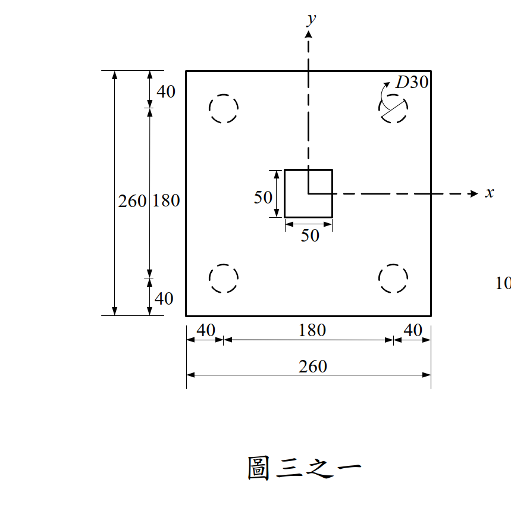
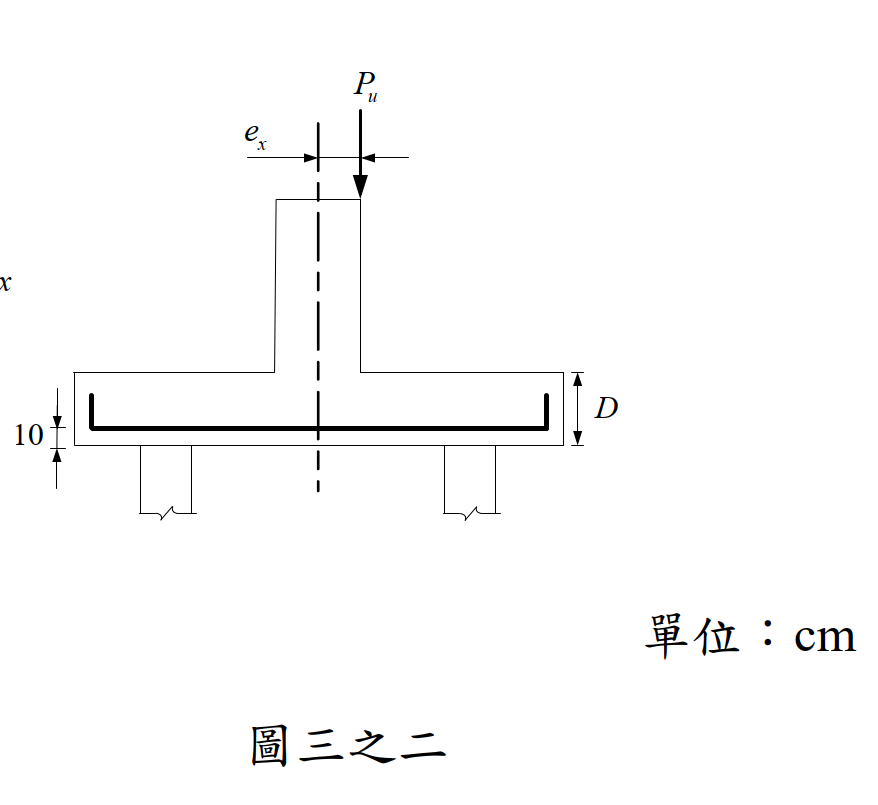

# 考題編號：RC-2021-3

**主分類：** `RC-U3-2` 樓版與基腳設計
**副分類：** 無
**設計法：** USD 強度設計法
**標籤：** `樁帽設計` `偏心載重` `基樁軸力` `最大偏心距` `雙向剪力` `角隅基樁穿孔` `剛性樁帽假設`

---

## 1. 原始題目重述 (Problem Restatement)

**題目：** 260×260 cm 樁帽，4 根 D30 基樁，柱 50×50 cm，承受偏心軸力 $P_u = 100$ tf，求柱載重最大容許偏心距 $e_x$。（20 分）

**條件與限制：**
- 樁帽厚 $D = 55$ cm，有效深度 $d = 55 - 10 = 45$ cm
- $f'_c = 280$ kgf/cm²，不設置剪力鋼筋
- 基樁最大承壓軸力：$P_c = 40$ tf
- 基樁最大承拉軸力：$P_t = -10$ tf
- 忽略樁帽自重；假設樁帽為剛體

**樁位幾何（由圖三之一讀取）：**
- 樁帽 260×260 cm，樁中心距邊緣 40 cm → 樁中心距樁帽中心 = 260/2 - 40 = **90 cm**
- 4 根樁位於 $(x, y) = (\pm90, \pm90)$ cm（以樁帽形心為原點）



*圖說：260×260 cm 樁帽，4 根 D30 樁排列於 (±90, ±90) cm，柱 50×50 cm 位於形心，偏心距 ex 沿 X 方向。*



*圖說：樁帽厚 55 cm，底部 10 cm 至主筋中心，有效深度 d = 45 cm，偏心載重 Pu 作用點偏移 ex。*

---

## 2. 考題核心精神與出題者意圖 (Core Concepts & Examiner's Intent)

**核心觀念：** 在偏心軸力下，利用剛體靜力學求各基樁軸力；再依基樁承壓/承拉限制與樁帽穿孔剪力，決定最大容許偏心距。

**出題者意圖：**
1. 測驗「剛性樁帽假設」的應用（靜力學）
2. 考驗樁帽雙向剪力（穿孔）設計公式的三條件選最小值
3. 確認哪個限制（基樁力 vs 穿孔剪力）才是真正控制條件

---

## 3. 解題戰略地圖與陷阱分析 (Strategic Roadmap & Trap Analysis)

**作戰計畫：**
```
Step 1：確認樁位及各樁到形心距離
Step 2：用剛性樁帽公式求各樁軸力 → 由 Pc、Pt 限制求 ex
Step 3：驗算柱底穿孔剪力（αs = 40）
Step 4：驗算角隅基樁穿孔剪力（αs = 20）
Step 5：取 Step 2 與 Step 3~4 中最嚴格的 ex
```

**關鍵陷阱：**

| # | 陷阱 | 應對策略 |
|---|------|---------|
| ⚠1 | 對稱 4 根樁的 $\Sigma x_i^2$ 計算：**全部 4 根都要算** | $\Sigma x_i^2 = 4\times90^2 = 32{,}400$ cm² |
| ⚠2 | $\beta_c$（柱長短邊比）= 50/50 = 1（方柱） | 公式一 $0.265(2+4/\beta_c) = 1.59$，不是 2 |
| ⚠3 | 穿孔周長 $b_0$ 對柱為方形周長 + $d$；對基樁為圓形周長（取 3/4 圓考量角隅） | 分別計算 $b_0$ |
| ⚠4 | 本題壓力限制（$P_c \le 40$ tf）比拉力限制（$P_t \ge -10$ tf）嚴格，必須**分別計算兩者對應的 $e_x$** | 取較小值 |

---

## 3.5 變數層次分析 (Variable Hierarchy Analysis)

> 複習提示：第一次解題後，在每個卡住的知識點旁標記 `⚠`；第二次複習時只看有 `⚠` 的項目。

### 最終目標

`求偏心距 ex，使：① 各基樁軸力不超過 Pc/Pt 限制；② 樁帽雙向剪力不超過 φVc（無箍筋）`

### 本題關鍵公式（依計算順序）

$$\text{Step 1：基樁軸力} \quad \boxed{P_i} = \frac{P_u}{n} \pm \frac{P_u\cdot e_x\cdot x_i}{\sum x_j^2}$$

$$\text{Step 2：由 } \boxed{P_{i,\max}} \le P_c \text{ 得} \quad \boxed{e_{x,P_c}} = \left(P_c - \frac{P_u}{n}\right)\frac{\sum x_j^2}{P_u\cdot x_{\max}}$$

$$\text{Step 3：柱底穿孔} \quad \frac{V_c}{\sqrt{f'_c}\cdot\boxed{b_{0,\text{col}}}\cdot d} = \min\!\left(0.265\!\left(2+\tfrac{4}{\beta_c}\right),\;0.265\!\left(2+\tfrac{\alpha_s d}{\boxed{b_{0,\text{col}}}}\right),\;1.06\right)$$

$$\text{Step 4：角隅基樁穿孔} \quad \frac{V_c}{\sqrt{f'_c}\cdot\boxed{b_{0,\text{pile}}}\cdot d} = \min\!\left(\cdots,\;1.06\right)$$

$$\text{Step 5：} \boxed{e_{x,\max}} = \min\!\left(\boxed{e_{x,P_c}},\;e_{x,P_t},\;e_x \text{ s.t. } P_{i,\max} \le \phi V_{c,\text{pile}}\right)$$

---

### L1：題目直接給定

| 符號 | 數值 | 說明 |
|------|------|------|
| 樁帽平面 | 260×260 cm | |
| $D$ | 55 cm | 樁帽厚度 |
| $d$ | $55-10=45$ cm | 有效深度（圖三之二：底部 10 cm 至鋼筋） |
| 柱斷面 | 50×50 cm | $\beta_c = 1$ |
| 樁徑 | 30 cm（D30） | |
| $n$ | 4 根 | |
| 樁心距邊緣 | 40 cm | |
| $P_u$ | 100 tf | 因數化軸力 |
| $P_c$（上限） | 40 tf | 承壓容許 |
| $P_t$（下限） | -10 tf | 承拉容許 |
| $f'_c$ | 280 kgf/cm² | |

---

### L2：需知識點推導

| 符號 | 公式／來源 | 卡關? |
|------|-----------|:-----:|
| 樁位 $x_i$ | $260/2 - 40 = 90$ cm（各樁距形心） | |
| $\Sigma x_i^2$ | $4\times90^2 = 32{,}400$ cm² | |
| $P_i$（各基樁力） | $P_u/4 \pm P_u\cdot e_x\cdot 90/32{,}400$ | |
| $e_{x,P_c}$ | 令 $P_{i,\max} = 40$ tf 解 $e_x$ | |
| $e_{x,P_t}$ | 令 $P_{i,\min} = -10$ tf 解 $e_x$ | |
| $b_{0,\text{col}}$（柱） | $4\times(50+d) = 4\times95$ | |
| $b_{0,\text{pile}}$（角隅樁，3/4圓） | $(3/4)\times2\pi\times(15+d/2) = (3/4)\times2\pi\times37.5$ | |
| $\phi V_c$ | $\phi\times1.06\times\sqrt{f'_c}\times b_0\times d$（最小值公式控制） | |

---

### L3：深層知識（不懂就卡住）

| 知識點 | 說明 | 卡關? |
|--------|------|:-----:|
| 剛性樁帽假設 | 樁帽視為不變形，載重按「平截面保持平面」原理分配到各樁；公式同彎矩分配 $P_i = P/n \pm M x_i/\Sigma x_i^2$ | |
| 穿孔剪力三條控制公式 | ① 柱長短邊比（適用非方柱）② 剪跨比（$\alpha_s$ 取決於柱位置：內柱 40、邊柱 30、角柱 20）③ 固定上限 1.06；取**最小值**為設計控制 | |
| 角隅樁 $b_0$ 修正 | 角隅樁的臨界剪切面受樁帽兩側邊限制，取 3/4 圓；若臨界面在帽內則無需修正，但本題習慣採保守 3/4 圓 | |
| $\alpha_s = 20$ 用於角隅樁 | 角隅樁相當於「角柱」位置，$\alpha_s = 20$ 使公式②更大，表示不是控制條件 | |

---

## 4. 步驟化詳細計算過程 (Step-by-Step Detailed Calculation)

### Step 1：樁位幾何

樁帽 260 cm，距邊緣 40 cm → 4 根樁位於 $(x, y) = (\pm90, \pm90)$ cm

$$\sum x_i^2 = 4\times90^2 = 32{,}400 \text{ cm}^2$$

---

### Step 2：基樁軸力公式（剛性樁帽假設）

偏心矩 $M_x = P_u \times e_x = 100\,e_x$ tf·cm，各樁軸力：

$$P_i = \frac{P_u}{4} \pm \frac{P_u\cdot e_x\cdot x_i}{\sum x_j^2} = 25 \pm \frac{100\cdot e_x\cdot 90}{32{,}400} = 25 \pm \frac{e_x}{3.6} \text{ (tf)}$$

**壓力側（$x_i = +90$）：**
$$P_{i,\max} = 25 + \frac{e_x}{3.6}$$

**拉力側（$x_i = -90$）：**
$$P_{i,\min} = 25 - \frac{e_x}{3.6}$$

---

### Step 3：由基樁軸力限制求 $e_x$

**限制一：$P_{i,\max} \le 40$ tf（承壓上限）**
$$25 + \frac{e_x}{3.6} \le 40 \quad\Rightarrow\quad \frac{e_x}{3.6} \le 15 \quad\Rightarrow\quad \boxed{e_x \le 54 \text{ cm}} \quad \cdots \text{①}$$

**限制二：$P_{i,\min} \ge -10$ tf（承拉下限）**
$$25 - \frac{e_x}{3.6} \ge -10 \quad\Rightarrow\quad \frac{e_x}{3.6} \le 35 \quad\Rightarrow\quad e_x \le 126 \text{ cm} \quad \cdots \text{②}$$

**基樁軸力控制：** 取較嚴格的 ① → $e_x \le 54$ cm

---

### Step 4：驗算柱底穿孔剪力（$\alpha_s = 40$）

$$d = 55 - 10 = 45 \text{ cm}, \quad \sqrt{280} = 16.73$$

**臨界周長：**
$$b_{0,\text{col}} = 4\times(50 + d) = 4\times95 = 380 \text{ cm}$$

**抗剪係數（取最小值）：**

| 公式 | 計算 | 結果 |
|------|------|------|
| ① $0.265\times(2+4/\beta_c)$ | $0.265\times(2+4/1)$ | $1.59$ |
| ② $0.265\times(2+\alpha_s d/b_0)$ | $0.265\times(2+40\times45/380)$ | $1.785$ |
| ③ 固定上限 | — | $\mathbf{1.06}$ ← 控制 |

**柱底穿孔剪力強度：**
$$V_c = 1.06\times\sqrt{280}\times380\times45 = 1.06\times16.73\times17{,}100 = 303{,}241 \text{ kgf}$$

$$\phi V_c = 0.75\times303{,}241 = \mathbf{227{,}431 \text{ kgf} = 227.4 \text{ tf}}$$

**剪力需求：** 所有 4 根樁均位於柱底臨界面**外側**（樁心距柱心 $\sqrt{90^2+90^2} = 127.3$ cm $\gg d/2+c/2 = 22.5+25 = 47.5$ cm），故：

$$V_u = P_u = 100 \text{ tf} \ll \phi V_c = 227.4 \text{ tf} \quad\checkmark \text{（與 }e_x\text{ 無關，恆成立）}$$

---

### Step 5：驗算角隅基樁穿孔剪力（$\alpha_s = 20$）

最大基樁軸力（當 $e_x = 54$ cm）：$P_{i,\max} = 40$ tf

**臨界周長（取 3/4 圓）：**

基樁半徑 $r = 15$ cm，$d/2 = 22.5$ cm，臨界圓半徑 $= r + d/2 = 37.5$ cm

$$b_{0,\text{pile}} = \frac{3}{4}\times2\pi\times37.5 = \frac{3}{4}\times235.6 = \mathbf{176.7 \text{ cm}}$$

**抗剪係數（取最小值）：**

| 公式 | 計算 | 結果 |
|------|------|------|
| ① $0.265\times(2+4/1)$ | — | $1.59$ |
| ② $0.265\times(2+20\times45/176.7)$ | $0.265\times(2+5.09)$ | $1.88$ |
| ③ 固定上限 | — | $\mathbf{1.06}$ ← 控制 |

**角隅基樁穿孔剪力強度：**
$$V_c = 1.06\times16.73\times176.7\times45 = 1.06\times133{,}006 = 140{,}986 \text{ kgf}$$

$$\phi V_c = 0.75\times140{,}986 = \mathbf{105{,}740 \text{ kgf} = 105.7 \text{ tf}}$$

**最大基樁軸力 = 40 tf $\ll$ $\phi V_c$ = 105.7 tf $\quad\checkmark$**（穿孔剪力不控制）

---

### Step 6：最大容許偏心距

| 限制條件 | 來源 | $e_x$ 上限 |
|---------|------|:--------:|
| 基樁承壓 $P_{i,\max} \le 40$ tf | 剛體靜力學 | **54 cm** ← 控制 |
| 基樁承拉 $P_{i,\min} \ge -10$ tf | 剛體靜力學 | 126 cm |
| 柱底穿孔剪力 | 恆滿足 | 無限制 |
| 角隅基樁穿孔剪力 | 恆滿足 | 無限制 |

$$\boxed{e_{x,\max} = 54 \text{ cm}} \quad\text{（由基樁最大承壓軸力控制）}$$

---

## 5. 關鍵爭議點與進階探討 (Critical Issues & Advanced Discussion)

### 爭議點 1：有效深度 $d$ 的取法

本題 $d = 55 - 10 = 45$ cm，其中 10 cm 為「鋼筋中心距底面」（由圖三之二讀取）。若誤取 $d = D = 55$ cm，穿孔剪力結果略有不同，但本題結果不受影響（控制條件為基樁軸力，非穿孔剪力）。

### 爭議點 2：角隅樁 $b_0$ 的計算方式

本題採 3/4 圓保守估算（因樁心距邊緣僅 40 cm，臨界半徑 37.5 cm，僅差 2.5 cm）。若精確計算，由於臨界面在帽內，可使用完整圓周長（$b_0 = 2\pi\times37.5 = 235.6$ cm），使 $\phi V_c$ 更大，結論不變。

### 爭議點 3：拉力限制為何不控制？

在 $e_x = 54$ cm 時，拉力側樁力 $= 25 - 54/3.6 = 25 - 15 = 10$ tf（仍為壓縮力）。樁沒有進入受拉狀態。拉力限制（$P_t \ge -10$ tf）在 $e_x > 90$ cm 時才開始控制，遠大於壓力限制所得 54 cm。

### 進階：若增加樁數或改變樁間距？

本題 4 根樁在 $\pm90$ cm 處，相當於樁群的「抵抗力矩 $= \Sigma x_i^2/x_{\max} = 32400/90 = 360$ cm」。若樁間距增大，$\Sigma x_i^2$ 增加，可允許更大的偏心距。
