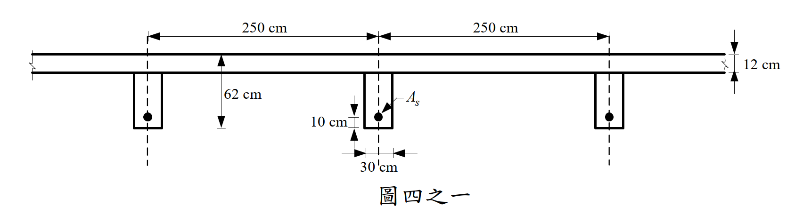
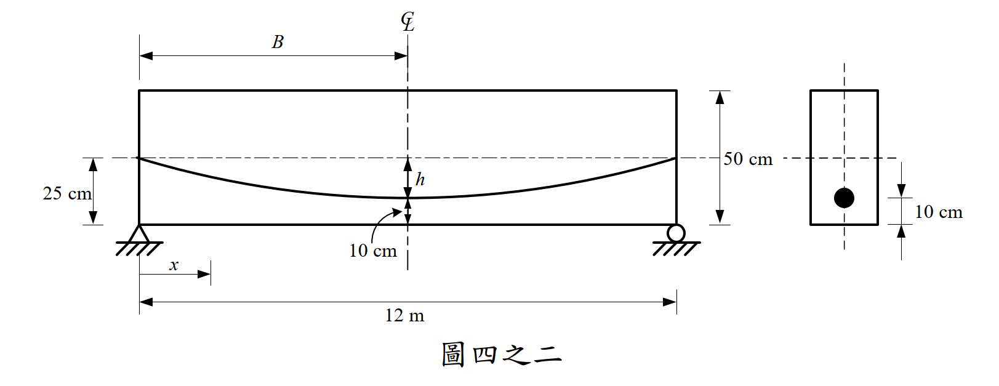

# 考題編號：RC-2021-4

**主分類：** `RC-U4-1` 預力梁斷面應力分析
**副分類：** 無
**設計法：** WSD 工作應力法（容許應力設計法）
**標籤：** `預力T型梁` `組合斷面` `有效翼板寬` `容許壓應力` `容許拉應力` `最大活載重` `服務載重分析` `後拉法`

---

## 1. 原始題目重述 (Problem Restatement)

**題目：** 後拉法預鑄預力矩形梁與場鑄板組合成 T 型梁，求可承載之最大均布活載重。（25 分）

**材料與基本參數：**
- $f'_c = 350$ kgf/cm²（梁與板同材料）
- 容許壓應力：$0.6f'_c = 210$ kgf/cm²
- 容許拉應力：$1.6\sqrt{f'_c} = 1.6\times\sqrt{350} = \mathbf{29.93}$ kgf/cm²
- $F_i = 300$ tf，$F_e = 0.7F_i = \mathbf{210}$ tf（梁中點有效預力）

**幾何尺寸（由圖四之一讀取）：**
- 預鑄梁：$b_w = 30$ cm，$h = 50$ cm
- 場鑄板：厚 $h_f = 12$ cm，梁中心距 250 cm
- 跨度：$L = 12$ m

**鋼腱配置（由圖四之二讀取）：**
- 拋物線鋼腱：支承端位於梁形心（距梁底 25 cm，$e = 0$）；梁中點位於梁底 10 cm（距梁底 10 cm）

**載重：**
- 靜載重（含自重）：$W_D = 1.6$ tf/m



*圖說：T 型組合斷面，有效翼板寬 222 cm（計算所得），場鑄板厚 12 cm，預鑄梁 30×50 cm，翼板形心距梁底 56 cm，梁形心距梁底 25 cm。*



*圖說：拋物線鋼腱，支承端在預鑄梁形心（距底 25 cm，e=0），梁中點降至距底 10 cm（距組合截面形心 34.83 cm 處）。*

---

## 2. 考題核心精神與出題者意圖 (Core Concepts & Examiner's Intent)

**核心觀念：** 預力組合 T 型梁服務載重分析。先計算有效翼板寬及組合斷面性質，再對各纖維施加容許應力限制，求解最大活載重。

**出題者意圖：**
1. 測驗有效翼板寬的三條件計算
2. 考驗 T 型組合斷面形心與慣性矩的計算
3. 確認上下纖維均需驗算，找出控制條件（底部拉應力 vs 頂部壓應力）

---

## 3. 解題戰略地圖與陷阱分析 (Strategic Roadmap & Trap Analysis)

**作戰計畫：**
```
Step 1：計算有效翼板寬 bf（三條件取最小）
Step 2：計算組合 T 型斷面 A、ȳ、I（忽略鋼腱貢獻）
Step 3：計算鋼腱在組合截面的偏心量 e
Step 4：列出中點底纖維（拉力控制）和頂纖維（壓力控制）兩個應力不等式
Step 5：解最大 wL
```

**關鍵陷阱：**

| # | 陷阱 | 應對策略 |
|---|------|---------|
| ⚠1 | **有效翼板寬**需取三條件最小值，且 L/4 是**總**翼板寬 | 分別計算三者後取 min |
| ⚠2 | 偏心量 $e$ 是從**組合截面形心**量到鋼腱，不是從預鑄梁形心 | $e = \bar{y}_b - 10 = 44.83 - 10 = 34.83$ cm |
| ⚠3 | **底纖維**在大活載重下承受拉力（預力 + DL 的壓縮被 LL 的拉力抵消）→ 通常控制 | 底部拉應力限制給出 $w_L \le 3.73$ tf/m |
| ⚠4 | 頂纖維壓應力限制通常不控制（因翼板很寬，翼板頂壓力不大） | 驗算 $w_L \le 9.00$ tf/m（不控制）|

---

## 3.5 變數層次分析 (Variable Hierarchy Analysis)

> 複習提示：第一次解題後，在每個卡住的知識點旁標記 `⚠`；第二次複習時只看有 `⚠` 的項目。

### 最終目標

`求滿足容許壓應力（$0.6f'_c$）與容許拉應力（$1.6\sqrt{f'_c}$）的最大均布活載重 $w_L$`

### 本題關鍵公式（依計算順序）

$$\text{Step 1：有效翼板寬} \quad \boxed{b_f} = \min\!\left(\frac{L}{4},\; b_w + 2\times8h_f,\; b_w + \text{淨距}\right)$$

$$\text{Step 2：組合斷面} \quad \boxed{A},\;\boxed{\bar{y}_b},\;\boxed{I} \text{ 由 T 型斷面公式計算}$$

$$\text{Step 3：偏心量} \quad \boxed{e} = \boxed{\bar{y}_b} - 10 \text{ cm（鋼腱距組合截面底部）}$$

$$\text{Step 4：底纖維應力} \quad f_{\text{bot}} = \frac{F_e}{A} + \frac{F_e\cdot\boxed{e}\cdot\boxed{\bar{y}_b}}{\boxed{I}} - \frac{(M_D + M_L)\cdot\boxed{\bar{y}_b}}{\boxed{I}} \ge -1.6\sqrt{f'_c}$$

$$\text{Step 5：頂纖維應力} \quad f_{\text{top}} = \frac{F_e}{A} - \frac{F_e\cdot\boxed{e}\cdot c_{\text{top}}}{\boxed{I}} + \frac{(M_D + M_L)\cdot c_{\text{top}}}{\boxed{I}} \le 0.6f'_c$$

$$\text{Step 6：由 Step 4 解} \quad \boxed{w_L} = \frac{\left(f_{\text{bot,ps+DL}} + 1.6\sqrt{f'_c}\right)\cdot\boxed{I}/\boxed{\bar{y}_b}}{L^2/8}$$

---

### L1：題目直接給定

| 符號 | 數值 | 說明 |
|------|------|------|
| $L$ | 12 m | 跨度 |
| $b_w$ | 30 cm | 腹板（預鑄梁）寬 |
| $h_{\text{beam}}$ | 50 cm | 預鑄梁高 |
| $h_f$ | 12 cm | 場鑄板厚 |
| 梁中心距 | 250 cm | 相鄰梁間距 |
| $F_i$ | 300 tf | 初始預力 |
| $F_e$ | $0.7\times300 = 210$ tf | 有效預力（中點） |
| $f'_c$ | 350 kgf/cm² | |
| $W_D$ | 1.6 tf/m | 含自重靜載重 |
| 鋼腱（中點） | 距底 10 cm | 圖四之二 |

---

### L2：需知識點推導

**Step 1：有效翼板寬**

| 符號 | 公式／來源 | 卡關? |
|------|-----------|:-----:|
| ① $L/4$ | $1200/4 = 300$ cm（總寬限制） | |
| ② $b_w + 2\times8h_f$ | $30 + 2\times96 = 222$ cm | |
| ③ $b_w + \text{淨距}$ | $30 + (250-30) = 250$ cm | |
| $b_f$ | $\min(300, 222, 250) = 222$ cm | |

**Step 2–3：組合斷面性質**

| 符號 | 公式／來源 | 卡關? |
|------|-----------|:-----:|
| $A$ | $222\times12 + 30\times50$ | |
| $\bar{y}_b$（形心距底） | $\sum A_i\bar{y}_i / A$ | |
| $c_{\text{top}}$ | $h_{\text{total}} - \bar{y}_b$ | |
| $I$ | Steiner 定理（各分區 $I_0 + A d^2$） | |
| $e$（鋼腱偏心） | $\bar{y}_b - 10$ cm | |

**Step 4–5：應力不等式 → wL**

| 符號 | 公式／來源 | 卡關? |
|------|-----------|:-----:|
| $M_D$ | $W_D L^2/8 = 1.6\times18 = 28.8$ tf·m | |
| $M_L$ | $w_L\times18$ tf·m（wL 為待求） | |
| 底纖維 $f_{\text{bot}}$ | 三項（Fe/A + 預力彎矩 - 外力彎矩）$\ge -29.93$ kgf/cm² | |
| 頂纖維 $f_{\text{top}}$ | 三項 $\le 210$ kgf/cm² | |

---

### L3：深層知識（不懂就卡住）

| 知識點 | 說明 | 卡關? |
|--------|------|:-----:|
| 預力梁底纖維在服務載重下 | 預力創造大壓縮（底部 309 kgf/cm²），DL + LL 的彎矩拉力逐漸抵消；活載重越大，底部越趨向拉力，最終到達容許拉應力限制 | |
| 有效翼板寬三條件 | ① L/4（跨度效應）② bw + 2×8hf（翼板剛度效應）③ bw + 淨距（鄰梁限制）；取最小值代表最嚴格的有效壓縮寬度 | |
| 偏心量用組合截面形心 | 服務階段的預力彎矩是 Fe×e，其中 e 相對於**組合截面**形心計算，而非預鑄梁形心，因為服務階段整個組合斷面共同承力 | |

---

## 4. 步驟化詳細計算過程 (Step-by-Step Detailed Calculation)

### Step 1：有效翼板寬 $b_f$

$$\text{淨距（每側）} = \frac{250-30}{2} = 110 \text{ cm}$$

| 條件 | 計算 | 結果 |
|------|------|------|
| ① $L/4$（總翼板寬限） | $1200/4 = 300$ cm | 300 cm |
| ② $b_w + 2\times8h_f$ | $30 + 2\times8\times12 = 30 + 192$ | 222 cm |
| ③ $b_w + 2\times\min(8h_f,\text{淨距/2})$ | 同上（$8h_f = 96 < 110$，故取 96） | 222 cm |

$$\boxed{b_f = \min(300,\;222,\;250) = \mathbf{222 \text{ cm}}}$$

---

### Step 2：組合 T 型斷面性質

**全高：** $h_{\text{total}} = 50 + 12 = 62$ cm

**各分區（以距底面量測）：**

| 分區 | 面積 $A_i$ | 形心 $\bar{y}_i$ | $A_i\bar{y}_i$ |
|------|:---:|:---:|:---:|
| 預鑄梁（30×50） | 1500 cm² | 25 cm | 37,500 cm³ |
| 場鑄板（222×12） | 2664 cm² | 56 cm | 149,184 cm³ |
| **合計** | **4164 cm²** | — | **186,684 cm³** |

**形心距底面：**
$$\bar{y}_b = \frac{186{,}684}{4{,}164} = \mathbf{44.83 \text{ cm}}$$

$$c_{\text{top}} = 62 - 44.83 = \mathbf{17.17 \text{ cm}}$$

**慣性矩：**

| 分區 | $I_0$ (cm⁴) | $A_i d_i^2$ ($d_i$ = 距複合形心) | $I_i$ (cm⁴) |
|------|:---:|:---:|:---:|
| 梁：$d = 44.83-25 = 19.83$ cm | 312,500 | $1500\times19.83^2 = 589{,}845$ | 902,345 |
| 板：$d = 56-44.83 = 11.17$ cm | 32,016 | $2664\times11.17^2 = 332{,}387$ | 364,403 |

$$\boxed{I = 902{,}345 + 364{,}403 = \mathbf{1{,}266{,}748 \text{ cm}^4}}$$

---

### Step 3：鋼腱偏心量

鋼腱在梁中點距底 10 cm（距組合截面底部 10 cm）：
$$e = \bar{y}_b - 10 = 44.83 - 10 = \mathbf{34.83 \text{ cm（在形心以下）}}$$

---

### Step 4：容許應力

$$f_{c,\text{all}} = 0.6\times350 = 210 \text{ kgf/cm}^2 \text{（壓縮）}$$

$$f_{t,\text{all}} = 1.6\sqrt{350} = 1.6\times18.71 = \mathbf{29.93 \text{ kgf/cm}^2 \text{（拉伸）}}$$

---

### Step 5：服務載重應力（梁中點）

**預力貢獻（壓縮正）：**
$$\frac{F_e}{A} = \frac{210{,}000}{4{,}164} = 50.43 \text{ kgf/cm}^2$$

$$\frac{F_e\cdot e}{I} = \frac{210{,}000\times34.83}{1{,}266{,}748} = 5.774 \text{ kgf/cm}^2/\text{cm}$$

底纖維預力應力：
$$f_{\text{bot,ps}} = 50.43 + 5.774\times44.83 = 50.43 + 258.9 = \mathbf{309.3 \text{ kgf/cm}^2}$$

頂纖維預力應力：
$$f_{\text{top,ps}} = 50.43 - 5.774\times17.17 = 50.43 - 99.1 = \mathbf{-48.7 \text{ kgf/cm}^2 \text{（拉）}}$$

**靜載重 $M_D$（梁中點）：**
$$M_D = \frac{1.6\times12^2}{8} = 28.8 \text{ tf·m} = 2{,}880{,}000 \text{ kgf·cm}$$

$$\frac{M_D}{I}\times\bar{y}_b = \frac{2{,}880{,}000\times44.83}{1{,}266{,}748} = \mathbf{101.9 \text{ kgf/cm}^2}$$

$$\frac{M_D}{I}\times c_{\text{top}} = \frac{2{,}880{,}000\times17.17}{1{,}266{,}748} = \mathbf{39.0 \text{ kgf/cm}^2}$$

**靜載重後各纖維應力：**

$$f_{\text{bot,ps+DL}} = 309.3 - 101.9 = 207.4 \text{ kgf/cm}^2 < 210 \quad\checkmark$$

$$f_{\text{top,ps+DL}} = -48.7 + 39.0 = -9.7 \text{ kgf/cm}^2 > -29.93 \quad\checkmark$$

---

### Step 6：活載重上限

設 $w_L$（tf/m），則：
$$M_L = \frac{w_L\times12^2}{8} = 18w_L \text{ tf·m} = 1{,}800{,}000w_L \text{ kgf·cm}$$

**底纖維（拉力控制）：**
$$f_{\text{bot}} = 207.4 - \frac{1{,}800{,}000 w_L\times44.83}{1{,}266{,}748} = 207.4 - 63.70w_L \ge -29.93$$

$$63.70w_L \le 207.4 + 29.93 = 237.33$$

$$\boxed{w_L \le \frac{237.33}{63.70} = \mathbf{3.73 \text{ tf/m}}} \quad\cdots \text{①（控制）}$$

**頂纖維（壓力控制）：**
$$f_{\text{top}} = -9.7 + \frac{1{,}800{,}000 w_L\times17.17}{1{,}266{,}748} = -9.7 + 24.40w_L \le 210$$

$$24.40w_L \le 219.7$$

$$w_L \le 9.00 \text{ tf/m} \quad\cdots \text{②（不控制）}$$

**彙整：**

| 條件 | 限制 $w_L$ |
|------|:--------:|
| ① 底纖維拉應力 $\ge -29.93$ kgf/cm² | **3.73 tf/m** ← 控制 |
| ② 頂纖維壓應力 $\le 210$ kgf/cm² | 9.00 tf/m |

$$\boxed{w_{L,\max} = \mathbf{3.73 \text{ tf/m}}}$$

---

## 5. 關鍵爭議點與進階探討 (Critical Issues & Advanced Discussion)

### 爭議點 1：預力應力用哪個截面計算？

本題採用**組合截面**計算服務預力應力（統一使用組合斷面 A、I、ȳ）。嚴格分析應採用「分段施工法」：
- **施工階段**（預鑄梁+濕板重）：用預鑄梁斷面（30×50 cm）
- **服務階段**（超載重+活載重）：增量應力用組合斷面

此題採統一組合截面為簡化處理，考場常見。

### 爭議點 2：偏心量為什麼是 34.83 cm？

鋼腱在中點距底 10 cm，但**組合截面形心**在 44.83 cm 處（比預鑄梁形心 25 cm 高很多，因翼板面積大）。因此偏心量 = 44.83 - 10 = 34.83 cm，遠大於用預鑄梁形心計算的 15 cm。這是本題最容易出錯的地方。

### 爭議點 3：頂纖維在 DL + LL 下是否可能受拉？

從服務分析：在 $w_L < 0.397$ tf/m 時，頂纖維仍受拉（$f_{\text{top}} < 0$），但拉力很小（最大 9.7 kgf/cm² 在 $w_L = 0$），遠低於容許拉應力 29.93 kgf/cm²，故合理。

### 進階：預力上拱（camber）的物理意義

等效預力向上力 $w_p = 8F_e e / L^2 = 8\times210\times0.3483/144 = 4.06$ tf/m，相當於均布向上力，抵消大部分靜載重（1.6 tf/m），這正是預力設計的核心精髓。
