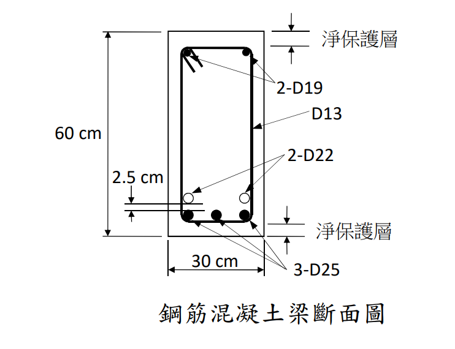

# 考題編號：RC-2022-1

**主分類：** `RC-U1-1` RC 梁彎矩強度分析與設計
**副分類：** 無
**設計法：** USD 強度設計法
**標籤：** `雙筋梁` `壓力筋未降伏` `有效深度` `Whitney應力塊` `φMn` `εt控制` `雙層拉力筋`

---

## 1. 原始題目重述 (Problem Restatement)

**題目：** 求下圖所示梁斷面之設計彎矩強度 $\phi M_n$。（25 分）

**材料強度：**
- 混凝土抗壓強度：$f'_c = 280 \text{ kgf/cm}^2$
- 鋼筋降伏強度：$f_y = 5600 \text{ kgf/cm}^2$
- 淨保護層：$c = 4 \text{ cm}$

**斷面幾何（由圖讀取）：**
- 梁寬：$b = 30 \text{ cm}$，梁深：$h = 60 \text{ cm}$
- 箍筋：D13（$d_b = 1.27 \text{ cm}$）
- 拉力筋（下層）：3-D25（$A_b = 5.067 \text{ cm}^2$）
- 拉力筋（上層）：2-D22（$A_b = 3.871 \text{ cm}^2$）；兩層鋼筋淨距 2.5 cm
- 壓力筋：2-D19（$A_b = 2.865 \text{ cm}^2$）

*圖說：矩形斷面 b×h = 30×60 cm，壓力側頂部配 2-D19 壓力筋，拉力側底部配 3-D25，其上方淨距 2.5 cm 處再配 2-D22，箍筋 D13，上下淨保護層均為 4 cm。*

---

## 2. 考題核心精神與出題者意圖 (Core Concepts & Examiner's Intent)

**核心觀念：** 雙筋梁（雙層拉力筋 + 壓力筋）的 $\phi M_n$ 計算。  
本題特殊之處在於 $f_y = 5600 \text{ kgf/cm}^2$（高強度鋼筋），此時壓力筋**不一定**能降伏，必須逐步驗證。

**出題者意圖：**
1. 測驗考生是否能正確計算雙層拉力筋的合力作用點（有效深度 $d$）
2. 考驗壓力筋降伏假設的驗證流程（高強度鋼筋使 $\varepsilon_y$ 變大，壓力筋更難降伏）
3. 確認 $\phi$ 值的選取是否根據 $\varepsilon_t$ 判斷

---

## 3. 解題戰略地圖與陷阱分析 (Strategic Roadmap & Trap Analysis)

**作戰計畫：**
1. 計算各鋼筋重心位置 → 求 $d$、$d'$
2. **先假設壓力筋降伏**，計算 $c$ 並驗證假設
3. 若壓力筋未降伏 → 用彈性公式建立方程式，解二次方程求 $c$
4. 計算 $\varepsilon_t$ → 判斷 $\phi$ 值
5. 計算 $M_n$，求 $\phi M_n$

**關鍵陷阱：**

| # | 陷阱 | 應對策略 |
|---|------|---------|
| ⚠1 | **雙層拉力筋的有效深度 $d$** 需以加權形心計算，不可取最下層中心 | 對兩層鋼筋面積作力矩求合力作用點 |
| ⚠2 | **壓力筋降伏假設**在 $f_y = 5600$ 時 $\varepsilon_y = 0.00274$ 遠大於一般值，需驗證 | 先假設降伏求 $c$，回代驗算 $\varepsilon'_s$ |
| ⚠3 | 壓力筋的淨壓力需扣除被混凝土佔據的部分：$f'_{s,\text{net}} = f'_s - 0.85f'_c$ | 合力方程中使用 $f'_{s,\text{net}}$ 而非 $f'_s$ |
| ⚠4 | $\phi$ 值依 $\varepsilon_t$ 判定：$\varepsilon_t \ge 0.005$ → $\phi = 0.90$；介於 0.004~0.005 → 線性內插 | 計算 $\varepsilon_t$ 後判斷 |

---

## 3.5 變數層次分析 (Variable Hierarchy Analysis)

> 複習提示：第一次解題後，在每個卡住的知識點旁標記 `⚠`；第二次複習時只看有 `⚠` 的項目。

### 最終目標

`求雙筋梁（雙層拉力筋 + 壓力筋）之設計彎矩強度 φMn，含壓力筋是否降伏的判斷流程`

### 本題關鍵公式（依計算順序）

$$\text{Step 1：雙層拉力筋有效深度} \quad d = h - \frac{A_{s1}\cdot\bar{y}_1 + A_{s2}\cdot\bar{y}_2}{A_{s1}+A_{s2}}$$

$$\text{Step 2（試算）：假設壓力筋降伏，由力平衡求} \quad 0.85f'_c\beta_1\boxed{c_{\text{trial}}} b + A'_s(f_y - 0.85f'_c) = A_sf_y$$

$$\text{Step 3（驗算）：} \varepsilon'_s = \frac{0.003\left(\boxed{c_{\text{trial}}}-d'\right)}{\boxed{c_{\text{trial}}}} \quad \text{vs.} \quad \varepsilon_y = \frac{f_y}{E_s}$$

$$\text{Step 4（}\varepsilon'_s < \varepsilon_y\text{，改用彈性應力）：} f'_s = \frac{6120(c-d')}{c} \Rightarrow \text{整理得二次方程} \Rightarrow \boxed{c}$$

$$\text{Step 5：} \boxed{a} = \beta_1\boxed{c}, \quad \boxed{f'_{s,\text{net}}} = \frac{6120(\boxed{c}-d')}{\boxed{c}} - 0.85f'_c$$

$$\text{Step 6：} \varepsilon_t = \frac{0.003\left(d - \boxed{c}\right)}{\boxed{c}} \ge 0.005 \;\Rightarrow\; \phi = 0.90$$

$$\text{Step 7：} \phi M_n = \phi\!\left[0.85f'_c\cdot\boxed{a}\cdot b\!\left(d-\frac{\boxed{a}}{2}\right) + A'_s\cdot\boxed{f'_{s,\text{net}}}\cdot(d-d')\right]$$

---

### L1：題目直接給定

_看到題目就能讀出的數字，不需要任何公式。_

| 符號 | 數值 | 說明 |
|------|------|------|
| $b$ | 30 cm | 梁寬（附圖） |
| $h$ | 60 cm | 梁深（附圖） |
| $f'_c$ | 280 kgf/cm² | 混凝土抗壓強度 |
| $f_y$ | 5600 kgf/cm² | 鋼筋降伏強度 |
| $c_{\text{prot}}$ | 4 cm | 淨保護層 |
| 拉力筋（下層） | 3-D25，$A_{s1} = 3\times5.067 = 15.201$ cm² | 附圖，查表1 |
| 拉力筋（上層） | 2-D22，$A_{s2} = 2\times3.871 = 7.742$ cm² | 附圖，查表1 |
| 壓力筋 | 2-D19，$A'_s = 2\times2.865 = 5.730$ cm² | 附圖，查表1 |
| 兩層淨距 | 2.5 cm | 附圖（拉力筋層間淨距） |
| 箍筋 | D13，$d_b = 1.27$ cm | 附圖，查表1 |
| $E_s$ | 2,040,000 kgf/cm² | 規範常數 |

---

### L2：需知識點推導

_需要知道公式名稱與適用條件，套入 L1 即可算出。_

**Step 1：斷面幾何**

| 符號 | 公式／來源 | 卡關? |
|------|-----------|:-----:|
| $\bar{y}_1$（下層中心距底） | $c_{\text{prot}} + d_{b,D13} + d_{b,D25}/2 = 4+1.27+1.27$ | |
| $\bar{y}_2$（上層中心距底） | $c_{\text{prot}} + d_{b,D13} + d_{b,D25} + \text{淨距} + d_{b,D22}/2$ | |
| $d$（有效深度） | $h - (A_{s1}\bar{y}_1+A_{s2}\bar{y}_2)/(A_{s1}+A_{s2})$ | |
| $d'$（壓力筋中心距頂） | $c_{\text{prot}} + d_{b,D13} + d_{b,D19}/2 = 4+1.27+0.955$ | |
| $\beta_1$ | $f'_c \le 280$ kgf/cm² → 0.85 | |
| $\varepsilon_y$ | $f_y/E_s = 5600/2{,}040{,}000$ | |

**Step 2–3：試算壓力筋（先假設降伏，再驗算）**

| 符號 | 公式／來源 | 卡關? |
|------|-----------|:-----:|
| $c_{\text{trial}}$ | 由 $0.85f'_c\beta_1 c\cdot b + A'_s(f_y-0.85f'_c) = A_sf_y$ 解一次方程 | |
| $\varepsilon'_s$ | $0.003(c_{\text{trial}}-d')/c_{\text{trial}}$ | |
| 判斷 | $\varepsilon'_s < \varepsilon_y$ → 壓力筋未降伏，進 Step 4 | |

**Step 4：壓力筋彈性，解二次方程**

| 符號 | 公式／來源 | 卡關? |
|------|-----------|:-----:|
| $f'_s$ | $E_s \times 0.003(c-d')/c = 6120(c-d')/c$（kgf/cm²） | |
| $f'_{s,\text{net}}$ | $f'_s - 0.85f'_c$（扣除混凝土壓力分配） | |
| $c$ | 代入力平衡，整理為 $Ac^2+Bc+C=0$，取正根 | |

**Step 5–6：求 $\phi$**

| 符號 | 公式／來源 | 卡關? |
|------|-----------|:-----:|
| $a$ | $\beta_1 \cdot c$ | |
| $\varepsilon_t$ | $0.003(d-c)/c$ | |
| $\phi$ | $\varepsilon_t \ge 0.005$ → 0.90（拉力控制） | |

**Step 7：彎矩強度**

| 符號 | 公式／來源 | 卡關? |
|------|-----------|:-----:|
| $M_n$ | $C_c(d-a/2) + A'_s f'_{s,\text{net}}(d-d')$ | |
| $\phi M_n$ | $\phi \times M_n$ | |

---

### L3：深層知識（不懂就卡住）

| 知識點 | 說明 | 卡關? |
|--------|------|:-----:|
| 壓力筋 net force 概念 | 壓力筋在應力塊範圍內，混凝土已佔 $0.85f'_c$，壓力筋只貢獻 $f'_s - 0.85f'_c$；若直接用 $A'_sf'_s$ 則雙重計算 | |
| 為何 $f_y=5600$ 時壓力筋更難降伏？ | $\varepsilon_y = f_y/E_s = 0.00274$（高於 4200 的 0.00206），壓力筋需更大壓縮應變才能降伏，在淺中性軸時很難達到 | |
| $\beta_1$ 臨界值 | $f'_c = 280$ kgf/cm² 時 $\beta_1 = 0.85$（280 為臨界值，不折減）；超過 280 才每增 70 減 0.05 | |
| 雙層拉力筋 $d$ 的意義 | $d$ 是所有拉力鋼筋合力作用點距壓力面的距離；取底層中心會高估 $d$，導致 $M_n$ 偏高，是常見失分點 | |
| $\varepsilon_t$ 與 $\phi$ 的判斷 | $\varepsilon_t \ge 0.005$ → $\phi=0.90$；$0.004 \le \varepsilon_t < 0.005$ → 線性插值；$\varepsilon_t < 0.004$ → 不符 ACI 延性要求 | |

---

## 4. 步驟化詳細計算過程 (Step-by-Step Detailed Calculation)

### Step 1：斷面幾何

**各鋼筋規格（由表1）：**

| 鋼筋號 | $d_b$ (cm) | $A_b$ (cm²) |
|-------|-----------|------------|
| D13（箍） | 1.27 | 1.267 |
| D19 | 1.91 | 2.865 |
| D22 | 2.22 | 3.871 |
| D25 | 2.54 | 5.067 |

**壓力筋面積：**
$$A'_s = 2 \times 2.865 = 5.730 \text{ cm}^2$$

**壓力筋重心距頂面（$d'$）：**
$$d' = c + d_{b,\text{D13}} + \frac{d_{b,\text{D19}}}{2} = 4 + 1.27 + \frac{1.91}{2} = 4 + 1.27 + 0.955 = \mathbf{6.225 \text{ cm}}$$

**拉力筋面積：**
$$A_s = 3 \times 5.067 + 2 \times 3.871 = 15.201 + 7.742 = \mathbf{22.943 \text{ cm}^2}$$

**各層拉力筋重心距底面：**

- 下層（3-D25）：
$$\bar{y}_1 = c + d_{b,\text{D13}} + \frac{d_{b,\text{D25}}}{2} = 4 + 1.27 + \frac{2.54}{2} = 4 + 1.27 + 1.27 = \mathbf{6.54 \text{ cm}}$$

- 上層（2-D22）：
$$\bar{y}_2 = 4 + 1.27 + 2.54 + 2.5 + \frac{2.22}{2} = 4 + 1.27 + 2.54 + 2.5 + 1.11 = \mathbf{11.42 \text{ cm}}$$

**有效深度 $d$（拉力筋合力作用點距頂）：**
$$\bar{y}_{A_s} = \frac{15.201 \times 6.54 + 7.742 \times 11.42}{22.943} = \frac{99.41 + 88.42}{22.943} = \frac{187.83}{22.943} = 8.19 \text{ cm（距底面）}$$

$$\boxed{d = 60 - 8.19 = 51.81 \text{ cm}}$$

---

### Step 2：材料參數

$$\beta_1 = 0.85 \quad (f'_c = 280 \text{ kgf/cm}^2 \le 280 \text{ kgf/cm}^2)$$

$$E_s = 2{,}040{,}000 \text{ kgf/cm}^2 \quad \Rightarrow \quad \varepsilon_y = \frac{f_y}{E_s} = \frac{5600}{2{,}040{,}000} = 0.002745$$

---

### Step 3：試假設壓力筋降伏（$f'_s = f_y$）

力平衡（令 $a = \beta_1 c = 0.85c$）：

$$C_c + C'_s = T$$
$$0.85 f'_c \cdot a \cdot b + A'_s (f_y - 0.85 f'_c) = A_s f_y$$
$$0.85 \times 280 \times 0.85c \times 30 + 5.730 \times (5600 - 238) = 22.943 \times 5600$$
$$6069c + 5.730 \times 5362 = 128{,}481$$
$$6069c + 30{,}723 = 128{,}481$$
$$c = \frac{97{,}758}{6069} = 16.11 \text{ cm}$$

**驗算壓力筋應變：**
$$\varepsilon'_s = 0.003 \times \frac{c - d'}{c} = 0.003 \times \frac{16.11 - 6.225}{16.11} = 0.003 \times 0.6136 = 0.001841$$

$$\varepsilon'_s = 0.001841 < \varepsilon_y = 0.002745 \quad \Rightarrow \quad \textbf{壓力筋未降伏！需重算}$$

---

### Step 4：壓力筋彈性 → 建立方程式求 $c$

$$f'_s = E_s \cdot \varepsilon'_s = 2{,}040{,}000 \times 0.003 \times \frac{c - d'}{c} = \frac{6120(c - 6.225)}{c} \text{ kgf/cm}^2$$

$$f'_{s,\text{net}} = f'_s - 0.85 f'_c = \frac{6120(c-6.225)}{c} - 238$$

力平衡：
$$0.85 \times 280 \times 0.85c \times 30 + 5.730 \left[\frac{6120(c-6.225)}{c} - 238\right] = 22.943 \times 5600$$

$$6069c + \frac{35{,}068(c-6.225)}{c} - 1363.5 = 128{,}481$$

兩邊乘以 $c$，整理：

$$6069c^2 + 35{,}068(c-6.225) - 1363.5c = 128{,}481c$$

$$6069c^2 + 35{,}068c - 218{,}348 - 1363.5c - 128{,}481c = 0$$

$$\boxed{6069c^2 - 94{,}777c - 218{,}348 = 0}$$

**解二次方程：**
$$c = \frac{94{,}777 + \sqrt{94{,}777^2 + 4 \times 6069 \times 218{,}348}}{2 \times 6069}$$

$$\Delta = 94{,}777^2 + 4 \times 6069 \times 218{,}348 = 8{,}982{,}692{,}929 + 5{,}300{,}524{,}848 = 14{,}283{,}217{,}777$$

$$\sqrt{\Delta} = 119{,}513$$

$$c = \frac{94{,}777 + 119{,}513}{12{,}138} = \frac{214{,}290}{12{,}138} = \mathbf{17.66 \text{ cm}}$$

$$a = \beta_1 \cdot c = 0.85 \times 17.66 = \mathbf{15.01 \text{ cm}}$$

---

### Step 5：驗算各鋼筋應力與力平衡

**壓力筋應變與應力：**
$$\varepsilon'_s = 0.003 \times \frac{17.66 - 6.225}{17.66} = 0.003 \times 0.6475 = 0.001943 < \varepsilon_y \quad \checkmark$$

$$f'_s = 2{,}040{,}000 \times 0.001943 = 3963.7 \text{ kgf/cm}^2$$

$$f'_{s,\text{net}} = 3963.7 - 0.85 \times 280 = 3963.7 - 238 = 3725.7 \text{ kgf/cm}^2$$

**拉力筋應變（驗算降伏）：**
$$\varepsilon_t = 0.003 \times \frac{d - c}{c} = 0.003 \times \frac{51.81 - 17.66}{17.66} = 0.003 \times 1.934 = 0.00580 > \varepsilon_y \quad \checkmark$$

**力平衡驗算：**

$$C_c = 0.85 \times 280 \times 15.01 \times 30 = 107{,}171 \text{ kgf}$$

$$C'_s = A'_s \cdot f'_{s,\text{net}} = 5.730 \times 3725.7 = 21{,}348 \text{ kgf}$$

$$T = A_s \cdot f_y = 22.943 \times 5600 = 128{,}481 \text{ kgf}$$

$$C_c + C'_s = 107{,}171 + 21{,}348 = 128{,}519 \approx 128{,}481 \text{ kgf} \quad \checkmark$$

---

### Step 6：計算 $\phi M_n$

**強度折減係數：**
$$\varepsilon_t = 0.00580 \ge 0.005 \quad \Rightarrow \quad \phi = 0.90 \text{（拉力控制）}$$

**標稱彎矩 $M_n$（對拉力筋合力作用點取矩）：**

$$M_n = C_c \left(d - \frac{a}{2}\right) + C'_s (d - d')$$

$$= 107{,}171 \times \left(51.81 - \frac{15.01}{2}\right) + 21{,}348 \times (51.81 - 6.225)$$

$$= 107{,}171 \times 44.305 + 21{,}348 \times 45.585$$

$$= 4{,}747{,}847 + 973{,}225$$

$$= 5{,}721{,}072 \text{ kgf·cm}$$

$$M_n = 57.21 \text{ tf·m}$$

$$\boxed{\phi M_n = 0.90 \times 57.21 = \mathbf{51.49 \text{ tf·m}}}$$

---

## 5. 關鍵爭議點與進階探討 (Critical Issues & Advanced Discussion)

### 爭議點 1：$d$ 的取法
雙層拉力筋時，$d$ 必須取**兩層合力作用點**距壓力面的距離（51.81 cm），而非單取最下層中心距頂（60 - 6.54 = 53.46 cm）。若只取底層中心會高估 $d$，使 $M_n$ 偏高。

### 爭議點 2：壓力筋未降伏的處理
本題 $f_y = 5600$ kgf/cm² 時，$\varepsilon_y = 0.00274$，比一般 4200 kgf/cm²（$\varepsilon_y = 0.00206$）大許多，壓力筋更難達到降伏。**考場安全做法：** 先假設降伏計算 $c$，再回代驗算，不可直接略過此步驟。

### 爭議點 3：壓力筋 net force
壓力筋位於等值應力塊範圍內（$d' = 6.225$ cm $< a = 15.01$ cm），混凝土壓力已涵蓋此區域，故壓力筋有效貢獻為 $A'_s(f'_s - 0.85f'_c)$，而非 $A'_s \cdot f'_s$。

### 進階：若壓力筋降伏，$\phi M_n$ 會差多少？
若誤以為壓力筋降伏（$f'_s = 5600$ kgf/cm²），則 $c = 16.11$ cm，$M_n$ 約多估 ~2 tf·m（因 $C'_s$ 偏高），$\phi M_n$ 約多算 ~1.8 tf·m，誤差約 3.5%。
