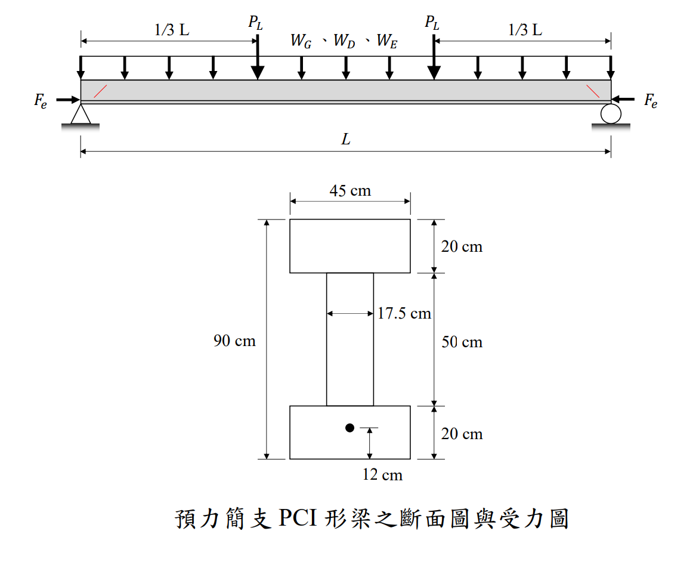

# 考題編號：RC-2022-3

**主分類：** `RC-U4-4` 預力梁剪力分析與設計
**副分類：** `RC-U2-1` RC 剪力強度分析與設計
**設計法：** USD 強度設計法
**標籤：** `預力梁` `腹剪裂縫` `Vcw` `PCI形梁` `垂直地震力` `肋筋間距` `腹剪破壞`

---

## 1. 原始題目重述 (Problem Restatement)

**題目：** 簡支預力混凝土 PCI I 形梁，地震後於距梁端一倍有效深度處出現腹剪裂縫。加入垂直向地震力後，設計 D10 肋筋間距 $s$ 以避免腹剪破壞。（25 分）

**材料強度：**
- $\gamma = 2.4 \text{ tf/m}^3$，$f'_c = 420 \text{ kgf/cm}^2$，$f_y = 4200 \text{ kgf/cm}^2$，$f_{yt} = 2800 \text{ kgf/cm}^2$
- 有效預力：$F_e = 200 \text{ tf}$（直線配置，$V_p = 0$）

**斷面幾何（PCI I 形梁，由圖讀取）：**

| 位置 | 寬度 | 厚度 | 距底高度 |
|------|------|------|---------|
| 上翼板 | 45 cm | 20 cm | 70 ~ 90 cm |
| 腹板   | 17.5 cm | 50 cm | 20 ~ 70 cm |
| 下翼板 | 12 cm | 20 cm | 0 ~ 20 cm |

**跨度與載重：**
- $L = 20$ m；臨界斷面位於距支承 $d_p = 80$ cm 處
- 靜載重：$W_D = 1.1$ tf/m（不含自重）
- 活載重：$P_L = 25$ tf（集中，位於 $L/3$ 與 $2L/3$ 各一）
- 垂直地震力：$W_E = 0.25(W_G + W_D)$（均佈）


*圖說：跨度 20 m 簡支梁，集中活載重在 L/3 與 2L/3 處各 25 tf，均佈載重含自重、靜載重與垂直地震力。*


*圖說：上翼板 45×20 cm、腹板 17.5×50 cm、下翼板 12×20 cm，總高 90 cm，預力鋼腱位於下翼板形心（距底 10 cm）。*

---

## 2. 考題核心精神與出題者意圖 (Core Concepts & Examiner's Intent)

**核心觀念：** 預力混凝土梁的**腹剪破壞**（web-shear failure）發生於支承附近高剪力低彎矩區，須以 $V_{cw}$ 公式設計肋筋。

**出題者意圖：**
1. 測驗 $V_{cw}$ 公式（含 $f_{pc}$ 項）的正確應用
2. 考驗截面特性計算（PCI I 形梁形心、有效深度 $d_p$）
3. 驗算加入垂直地震力後載重組合，求所需肋筋間距

---

## 3. 解題戰略地圖與陷阱分析 (Strategic Roadmap & Trap Analysis)

**作戰計畫：**
```
Step 1：計算截面積 A、形心 ȳ → 確認 dp 與 bw
Step 2：計算 fpc = Fe/A（形心軸壓應力）→ Vcw
Step 3：計算自重 WG → 加入 WE 求因數化均佈載重 wu
Step 4：求臨界斷面 Vu（距支承 dp = 80 cm）
Step 5：計算所需 Vs，求間距 s；驗算最大間距限制
```

**關鍵陷阱：**

| # | 陷阱 | 應對策略 |
|---|------|---------|
| ⚠1 | $d_p$ 是**頂面**到預力鋼腱形心的距離，非有效深度 $d$（RC 用法）；本題 $d_p = 90 - 10 = 80$ cm | 直接由截面幾何求出 |
| ⚠2 | $f_{pc}$ 在**形心軸**處評估：偏心矩項貢獻為 $F_e \cdot e \cdot 0/I = 0$，所以 $f_{pc} = F_e/A$ | 無需考慮偏心矩 |
| ⚠3 | $V_p$（預力垂直分量）：直線鋼腱 $V_p = 0$ | 若拋物線腱需另算；本題未給腱型，取 $V_p = 0$ |
| ⚠4 | 垂直地震力 $W_E$ 的載重組合：加入後須配合載重因數，$W_E = 0.25(W_G + W_D)$ 應以 1.2 倍（視為等效靜載重）計入 | 使用 $U = 1.2(W_G + W_D + W_E) + 1.6P_L$ |

---

## 3.5 變數層次分析 (Variable Hierarchy Analysis)

> 複習提示：第一次解題後，在每個卡住的知識點旁標記 `⚠`；第二次複習時只看有 `⚠` 的項目。

### 最終目標

`求加入垂直地震力後，D10 肋筋所需最大間距 s，以滿足 φ(Vcw + Vs) ≥ Vu`

### 本題關鍵公式（依計算順序）

$$\text{Step 1：截面積與形心} \quad A = \sum b_i h_i, \quad \bar{y} = \frac{\sum A_i \bar{y}_i}{A}$$

$$\text{Step 2：腹剪強度} \quad \boxed{V_{cw}} = (0.93\sqrt{f'_c} + 0.3\boxed{f_{pc}}) \cdot b_w \cdot d_p + V_p, \quad \boxed{f_{pc}} = \frac{F_e}{A}$$

$$\text{Step 3：因數化剪力} \quad \boxed{V_u} = \boxed{R} - w_u \cdot d_p, \quad \boxed{R} = \frac{w_u L}{2} + \sum P_u \frac{L-x_i}{L}$$

$$\text{Step 4：需求鋼筋剪力} \quad \boxed{V_s} = \frac{\boxed{V_u}}{\phi} - \boxed{V_{cw}}, \quad \phi = 0.75$$

$$\text{Step 5：肋筋間距} \quad s \le \frac{A_v \cdot f_{yt} \cdot d_p}{\boxed{V_s}}$$

---

### L1：題目直接給定

| 符號 | 數值 | 說明 |
|------|------|------|
| $L$ | 20 m | 跨度 |
| $f'_c$ | 420 kgf/cm² | 混凝土強度 |
| $f_{yt}$ | 2800 kgf/cm² | 肋筋降伏強度 |
| $F_e$ | 200 tf | 有效預力 |
| $\gamma$ | 2.4 tf/m³ | RC 單位重 |
| $W_D$ | 1.1 tf/m | 均佈靜載重 |
| $P_L$ | 25 tf × 2（在 $L/3$、$2L/3$） | 集中活載重 |
| D10 | $d_b = 0.953$ cm，$A_b = 0.7133$ cm² | 查表1 |
| 斷面 | 上翼板 45×20、腹板 17.5×50、下翼板 12×20 cm | 附圖 |

---

### L2：需知識點推導

**Step 1：截面性質**

| 符號 | 公式／來源 | 卡關? |
|------|-----------|:-----:|
| $A$ | $45\times20 + 17.5\times50 + 12\times20$ | |
| $\bar{y}$（形心距底） | $\sum A_i\bar{y}_i / A$ | |
| $d_p$（鋼腱深度距頂） | $h - $ 下翼板形心距底 $= 90 - 10$ | |
| $b_w$ | 腹板寬 17.5 cm | |

**Step 2：$f_{pc}$ 與 $V_{cw}$**

| 符號 | 公式／來源 | 卡關? |
|------|-----------|:-----:|
| $f_{pc}$ | $F_e/A$（形心軸，偏心矩項為零） | |
| $\sqrt{f'_c}$ | $\sqrt{420}$ | |
| $V_{cw}$ | $(0.93\sqrt{f'_c}+0.3f_{pc}) \cdot b_w \cdot d_p$ | |

**Step 3–4：因數化載重**

| 符號 | 公式／來源 | 卡關? |
|------|-----------|:-----:|
| $W_G$ | $A \times 10^{-4} \text{ m}^2/\text{cm}^2 \times \gamma$ | |
| $W_E$ | $0.25(W_G + W_D)$ | |
| $w_u$（均佈） | $1.2(W_G + W_D + W_E)$ | |
| $P_u$（集中） | $1.6 P_L$ | |
| $R$（支承反力） | $w_u L/2 + P_u(2/3 + 1/3)$ | |
| $V_u$（臨界斷面） | $R - w_u \cdot d_p$ | |

**Step 5：肋筋設計**

| 符號 | 公式／來源 | 卡關? |
|------|-----------|:-----:|
| $V_s$ | $V_u/\phi - V_{cw}$ | |
| $A_v$ | $2 \times 0.7133$ cm²（雙肢） | |
| $s$ | $A_v \cdot f_{yt} \cdot d_p / V_s$ | |
| $s_{max}$（若 $V_s > \frac{1}{3}\sqrt{f'_c}b_wd_p$） | $\min(0.375h, 30\text{ cm})$ | |

---

### L3：深層知識（不懂就卡住）

| 知識點 | 說明 | 卡關? |
|--------|------|:-----:|
| 腹剪裂縫 vs 彎剪裂縫 | 腹剪（web-shear）發生於高剪低彎矩區（支承附近），用 $V_{cw}$；彎剪（flexure-shear）發生於中段，用 $V_{ci}$ | |
| $f_{pc}$ 的取法 | $f_{pc}$ 是形心軸上的有效預力壓應力。在形心軸上，偏心矩項 $F_e \cdot e \cdot 0/I = 0$，故只有 $F_e/A$，與偏心量無關 | |
| 腹板寬度 $b_w$ | I 形梁剪力集中於腹板，計算 $V_{cw}$ 時用腹板寬 17.5 cm，不用翼板寬 | |
| $d_p$ 的下限 | 規範規定 $d_p \ge 0.8h$；本題 $80 \ge 0.8\times90=72$ cm ✓ | |
| 最大肋筋間距切換點 | $V_s$ 超過 $\frac{1}{3}\sqrt{f'_c}b_wd_p$ 時，最大間距從 $0.75h$ 縮為 $0.375h$ | |

---

## 4. 步驟化詳細計算過程 (Step-by-Step Detailed Calculation)

### Step 1：截面性質

**截面積：**
$$A = 45\times20 + 17.5\times50 + 12\times20 = 900 + 875 + 240 = \mathbf{2015 \text{ cm}^2}$$

**自重：**
$$W_G = A \times \gamma = 2015 \times 10^{-4} \text{ m}^2 \times 2.4 \text{ tf/m}^3 = \mathbf{0.484 \text{ tf/m}}$$

**形心距底面（$\bar{y}$）：**
$$\bar{y} = \frac{900\times80 + 875\times45 + 240\times10}{2015} = \frac{72{,}000 + 39{,}375 + 2{,}400}{2015} = \frac{113{,}775}{2015} = \mathbf{56.46 \text{ cm}}$$

**腹板寬度與有效深度：**
$$b_w = 17.5 \text{ cm}, \quad d_p = 90 - 10 = \mathbf{80 \text{ cm}} \ge 0.8h = 72 \text{ cm} \quad\checkmark$$

---

### Step 2：腹剪混凝土強度 $V_{cw}$

**形心軸預壓應力：**
$$f_{pc} = \frac{F_e}{A} = \frac{200{,}000 \text{ kgf}}{2015 \text{ cm}^2} = \mathbf{99.25 \text{ kgf/cm}^2}$$

**$V_{cw}$（取 $V_p = 0$，直線鋼腱）：**
$$V_{cw} = (0.93\sqrt{f'_c} + 0.3f_{pc})\cdot b_w \cdot d_p$$
$$= (0.93\times\sqrt{420} + 0.3\times99.25)\times17.5\times80$$
$$= (0.93\times20.49 + 29.78)\times17.5\times80$$
$$= (19.06 + 29.78)\times1400$$
$$= 48.84\times1400 = \mathbf{68{,}376 \text{ kgf} = 68.38 \text{ tf}}$$

---

### Step 3：因數化設計剪力 $V_u$

**垂直地震力：**
$$W_E = 0.25(W_G + W_D) = 0.25\times(0.484 + 1.1) = 0.25\times1.584 = \mathbf{0.396 \text{ tf/m}}$$

**因數化載重（$W_E$ 視同靜載重，以 1.2 計）：**
$$w_u = 1.2(W_G + W_D + W_E) = 1.2\times(0.484 + 1.1 + 0.396) = 1.2\times1.980 = \mathbf{2.376 \text{ tf/m}}$$
$$P_u = 1.6\times P_L = 1.6\times25 = \mathbf{40 \text{ tf}}$$

**支承反力（對稱載重）：**
$$R = \frac{w_u \cdot L}{2} + P_u\times\frac{L - L/3}{L} + P_u\times\frac{L - 2L/3}{L}$$
$$= \frac{2.376\times20}{2} + 40\times\frac{2}{3} + 40\times\frac{1}{3}$$
$$= 23.76 + 26.67 + 13.33 = \mathbf{63.76 \text{ tf}}$$

**臨界斷面剪力（距支承 $d_p = 0.8$ m，無集中載重介入）：**
$$V_u = R - w_u\times d_p = 63.76 - 2.376\times0.8 = 63.76 - 1.90 = \mathbf{61.86 \text{ tf}}$$

---

### Step 4：需求鋼筋剪力 $V_s$

$$\phi V_{cw} = 0.75\times68.38 = 51.29 \text{ tf} < V_u = 61.86 \text{ tf} \quad\Rightarrow\quad \text{需設計肋筋}$$

$$V_s \ge \frac{V_u}{\phi} - V_{cw} = \frac{61.86}{0.75} - 68.38 = 82.48 - 68.38 = \mathbf{14.10 \text{ tf} = 14{,}100 \text{ kgf}}$$

---

### Step 5：D10 肋筋間距

**D10 雙肢肋筋面積：**
$$A_v = 2\times0.7133 = 1.4266 \text{ cm}^2$$

**所需間距：**
$$s \le \frac{A_v \cdot f_{yt} \cdot d_p}{V_s} = \frac{1.4266\times2800\times80}{14{,}100} = \frac{319{,}475}{14{,}100} = \mathbf{22.7 \text{ cm}}$$

**最大間距限制：**

先判斷 $V_s$ 是否超過切換門檻：
$$\frac{1}{3}\sqrt{f'_c}\cdot b_w\cdot d_p = \frac{1}{3}\times20.49\times17.5\times80 = \mathbf{9{,}493 \text{ kgf}}$$

$$V_s = 14{,}100 > 9{,}493 \text{ kgf} \quad\Rightarrow\quad s_{\max} = \min(0.375h,\ 30\text{ cm}) = \min(33.75,\ 30) = \mathbf{30 \text{ cm}}$$

$$\text{需求間距 } 22.7 \text{ cm} < s_{\max} = 30 \text{ cm} \quad\checkmark$$

**驗算：** 採 $s = 20$ cm：
$$V_s = \frac{1.4266\times2800\times80}{20} = 15{,}974 \text{ kgf}$$

$$\phi(V_{cw}+V_s) = 0.75\times(68{,}376+15{,}974) = 0.75\times84{,}350 = 63{,}263 \text{ kgf} = 63.26 \text{ tf} > 61.86 \text{ tf} \quad\checkmark$$

$$\boxed{s \le 22.7 \text{ cm，採用 D10@20 cm}}$$

**驗算 $s = 25$ cm（不合格，供參考）：**
$$V_s = 319{,}475/25 = 12{,}779 \text{ kgf}$$
$$\phi(V_{cw}+V_s) = 0.75\times(68{,}376+12{,}779) = 60{,}866 \text{ kgf} < 61{,}860 \text{ kgf} \quad\times$$

---

## 5. 關鍵爭議點與進階探討 (Critical Issues & Advanced Discussion)

### 爭議點 1：原設計 D10@15 cm 為何尚未破壞？

**原設計（無地震，wu = 1.2×1.584 = 1.901 tf/m，Pu = 40 tf）：**
$$R_{\text{orig}} = 1.901\times10 + 40 = 59.01 \text{ tf}$$
$$V_u^{\text{orig}} = 59.01 - 1.901\times0.8 = 57.49 \text{ tf}$$
$$\phi(V_{cw}+V_s^{@15\text{cm}}) = 0.75\times(68.38 + 319.475/15) = 0.75\times(68.38+21.30) = 67.26 \text{ tf} > 57.49 \text{ tf} \quad\checkmark$$

**加入地震後（Vu = 61.86 tf）：**
$$\phi(V_{cw}+V_s^{@15\text{cm}}) = 67.26 \text{ tf} > 61.86 \text{ tf} \quad\checkmark$$

→ 即使加入地震力後，D10@15 cm 從**強度**角度仍符合。腹剪裂縫的出現更可能是**使用性問題**（裂縫寬度超限或斷面抗裂能力 $V_{cr}$ 被超越），而非達到極限強度破壞。

### 爭議點 2：$f_{pc}$ 為何只取 $F_e/A$？

預力鋼腱位於下翼板形心（$y_{\text{tendon}} = 10$ cm from bottom），偏心量 $e = \bar{y} - 10 = 46.46$ cm。計算形心軸（$y = \bar{y}$）的應力：

$$f_{pc} = \frac{F_e}{A} + \frac{F_e \cdot e \cdot (y_{\text{centroid}} - y_{\text{centroid}})}{I} = \frac{F_e}{A} + 0 = \frac{F_e}{A}$$

偏心矩項對**形心軸**的貢獻恆為零，這是 $V_{cw}$ 公式使用 $f_{pc} = F_e/A$ 的理論依據。

### 進階：垂直地震力對腹剪的物理意義

垂直地震加速度 = $0.25g$（對應本題 $W_E = 0.25W_{total}$），使支承反力增加約：
$$\Delta R = 0.25\times(W_G + W_D)\times L/2 = 0.25\times1.584\times10 = 3.96 \text{ tf}$$

即支承剪力增加約 4 tf，對原設計（裕度 ≈ 67.26 - 57.49 ≈ 9.77 tf）尚有餘裕，但加上 1.2 的放大因數後裕度縮小。
