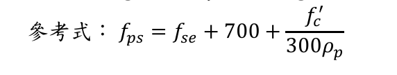

### 考題編號：RC-2023-4

**主分類：** `RC-U4-1` 預力梁斷面應力分析
**副分類：** 無
**設計法：** USD強度設計法
**標籤：** `後拉法` `無握裹鋼絞線` `fps公式` `L/dp比值` `單向版` `有效預力` `撓曲強度` `β₁折減`

---

## 1. 原始題目重述 (Problem Restatement)

簡支後拉預力混凝土單向版，條件如下：

| 參數 | 數值 |
|------|------|
| 短向跨度 $L$ | 10 m |
| 斷面深度 $h$ | 25 cm |
| 有效深度 $d_p$ | 22 cm（鋼絞線中心至壓力面距離） |
| 無握裹鋼絞線 | $A_p = 1.47 \text{ cm}^2$/根，間距 20 cm |
| 普通具握裹鋼筋 | 間距 20 cm（面積未給定） |
| 鋼絞線極限強度 | $f_{pu} = 19{,}000 \text{ kgf/cm}^2$ |
| 有效預力 | $f_{se} = 11{,}000 \text{ kgf/cm}^2$ |
| 降伏強度 | $f_{py} = 0.85 f_{pu} = 16{,}150 \text{ kgf/cm}^2$ |
| 混凝土強度 | $f'_c = 420 \text{ kgf/cm}^2$ |
| 普通鋼筋降伏強度 | $f_y = 4200 \text{ kgf/cm}^2$ |

試求此單向版的計算撓曲強度 $M_n$。（25 分）

**考題提供的參考式：**



*圖說：題目給定之無握裹後拉腱鋼絞線應力計算式。簡支梁（$L/d_p \geq 35$）用公式：$f_{ps} = f_{se} + 700 + \dfrac{f'_c}{300\rho_p}$，上限 $\leq f_{py}$ 且 $\leq f_{se} + 4200\text{ kgf/cm}^2$。懸臂梁（$L/d_p \leq 35$）則改用 $300\rho_p$ 分母改為 $300$（即 $+\dfrac{f'_c}{300}$，與簡支不同）。*

$$f_{ps} = f_{se} + 700 + \frac{f'_c}{300\rho_p}$$

> **注意：** 普通具握裹鋼筋的斷面積未於題目中給定，本解析僅計算**無握裹鋼絞線的撓曲強度貢獻**。$f_y = 4200$ kgf/cm² 係供最小握裹鋼筋量驗核之用。

---

## 2. 考題核心精神與出題者意圖 (Core Concepts & Examiner's Intent)

**核心觀念：** 後拉無握裹腱與有握裹腱的根本差異在於**應力傳遞機制**：
- 有握裹腱：透過握裹力，在極限狀態下用應變相容求 $f_{ps}$
- 無握裹腱：全長自由滑動，無法用應變相容；必須用 **ACI 經驗公式** 求 $f_{ps}$，且 $f_{ps}$ 與**跨度深度比 $L/d_p$** 相關

**出題者測驗：**
1. 能否正確識別 $L/d_p$ 比值並選用正確的 $f_{ps}$ 公式（$100\rho_p$ vs. $300\rho_p$）
2. $f_{ps}$ 的兩個上限值檢核
3. 高強度混凝土的 $\beta_1$ 折減計算（$f'_c = 420 > 280$ kgf/cm²）
4. 單向版撓曲強度的計算（以每根絞線的條帶寬為分析單元）

---

## 3. 解題戰略地圖與陷阱分析 (Strategic Roadmap & Trap Analysis)

**作戰計畫：**

```
Step 1：計算 L/dp → 判斷 fps 公式係數（100 or 300）
     ↓
Step 2：計算 ρp（以 20 cm 條帶為單元）
     ↓
Step 3：代入 fps 公式 → 驗核兩個上限
     ↓
Step 4：計算 β₁（f'c = 420 > 280，需折減）
     ↓
Step 5：Whitney 應力塊求 a
     ↓
Step 6：Mn = Ap × fps × (dp - a/2)，乘以條帶倍數換算每米寬
```

**關鍵陷阱：**

| 陷阱 | 說明 | 應對策略 |
|------|------|---------|
| ⚠ 混用 100 和 300 係數 | $L/d_p \leq 35$ 用 100；$L/d_p > 35$ 用 300（細長構件延伸量小） | 先計算 $L/d_p = 1000/22 = 45.45 > 35$ → 用 300 |
| ⚠ 遺漏 fps 上限檢核 | $f_{ps}$ 不得超過 $f_{py}$ 及 $f_{se} + 4200$ | 兩個上限都要驗算 |
| ⚠ β₁ 未折減 | $f'_c = 420 > 280$ kgf/cm²，每增加 70 kgf/cm² 折減 0.05 | $\beta_1 = 0.85 - 0.05 \times (420-280)/70 = 0.75$ |
| ⚠ 無握裹腱不能用應變相容求 fps | 無握裹腱全長自由滑動，不存在局部應變；必須用 ACI 經驗公式 | fps 公式是唯一合法方法 |
| ⚠ 分析寬度 b | 題目給的是每根絞線的條帶（20 cm），$\rho_p$ 和 $M_n$ 的計算基準要一致 | 用 $b = 20$ cm 算 $\rho_p$，算出的 $M_n$ 再乘 5 換成每米寬 |

---

## 3.5 變數層次分析（Variable Hierarchy Analysis）

> 複習提示：第一次解題後，在每個卡住的知識點旁標記 `⚠`；第二次複習時只看有 `⚠` 的項目。

### 最終目標

`計算無握裹後拉預力單向版的計算撓曲強度 Mn（每米寬）`

### 本題關鍵公式（依計算順序）

$$\text{Step 1: 判斷} \frac{L}{d_p} > 35 \Rightarrow f_{ps} = f_{se} + 700 + \frac{f'_c}{300\rho_p}$$

$$\text{Step 2: } \rho_p = \frac{A_p}{b \cdot d_p}$$

$$\text{Step 3: 驗核 } f_{ps} \leq \min(f_{py},\ f_{se} + 4200)$$

$$\text{Step 4: } a = \frac{A_p \cdot \boxed{f_{ps}}}{0.85 f'_c \cdot b}$$

$$\text{Step 5: } M_n = A_p \cdot f_{ps} \cdot \!\left(d_p - \frac{\boxed{a}}{2}\right)$$

### L1：題目直接給定

| 符號 | 數值 | 說明 |
|------|------|------|
| $L$ | 1000 cm | 跨度 |
| $d_p$ | 22 cm | 鋼絞線有效深度 |
| $A_p$ | 1.47 cm² | 每根鋼絞線面積 |
| 間距 | 20 cm | 鋼絞線（及握裹鋼筋）間距 |
| $f_{pu}$ | 19,000 kgf/cm² | 鋼絞線極限強度 |
| $f_{se}$ | 11,000 kgf/cm² | 有效預力（長期損失後） |
| $f_{py}$ | 0.85 × 19,000 = 16,150 kgf/cm² | 鋼絞線降伏強度 |
| $f'_c$ | 420 kgf/cm² | 混凝土強度 |
| $\varepsilon_{cu}$ | 0.003 | 規範極限壓應變 |

### L2：需知識點推導

**Step 1：fps 公式係數判斷**

| 符號 | 公式／來源 | 卡關? |
|------|-----------|:-----:|
| $L/d_p$ | $1000/22 = 45.45$；$> 35$ → 係數 **300** | |
| $\rho_p$ | $A_p/(b \cdot d_p) = 1.47/(20 \times 22)$ | |
| $f_{ps}$ | $f_{se} + 700 + f'_c/(300\rho_p)$ | |
| $f_{ps}$ 上限 1 | $f_{py} = 0.85 f_{pu} = 16{,}150$ kgf/cm² | |
| $f_{ps}$ 上限 2 | $f_{se} + 4{,}200 = 15{,}200$ kgf/cm² | |

**Step 2：應力塊計算**

| 符號 | 公式／來源 | 卡關? |
|------|-----------|:-----:|
| $\beta_1$ | $0.85 - 0.05(f'_c - 280)/70$，下限 0.65 | |
| $a$ | $A_p f_{ps}/(0.85 f'_c b)$ | |
| $c$ | $a/\beta_1$（供驗核用） | |

**Step 3：標稱彎矩**

| 符號 | 公式／來源 | 卡關? |
|------|-----------|:-----:|
| $M_n$（20 cm 條帶） | $A_p \cdot f_{ps} \cdot (d_p - a/2)$ | |
| $M_n$（每米寬） | $M_n \times (100/20)$ | |

### L3：深層知識（不懂就卡住）

| 知識點 | 說明 | 卡關? |
|--------|------|:-----:|
| 無握裹腱為何用經驗公式？ | 無握裹腱全長自由滑動，不存在「截面應變相容」，極限狀態的 $\Delta f_p$ 由跨度整體伸長量決定，因此 ACI 以 L/dp 為參數的經驗式代替應變計算 | |
| $L/d_p$ 比值的物理意義 | 跨度越長（$L/d_p$ 大），絞線伸長量被「稀釋」到更長的自由長度，所以 $f_{ps}$ 提升量越小 → 用更大分母（300 vs 100） | |
| $\beta_1$ 折減規則 | CNS 1480：$f'_c = 280 \Rightarrow \beta_1 = 0.85$；每增加 70 kgf/cm²，$\beta_1$ 減 0.05，下限 0.65；$f'_c = 420$：$\beta_1 = 0.75$ | |
| $f_{ps}$ 的兩個上限意義 | $f_{ps} \leq f_{py}$：腱不得超過降伏；$f_{ps} \leq f_{se} + 4200$：防止過大應力增量（對應 ACI 限制 $\Delta f_p \leq 420$ MPa） | |

---

## 4. 步驟化詳細計算過程 (Step-by-Step Detailed Calculation)

> **分析單元：** 取單根鋼絞線對應的 20 cm 條帶（$b = 20$ cm）進行計算。

### Step 1：判斷 $f_{ps}$ 公式係數

$$\frac{L}{d_p} = \frac{1000 \text{ cm}}{22 \text{ cm}} = 45.45 > 35$$

$$\Rightarrow \text{使用 } \mathbf{300} \text{ 係數：} f_{ps} = f_{se} + 700 + \frac{f'_c}{300\rho_p}$$

---

### Step 2：計算 $\rho_p$

$$\rho_p = \frac{A_p}{b \cdot d_p} = \frac{1.47}{20 \times 22} = \frac{1.47}{440} = 3.341 \times 10^{-3}$$

---

### Step 3：計算 $f_{ps}$ 並驗核上限

$$\frac{f'_c}{300\rho_p} = \frac{420}{300 \times 3.341 \times 10^{-3}} = \frac{420}{1.0023} = 419.0 \text{ kgf/cm}^2$$

$$f_{ps} = 11{,}000 + 700 + 419.0 = \mathbf{12{,}119 \text{ kgf/cm}^2}$$

**驗核兩個上限：**

| 上限條件 | 限制值 | 是否滿足 |
|---------|-------|:-------:|
| $f_{ps} \leq f_{py}$ | $0.85 \times 19{,}000 = 16{,}150$ kgf/cm² | ✓ |
| $f_{ps} \leq f_{se} + 4200$ | $11{,}000 + 4{,}200 = 15{,}200$ kgf/cm² | ✓ |

$f_{ps} = 12{,}119 \text{ kgf/cm}^2$ 控制。

---

### Step 4：材料常數 $\beta_1$

$$\beta_1 = 0.85 - 0.05 \times \frac{f'_c - 280}{70} = 0.85 - 0.05 \times \frac{420 - 280}{70} = 0.85 - 0.05 \times 2 = \mathbf{0.75}$$

---

### Step 5：Whitney 應力塊深度 $a$

$$a = \frac{A_p \cdot f_{ps}}{0.85 \cdot f'_c \cdot b} = \frac{1.47 \times 12{,}119}{0.85 \times 420 \times 20} = \frac{17{,}815}{7{,}140} = \mathbf{2.495 \text{ cm}}$$

**驗核中性軸深度：**

$$c = \frac{a}{\beta_1} = \frac{2.495}{0.75} = 3.327 \text{ cm} \ll d_p = 22 \text{ cm} \checkmark \text{（壓力區遠小於有效深度）}$$

---

### Step 6：計算 $M_n$

**每 20 cm 條帶：**

$$M_n = A_p \cdot f_{ps} \cdot \left(d_p - \frac{a}{2}\right) = 1.47 \times 12{,}119 \times \left(22 - \frac{2.495}{2}\right)$$

$$= 17{,}815 \times (22 - 1.248) = 17{,}815 \times 20.752$$

$$= 369{,}686 \text{ kgf·cm} \approx 3{,}697 \text{ kgf·m} = 3.70 \text{ tf·m（每 20 cm 寬）}$$

**換算每米寬（×5 倍）：**

$$\boxed{M_n = 369{,}686 \times 5 = 1{,}848{,}430 \text{ kgf·cm/m} \approx 18{,}484 \text{ kgf·m/m} \approx \mathbf{18.5 \text{ tf·m/m}}}$$

---

### 計算彙整表

| 項目 | 數值 |
|------|:---:|
| $L/d_p$ | 45.45（> 35 → 係數 300） |
| $\rho_p$ | $3.341 \times 10^{-3}$ |
| $f_{ps}$ | 12,119 kgf/cm²（< 兩個上限 ✓） |
| $\beta_1$ | 0.75（$f'_c = 420 > 280$） |
| $a$ | 2.495 cm |
| $c$ | 3.327 cm |
| **$M_n$（每 20 cm 帶）** | **3.70 tf·m** |
| **$M_n$（每 1 m 寬）** | **18.5 tf·m/m** |

---

## 5. 關鍵爭議點與進階探討 (Critical Issues & Advanced Discussion)

**1. 為何用 300 而非 100？**

ACI 318（CNS 1480 土木401-110 §20.3.2.4）對無握裹腱區分兩種係數：
$$\frac{L}{d_p} \leq 35 \Rightarrow f_{ps} = f_{se} + 700 + \frac{f'_c}{100\rho_p}$$
$$\frac{L}{d_p} > 35 \Rightarrow f_{ps} = f_{se} + 700 + \frac{f'_c}{300\rho_p}$$

本題 $L/d_p = 45.45 > 35$，用 300。直覺理解：跨度越長，同樣的絕對伸長量 $\Delta L$ 被分配到更長的自由長度，單位伸長應變 $\Delta L/L$ 越小，$\Delta f_{ps}$ 越小。

**2. 普通具握裹鋼筋的處理**

題目提及「普通具握裹鋼筋」但未給面積，因此本解析僅計算無握裹鋼絞線的貢獻。若依最小握裹鋼筋量（ACI 9.6.3.2）配置，以 $f_y = 4200$ kgf/cm² 計，其貢獻相對預應力部分較小，且題目以 $M_n$ 命名（非 $\phi M_n$），暗示主要考核的是 $f_{ps}$ 計算流程。

實際計算若已知 $A_s$：
$$M_n = A_p f_{ps}\!\left(d_p - \frac{a}{2}\right) + A_s f_y\!\left(d - \frac{a}{2}\right)$$
$$a = \frac{A_p f_{ps} + A_s f_y}{0.85 f'_c b}$$

**3. $\beta_1 = 0.75$ 的影響**

$f'_c = 420$ kgf/cm² 對應 $\beta_1 = 0.75$（非常規的 0.85）。本題 $a = 2.5$ cm 非常小，此影響有限；但若 $f'_c$ 更高或鋼筋量更多，$\beta_1$ 的折減會顯著影響 $c$ 值及應變計算。

**4. 考場最安全作法**

1. **先算 $L/d_p$** → 決定係數後再代公式（常見錯誤：不計算就直接用 100）
2. **兩個上限都要寫出**，即使兩者都滿足也要展示驗核過程
3. **$\beta_1$ 折減**：$f'_c > 280$ 時必須折減，本題 $f'_c = 420$ 非常罕見（高強度），考試時要特別小心
4. $M_n$ 的單位：單向版通常以「每米寬」表示，記得說明換算過程
