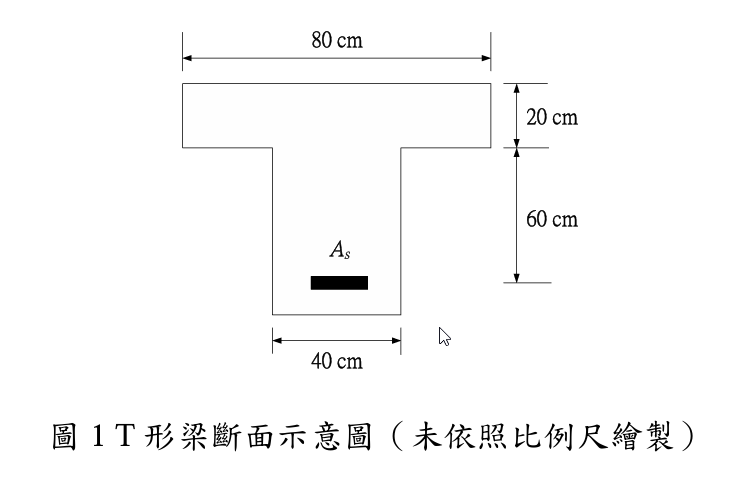

# 考題編號：RC-2024-1

**主分類：** `RC-U1-1` RC 梁彎矩強度分析與設計
**副分類：** 無
**設計法：** USD 強度設計法
**標籤：** `T形梁` `最大鋼筋量` `最小鋼筋量` `平衡鋼筋量` `Whitney應力塊` `β1係數` `延性控制` `高強度鋼筋`

---

## 1. 原始題目重述 (Problem Restatement)

某一左右對稱 T 形梁斷面，幾何尺寸如圖 1 所示。



*圖說：T形梁斷面，翼板有效寬度 $b = 80\ \text{cm}$，翼板厚度 $h_f = 20\ \text{cm}$，腹板高度 $60\ \text{cm}$，腹板寬度 $b_w = 40\ \text{cm}$，總深度 $h = 80\ \text{cm}$，受拉鋼筋 $A_s$ 位於腹板底部（假設有效深度 $d = 74\ \text{cm}$，自底面至 $A_s$ 形心保護層厚度 $\approx 6\ \text{cm}$）。*

**【小題一】** 採中強度鋼筋（$f_y = 4200\ \text{kgf/cm}^2$，$E_s = 2.04 \times 10^6\ \text{kgf/cm}^2$）、混凝土（$f'_c = 280\ \text{kgf/cm}^2$，$\varepsilon_u = 0.003$），依規範（土木 401-112）計算：
- (a) 最大鋼筋量 $A_{s,\max}$
- (b) 最小鋼筋量 $A_{s,\min}$

**【小題二】** 改用高強度鋼筋（$f_y = 6900\ \text{kgf/cm}^2$，$E_s = 2.04 \times 10^6\ \text{kgf/cm}^2$）及較低強度混凝土（$f'_c = 210\ \text{kgf/cm}^2$，$\varepsilon_u = 0.004$），斷面不變，計算：
- (a) 平衡鋼筋量 $A_{s,b}$
- (b) 最大鋼筋量 $A_{s,\max}$

> **假設說明：** 題目未明確標示有效深度 $d$，本解析採 $d = h - 6\ \text{cm} = 74\ \text{cm}$（自底面至 $A_s$ 形心距離 $= 6\ \text{cm}$）。

---

## 2. 考題核心精神與出題者意圖 (Core Concepts & Examiner's Intent)

**核心觀念：** T 形梁的最大、最小、平衡鋼筋量計算，以及當材料參數（$f_y$、$f'_c$、$\varepsilon_u$）改變時，如何系統性修正計算流程。

**出題意圖：**
1. 測試學生能否判斷「中性軸在翼板內或腹板內」並切換計算模式
2. 測試 $\varepsilon_u = 0.004$（非標準值）時的平衡條件修正
3. 高強度鋼筋 $f_y = 6900$ 導致 $\varepsilon_y > \varepsilon_u(\text{Case 1})$，學生必須重新計算 $\varepsilon_y$ 而非套用舊公式
4. 最大鋼筋量（$\varepsilon_t \geq 0.004$）在 $\varepsilon_u = 0.004$ 的情況下的邊界意義

---

## 3. 解題戰略地圖與陷阱分析 (Strategic Roadmap & Trap Analysis)

**作戰計畫：**
```
Step 1：確定 β1（依 f'c 大小）
Step 2（Case 1 最大）：由 εt = 0.004 → c_max → a_max → 判斷 NA 位置 → 求壓力 → As,max
Step 3（Case 1 最小）：公式 max(0.8√f'c/fy, 14/fy) × bw × d
Step 4（Case 2 平衡）：由 εu/(εu+εy) → cb → ab → 判斷 NA 位置 → As,b
Step 5（Case 2 最大）：同 Step 2 但用 εu=0.004
```

**關鍵陷阱：**

| # | 陷阱 | 正確做法 |
|---|------|---------|
| ①  | 最大鋼筋量直接套 $\rho_{max} = 0.75\rho_b$（舊 ACI 法）| 土木401-112 改用 $\varepsilon_t \geq 0.004$ 控制，$c_{max}/d = \varepsilon_u/(\varepsilon_u+0.004)$ |
| ② | 假設 $a \leq h_f$ 不驗算就套矩形梁公式 | 計算 $a_{max}$ 後必須與 $h_f=20\ \text{cm}$ 比較，本題均 $>h_f$，需用 T 形梁公式 |
| ③ | 最小鋼筋量用翼板寬 $b$ 而非腹板寬 $b_w$ | 依規範明確使用 $b_w$ |
| ④ | Case 2 的 $\varepsilon_u=0.004$ 認為是打字錯誤 | 這是本題刻意設定，影響 $c_b$ 公式與最大鋼筋量條件 |

---

## 3.5 變數層次分析（Variable Hierarchy Analysis）

> 複習提示：第一次解題後，在每個卡住的知識點旁標記 `⚠`；第二次複習時只看有 `⚠` 的項目。

### 最終目標

`Case 1：計算 As,max（εt≥0.004 限制）與 As,min（規範下限）`
`Case 2：計算 As,b（平衡狀態）與 As,max（εt≥0.004 限制，εu=0.004）`

### 本題關鍵公式鏈

$$\text{Case 1 最大：} c_{max} = \frac{\varepsilon_u}{\varepsilon_u+0.004} \cdot d \xrightarrow{\times \beta_1} \boxed{a_{max}} \xrightarrow{\text{T形壓力}} C = 0.85f'_c[(b-b_w)h_f + b_w \boxed{a_{max}}] \xrightarrow{\div f_y} A_{s,max}$$

$$\text{Case 1 最小：} A_{s,min} = \max\!\left(\frac{0.8\sqrt{f'_c}}{f_y},\ \frac{14}{f_y}\right) \cdot b_w \cdot d$$

$$\text{Case 2 平衡：} c_b = \frac{\varepsilon_u}{\varepsilon_u + \boxed{\varepsilon_y}} \cdot d \xrightarrow{\times \beta_1} \boxed{a_b} \xrightarrow{\text{T形壓力}} C_b \xrightarrow{\div f_y} A_{s,b}$$

$$\text{Case 2 最大：} c_{max} = \frac{\varepsilon_u}{\varepsilon_u+0.004} \cdot d = \frac{0.004}{0.008} \cdot d = 0.5d$$

### L1：題目直接給定

| 符號 | 數值（Case 1） | 數值（Case 2） | 說明 |
|------|:---:|:---:|------|
| $b$ | 80 cm | 80 cm | T 形梁翼板寬度 |
| $h_f$ | 20 cm | 20 cm | 翼板厚度 |
| $b_w$ | 40 cm | 40 cm | 腹板寬度 |
| $h$ | 80 cm | 80 cm | 總深度（20+60） |
| $d$ | 74 cm（假設） | 74 cm（假設） | 有效深度 |
| $f'_c$ | 280 kgf/cm² | 210 kgf/cm² | 混凝土抗壓強度 |
| $f_y$ | 4200 kgf/cm² | 6900 kgf/cm² | 鋼筋降伏強度 |
| $E_s$ | 2.04×10⁶ kgf/cm² | 2.04×10⁶ kgf/cm² | 鋼筋彈性模數 |
| $\varepsilon_u$ | 0.003 | 0.004 | 混凝土極限壓應變 |

### L2：需知識點推導

**Step A：β₁ 係數**

| 符號 | 公式/來源 | 卡關? |
|------|----------|:-----:|
| $\beta_1$ | $f'_c \leq 280\ \text{kgf/cm}^2 \Rightarrow \beta_1=0.85$；每增加 $70\ \text{kgf/cm}^2$ 減 $0.05$ | |

**Step B：Case 1 最大鋼筋量**

| 符號 | 公式/來源 | 卡關? |
|------|----------|:-----:|
| $c_{max}$ | $\varepsilon_u/(\varepsilon_u+0.004) \cdot d = (3/7) \times 74 = 31.71\ \text{cm}$ | |
| $a_{max}$ | $\beta_1 \cdot c_{max} = 0.85 \times 31.71 = 26.96\ \text{cm}$ | |
| 判斷 | $a_{max}=26.96 > h_f=20 \Rightarrow$ NA 在腹板，T 形梁行為 | |
| $C_{total}$ | $0.85f'_c[(b-b_w)h_f + b_w \cdot a_{max}]$ | |
| $A_{s,max}$ | $C_{total}/f_y$ | |

**Step C：Case 1 最小鋼筋量**

| 符號 | 公式/來源 | 卡關? |
|------|----------|:-----:|
| $0.8\sqrt{f'_c}/f_y$ | $0.8\times16.73/4200 = 0.003187$ | |
| $14/f_y$ | $14/4200 = 0.003333$ → 控制 | |
| $A_{s,min}$ | $0.003333 \times b_w \times d$ | |

**Step D：Case 2 鋼筋降伏應變**

| 符號 | 公式/來源 | 卡關? |
|------|----------|:-----:|
| $\varepsilon_y$ | $f_y/E_s = 6900/(2.04\times10^6) = 0.003382$ | |

**Step E：Case 2 平衡鋼筋量**

| 符號 | 公式/來源 | 卡關? |
|------|----------|:-----:|
| $c_b$ | $\varepsilon_u/(\varepsilon_u+\varepsilon_y) \cdot d = 0.004/0.007382 \times 74 = 40.10\ \text{cm}$ | |
| $a_b$ | $\beta_1 \cdot c_b = 0.85 \times 40.10 = 34.09\ \text{cm}$ | |
| 判斷 | $a_b=34.09 > h_f=20 \Rightarrow$ T 形梁行為 | |
| $A_{s,b}$ | $0.85f'_c[(b-b_w)h_f + b_w \cdot a_b]/f_y$ | |

**Step F：Case 2 最大鋼筋量**

| 符號 | 公式/來源 | 卡關? |
|------|----------|:-----:|
| $c_{max}$ | $\varepsilon_u/(\varepsilon_u+0.004) \cdot d = 0.004/0.008 \times 74 = 37\ \text{cm}$ | |
| $a_{max}$ | $0.85 \times 37 = 31.45\ \text{cm} > h_f$ → T 形梁 | |
| $A_{s,max}$ | $0.85f'_c[(b-b_w)h_f + b_w \cdot a_{max}]/f_y$ | |

### L3：深層知識（不懂就卡住）

| 知識點 | 說明 | 卡關? |
|--------|------|:-----:|
| 土木401-112 改用 $\varepsilon_t \geq 0.004$ 替代 $0.75\rho_b$ | 舊ACI 318-99 用 $\rho_{max}=0.75\rho_b$；新版改用淨拉應變控制，兩者結果不同 | |
| T 形梁 NA 位置判斷 | $a \leq h_f$ → 矩形梁（用 $b$）；$a > h_f$ → T形梁壓力公式（分翼板+腹板兩部分） | |
| $\varepsilon_u$ 非標準值的影響 | 公式 $c_b = \varepsilon_u d/(\varepsilon_u+\varepsilon_y)$ 需用題目給定的 $\varepsilon_u$，不可固定套 0.003 | |
| 最小鋼筋量用 $b_w$ 不用 $b$ | T 形梁翼板屬壓力區，裂縫後受拉區接近腹板，故最小鋼筋量以 $b_w$ 計算 | |
| Case 2 驗證：$A_{s,max} < A_{s,b}$ | 當 $\varepsilon_u=0.004$ 且最大鋼筋條件同為 $\varepsilon_t=0.004$，$c_{max}/d=0.5 < c_b/d=0.542$，故 $A_{s,max} < A_{s,b}$（合理） | |

---

## 4. 步驟化詳細計算過程 (Step-by-Step Detailed Calculation)

### 前置：斷面幾何確認

$$b = 80\ \text{cm},\quad h_f = 20\ \text{cm},\quad b_w = 40\ \text{cm},\quad h = 80\ \text{cm}$$

$$d = 74\ \text{cm} \quad \text{（假設保護層 + 箍筋 + 主筋半徑} \approx 6\ \text{cm）}$$

---

### 【Case 1】$f_y = 4200\ \text{kgf/cm}^2$，$f'_c = 280\ \text{kgf/cm}^2$，$\varepsilon_u = 0.003$

**Step A1：β₁ 係數**

$$f'_c = 280\ \text{kgf/cm}^2 \leq 280\ \text{kgf/cm}^2 \Rightarrow \boxed{\beta_1 = 0.85}$$

**Step A2：最大鋼筋量**（土木401-112：$\varepsilon_t \geq 0.004$）

最大鋼筋量對應 $\varepsilon_t = 0.004$（最小淨拉應變），中性軸深度：

$$c_{max} = \frac{\varepsilon_u}{\varepsilon_u + 0.004} \cdot d = \frac{0.003}{0.003 + 0.004} \times 74 = \frac{3}{7} \times 74 = 31.71\ \text{cm}$$

等值應力塊深度：

$$a_{max} = \beta_1 \cdot c_{max} = 0.85 \times 31.71 = \mathbf{26.96\ \text{cm}}$$

**判斷 NA 位置：** $a_{max} = 26.96\ \text{cm} > h_f = 20\ \text{cm}$ → 中性軸在腹板，T 形梁行為

壓力合力（分翼板懸挑部分 + 腹板部分）：

$$C = 0.85 f'_c \left[(b - b_w) \cdot h_f + b_w \cdot a_{max}\right]$$

$$= 0.85 \times 280 \times \left[(80-40) \times 20 + 40 \times 26.96\right]$$

$$= 238 \times \left[800 + 1078.4\right] = 238 \times 1878.4$$

$$= 447{,}060\ \text{kgf}$$

最大鋼筋量（$T = C$，鋼筋已降伏）：

$$\boxed{A_{s,max} = \frac{C}{f_y} = \frac{447{,}060}{4200} \approx 106.4\ \text{cm}^2}$$

---

**Step A3：最小鋼筋量**（土木401-112 Section 9.6.1）

$$A_{s,min} = \max\!\left(\frac{0.8\sqrt{f'_c}}{f_y},\ \frac{14}{f_y}\right) \cdot b_w \cdot d$$

各值計算：

$$\frac{0.8\sqrt{280}}{4200} = \frac{0.8 \times 16.73}{4200} = \frac{13.39}{4200} = 0.003187$$

$$\frac{14}{4200} = 0.003333 \quad \text{← 控制}$$

$$\boxed{A_{s,min} = 0.003333 \times 40 \times 74 = 9.87\ \text{cm}^2}$$

---

### 【Case 2】$f_y = 6900\ \text{kgf/cm}^2$，$f'_c = 210\ \text{kgf/cm}^2$，$\varepsilon_u = 0.004$

**Step B1：基本材料參數**

$$\beta_1：f'_c = 210\ \text{kgf/cm}^2 < 280\ \text{kgf/cm}^2 \Rightarrow \beta_1 = 0.85$$

$$\varepsilon_y = \frac{f_y}{E_s} = \frac{6900}{2.04 \times 10^6} = 0.003382$$

**Step B2：平衡鋼筋量**（平衡條件：$\varepsilon_s = \varepsilon_y$，$\varepsilon_c = \varepsilon_u = 0.004$）

$$c_b = \frac{\varepsilon_u}{\varepsilon_u + \varepsilon_y} \cdot d = \frac{0.004}{0.004 + 0.003382} \times 74 = \frac{0.004}{0.007382} \times 74 = 0.5419 \times 74 = 40.10\ \text{cm}$$

$$a_b = \beta_1 \cdot c_b = 0.85 \times 40.10 = \mathbf{34.09\ \text{cm}}$$

**判斷 NA 位置：** $a_b = 34.09\ \text{cm} > h_f = 20\ \text{cm}$ → T 形梁行為

壓力合力：

$$C_b = 0.85 \times 210 \times \left[(80-40) \times 20 + 40 \times 34.09\right]$$

$$= 178.5 \times \left[800 + 1363.6\right] = 178.5 \times 2163.6$$

$$= 386{,}203\ \text{kgf}$$

平衡鋼筋量：

$$\boxed{A_{s,b} = \frac{386{,}203}{6900} \approx 56.0\ \text{cm}^2}$$

---

**Step B3：最大鋼筋量**（$\varepsilon_t \geq 0.004$，$\varepsilon_u = 0.004$）

$$c_{max} = \frac{\varepsilon_u}{\varepsilon_u + 0.004} \cdot d = \frac{0.004}{0.004 + 0.004} \times 74 = 0.5 \times 74 = 37.0\ \text{cm}$$

$$a_{max} = 0.85 \times 37.0 = 31.45\ \text{cm} > h_f = 20\ \text{cm} \Rightarrow \text{T 形梁行為}$$

壓力合力：

$$C_{max} = 178.5 \times \left[(80-40) \times 20 + 40 \times 31.45\right]$$

$$= 178.5 \times \left[800 + 1258.0\right] = 178.5 \times 2058.0$$

$$= 367{,}353\ \text{kgf}$$

最大鋼筋量：

$$\boxed{A_{s,max} = \frac{367{,}353}{6900} \approx 53.2\ \text{cm}^2}$$

**合理性檢驗：** $A_{s,max} = 53.2 < A_{s,b} = 56.0\ \text{cm}^2$ ✓（最大鋼筋量應小於平衡鋼筋量）

---

### 結果彙整

| 項目 | 說明 | 結果 |
|------|------|------|
| Case 1 $A_{s,max}$ | $f_y=4200$，$f'_c=280$，$\varepsilon_u=0.003$，$\varepsilon_t=0.004$ 控制 | **106.4 cm²** |
| Case 1 $A_{s,min}$ | $14/f_y \times b_w \times d$ 控制 | **9.87 cm²** |
| Case 2 $A_{s,b}$ | $f_y=6900$，$f'_c=210$，$\varepsilon_u=0.004$，平衡條件 | **56.0 cm²** |
| Case 2 $A_{s,max}$ | $\varepsilon_t=0.004$ 控制，$c_{max}=0.5d$ | **53.2 cm²** |

---

## 5. 關鍵爭議點與進階探討 (Critical Issues & Advanced Discussion)

**爭議點 1：有效深度 $d$ 未明確給定**

考場上的安全做法：若題目未標示 $d$，應在答案卷上清楚寫明「設 $d = h - 6 = 74\ \text{cm}$」，以使閱卷委員了解假設基礎。部分考生可能採 $d = 70\ \text{cm}$ 或 $d = 75\ \text{cm}$，方法相同即可得分。

**爭議點 2：最大鋼筋量的規範依據**

土木401-112（2023 年版）已取消舊 ACI 318-99 的 $\rho_{max} = 0.75\rho_b$ 規定，改用淨拉應變條件 $\varepsilon_t \geq 0.004$。考生應注意：
- $\varepsilon_t \geq 0.005$：拉力控制斷面，$\phi = 0.90$
- $0.004 \leq \varepsilon_t < 0.005$：過渡區，$\phi$ 線性內插
- $\varepsilon_t < 0.004$：梁設計**不允許**（壓力控制，延性不足）

**進階：Case 2 為何 $A_{s,max} < A_{s,b}$？**

當 $\varepsilon_u = 0.004$ 時，最大鋼筋條件 $\varepsilon_t = 0.004$ 使 $c_{max}/d = 0.5$，而平衡條件中 $\varepsilon_y = 0.003382 < 0.004 = \varepsilon_u$，導致 $c_b/d = 0.5419 > 0.5$。因此最大鋼筋量的中性軸反而比平衡條件更高（壓力區更小），導致 $A_{s,max} < A_{s,b}$。這與 Case 1（$\varepsilon_u = 0.003$，$\varepsilon_y = fy/Es \approx 0.00206 < 0.003$）相反，是高強度鋼筋的特殊現象。
