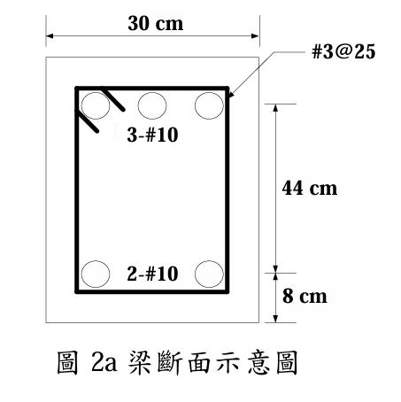
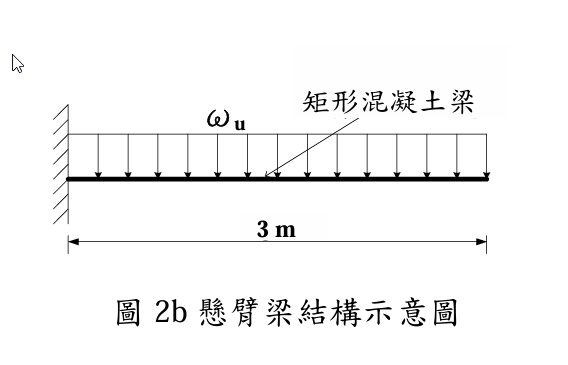

# 考題編號：RC-2024-2

**主分類：** `RC-U1-1` RC 梁彎矩強度分析與設計
**副分類：** 無
**設計法：** USD 強度設計法
**標籤：** `雙筋梁` `壓力鋼筋應力` `壓力鋼筋未降伏` `懸臂梁` `因數化均佈載重` `標稱彎矩強度` `應變相容`

---

## 1. 原始題目重述 (Problem Restatement)

懸臂梁，採中強度鋼筋（$f_y = 4200\ \text{kgf/cm}^2$，$E_s = 2.04 \times 10^6\ \text{kgf/cm}^2$），斷面如圖 2a，混凝土 $f'_c = 210\ \text{kgf/cm}^2$，$\varepsilon_u = 0.003$。**下方斷面為受壓力**（懸臂梁固定端，頂部拉力、底部壓力）。

鋼筋斷面積：#10 (D32) = 8.14 cm²；#3 (D10) = 0.71 cm²



*圖說：矩形梁斷面，$b = 30\ \text{cm}$，總深 $h \approx 52\ \text{cm}$。底部壓力區有 $A'_s = 2\text{-\#10} = 16.28\ \text{cm}^2$，$d' = 8\ \text{cm}$（壓力面至壓力鋼筋形心）；頂部拉力鋼筋 $A_s = 3\text{-\#10} = 24.42\ \text{cm}^2$，$d = 44\ \text{cm}$（壓力面至拉力筋形心）。箍筋 #3@25 cm。*



*圖說：懸臂梁，固定端在左，自由端在右，梁長 $L = 3\ \text{m} = 300\ \text{cm}$，承受均佈因數化載重 $\omega_u$（包含自重、靜載重、活載重）向下作用。最大彎矩發生在固定端，$M_u = \omega_u L^2 / 2$。*

**【小題一】** 考慮壓力鋼筋之貢獻，計算：
- (a) 斷面標稱彎矩強度 $\phi M_n$
- (b) 壓力鋼筋應力 $f'_s$

**【小題二】** 梁長 $L = 3\ \text{m}$，計算最大因數化均佈載重 $\omega_u$（含自重）。

---

## 2. 考題核心精神與出題者意圖 (Core Concepts & Examiner's Intent)

**核心觀念：** 雙筋梁分析，重點在**壓力鋼筋是否降伏**的判斷與迭代求解。

**出題意圖：**
1. 測試是否能先假設壓力鋼筋降伏，再用應變相容驗證（本題壓力鋼筋**不降伏**）
2. 懸臂梁的方向感——底部壓力代表固定端的負彎矩區，d 與 d' 從壓力面量起
3. 由 $\phi M_n$ 推算最大因數化均佈載重（懸臂梁力矩公式）

---

## 3. 解題戰略地圖與陷阱分析 (Strategic Roadmap & Trap Analysis)

**作戰計畫：**
```
Step 1：假設壓力鋼筋降伏 → 求 a → 求 c → 檢核 ε's
Step 2：ε's < εy → 壓力鋼筋不降伏 → 列應變相容方程式
Step 3：解二次方程求 c → 算 f's、a
Step 4：驗算拉力鋼筋確實降伏 (εt > εy)
Step 5：算 Mn、φMn
Step 6：懸臂梁 Mu = ωu × L²/2 → 求 ωu
```

**關鍵陷阱：**

| # | 陷阱 | 正確做法 |
|---|------|---------|
| ① | 假設壓力鋼筋降伏，c = 7.52 cm < d' = 8 cm → 矛盾 | 先驗算 $c$ 與 $d'$ 大小，矛盾則重解（應變相容法） |
| ② | 懸臂梁力矩公式搞錯：Mu = ωuL（點載）vs $\omega_u L^2/2$（均佈） | 均佈：$M_u = \omega_u L^2/2$ |
| ③ | 忘記壓力面在「底部」，d 從底部量 = 44 cm | 方向正確：$d = 44\ \text{cm}$，$d' = 8\ \text{cm}$ 均自底部（壓力面）量 |
| ④ | φ 值用錯（應查 εt 確認拉力控制） | $\varepsilon_t = 0.0067 > 0.005$ → 拉力控制 → $\phi = 0.90$ |

---

## 3.5 變數層次分析（Variable Hierarchy Analysis）

> 複習提示：第一次解題後，在每個卡住的知識點旁標記 `⚠`；第二次複習時只看有 `⚠` 的項目。

### 最終目標

`求斷面 φMn 與壓力鋼筋應力 f's → 推導最大因數化均佈載重 ωu`

### 本題關鍵公式鏈

$$\text{Step 1（假設降伏驗算）：} a_0 = \frac{(A_s - A'_s)f_y}{0.85 f'_c b} \rightarrow c_0 = \frac{a_0}{\beta_1} \xrightarrow{\text{若 }c_0 < d'} \text{壓力筋未進入壓力區 → 應變相容}$$

$$\text{Step 2（應變相容）：} 0.85f'_c b \beta_1 c + A'_s E_s \varepsilon_u \frac{c-d'}{c} = A_s f_y \Rightarrow \boxed{c}$$

$$\text{Step 3：} f'_s = E_s \varepsilon_u \frac{\boxed{c}-d'}{c},\quad M_n = 0.85f'_c b \boxed{a}\left(d-\frac{\boxed{a}}{2}\right) + A'_s \boxed{f'_s}(d - d')$$

$$\text{Step 4：} \phi M_n \geq M_u = \omega_u \frac{L^2}{2} \Rightarrow \omega_{u,\max} = \frac{2\phi M_n}{L^2}$$

### L1：題目直接給定

| 符號 | 數值 | 說明 |
|------|:----:|------|
| $b$ | 30 cm | 梁寬 |
| $d$ | 44 cm | 壓力面（底）→ 拉力筋（頂）距離 |
| $d'$ | 8 cm | 壓力面（底）→ 壓力筋（底部鋼筋）距離 |
| $A_s$ | 3×8.14 = 24.42 cm² | 頂部拉力鋼筋（3-#10） |
| $A'_s$ | 2×8.14 = 16.28 cm² | 底部壓力鋼筋（2-#10） |
| $f'_c$ | 210 kgf/cm² | 混凝土抗壓強度 |
| $f_y$ | 4200 kgf/cm² | 鋼筋降伏強度 |
| $E_s$ | 2.04×10⁶ kgf/cm² | 鋼筋彈性模數 |
| $\varepsilon_u$ | 0.003 | 混凝土極限壓應變 |
| $L$ | 300 cm | 懸臂梁長度 |

### L2：需知識點推導

**Step A：先假設壓力鋼筋降伏（快速檢核）**

| 符號 | 公式/來源 | 卡關? |
|------|----------|:-----:|
| $\beta_1$ | $f'_c=210 < 280 \Rightarrow \beta_1=0.85$ | |
| $a_0$（試算） | $(A_s - A'_s)f_y / (0.85f'_c b) = 8.14\times4200/(0.85\times210\times30)=6.39\ \text{cm}$ | |
| $c_0$（試算） | $a_0/\beta_1 = 6.39/0.85 = 7.52\ \text{cm}$ | |
| 判斷 | $c_0 = 7.52 < d' = 8\ \text{cm}$ → **壓力筋在拉力區，假設錯誤** | |

**Step B：應變相容求 c**

| 符號 | 公式/來源 | 卡關? |
|------|----------|:-----:|
| 方程式 | $4551.75c^2 - 2930.4c - 797{,}069 = 0$ | |
| $c$ | 正根：$c = 13.56\ \text{cm}$ | |
| $a$ | $\beta_1 \cdot c = 0.85 \times 13.56 = 11.53\ \text{cm}$ | |

**Step C：壓力鋼筋應力與強度驗算**

| 符號 | 公式/來源 | 卡關? |
|------|----------|:-----:|
| $f'_s$ | $E_s \varepsilon_u (c-d')/c = 6120\times5.56/13.56 = 2{,}509\ \text{kgf/cm}^2$ | |
| 驗算 | $f'_s = 2509 < f_y = 4200$ ✓（假設不降伏正確） | |
| $\varepsilon_t$ | $0.003\times(44-13.56)/13.56 = 0.00673 > 0.005$ → $\phi=0.90$ | |

**Step D：標稱彎矩與因數化載重**

| 符號 | 公式/來源 | 卡關? |
|------|----------|:-----:|
| $M_n$ | $C_c(d-a/2) + C'_s(d-d')$ | |
| $\phi M_n$ | $0.90 \times M_n$ | |
| $\omega_{u,\max}$ | $2\phi M_n / L^2$ | |

### L3：深層知識（不懂就卡住）

| 知識點 | 說明 | 卡關? |
|--------|------|:-----:|
| 壓力鋼筋降伏判斷流程 | 先假設降伏求 $c_0$，若 $c_0 < d'$ 則不在壓力區，必須用應變相容迭代 | |
| 壓力鋼筋不降伏的應變公式 | $\varepsilon'_s = \varepsilon_u(c-d')/c$，正值 = 壓縮，負值 = 受拉 | |
| 懸臂梁的 d 定義方向 | 底部受壓時 $d$ 從底部量起（與一般梁相反），錯方向會得到錯誤的 $M_n$ | |
| 應變相容二次方程的來源 | 把 $a = \beta_1 c$、$f'_s = E_s \varepsilon_u (c-d')/c$ 代入力平衡方程，得到 $c$ 的二次式 | |

---

## 4. 步驟化詳細計算過程 (Step-by-Step Detailed Calculation)

### 前置：斷面確認

$$b = 30\ \text{cm},\quad d = 44\ \text{cm},\quad d' = 8\ \text{cm}$$
$$A_s = 3 \times 8.14 = 24.42\ \text{cm}^2 \text{（頂部，拉力）}$$
$$A'_s = 2 \times 8.14 = 16.28\ \text{cm}^2 \text{（底部，壓力）}$$
$$\beta_1 = 0.85\ (f'_c = 210 < 280\ \text{kgf/cm}^2)$$

---

### Step 1：先假設壓力鋼筋降伏（$f'_s = f_y$）

若壓力鋼筋降伏，由力平衡：

$$0.85 f'_c b a + A'_s f_y = A_s f_y$$

$$a_0 = \frac{(A_s - A'_s)f_y}{0.85 f'_c b} = \frac{(24.42 - 16.28) \times 4200}{0.85 \times 210 \times 30} = \frac{8.14 \times 4200}{5355} = \frac{34{,}188}{5355} = 6.39\ \text{cm}$$

$$c_0 = \frac{a_0}{\beta_1} = \frac{6.39}{0.85} = 7.52\ \text{cm}$$

**檢核：** $c_0 = 7.52\ \text{cm} < d' = 8\ \text{cm}$ → **壓力鋼筋在中性軸以上（拉力側），假設矛盾！**

→ 壓力鋼筋**不降伏**，需用應變相容法。

---

### Step 2：應變相容法（壓力鋼筋未降伏）

壓力鋼筋應力（以 $c$ 為未知數）：

$$f'_s = E_s \varepsilon_u \frac{c - d'}{c} = 2.04 \times 10^6 \times 0.003 \times \frac{c-8}{c} = 6120 \cdot \frac{c-8}{c}\ [\text{kgf/cm}^2]$$

力平衡（壓 = 拉）：

$$0.85 f'_c \cdot b \cdot \beta_1 c + A'_s \cdot f'_s = A_s \cdot f_y$$

$$0.85 \times 210 \times 30 \times 0.85 \cdot c + 16.28 \times 6120 \cdot \frac{c-8}{c} = 24.42 \times 4200$$

$$4551.75c + 99{,}634 \cdot \frac{c-8}{c} = 102{,}564$$

兩邊乘以 $c$：

$$4551.75c^2 + 99{,}634c - 797{,}072 = 102{,}564c$$

$$\boxed{4551.75c^2 - 2930c - 797{,}072 = 0}$$

解二次方程（取正根）：

$$c = \frac{2930 + \sqrt{2930^2 + 4 \times 4551.75 \times 797{,}072}}{2 \times 4551.75}$$

$$= \frac{2930 + \sqrt{8{,}584{,}900 + 14{,}512{,}153{,}200}}{9103.5}$$

$$= \frac{2930 + \sqrt{14{,}520{,}738{,}100}}{9103.5} = \frac{2930 + 120{,}503}{9103.5}$$

$$\boxed{c = \frac{123{,}433}{9103.5} \approx 13.56\ \text{cm}}$$

$$a = \beta_1 \cdot c = 0.85 \times 13.56 = \mathbf{11.53\ \text{cm}}$$

---

### Step 3：壓力鋼筋應力

$$f'_s = 6120 \times \frac{13.56 - 8}{13.56} = 6120 \times \frac{5.56}{13.56} = 6120 \times 0.410 = \boxed{2{,}509\ \text{kgf/cm}^2}$$

**驗算：** $f'_s = 2509 < f_y = 4200\ \text{kgf/cm}^2$ ✓（壓力鋼筋不降伏，假設正確）

---

### Step 4：驗算拉力鋼筋降伏與 φ 值

$$\varepsilon_t = \varepsilon_u \times \frac{d - c}{c} = 0.003 \times \frac{44 - 13.56}{13.56} = 0.003 \times 2.244 = 0.00673$$

$$\varepsilon_y = \frac{f_y}{E_s} = \frac{4200}{2{,}040{,}000} = 0.00206$$

$\varepsilon_t = 0.00673 > \varepsilon_y = 0.00206$ → 拉力鋼筋**降伏** ✓

$\varepsilon_t = 0.00673 > 0.005$ → **拉力控制斷面** → $\phi = 0.90$

---

### Step 5：計算內力與 $\phi M_n$

$$C_c = 0.85 f'_c \cdot b \cdot a = 0.85 \times 210 \times 30 \times 11.53 = 5355 \times 11.53 = 61{,}744\ \text{kgf}$$

$$C'_s = A'_s \cdot f'_s = 16.28 \times 2509 = 40{,}847\ \text{kgf}$$

$$T = A_s \cdot f_y = 24.42 \times 4200 = 102{,}564\ \text{kgf}$$

**平衡驗算：** $C_c + C'_s = 61{,}744 + 40{,}847 = 102{,}591 \approx T = 102{,}564\ \text{kgf}$ ✓

**取矩於拉力鋼筋 $A_s$：**

$$M_n = C_c \left(d - \frac{a}{2}\right) + C'_s (d - d')$$

$$= 61{,}744 \times \left(44 - \frac{11.53}{2}\right) + 40{,}847 \times (44 - 8)$$

$$= 61{,}744 \times 38.235 + 40{,}847 \times 36$$

$$= 2{,}360{,}804 + 1{,}470{,}492$$

$$= 3{,}831{,}296\ \text{kgf-cm}$$

$$\boxed{\phi M_n = 0.90 \times 3{,}831{,}296 = 3{,}448{,}166\ \text{kgf-cm} \approx 34{,}482\ \text{kgf-m} \approx 34.5\ \text{tf-m}}$$

---

### Step 6：最大因數化均佈載重 $\omega_u$

懸臂梁固定端彎矩（均佈載重）：

$$M_u = \frac{\omega_u L^2}{2}$$

令 $M_u = \phi M_n$：

$$\omega_u = \frac{2\phi M_n}{L^2} = \frac{2 \times 3{,}448{,}166}{300^2} = \frac{6{,}896{,}332}{90{,}000} = 76.6\ \text{kgf/cm}$$

$$\boxed{\omega_{u,\max} = 76.6\ \text{kgf/cm} = 7{,}660\ \text{kgf/m} \approx 7.66\ \text{tf/m}}$$

---

### 結果彙整

| 項目 | 結果 |
|------|------|
| 壓力鋼筋應力 $f'_s$ | **2,509 kgf/cm²**（未降伏，$< f_y = 4200$） |
| 設計彎矩強度 $\phi M_n$ | **34.5 tf-m**（= 3,448,166 kgf-cm） |
| 最大因數化均佈載重 $\omega_{u,\max}$ | **7,660 kgf/m = 7.66 tf/m** |

---

## 5. 關鍵爭議點與進階探討 (Critical Issues & Advanced Discussion)

**爭議點 1：壓力鋼筋降伏判斷為何用「試誤法」？**

若先假設降伏並得到 $c_0 < d'$，表示假設的壓力合力過大（多算了 $A'_s f_y$），導致所需混凝土壓力不足，NA 位置偏淺。正確做法是讓 $f'_s$ 隨應變線性變化，列方程求真實 $c$。考場上若無法快速解二次方程，可用迭代法（猜 $c$ → 算 $f'_s$ → 驗平衡）。

**爭議點 2：d 與 d' 的量測方向**

本題底部受壓，所有「有效深度」均從**底部**量起：
- $d = 44\ \text{cm}$（底→頂拉力鋼筋形心）
- $d' = 8\ \text{cm}$（底→底壓力鋼筋形心）

若誤從頂部量起，方向矛盾，整題計算錯誤。

**進階：φ 值選取**

$\varepsilon_t = 0.0067 > 0.005$ → 拉力控制 → $\phi = 0.90$。若 $\varepsilon_t$ 在過渡區（0.004–0.005），需線性內插：
$$\phi = 0.65 + (\varepsilon_t - 0.002) \times \frac{0.25}{0.003}\ \ (\text{箍筋柱型式})$$
$$\text{或}\ \phi = 0.75 + (\varepsilon_t - 0.002) \times \frac{0.15}{0.003}\ \ (\text{梁型式，取決於規範版本})$$
本題 $\varepsilon_t$ 遠超臨界值，不需內插。
