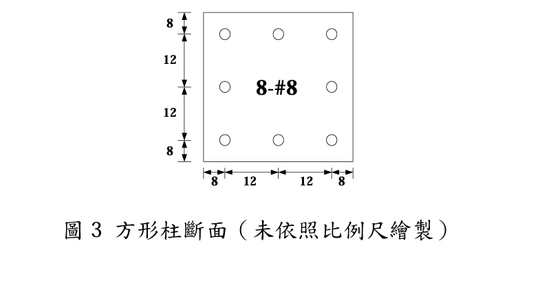

# 考題編號：RC-2024-3

**主分類：** `RC-U1-2` RC 柱強度分析與設計
**副分類：** 無
**設計法：** USD 強度設計法
**標籤：** `方形柱` `P-M互制` `拉力鋼筋應變為零` `應變相容` `壓力鋼筋未降伏` `中性軸深度` `軸力彎矩組合`

---

## 1. 原始題目重述 (Problem Restatement)

40 cm × 40 cm 方形柱斷面，配置 8-#8（D25）主筋，斷面如圖 3。材料性質：$f'_c = 280\ \text{kgf/cm}^2$，$f_y = 4200\ \text{kgf/cm}^2$，$E_s = 2.04 \times 10^6\ \text{kgf/cm}^2$，$\varepsilon_u = 0.003$。



*圖說：方形柱 $b = h = 40\ \text{cm}$，8-#8 主筋，$d_b = 2.54\ \text{cm}$，$A_b = 5.07\ \text{cm}^2$。鋼筋布置（自頂部壓力面量起）：頂排 3 根在 $y_1 = 8\ \text{cm}$；中排 2 根在 $y_2 = 20\ \text{cm}$（柱形心層）；底排 3 根在 $y_3 = 32\ \text{cm}$。水平方向：$x = 8, 20, 32\ \text{cm}$（頂底排均為 3 根；中排僅兩側各 1 根）。*

**條件：** 柱受軸力與**單向彎矩**（繞水平軸，頂部受壓）；柱破壞時**拉力鋼筋（底排）應變恰為零**。

計算：
- (a) 此條件下斷面承受之軸力 $P_n$
- (b) 此條件下斷面承受之彎矩 $M_n$

---

## 2. 考題核心精神與出題者意圖 (Core Concepts & Examiner's Intent)

**核心觀念：** P-M 互制圖上的特殊點——「拉力鋼筋應變 = 0」等同於中性軸剛好落在底排鋼筋處，此為平衡點（$\varepsilon_t = \varepsilon_y$）與純壓縮點之間的某個位置，是直接用應變相容求解的題型。

**出題意圖：**
1. 測試學生能否正確設定應變圖（c = dt = 32 cm）
2. 測試各排鋼筋應變計算與降伏判斷
3. 注意壓力鋼筋位於應力塊內，需減去混凝土已計算的 $0.85f'_c$ 貢獻
4. 考驗力矩計算方向感（取矩於形心軸）

---

## 3. 解題戰略地圖與陷阱分析 (Strategic Roadmap & Trap Analysis)

**作戰計畫：**
```
Step 1：確定 c = dt = 32 cm（εt = 0 → NA 在底排）
Step 2：計算各排鋼筋應變，判斷降伏
Step 3：計算各排鋼筋有效應力（壓力筋在應力塊內需減 0.85f'c）
Step 4：算 Pn（軸力平衡）
Step 5：算 Mn（對形心取矩）
```

**關鍵陷阱：**

| # | 陷阱 | 正確做法 |
|---|------|---------|
| ① | 應變圖設定錯誤（c 不等於 dt） | $\varepsilon_t = 0$ 且假設線性應變 → $c = d_t = 32\ \text{cm}$ |
| ② | 壓力鋼筋應力計算時忘記減去 $0.85f'_c$（鋼筋在應力塊內已有混凝土應力） | 壓力筋在塊內：$f_{s,\text{net}} = f_s - 0.85f'_c$ |
| ③ | 底排鋼筋（εt=0）誤以為有拉力貢獻 | $f_t = E_s \times 0 = 0$，底排鋼筋對力矩**無貢獻** |
| ④ | 中排鋼筋（位於形心）取矩貢獻 = 0 但軸力貢獻 ≠ 0 | 計算 Pn 時中排鋼筋要加入；計算 Mn 時力臂為 0 |

---

## 3.5 變數層次分析（Variable Hierarchy Analysis）

> 複習提示：第一次解題後，在每個卡住的知識點旁標記 `⚠`；第二次複習時只看有 `⚠` 的項目。

### 最終目標

`由 εt = 0 的幾何條件確定 c → 計算各排鋼筋應力 → 求解 Pn 與 Mn`

### 本題關鍵公式鏈

$$\varepsilon_t = 0 \Rightarrow c = d_t = 32\ \text{cm} \Rightarrow a = \beta_1 c = 27.2\ \text{cm}$$

$$\varepsilon_{s,i} = \varepsilon_u \cdot \frac{c - y_i}{c},\quad f_{s,i} = \min(E_s \varepsilon_{s,i},\ f_y)$$

$$P_n = 0.85f'_c b a + \sum_i A_{s,i}(f_{s,i} - 0.85f'_c)\big|_{y_i \leq a} + \sum_j A_{s,j} f_{s,j}\big|_{y_j > a}$$

$$M_n = 0.85f'_c b a \!\left(\frac{h}{2}-\frac{a}{2}\right) + \sum_i A_{s,i}(f_{s,i}-0.85f'_c)\!\left(\frac{h}{2}-y_i\right)\bigg|_{y_i \leq a}$$

### L1：題目直接給定

| 符號 | 數值 | 說明 |
|------|:----:|------|
| $b = h$ | 40 cm | 方形柱邊長 |
| $y_1$ | 8 cm（頂排，from top） | 壓力面→頂排鋼筋距離 |
| $y_2$ | 20 cm（中排，形心） | 壓力面→中排鋼筋距離 |
| $y_3$ | 32 cm（底排） | 壓力面→底排鋼筋距離 |
| $A_{s1}$ | 3×5.07=15.21 cm² | 頂排 3-#8 面積 |
| $A_{s2}$ | 2×5.07=10.14 cm² | 中排 2-#8 面積 |
| $A_{s3}$ | 3×5.07=15.21 cm² | 底排 3-#8 面積 |
| $f'_c$ | 280 kgf/cm² | 混凝土抗壓強度 |
| $f_y$ | 4200 kgf/cm² | 鋼筋降伏強度 |
| $\varepsilon_u$ | 0.003 | 混凝土極限壓應變 |
| $\varepsilon_t$ | 0（題目條件） | 底排鋼筋應變 |

### L2：需知識點推導

**Step A：由 εt=0 確定 c**

| 符號 | 公式/來源 | 卡關? |
|------|----------|:-----:|
| $c$ | $\varepsilon_t=0$ 且線性應變 $\Rightarrow c = y_3 = 32\ \text{cm}$ | |
| $\beta_1$ | $f'_c=280\ \text{kgf/cm}^2 \leq 280 \Rightarrow \beta_1=0.85$ | |
| $a$ | $\beta_1 \times c = 0.85 \times 32 = 27.2\ \text{cm}$ | |

**Step B：各排鋼筋應變與應力**

| 排次 | $y_i$ | $\varepsilon_{s,i}$ | $\varepsilon_y$? | $f_{s,i}$ | 在塊內? |
|------|:---:|:---:|:---:|:---:|:---:|
| 頂排 | 8 cm | $0.003\times24/32 = 0.00225$ | $>0.002059$ ✓降伏 | 4200 kgf/cm² | $y_1=8<a=27.2$ ✓ |
| 中排 | 20 cm | $0.003\times12/32 = 0.001125$ | $<0.002059$ 未降伏 | 2295 kgf/cm² | $y_2=20<27.2$ ✓ |
| 底排 | 32 cm | 0（題目給定） | — | 0 | $y_3=32>27.2$ ✗ |

**Step C：有效鋼筋力（在塊內需減 0.85f'c）**

| 排次 | 公式 | 數值 |
|------|------|------|
| 頂排 | $A_{s1}(f_{s1}-0.85f'_c)=15.21\times3962$ | 60,262 kgf（壓） |
| 中排 | $A_{s2}(f_{s2}-0.85f'_c)=10.14\times2057$ | 20,858 kgf（壓） |
| 底排 | $A_{s3}\times0=0$ | 0 |

### L3：深層知識（不懂就卡住）

| 知識點 | 說明 | 卡關? |
|--------|------|:-----:|
| 應變為零等於中性軸在該層 | 線性應變分布：$\varepsilon = \varepsilon_u(c-y)/c = 0 \Rightarrow y = c$ | |
| 鋼筋在壓力塊內需減 $0.85f'_c$ | 混凝土壓力公式 $0.85f'_c \times b \times a$ 已計算了包含鋼筋所在的混凝土面積，鋼筋的淨貢獻為 $(f_s - 0.85f'_c)$ | |
| 中排鋼筋在 P-M 計算中的分工 | 中排位於形心 → 對 $M_n$ 力臂=0（無力矩貢獻）；但仍有軸力貢獻 | |
| $\varepsilon_y$ 的計算 | $\varepsilon_y = f_y/E_s = 4200/2{,}040{,}000 = 0.002059$；不可假設固定為 0.002 | |

---

## 4. 步驟化詳細計算過程 (Step-by-Step Detailed Calculation)

### Step 1：確定中性軸深度 c

題目條件：拉力鋼筋（底排，$y_3 = 32\ \text{cm}$）應變 $\varepsilon_t = 0$。

由線性應變分布（壓力面在頂部，$\varepsilon_u = 0.003$）：

$$\frac{\varepsilon_u}{c} = \frac{\varepsilon_u - \varepsilon_t}{c - y_3} \Rightarrow \varepsilon_t = 0 \Rightarrow \boxed{c = y_3 = 32\ \text{cm}}$$

等值應力塊深度（$f'_c = 280 \leq 280\ \text{kgf/cm}^2$，$\beta_1 = 0.85$）：

$$a = \beta_1 \cdot c = 0.85 \times 32 = \mathbf{27.2\ \text{cm}}$$

---

### Step 2：各排鋼筋應變

$$\varepsilon_y = \frac{f_y}{E_s} = \frac{4200}{2{,}040{,}000} = 0.002059$$

**頂排**（$y_1 = 8\ \text{cm}$，在壓力塊內 $8 < 27.2$）：

$$\varepsilon_{s1} = \varepsilon_u \cdot \frac{c - y_1}{c} = 0.003 \times \frac{32 - 8}{32} = 0.003 \times 0.75 = 0.00225\ \text{（壓縮）}$$

$\varepsilon_{s1} = 0.00225 > \varepsilon_y = 0.002059$ → **頂排降伏** → $f_{s1} = f_y = 4200\ \text{kgf/cm}^2$

**中排**（$y_2 = 20\ \text{cm}$，在壓力塊內 $20 < 27.2$）：

$$\varepsilon_{s2} = 0.003 \times \frac{32 - 20}{32} = 0.003 \times 0.375 = 0.001125\ \text{（壓縮）}$$

$\varepsilon_{s2} = 0.001125 < \varepsilon_y$ → **中排未降伏**

$$f_{s2} = E_s \varepsilon_{s2} = 2{,}040{,}000 \times 0.001125 = 2{,}295\ \text{kgf/cm}^2\ \text{（壓縮）}$$

**底排**（$y_3 = 32\ \text{cm}$，在壓力塊外 $32 > 27.2$）：

$$\varepsilon_t = 0 \Rightarrow f_t = 0\ \text{（零應力）}$$

---

### Step 3：計算各力（鋼筋在壓力塊內減去混凝土貢獻）

**混凝土壓力合力：**

$$C_c = 0.85 f'_c \cdot b \cdot a = 0.85 \times 280 \times 40 \times 27.2 = 238 \times 40 \times 27.2$$

$$= 9{,}520 \times 27.2 = 258{,}944\ \text{kgf}$$

（作用點：距頂部 $a/2 = 13.6\ \text{cm}$）

**頂排鋼筋淨壓力**（在塊內，$y_1=8 < a=27.2$）：

$$C_{s1} = A_{s1}(f_{s1} - 0.85f'_c) = 15.21 \times (4200 - 238) = 15.21 \times 3962 = 60{,}262\ \text{kgf}$$

**中排鋼筋淨壓力**（在塊內，$y_2=20 < a=27.2$）：

$$C_{s2} = A_{s2}(f_{s2} - 0.85f'_c) = 10.14 \times (2295 - 238) = 10.14 \times 2057 = 20{,}858\ \text{kgf}$$

**底排鋼筋力** = 0（$f_t = 0$）

---

### Step 4：標稱軸力 $P_n$

$$P_n = C_c + C_{s1} + C_{s2} = 258{,}944 + 60{,}262 + 20{,}858$$

$$\boxed{P_n = 340{,}064\ \text{kgf} \approx 340.1\ \text{tf}\ (\text{壓力})}$$

---

### Step 5：標稱彎矩 $M_n$（對形心軸取矩，形心在 $h/2 = 20\ \text{cm}$ from top）

各力的力臂（以形心為原點，正方向朝壓力端）：

| 力 | 作用位置 | 力臂 = 20 - 位置 | 方向 |
|---|---|---|---|
| $C_c = 258{,}944$ kgf | $13.6$ cm from top | $20 - 13.6 = +6.4$ cm | 正彎矩 |
| $C_{s1} = 60{,}262$ kgf | $8$ cm from top | $20 - 8 = +12$ cm | 正彎矩 |
| $C_{s2} = 20{,}858$ kgf | $20$ cm from top | $20 - 20 = 0$ | 無力矩 |
| $F_{s3} = 0$ | $32$ cm from top | $32 - 20 = 12$ cm | 零力 |

$$M_n = C_c \times 6.4 + C_{s1} \times 12 + C_{s2} \times 0$$

$$= 258{,}944 \times 6.4 + 60{,}262 \times 12$$

$$= 1{,}657{,}242 + 723{,}144$$

$$\boxed{M_n = 2{,}380{,}386\ \text{kgf-cm} \approx 23{,}804\ \text{kgf-m} \approx 23.8\ \text{tf-m}}$$

---

### 結果彙整

| 項目 | 計算值 |
|------|--------|
| 中性軸深度 $c$ | 32 cm（= 底排鋼筋位置） |
| 等值應力塊深度 $a$ | 27.2 cm |
| 頂排鋼筋應力 $f_{s1}$ | 4200 kgf/cm²（降伏） |
| 中排鋼筋應力 $f_{s2}$ | 2295 kgf/cm²（未降伏） |
| 底排鋼筋應力 $f_{t}$ | 0（應變為零） |
| 標稱軸力 $P_n$ | **340 tf（壓力）** |
| 標稱彎矩 $M_n$ | **23.8 tf-m** |
| 偏心距 $e = M_n/P_n$ | $\approx 7.0\ \text{cm}$ |

---

## 5. 關鍵爭議點與進階探討 (Critical Issues & Advanced Discussion)

**爭議點 1：此點在 P-M 互制圖上的位置**

$\varepsilon_t = 0$ 對應中性軸在最外側拉力筋位置。在 P-M 互制圖上，這個點位於**平衡點（$\varepsilon_t = \varepsilon_y$）與純壓點之間**（但偏向平衡點側，比平衡點軸力更大）。與平衡點比較：平衡點的 $c_b = \varepsilon_u d/(\varepsilon_u + \varepsilon_y) = 0.003\times32/0.005059 = 18.97\ \text{cm} < c = 32\ \text{cm}$，確認本題 $c > c_b$，軸力 $P_n > P_{nb}$（壓力控制區）。

**爭議點 2：壓力鋼筋淨貢獻 $(f_s - 0.85f'_c)$ 的意義**

混凝土壓力公式 $C_c = 0.85f'_c \times b \times a$ 計算了**整個 b×a 面積的平均壓力**，包含鋼筋所在位置的混凝土。鋼筋實際上置換了部分混凝土，因此鋼筋的淨貢獻為：
$$C_{s,\text{net}} = A_s \cdot f_s - A_s \cdot 0.85f'_c = A_s(f_s - 0.85f'_c)$$

若忽略此修正（簡化法）：$P_n = 340{,}064 + 15.21\times238 + 10.14\times238 \approx 346{,}270\ \text{kgf}$（誤差約 1.8%）。考場允許簡化，但精確法得分更高。

**進階：為何中排鋼筋對彎矩無貢獻？**

中排鋼筋（$y_2 = 20\ \text{cm}$）恰好位於斷面形心（$h/2 = 20\ \text{cm}$），其對形心的力臂為零。中排鋼筋**只增加軸力**（$C_{s2} = 20{,}858\ \text{kgf}$）而不改變彎矩。這是方形柱對稱配筋的特點：若無側向彎矩，中間層鋼筋的力矩貢獻恰好相消。
